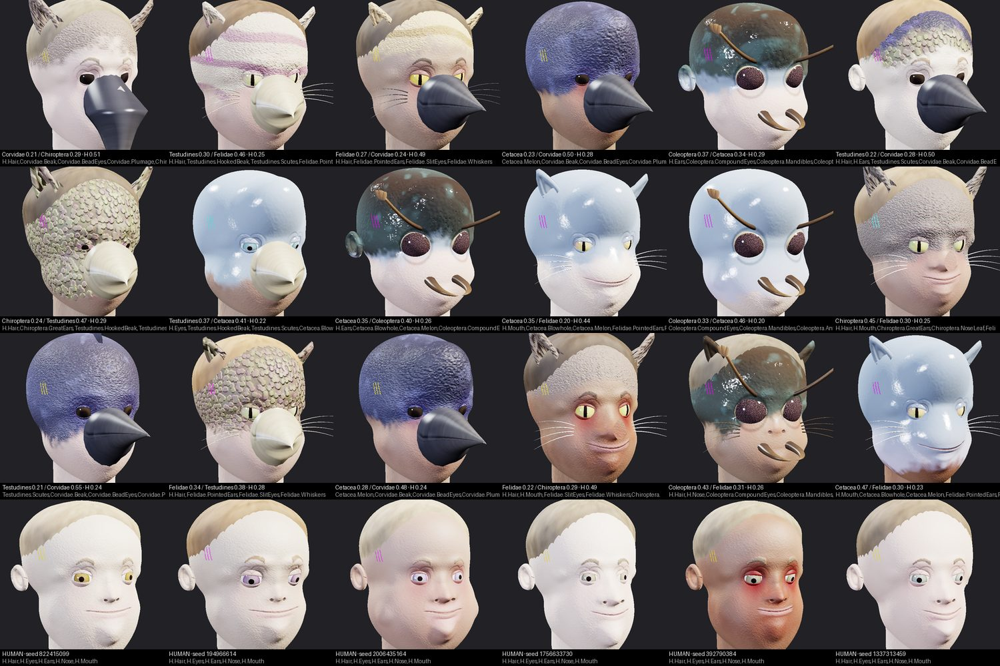

# CHARACTERS.md — the chimeric character generator (derisking spike)

**Question the spike exists to answer:** *do these read as people you could care about?*
**Deliverable:** a contact sheet of 18 chimeras + 6 pure-human controls baked from one seed, a
blind toggle, and a single-face inspector — `FrogletTools ▸ Characters ▸ Chimera Character Creator`.
**Deletable in one command:** `rm -rf Assets/_Scripts/Controller/Characters Assets/_Scripts/Editor/Characters`.
No existing file was modified.

> **Verification status.** Nothing in this branch has been opened in the Unity editor. The
> runtime core, the editor code and the edit-mode tests were **compiled with Roslyn against
> API stubs** and the shipped test suite was **executed** (27 of 28 pass offline; the 28th reads
> a palette asset through `AssetDatabase` and is editor-only). The two contact sheets beside this
> file are rendered by an **offline rasterizer** over the exact generator output — a simulation
> of the `PreviewRenderUtility` bake with roughly the same lights, not the engine. The first
> in-editor bake is the human gate; §7 says what to look at.

 · blind version: `Docs~/CHARACTERS_offline_sheet_blind.jpg` (the `~` folder is invisible to Unity, so the images carry no `.meta`)

---

## 1. The model, and where the categorical / continuous line fell

Three weighted sources — human, clade A, clade B — summing to 1, each in **[0.20, 0.60]**
(`CharacterWeights`). Every source is always present; none can dominate.

**Continuous traits ride a 20-axis blend space on one shared base head** (`HeadAxis`,
`HeadShape`): cranial height/width/length, forehead bulge (the melon), brow ridge, orbital
spacing/size/depth, cheekbones, muzzle length/width, nose projection/width, lip fullness, mouth
width, jaw width, chin projection, lower-face height, neck thickness/length. The resolver blends
the human's rolled proportions with each clade's authored targets under an effective weight
`w^γ` (γ = 0.72 by default, so a 0.20 clade is still visible).

**Categorical traits swap in as discrete geometry and are never blended** (`FeatureKind`):
beak, mandibles, compound eyes, nose leaf, antennae, crest, blowhole, whiskers, fangs, pinnae,
hair cap — and *removals* (external-ear absence is a claim on the Ears slot with no geometry).

**Where the line fell, and why.** The line is *does interpolation produce a thing that exists?*
A muzzle at 40% is a shorter muzzle — real animals span that range — so it is an axis. A beak at
40% is nothing, so it is a swap. Two cases were argued and moved:

- **Eyes are categorical at the level of the ORGAN, continuous at the level of its size.** The
  vertebrate eye (eyeball + lids) and the compound eye are different objects, so `Eyes` is a slot;
  but eye size, spacing and socket depth are axes, and pupil shape / iris colour are data on the
  winning eye trait. Blending a compound eye toward a vertebrate one gives neither — same reason
  as the beak.
- **The pinna is ONE generator with data**, not three. Human, felid and chiropteran ears differ
  in height, point, cup, tragus and where they attach (`EarSide` vs `EarTop` with a site pitch),
  and every one of those tolerates interpolation *within* the generator. What does not tolerate
  it is *which ear*, so the Ears slot still resolves one winner and the winner's data is used
  whole. This is the pattern for future clades: prefer a parameterised generator + a slot over a
  new generator.
- **Coverings (skin / fur / feathers / scales / chitin / hide) are REGIONAL, not averaged.** A
  clade's covering starts at its anchor (the crown) and reaches toward the face as its weight
  rises (`CoveringRecipe.ReachDegAtMin/Max`, noisy edge). 40% of a feather is not a feather, so
  the texture obeys the same rule the geometry does.

**Weight buys traits.** Each clade's `Traits` list is a ladder, signature first. Rung *i* of *N*
is expressed at weight ≥ `0.20 + 0.40·i/N`; a trait flagged `Signature` is expressed at any
weight. An expressed trait CLAIMS slots; a slot holds one winner — signature > rung > human
default, then weight, then clade A. A trait is placed if it wins its *first* slot; its other
claims only evict competitors (a beak claims Mouth **and** Nose).

**The signature model was too thin, and the spike found it.** With one or two slot-bound
signatures per clade, Coleoptera under a heavy Corvidae lost BOTH its signatures (compound eyes
to the corvid's bead eyes, mandibles to its beak) and vanished from the face — the exact failure
the brief predicted for the two beaked clades. `CladeSignatureTests.ALighterCladeStillShowsASignatureWhenItsFirstOneCollides`
now asserts every clade keeps at least one signature under every heavier partner; it failed, and
the fix was DATA: Coleoptera's antennae (an uncontested slot), Felidae's whiskers (uncontested),
and a slot-free "Plumage" signature for Corvidae. Corvidae and Testudines never collapse into
each other: the corvid beak is long, straight and black; the turtle's is short, hooked and horn-
coloured, and its scutes are a slot-free signature that shows at 0.20.

**Genome** (`CharacterGenome`): seed, two clade keys, three weights, the rolled human base shape,
Age / Fleshiness / HairVolume, palette keys (skin tone/warmth, hair shade/warmth, iris, marking),
domain, and the resolved expression list (written by the resolver, read by nobody). JSON via
`JsonUtility`; content-hashed for the portrait cache. **Hand a genome to someone else and they
get the identical face** — asserted by `CharacterDeterminismTests`.

## 2. Pipeline

```
CharacterGenome ─► CharacterResolver ─► CharacterBlueprint       (shape, placed features, coverings, eye/keratin recipes)
                                     │
        IBaseHead ◄──────────────────┤  config.CreateBaseHead()   ProceduralBaseHead | AuthoredBaseHead
                                     ▼
                   CharacterAssembler ─► CharacterModel            (head part + feature parts in HEAD space, landmarks)
                                     ▼
              CharacterTexturePainter ─► CharacterTextures         (skin+smoothness, normal, eye, keratin, hair — pure canvases)
                                     ▼
                  CharacterBustBuilder ─► GameObject               (URP Lit materials; the ONLY Unity-facing runtime step)
                                     ▼
         CharacterPortraitBaker (editor) ─► PNG in Library/CharacterPortraits   (own PreviewRenderUtility scene, 2-render alpha)
```

Everything above the bust builder is pure C# with no components, no scene and no `UnityEngine.Random`
— the Scarab discipline — which is what let the whole thing be compiled and run outside the editor.

**Canonical space.** Head space: origin at the skull centre, +Y crown, +Z the face, +X the
character's left, head height ≈ 1. Every feature generator emits into a **site frame** in head
units (the mandible author never sees a site radius); seam features emit in *ring units* and the
assembler scales by the site's measured radius. A beetle mandible and a whale melon meet the
head at the same scale by construction.

**The attachment contract** (`AttachmentContract`, settled before the second feature existed):
a head declares named sites (`HeadSiteSpec`: polar angles, ring radius, bilateral flag, an axis
that moves it — orbital spacing moves the eye sites). Two attachment kinds, both asserted:

- **Seam** (the beak): the part's first 24 vertices are its base ring on the unit circle, CCW
  from +x, z = 0; the site samples the surface at 24 matching angles; the assembler snaps ring
  vertex *k* onto surface point *k*. Wrong count, wrong order, off the circle → throws by name.
- **Embedded** (everything rooted — eyes, ears, antennae, whiskers, nose leaf, blowhole rim):
  placed rigidly at the site with the root inset into the surface. A site the head does not
  declare → throws by name.

Bilateral sites resolve a left instance and a mirrored right one (frame reflected, winding
flipped), so every feature is generated once.

## 3. The base head and the swap plan

`IBaseHead` is the seam the spike stands on: topology, `Evaluate(shape)`, a surface sampler, and
sites. `ProceduralBaseHead` is shipped: three implicit volumes (cranium with a flattened crown,
jaw mass with taper and a flat face plane, neck) smooth-unioned and sampled along rays from the
skull centre onto a ring × segment grid, then shaped by angular bumps (brow, sockets, melon,
muzzle, nose, cheekbones, lips, chin, gonial angles) whose sizes and amplitudes are functions of
the axes. Integer `HeadDetail` decides topology; `Portrait` (96 × 128) for baking, `Runtime`
(40 × 56) as a decimation target — `HeadTopologyTests` asserts no shape ever changes a count.

**If the procedural human fails the human gate** — the honest possibility the brief named —
the fix is one file: `CharacterGenerationConfigSO.Head = Authored` + an `AuthoredHeadMesh`
whose blend shapes are named after `HeadAxis` members (`MuzzleLength`, optionally `MuzzleLength-`
for the negative direction), scaled to head space. `AuthoredBaseHead` evaluates it linearly like
every real character creator, ray-casts the blended mesh for the surface sampler, and takes its
sites from `AuthoredSites`. **Nothing downstream — resolver, assembler, painter, baker, tests —
changes.** The one thing an authored head loses is the analytic UV↔direction mapping; it uses a
plain spherical projection instead, which the painter tolerates.

## 4. Textures

Procedural, painted into pure `TextureCanvas`es and uploaded once. The skin canvas is one pass:
`SkinBaseLayer` (tone × warmth + the subsurface regions a face has: warm cheeks/nose/ears, cool
sockets, lighter forehead, age mottling) → each clade's `MarkingsLayer` covering composited by
its coverage, heaviest last → `SurfaceDetailLayer` pores/strands/barbs/scute seams/chitin polish
as colour *and* height (the normal map is derived) → `FaceDetailLayer` painted features keyed on
landmarks: eyebrows, lash line, socket shading, mouth crease with lifted corners, lip colour,
nostrils, the blowhole aperture, the domain adornment. Alpha carries smoothness per covering.
`IrisTextureLayer` paints the eye (round / slit / bar / all-dark pupils; hexagonal facets for a
compound eye), `KeratinTextureLayer` the beak with its gape line, `HairTextureLayer` the hair.

**Palette.** `Docs/PALETTE.md`'s set is the *domain* palette, and a person should not have teal
skin. Decision, in ONE file — `CharacterPaletteBinding.cs`: skin, scale, feather and chitin keep
ranges of their own (on the human config / each clade), and the **domain enters as an accent** —
the outer iris ring, a tint on the markings, and three painted strokes at each temple — read
through `SO_ColorSet.GetDomainSignalColor`, the accessor every domain-tinted UI uses (falling
back to PALETTE.md §2.4's table when no colour set is available, asserted equal by
`CharacterPaletteBindingTests`). The alternative is kept in the same file:
`Mode = DomainSkin` also blends the signal colour into the skin base at `DomainSkinTint`.

## 5. The critique map — what a person would say, and the ONE file that answers it

| Complaint | File |
|---|---|
| "the jaw reads wrong", "the chin recedes", "the face is too flat / too round", "the brow is too heavy", "the eyes are too far apart", "the nose is too small", "the skull is an egg" | `ProceduralBaseHead.cs` — every volume in `Form.Default` / `AnalyticSurface` ctor, every bump in `BuildBumps`, site angles in `DefaultSites` |
| "the eyes look dead" (lids, opening, stare) | `VertebrateEyeFeature.cs` |
| "the eyes look dead" (iris, pupil, sclera) | `IrisTextureLayer.cs` |
| "the eyes look dead" (lash line, socket shadow) / "the mouth corners are wrong" / "the eyebrows are wrong" / "the nostrils" | `FaceDetailLayer.cs` |
| "the skin texture is plastic" (colour, blood, mottling) | `SkinBaseLayer.cs` |
| "the skin texture is plastic" (pores / fur / barbs / scutes / polish) | `SurfaceDetailLayer.cs` (+ `DetailNormalStrength` on the config asset) |
| "the beak reads wrong" | `BeakFeature.cs` (shape) · the clade asset's `Beak` params (length, hook, colour) |
| "Corvidae doesn't read" — the LADDER (what 0.20 buys) | `CharacterResolver.cs` (`RungThreshold`, slot priority) |
| "Corvidae doesn't read" — the DATA (what its rungs are, signatures) | `Resources/Characters/Clades/Clade Corvidae.asset` (regenerate with `author_character_assets.py`) |
| "20% clade isn't enough to see" | `CharacterGenerationConfigSO.TravelGamma` (continuous travel) — and the clade asset's `ReachDegAtMin` (covering) |
| "the feathers stop in the wrong place", "the markings are wrong", "the stripes" | `MarkingsLayer.cs` |
| "the ears are wrong" (any clade) | `PinnaFeature.cs` (shape) · the clade asset's `Pinna` params + `SitePitchDeg` |
| "the hairline is wrong", "the hair is a helmet" | `HairCapFeature.cs` (+ `HairTextureLayer.cs` for the strands) |
| "the feature is floating / in the wrong place / the wrong size" | `CharacterAssembler.cs` (placement) or the site angles in `ProceduralBaseHead.DefaultSites` |
| "a chimera has two of something / lost something" | `CharacterResolver.cs` (slot resolution) |
| "the domain colour is wrong / the skin should be teal" | `CharacterPaletteBinding.cs` |
| "the portrait is lit wrong / framed wrong" | `CharacterPortraitBaker.cs` |
| "the weights slider feels wrong" | `CharacterWeights.cs` |
| "the humans all look alike" | `GenomeRoller.cs` (what is rolled) · `CharacterGenerationConfigSO.HumanVariationSigma` |
| "add a seventh clade" | a new `.asset` under `Resources/Characters/Clades` — **no code** |
| "add a new kind of discrete feature" | one new `*Feature.cs` + one case in `FeatureCatalog.cs` |
| "the procedural human is hopeless, use a sculpt" | `CharacterGenerationConfigSO` (`Head = Authored`, the mesh) — see §3 |

Every row was checked against the code: none of the named fixes requires editing a second file.
Two honest caveats. Retuning a *site angle* (in `ProceduralBaseHead`) moves both the geometry
and the painted landmark, which is the point — but it is one file only because sites live with
the head. And a clade `.asset` is generated: edit the table in
`Assets/_Scripts/Editor/Characters/author_character_assets.py` and re-run it, or edit the asset
in the inspector and accept that `--check` will then report drift.

## 6. Running it

- **Window:** `FrogletTools ▸ Characters ▸ Chimera Character Creator`. *Contact Sheet* tab: set a
  seed, **Bake sheet**, then the **blind toggle** hides every label so you can try to name the two
  clades before revealing them. *Inspector* tab: pick clades, drag the three weight sliders (each
  drag holds its value and re-distributes the other two inside the region), re-roll the
  individual, bake, save/load a genome JSON, copy the JSON to the clipboard.
- **Cache:** `Library/CharacterPortraits/<hash>_<size>_<version>.png`. Bump
  `CharacterPortraitBaker.BakeVersion` when the generator changes, or use *Clear portrait cache*.
- **Assets:** `python3 Assets/_Scripts/Editor/Characters/author_character_assets.py` writes the
  six clades + the human source + the config + every `.meta` under the two folders; `--check`
  fails on drift; guids are md5 of the path, so re-runs are byte-stable.
- **Tests:** `Assets/_Scripts/Editor/Characters/Tests/` — weights (sum, range, rolls, holds),
  signatures at minimum weight and under a heavier partner, determinism (seed, JSON, textures),
  topology under a shape sweep, NaN sweep (random chimeras, humans, every clade pair at every
  weight corner, every axis at ±1), the attachment contract, the palette binding.
- **Offline harness** (what produced the sheets here): compiles the shipped `.cs` against ~250
  lines of stubs with Roslyn, runs the generator, dumps OBJ + PPM, rasterizes in numpy. It lives
  in the session scratchpad, not the repo; the point of recording it is that the whole runtime
  core is stub-compilable and RUNNABLE outside Unity, so the next person can do the same in
  twenty minutes — see `.claude/skills/asset-surgery` §4 for the recipe.
- **If a portrait bakes magenta or black:** `CharacterPortraitBaker.Capture` calls
  `preview.Render(true, false)` exactly as the codex baker does with the same URP Lit shader; if
  this project's preview path needs the scriptable pipeline, that second argument is the one
  change.

## 7. Verdict (offline, before the human gate)

**Where it holds.**

- **The architecture holds.** Genome → face is deterministic and JSON-portable; topology is
  invariant under every shape; every clade pair at every weight corner assembles with no NaN and
  every seam passes the contract; a seventh clade is an asset. The critique map is real: every
  complaint we could think of lands in one file.
- **The categorical / continuous split holds, and the ladder works.** On the sheet, a 0.20
  Corvidae is a person with a crow's beak and dark eyes; a 0.50 Corvidae on a Cetacea base is a
  crow-headed thing with no hair and a blowhole. Signatures read at a glance — beak, slit eyes +
  pointed ears + whiskers, compound eyes + mandibles + antennae, blowhole + melon, scutes + hooked
  horn beak, great ears + nose leaf. The blind sheet is worth running: the author can name the
  two clades on most cells, which is the test the brief set.
- **Corvidae and Testudines DO distinguish** — but only after the signature model was thickened
  (§1). Finding that out was the useful part.
- **The control proved the right thing.** The pure humans read as people — stylised,
  game-character people, not photographs — with eyes, brows, lips and ears that sit where a face
  keeps them, and the chimeras read as *those* people with something animal done to them. So the
  blending model is not the problem; the ceiling on how *appealing* a face gets is the base head.

**Where it breaks.**

- **The procedural human is a cartoon, not a person.** Bulbous cranium, simple lids, a painted
  mouth, buzz-cut hair as a shell. It is on the right side of uncanny (it reads as stylised
  rather than nearly-right-and-wrong), but "someone you could care about" is a ceiling this base
  head will not reach with more bump-tuning. Fix cost: **one authored sculpt** with the 20 blend
  shapes behind `AuthoredBaseHead` (§3) — a few days of sculpting, zero code — and the chimeras
  inherit it for free.
- **Coverings are painted, not modelled.** Fur, feathers and scales are texture + normal; a real
  cat ear is furry and a real crest has depth. Reads as "textured mannequin" up close. Fix cost:
  a fur/feather card layer per covering (a second `HairCapFeature`-shaped shell) — a day each.
- **One keratin colour per bust.** The Keratin slot takes the heaviest keratin feature's colour,
  so a cat's fangs beside a beetle's mandibles go dark. Fix cost: per-feature material slots —
  an afternoon.
- **The mouth is a crease.** Coleoptera's mandibles and every beak are geometry, but the human
  mouth is lips + a painted line; it cannot open, and a closed painted mouth is where "dead" hides.
  Fix cost: a lip/mouth-bag feature on the Mouth slot — a day.
- **Ear geometry is a cupped disc** with thickness; it reads as an ear at portrait distance and
  as a plate up close.
- **Not profiled, not baked in-editor.** The bake is ~3 s per bust offline (resolve + 1024²
  paint + build); the first in-editor run will tell whether `PreviewRenderUtility` needs the
  scriptable-pipeline flag (§6).

**What the sheet says.** The distribution reads as *characters* — a viewer can point at any cell
and say what it is. It does not yet read as people you could care about, and the reason is
isolated to the base head by the control. That is the result the spike was built to produce, and
the next step is the one-file swap, not another pass on the bumps.
