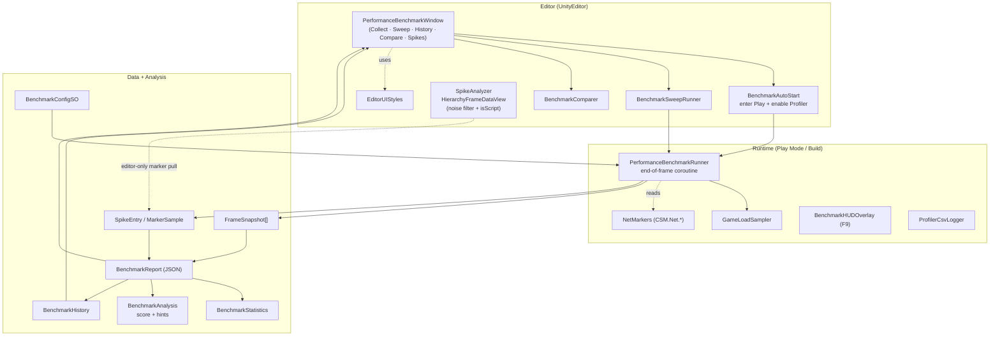
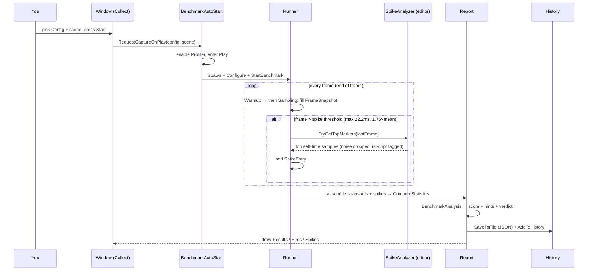
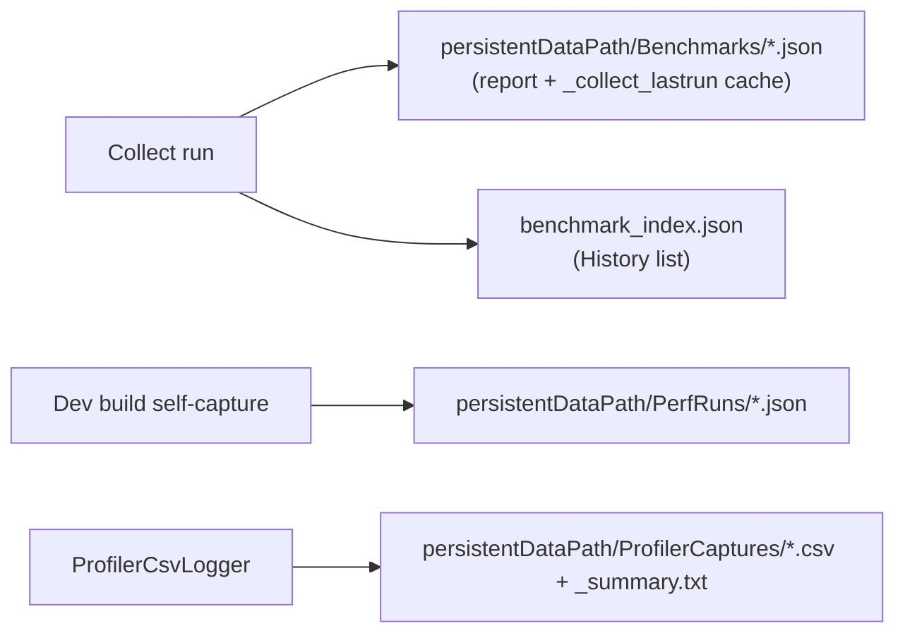
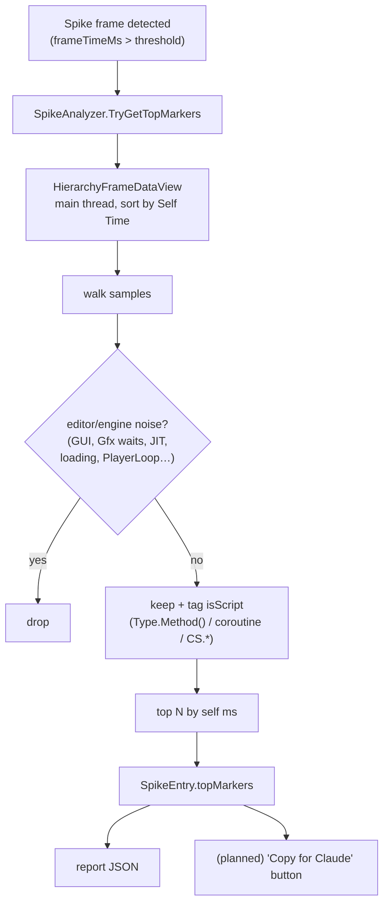

# Performance Benchmark Tool — Architecture

A plain map of how the tool is wired. Mermaid blocks render in Notion and GitHub.

> One-line summary: an **editor window** drives a **runtime capturer** that fills a
> per-frame buffer + spike list, which is folded into a **report (JSON)**, **scored +
> hinted**, **persisted to history**, and **drawn back in the window**.

---

## 1. Components at a glance

| Layer | File(s) | Role |
|---|---|---|
| **Config** | `BenchmarkConfigSO` | Warmup/sample durations, capture toggles, output folder, label. *(default asset lives at `Assets/_SO_Assets/Benchmark/`)* |
| | `BenchmarkHintRulesSO` | Optional custom hint rules (else built-in defaults). |
| **Runtime capture** | `PerformanceBenchmarkRunner` | MonoBehaviour. End-of-frame coroutine fills a pre-sized `FrameSnapshot[]`; detects spikes. Zero-alloc steady state. |
| | `GameLoadSampler` | Reads gameplay load (prisms, VFX, vessels, players) from `GameDataSO`. |
| | `NetMarkers` | `ProfilerMarker`/counters for the netcode hot paths (`CSM.Net.*`). |
| **Standalone runtime** | `ProfilerCsvLogger` | Per-frame CSV/summary logger (long sessions). Menu + component. |
| | `BenchmarkHUDOverlay` | F9 live on-screen HUD (fps/frame/draws/GC/load). |
| **Data model** | `FrameSnapshot` | One frame: timing, render, memory, physics, netcode, load. |
| | `SpikeEntry` + `MarkerSample` | A spike frame + its top self-time markers (`isScript`-tagged). |
| | `BenchmarkStatistics` | Aggregates (avg/p95/p99/stddev, slopes, shares). |
| | `BenchmarkReport` | The whole run (snapshots + spikes + stats + analysis). Serializes to JSON. |
| **Analysis** | `BenchmarkAnalysis` | Score (0-100) + rule-based hints; CPU/GPU verdict. |
| | `BenchmarkGrade` | Letter grade from stats. |
| | `SpikeAnalyzer` | **Editor-only** profiler bridge: reads a frame's top self-time samples via `HierarchyFrameDataView`, drops editor/engine noise, tags scripts. |
| **Persistence** | `BenchmarkReport.SaveToFile` | Writes `persistentDataPath/Benchmarks/*.json`. |
| | `BenchmarkHistory` | Index + per-run JSON; tagging. |
| **Editor UI** | `PerformanceBenchmarkWindow` | The window. Tabs: **Collect · Sweep · History · Compare** (+ **Spikes**, in progress). |
| | `EditorUIStyles` | Pastel section headers, badges, score bars. |
| | `BenchmarkAutoStart` | Enters Play (optionally via Bootstrap), enables Profiler, spawns the runner. |
| | `BenchmarkSweepRunner` | Runs the capture across multiple scenes. |
| | `BenchmarkComparer` / `BenchmarkComparison` | Diffs two runs (baseline vs current). |
| **Build** | `BenchmarkBuildAutoRunner` | Dev-build self-capture → JSON to `persistentDataPath/PerfRuns/`. |

---

## 2. Component map

---

## 3. Capture flow (one Collect run)

---

## 4. Where the data lives

- **Editor (Mac):** `~/Library/Application Support/<company>/<product>/...`
- All three are plain text/JSON — readable by Claude. The window's **History/Compare** tabs read the `Benchmarks/` JSON.

---

## 5. The spike-attribution path (what replaces screenshots)

This is the part that turns a hitch into a script breakdown without the Profiler window:

**Status:** noise filter + `isScript` tagging are done (commit `06d41cc`). Still to land:
the **default config asset auto-load**, the dedicated **Spikes tab**, the **live** spike
list during recording, and the **Copy-for-Claude** text export.
