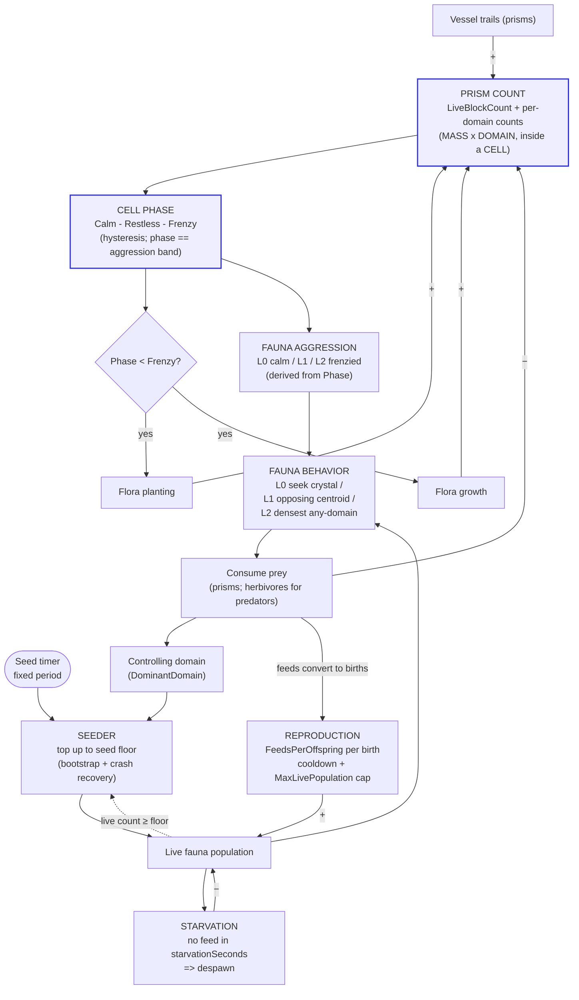
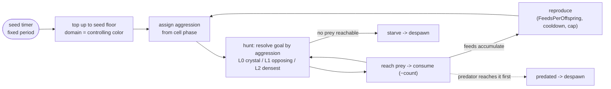

# Cell Ecosystem — Workings, Analysis & Redesign

**Status:** living design doc. Created to map the cell ecology end-to-end so we
can see which parts *produce* and which parts *block* the goal — a dynamic,
vibrant ecosystem players engage with — and redesign the blockers. Built to be
extended as flora and fauna split into sub-categories (e.g. predator /
herbivore).

> Diagrams are [Mermaid](https://mermaid.js.org/) — they render on GitHub. An
> ASCII fallback of the core loop is inline in §3 for quick reading.

---

## 0. Invariant — mass is conserved (no passive decay)

**Read this first; it constrains every solution below.** A prism — whether a
lifeform's health-prism or vessel-spawned — is **only ever removed by an active
force**:

1. **A vessel using an ability** (combat), or
2. **Fauna eating it** (consumption).

There is **no passive decay, aging, lifespan, timed culler, or growth/decay
oscillator** anywhere in the prism pipeline. Population homeostasis is the job of
the **food web**, not of artificial removal:

- A **large accumulation of prisms is a valid state**, not a defect to
  auto-correct. It persists until an active force consumes it.
- The only outcomes for a big accumulation are: **fauna consume it** (opposing-
  domain fauna graze it down), **or** the fauna that depend on that prey **starve
  and the population crashes** (because the mass is the wrong domain for them, or
  out of reach). Either is correct emergent behavior.

This is why **prism decay / mortality was considered and rejected** (it was the
original Phase 2 "step 1"). A timed culler is just the flora regrowth pulse
inverted — a hard-coded oscillator that manufactures the "breathing" we want to
*emerge* from the predator–prey loop. If a cell "freezes," the fix is to give an
active force a reason or ability to consume that mass (tune fauna diet/reach/
spawning, or vessel abilities) — **never** to add decay. See CLAUDE.md → "Mass"
fundamental and "Don't cheat emergence."

**Universality — this invariant has no exempt contexts.** The HyperSea has one
rule set and everything follows it: game scenes, Menu_Main's lava-lamp/freestyle,
tools and test scenes. There is **no "cosmetic," "menu-only," or "perf special
case" exemption** — the menu autopilot vessel *is* the freestyle gameplay vessel
(lava lamp == freestyle; see CLAUDE.md → "Lava-Lamp Mode"), so any removal
mechanism attached to it is gameplay decay.

> **Rejected cheat (reverted): the menu trail cap.** Commit `64d8f0c8` added a
> per-trail ring-buffer cap (`VesselPrismController.maxTrailBlocks` +
> `Trail.RemoveOldest`) that silently recycled the oldest trail prism on every
> new spawn, set to 200 on the Menu_Main vessel to bound idle-time prism growth.
> It was rationalized as cosmetic and "gameplay unaffected" — but the cap
> followed the player into freestyle flight as an age-based trail limit, the
> exact passive-removal cheat this section rejects. Reverted. If menu-idle
> accumulation is a perf problem, use the universal systems: **fauna cleanup**
> (cleanup is one of the fauna's many jobs — foragers consume trail mass through
> the food web, §6–§7) or **pause/throttle the spawner** while idling (not creating
> mass is allowed; aging it out is not).

> **AUTHORIZED EXCEPTION (2026-08-03): the Wanderway rolling tether.** The one
> sanctioned place trail mass is recycled. During a live `WanderwayRun` — and
> ONLY then — the local vessel's trail is held at a fixed length
> (`ConveyorConfig.TetherPrisms`, 100): as the vessel lays at the head, the
> oldest prism at the tail withers and returns to the pool it came from, and the
> return station rides that tail so the way home is always one tether-length
> behind you. This is mechanically the same thing as the reverted cap above, and
> it is here **by explicit sign-off**, for a reason the cap never had: the
> Wanderway is a *truly infinite runner*, and recycling everything is what buys
> an endless world at fixed memory. Turn around and your trail is there; fly on
> and a little flying lays a fresh path home.
>
> Its scope is the fence — do not widen it, and do not "fix" it by reverting:
>
> - **Live-run only.** `WanderwayRun.RollTether` is the sole caller of
>   `Trail.RemoveOldest`. Outside a run — everywhere else in freestyle, every game
>   mode, the menu lava lamp — the trail is untouched and §0 holds in full.
> - **No length limit on the trail itself.** `VesselPrismController` grew no
>   `maxTrailBlocks` field; nothing about laying a prism consults a cap. The run
>   reaches in from outside and only while it exists.
> - **Recycle, not decay.** Prisms go back to the pool the next lay draws from —
>   the same closed-stock idea as the belt, which is why memory is bounded.
> - **Continuity of existence is NOT waived** (a separate law): a retiring prism
>   withers on the GPU clock — one grow-clock re-stamp toward a near-zero scale,
>   the belt's own collapse (`Docs/PRISM_ANIMATION.md` §5 C8) — and returns to the
>   pool only once it has shrunk away. Nothing pops.
>
> Detail: `Docs/ToySystem/ARCHITECTURE.md` § "The run".

**Growth-side cheats — all retired.** Two artificial throttles used to fake the
homeostasis the food web is meant to produce, both now gone:

1. The flora **regrowth pulse** (a periodic growth window above the freeze
   threshold) — retired earlier.
2. The flora **phase-gated self-limit**: planting stopped at a low phase and
   growth stopped at a mid phase, so the canopy capped itself well before the
   cell was full. **Retired now** — flora plant *and* grow at a **steady rate
   until Frenzy** (the top phase), and the only down-force is the food web
   (opposing-domain fauna grazing the prisms) or a vessel ability. A cell with no
   active force on it climbs to Frenzy and stays there (a *valid* equilibrium,
   §0) until something eats its mass back below the Frenzy exit threshold, at
   which point the existing hysteresis resumes growth on its own. Retiring this
   staggered self-limit is what **collapsed the phase ladder from six rungs to
   three** (Calm → Restless → Frenzy) — the extra rungs only existed to stage the
   flora-vs-fauna events that no longer differ. See §1, §5.

---

## 1. The spine: everything keys off **prism count**

One state variable drives the whole system: the cell's live prism count
(`Cell.LiveBlockCount` = `trackedBlocks.Count`, plus per-domain counts via
`GetDomainBlockCount`). Prisms are the **mass** fundamental made concrete; the
cell is the **cell** fundamental; the color on each prism is the **domain**
fundamental. Everything else is a projection of, or a force on, prism count.

| Force on prism count | Sign | Source |
|---|---|---|
| Vessel trails | **+** | players/AI flying through the cell → `Cell.AddBlock` |
| Flora planting | **+** | new flora instantiated (`RandomLifeSpawner`) → health prisms → `AddBlock`. Steady rate until Frenzy. |
| Flora growth | **+** | existing flora grow new prisms (`Flora.Grow`) → `AddBlock`. Steady rate until Frenzy. |
| Fauna consumption | **−** | fauna seek & detonate opposing-domain prisms → `RemoveBlock` |
| Vessel abilities (combat) | **−** | vessel impacts / ability use → prism death → `RemoveBlock` |

> The **−** column is exhaustive: fauna consumption and vessel abilities are the
> *only* prism sinks. There is no decay/aging row — mass is conserved (§0). And
> the **+** column has no self-limit: flora plant + grow at a steady rate until
> Frenzy (no early planting cap, no mid-range growth cap — those staggered phase
> gates were a growth-side cheat, retired in §0).

Prism count → **Cell Phase** (`Calm → Restless → Frenzy`, computed with enter/exit
**hysteresis** so the cell doesn't chatter on the boundary). The three phases map
1:1 onto the three fauna aggression bands — the phase *is* the aggression band.
Phase is the single dial the rest of the ecology reads:

- **Calm** — low mass. Flora grow + plant freely; fauna idle toward the crystal (L0).
- **Restless** — mid mass. Fauna hunt the nearest opposing-color centroid (L1).
- **Frenzy** — frenzy ceiling. Flora **stop**; fauna seek any-domain density, drop
  friendly avoidance, ignore danger prisms (L2). The cell only leaves Frenzy when
  an active force eats its mass back below the Frenzy exit threshold.

---

## 2. Full ecosystem diagram



### The three feedback loops (this is where "vibrant" lives or dies)

1. **Flora freeze at Frenzy (hard ceiling, NOT a self-limit).** `count↑ → phase↑ →
   at Frenzy, planting + growth stop.` Flora plant + grow at a **steady rate** the
   whole way up — there is no early planting cap and no mid-range growth cap (those
   staggered self-limit gates were a growth-side cheat, retired §0). Frenzy is just
   the top of the hysteresis band, not a homeostatic throttle: a cell that reaches
   Frenzy stays full until the **food web** (loop #2) grazes its mass back down, so
   the down-force on flora is the predator–prey loop, not flora throttling itself. ✅
2. **Predator–prey (negative, the heartbeat).** `count↑ → aggression↑ → fauna hunt
   harder/closer → consume more → count↓ → aggression↓ → …` This is the
   oscillation that should make the cell feel alive. Per the latest decision this
   loop runs **through aggression (behavior)**, not through spawn rate. ✅
3. **Population control (the Lotka–Volterra coupling).** Feeds convert to births
   (`FeedsPerOffspring` per offspring, per-individual cooldown, hard
   `MaxLivePopulation` performance backstop); going `starvationSeconds` without a
   feed despawns the creature. Population is therefore a true function of prey:
   rich prey ⇒ the population grows past the seed floor; scarce prey ⇒ it crashes.
   The periodic spawner is demoted to a **seeder** — it only tops a species back up
   to its seed floor (bootstrap + extinction recovery), never drives growth. ✅

### ASCII core loop (quick read)

```
        +-----------------------------------------------------+
        |                                                     |
        v                                                     |
   PRISM COUNT --> PHASE --> AGGRESSION --> fauna hunt --> CONSUME (−)
        ^   ^                                              |        |
        |   |                              feeds => births |        | no feeds
   flora +  +-- planting + growth freeze ONLY at Frenzy    v        v
   trail +      (ceiling, not a throttle)            REPRODUCE   STARVE
                                                        (+)        (−)
                                                          \        /
   SEEDER (timer, top-up to floor, controlling color) --> POPULATION
```

---

## 3. Fauna lifecycle



Every arrow is implemented: spawn (seeding), reproduction (births from feeds),
starvation, and predation all run through the same `Fauna` base.

**Vessel predation & husbandry — the Crystal Joust (Squirrel).** Every living lifeform's
elemental crystal is its **heart**: `Crystal.SetEmbeddedIn(lifeform)` (fauna wire it in
`LightFauna`/`Boid` after `LifeFormCrystal.EnsureElementalCrystal`; flora in
`LifeForm.Initialize`) enables the heart's SphereCollider so a vessel can JOUST it. The
embedded heart is never a pickup — skim-collect and skimmer vacuum both gate on
`Crystal.IsEmbedded` — and the vessel-side chain routes to the container's
`VesselLifeformCrystalEffects` instead of the collect chain. The Squirrel's
`VesselWitherLifeformByCrystalEffectSO`:
- **Speed gate (both branches)**: the joust lands only while the vessel moves FASTER
  than the lifeform (`ILifeFormEntity.CurrentSpeed` + authored margin). Rooted flora sit
  at 0 — trivially joustable; fast fauna must genuinely be overtaken.
- **BASE ability (ungated)**: an **opposing-domain** lifeform is destroyed —
  `ILifeFormEntity.Jousted` routes fauna through the sealed `Predated→Die` (wither +
  crystal drop, spawn immunity respected) and flora through `LifeForm.Die` (spindle
  wither + crystal drop). An ACTIVE force; mass conserved, continuity honored.
- **Space level-5 'Shepherd' upgrade**: an **own-domain** lifeform is NOURISHED instead —
  `ILifeFormEntity.Nourish()` FEEDS it, so a creature's starvation clock resets and its
  birth counter advances and a plant's growth quota moves toward its next seeding (below
  the unlock an ally joust does nothing; an ally is never killed). *Superseded §40.4: it
  used to `LevelUp()` the ally — a bigger body and heart on that one individual.*
Collider cost: **+1 active SphereCollider per live lifeform heart** (fauna bounded by
`MaxLivePopulation`; flora by the profile's spawn counts).

> **⚠ Superseded by §40 (Aug 2026): there is no LEVEL.** Everything above and below about
> `.Level`, `MaxLifeformLevel`, the 20-variant matrix, `InitialLevel`, `BodyScalePerLevel`,
> `LevelGrowSeconds` and the level→crystal curve is the historical record. **A lifeform is its
> species and its ELEMENT — four elemental variations, and nothing else** — and each element
> states its own heart size (`FaunaVariantTuning`/`FloraVariantTuning.HeartWorldScale`), sized
> from that lifeform's measured body. The ELEMENT half of the contract is untouched and is what
> survives: one base prefab, four data-defined variants, provisioned at `AssignLineage`.
>
> *(The intermediate ruling, kept as the record: **§33 (Aug 2026)** made level EARNED rather than
> rolled — born at level 1, a plant levelling per reproduction and a creature per `FeedsPerLevel`
> feeds, with the heart on one curve keyed on level alone.)*

**The lifeform elemental contract (element × level).** Mirroring the vessel contract,
every lifeform answers `ILifeFormEntity.Element` and `.Level` (1..`Fauna.MaxLifeformLevel`
= 5): **one base prefab, 20 data-defined variants** (4 elements × 5 levels) instead of a
prefab per element. The element is data on `FaunaConfigurationSO.Element` — at
`AssignLineage` the heart is provisioned from `ElementalCrystalSet` for that element
(`LifeFormCrystal.EnsureElementalCrystal(owner, element)` replaces a disagreeing authored
crystal; `None` keeps the legacy per-variant-prefab path). Level scales the creature via
config (`InitialLevel`, `BodyScalePerLevel`, `LevelGrowSeconds`): spawns arrive AT size;
in-world level-ups **grow** over `LevelGrowSeconds` (continuity — never a pop). Parent
scale is mover-contract (`Docs/PRISM_ANIMATION.md` §1 / C6 (b)): locomotion already
re-syncs body prisms every `Update` (`NotifyBodyPrismsMoved` / `SyncBodyPrismsToIndex`);
`GrowToScale` does **not** notify separately. The heart grows a step per
level so a higher-level creature drops a **bigger** elemental powerup on death (mass
rewarded, still conserved).

**Who actually spawns the four** *(historical: "the 20", before §40)*. A config authors ONE
point of the matrix, so the live world only showed the whole set once cells were allowed to
*spread* across it: `SpreadElements` + `ElementPalette` roll an element per spawn and offspring
inherit their parent's roll. See **§17** — that is where the spread mechanism, the palette rule
and the per-cell settings live. *(§17 also documented `LifeformLevelSpread`, the level roll:
deleted by §33 and the whole axis retired by §40.)*

**Variant expression (`FaunaVariantTuning` on the config).** The full diff between the
authored Mass/Space/Time tadpole prefab variants was hoisted into config so one base
prefab can express all of it as data (sentinels keep the prefab's authored value):
body scale (0.4/0.7/0.4) · body PRISM target scale (Mass/Time author 0.8×0.8×7 tail
prisms, Space keeps the spindle default) · spindle body material · starvation seconds
(90/30/30) · cohesion radius (50/20/20) · behavior tick (1.5/3/3) · graze radius
(45/15/15) · goal weight (3/0.3/0.3) · speed band (10-15/10-15/15-20) · forager flag
(on/off/off) · FMOD loop event + attenuation (Mass Tadpole 0-200 / silent / Time
Tadpole). Applied by `Fauna.ApplyVariantTuning` (base: scale/prism-scale/material/
starvation/heart size/audio) + `Boid.ApplyVariantTuning` (flocking numbers) at
`AssignLineage` — which then re-applies the heart's WORLD size unconditionally, because
`BaseBodyScale` has just rewritten the parent chain that size was divided against (§40.3).
Population-level knobs (`numberOfBoids`, `spawnRadius` on
the drone BoidManager population prefabs) stay on that separate system; the spawner path
already owns them via `PopulationSize`/`MaxLivePopulation`.

**Flora variant expression (`FloraConfigurationSO.Element` + `FloraVariantTuning`).**
Same move for flora, captured from the real Charge/Mass/Space/Time GyroidFlora diff —
the per-element identity is largely the PRISM: leaf prism size (9×3.4×1.5 / 7×4.5×3.5 /
20×1×1 needles / 9×3.4×1.5) · grow period (0.5 / 0.3 / 0.8 / **0.15** — Time grows
fastest) · shield period (**1** — Charge ships shielded leaves / 0 / 0 / 0) · live-prism
budget `maxTotalSpawnedObjects` (1000 / **1500** / **800** / 1000) · plant radius
fraction · crystal element. `CellLifeSpawnerBase.SpawnFlora` now takes the config and
applies element + tuning BEFORE `Initialize` (leaf size and the crystal lookup are
consumed there); `LifeForm.ApplyVariantTuning` (shield cadence) → `Flora` (leaf/tempo/
radius) → `AssembledFlora` (prism budget) layer the fields where they live.

**Heart size (REPLACED twice — current rule is §40.2, Aug 2026).** It began as
`CrystalScalePerLevel` compounding off each prefab's *authored* crystal scale — monotone per
species, but wildly different BETWEEN them (0.7 to 4.0 world scale), and clipping the
collect-gain cap by level 5 on four of five species. §33 replaced that with ONE curve keyed on
level alone. **§40 retires the curve with the level**: a heart's size is now AUTHORED per element
(`FaunaVariantTuning`/`FloraVariantTuning.HeartWorldScale`), solved from that lifeform's measured
body as `0.36599 · bodyDiameter^0.5` and held under the reward cap by construction — band 1.16
(SchwarzP Charge) → 4.60 (Nerve Charge). Still applied at the one gate, `Crystal.SetEmbeddedIn`. Every
`CrystalScalePerLevel`, `LeafScalePerLevel` and `BodyScalePerLevel` field is deleted, so nothing
scales with life any more: a lifeform spawns at size and stays there.

**Unification (SHIPPED) — one base prefab per species, variants are config.** The
per-element prefab variants were retired: `TadPoleFauna.prefab` (formerly
MassTadPoleFauna) and `GyroidFlora.prefab` (formerly MassGyroidFlora) are the single
base prefabs; Space/Time tadpoles, Charge/Space/Time gyroids, and the unused
TimeTadpolePopulation were deleted with every reference migrated (the variant prefabs
were literal copies sharing fileIDs, so guid swaps were reference-safe). The canonical
per-element configs live in `Assets/_SO_Assets/Lifeforms/` (Tadpole Fauna
Charge/Mass/Space/Time + Gyroid Flora Charge/Mass/Space/Time — Charge tadpole is NEW
and untuned, authored from the Space baseline); the existing Cell Config assets carry
their element's Variant block explicitly. Legacy note: the drone-population prefabs
(BoidManager path) now all spawn the base tadpole - per-element identity there awaits
that system's own config pass.

**Lifeform Matrix toy (the tuning bench).** `Toy_LifeformMatrix` (in the freestyle
toybox): fly through it → the kingdom row blooms (Fauna / Flora / Vessels); fly a kingdom →
a station per species; fly a species → its variant **row — one station per ELEMENT, four of
them, and that is the whole matrix** (§40), each station wearing that element's crystal drawn
at that variant's own authored heart size, so the row shows the real size difference before
you touch any of it; fly a variant → that exact lifeform spawns live into the containing cell
through the canonical spawn paths on a runtime clone of its config (assets never mutated;
spawns are ordinary food-web citizens). Files: `LifeformMatrixToyDefinitionSO`,
`LifeformMatrixToy` (+ station). Collider impact: transient trigger spheres only (species
count + ≤4 variants), Menu freestyle only, torn down with the matrix.

---

## 4. Part-by-part analysis

| # | Part | Driver | Current behavior | Desired | Gap / action |
|---|---|---|---|---|---|
| 1 | Prism count (state) | trail + flora − fauna/combat | tracked via Add/RemoveBlock, per-domain | same | ✅ the spine, leave alone |
| 2 | Cell phase | prism count + hysteresis | Calm→Frenzy (3 phases) | same | ✅ 2 thresholds tunable per biome |
| 3 | Flora **planting** | `Phase < Frenzy` | steady rate until Frenzy | prism-count driven | ✅ steady-until-frenzy (cheat removed) |
| 4 | Flora **growth** | `Phase < Frenzy` | steady rate until Frenzy | prism-count driven | ✅ `AssembledFlora`/`BranchingFlora`; same gate as planting |
| 5 | Fauna **aggression** | Phase → L0/L1/L2 | seek crystal→opposing→densest | prism-count driven | ✅ works; extension seam for a 4th tier / per-subtype |
| 6 | Fauna **spawn timing** | fixed-period seed timer | seeds at `BaseFaunaSpawnTime` | same | ✅ timer-only, fixed period |
| 7 | Fauna **spawn count** | deficit below seed floor | tops species up to `PopulationSize` | same | ✅ seeder (reproduction drives growth, §6.1) |
| 8 | Fauna **domain** | `host.ControllingDomain` | controlling color | same | ✅ (was the "no Jade fauna" bug) |
| 9 | Spawn-cycle HUD ring | `CurrentFaunaSpawnPeriod` (base period) | fixed sweep | same | ✅ no aggression scaling |
| 10 | Fauna **population bound** | starvation + reproduction + `MaxLivePopulation` | prey-linked rise and crash | same | ✅ §6 + §6.1 (full Lotka–Volterra) |
| 11 | Fauna **consume → −prisms** | aggression behavior → impact | reduces opposing prisms | same | ✅ this is the prey side of loop #2 |

**Root causes of what you saw:**
- *Dead spawn-cycle ring* → `RandomLifeSpawner` never called `RecordFaunaSpawn` (fixed in the retrofit). **Correction:** NOT all scenes run `RandomLifeSpawner` — the WildlifeBlitz scenes (`MinigameWildlifeBlitz`, `MinigameWildlifeBlitzMultuplayerCoOp`) and `MinigameMaelstromMultuplayer` select `IntensityWiseLifeSpawner` (`cellTypeChoiceOptions: 1`). Menu, Skim Race, and the rest use `Random` (0).
- *No fauna in menu* → fauna were gated on scored team volume (~0 in Menu_Main). Retrofit moved them to a phase gate; the redesign moves them to **timer only**.
- *No Jade fauna when Jade controls* → row 8: the controlling/local color is **excluded by construction**.

---

## 5. Redesign — locked decisions

From the latest direction ("keep period and swarm size fixed, rely on modifying
the aggression levels of all fauna" + "do what's best for basic functionality to
first approximations, build to extend"):

- **Aggression is the lever.** `prism count → phase → aggression level → fauna
  behavior`. Aggression does **not** feed spawn rate/size — only behavior. This
  makes loop #2 the heartbeat.
- **Fauna domain = controlling color** (`host.ControllingDomain`). Fixes the Jade
  bug; the dominant domain's fauna proliferate and hunt the minority. Trivial,
  certain change — folded into the spawn rewrite.
- **Spawner = SEEDER** *(supersedes the original "fixed N per tick" decision —
  roadmap step 3 landed)*. The timer still ticks at the fixed `BaseFaunaSpawnTime`,
  but each tick only tops the species back up to its **seed floor**
  (`PopulationSize`): bootstrap at scene start, recovery after a crash. Above the
  floor, **reproduction** is the population driver (see §6) — the spawner never
  races the food web.
- **HUD ring = base fixed period** (remove the aggression scaling the retrofit
  added to `ScaleFaunaInterval` / `CurrentFaunaSpawnPeriod`).
- **Keep 3 aggression tiers** — and they are now the **same thing as the phases**.
  The 3-phase collapse made `CellPhase` (Calm / Restless / Frenzy) map 1:1 onto
  `CellAggressionLevel` (L0 / L1 / L2). Frenzy = top tier; a 4th "berserk" tier or
  per-subtype aggression curves slot into the existing `CellAggressionLevel` switch
  when the predator/herbivore split deepens (§7).
- **The phase ladder is the aggression ladder.** Because flora are no longer
  staggered on their own rungs (steady until Frenzy, §0), a cell needs only **two
  thresholds** to author: `RestlessEnter` (fauna start hunting) and `FrenzyEnter`
  (flora freeze + max aggression). Down from five. The per-biome boundaries are
  unchanged in value by the collapse — only the redundant middle rungs were dropped —
  so existing fauna aggression behavior is identical; only flora now fills denser
  (it grows to Frenzy instead of stopping at the old mid-range growth cap).

### 5.1 Density & the steady-until-frenzy model (cells were sparse / froze solid)

- **Capacity is a PERFORMANCE budget, not a "fill it up" dial.** `FrenzyEnter` is
  the steady-state prism count (the cell pins there, §6/§12), and prism count is the
  dominant frame cost — so it is tuned against the frame budget, not for visual
  density. The menu's `Blob Cell Config` is `RestlessEnter 600 / FrenzyEnter 1000`
  (was 3000/5400, which sat the menu at ~5 fps — see §12). `FrenzyEnter` also sets
  the `DomainVolumeIndicator` volume scale. Other biomes use the high code `Default`
  (`FrenzyEnter 15000`); Skim Race is `RestlessEnter 600 / FrenzyEnter 2000`.
- **Flora grow steadily until Frenzy.** The old "stop planting at a low phase, stop
  growing at a mid phase" staggered self-limit (and, before it, the periodic
  **regrowth pulse**) are **both retired** — they were growth-side cheats faking the
  breathing the food web is meant to produce (§0). `Cell.FloraGrowingEnabled` /
  `FloraPlantingEnabled` are now simply `phase < Frenzy`: flora plant + grow at a
  steady rate the whole way up, then freeze at Frenzy.

> The honest model: a frozen-solid cell at Frenzy is a **valid state**, not a defect
> to auto-correct. It stays frozen until an active force — opposing-domain fauna
> grazing it, or a vessel ability — removes mass and the existing `phase < Frenzy`
> hysteresis resumes growth on its own. Mass is conserved; the down-force is the
> **food web**, never decay or a growth/decay oscillator. See §0 and §10.

---

## 6. Decision — fauna bounded by **prey-linked starvation** (option C)

This is loop #3, and it's the one thing that, missing, prevents the ecosystem
from breathing. Three ways to add the negative feedback, smallest→most emergent:

| Option | Mechanism | Pros | Cons |
|---|---|---|---|
| **A. Population cap (stop-producing)** | Track live fauna per cell (we already have `spawnedLifeForms` / `LifeFormsInCell`); timer skips spawning while count ≥ `MaxFaunaPerCell`, resumes when it drops | Dead simple, deterministic, prevents runaway today | Doesn't itself remove fauna — needs a removal source to recover |
| **B. Lifespan (natural cull)** | Each fauna despawns after `T` seconds | Self-bounding (pop ≈ rate × T), simple, predictable | Decoupled from prey — not yet "emergent", just a timer |
| **C. Prey-linked / starvation (emergent)** | Fauna persist only while prey (opposing prisms) is reachable; they **starve & despawn** when prism food is scarce, and production pauses when food is low | Ties population to prism count → genuine predator–prey oscillation; this is where the **predator/herbivore** split naturally lives (herbivores eat flora prisms, predators eat herbivores) | Most work; needs a hunger/last-fed state on fauna |

**Decision: C (prey-linked).** Implemented now rather than the A+B interim — it's
the emergent north star and the seam the predator/herbivore split plugs into.

**Implemented:**
- `Cell.OpposingVolume(domain)` = live ENVIRONMENT volume not of `domain` — the prey
  signal (volume is the spine; fauna bodies are excluded — they aren't edible prey).
- **Production pauses** when `OpposingVolume(controllingColor) < FaunaFoodFloor × 16`
  (the floor is authored in nominal prisms, converted by `NominalPrismVolume`)
  (`SpawnProfileSO`, default 5): the timer keeps ticking but no population spawns.
- **Starvation cull** on `Fauna`/`LightFauna`: a creature that hasn't consumed a
  prism in `starvationSeconds` (default 30, `Fauna` field) despawns; `NotifyFed()`
  resets the clock on every `Consume`.
- Net: population self-bounds to prey. Because fauna only *hunt* opposing prisms
  at higher aggression (L1+), and aggression rises with prism count, **survival
  tracks prism count** — low mass ⇒ fauna can't find food ⇒ they thin out; high
  mass ⇒ they feed and multiply. That coupling is the oscillation.

### 6.1 Reproduction — the population driver (roadmap step 3, LANDED)

The fixed-period spawner-as-population-source was the last scaffolding cheat; it
is now retired. **Feeds convert to births**:

- Every `NotifyFed()` (prism consume; a kill for predators) advances a per-individual
  birth counter. At `FeedsPerOffspring` feeds the fauna births `OffspringPerBirth`
  offspring next to itself (post-spawn predation immunity gives them time to
  disperse), subject to a per-individual `ReproductionCooldownSeconds` and a hard
  per-cell, per-species `MaxLivePopulation` cap — a **performance backstop**, not
  the primary control (starvation is). All four knobs live on
  `FaunaConfigurationSO`; `FeedsPerOffspring = 0` (the default for un-authored
  assets) disables reproduction for the species.
- Offspring inherit the parent's domain and **lineage** (`Fauna.AssignLineage`:
  host cell + species config), so they count toward the cell's per-species live
  population (`Cell.GetLiveFaunaCount`) and can reproduce in turn.
- The **spawner is demoted to a seeder**: each fixed period it spawns only the
  *deficit* below the species' seed floor (`PopulationSize`) — bootstrap at scene
  start, recovery after extinction — and stays out entirely while the food web
  sustains the population at or above the floor
  (`FaunaReproductionRules.SeedSpawnCount`). The seeder is acknowledged residual
  scaffolding: real ecosystems get immigration; ours gets a floor so a crash is
  never a permanently-dead scene.
- The pure gating lives in `FaunaReproductionRules` (`ShouldBirth` /
  `SeedSpawnCount`) with edit-mode tests pinning the Lotka–Volterra coupling.

**Tuning knobs** (watch in Menu_Main, expect to adjust): `starvationSeconds` (too
low ⇒ fauna starve before reaching prey; raise it), `FaunaFoodFloor` (min prey
before seeding), `PopulationSize` (seed floor), `BaseFaunaSpawnTime` (seed period),
`FeedsPerOffspring` (lower ⇒ steeper population upswing on rich prey),
`ReproductionCooldownSeconds` (birth burst throttle), `MaxLivePopulation` (the
**taming dial**, §6.2 — *and* a performance ceiling, §12).

### 6.2 Taming vs devouring — the caps dial (gameplay balance)

The food web has two qualitatively different equilibria, and which one a cell sits
in is the difference between "fun to fly through" and "stripped bare". It is set by
one comparison:

> **food-supported herbivores** = `flora_growth_rate / per-herbivore_graze_rate`
> — the standing herbivore count whose total grazing exactly equals flora growth.

- **Summed herbivore `MaxLivePopulation` ≤ food-supported** → fauna *cannot*
  out-graze flora. Mass grows to `FrenzyEnter` and **holds** (breathing in the
  `[FrenzyExit, FrenzyEnter]` band). The fauna **tame** the edges; the environment
  stays sizable. This is what freestyle/menu wants (fly through gyroids).
- **Summed herbivore cap > food-supported** → fauna out-graze flora, eat the mass
  to the ground, then starve and let it regrow — a boom/bust that keeps the
  environment **stripped**. This is what an aggressive trail-cleanup wants (Skim
  Race: graze the AI obstacle buildup down) but ruins a fly-through scene.

So the **same** forager species is *taming* or *devouring* purely by its **cap per
biome** — no behavior/diet change needed. The menu holds its herbivore cap low
(below food-supported) to preserve the gyroids; Skim Race keeps it high to clear
the track. `Tools/ecosim/ecosim.py` reports this outcome (`TAMED` vs `DEVOURED`)
per config; refine the `FLORA_GROWTH_PER_S` / `GRAZE_PER_HERBIVORE_S` ratio against
real `EcosystemPerfProbe` gyroid observations.

> This does **not** reintroduce a cheat: mass is still conserved and the only
> down-force is the food web (§0). "Taming" just means sizing the predator so the
> predator–prey fixed point lands at a sizable prey level instead of a stripped
> one — a parameter choice, not a hard-coded culler.

---

## 7. Predator / herbivore split — IMPLEMENTED + wired (3 species)

The diet split is in code (`FaunaDiet` enum + `Fauna.diet` + `LightFauna`
consume branch + `Fauna.Predated`) **and wired into the Blob (menu) test cell**
with the team's three real species:

| Species | Prefab | Component | Diet | Role |
|---|---|---|---|---|
| **Tadpole** | `MassTadPoleFauna` | `Boid` (`forager: 1`) | Herbivore | flocking forager swarm |
| **Brittlestar** | `MassBrittlestarFauna` | `LightFauna` | Herbivore | grazer |
| **Shark** | `MassSharkFauna` | `LightFauna` | **Predator** (`diet: 1`) | apex; eats *both* herbivores |

All three are **spawnable** by the cell config (`SpawnProfileSO.SupportedFaunas`,
via `RandomLifeSpawner`). Two herbivore species + one predator. **The shark is
wired into the Blob (menu) profile** at apex-tier numbers (seed floor 2, cap 3,
births on 3 kills) — safe now that spawn immunity gives co-spawned herbivores a
dispersal window. It stays **out of Skim Race** deliberately: predators remove
foragers, which is counterproductive to that scene's trail-cleanup perf goal.

> **The live spawn path is the cell config — NOT the scene-placed populations.**
> The `MassTadpolePopulation` / `MassBrittlestarPopulation` etc. objects in scenes
> are wired through a `Cell` field named `fauna2` that **no longer exists** on
> `Cell.cs` — a dead/stale prefab override Unity ignores. So those `BoidManager`/
> `LightFaunaManager` populations **never instantiate**. Every working fauna comes
> from a `FaunaConfigurationSO` in the cell's `SpawnProfileSO`. (This is why
> removing the tadpole config = no tadpoles, regardless of the placed population.)

- **Diet = "what counts as prey"** is a `FaunaDiet diet` field on the `Fauna`
  base (`Herbivore` / `Predator`), defaulting to **Herbivore**:
  - **Herbivore** — eats prism MASS, but the two herbivore species differ
    (neither eats **shielded or super-shielded** mass — the shared rule, §16):
    - `LightFauna` (brittlestar) `Consume`s **opposing-domain** flora/trail prisms
      within `consumeRadius`.
    - `Boid` (tadpole forager) `Consume`s (implode → **suction shader**) any
      **unshielded** prism of **any domain** that is **not a fauna body** — so it
      grazes the *dominant* trail too (the bulk of the obstacle mass), while
      skipping the shielded race track and other creatures. Detect/eat radius =
      `cohesionRadius`/`trailBlockInteractionRadius` (currently 50/45). (Boid's
      Attach/mound effect is unused by tadpoles but stays — drone abilities use it.)
  - **Predator** — consumes **herbivore fauna of any species** via
    `GetComponentInParent<Fauna>()` on nearby colliders (matches the `Fauna` base,
    so a shark eats both `LightFauna` brittlestars and `Boid` tadpoles) →
    `prey.Predated()`. Predators **never** eat prism mass. Predation **ignores
    domain** (a diet relationship, not a team fight) so predators have prey even in
    a single-domain cell — the food web bounds them, not the domain split.
- **Population bounds (per species) — all starvation-linked:**
  - *Brittlestar* (`LightFauna`) — `Fauna.IsStarving → Die` + shark predation.
  - *Tadpole* (`Boid`, `forager: 1`) — feeds (`NotifyFed`) when it grazes any
    edible prism, and starves (`IsStarving → Die`) after `starvationSeconds` (90 on
    the prefab) without feeding. So the swarm **self-limits to available prey**: it
    grows where there's mass to eat and thins out (dropping its CPU cost) once the
    obstacles are cleared. The `forager` flag is OFF on the drone `Boid` path
    (BoidController/mound), which must not starve.
  - *Shark* (`LightFauna`) — `IsStarving → Die` when no herbivores are reachable.
  Net: a self-bounding food web — the spawner keeps adding `PopulationSize` per
  period while there's prey; starvation + predation remove them when there isn't.
- **Targeting (v2 — real prey-seeking):** predators hunt the **nearest live
  herbivore** via the cell's fauna registry (`Cell.LiveFauna` — the fauna analogue
  of the prism density grid: the cell sensing its inhabitants, not a privileged
  shortcut). Predation-immune newborns are skipped so a shark doesn't camp a fresh
  birth. With no herbivores alive, the predator falls back to the shared
  phase-based density goal (roams plausibly, then starves). Herbivores still swarm
  opposing-mass density. **v3 layers intentional consumption on top — see §7.3.**
- **Spawn gating (by diet):** `RandomLifeSpawner` seeds a herbivore species when
  `OpposingVolume >= FaunaFoodFloor × 16` (prism prey, in volume) and a predator species when
  `GetLiveHerbivoreCount() >= FaunaFoodFloor` (real food, not the old prism-mass
  proxy) — so sharks never churn-spawn-and-starve in a cell with mass but no
  herbivores. `FaunaFoodFloor` doubles as both floors (N prisms / N herbivores);
  split it into two knobs only if a biome needs them to differ.
- **Aggression tiers** stay the behavior dial per diet (a 4th tier or per-diet
  curves slot into the existing `CellAggressionLevel` switch points:
  `Cell.AggressionLevel`, `Fauna.ResolveGoal` / `LightFauna.UpdateBehavior`).

### 7.1 Wiring recipe
- **Predator diet:** `MassSharkFauna`'s `LightFauna` has `diet: 1` (Predator);
  `MassTadPoleFauna`'s `Boid` has `forager: 1`. Herbivore brittlestar needs nothing.
- **One `FaunaConfigurationSO` per species**, pointing at the **creature** prefab's
  Fauna component (Boid for tadpole, LightFauna for brittlestar/shark) — *not* the
  Population/manager prefab — listed in the cell's `SpawnProfileSO.SupportedFaunas`.
  `PopulationSize` = boids spawned per period (tadpole bigger for the swarm,
  predator smaller for the apex tier).
- **Seed floor = `PopulationSize`** (Blob tadpole 25, Skim Race tadpole 12). The
  seeder tops the species back up to this each `BaseFaunaSpawnTime`; above it the
  population is reproduction-driven (`FeedsPerOffspring` etc., §6.1) and bounded by
  starvation + the `MaxLivePopulation` performance cap. A denser standing swarm
  wants a lower `FeedsPerOffspring` (faster births) *and* enough prey to keep it fed.

> **Don't rely on the scene-placed `*Population` objects** — they're wired through
> the dead `Cell.fauna2` field (removed) and never spawn (see the §7 note). The
> `Boid` mound code stays in the class (drone abilities use it via BoidController);
> the tadpole prefab just never invokes it (Explode-only, `forager: 1`).

### 7.2 Trail-management test deployments (two scenes)

The food web is wired into two scenes to test the ecosystem's ability to manage
**trail** prisms (player/AI mass), not just flora:

**A. Menu_Main freestyle toy box** (`Blob Cell Config → Blob Cell Spawn Profile`).
The goal here is **flying through sizable gyroids**, so the food web is tuned to
**TAME, not devour** (see §6.2): a small 3-tier presence — tadpole forager (seed
floor 4, cap 6, slow births @20 feeds) + brittlestar (floor 3, cap 5, @16) +
**shark** (floor 1, cap 2, @6 kills). Summed herbivore cap (11) is held **below
the flora's food-supported count** so the fauna cannot out-graze flora growth —
the gyroids grow to `FrenzyEnter` (1200) and **hold** there (breathing in the
~950–1200 band), with the fauna trimming the edges. A bigger or faster-breeding
swarm flips it to *devouring* (gyroids stripped, boom/bust) — exactly the
over-grazing the perf-cut numbers first caused. The tadpole grazes any unshielded
non-fauna mass (incl. the dominant gyroid), the brittlestar grazes opposing mass,
the shark eats both herbivores. Caps are also **performance-bounded** (§12: each
fauna's per-tick `OverlapSphere` is a top frame cost). Levers: per-species
`MaxLivePopulation` (the taming dial, §6.2) + reproduction knobs (§6.1),
`FrenzyEnter` (gyroid size, perf-capped), `starvationSeconds` / `consumeRadius`.

**B. Skim Race** (`MinigameSkimRace`, dedicated `Skim Race Cell Config → Skim Race
Spawn Profile`, isolated from the 6 other scenes that share the Barren config).
**No flora**; only the herbivore forager swarm (tadpole `PopulationSize` 12 +
brittlestar), **Random** spawner (`cellTypeChoiceOptions = 0`) so spawning is
prey-linked. Hypothesis: at late laps / high player counts, AI orbiting crystals
leave an excess of **trail-prism obstacles**; the forager swarm grazes them →
fewer prisms → better perf; foragers self-limit (starve) once the obstacles are
cleared.

> **Shark status: IN the Blob (menu) profile, OUT of Skim Race.** The original
> "only sharks" wipe (predators eating every herbivore at co-spawn, before the
> swarm dispersed) is covered by spawn immunity
> (`Fauna.predationImmunitySeconds`, default 6s, stamped in `Awake`; `Predated`
> refuses during the window), so the menu now runs the full apex tier at low
> numbers (seed floor 2, cap 3). Skim Race stays predator-free deliberately —
> predators remove foragers, which is counterproductive to that scene's
> trail-cleanup perf goal. If the menu sharks still overgraze in practice, lower
> their `MaxLivePopulation`/`PopulationSize` or raise `FeedsPerOffspring` before
> considering removal.

> **Other caveats to validate in-editor (I can't run Unity):**
> 2. **Sense coverage (addressed — tune `SenseRadiusOverride`).** Registration +
>    density targeting used to be capped at the ~1200 membrane while the track runs
>    ~4000 long, so foragers only sensed/cleaned the central bubble. Now
>    `Cell.SenseRadius` (a `CellConfig.SenseRadiusOverride`, **3000** on Skim Race)
>    decouples sensing from the visual membrane, so the cell registers + builds its
>    density grid across the whole track and the forager's `ResolveGoal` (=
>    `GetDensestRegionAnyDomain`) sends the swarm to the densest trail buildup
>    track-wide — emergent, not track-following. If foragers still don't reach a
>    far end, raise `SenseRadiusOverride`; if the grid feels too coarse, lower it.
> 3. **Domain.** Foragers eat *opposing*-domain mass, so the dominant domain's own
>    trail isn't grazed by its own fauna. At multi-domain player counts most trail
>    mass is still "opposing" to *some* school, but the single dominant trail is the
>    one accumulation the food web won't touch.
> 4. **Client-local fauna.** Fauna + trail prisms have **no `NetworkObject`** —
>    client-local (trails reconstructed from networked vessel movement; cell phase
>    synced via `CellNetworkSync`). Fine for a per-client **perf** test and the
>    menu; **diverges across clients**, so not yet fair for competitive play.
> 5. **Net perf.** Fauna cost CPU (per-tick `OverlapSphere` per creature). Test
>    whether trail savings beat fauna cost: start modest and profile before/after;
>    scale `PopulationSize` only if net-positive.

### 7.3 Intentional consumption & the mouth-driven predator (v3)

Consumption is no longer an instant vacuum inside a radius — both diets now *act
out* their feeding, using the systems that already exist (the suction implosion,
the danger prisms, `Cell.LiveFauna`). No new colliders; tunables live on
`LightFaunaDataSO` (brittlestar/shark) and the `Boid` prefab (tadpole).

**Herbivores (brittlestar `LightFauna`, tadpole `Boid` forager) — approach →
face → suction → watch:**
- The behavior tick only **selects** the nearest edible prism (same edibility
  rules as before, factored into `IsEdibleForHerbivore` / `IsEdibleForForager`);
  the creature then steers toward it.
- Feeding starts only once inside the **minimum feeding distance**
  (`consumeRadius` / `trailBlockInteractionRadius`) — the creature never has to
  be right on the prisms. There it brakes to a hover and **turns to face the
  meal**; the suction begins only within `feedingFacingAngle`.
- One bite = the faced prism plus edible prisms within `feedingClusterRadius`
  (capped by `maxClusterBites`), all imploding toward the creature — a
  deliberate mouthful instead of a radius-wide vacuum, at comparable throughput.
- The creature **holds facing for `consumeHoldSeconds`** (default 2s = the
  suction shader's travel time) so it visibly watches its meal all the way in.

**Predators (shark `LightFauna`) — pursue → strike at the mouth → devour:**
- The tick-selected nearest prey is held as a live reference; per-frame homing
  (`pursuitAgility`) tracks the fleeing target between ticks and
  `pursuitSpeedMultiplier` makes the chase read as a chase. Separation from
  environment prisms (flora/trails) still applies each tick — the shark
  maneuvers around obstacles — but **prey bodies never repel the predator**.
- The **mouth** is a lightweight transform at the danger-prism centroid, created
  at Initialize. **Attack range = `attackRange`** (flat world units; default 15
  ≈ the shark's danger-prism length — a tuning starting point, not a derived
  value).
- Every frame the predator checks the cell's small `LiveFauna` registry: any
  live, non-immune herbivore within attack range of the mouth is devoured. Pure
  math, no physics, no contact — the kill is deterministic, and the danger
  prisms are **never disturbed by prey being eaten** while staying fully
  vulnerable to vessels/projectiles (they're ordinary body HealthPrisms; all
  fauna diets already exclude fauna bodies).
- Devoured prey **breaks apart**: `Predated(name, mouth)` routes the sealed
  crystal-dropping `Die`, then the body prisms suction (implode) **into the
  mouth**, nearest-first, a few per frame — the suction sink follows the
  swimming shark. Residual structure (spindles) evaporates via `CheckForLife`;
  starvation deaths keep the classic extremities-first wither.

**v3.1 — territorial predators + herbivore breathing room** (sharks were too
effective; herbivores got eaten before they could graze). Three levers, all
O(1) per tick:
- **Tiger-shark territoriality** (`LightFaunaDataSO.territoryRadius` /
  `territoryAnchorDistance`; 0 = legacy cell-wide hunting): each predator rolls
  a fixed **den** point at spawn (random direction × anchor distance from the
  cell centre — spreads the 2-3 concurrent sharks apart with zero
  coordination). Prey selection keys off distance to the DEN and ignores prey
  outside the territory; an empty patch means **patrolling home**, not roaming
  the shared density goal — so any herbivore group faces at most one predator
  and distant groups feed unmolested. Same single registry loop as before.
  The per-frame mouth check is unchanged — a shark still eats anything that
  swims into its jaws.
- **Centre focus** (`FaunaConfigurationSO.CenterFocusBias`, per-deployment,
  default 0): lerps the herbivore/forager roaming goal toward the cell centre
  so the species lingers on the central canopy (the gyroids around the
  nucleus). Edibility untouched — a nucleus claim stays protected. Blob
  brittlestar + tadpole run 0.35; **leave 0 on far-ranging deployments** (the
  Skim Race cleanup swarm must reach the whole track).
- **Herbivore spawn-point ring** (`SpawnProfileSO.HerbivoreSpawnPointCount` /
  `HerbivoreSpawnRadius`; 0-1 = legacy densest-mass spawn): successive
  herbivore waves rotate between N points spaced evenly on a circle around the
  cell centre (equidistant from each other and the centre), so each new group
  gets its own feeding ground and a head start before a territorial predator's
  patch reaches it. Computed once per 30s wave; predators keep the
  densest-mass spawn. Blob runs 3 points at radius 400. **The rotation is keyed
  to the wave clock, not to a spawn counter — see §16.**

**v3.2 — polar predator ring + feeding-consistency fixes** (from in-editor
observation of v3.1):
- **Predator spawn ring** (`SpawnProfileSO.PredatorSpawnPointCount` /
  `PredatorSpawnRadius`; 0 = legacy): a VERTICAL circle starting at +Y,
  orthogonal to the equatorial herbivore ring — 2 points sit exactly on the
  poles. While active, at most **one predator spawns per interval**
  (alternating points), and each predator's **den lands in the hemisphere it
  spawned in** (the random den direction is mirrored if it points into the
  opposite half — one dot product at spawn). Blob runs 2 points at radius 600.
- **Boid dash oscillation (BUG, fixed):** the forager dash was a binary 10×
  whenever the goal was beyond the interaction radius, re-checked only once
  per 1.5s behavior tick — at dash speed a tadpole covered ~200+ units per
  tick, overshot the goal, reversed at 10×, and oscillated rapidly across it
  without ever settling into feeding range (observed as "back-and-forth
  between two distant points, never engaging mass"). Now **arrival-capped**:
  dash speed ≤ distance/tick, decelerating smoothly on approach (one sqrt per
  tick). Tadpole feeding distance (`trailBlockInteractionRadius`) also tuned
  45 → 20 on the prefab.
- **Brittlestar "swims past its food" (fixed):** flora are HealthPrisms, and
  ALL HealthPrisms within `separationRadius` (70) repelled the brittlestar —
  including edible ones — while feeding required closing to `consumeRadius`
  (40); approach geometry decided whether it ever ate. Now **edible prisms
  attract and never repel** (one edibility check per prism decides both
  roles; non-edible mass — own canopy, nucleus claim, fauna bodies — still
  separates). Plus **mouthful chaining**: when a suction hold ends, one small
  index query re-targets the nearest edible still inside feeding range, so a
  creature parked at a buildup eats mouthful after mouthful — it feeds more
  than it swims — resuming roaming only when the local patch is clear.

**v3.3 — predator hunt pulses** (sharks still dominated even split into
hemispheres): predators now hunt in **periodic windows**
(`LightFaunaDataSO.huntIntervalSeconds` / `huntDurationSeconds`, default
20/10 → alternating 10s rest / 10s hunt; interval 0 = always hunting,
legacy). Outside the window the predator carries **no prey target** — no
targeting, no pursuit boost, no per-frame homing, and the mouth is closed
(`TryDevourPreyAtMouth` skipped), so even prey swimming straight into its
jaws survives until the next window; it just cruises its territory. The
window can close mid-chase (breaks off immediately). Implementation is pure
clock math — one `Mathf.Repeat` per check, no state, no coroutine — and each
predator's cycle starts with the REST stretch at spawn, layered on the
prey's spawn immunity. Starvation still applies across rest windows, so a
predator that can't convert its hunt windows into kills thins out — the
duty cycle caps predation *rate*, the food web still owns population.
**Presentation:** `SharkJawDriver` (on the prefab's `Shark_model`) blends the
two mouth MultiAimConstraint weights 0 (closed, FBX pose) ↔ 1 (open, aimed at
`MawTarget`) from `LightFauna.IsActivelyHunting` — the mouth yawns open in
0.6s entering a hunt window, eases shut in 1.8s on rest/wither. The rig
already evaluated every frame, so the only added cost is one float compare
per frame while settled.

**Two consume models coexist (merge reconciliation, read before touching either
`LightFauna` or `Boid`).** bleeding-edge landed a frame-paced *grazing queue*
(`maxConsumesPerFrame` / `_pendingMeals` / `EatPrism` / `DrainPendingMeals`)
that spreads a consume/damage cascade across frames so a dense cluster melts
instead of popping. The intentional-feeding model above (approach → face →
bounded mouthful → hold) is already frame-bounded by `maxClusterBites` + the
facing hold, so the two would double-drive consumption if both ran. Resolution:
- **`LightFauna` (brittlestar + shark)** uses intentional feeding / mouth-devour
  ONLY — the grazing queue is intentionally absent here (a brittlestar eats
  mouthfuls; a shark devours at the mouth). Do not re-add `_pendingMeals` to
  `LightFauna`.
- **`Boid` (tadpole forager)** uses intentional feeding for the FORAGER path;
  the paced queue survives ONLY on the non-forager **drone** combat path (its
  `Damage` cascade can hit many prisms at once and still wants pacing).
- Shared bleeding-edge wins kept on both: `HealthPrism.ResolveOwnerFauna`
  stamping (no per-neighbor `GetComponentInParent`), cached attribution
  strings, the elemental-contract crystal + `FaunaVariantTuning` (which is why
  the tadpole's `trailBlockInteractionRadius = 20` lives in the Blob tadpole
  config's `Variant`, not just the prefab).

---

## 8. Build order

1. ✅ Map + agree the redesign and the §6 bound.
2. ✅ Spawn rewrite in `RandomLifeSpawner`: timer-only, fixed period, fixed
   population N, `ControllingDomain`; `CurrentFaunaSpawnPeriod` simplified to base
   period. (`IntensityWiseLifeSpawner` left as-is — it is STILL USED by the
   WildlifeBlitz + Maelstrom scenes via `cellTypeChoiceOptions: 1`; do NOT delete.)
3. ✅ §6 bound = option C: opposing-mass prey signal (now `OpposingVolume`) + `FaunaFoodFloor`
   production gate + `starvationSeconds` despawn. Config on `SpawnProfileSO` /
   `FaunaConfigurationSO` / `Fauna`.
4. ⏳ Validate in Menu_Main: Jade fauna appear when Jade controls; populations
   appear, hunt, and thin out as prey runs low; ring sweeps at the fixed period.
   Tune the §6 knobs.
5. ✅/⏳ Predator/herbivore diet split — **code landed** (`FaunaDiet` + `Fauna.diet`
   + `LightFauna` consume branch + `Fauna.Predated`); two-tier starvation =
   Lotka–Volterra. Remaining: author a predator prefab/config and wire it into a
   `SpawnProfileSO`, then tune in-editor (§7.1).
6. ✅ Retire the regrowth pulse AND the flora phase-gated self-limit — **done**
   (`FloraGrowingEnabled = FloraPlantingEnabled = phase < Frenzy`; steady growth +
   planting until frenzy). This collapsed the phase ladder 6→3 (Calm/Restless/Frenzy).

---

## 9. Key files

| Concern | File |
|---|---|
| Prism count, phase, gates, aggression, controlling domain, live-fauna registry (`LiveFauna`/`GetLiveFaunaCount`/`GetLiveHerbivoreCount`) | `Assets/_Scripts/Controller/Environment/Cell.cs` |
| Phase thresholds + hysteresis | `Assets/_Scripts/.../CellPhaseRules.cs`, `CellPhase` enum, Blob Cell Config asset |
| Spawner all scenes run | `Assets/_Scripts/Controller/Environment/RandomLifeSpawner.cs` |
| Regulated spawner — USED by WildlifeBlitz + Maelstrom (`cellTypeChoiceOptions: 1`) | `Assets/_Scripts/Controller/Environment/IntensityWiseLifeSpawner.cs` |
| Spawn helpers (`SpawnFaunaWithDomain`, `PickRandomDomain`) | `Assets/_Scripts/Controller/Environment/CellLifeSpawnerBase.cs` |
| Fauna base: domain, goal, diet, starvation, `Predated`, lineage + reproduction (`AssignLineage`/`NotifyFed`→`TryReproduce`) | `Assets/_Scripts/Controller/Environment/FloraAndFauna/Fauna.cs` |
| Reproduction + seeding gating (pure, tested) | `Assets/_Scripts/Utility/DataContainers/FaunaReproductionRules.cs` |
| Creature behavior + diet-branched consume (herbivore prisms / predator fauna) | `Assets/_Scripts/Controller/Environment/FloraAndFauna/LightFauna.cs` |
| Diet enum (Herbivore / Predator) | `Assets/_Scripts/Data/Enums/FaunaDiet.cs` |
| Flora plant + growth gate (now just `phase < Frenzy`) | `AssembledFlora.cs`, `BranchingFlora.cs`, `Cell.FloraGrowingEnabled` / `FloraPlantingEnabled` |
| Spawn tuning (seed period/floor, food floor) + per-species reproduction knobs | `SpawnProfileSO.cs`, `FaunaConfigurationSO.cs` |
| Aggression enum + tier behaviors | `Assets/_Scripts/Data/Enums/CellAggressionLevel.cs` |
| Indicator (hex gauge + spawn ring, no numbers) | `Assets/_Scripts/UI/DomainVolumeIndicator.cs` |
| Headless perf+ecology tuner (no Unity) | `Tools/ecosim/ecosim.py` (+ `calibration.csv`, `README.md`) — see §12 |
| In-Unity perf probe (emits calibration samples) | `Assets/_Scripts/Controller/Environment/EcosystemPerfProbe.cs` |
| Domain fauna buff (living hearts empower their domain's vessels) — see §15 | `Assets/_Scripts/Controller/Environment/DomainFaunaBuffSystem.cs`, `Fauna.LiveHeart`, `ResourceSystem.SetFaunaBuffModifier` |

---

## 10. Roadmap

### Phase 1 — stabilize & ship to bleeding-edge

Goal: everything on `keen-newton` is correct, safe across **all** scenes (every
scene runs `RandomLifeSpawner`, so these changes are global), and mergeable so the
work is saved and Phase 2 can be picked up.

1. **In-editor validation (the gate — needs a human; I can't run Unity).**
   - *Menu_Main:* dense flora, flora visibly resume growing in pulses, fauna spawn
     in the controlling color (Jade appears when Jade leads), hunt, and thin out as
     prey runs low; spawn ring sweeps; **no numeric readout**.
   - *One gameplay scene* (e.g. `MinigameWildlifeBlitz` / `MinigameSkimRace`): confirm
     the prey-linked fauna + flora regrowth pulse don't break gameplay — fauna
     still appear, nothing runs away, framerate holds.
2. **Perf pass** at the new menu density (~4200 prisms steady). If it dips on a
   target device, lower `Blob Cell Config` `FrenzyEnter` (one asset).
3. **`IntensityWiseLifeSpawner` is LIVE, not dead** (earlier notes were wrong).
   The WildlifeBlitz + Maelstrom scenes select it (`cellTypeChoiceOptions: 1`);
   Menu/Skim Race/etc. use `Random`. **Do NOT delete it.** It has diverged from
   `RandomLifeSpawner` (no prey-linked `FaunaFoodFloor` gate, spawns 1/tick not a
   population), so if those scenes ever wire fauna into their `SupportedFaunas`
   they'll behave differently — reconcile the two spawners then, don't remove one.
4. **Confirm the global defaults are wanted in gameplay**, not just the menu:
   steady-until-frenzy flora growth (`phase < Frenzy`) and prey-linked fauna
   (controlling-color + starvation) now apply to every biome. The steady-growth
   change makes every cell fill **denser** (flora grow to `FrenzyEnter` instead of
   stopping at the old mid-range cap) — for WildlifeBlitz that's growth to 15000 vs
   the old ~10000. If a gameplay biome wants a lower ceiling, lower its
   `FrenzyEnter` (one asset). No per-biome "old hard-freeze" switch exists — the
   model is uniform now.
5. **Merge `keen-newton` → bleeding-edge.** Needs an explicit go-ahead (different
   branch); I can open the PR and write the summary on request.

### Phase 2 — toward the ultimate dynamic, emergent ecosystem

North star: a *small* set of fundamentals (Domain, Mass/prisms, Cells, Flora &
Fauna, Elementals, Vessels) whose interactions produce rich, self-balancing,
surprising behavior — and progressively **retire the scaffolding** (the regrowth
pulse, the fixed-period spawner) as real emergent forces replace them. Ordered
highest-impact / lowest-risk first; each step ships independently and composes
with the others.

1. **~~Prism mortality / decay~~ — REJECTED (see §0).** The original plan was
   that flora prisms age and die so the count falls on its own, retiring the
   regrowth-pulse cheat. **This is itself a cheat** and is not the path: mass is
   conserved, prisms are removed only by active forces (vessel abilities + fauna
   consumption). The real down-force on a dominant accumulation is the **food
   web** — opposing-domain fauna grazing it, or, failing that, fauna starving (a
   crash on the predator side, not a vanish on the prism side). So the work here
   is **not** to add a culler; it is to make the food web strong enough that
   accumulations get eaten — and to **retire the regrowth pulse outright**,
   accepting that a cell with no active force on it stays full (a valid state).
   That makes step 2 (predator/herbivore) the real first lever.

2. **Predator / herbivore split** — *the centerpiece, and the actual first step.*
   Sub-type on `FaunaConfigurationSO` (Herbivore / Predator). "Diet = what counts
   as prey" parameterizes the existing `Fauna.ResolveGoal`/consume + starvation
   hooks: herbivores eat flora prisms, predators eat herbivore fauna. Two-tier
   starvation → genuine Lotka–Volterra oscillation (flora→herbivores→predators→…).

3. **Fauna reproduction — ✅ LANDED (see §6.1).** Well-fed fauna reproduce
   (`FeedsPerOffspring` etc. on `FaunaConfigurationSO`); the spawner is demoted to
   a *seeder* that only tops a species up to its seed floor. Population is a true
   function of the food web; `FaunaReproductionRules` + edit-mode tests pin the
   gating. The 3-tier Blob web (flora → tadpole/brittlestar → shark) is authored.

4. **Elemental integration** — *ties the ecology to gameplay.*
   Flora/fauna express their effects through **Elementals** (Charge/Mass/Space/
   Time) rather than bespoke buffs: a domain's flora buff its vessels, fauna debuff
   opposing mass. Vessels start to *feel* the ecosystem. Composes with Domain,
   Vessels, Elementals. **Fauna half LANDED (see §15):** every living fauna's
   embedded heart grants its elemental value to all vessels of its domain, revoked
   at death when the same heart drops as the collectible crystal. Flora hearts are
   the natural follow-up (same `LiveHeart`-style seam on `LifeForm`).

5. **Domain territory dynamics.**
   As fauna cull opposing prisms and flora regrow, a cell's controlling domain
   shifts over time, and flora/fauna domains follow — visible territorial ebb and
   flow instead of monoculture lock-in.

6. **Flora succession & variety.**
   Different flora favor different phases (pioneers at Calm, canopy at Restless),
   so a maturing cell visibly changes character.

7. **Cross-cell ecology (migration).**
   Fauna migrate to adjacent cells chasing prey; crowded/empty cells rebalance —
   isolated cells become one connected biome.

**Scaffolding cheat scorecard:** the flora **regrowth pulse**, the flora
**phase-gated self-limit**, and the **fixed-period spawner as population driver**
are all **retired** (§0/§5/§6.1). What deliberately remains is the **seeder** — the
same timer, demoted to topping a species up to its seed floor (bootstrap +
extinction recovery). It is acknowledged residual scaffolding, kept because a food
web with no immigration makes extinction permanent and a dead scene is worse than a
small non-emergent floor; revisit if cross-cell migration (step 7) ever provides a
real immigration force. **Note:** none of these retirements is replaced by prism
decay (rejected, §0) — mass is conserved, and a cell only comes back down when an
active force (fauna grazing / vessel abilities) eats its mass.

---

## 11. Authoring a new ecosystem — config-completeness checklist

The platform goal (kickoff): **a new ecosystem = new config assets + a Cell in a
scene, with zero new C#.** This section is the audit of how close we are and the
exact recipe. As of the 3-phase collapse, standing up a biome is fully data-driven.

### What defines an ecosystem (the assets — no code)

| Layer | Asset | Authors |
|---|---|---|
| **Biome** | `CellConfigDataSO` | membrane/nucleus/cytoplasm prefabs, `CellModifiers`, the `SpawnProfile` ref, `SenseRadiusOverride` (grid coverage vs. visual membrane), and the **2 phase thresholds** `PhaseThresholds` (`RestlessEnter/Exit`, `FrenzyEnter/Exit`) |
| **Food web roster + cadence** | `SpawnProfileSO` | `SupportedFloras[]`, `SupportedFaunas[]`, `BaseFaunaSpawnTime` (fixed spawn period), `FaunaFoodFloor` (prey floor for production), initial delays/intervals, `FloraExcludeLocalDomain` |
| **Flora species** (1 per type) | `FloraConfigurationSO` | `FloraPrefab`, `SpawnProbability`, `InitialSpawnCount`, plant-period override |
| **Fauna species** (1 per type) | `FaunaConfigurationSO` | `FaunaPrefab`, `PopulationSize` (seed floor), `InitialSpawnCount`, `SpawnProbability`, and the reproduction knobs: `FeedsPerOffspring` (0 = off), `OffspringPerBirth`, `ReproductionCooldownSeconds`, `MaxLivePopulation` (perf cap) |
| **Per-creature tuning** | the flora/fauna **prefabs** | diet (`FaunaDiet`), `starvationSeconds`, `predationImmunitySeconds`, `forager` (Boid), consume/detection radii (`LightFaunaDataSO`), aggression-curve multipliers, body `HealthPrism`s |

**Recipe for a brand-new biome (zero code):**
1. Author the creature/flora **prefabs** (or reuse Tadpole / Brittlestar / Shark /
   the gyroid floras), each carrying its own diet + starvation + radii.
2. Create one `FaunaConfigurationSO` per fauna species and one
   `FloraConfigurationSO` per flora species, pointing at the prefabs.
3. Create a `SpawnProfileSO` listing those configs + the cadence/floor knobs.
4. Create a `CellConfigDataSO`: visuals + `SpawnProfile` + `SenseRadiusOverride` +
   the two `PhaseThresholds` (`RestlessEnter` = where fauna start hunting,
   `FrenzyEnter` = flora freeze + max aggression).
5. Drop a `Cell` into the scene, add the `CellConfigDataSO` to its `CellConfigs`
   list, leave `cellTypeChoiceOptions = Random`. Done — no C#.

> **Proof-of-platform validation (needs the editor):** author a *third* biome from
> assets only (no code) and confirm it spawns, phases, and breathes. The two test
> biomes (Blob, Skim Race) and the WildlifeBlitz cells already exercise this path.

### Still hardcoded (flagged for future lift — NOT yet "author-only")

These don't block a new biome but are coded constants a future biome can't retune
from assets. Lift them onto a config SO when a biome actually needs to vary them:

- **Aggression curves** are **static arrays** shared by all fauna:
  `LightFauna.CadenceByAggression / ConsumeRadiusByAggression / SpeedByAggression`
  and the `IntensityWiseLifeSpawner.FaunaSpawnIntervalByAggression`. A biome can't
  make its fauna ramp differently. Lift to `FaunaConfigurationSO` (per species) or
  `SpawnProfileSO` (per biome) when needed.
- **`RandomLifeSpawner.FaunaSpawnJitter` (150)** and **`Fauna.OffspringSpawnJitter`
  (25)** — spawn/birth spread radii. Consts; could be `SpawnProfileSO` /
  `FaunaConfigurationSO` fields.
- **`Boid.forager`** is a prefab bool, so the *same* prefab can't be a forager in
  one biome and a drone in another. Authorable per-prefab today; lift to
  `FaunaConfigurationSO` only if a biome needs the dual role.
- **Two spawners** (`RandomLifeSpawner` vs `IntensityWiseLifeSpawner`) selected by
  the Cell's `cellTypeChoiceOptions`. They have diverged (only Random is
  prey-linked). Unify behind config (roadmap / kickoff item 2) so behavior is
  data-selected, not spawner-class-selected.
- **Diet is a 2-value enum** (`Herbivore` / `Predator`). "What counts as prey" is
  not yet a composable selector (by domain relationship / prism provenance / target
  species), so arbitrary multi-tier food webs still need the enum's two branches.
  Generalize on `FaunaConfigurationSO` (kickoff item 3) to unlock "countless webs."

The domain set ({Jade, Ruby, Gold} + the Blue wildcard) is intentionally fixed —
Domain is a fundamental, not a per-biome knob.

---

## 12. Performance & the headless tuning loop

The ecology's cost is dominated by two terms, and a config can drive the menu from
5 fps to 60+ by moving them. This section is the model, the fix, and the loop that
lets the *agent* tune perf without a human watching the profiler.

### What costs frames

1. **Prism count (per-frame ceiling).** Each prism is a full GameObject (renderer +
   collider + MonoBehaviours). Because flora grow steadily to `FrenzyEnter` (§0) and
   the cell pins there (fauna rarely out-graze flora, §6), **`FrenzyEnter` ≈ the
   steady-state prism count**, and that count sets a hard per-frame ceiling
   regardless of anything else.
2. **Fauna `OverlapSphere` queries (fixed-rate).** Every fauna runs a
   `Physics.OverlapSphere(detectionRadius)` each behavior tick, touching the prism
   colliders in its radius. Cost ≈ `Σ_species (count/period)·prisms·(radius/cellR)³`.
   It scales with fauna **count**, with prism count, and with **radius cubed** — and
   because fauna seek dense regions they sample local (not mean) density. At the old
   menu steady state (5400 prisms, ~90 fauna, 70 m radii) this term alone ate ~70 %
   of the frame budget — that was the 5 fps.

### The three levers (highest leverage first)

| Lever | Where | Effect |
|---|---|---|
| **Prism ceiling** `FrenzyEnter` | `CellConfigDataSO.PhaseThresholds` | Linear on the per-frame ceiling **and** on every fauna's collider count. The big one. |
| **Fauna caps** `MaxLivePopulation` / `PopulationSize` | `FaunaConfigurationSO` | Linear on overlap cost. Per-species, per-biome. |
| **Query radius** `detectionRadius` (LightFauna data SO), `cohesionRadius` (Boid) | prefab/data SO | **Cubic** on overlap — but SHARED across scenes, so a riskier global lever. |

### Menu fix (shipped)

`Blob Cell Config` `FrenzyEnter 5400 → 1200`, `RestlessEnter 3000 → 700`; fauna caps
cut hard — first for perf, then further for **taming** (§6.2) when the first cut
still over-grazed the gyroids: tadpole 60→6, brittlestar 24→5, shark 5→2 (summed
herbivore cap 11, held below the flora's food-supported count so the gyroids hold
sizable). Menu-scoped (Blob assets only — zero behavior / shared-data-SO risk).
Modeled steady state: ~1200 prisms, ~13 fauna → predicted **~70 fps** (was ~5), with
the gyroids **TAMED** (held ~950–1200, not stripped). `MaxLivePopulation` does
double duty here: the §6.2 taming dial *and* the per-frame `OverlapSphere` budget.

### Consume pacing (shipped — Boid + LightFauna)

`ReproductionCooldownSeconds` throttles the BIRTH side of a population burst; the
same idea applied to the CONSUMPTION side is the `_pendingMeals` queue +
`maxConsumesPerFrame` (serialized, default 8, ≤0 = legacy unpaced burst) on **Boid**
and **LightFauna**. The behavior tick still *finds* every edible prism in range —
it just *enqueues* them, and a per-frame drain executes the consumes, re-checking
the scan's edibility predicate at drain time (destroyed / shielded / domain-stolen
/ owner-died can all change inside the pacing window; uneaten queued meals on the
eater's death stay in the world — mass conserved; only ACTUAL consumes spend the
frame budget, so stale entries never throttle real grazing). **This is pacing,
NOT a grazing cap**: nothing decided is ever lost — Boid's slow tick (~1.5 s)
drains its whole queue between ticks, and LightFauna (which can tick every few
frames at Frenzy cadence) REBUILDS its queue from the live scan each tick, so
anything undrained is simply re-found. Grazing throughput — the food web's
population regulator — is unchanged.
The win is that each consume's death cascade (implosion VFX, pool churn, spindle
teardown, cell volume updates) lands spread across frames instead of 15+ in one
(the measured 13.8 ms LightFauna tick): a dense cluster visibly *melts* instead of
popping in a single frame — which also reads better under the continuity law. Do
not mistake the queue for a consumption limiter, and do not "fix" a slow-looking
graze by raising `maxConsumesPerFrame` before checking whether prey density simply
dropped.

### The closed loop (agent-runnable, no Unity)

There is no Unity or C# toolchain in the autonomy container, so perf is tuned
through a headless model:

- **`Tools/ecosim/ecosim.py`** — reads the real config assets, models the heavy
  steady state, and estimates FPS from a cost model (the two terms above) calibrated
  to one real measurement. Prints per-lever sensitivity + named candidate configs.
  Run: `python3 Tools/ecosim/ecosim.py`. See `Tools/ecosim/README.md`.
- **`EcosystemPerfProbe`** (`_Scripts/Controller/Environment/EcosystemPerfProbe.cs`)
  — drop on a Menu_Main GameObject (or set the `ECOSIM_PROBE` define to auto-spawn).
  Logs `[ECOSIM] prisms=… fauna=… fps=…` from the live `Cell` registry. Read-only,
  never ships unless added.

The loop: **edit Blob config → `python3 ecosim.py` (predicted fps + levers) → human
plays the menu → paste the probe's steady-state line into
`Tools/ecosim/calibration.csv` → ecosim recalibrates to the real numbers → repeat.**
The model is a lever-ranker, not an oracle (one calibration point + documented
priors); each real sample tightens its prism-vs-overlap cost split.

### Structural wins still on the table (not yet done — need in-editor validation)

- **Decouple detection from consume radius**, or shrink `detectionRadius` toward
  `consumeRadius` (the consume loop only needs colliders within consume range). A
  brittlestar `detectionRadius 70→45` cuts its overlap ~3.7× with little behavior
  change — but it is a shared data SO (affects every scene's brittlestar), so it
  wants a real before/after capture.
- **Stop OverlapSphere-ing prisms for grazing at all.** Fauna already seek the
  densest region via the (Burst) density grid; grazing could be driven from the cell
  instead of a per-fauna physics query. Bigger refactor; the highest ceiling-raiser
  if the food web is ever to be dense AND cheap.

---

## 13. Nucleus control zone & the voracious exterior (July 2026 redesign)

**The volume tracking split (prompter-directed change to the control fundamental).**
A cell with a nucleus now has TWO spatial volume regimes, measured in the same
0.25s `EnsureVolumeFresh` pass ("volume is the spine" — unchanged measure, new
spatial split):

| Region | Role | Who removes mass here |
|---|---|---|
| **Inside the nucleus** (world radius from the nucleus renderer bounds) | **Node control.** `Cell.DominantDomain` = leader by per-domain ENVIRONMENT volume (trail + flora; fauna bodies excluded) inside the nucleus. This is the territorial claim — fauna neither target nor consume it. | Players only (vessel abilities; out-laying the standing claim) |
| **Outside the nucleus** | **The feeding ground.** Voraciously edible: herbivores graze it REGARDLESS of domain (extends the Boid forager's any-domain grazing to all herbivores), at every phase (even Calm fauna hunt the densest sensed exterior region), and the targeting grids only ever hold exterior mass. | Fauna consumption + vessel abilities |

Cells **without** a nucleus keep every legacy behavior (whole-cell control,
opposing-domain diet) — the split activates only where a `NucleusPrefab` exists.

**What this does and does not touch:**

- **Mass is conserved — unchanged.** No decay was added anywhere; the exterior is
  eaten faster because *more of it counts as prey*, not because anything ages out.
  The nucleus sanctuary removes a sink (fauna) from interior mass — accumulation
  there is a valid, player-contested state.
- **No domain asymmetry — unchanged on the spawn side.** Fauna still spawn only in
  the controlling color. The *diet* is now spatial rather than domain-keyed in
  nucleus cells: outside = everything, inside = nothing. (Precedents: Boid foragers
  were already domain-blind; Frenzy-phase seeking was already any-domain.)
- **Territorial permanence — re-seated on the nucleus.** "Take a cell, leave, it
  stays yours" now means the *nucleus claim* is permanent against fauna. Exterior
  canopy/trail is explicitly contested churn — by design, that is what makes the
  30s wave cycle readable.
- **The prey signal follows the diet.** `Cell.OpposingVolume(domain)` returns ALL
  exterior environment volume in nucleus cells (it is what a herbivore can actually
  eat), legacy opposing-domain volume otherwise.
- **Fauna spawn cadence: 30s platform-wide.** `SpawnProfileSO.BaseFaunaSpawnTime`
  default and every authored profile now tick at 30s — the ecosystem heartbeat that
  Brood Rush scores on (`Assets/_Scripts/Controller/Arcade/BROODRUSH.md`).
- **The wave event.** `RandomLifeSpawner` raises
  `CellRuntimeDataSO.OnFaunaWaveSpawned` (SOAP, `FaunaWaveData{cellId, domain,
  spawnedCount, nucleusControlled}`) once per species loop per tick. Wave-scored
  modes author ONE fauna species. `SpawnProfileSO.SeedFullWaveEveryTick` switches
  the tick from deficit-seeding to a full fresh wave (cap-clamped) so every cycle
  visibly births a brood; population remains starvation/cap-bounded.
- **Collider budget.** Zero new colliders/physics queries; nucleus checks are O(1)
  squared-distance tests inside existing loops; targeting grids shrink (interior
  mass excluded).

**Client sync note.** `CellNetworkSync` now PINS the client Cell's `DominantDomain`
to the server's replicated value (`Cell.SetReplicatedDominantDomain`), so fauna
spawn color — and anything scoring off node control — can't drift from the server
on connected clients.

**Menu/Blob and other nucleus biomes inherit the split**: flora that plant at the
cell centre now hold the nucleus claim (fauna can't graze the core), and exterior
gyroid fringes are grazed domain-blind. If a biome's equilibrium shifts too far
toward stripped exteriors, the levers are the same as §6.2 (per-species caps,
reproduction knobs) — never decay.

## 13.1 Sizing the control zone — a cell per core size (August 2026, Scurry)

The nucleus radius is not a tuning knob on the Cell; it is whatever the config's
`NucleusPrefab` measures. So **to change a cell's control-zone size you author a new
`CellConfigDataSO` pointing at a resized nucleus prefab** — never a scene override, a
`localScale` tweak on a shared prefab, or a scene-placed copy (see §13's radius source and
CLAUDE.md's "The Cell owns the environment" corollary).

Worked example — Crystal Capture ("Scurry") shared `Barren Cell Config` with five other
scenes, so its core was not its own to tune. It now has `Scurry Cell Config`, a clone of
Barren differing in exactly one reference: `NucleusPrefab` → `HalfNucleus.prefab`
(`localScale 200`, a flat copy of `Nucleus.prefab` following the `BigNucleus` /
`BrightNucleus` convention in that folder). Barren's `SpawnProfile` is deliberately shared —
the ecology is identical, only the core size differs.

| | Barren (400) | Scurry (200) |
|---|---|---|
| `NucleusWorldRadius` | 391.911 | **195.956** |
| node-control zone volume | 2.52e8 | **3.15e7** (×⅛) |
| crystal spawn ball | 391.911 | **195.956** (8× crystal density) |
| player spawn ring | 431.911 | **235.956** |
| membrane (`CapsuleMembrane`) | 1200 | 1200 (unchanged) |

All of these derive from `Node2.fbx`'s ~0.97977875u mesh half-extent — the same figure
behind the `const float NucleusR = 392f` that `SpawnableCaldera` / `SpawnableOurobor` lay
against (§18.1, §18.2). A *smaller* nucleus keeps their "lay nothing inside the control
radius" invariant satisfied with room to spare; a larger one would not, which is why
`Nucleus.prefab`'s 400 must not move.

**Invariants: none violated.** Node control still reads per-domain environment volume inside
the nucleus, the herbivore diet is still spatialized on `IsInsideNucleus` (interior sanctuary
/ exterior feeding ground), `HasNucleusControlZone` stays true, and a centred sphere stays
domain-neutral. It is a size tune, not a semantics change. Second-order: the territorial claim
and the fauna sanctuary both shrink to ⅛ volume, and the ⅞ of the old interior that is now
exterior becomes voraciously grazeable.

**Collider budget: zero delta** — `Nucleus.prefab` carries no collider. But note the
*density-grid* side, which is the real cost: `Cell.AddBlock` grid-registers a prism only when
it is OUTSIDE the nucleus, so mass in the freed shell now takes up to four
`BlockCountDensityGrid.AddBlock` calls it previously skipped.

**Reading the radius during the SPAWN CHAIN is a trap.** `CellRuntimeDataSO.Cell` is assigned
inside `Cell.Initialize`, which runs on `OnInitializeGame` behind `InitDelayMs` (1000 ms),
while vessels spawn at `preSpawnDelayMs` (200 ms) and AI at `OnNetworkSpawn` (t≈0). Both the
field and `NucleusWorldRadius` are empty then. Use `Cell.FindByRuntimeData` (static registry,
joined in `OnEnable`) and `Cell.ExpectedNucleusWorldRadius` (measures the config's prefab
asset, no instantiate) instead. This shipped wrong once: the player spawn ring silently fell
back to authored points 70.7u from the centre — inside the nucleus.

## 14. Super-shielded structure binds volume-only (July 2026, Astro League edge lining)

Astro League lines its court edges with **super-shielded (fully invulnerable) neutral
prisms** — permanent structure no active force can consume (`Prism.Damage`/`Consume`
no-op on super-shielded mass; ways to break it may come later). That surfaced a signal
question the fauna-body precedent already answered: mass that **cannot be contested**
must not drive the signals that are *about* contestable mass.

**The rule (in `PrismSpatialIndex.ComputeEnvironmentMass`, one classification for both
streams):** fauna bodies AND super-shielded prisms bind to their cell **VOLUME-ONLY** —
they feed `Cell.LiveVolume` ("volume is the spine": ALL prisms count, unchanged) but stay
out of the targeting grids, per-domain counts, `DominantDomain`/nucleus-claim reads and
the prey-volume signal. Fauna are never led to mass they cannot eat, and a permanent
neutral lining can never sway node control. Super-shield state is applied post-bloom, so
`PrismSpatialIndex.UpdateShieldState` re-files the cell classification on every
engage/disengage transition (a popped super shield returns the prism to ordinary
environment mass).

**The phase ladder keeps its pure measure — biomes budget for structure in config.**
Rather than carving structure out of `LiveVolume` (which would fork the spine's measure),
the biome that lays a known structural budget raises its `PhaseThresholds` volume fields
by exactly that budget. Astro League: lining = `edgePrismCount 240 × vol(2.5·2.5·10) =
15000`, so `Astro League Cell Config` runs Restless 15400/15300 and Frenzy 16500/16200
(gameplay headroom above the floor identical to the pre-lining 400/300 · 1500/1200).
Count backstops are untouched — volume-only mass never enters `LiveBlockCount`.

- **Mass is conserved — unchanged.** The lining blooms in via the standard pooled spawn
  and is only ever removed by the animated `Damage` teardown (arena rebuild); no decay.
- **No domain asymmetry.** The lining is `Domains.Blue` (the neutral-entity sentinel) and
  excluded from control reads — it cannot tint fauna spawns.
- **The super-shield state IS the stellated octahedron.**
  `PrismStateManager.ActivateSuperShield` engages `PrismStellatedOctahedronShield` (the
  Stella Octangula, the Skim Race track look) with the OPAQUE team material — the
  transparent super-shield material hid the stellation — and `DeactivateShields`
  disengages it, so the state machine stays the single reversible shield path
  (`PrismKinds` remarks updated). The component is added lazily on first engage; only
  super-shielded prisms pay its mesh cost.
- **Collider budget.** A super-shielded prism keeps its authored primitive `BoxCollider`
  trigger (the stellation is a look-only change; no convex `MeshCollider`, no convex cook),
  so it stays collider-LOD-reclaimable like any other prism — the earlier always-on-MeshCollider
  budget line is gone. The `AstroLeagueSettingsSO.edgePrismCount` cap (240) still bounds the
  lining as a spawn count, not a collider-cost floor; zero new physics queries (the ball resolves
  prisms via `PrismSpatialIndex.QuerySphere` and skips super-shielded entirely). Collision is at
  authored box size for now; shape-precise (stellated) collision is the planned three-LOD follow-up.

## 15. Domain fauna buff — living hearts empower their domain (July 2026, roadmap item 4 fauna half)

**The mechanic.** Every LIVING fauna's embedded elemental heart grants its element's value to
**all vessels of the fauna's domain**; the power is **lost the moment the fauna dies** — at
which point the very same heart drops as the collectible crystal (the locked wither-to-crystal
invariant). The economy this creates:

- **Kill + collect your own domain's fauna → net zero for you, pure loss for allies.** You
  re-earn exactly the buff you destroyed (crystal collect adds the same value to your base);
  every teammate who doesn't collect just loses it.
- **Kill an opposing domain's fauna → deny AND steal.** Their whole domain loses the buff, and
  the drop is domain-agnostic, so you can collect it for yourself.
- **Nourish your own fauna (Shepherd joust `Nourish`) → grow your whole domain's buff** — not
  by growing that heart (nothing grows mid-life since §40) but by adding HEARTS: a nourished
  creature breeds sooner, and the pool is summed across every living heart of the domain.
- **Territorial stakes:** fauna spawn in the controlling color, so holding cells now feeds your
  domain standing elemental power — and wave kills strip it.

**Value symmetry is structural, not tuned.** Each living heart contributes
`SkimmerAdjustElementLevelByCrystalEffectSO.ComputeLevelGain(heart.lossyScale.x, …)` — the
exact collect formula, with the parameters read from the effect array wired on the heart's
**own** `ElementalCrystalImpactor` (the EXACT effects `AcceptImpactee` executes at collect
time; a heart whose drop cannot repay the value — no impactor, or no level effect wired —
grants **nothing**; multiple wired level effects are summed exactly as collection executes
them). The buff keys off **`Fauna.LiveHeart`**, which nulls at the precise
`ActivateCrystal()` moment inside the sealed `Fauna.Die` — so the buff ends exactly when the
crystal becomes collectible, with the same world scale carrying the same value on both sides
(`transform.parent = cell` preserves world scale on the drop; since §40 a heart never changes
size mid-life, so the drop is always at the size the creature was born with and the level-up
flare `GrowCrystalWithPop` — and its mid-flare-death freeze — are gone with the level). **Zero
new tunables**: the existing knobs (`levelPerUnitScale`, `maxLevelGainPerCrystal`, each
lifeform's own authored `HeartWorldScale` — see §40.2, which retired the shared level curve §33
had put in place of the per-species `CrystalScalePerLevel` — and per-species population caps)
govern both the standing buff and the pickup. **Since §40 the buff is no longer uniform per
heart**: it tracks species size, so a domain fielding sharks out-buffs one fielding tadpoles.

**Mechanism (SOAP-evented + reconcile sweep, no cheat).** `DomainFaunaBuffSystem`
(auto-created by the first `Cell.Initialize` via `EnsureExists` — so it exists wherever fauna
do, Menu_Main freestyle included; one HyperSea, one rule set) re-sums
`Cell.ActiveCellsSnapshot → cell.LiveFauna → fauna.LiveHeart` into per-domain, per-element
pools and applies them via `ResourceSystem.SetFaunaBuffModifier` on every `gameData.Players`
vessel of that domain. Two triggers share the one sweep:
`CellRuntimeDataSO.OnFaunaHeartsChanged` (raised by `Fauna.AssignLineage` and `Fauna.Die`
**through the host cell's runtime SO** — several fauna prefabs author their own `cellData`
wire null or dangling, so the per-prefab wire is only the hostless fallback)
lands spawn grants and death revocations **within a frame**, and the periodic reconcile sweep
(`updateInterval`, 1s) tracks heart growth, late-spawning vessels, vessel swaps (access is
hardened against the destroyed-but-referenced vessel window during a menu swap), and domain
re-picks (`player.Domain` read live). The fauna buff is a **dedicated composited layer** on
`ResourceSystem` (like the comeback layer, its own single writer) that never touches the
crystal-earned base, so revocation is exact — and it obeys the **maintained-mechanism law**
(`ResourceSystem.SustainedCeiling`): *no sustained mechanism holds an element above level 10;
the 10..15 overcharge band belongs to transients, and everything in it drains back to (at
most) 10.* Concretely: the held layer fills only the room between the base and level 10, and
the part of a pool INCREASE above that (a wave spawning into a saturated pool, a heart
growing) is converted by `SetFaunaBuffModifier` into a standard temporary elemental effect —
a felt spike up to the 15 clamp that drains at the elemental recovery rate, restoring the
headroom so the **next** wave is felt too. Base crystal overcharge already drains the same
way (`RecoverBaseLevels`) and comeback already fills-to-10, so after this every channel obeys
one law. Compositing is pure (`CompositeEffectiveLevel` + `HeldFaunaContribution` +
`ComputeUnfeltIncrease`) and pinned by `DomainFaunaBuffTests` (net-zero own-kill-collect
below and at saturation, exact revocation, sustained-cap, spike-rides-above, clamps). HUD:
petal bars animate automatically off `OnElementLevelChange` — one level-1 tadpole heart
(scale 1) = one petal tick for the whole domain, and each 30s wave at a saturated pool reads
as a petal surge that settles back to 10.

**Scope + caveats:**
- **Fauna only** for now; flora hearts are the follow-up seam (`LifeForm` would grow the same
  `LiveHeart` accessor; roadmap item 4's "flora buff its vessels").
- **Net-zero is exact at the moment of collection.** Over time the resting-band drift
  (`ResourceSystem.RecoverBaseLevels`) applies to the collected BASE value — overcharge above
  level 10 bleeds back to 10, deficits refill to 0 — and the held fauna layer sustains at
  most level 10 by the maintained-mechanism law, so neither side of the swap can park power
  in the overcharge band. Killing your own domain's fauna is **never profitable** —
  break-even at best. At a saturated pool the swap is absorbed by the buffer (the held fill
  re-balances around the collected gain; sustained level stays 10 on both sides), so
  stripping a saturated domain's standing power takes sustained overkill, not one pick.
- **Manager-spawned fauna** (`LightFaunaManager.SpawnGroup`, `BoidManager.SpawnBoids` — the
  dead scene-population paths wired through the removed `Cell.fauna2` field, §7) never enter
  `Cell.LiveFauna`, so they would drop collectibles without having granted a buff — acceptable
  while those paths stay dead; fold them into `AssignLineage` if they ever revive. Worm colony
  segments (§23): EVERY segment carries and drops a heart (§23.8 — head, body and tail alike),
  and none of them is lineage-registered, so none grants a buff — drop-without-buff is a
  deliberate §23.3 ruling (a kaiju must not destabilize the elemental economy), not the
  manager-fauna accident described above. §23.8 multiplied the DROPS without touching the
  pool, which is the same ruling held rather than a new one.
- **Client-local divergence:** fauna have no NetworkObject and element levels don't replicate,
  so peers can disagree on exact buff values — the same accepted divergence the fauna sim
  itself has (§7 caveat 4). Each client is self-consistent. Server-authoritative pools are the
  follow-up if the buff enters strict competitive modes.
- **Collider budget: zero.** No colliders, no physics queries — a 1 Hz walk of the existing
  registries (menu steady state: ~13 fauna, ≤4 players) plus event-driven re-sums on the 30s
  wave heartbeat and on deaths.

**In-editor verification (Menu_Main):** enter freestyle, watch your petal bars — they should
tick up as controlling-color fauna spawn (30s waves) and drop when fauna starve/are predated,
with the dropped crystal granting the lost amount back on collection. Once the domain's pool
is rich enough to hold level 10, each new wave should read as a **temporary surge above 10
that drains back to 10** (never a parked 11+); temporary effects (overtake buff, danger
debuff) still ride on top. Toggle `debugLogging` on the auto-created `DomainFaunaBuffSystem`
(on the Cell's GameObject) for per-player pool logs.

---

## 16. Herbivore spawn rotation + the shielded-mass diet rule (July 2026, Lobby observation)

Two independent defects observed in `Menu_Main` (Blob Cell) and Skim Race. Both are
targeting bugs, not population bugs — neither changes how many creatures live, only
*where* they hatch and *what* they will bite.

### 16.1 The herbivore ring rotated on spawns, not on the clock

**Symptom.** Every brittlestar and tadpole in the Lobby hatched at the *same* one of
the Blob profile's three ring points, so the whole species — and the elemental crystals
its creatures eventually drop — piled into one patch of a cell whose ring was authored
to spread them over three.

**Cause.** `RandomLifeSpawner` advanced `_herbivoreSpawnPointIndex` inside
`SpawnFaunaPopulation`, i.e. **once per wave that actually hatched**. The tick is a
SEEDER (§6): it only spawns while a species is under its `PopulationSize` floor, and
reproduction holds a fed population at its `MaxLivePopulation` cap. So after the
bootstrap wave the index could sit on one point for an entire session — every later
seed pinned to the same spot.

**Fix.** The ring is now a pure function of the **wave number on the fixed
`BaseFaunaSpawnTime` clock** (`RandomLifeSpawner.HerbivoreSpawnPoint(host, profile,
wave)`); the per-spawn index is gone. Each species loop carries its own `wave` counter,
and because `StartFaunaLoops` starts every loop in the same frame with the same
`InitialFaunaSpawnWaitTime` + period, all herbivore species agree on the wave number —
so a wave's species share a point and the point steps once per period. A 3-point ring at
`BaseFaunaSpawnTime` covers the whole ring in `N × BaseFaunaSpawnTime` and repeats,
whether or not any given tick had a deficit to fill (Blob: 3 points at 15s ⇒ a lap every
45s). (The predator ring is unchanged: it still alternates per spawn,
which is its authored "solitary predators alternate poles" behavior.)

**Not changed — deliberately.** The ring says *where* a wave lands; the food web still
says *whether* one hatches. A tick that finds the species at its cap hatches nothing, at
any point on the ring. Guaranteeing a brood every tick regardless of population would
need either uncapped spawning or imposed death, and imposed death is locked out. If a
deployment wants a visible brood on every tick, that is the authored pair
`SpawnProfileSO.SeedFullWaveEveryTick` (the Brood Rush wave mode) + enough
`FaunaConfigurationSO.MaxLivePopulation` headroom to hold it — a population/collider
decision, made per profile.

**Blob now runs full-wave.** `Blob Cell Spawn Profile` carries
`SeedFullWaveEveryTick: 1` so every wave tick hatches a brood at that wave's ring point
(still clamped by each species' `MaxLivePopulation` — a tick with the species at cap
hatches nothing). The profile is shared by `Menu_Main` **and** `BenchmarkStressTest`, so
the benchmark now runs a fuller average fauna population; re-baseline before reading it
against older numbers (`Docs/PERFORMANCE_OPTIMIZATION.md`).

### 16.2 Shielded mass is not food for any herbivore

**Symptom.** Brittlestars in Skim Race parked on the super-shielded track prisms and
never moved on.

**Cause.** `LightFauna.IsEdibleForHerbivore` tested domain and nucleus but not shield
state. `Prism.Consume` is a **no-op on a super-shielded prism** (fully invulnerable) and
only sheds the shield on a shielded one, so a brittlestar that adopted a track prism as
its feed target approached it, faced it, "ate" it (incrementing `bites` and calling
`NotifyFed()` on a bite that removed nothing), held facing for `consumeHoldSeconds`, then
re-acquired the *same* prism through `FindNearestEdibleInFeedingRange` — a feed-hold loop
it could never finish. `Boid`'s forager path already excluded shields; `LightFauna` never
did.

**Fix.** One canonical rule on the base — `Fauna.IsShieldedMass(Prism)` — routed through
by every herbivore edibility predicate (`LightFauna.IsEdibleForHerbivore`,
`Boid.IsEdibleForForager`, `Boid.EatPrism`), so a new grazer species cannot re-acquire the
bug. A shielded prism is now never adopted as a feed target and never selected by the
mouthful-chaining query, so the creature skips to the next normal prism on the same
behavior tick. Both bite sites re-check the predicate before consuming, which also closes
the case where a shield engages between selection and the bite.

**Consequence, and it is the correct one.** The Skim Race cleanup swarm still grazes what
it was there to graze — vessel trails and flora, all unshielded — it just no longer treats
the track as a meal. Where the *only* mass in reach is shielded, a herbivore now finds
nothing edible and starves on its normal clock, withering to a crystal per the sealed
`Fauna.Die` (mass conserved). That is the food web doing its job, not a regression: the
previous behavior only looked stable because the creature was fake-feeding — every bite on
an invulnerable prism reset its starvation clock and advanced its birth counter without
removing any mass, so a stuck brittlestar was also an immortal, still-reproducing one.

**Collider budget: unchanged.** Neither fix adds a collider, a physics query, or an index
query. 16.1 replaces an `int++` with an `int % n`; 16.2 adds two bool reads to predicates
that already ran per candidate prism, and strictly *reduces* work (shielded prisms drop out
before the `Cell.IsPreyForHerbivore` call, and stuck creatures stop re-running the
mouthful-chaining `QuerySphere` every `consumeHoldSeconds`).

### 16.3 The permanent steering stall §16.2 exposed

**Symptom.** After 16.2 shipped, brittlestars in Skim Race (intensity 3) still parked
against the super-shielded track — no longer feeding on it, just motionless beside it.

**Cause — two defects that only bite together.**

1. `LightFauna.UpdateBehavior` recomputes `Goal` every behavior tick and did so
   **without `GoalOrbitOffset`**, silently clobbering the offset `Fauna.ResolveGoal`
   applies on the goal coroutine. That offset is the anti-convergence term: without it
   every creature seeks the *identical* point (the crystal at Calm, a density centroid at
   Restless/Frenzy) and arrives exactly on it.
2. `Vector3.normalized` returns **zero** for a ~zero vector. On arrival `goalDirection`
   is zero; with no separation nearby (the track is plain prisms, which contribute none)
   the steering sum is zero, so `desiredDirection` is zero and `currentVelocity` is zeroed.
   A motionless creature then recomputes the *identical* zero from the identical position
   on every later tick — **the stall is permanent**, and `desiredRotation` freezes with it.

This predates 16.2 but was masked: the Skim Race crystal sits on the track, so an arriving
brittlestar always had a track prism as `_feedTarget`, and `goalDirection` was overwritten
with the direction to that prism — never zero. Removing shielded mass from the diet (16.2)
took the mask away and the latent stall surfaced.

**Fix.** `GoalOrbitOffset` is now `protected` on `Fauna` and documented as mandatory for any
subclass that recomputes `Goal` on its own cadence; `LightFauna` applies it at Calm/Restless
(and on the origin fallback), skipping it at Frenzy exactly as `ResolveGoal` does. On top of
that, both steering sites — `LightFauna.UpdateBehavior` and `Boid.CalculateBehavior`, plus
Boid's attached-target path — test the steering sum against `Fauna.DegenerateSteeringSqr`
and hold the last heading instead of publishing a zero direction. The offset makes arrival
stalls rare; the guard makes them non-permanent, so no future steering term can reintroduce
a frozen creature.

**Collider budget: unchanged.** One `sqrMagnitude` compare per behavior tick, replacing an
unconditional `normalized` (which computes the same magnitude anyway).

---

## 17. Spawning the whole matrix — element × level spread (July 2026)

> **⚠ The LEVEL half of this section is SUPERSEDED by §40 (Aug 2026).** There is no level at
> all any more — not rolled, not earned, not authored. A lifeform is its species and its ELEMENT,
> and a heart's size is authored per element from that lifeform's measured body. **The ELEMENT
> half below still stands in full**, including the palette rule, the heredity of the pick and the
> collider argument; only the level axis is gone. The intermediate ruling that follows is kept as
> the record of what was believed between the two.

> **⚠ The LEVEL half of this section was first SUPERSEDED by §33 (Aug 2026)** — itself now
> retired by §40. `LifeformLevelSpread`
> is deleted and no lifeform rolls a level at spawn any more: every lifeform is born at level 1
> and EARNS the rest — a plant by reproducing, a creature by feeding. A rolled spawn level hands
> a lifeform the record of a life it has not lived, which is the same class of mistake as a
> scripted fitness function. Do not reintroduce it. The heart's size is likewise no longer a
> per-species `CrystalScalePerLevel` compounding off a per-prefab base — it is ONE curve on
> `ElementalCrystalSet`. **Everything below about the ELEMENT half still stands** and is
> untouched: an element is an identity a lifeform is born with, not an achievement.

**What was wrong.** The element × level contract (§3) was fully implemented but almost
nothing used it: every cell config authored ONE element and `InitialLevel: 1`, so a
session only ever showed a few element variants at level 1. The 4 × 5 matrix existed in
code and in the Lifeform Matrix bench, and nowhere in the live world.

**The two halves spread differently, on purpose.**

- **Level is a pure scale curve** (body/leaf prisms + the heart crystal), so it spreads in
  code: `LifeformLevelSpread` (`MinLevel`/`MaxLevel`/`RarityFalloff`) on both config SOs.
  Higher levels are *rarer* — weight of level n is `falloff^-(n - min)`, so the default 2
  makes level 5 about 1 in 31. A level-5 kill drops the biggest crystal in the cell
  (`CrystalScalePerLevel` compounding, ≈2.07× at level 1's size), which is exactly the
  thing worth hunting for; making it common would have made it worth nothing.
- **Element is an identity**, not a tint: per the §3 variant inventory, an element is its
  leaf/body PRISM shape, growth tempo, shield cadence, starvation clock, flocking numbers
  and audio. So a config that spreads elements resolves each roll through an
  `ElementPalette` — the four canonical per-element assets in `_SO_Assets/Lifeforms` for
  that species — and applies **only** their `Element` + `Variant`. Population size, seed
  floor, reproduction, probability and planting cadence stay on the cell's own config, so
  a biome keeps its density tuning. An **empty palette** still rolls the element but keeps
  the cell's authored `Variant` — used by the score-tuned cells (Skim Race, Nucleus Rush,
  Astro League) whose swarms are tuned for a job (track cleanup, the wave clock) and must
  not inherit another element's graze radius or starvation clock.

**Heredity.** The roll happens once per spawn and is then **inherited**: `Fauna` remembers
its `LifeformVariantPick` (element + tuning + hatch level) and passes it to its offspring in
`AssignLineage`, so a lineage breeds true instead of re-rolling an identity every birth.
In-world level-ups (the Shepherd joust) are deliberately *not* inherited — acquired growth
is not heritable, which keeps selection endogenous rather than Lamarckian. This is the first
heritable trait to ride the reproduction path and is the natural seat for the P3 genome.

**Collider budget: unchanged — this is the reason the design is shaped this way.** Element
spread rolls *which* variant a creature is, never *how many* exist (counts stay on the cell
config, so the alternative — one config per element per cell — would have quadrupled the
population). Level spread changes scale only: the same prism count, the same one heart
collider per lifeform. Expected volume drift: mean level ≈1.94 at the default falloff, so
average body/leaf scale rises ~13% — `LiveVolume` reads a little heavier per creature, which
is worth a look during the phase-threshold retune (masterplan §2) but adds no colliders.

**Spread is off by default.** `SpreadElements` and `Levels.Enabled` are opt-in per config;
with both off the spawn path returns the authored `Element` / `Variant` / `InitialLevel`
exactly as before. *(§40: the whole `Levels` block — `Enabled`, `MinLevel`, `MaxLevel`,
`RarityFalloff` — and `InitialLevel` are deleted from both config SOs. `SpreadElements` +
`ElementPalette` are the only spread surface that still exists.)* Enabled in the shipped cells: Blob (and Rampage, which shares its
assets), Wildlife Blitz 1–4 with full palettes; Skim Race, Nucleus Rush and Astro League
with element-only spread. The Lifeform Matrix toy pins both off on its runtime clones — the
bench must spawn the exact variant its station shows.

**Verify in-editor.** *(⚠ The level half of this procedure is DEAD — run §40's verification
instead, which supersedes it. Kept for the record.)* Menu_Main (Blob Cell) is the fastest
read: fly freestyle and watch a few fauna waves. Expect mixed element crystals (all four
crystal MODELS, not just recoloured ones) inside a single species' brood, ~~visibly mixed body
sizes, and the occasional conspicuously large creature~~ *(§40: a species is now ONE size —
size variety is between species and between elements, never within a species and element)*, and
that a brood born from reproduction matches its parent's element. ~~Confirm a level-5 creature
drops a visibly larger crystal on death~~ *(§40: there is no level-5 creature; hearts are
authored per element and never change mid-life — §40's step 1 is the replacement check)*.
Knobs: ~~`Levels.RarityFalloff`, `Levels.MaxLevel`~~ *(deleted by §40)* and `ElementPalette`,
to give a cell its own per-element tuning instead of the canonical assets.

---

## 18. Prepopulated cell environments + the freestyle seven (July 2026)

A cell config can now carry an authored structural environment that spawns WITH the cell:
`CellConfigDataSO.EnvironmentPrefab` (any `SpawnableBase` prefab) + `EnvironmentIntensity`
(passed to `Spawn()`; fixed structures ignore it). `Cell.SpawnVisuals` calls the prefab
asset's `Spawn()` exactly the way `SegmentSpawner` does and parents the returned container
under the cell, so the environment lives and dies with it. Every prism flows through the
canonical `PrismTrailBuilder` lay path — big structures stream budgeted and bloom in
(continuity of existence holds), and the mass registers with the cell's volume/density
bookkeeping like any other prism.

**Prepopulation is a head start, not a parallel system.** The spawned mass is ordinary
conserved mass: herbivores graze it (voraciously outside the nucleus), players smash and
consume it, and nothing ever ages it out. A prepopulated garden slowly weathers into
whatever the food web makes of it — which is the point.

**Phase thresholds must ride the baseline.** The phase ladder reads TOTAL `LiveVolume`
(plus the count backstop), so a config that prepopulates hundreds of thousands of volume
must author `PhaseThresholds` above that baseline or the cell boots straight into Frenzy.
Each of the freestyle seven authors the Blob ladder's deltas (+700/+500/+3600/+3000 count,
+11.2k/+8k/+57.6k/+48k volume) on top of its own measured baseline (FrogletTools > Ecology >
Measure Cell Environment Baselines). Re-baselined 2026-08-02 post clock-material migration
(volume is final at spawn now) — e.g. Yggdra measures 34,340 prisms / 541,156 volume →
Restless at 552,356 / 549,156, Frenzy at 598,756 / 589,156, counts
35,040/34,840/37,940/37,340. As grazing wears the garden down the cell relaxes deeper
into Calm — an emergent "aging" of the biome with no clock anywhere.

**The Yggdra cell** (`_SO_Assets/Cell Configs/Yggdra Cell/Yggdra Cell Config.asset`) is
the first user: a Blob-family cell (same membrane/nucleus/cytoplasm/modifiers/spawn
profile) whose `EnvironmentPrefab` is `SpawnableYggdra` — the world-tree distilled from
the ~69k-prism Atlantis garden (which itself stays Scurry-intensity-4 exclusive; see
`SCURRY.md`) at roughly half the weight for the freestyle rotation. Registered
in Menu_Main's freestyle Cell `CellConfigs` list (choice mode Random) alongside the rest
of the freestyle seven below. Danger thorn prisms ride along — the autopilot vessel can
clip one occasionally; that is the environment being real, not a bug.

**Collider budget:** the environment's plain/danger prisms ride the LOD-cullable
BoxCollider (active count bounded by `PrismColliderLodManager` radius, not population);
its 225 shielded/super-shielded landmarks (~0.3%, same ration as the Scurry arena) cost
**no extra collider** — a shield swaps the mesh and the mass, never the collider, so they ride
the same LOD-cullable BoxCollider; they are rationed because armoured mass is never food. The Yggdra menu roll has NOT yet been device-profiled —
soak Menu_Main with the Yggdra config forced before shipping (see
`Docs/PERFORMANCE_OPTIMIZATION.md`); the Atlantis prefab's `density` knob (0.5–1.3) is
the fallback lever.

**Replay + re-init constraints.** `Cell.AssignConfig` is sticky per scene (first Initialize
pass rolls, repeat passes keep the roll) so the acknowledged double-Initialize path can never
re-label the cell while a prepopulated environment is streaming in. `ResetCell` (in-place
replay) neither destroys nor respawns the environment — environment-bearing configs are for
scene-lifetime cells only: use them in `UseSceneReloadForReplay` modes (all current ones) or
Menu_Main, not in-place-reset modes. **Every environment build is gated AND deferred past boot**: game scenes hold
their connecting screen over a quiescent, fully-loaded scene; gate-less scenes (Menu_Main
freestyle) wait until the scene reports ready (local player pair initialized, 12s deadline)
and then raise an `EnvironmentLoadVeil` - the connecting-screen status idiom, a gentler 80ms
lay slice so Netcode/Relay/audio keep breathing under the veil, released only when every
prism is laid and settled. Building DURING boot shared the engine's async budget with the
vessel-spawn chain, session setup, and audio banks - audio underruns plus a clone batch
wedged mid-integration (a 4s watchdog in PrismTrailBuilder.CloneBatchAsync now force-
completes any stalled batch as a second line of defense). The original design let the menu
world bloom in under live play at 8ms/frame; that built for minutes under gameplay
(clone-integration spikes + physics churn against a half-built world) and crashed the menu
reliably, so live blooming is retired - the 8ms ungated slice remains only as a last-resort
fallback.

**The freestyle seven (July–August 2026).** Atlantis (~69k) stays Scurry-intensity-4 exclusive;
the freestyle rotation runs at roughly half that weight per cell, split across seven
environments so the lava lamp deals a different world each load — Blob (empty baseline;
retired as a world in §36, though its SpawnProfile is still what the seven use)
plus: **Yggdra** (the world-tree, distilled from Atlantis: trunk/roots/canopy/vines/kelp/
fireflies), **Daedala** (Atlantis's built half expanded into an Escher road-city: four ring
terraces, twin counter-chiral Möbius causeways, arches, aqueducts, minarets, lanterns),
**Orrery** (a celestial clock: sun shell, seven tilted orbit rings with planets and moons,
zodiac band, pendulums, a danger-tailed comet), **Zephyr** (a painted sky: braided wind
rivers, twin cyclones, cloud banks with one lightning thunderhead, Van Gogh sun/moon discs,
a swell sea), **Caldera** (the danger-led forge — see §18.1: four floating volcanic massifs
in tetrahedral symmetry around the nucleus, each aimed inward, with TRUE danger spillways/
curtains/crust rivers, basalt column collars, ember plumes, fumaroles, obsidian edge-arcs),
**Geode** (the angular, serene pole: a cracked crystal cathedral — husk hemispheres,
inward crystal linings, super-shielded druse tips, agate bands, dust, light shafts; zero
danger), and **Ourobor** (see §18.2 — the pastoral pole: three interlocked ULTRAWIDE Möbius
bands carrying rolling countryside with a cityscape on both faces; zero danger). All extend
`CellEnvironmentSpawnableBase` (one deterministic lay/stream/noise
contract, per-cell fixed seed); per-cell PhaseThresholds ride each baseline measured with
a bit-exact simulation of the C# noise (count/volume): Yggdra 34.3k/541k, Daedala
33.9k/638k, Orrery 34.6k/197k, Zephyr 36.1k/427k, Caldera 41.4k/1,211k, Geode 34.4k/561k,
Ourobor 37.9k/751k —
confirm in-engine via FrogletTools > Ecology > Measure Cell Environment Baselines before
retuning any ladder. Same soak-before-ship rule as §17 above; each prefab's
`density` knob (0.5-1.3) is the per-cell fallback lever.

**Follow-ups (cell environments).**
1. **Field-verify the deferred menu build** — the defer-past-boot + 80ms veil slice + clone
   watchdog fix shipped after the 10,496 freeze but has not yet been confirmed in-editor.
2. **Device soak per cell + Scurry Atlantis** — record steady-state numbers in
   `Docs/PERFORMANCE_OPTIMIZATION.md`; per-prefab `density` (0.5-1.3) is the fallback lever.
3. **Confirm simulated baselines in-engine** (FrogletTools > Ecology > Measure Cell Environment
   Baselines) and re-author any PhaseThresholds off by more than a few hundred count / few
   thousand volume.
4. ~~**Menu load-time UX call**~~ — **SHIPPED, see §19.** The veil hold *was* long for a menu,
   and it was paid on every entry (boot *and* every return from an arcade game). Resolved by
   the second option: Menu_Main now boots the environment-free config and the six worlds are
   opt-in through the **Cell Selector** toy.
5. **Danger tuning after playtests** — Caldera (1,503 danger prisms, 6.0% of its mass) is
   deliberately the spicy cell; tune per feel. The pre-rework build laid 858 (2.8%) despite this
   line long claiming ~1.6k; §18.1 lists the six dials that set it.
6. **Future archetypes** (diversity headroom before hybrids/dynamics take over): Abyss, Mycel,
   Hive, Glacier, Reliquary, Mesa.
7. **The garden archetype landed** — `SpawnableHesperides`, the cell whose world is the
   *planting* rather than the lay (~12k authored + ~21k grown). Different budgeting rule, so it
   has its own section: **§21**.

---

## 18.1 Caldera, de-gravitized — the tetrahedral forge (August 2026)

The shipped Caldera was a **landscape**: a `Base = -180f` slab plain with a 255-unit cone rising
out of it along +Y, a flat ash layer at one altitude, and a magma river meandering across the
floor. Every family keyed off a world-space ground plane and a world "up" — legible, but wrong for
something floating in a cell. Two measured consequences beyond the look:

- **89% of its mass (27,803 prisms / 371,602 volume) sat INSIDE the nucleus** (`Cell`'s
  node-control radius, ~392u — `Nucleus.prefab` localScale 400 × the Node mesh's ~0.98u radius).
  Per §13 the nucleus interior *is* the territorial claim, so the cell booted with node control
  pre-awarded to whatever colour the landscape happened to favour (Blue, 27k of it), and true-
  danger prisms sat inside the fauna sanctuary.
- The composition had no relationship to the nucleus at all — the cone simply engulfed it.

**The rework.** There is no ground plane and no world `up` anywhere in the file. Four volcanic
massifs hang at the vertices of a *roughly* regular tetrahedron (each axis nudged a few degrees off
true) around the nucleus, each aimed **inward**: broad shield base outward at the rim, crater mouth
facing the core. Every family is authored in a per-massif radial `Frame` (`Ax` outward radial, `U`/
`V` across it), so the cell's only "down" is the radial pull toward the nucleus — and the geometry
states it: spillways drain the flanks *inward* into the vent, the vent drips a molten curtain
*inward* across the gap, and the four curtains land on a shared magma crust riding the nucleus
shell (impact basins joined by great-circle rivers along the tetrahedron's edges). Six obsidian
knife-arcs span the same six edges, making the symmetry legible from inside the cell.

**The crust stays outside the nucleus by construction.** `CrustR = NucleusR + CrustClearance` and
`VentR = CrustR + FallDrop` — the nucleus radius is load-bearing, not a comment, so moving the
nucleus moves the whole composition. Measured minimum prism radius is **402.7** against the 392
control radius: **zero prisms inside the nucleus**, node control unclaimed at boot, no danger in
the sanctuary.

**The four are different creatures**, which is the point — silhouette, activity, palette, girth,
reach, basis roll, and chirality all vary per massif (`Specs`):

| # | silhouette | vent | stone / trim | girth × reach | notes |
|---|---|---|---|---|---|
| 0 | Shingled (plate rings) | Erupting | Blue / Ruby | 184 × 1.12 | the signature: molten mouth disc, 5-strand curtain |
| 1 | Terraced (stepped ziggurat) | Degassing | Gold / Blue | 152 × 0.90 | gas strands, 10 lip chimneys under shielded caps, no lava |
| 2 | Fluted (organ pipes on a groove floor) | Collapsed | Blue / Gold | 172 × 1.00 | wide (100u) sunken mouth, 5 secondary vents each with its own fall |
| 3 | Shattered (phyllotaxis glass plates) | Cooled | Ruby / Blue | 140 × 0.84 | frozen tongue, **super-shielded heart**, near-zero danger — the safe approach |

Massif proportions are `MassifLength 304 × Reach` long against a 44u vent mouth (100u on the
collapsed one) — a ~1.7:1 stratovolcano taper matching the old cone's. (An intermediate pass at
120 long × 106 girth measured squat enough to read as a blob rather than a mountain; a second pass
doubled the silhouette on request.)

**Doubling a massif is not doubling its numbers.** Two rules keep the 2× pass honest:

- **The silhouette scales; the FURNITURE does not.** A column bundle's two-ring gaps and a
  fumarole's chimneys are sized to the *vessel*, not to the mountain — doubling them turns the
  weave-through slalom into open air. So a bigger massif carries **more** bundles (8 → 14
  clusters) and **more** chimney clusters (4 → 7), never bigger ones.
- **`PlateDetail` (1.45) scales flank sampling spacing AND plate footprint by the same factor**,
  which holds surface *coverage* exactly constant (count × footprint / area = 1) while paying
  ~1.9× the prisms for 4× the area instead of 4×. Note the one family whose plate count is
  explicit rather than spacing-derived (the shattered flank) must have its count set to
  `base × 4 / PlateDetail²` or it silently over-covers.

At constant coverage and constant plate thickness a 2× massif costs exactly **4× flank volume** —
that is geometry, not a tuning miss. The levers are coverage (holier mountains) or thickness.

**Baseline** (offline sim, validated bit-exact against the shipped build's authored thresholds —
it reproduced 31,194 / 430,691 to the unit before any edit): **41,353 prisms / 1,210,753 volume**
(the de-gravitized pass alone measured 25,055 / 374,907 before the 2× scale-up). Outer extent
460 → **903**. PhaseThresholds re-authored as baseline + Blob deltas: 42053/41853/44953/44353
count, 1221953/1218753/1268353/1258753 volume. This is now the heaviest cell in the rotation by
volume — `density` (0.5–1.3) on `SpawnableCaldera.prefab` is the fallback lever, and the
soak-before-ship rule in §18 applies double.

**Danger dials** (6 knobs, if the cell plays too hot or too cold): spillway `t < 0.45f` glow
cutoff · basin `u < 0.34f` · river `hot` noise threshold `> 0.36f` · collapsed floor `u < 0.5f` ·
secondary-vent count (5) · erupting mouth disc (285) + curtain strands (5).

**Collider budget:** plain/danger ride the LOD-cullable BoxCollider (bounded by
`PrismColliderLodManager` radius, not population) — and so do the shield tiers, which swap the
mesh and the mass and never the collider, so the whole cell is collider-flat. The shielded /
super-shielded LANDMARK count goes 16 → **36**: 35 shielded (fumarole caps + degassing lip caps,
both families multiplied by the 2× pass's cluster counts) and 1 super-shielded (the cooled
massif's frozen heart), still ~0.09% of the cell's prisms and well under the 225 the Yggdra roll
carries. That ration is about inedible, near-permanent mass, not about colliders.

---

## 18.2 Ourobor — the one-sided country (August 2026)

§18.1 removed the pre-tetrahedral Caldera's ground plane, and with it two things that were
genuinely good: the **pleasant rolling landscape** its floor made, and the **fun cityscape feel**
of the basalt-column fields at its base. Both were casualties of *how* they were built (a flat
plane at `y = -180` and towers standing along +Y), not of *what* they felt like. Ourobor is the
new cell that keeps the feel and throws away the gravity.

**The idea.** Three **ultrawide Möbius bands**, interlocked on the three coordinate planes around
the nucleus. Each is ~290 units across, so at flight scale the ground under you is as flat and
rolling as a landscape and the towers around you stand as straight as a skyline — the local feel
is preserved exactly. Only when you keep going does the surface curve out from under the idea of a
single up. And because each band carries an **odd** number of half twists it is genuinely
one-sided: follow the countryside far enough and you return to your own starting patch standing
upside down on the other face. **The stalagmites you flew out between are the stalactites you fly
back between. They were never different towers.**

**The math** lives in the `Band` struct — `E1`/`E2` span the loop plane, `E3` is its normal, and
the width direction rotates out of the plane as it goes round:

```
Width(u) = Radial(u)·cos(Phase + TwistRate·u) + E3·sin(Phase + TwistRate·u)
At(u, v) = Radial(u)·Radius + Width(u)·v
```

`TwistRate = HalfTwists / 2`, so after a lap the width direction has rotated by `π·HalfTwists` —
for odd counts it has *flipped sign*, which is the whole trick. `AlongSurface` is the exact
∂P/∂u (the loop tangent stretched by the width term plus the twist's own contribution) and
`Normal = cross(AlongSurface, Width)` is the local "up" that only exists locally.

| band | radius × halfwidth | half twists | country / fields | city stone / crowns |
|---|---|---|---|---|
| 0 "the homeland" | 620 × 145 | 1 | Jade / Gold | Blue / Gold |
| 1 "the wringer" | 700 × 160 | 3 | Jade / Blue | Gold / Ruby |
| 2 "the narrow" | 780 × 130 | 5 | Gold / Jade | Blue / Ruby |

The three are **not** kept apart: where two bands pass they cross, and a crossing is a multi-level
interchange with country and city on every deck. That is the point of a cell with no up, not an
artefact to fix.

**Families.** *Rolling ground* — the old floor idiom moved onto a ribbon: plates laid flat on the
surface (thin axis along the local normal), lifted by two octaves of low-frequency noise into
swells and hollows, with a noise cull for ponds and broken ground and a second noise field
painting gold field patches and blue outcrops. *Cityscape* — Caldera's Giant's-Causeway bundle
(solid pipes on two rings whose gaps fit the vessel) seated across the country and grown along
**±normal**, the sign taken from a noise field so districts *clump* rather than alternate; heights
spread by `tall²` so it reads as a skyline, and every third district carries a spire under a
shielded crown. *Cornice* — the band's boundary, which needs `u` to run **0 → 4π** to close,
because a Möbius band has one edge; fly it and you have flown both "edges" of the country without
ever crossing one. Its far end carries the band's super-shielded **keystone**, the one fixed point
in the cell. Plus a centreline *road* and drifting *motes*.

**Baseline** (same offline sim): **37,889 prisms / 751,449 volume**, extent 422 → 982, **zero
prisms inside the nucleus** (every `BandSpec` is authored so `Radius − HalfWidth − RollAmp −
TowerDepth` clears `NucleusR`). PhaseThresholds 38589/38389/41489/40889 count,
762649/759449/809049/799449 volume.

**Zero danger** — the pastoral pole, alongside Geode. Its risk is disorientation, not damage, and
that is the deliberate contrast with Caldera sitting next to it in the rotation. It is also NOT
Daedala: Daedala is *built* everywhere and gravity-coherent (terraces climb, minarets stand up);
Ourobor is landscape with towers on both faces and no global up at all.

**Collider budget:** flat — every prism rides the LOD-cullable BoxCollider, the 27 armoured
landmarks (24 shielded spire crowns + 3 super-shielded keystones, ~0.07% of the cell's prisms)
included: a shield swaps the mesh and the mass, never the collider. The ration is about mass the
food web cannot take, not about colliders.

**Follow-ups.** (a) Not yet flown — confirm the band width really does read as "locally flat" at
vessel speed, and that a crossing is legible rather than confusing. (b) Ourobor shares the generic
cell icon with every other config; it wants its own art. (c) Device soak, same rule as §18.
(d) Ourobor's assets (prefab, cell config, metas, and the Menu_Main `CellConfigs` array entry)
were hand-authored as YAML and have never had an editor import pass — the checks below cover it.

---

## 18.3 In-editor verification for §18.1 / §18.2 (the human is the gate)

Neither cell has been opened in Unity. Run these in order; each has a specific failure it catches.

1. **Import.** Pull the branch and let Unity reimport. `SpawnableOurobor.prefab` and
   `Ourobor Cell Config.asset` must both open with **no "Missing (Mono Script)"** row and no
   `None` reference — the prefab's `prism` field in particular must show the prism prefab, or the
   cell builds zero prisms silently. (Their GUIDs were minted offline and checked for collisions,
   and the prefab's serialized field set is byte-identical to `SpawnableCaldera.prefab`'s, but an
   import pass is the only real proof.)
2. **Baselines.** `FrogletTools > Ecology > Measure Cell Environment Baselines`. Expect
   `SpawnableCaldera` **41,353 / 1,210,753** and `SpawnableOurobor` **37,889 / 751,449**. These
   came from an offline bit-exact port of the generators (validated by reproducing the shipped
   Caldera's 31,194 / 430,691 to the unit), so a divergence of more than a few hundred count /
   few thousand volume means the port drifted — re-author the two `PhaseThresholds` blocks from
   the measurer's numbers + the Blob deltas, don't keep the authored ones.
3. **Console on load.** `SpawnableOurobor.BuildBands` carries two fail-loud authoring guards
   (a band reaching inside the node-control radius; an even half-twist count, which would make an
   ordinary two-sided annulus instead of a Möbius band). Either firing is a red console error and
   an authoring bug, not a runtime one.
4. **Phase at rest.** Menu_Main → Cell Selector → each cell. Both must idle in **Calm**, not
   Restless/Frenzy. Frenzy-at-boot means the ladder is under the baseline (step 2 failed).
5. **Node control unclaimed.** With the cell freshly built and no player mass laid,
   `Cell.TryGetNucleusClaim` must return **false**. Both generators are authored to lay nothing
   inside the 392u control radius (measured minima: Caldera 405.9, Ourobor 422.1); a claim at
   boot means something reached in.
6. **The things only flying can answer.** Caldera: do the 2× massifs still feel like four
   distinct mountains rather than a wall, and is the danger (1,503 prisms, 6.0% of mass, much of
   it on the crust you orbit) fun or punishing? Ourobor: does ~290 units of band width actually
   read as "locally flat" — that is the whole premise — and is a band crossing legible or
   confusing? Both: the `EnvironmentLoadVeil` hold is now longer than any previous world; time it.

Per-cell fallback lever for all of the above: `density` (0.5–1.3) on the two Spawnable prefabs.

---

## 19. Opt-in worlds — the environment-free boot + the Cell Selector toy (July 2026)

§18 gave the freestyle rotation six authored worlds of ~31–36k prisms each. It also gave
Menu_Main a **multi-second `EnvironmentLoadVeil` hold on every entry** — the first boot *and*
every return from an arcade game — because `AssignConfig` rolled one of the seven configs at
random and six of them build a world. §18 follow-up 4 named the two ways out; this is the one
that shipped.

### The boot half — `CellTypeChoiceOptions.EnvironmentFree`

A third choice mode on `Cell`: **boot on the first config in `CellConfigs` that authors no
`EnvironmentPrefab`** (falls back to index 0, loudly, if every config has one). Menu_Main's
Cell is set to it, so the menu opens on **Blob** — no prepopulated build, no veil, no wait.
The other six stay in the list; they are simply not paid for until asked for.

This is not a special case bolted onto the menu: it is a config knob on the Cell, so any scene
that wants a cheap entry with heavy worlds available on demand gets the same behaviour with no
code.

### The opt-in half — `Cell.RequestCellSwap` + the Cell Selector toy

`Cell.RequestCellSwap(config, clearLooseTrailMass)` is the one runtime entry point:

| Step | What happens |
|---|---|
| 1 | `StopSpawner()` — nothing new seeds into a world that is leaving. |
| 2 | Every vessel drops its trail bookkeeping (`ClearTrails`, `AttachedPrism = null`) and pens up (`SetSpawnerPaused`). `Trail.LookAhead`/`Project` and `TrailFollower` dereference their prisms **without null guards**, so this must precede the teardown. `ClearTrails` drops bookkeeping only — it removes no prism. |
| 3 | Everything the cell owns — the environment container, the lifeforms, the old membrane/nucleus/cytoplasm, and (optionally) the pooled trail prisms — is gathered under **one root** that **suctions to a point** over `retireSuctionSeconds`. The authored environment is a single container, so the 35k-prism case costs one re-parent. |
| 4 | Vessel-trail pooled prisms `ReturnToPool()` *before* this drain (destroying one corrupts that pool's accounting). Issued environment/flora prisms `EnvironmentPrismPool.TryRelease` into an unbounded inactive stack (C13b 2026-08-25 — never overflow-Destroy). The rest are destroyed in **500-per-frame slices** while the root is already invisible — a 35k-prism teardown in one frame is a multi-second freeze. Wanderway conveyor stock is **not gathered** (`OnReturnToPool` discriminator in `RetireWorldIntoSuctionRoot` is vessel-trail only). |
| 5 | Bookkeeping reset (the same set `ResetCell` clears), then `runtime.Config = config` — the one sanctioned bypass of `AssignConfig`'s deliberate stickiness. |
| 6 | Membrane + nucleus → **then** `SetupDensityGrids()` (grids are sized off the membrane) → cytoplasm → modifiers → **then** `BuildEnvironmentNow()`. Ordering matters: an immediate build before the grids would file its first prisms into grids that are about to be disposed. On boot this cannot happen because the build is deferred past scene start. |
| 7 | The standard `EnvironmentLoadVeil` holds the screen while the world streams in; the spawner restarts and the trails un-pen only once the lay has drained, so flora/fauna seed into a **finished** world. |

`CellSelectorToy` is the player-facing surface — a toy, so no score, no end condition, no
timer. Fly it and a matrix of **mini-cells** blooms outward, well clear of the toy (the
Lifeform Matrix's "fly at a wall of choices" pattern, now sharing `ToyMatrixStation`). Fly a
mini-cell and the cell becomes it. **Fly the mini-cell of the world you are already in and you
get the same cycle on the same config — that is the reset.**

The toy authors **no cell list of its own**: it reads `Cell.AvailableConfigs`, the Cell's own
rotation. The Cell owns the environment (`ECOSYSTEM_MASTERPLAN.md §5.1`), so there is exactly
one source of truth for what a scene's cell can be and the toy cannot drift from it.

Each mini-cell is three gyroscopic rings (membrane) + a nucleus dot, holding a genuine **scale
model of the world that config creates**. `CellMiniatureBuilder` reads the generator's own
output — `SpawnableBase.GetTrailData()` plus the new `CellEnvironmentSpawnableBase.CachedLays`
(the per-*prism* domain, which `SpawnTrailData` flattens to one domain per trail) — strides it
to a ~1.2k point budget and emits one box per sample into a single mesh with a submesh per
domain, painted in the real domain prism materials. So the thumbnail is the world's real
silhouette, structure, and domain composition. **No prism is ever spawned for a model**:
generation is pure math, and the ~97%-of-a-build per-prism `Instantiate` never happens. Models
stream in one per frame behind the shells (each blooming in), the meshes are cached for the
session, and `ReleaseGeneratedData()` drops the generator's point data right after sampling —
retaining seven 34k-entry lay lists so the menu can show seven thumbnails is the wrong trade on
mobile, and re-generating on load is a small fraction of the lay cost. A config with no
environment has nothing to model and draws **visibly empty**, so the picture tells you the entry
is free before you read the `RESET` / `LOAD` / `INSTANT` label.

### Invariants — what this does and does not touch

- **Continuity of existence (upheld).** The old world **suctions** away over a visible
  transition — the same sanctioned transport the microscene conveyor uses — and the new one
  **blooms** in prism by prism through the canonical `PrismTrailBuilder` lay path. Nothing pops
  in or out at either end.
- **Mass is conserved (upheld — this is not decay).** Nothing here is on a clock. No prism ages
  out, no lifespan expires, no population is culled to hit a number, and no cell "tidies itself
  up". A cell swap is an **explicit, player-initiated world change** — the same class of event
  as the scene load that has always ended a cell's mass — and it is the *only* thing that
  removes this mass. The distinction §0 draws is between *passive* removal (rejected) and
  *active* removal (the whole point); a toy the player must fly into is as active as it gets.
- **Every lifeform drops a crystal (not violated).** The invariant binds `Fauna.Die` — death by
  starvation or predation. Retiring a world is an un-load, not a death, so lifeforms leave
  without dropping crystals — exactly what `ResetCell` and every scene transition already do.
- **No imposed death / no domain asymmetry / volume is the spine / territorial permanence** —
  untouched. The new cell runs its own authored `SpawnProfile` and `PhaseThresholds` from the
  first frame, so a swapped-in Yggdra gets Yggdra's ladder, not Blob's.
- **Toy-owned closed systems are left alone.** The reset retires **vessel-trail**
  pooled prisms (`OnReturnToPool`); issued environment/flora under the retiring
  root now `TryRelease` into `EnvironmentPrismPool` (C13b). Instantiated toy mass —
  the Wanderway conveyor transports its own fixed, conserved stock — has no
  pool-return delegate and is never gathered, so a cell swap cannot break the
  conveyor's conservation.
- **Collider budget: net negative.** The default menu cell is now the *empty* one, so the
  steady-state active-collider count in Menu_Main drops from "one of six 31–36k-prism worlds"
  to "trail + spawned life only". A loaded world costs exactly what §18 measured for that
  config — nothing new. The toy's own stations are transient trigger spheres (one per config,
  freestyle only) torn down with the matrix.

### Known limitation — party clients pick independently

Cell selection is **local**, like every other toy effect that has no server-authoritative path.
In a party each client would run its own cell. This is not a regression: environments are
already built locally with no seed sync, and `AssignConfig`'s `Random.Range` roll already gave
each client a *different* cell. A deliberate pick is strictly more consistent than a random
one. Making it authoritative means an RPC on the menu's cell — tracked in
`Docs/ToySystem/BACKLOG.md`.

---

## 20. Prism destruction velocity & the mass-report defect (July 2026, Rhino sword branch)

Landed while making the Rhino sword hand a destroyed prism the velocity of the *part of the
blade* that hit it (`Docs`-side reference: `_Scripts/Controller/Vessel/R_VesselActions/RHINO_SHIELD_SWIPE.md`
§ "Swing velocity model"). Two things here touch ecology.

### 20.1 Fauna debris leaves at the creature's own speed

`Boid` knocking a prism loose used to call

```csharp
prism.Damage(currentVelocity * embeddedHealthPrism.Volume, ...)
```

The `* Volume` was there to cancel `Prism.Explode`'s `impactVector / prismProperties.volume`.
It cancelled nothing, for two independent reasons:

- The factor was the volume of the **boid's own health prism**, not the victim's.
- That divide is a **no-op**. `SetupDestruction` runs first and stands the scale animator
  **down before reading the volume**; `PrismScaleAnimator.GetCurrentVolume()` gates on
  `enabled` and returns 0 once it is off, so `Mathf.Max(0f, 1f)` pins
  `prismProperties.volume` to **exactly 1 for every prism** at the moment of the divide.

So creature debris was scaled by an unrelated quantity. The multiply is gone; debris now leaves
at the creature's own speed. **No ecology invariant is touched** — this is destruction VFX
velocity only. Mass conservation, diet, starvation, spawn cadence and phase are all unchanged;
nothing about *whether* a prism dies moved, only how fast its debris flies.

### 20.2 OPEN — the destroyed/created mass events misreport volume

The same ordering breaks mass **reporting**, and "volume is the spine":

| channel | raised with | actual value |
|---|---|---|
| `OnTrailBlockDestroyed` | `Volume = prismProperties.volume` | **always exactly 1**, every prism, every size |
| `OnTrailBlockCreated` | `Volume = prismProperties.volume` | read while the prism is still scaled to **zero** (`BeginGrowthAnimation` runs after) |

`PrismScaleAnimator` later writes the true target volume (`TargetScale.x*y*z`) on growth
completion, so `prismProperties.volume` is correct *during* a prism's life — it is only the two
lifecycle **events** that carry a wrong number.

**`Cell.LiveVolume` is NOT affected** — it aggregates `Prism.CachedVolume` through
`PrismSpatialIndex`, a separate path that reads the live transform. So phase, dominant domain,
prey selection and the HUD are all correct. What is suspect is anything keying off the
created/destroyed **event** payloads (destroyed-mass stats, scoring that sums prism volume).

Deliberately **not** fixed on that branch: moving the read above the animator shutdown changes
the numbers those channels report, which is a scoring/stats behaviour change with its own blast
radius and needs its own verification pass. Fix shape, when someone takes it: capture the volume
*before* `scaleAnimator.enabled = false` in `SetupDestruction`, and seed the creation event from
`authoredTargetScale` rather than the pre-growth transform.

Do not "fix" this by pre-multiplying an impact vector by volume somewhere else — that is the
trap this section exists to document (see §20.1).

---

## 21. Hesperides — the garden cell, and flora as the world (August 2026)

The freestyle seven (§18) are worlds you **fly through**: ~34–41k authored prisms laid behind a
veil, with flora and fauna seeded on top afterwards. **Hesperides** is the first cell where the
world is the **planting**. It authors only ~12k prisms of *architecture* and then hands the
cell's ordinary flora spawner a list of **prepared ground**; everything else — the canopy, the
climbers, the bed cover — is grown by living flora that the food web can eat.

Mature, that is ~33k prisms / ~985k volume: Yggdra's weight, reached by growth rather than by
lay. A stripped Hesperides is a *correct* Hesperides, and the beds are still prepared ground
when the pressure lifts.

### 21.1 Audit — which flora actually work

Eight flora prefabs exist. What each one is, and whether it can be planted today:

| prefab | script | growth | verdict |
|---|---|---|---|
| `GyroidFlora` | `AssembledFlora` + `GyroidAssembler` | gyroid minimal surface from bonded lattice sites | **works** — the shipping species (Blob plants Mass/Space/Time) |
| `SchwarzPFlora` | `AssembledFlora` + `SchwarzPAssembler` | Schwarz P minimal surface | **works** — shipping (Blob) |
| `BranchingFlora` | `BranchingFlora` | crystaltropic random branch scribble | **works**, unused by any cell config |
| `CactiFlora` | `BranchingFlora` | same, non-crystaltropic, `leafChance -2` | **works**, unused |
| `PineFlora` | `BranchingFlora` | same, `leafChance -3` | **was broken** — see below |
| `NerveFlora` | `BranchingFlora` | same + `SecondaryNerveFlora` secondary spawn | **was broken** |
| `WallFlora` | `AssembledFlora` + `WallAssembler` | wall lattice | **was broken** |
| `SeaweedFlora` | *(none)* | — | **dead prefab**: carries no `Flora` component at all, so nothing can plant it. Left in place; it is referenced by no config. |

**The break.** `PineFlora`, `NerveFlora`, `WallFlora` and `SecondaryNerveFlora` pointed their
`cellData` field at guid `16d80244d807ac84493fff643826a0a0` — a `CellRuntimeDataSO` that does
not exist in the project. `Flora.Plant()` dereferences `cellData.CrystalTransform` on every
unpinned plant and `LifeForm.Start()` reads `cellData.Cell`, so any attempt to plant one threw.
Repointed at the live `Runtime Cell Data.asset` (`8d4e8398…`), which is what every working flora
and fauna prefab uses. That restores three species and makes their eight existing
`_SO_Assets/Lifeforms/` configs usable.

> **Wider finding, deliberately NOT fixed here.** The same dangling guid is referenced by
> `Clawfish`, `QuadFish`, `TermiteDrone`, the three `Worm*` prefabs, `oldWallFlora`, both
> cytoplasm prefabs, and three scenes including `Menu_Main`. Those are live shipping objects, so
> a blanket rewrite of scenes and fauna prefabs is its own change with its own verification —
> flagged, not swept in. Worth a dedicated pass.

**How they grow (the shape of the seam).** Both existing models are *surfaces*, not plants.
`AssembledFlora` asks an `Assembler` for the next bonded lattice site, claims it in
`PrismSpatialIndex`, and crystallises a triply-periodic minimal surface; `BranchingFlora` grows
a random branch scribble that only reads as structure in bulk. Both plant themselves on a random
shell of the membrane (`plantRadiusCellFraction × MembraneRadius`), grow one step per
`growPeriod` while `Cell.FloraGrowingEnabled`, hold at most `maxTotalSpawnedObjects` LIVE prisms
(consumption frees budget, so a grazed flora regrows), and re-sprout branches when every active
branch has been eaten or exhausted.

### 21.2 The new species — `PhyllotacticFlora`

A garden needs plants with a **silhouette**, and it needs them to be one species varying by
parameter rather than three bespoke behaviours. `PhyllotacticFlora` is one growth model:
a set of growing **tips**, each advancing along its heading, pulled toward a growth axis,
wandering, occasionally forking, and past a depth opening **whorls** of leaves at the golden
angle. Three prefabs express it:

| prefab | tips | tropism / wander / droop | whorls | budget | prefers | role |
|---|---|---|---|---|---|---|
| `ArborFlora` | 1, forks to 10 | 0.60 / 0.16 / 0.05 | 5 leaves every 3 nodes from depth 6, flaring, big terminal head | 260 | Bed | the canopy tree |
| `RosetteFlora` | 1, no forking | 0.90 / 0.05 / 0 | 8 steeply-cupped leaves at **every** node | 90 | Bed | the bed carpet |
| `FrondFlora` | 4, no forking | 0.45 / 0.10 / **0.35** | paired leaflets the whole way along an arching stem | 150 | Bed·Water | the fern |
| `CoralFlora` | 3, forks to 14 | 0.30 / 0.34 / 0 | **none** — stubby forking only | 200 | Bed·Water | the low thicket |
| `SpireFlora` | 1, forks to 3 | 0.92 / 0.05 / 0 | small whorls corkscrewing (twist 26°), huge terminal head | 170 | Ledge·Bed | the accent mast |
| `TendrilFlora` | 3, forks to 8 | 0.12 / 0.50 / 0.18 | 2 leaves every 3 nodes | 120 | Climb | the climber |
| `ReedFlora` | 5, no forking | 0.95 / 0.07 / 0.08 | one blade pair every 6 nodes, near the top | 110 | Water | the pool margin |
| `LanternFlora` | 1, no forking | 0.85 / 0.08 / 0 | one big **down-cupped** head (pitch −55°) | 70 | Basket | the hanging bell |

Two shipping species round it out as **topiary** — `GyroidFlora` and `SchwarzPFlora` on small
prism budgets, planted sparsely on bed ground, so they read as clipped specimen pieces among the
grown plants. The garden borrows the platform's flora rather than making everything new.

**The prisms themselves.** Every prism used to be the one `leafSize` box, which is what made the
first pass read as stamped rather than grown. Now shape follows role:

- **Stem prisms** take their cross-section from the element's leaf identity and their LENGTH from
  the actual segment (`stemScale.z` is a *fraction of the segment*), so successive segments meet
  into a continuous stalk instead of a string of beads.
- **Leaf prisms** span their own reach and are placed at **half their own length out from the
  node**, so a leaf runs from the stalk outward and is attached. Placing them *at* the reach —
  the first pass — left every leaf floating at the end of an invisible stem, which is the single
  biggest reason the whorls read as a wheel of chips.
- **Whorls are cupped, not flat** (`leafPitchDegrees`) and **alternate long/short**
  (`whorlAlternateScale`), giving a head an inner and an outer rank. A flat wheel of equal leaves
  reads as a gear.
- **Depth taper + per-prism jitter** (`depthTaper`, `prismJitter`) — a mature trunk is heavy at
  the base and fine at the crown, and nothing in the garden is machined.
- **Gravity droop and spiral twist** (`gravityDroop`, `spiralTwist`) bend and corkscrew the stem
  without competing with the growth axis — an arching frond, a spiralling spire.
- **A terminal whorl** (`terminalWhorlScale`) opens at the end of a stalk whatever the whorl
  cadence says: the bloom.

Because prism lengths are now structural, this flora reads `LeafSize.x/y` (the element's
cross-section — a Space garden is wiry, a Mass garden thick) and not `LeafSize.z`. The assembled
species keep using `LeafSize.z` as their thin axis, unchanged.

Everything else is inherited and unchanged: prisms are conserved mass laid through the ordinary
health-prism path, growth is gated only on `Cell.FloraGrowingEnabled` (steady until Frenzy, no
self-limit), sites are claimed with `PrismSpatialIndex.TryReserve` before the spawn (colliders
are blind for a prism's first 0.6s), instantiation drains at `maxSpawnsPerFrame` so a grow tick
is never a burst, death withers spindle-by-spindle from the extremities and drops the elemental
crystal, and the heart is joustable while it lives. **No clock removes anything.**

Thirty-two canonical configs (8 species × Charge/Mass/Space/Time) live in `_SO_Assets/Lifeforms/`,
following the gyroid convention that an element's identity is its leaf PRISM and its growth
TEMPO — matching the authored gyroid ordering (Space: long thin needles, slowest, smallest
budget; Mass: fat slabs, biggest budget; Charge: ships shielded leaves; Time: the baseline shape,
fastest). The cell's own configs `SpreadElements` across
that palette, so a Hesperides garden carries all four elemental crystals.

### 21.3 Seeding — the environment prepares ground, the Cell plants it

The garden's architecture and its planting are one composition, so they cannot be authored
apart. But an environment must not spawn lifeforms — **the Cell owns the ecology**. So the
environment publishes **sites** and the ordinary spawner uses them:

```
SpawnableHesperides.BuildEnvironment()
  ├─ Emit(...)  →  _cachedLays               (prisms, exactly as every environment does)
  └─ Sow(pos, up, kind) →  PlantingSites     (prepared ground + normal + FloraSiteKind)
                          │
Cell.BuildEnvironmentNow() ─ AdoptPlantingSites()   copy, seeded shuffle, bucket by kind
                          │
RandomLifeSpawner.PlantOne()
  └─ Cell.TryTakePlantingSite(cfg.PreferredSites, out pos, out up)   per-kind round-robin, WRAPS
        └─ CellLifeSpawnerBase.SpawnFlora(..., pos, up)
              └─ Flora.SetPlantPositionOverride(pos, up)   →  Flora.GrowthUp
```

**Ground has a kind.** `FloraSiteKind` is a flags enum — `Bed`, `Climb`, `Basket`, `Water`,
`Ledge` — the environment tags each site with, and `FloraConfigurationSO.PreferredSites` is what
a species declares it wants. Reeds go to the pool, climbers to the column feet, bells to the
baskets, and a tree never ends up in a hanging basket. It is a *preference*, not a requirement:
a garden with none of the preferred ground falls back to any prepared site, and a cell with no
prepared ground at all disperses across the membrane exactly as before, so nothing new can mute
a species. Each kind carries its own cursor, so two species preferring different ground never
advance each other's rotation.

Four properties worth naming:

- **Same spawn path.** A garden gets no privileged spawner — only better-chosen ground. The
  plants are ordinary food-web citizens from the first frame: grazeable, joustable, starvable,
  crystal-dropping.
- **The ring wraps.** Sites are never consumed. A bed whose plant was grazed to nothing is
  prepared ground again, so the garden regrows *where it was planted*. This is emergent
  recovery, not a respawn timer — planting still only happens below Frenzy.
- **The normal is load-bearing.** `FloraPlantingSite.Up` is why the hanging baskets work: their
  normal points **down**, so what roots in them trails toward the floor. `Flora.GrowthUp` falls
  back to "away from the cell centre" for unstructured ground, which is what the legacy shell
  dispersal already implied.
- **Flora wait for the world.** `Cell.IsEnvironmentBuildPending` is true from Initialize until
  the deferred boot build lands (§18); the flora loop waits on it (25s ceiling) and then honors
  the profile's `FloraInitialDelaySeconds` — which `RandomLifeSpawner` had been ignoring
  outright. Without this the entire initial batch disperses over empty space seconds before the
  world arrives underneath it.

Every existing environment sows nothing, so `PlantingSites` is empty for the freestyle seven and
`TryTakePlantingSite` returns false — the legacy shell dispersal is untouched.

### 21.4 The garden

`SpawnableHesperides` (seed 137), a Blob-family cell — same membrane / nucleus / cytoplasm /
modifiers as Yggdra:

| structure | prisms | volume | notes |
|---|---|---|---|
| terrace beds (5 rings × 3 courses) | 1,830 | 83k | deliberately thin slabs — the bed is the stage |
| terrace kerbs | 610 | 71k | the readable step between terraces |
| outer wall (8 courses, crenellated) | 1,464 | 110k | gaps to fly through, not a sealed drum |
| pergola columns + arches (12 × 8 bays) | 2,496 | 118k | fly under; every column foot is sown |
| fruit lanterns | 48 | 4k | **shielded** |
| trellis towers (9) | 1,656 | 25k | woven uprights + rungs; sown at foot, mid, top |
| aqueduct ring + 6 cascades | 800 | 36k | |
| central pool | 500 | 20k | phyllotaxis disc |
| hanging baskets (14) | 700 | 10k | planting normal points **down** |
| vine dome (10 ribs + crown) | 640 | 19k | the frame a mature garden roofs over |
| orchard gate | 96 | 5k | **super-shielded** — the permanent bones |
| brambles (2 arcs) | 320 | 4k | **true danger prisms** — a garden has thorns |
| pollen | 900 | 2k | curl-field drift; the air is not empty |
| **authored total** | **12,060** | **~507k** | |
| mature planting (~140 plants) | ~21,000 | ~478k | grown, not laid |
| **mature total** | **~33,000** | **~985k** | ≈ Yggdra (34.3k / 541k) |

563 planting sites, tagged by ground: **306 Bed** (terraces), **210 Climb** (192 pergola column
feet + 18 trellis foot/mid), **24 Water** (pool rim), **14 Basket**, **9 Ledge** (trellis crowns).

**PhaseThresholds ride the baseline** (§18's rule), but with the headroom sized for *growth*
rather than for a trail: Restless at 16,300 / 602k (fauna start hunting once the garden is
perhaps a fifth grown), Frenzy at 33,000 / 985k. **Frenzy is therefore the garden's planting
budget** — flora plant and grow at a steady rate until the mature figure above, then freeze, and
resume on their own when grazing or a vessel brings the mass back down. The ladder is the only
thing bounding the canopy; there is no cap, TTL or culler anywhere in it.

### 21.5 Invariants

- **Continuity of existence** — upheld. Architecture blooms in prism-by-prism through
  `PrismTrailBuilder`; plants grow leaf by leaf through the health-prism path; death withers
  from the extremities inward and drops a crystal. Nothing pops.
- **No imposed death** — nothing here is on a clock. The garden is bounded by the phase ladder
  on the way up and by the food web on the way down, and by nothing else.
- **No domain asymmetry** — flora seed in all three playable domains (`PickRandomDomain`);
  fauna spawn in the controlling colour. The garden's own architecture is laid across Jade /
  Gold / Ruby.
- **Wither-to-crystal + mass conservation** — inherited unchanged from `LifeForm.Die`.
- **Volume is the spine** — the ladder is authored in volume with the count backstop tracking
  it; the thin bed slabs exist so authored mass does not eat the headroom the planting fills.
- **Territorial permanence** — the orchard gate is super-shielded, so no force in the food web
  can take it: the gate still stands whatever happens to the planting. Everything else is
  deliberately contested.
- **Endogenous selection** — untouched; no fitness function anywhere.

### 21.6 Collider budget

Per-prism colliders are the same LOD-cullable `BoxCollider` every prism carries (active count
bounded by `PrismColliderLodManager` radius, not by population), and the mature garden's ~33k
prisms sits *at* Yggdra's count, not above it — and the shield tiers add nothing, since a shield
swaps the mesh and the mass and never the collider. The ARMOURED tier is **144** (96
super-shielded gate + 48 shielded lanterns) against Yggdra's 225 — comfortably inside the same
ration, which bounds inedible near-permanent mass rather than colliders. The one genuinely new cost is the lifeform **heart**: +1 always-on `SphereCollider`
per live plant, ~140 at maturity (flora hearts are bounded by the profile's planting counts and
the Frenzy ceiling, exactly as fauna hearts are bounded by `MaxLivePopulation`). No new spatial
query type is introduced — growth uses `PrismSpatialIndex.TryReserve`, the same claim the
gyroid assembler already makes, and no `Physics.OverlapSphere` is added anywhere.

### 21.7 Verification (in-editor — NOT yet run)

**Compile status (August 2026): the C# is compiler-verified, not just inspected.** Using the
offline `mcs` + stubs harness (`/asset-surgery` §4), `PhyllotacticFlora`, `SpawnableHesperides`
and `FloraPlantingSite` compile clean — and `PhyllotacticFlora` was compiled against the **real**
`Flora.cs` and `LifeForm.cs` sources (not stubs of them), so every base member it touches
(`AddSpindle`, `AddHealthBlock`, `healthTracker`, `LeafSize`, `TryGetPlantPositionOverride`,
`ResolvePlantRadius`, `GrowthUp`, `Die`, `RemoveSpindle`) is verified against the actual
declarations. What that does NOT cover: the 65 hand-authored prefab/SO assets (Unity import is
still the first proof), and behaviour of any kind.

The prism/volume figures below are analytic (exact loop counts × authored scales × the 1.04
expected `Jit` volume factor), not measured — nothing has been observed running.

1. **Baseline.** FrogletTools ▸ Ecology ▸ **Measure Cell Environment Baselines** with
   `SpawnableHesperides`. Expect ≈ 12,060 prisms / ≈ 507k volume. If it lands more than a few
   hundred count / few thousand volume off, re-author `PhaseThresholds` on the same rule:
   Restless = baseline + ~4.2k count / +95k volume, Frenzy = baseline + ~21k count / +478k volume.
2. **Lifeform crystals.** FrogletTools ▸ Validation ▸ **Validate Lifeform Crystals** — the eight new
   flora prefabs must pass (each carries an authored elemental crystal; configs replace it per
   element at spawn).
3. **Menu_Main.** Boot the menu (at the time of writing it opened on Blob — `EnvironmentFree`,
   index 0; that slot is the **Lattice** cell since §36),
   enter freestyle, fly the **Cell Selector**. Hesperides is the 8th mini-cell and must draw a
   real scale model (terraces + wall + dome) with a `LOAD` label. Select it: the old world
   suctions, the garden blooms in behind the veil.
4. **The planting is the test.** Within ~30s of the swap, ~93 plants should appear on the ground
   each species prefers — arbors/rosettes/ferns/corals in the beds, tendrils on the pergola and
   trellis feet, reeds at the pool rim, lanterns hanging *downward* under the baskets, spires on
   the trellis crowns. Nothing on a random sphere. The trailing lanterns are the direct check
   that the site normal is honoured; a reed in a basket means the kind tagging is wrong.
5. **Growth + grazing.** Watch a few minutes: the canopy should thicken toward the Frenzy ceiling
   and then stop; tadpoles/quadfish should graze it and the architecture back down and growth
   should resume on its own. Confirm no plant ever vanishes — a grazed one withers and drops a
   crystal.
6. **Perf.** Soak Menu_Main on Hesperides and record steady-state numbers in
   `Docs/PERFORMANCE_OPTIMIZATION.md`. Levers, in order: the profile's planting counts /
   `PlantPeriod`, the per-species `maxTotalSpawnedObjects`, then the prefab's `density`
   (0.5–1.3). The Frenzy ceiling is the hard budget dial.

### 21.8 Known gaps

- The three repaired flora (`Pine`, `Nerve`, `Wall`) are structurally complete and now point at
  the live runtime data, but have not been planted in-editor since the repair.
- The wider dangling-`cellData` finding in §21.1 is unaddressed.
- Hesperides authors no `Icon`; the Cell Selector uses the scale model, so this only matters if
  a future surface wants a sprite.
- The eight forms' parameters are authored blind — they are geometrically reasoned, not looked
  at. Expect a tuning pass on `whorlRadius` / `segmentLength` / `leafScale` per species once
  they can be seen growing.
- `Tools/ecosim/gen_hesperides_assets.py` regenerates the whole asset set deterministically —
  retune there rather than hand-editing twelve configs.

---

## 22. Cleave — a mode redefining "control", and the shielded-steering finish (August 2026)

> **STATUS (2026-08, later the same month): Cleave no longer has fauna.** The brood was removed
> from the level on request, and with it the controller's ladder. Everything §22.1–§22.2b describes
> is therefore a record of a SHIPPED-THEN-RETIRED consumer, not live behaviour — but the **platform
> capabilities it drove all remain** (`Cell.SetModeControlOverride` / `ModePhaseFloor` /
> `FaunaReleaseTier` / `FaunaContainmentRadius` / `ContainmentIntruderFrenzy`,
> `SpawnProfileSO.InitialFaunaReleaseTier`, `FaunaConfigurationSO.ReleaseTier`, the batched fauna
> seeding), several now with no caller. They are kept deliberately: the design work below is the
> reusable part, and re-adding a brood to any mode is a data change against these APIs.
> **§22.3 (shielded mass leaves the targeting grids) is live and cross-mode — it is unaffected.**

Cleave (`GameModes.Cleave = 39`, `_Scripts/Controller/Arcade/CLEAVE.md`) is the Rhino-only
slicing race: domains race to cut 2,000 hostile prisms out of the arena
(`ScoringMetric.PrismsDestroyed`), and the arena IS the score. Intensity picks WHICH PLACE you
cut rather than how much of it there is — four unrelated arenas, one `CellConfigDataSO` each via
`CellTypeChoiceOptions.IntensityWise`: angled panes, corrugated wave sheets, the three-rind cage
this mode used to be named after, and interlocked one-sided Möbius ribbons. Every prism in all
four is plain or danger, so §22.3 no longer applies to its own arena — and the reason it may
never apply again is an ECOLOGY-adjacent one worth having here: a super-shielded prism can only
be popped by an ENERGIZED Rhino blade, and an AI never pulls the triggers that energize it, so
hardened mass in a destruction-scored arena is mass an all-AI domain can never remove.

While it HAD fauna it was ecologically interesting for one reason — **the whole "the fauna hunt
whoever is losing" feature was written in zero lines of fauna code**, and getting there needed one
honest generalization. That reasoning is preserved below because it is the template for the next
mode that wants it.

### 22.1 The leader IS the controlling domain

`Cell.SetModeControlOverride(Domains?)` pins the cell's `DominantDomain`. Cleave's
controller sets it to whichever domain leads the destruction race. Everything else is
existing machinery:

- `Cell.ControllingDomain` → `RandomLifeSpawner` spawns the wave in that colour. The
  **no-domain-asymmetry invariant is untouched**: still exactly ONE colour, still the
  cell's controller. The mode changed what "control" *means*, not how many colours
  spawn — the same authority move Brood Rush made when it declared node control to be
  the nucleus claim (§13).
- `Cell.IsPreyForHerbivore` in a **nucleus-less** cell is the legacy rule
  `preyDomain != faunaDomain`. So the leader's swarm eats every *trailing* team's
  mass. That is the entire feature. There is no targeting code, no per-player fauna
  steering, no "find the loser" query — the diet rule was always this, and the mode
  merely arranged for the fauna to wear the right colour.
- Cleave's cell config therefore has **no `NucleusPrefab`**, and that is load-bearing:
  a nucleus control zone switches herbivores to the spatial "eat anything outside the
  nucleus" diet, which would point the swarm at every team including the leader's.

The setter also re-colours the **live** swarm (`Fauna.SetTeam` over `Cell.LiveFauna`),
so a lead change flips the targets of creatures already in the air rather than only the
next wave — and so a cell can never hold two fauna colours at once, which is what the
invariant actually forbids.

### 22.1b What the swarm is actually FOR (the axis inversion)

The mode's race is **creation** — first domain to hold `PrismTargetCount` prisms STANDING
(`ScoringMetric.PrismsRemaining`, a live stock). Smashing the cage scores nothing; it only
advances the fauna rungs. That inversion is what makes the ecology load-bearing instead of
decorative: the swarm eats standing mass, standing mass IS the score, so releasing the
brood directly un-scores every team the leader is ahead of.

It also puts a genuine cost on the trigger — time spent breaking bone is time not spent
laying, so you fall behind to arm a swarm that then serves whoever is ahead. A cumulative
"prisms created" counter would have killed all of this: it only ever rises, so nothing a
creature did could set anyone back.

Note the leader the cell is pinned to is the **race** leader (creation), not the
destruction leader. `Cell.SetModeControlOverride` does not care which stat decided it —
that is the point of the override being a domain rather than a rule.

### 22.2 Escalation rides the phase ladder, not a new system

`Cell.ModePhaseFloor` (nullable, default null) lets a mode hold the cell at or above a
phase. The volume ladder still runs every tick; the floor only ever **raises** the
answer. Cleave floors the cell at Restless once the LEADING domain reaches 25% of the win
target and Frenzy at 50%, so fauna aggression, steering, danger-immunity and speed all come
from the existing `CellPhase → CellAggressionLevel` mapping. Keying the rungs to the
leader's own progress rather than a cross-domain total is what keeps the escalation
arriving at a fixed point in the RACE, independent of lobby size.

This is **not** the growth/decay oscillator §0 rejects: it is monotonic in an ACTIVE
player force (mass destroyed by vessel abilities), it removes no prism, and it starts no
clock. Note the direction of travel — destruction *lowers* the cell's volume, so the
ordinary ladder would only ever descend here; the floor is the sole thing that climbs.

`Cell.FaunaReleaseTier` + `FaunaConfigurationSO.ReleaseTier` stage which species may
seed (Cleave: the four grazer species from the first tick — penned, not gated — and the
predator at 50%). Defaults — config tier 0, cell `int.MaxValue` — leave every shipped
biome released from the first tick.
Gating **production** is the explicitly-allowed lever ("not creating mass is allowed;
aging it out is not"); nothing here culls.

### 22.2b Containment — a pen is a spatial diet, not a wall

The cage is stocked from the first frame (the fiction needs a visible brood, not empty
scenery) but the brood must not join the match going on outside it. `Cell.
FaunaContainmentRadius` (0 = none, the default everywhere else) expresses that with the
two rules fauna already run on:

- **Diet.** `IsPreyForHerbivore` returns false for anything outside the radius, checked
  before the domain/nucleus rules. A penned creature has nothing to eat out there
  whatever colour it wears — so flying INTO the cage puts your trail on the menu, and
  that is the only way to feed them before the release.
- **Steering.** `Fauna.Goal` became a PROPERTY whose setter clamps through
  `Cell.ClampToFaunaContainment`. That matters more than it looks: goals are written
  from six places (Fauna.ResolveGoal, Boid's override, LightFauna's direct writes on its
  own behavior tick, the spawner's initial goal, reproduction inheritance), and clamping
  in each of them would be a rule the next grazer could forget. Clamping in the setter
  is a rule that cannot be bypassed.

It is deliberately **not a wall**: nothing is teleported, no collider is added, and a
creature can still drift out on its own momentum — it just has no reason to and nothing
to eat there.

**The intruder response.** `Cell.ContainmentIntruderFrenzy` (opt-in) raises the pen to
**Frenzy** while `HasPreyInsideFaunaContainment` is true — a confined population that
detects food goes berserk on it. That is the same phase floor a mode could set by hand,
driven by the pen instead of by mode progress, so it adds no new ladder. Detection is one
Burst `PrismSpatialIndex.QuerySphere` on the PHASE tick (0.4 s, shared buffer, shielded
mass filtered) — never a physics query, and only while a pen exists.

The pen radius deliberately sits INSIDE the structure that visually encloses it (Cleave:
338 vs a 360 shell), so the enclosure's own prisms are outside the pen. That is what stops
a penned brood from quietly eating its own cage — which matters because a cage may
legitimately contain unshielded prisms (Cleave's danger traps) that would otherwise be
food, and would also read as a permanent "intruder".

Collider budget: unchanged by the containment mechanism itself. Containment adds two
squared-distance compares on paths that already ran; the intruder probe is one
existing-index sphere query per 0.4 s. The CELL it is used in is another matter — Cleave's
cage is ~10,229 prisms (Rampage's deliberate arena gate) plus ~150 creature bodies, which
is the branch's headline perf risk and is stated as such in CLEAVE.md.

**The start state is authored as biome DATA, not set at runtime.** `SpawnProfileSO.
InitialFaunaReleaseTier` seeds `Cell.FaunaReleaseTier` in `AssignConfig`, upstream of
`StartSpawnerForMode` by construction. The first version set the gate from the mode
controller's `OnNetworkSpawn` and lost the race against the cell's own bootstrap clock,
so the brood spawned ungated. A mode's *escalation* is a runtime concern; a biome's
*starting* state is data, and treating it as data is what makes it race-free.
`IntensityWiseLifeSpawner` honours the tier too, so which spawner a biome happens to use
can never decide whether the gate holds.

### 22.3 The shielded-steering finish (the generalization §16 left half-done)

**Symptom this would have caused.** Cleave's arena is a huge shielded structure. Under
the pre-existing rules the cage sat in the cell's density grids, so every density
centroid — the goal at aggression Level1 and Level2 — pointed at mass §16.2 had already
declared inedible. The swarm would have flown to the cage and found nothing to eat.

**Cause.** `Cell.AddBlock`'s own comment states the rule — *"fauna must never be led to
mass they cannot eat"* — but applied it only to nucleus-interior mass. §16.2 removed
shielded prisms from every herbivore's **diet**; nobody removed them from the
**grids**. That gap is the residue behind §16.3's Skim Race stall: the stall itself was
fixed with the orbit offset and the degenerate-steering guard, but swarms were still
being *aimed* at track prisms they could never consume.

**Fix.** Shielded prisms are excluded from the targeting grids at `AddBlock`, and
`Cell.NotifyBlockShieldStateChanged` re-files a prism when a shield engages or is shed
(shield state is runtime-mutable, so the classification has to be able to change). It is
routed from `PrismStateManager.SyncAOERegistryShieldState` — the single funnel every
shield transition already passes through — via
`PrismSpatialIndex.ForwardShieldChangeToCell`, mirroring the existing
`ForwardDomainChangeToCell` steal path exactly.

"Not food" and "not a steering target" are now one rule with one predicate on each side
(`Fauna.IsShieldedMass` for the diet, `Cell.IsShieldedMass` for the grids), which is why
a future grazer cannot re-acquire either half of the bug.

**Cross-mode effect, and it is the correct one.** Skim Race's super-shielded track and
Astro League's super-shielded edge lining no longer pull fauna steering. Both need an
in-editor regression pass (CLEAVE.md § verification, step 10).

**Collider budget: unchanged, and strictly less work.** No collider, no physics query,
no index query is added. Shielded prisms are *removed* from the grids, so every density
query scans fewer entries; `NotifyBlockShieldStateChanged` costs one bool compare on the
common "shield re-applied" path and a grid remove/add only on a genuine transition. The
cage itself is ~2,721 box colliders — shielded prisms keep the authored BoxCollider
trigger, so the octahedron look is free — which is ~1.8× the masterplan's ≤1500 target
and ~3.7× *under* Rampage's deliberate 10,000-prism arena gate, in a cell with no flora.

**Known gap, left deliberately.** `Cell.OpposingVolume` still counts shielded mass as
the fauna prey signal, so a shielded structure satisfies `FaunaFoodFloor` without being
food. Cleave sidesteps it (`FaunaFoodFloor 0` — the release tier is the real gate), but
the honest fix is to net shielded volume out of that signal. It is the population bound
for every biome, so it deserves its own change and its own verification rather than
riding along here.

## 23. The worm colony kaiju — a connected population as a boss fight (Aug 2026)

The worm returns as what it was always meant to be: a **colony fauna** — head, body
segment, and tail are three fauna types forming one connected population, and every one of
them is a genuine individual carrying its own elemental heart (§23.8) — rebuilt from
scratch on the modern `Fauna` substrate as a cooperative **kaiju boss**. The 2024 trio
(`Worm`/`WormManager`/`BodySegmentFauna`) and its ten orphaned prefabs were audited across
every prior attempt (shipped shell, ancient commits, the `Sharks-and-worms` branch) and
**deleted**: movement had been commented out since Aug 2024, growth ran on a wall clock,
segments died crystal-less into immortal zombies, and the parent-chained transforms made
slither structurally impossible. What survived is the *design*: the three-type colony
decomposition, split-on-mid-death, regrow-the-missing-end, danger-armed extremities (the
danger-block system was literally born for this worm in 2024), and the follow-the-leader
movement model — plus the `Sharks-and-worms` branch's telegraph→burst attack grammar.

### 23.1 The creature

- **`WormFauna`** (colony brain, `FloraAndFauna/WormFauna.cs`) — the lineage-registered
  Fauna the spawner sees (`WormColonyFaunaConfig.asset` → `WormColony.prefab`). One
  behavior tick and one movement pass drive the whole chain. Classified **Predator** so
  the food web never targets it (nothing eats a kaiju); `Predated` is sealed to false —
  the segments are the killable surface. Its `ResolveGoal` inheritance means the boss
  hunts the same density targets every fauna does, phase-escalated by the cell.
- **`WormSegmentFauna`** (`WormSegmentRole` Head/Body/Tail, three prefabs:
  `WormHeadSegment`/`WormBodySegment`/`WormTailSegment.prefab`) — each segment is a
  genuine fauna: body `HealthPrism`s under a `Spindle` (LifeForm deliberately null — a
  creature body, not consumable cell mass), registered in `PrismSpatialIndex` and synced
  per frame (movers contract). Head and tail author **danger prisms** (`DangerBlock`
  instances — the standard domain-blind danger effect chain does all contact damage);
  body segments carry one high-volume core prism (volume is the spine — big volume, ONE
  collider). **Every role carries an elemental heart** provisioned to the authored element
  (`LifeFormCrystal.EnsureElementalCrystal(this, heartElement)` — the element-as-data
  channel), because a worm is a POPULATION and a segment is an individual in it (§23.8).

### 23.2 The fight (all of it emergent from the rules)

- **Kill a BODY segment** (its core prism, or joust its heart) → it drops its crystal
  and the **population splits in two**: the head and every segment still attached to it
  stay the original colony, while the tail and everything attached to IT become a new
  colony that strongly separates from every other worm population (§23.8). Both halves
  begin regrowing their missing ends. Mid-body kills multiply the problem.
- **Kill an END** (strip its danger prisms, or joust its heart — hearts are joustable,
  and `CurrentSpeed` is the live head speed, so out-race the kaiju to joust it) → the
  heart drops as a collectible (mass conserved), and the colony **grows a real
  replacement** — the whole armoured head prefab, or the whole stinger — on the host
  cell's next fauna production cycle (§23.9). Until then its rear (or its mouth) is soft.
- **The optimal strategy emerges**: chain end-kills faster than the cell's fauna
  production cycle and you always face soft tissue; slower, and every kill is armored.
  This is the "best killed tail-to-head or head-to-tail, and fast" rule — never scripted,
  purely a consequence of split + production timing.
- **An APEX OMNIVORE that also hunts pilots.** The head is the colony's mouth and it
  works three ways at once: it **grazes prism mass** by the canonical herbivore rule
  (`Cell.IsPreyForHerbivore` + `Fauna.IsShieldedMass` — shielded mass is never food);
  it **devours creatures** whose root comes within `FaunaBiteRange` of the jaws (the
  head's fang centroid) — the shark's own break-apart-and-suction kill via
  `Predated(name, mouth)`, and unlike the shark it is not limited to herbivores: an
  apex kaiju eats sharks too (it skips its own segments, other worm colonies, and
  predation-immune newborns); and it **hunts players** (below). All three feed the same
  clock, so hunting and grazing alike fund growth. Nothing in the food web preys on it
  in return: the colony root is classified Predator and its `Predated` is sealed false,
  and segments are Predator too so no shark can pick one as dinner. A headless worm
  cannot feed at all — regrow the head or starve.
- **Growth rides the CELL's fauna production cycle** (§23.9): once per
  `Cell.CurrentFaunaSpawnPeriod` the colony grows exactly ONE member — a head if it has
  none, else a tail if it has none, else a body segment blooming in behind the head.
  Body growth is gated on the colony being FED, so length still only accrues while the
  kaiju is eating; a mouth is not, because a headless colony cannot feed.
- **Starvation digests the colony tail-first** (one segment per
  `StarvationShedIntervalSeconds`): deny the kaiju food and it shrinks; keep denying and
  it dies. Population bounded by consumption, never a lifespan. A starving worm also
  cannot lengthen — it may only regrow a missing end — so denial is a real co-op
  strategy.
- **The pilot hunt**: inside a hunt window, a vessel within `AggroRadius` (220) is
  **pursued** — the head goes nose-on, faster (`PursuitSpeedMultiplier`) and turning
  harder (`PursuitTurnMultiplier`) so it tracks a juking pilot. Closing inside
  `StrikeRange` (90) triggers the wind-up. Lose it, or let the window close, and the
  kaiju drops back to grazing.
- **Souls-like attack grammar** (hunt pulses, rest-first, same clock math as the
  shark): telegraph (head rears back, coiling, near-stopped — `TelegraphSeconds` of
  readable wind-up) → lunge (point locked at telegraph end, so dodging works) →
  recovery (slow, straightened — the punish window). A vessel loitering at the rear
  provokes a **tail whip** (rear follow-points swing laterally; the danger stinger does
  the rest). All contact damage is the existing danger-prism impact pipeline.

### 23.3 Invariant review (the rulings, recorded)

- **Continuity**: segments bloom in (prism growth stamps + root scale bloom), husks
  wither out (prisms suction inward, spindles evaporate, bounded-wait husk removal).
  Nothing pops, either direction.
- **No imposed death**: the only clocks are the colony's PRODUCTION cycle (§23.9 — the
  host cell's own fauna cadence, and production gating is what §0 permits) and
  starvation shedding (the standard consumption-bounded-population channel). Nothing
  here removes mass on a clock; there is no lifespan and no decay.
- **Crystal contract**: **every segment is a lifeform and carries exactly one heart** —
  head, body and tail alike — so the invariant lands on the MEMBER, not on the colony
  (see §23.8; the earlier "body segments are body parts and carry none" ruling is
  RETRACTED, not superseded in part). The colony ROOT stays heartless: it is the
  population's anchor, not an organism. Colony hearts deliberately do not join the §15
  domain buff pool (segments are not lineage-registered), so a kaiju can't destabilize
  the elemental economy — unchanged by §23.8, and still revisitable deliberately.
- **No domain asymmetry**: the colony spawns through the standard controlling-color
  pipeline (`RandomLifeSpawner` → `SpawnFaunaWithDomain`); nothing special-cases color.
- **Fauna senses**: prism sensing via `PrismSpatialIndex.QuerySphere`; vessel sensing
  via the shared `OverlapScratch` + `NonPrismOverlapMask` physics path on the behavior
  tick; colony-vs-colony sensing via the cell's fauna registry — never a physics query
  against prisms.

### 23.3.1 Boid separation + mass-seeking (Aug 2026, playtest round 3)

Two things the first passes left out, both found in play:

- **Worms didn't repel each other.** Colonies are boids like everything else in the
  cell: `TickSeparation` walks the cell's fauna registry for other `WormFauna` and
  pushes this worm's HEAD away, summed into the steering alongside the goal pull
  (`ColonySeparationRadius` / `ColonySeparationWeight`). *(The read and the falloff
  were both rebuilt in §23.8 — the term measures the two worms' **closest approach**
  rather than head-to-their-nearest-segment, and the inverse-square weighting described
  here turned out to be numerically inert.)* Separation applies while free-steering (Cruise, Pursue,
  Recover) but **not** during Telegraph or Lunge: a committed strike must stay
  readable and dodgeable-by-moving, not get deflected by a neighbour. The per-instance
  `GoalOrbitOffset` is kept in the goal (below) so two colonies never seek the
  identical point — separation and anti-convergence are complementary, not redundant.
- **The kaiju idled at the crystal instead of hunting mass.** The base fauna goal
  parks a Calm creature at the cell crystal; an apex forager should hunt food.
  `WormFauna.ResolveGoal` now returns the **densest sensed region at every phase**
  (`Cell.GetDensestRegionAnyDomain`, which falls back to the cell anchor in an empty
  cell) plus the orbit offset — so a worm is drawn to the cell's mass, and one
  dropped outside the membrane comes home instead of drifting in empty space.
- **The Lifeform Matrix hatched creatures into the void.** The bench's variant
  stations are layered outward and can sit hundreds of units BEYOND the membrane, and
  `SpawnFaunaVariant` hatched the population AT the station — in empty space, with
  nothing to graze, which defeats the bench's purpose. Fauna now hatch on the cell's
  densest sensed mass (the same target every forager seeks), jittered like a spawner
  wave. Flora still plant at their station: a rooted structure is placed deliberately,
  a creature roams anyway.

### 23.4 Collider budget (the hard gate, stated)

Per segment: body = 1 BoxCollider (one high-volume core prism); head = 11 (the 8
recovered armor plates + 3 danger fangs); tail = 8 (the recovered two-tier stinger:
4 blades + 4 tip spikes); **+ 1 heart SphereCollider on EVERY segment** (§23.8 — it was
the capitals only). Verified against the shipped prefabs (11 / 1 / 8 nested prism
instances). A spawn-size-8 worm = 12+6×2+9 = **33 active colliders** (was 27); at the
`MaxSegmentsPerWorm=16` growth cap = **49** (was 35). Splits conserve the collider total
EXACTLY: segment totals were already conserved, and severing no longer costs an extra
heart the way wound differentiation used to. **§23.9 restates this budget against the
cell that actually deploys worms** — the composition is unchanged, but the cap is now
reliably reached, so read that section's table rather than assuming the ~1,500/cell
target is comfortable everywhere.

### 23.4.1 The recovered 2024 geometry (Aug 2026 second pass)

The first rebuild carried the design but invented its geometry; the prompter called
it: the ORIGINAL authoring had the good bones. Recovered verbatim from git history
(`f065c8f76^`) into the new prefabs:

- **Head armor cage**: the 8 mirrored plates of `WormHeadSpindle` (4 z-stations,
  ±y pairs, angled quaternions, 4.7→6.2 widths) wrap the head's rear — now authored
  as GENUINELY shielded prisms (`prismProperties.IsShielded=1` + the segment's
  `shieldArmor` engage — the old asset only had the *naming*): each plate takes one
  hit to shed its shield and a second to destroy. The 3 danger fangs sit at the
  mouth. The **heart nests inside the cage** at the authored (0,0,−13.14), scale 2.5
  (`WormSegmentFauna.heartLocalPosition/Scale`).
- **Chain proportions, measured off the model** (Aug 2026 correction — the first pass
  authored `SegmentSpacing = 14` and the worm read as beads on a string). The
  invariant is **gap ÷ model scale**: the 2024 chain rendered its body model at
  localScale 1 with authored gaps of 8.05 / 8.39 / 8.63 / 8.71, so `SegmentSpacing`
  is **8.4 model units** (× `KaijuScale` × taper) and the segments nearly touch.
  Head-gap = 2.56× the body gap (`HeadGapMultiplier`, from the authored 21.5 ÷ 8.4),
  into-tail gap = 1.79× (`TailGapMultiplier`, 15 ÷ 8.4), and the authored
  **0.9-per-segment taper**
  (`TaperPerSegment`) — segment scale AND link spacing shrink down the chain, so the
  head is the biggest thing on the worm and the tail trails away. Segments GLIDE to
  their taper targets when topology changes (growth, splits) — the worm visibly
  re-proportions, never snaps; a grown segment blooms from zero through the same
  glide (which replaced the bloom coroutine).
- **Tail stinger**: `ParentTailSpindle`'s four giant X-blades (20×2×3.75 at ±7.6
  x/y) plus `ChildTailSpindle`'s four tip spikes as a nested spindle tier at
  (0,0,−2.15) — the tip withers before the blades (extremity-inward). The old asset
  authored the child tier at scale ZERO (invisible — a bug); recovered at scale 1.
- **Natural-scale visuals**: the worm meshes render at their authored natural size
  (the first pass over-scaled them 4×); `KaijuScale` remains the one size dial.

### 23.5 Deployment + tuning

Species entries in `_SO_Assets/Lifeforms/`: `WormColonyFaunaConfig.asset`
(Element=None — keeps the prefab-authored Mass hearts) plus the menagerie-convention
four `Worm Colony Charge/Mass/Space/Time.asset` (Element authored; the colony root
forwards the pick to EVERY segment's heart via the `Fauna.ProvisionHeart` override —
the root itself stays heartless, segments grown later inherit the pick in
`AddSegmentToChain`, and a split inherits the parent's whole variant pick, so a colony
breeds true). All are `PopulationSize=1` (a lone kaiju; the seed floor sees split-children
via lineage registration, so it never re-seeds while any worm lives).

**Spawnable NOW from the Lifeform Matrix toy** (freestyle): the four element configs
are wired as the "Worm Colony" species in `Toy_LifeformMatrix.asset` — fly the toy →
fly Fauna → fly "Worm Colony" → fly an ELEMENT station and the kaiju spawns live into the
cell in your domain. (The level row is gone with the level itself, §40; the four element
stations are the whole matrix, and colony size lives on `KaijuScale`. Level had always been
inert here anyway — `SetLevel` scaled only the empty root anchor.)

**Deployed ambiently in ONE cell** — ~~wired into no SpawnProfile~~. That claim was true
when it was written and is not now: `Wildlife Spawn Profile 1..4` each reference a
`Wildlife WormColony <n>.asset` (a `FaunaConfigurationSO` on the same
`WormColony.prefab`, but authored `InitialSpawnCount 5` / `PopulationSize 5` /
**`MaxLivePopulation 9`** / `SpreadElements`; it was `… L3 …` with an `InitialLevel 3`
until §40 retired the level axis), so Wildlife Liberation
runs a standing worm population rather than a lone opt-in boss. **That cell is the one to
size any worm change against** — it is the tightest consumer by an order of magnitude
(§23.9's collider table). Everywhere else the colony is still opt-in through the Lifeform
Matrix toy. To deploy in another cell, add a worm config to its
`SpawnProfileSO.SupportedFaunas`.

*General rule this cost: an "it is wired nowhere" claim is true only on the date it was
written — the next branch is free to wire it up and will never think to come correct the
claim. Re-prove absence by grepping the config's GUID across `_SO_Assets`, do not inherit
it.*

All feel/fight tuning lives on `WormColonyConfig.asset` (`WormColonyConfigSO`) — except
the growth RATE, which is the host cell's `SpawnProfileSO.BaseFaunaSpawnTime` (§23.9).

### 23.6 In-editor verification (the human is the gate)

Nothing here has run in Unity — the whole branch is machine-validated only (see §23.7).
First pass, in Menu_Main freestyle:

1. **Import clean.** Pull, let Unity reimport, confirm zero compile errors and that the
   four new prefabs open without "Missing (Mono Script)" rows. Run
   **FrogletTools > Validation > Validate Lifeform Crystals** — every segment's heart is
   runtime-provisioned by design (and the validator only inspects `LifeForm`/`LightFauna`
   prefabs anyway), so it should stay quiet about the worm.
2. **Spawn**: freestyle → Lifeform Matrix toy → "Worm Colony" → any element station.
   Expect 8 segments hatching **on the cell's densest mass** in your domain: a plated
   head, 6 tapering bodies, a bladed tail — segments nearly touching, tapering to the
   tail, with a wide head gap.
3. **Swim**: head seeks mass and slithers; the body follows the wave. It should GRAZE
   (prisms suction into the head) and DEVOUR creatures that stray into its jaws.
4. **Fight**: fly near it during a hunt window → it pursues nose-on, rears back and
   coils (~1.2s), lunges at the locked point (dodgeable by moving), then drifts slow
   through recovery. Loiter at the tail for the whip.
5. **Kill**: shoot a mid-body core prism → the worm splits in two. Strip a head plate
   twice (shield sheds, then the plate dies) — kill all 11 head prisms, or joust the
   caged heart, and the head drops its crystal; on the cell's next fauna production
   cycle a whole new armoured head grows on the front (§23.9).
6. **Two worms**: spawn a second — they should visibly repel and orbit the same
   buildup from different sides rather than interpenetrating.

Dials if it reads wrong, all on `WormColonyConfig.asset`: size `KaijuScale`;
spacing `SegmentSpacing`/`TaperPerSegment`; aggression `AggroRadius`/`StrikeRange`/
`HuntIntervalSeconds`; appetite `MouthRadius`/`FaunaBiteRange`; length
`MaxSegmentsPerWorm`; crowding `ColonySeparationRadius`/`ColonySeparationWeight`.
**Growth RATE is not on this asset** — it is the host cell's
`SpawnProfileSO.BaseFaunaSpawnTime` (§23.9).

### 23.7 Known gaps + follow-ups (scoped, not blockers)

- **Not play-verified.** No Unity in the authoring environment: everything is
  compile-reviewed and machine-validated (YAML structure, every GUID resolves, every
  serialized key matches a real C# field, brace/token balance, the conditional-
  compilation CI gate). First in-editor pass is §23.6.
- **Client-local.** Fauna have no NetworkObject (§7 caveat 4), so in multiplayer each
  client fights its own worm until fauna sync lands. A co-op kaiju eventually needs
  server-authoritative colony state (BroodRush's SOAP-over-NetworkVariable pattern).
- **Segment kills raise no scoring event.** Fauna deaths are invisible to the
  `LifeForm.OnLifeFormDeath`-based WildlifeBlitz scoring; a boss-hunt mode needs its own
  SOAP channel (model: `CellRuntimeDataSO.OnFaunaWaveSpawned`).
- ~~**Level is inert for the colony.**~~ **CLOSED by §40** — there is no level to wire.
  `SetLevel` used to scale only the empty root anchor, so the matrix's L1/L3/L5 stations all
  spawned the same-size worm; the matrix is now four ELEMENT stations and colony size lives on
  `KaijuScale` alone. If the colony should vary in size, that is a per-element
  `FaunaVariantTuning` question, not a level one.
- ~~**A differentiated end keeps its body-segment mesh**~~ — **CLOSED by §23.9**: ends
  are now GROWN as their real prefabs, so a regrown head arrives with its armour cage,
  its fangs and its own mesh. Wound differentiation is retired entirely.
- **Wither/bloom ride per-frame CPU** like all fauna today (C6 in the clock-material
  tracker covers that migration; the worm added no new CPU animation tier).
- **The Lifeform Matrix station for the colony is an anonymous labeled sphere** — the
  root prefab carries no renderer for `ToyModelBuilder` to sample. A mini-worm station
  model is cosmetic follow-up.

### 23.8 A worm is a POPULATION — every segment is an individual with its own heart (Aug 2026, fourth pass)

The prompter corrected the framing this section was built on, and the correction runs
deeper than a field: **a worm colony is not one creature with body parts, it is a
POPULATION of creatures that happen to be connected.** Every segment — head, body and
tail alike — is its own fauna carrying its own elemental heart, and killing one drops
that heart like any other lifeform death.

**The retracted ruling.** §23.3 previously read: "the colony's hearts live on its capital
segments … body segments are connective tissue — body parts, not lifeforms". That was
recorded as a *composite-creature* reading of the locked crystal invariant ("every
lifeform drops one elemental crystal … COMPOSITE creatures satisfy it at the CREATURE
level, not per part"), and it was wrong about which level this creature lives at. The
invariant is not being bent here: it lands on **each member**, exactly as written, once
you accept that the members are the lifeforms. It is **retracted**, not amended — do not
cite the old wording, and do not "fix" a heart-bearing body segment by taking its crystal
away.

What changed in code is small, because the substrate was already right:
`WormSegmentFauna` was already a full `Fauna` with a sealed `Die`, a wither, a joust path
and a body-prism kill path; only the `if (role != WormSegmentRole.Body)` gate around
provisioning stood between it and a heart. `WormBodySegment.prefab` now authors
`heartElement: Mass`, matching its siblings, so nothing rolls at random.
`WormFauna.ProvisionHeart` forwards a species config's element pick to *every* segment,
`AddSegmentToChain` stamps the colony's pick onto a segment grown after the pick landed,
and a split inherits the parent's whole variant pick (`Fauna.VariantPick`, newly exposed
`protected`) instead of re-rolling — **a colony breeds true**, and the two halves of a
split worm stay the same animal.

**Three consequences worth stating.**

1. **Jousting a body segment now splits the worm.** A body segment's heart is embedded and
   therefore joustable (`Crystal.SetEmbeddedIn` enables its collider), and
   `WormSegmentFauna.CurrentSpeed` reports the colony's live head speed — so a pilot who
   can outrace the kaiju can take a heart out of its middle and sever it, without
   destroying a single prism. That is a new tactic, and it is entirely emergent: nothing
   was written to enable it.
2. **The reward now tracks the work.** Stripping a body segment's high-volume core prism
   used to pay nothing at all; the whole soft middle of a kaiju was worth zero crystals.
   It now pays exactly what any other lifeform death pays, at the one size the species
   authors (below — §40.2 since; the level curve when this was written).
3. **Differentiation stopped provisioning hearts**, because the body it promotes already
   has one. A split is now collider-neutral as well as mass-neutral.

**The per-prefab heart scale went with it (§33 enforcement; the rule is §40.2 now).**
`WormSegmentFauna` carried a `heartLocalScale` field, authored `2.5` on the head, applied
*after* `Crystal.SetEmbeddedIn` — i.e. it overwrote the one gate every heart passes through.
At `KaijuScale 3` that rendered a level-1 heart at world scale 7.5 against the law's 3.5,
and a crystal's world scale is read twice AS GAMEPLAY (the collect reward and the live
domain fauna buff), so it was a per-prefab REWARD sitting inside the very method this
pass was multiplying across every segment. The field is deleted from the class and from
all three prefabs. `heartLocalPosition` stays — a **seat is not a size**, and the head's
authored `(0,0,-13.14)` is what nests its heart inside the armour cage.

#### The split, stated as the prompter did

Killing an interior segment severs the population:

- the **head** and every segment still attached to it stay the **original** colony (it
  takes a tail wound);
- the **tail** and everything attached to *it* become a **new** colony (it takes a head
  wound), spawned as a clone of the parent brain so it inherits the exact same tuning.

That much was already the shipped behaviour (`WormFauna.HandleSegmentDeath` →
`SpawnSplitColony`). What was **not** shipped was the second half of the sentence: that
the new population has a *strong separation* from the other worm populations.

#### Separation was numerically inert, and that is why it never read

`TickSeparation` summed `(head - point) / sqr` — an inverse-square falloff, whose
**magnitude is `1/|d|`** — and blended it into a **normalized** desired direction. So the
term's size was a function of the units the cell happens to be measured in, and at real
worm distances it was a rounding error. Measured against the shipped
`ColonySeparationRadius 160` / `ColonySeparationWeight 2.5`, as the maximum deflection it
could apply to the head's heading:

| separation (u) | OLD `\|sep\|` | OLD × weight | OLD deflection | NEW `\|sep\|` | NEW × weight | NEW deflection |
|---:|---:|---:|---:|---:|---:|---:|
| 5   | 0.2000 | 0.500 | 26.6° | 0.9385 | 2.346 | 66.9° |
| 15  | 0.0667 | 0.167 |  9.5° | 0.8213 | 2.053 | 64.0° |
| 25  | 0.0400 | 0.100 |  5.7° | 0.7119 | 1.780 | 60.7° |
| 40  | 0.0250 | 0.063 |  3.6° | 0.5625 | 1.406 | 54.6° |
| 60  | 0.0167 | 0.042 |  2.4° | 0.3906 | 0.977 | 44.3° |
| 80  | 0.0125 | 0.031 |  1.8° | 0.2500 | 0.625 | 32.0° |
| 120 | 0.0083 | 0.021 |  1.2° | 0.0625 | 0.156 |  8.9° |

One link of a `KaijuScale 3` worm is `8.4 × 3 = 25.2u`, so **25u is touching distance** —
and the old rule answered that with 5.7°. No value of `ColonySeparationWeight` fixes it:
the term is 0.04 long, so reaching parity with the goal pull needed a weight of 25, at
which point a worm 5u away would have been thrown around by a factor of 5. The term is now
a **unit direction scaled by a falloff in `[0,1]`** — `(1 - d/radius)²`, 1 where the bodies
touch, 0 at the radius — which makes `ColonySeparationWeight` a **true ratio against the
goal pull**: at 2.5 the repulsion beats the pull toward food inside **58.8u** and is
2.35× it at contact. Nothing was retuned; the authored number simply started meaning what
its tooltip always said.

Two smaller repairs came with it, both needed for a split specifically:

- **The read is the two worms' CLOSEST APPROACH** (`TryGetNearestApproach`), not
  head-to-their-nearest-segment. Both animals are long; measuring only from my own head
  means a worm being trailed along its flank feels nothing while the worm doing the
  trailing feels everything — which at a split is exactly backwards, because the front
  half's head is a body-length away from the cut while the rear half's head is *at* it.
  Cost is O(mine × theirs) per neighbouring colony at the behaviour-tick cadence — ≤16×16
  over a handful of colonies, no physics, no prism queries.
- **Both halves evaluate separation immediately** at the split rather than waiting up to a
  behaviour tick (1.5s × the aggression cadence). The two bodies are interpenetrating at
  the instant of the cut, which is where the falloff is strongest; a tick of delay is the
  whole window in which they would otherwise read as one animal drawn twice.

The new colony also rolls its **own** `GoalOrbitOffset` (`Fauna.Start`, per-instance), so
the two halves stop seeking the identical point — anti-convergence and separation are
complementary, as §23.3.1 already recorded.

#### Invariant review

- **Crystal contract**: strengthened, not bent — every lifeform in the population drops
  exactly one heart, sized at the one gate (by the level curve then; by the species' own
  authored `HeartWorldScale` since §40.2 — WormColony 2.28 on all four elements).
- **Continuity of existence**: untouched. Every segment already bloomed in and withered
  out; a heart is provisioned at spawn and released through the sealed `Die`.
- **No imposed death**: untouched. No clock was added. The only new death *route* is a
  joust, which is an active force.
- **Mass conserved**: improved — the soft middle of a kaiju now returns a crystal instead
  of nothing.
- **No domain asymmetry**: untouched (segments take the colony's domain).
- **Endogenous selection**: a split inherits the parent's variant pick rather than
  re-rolling; acquired level is still not heritable. *(§40: there is no acquired level to
  inherit any more — the pick is the ELEMENT and its tuning, full stop.)*
- **§15 domain buff pool**: deliberately unchanged. Segments are still not
  lineage-registered, so a 16-heart kaiju still grants no standing buff — see the §15
  bullet. Multiplying the drops without touching the pool is the *existing* ruling held.
- **Collider budget**: +1 SphereCollider per body segment. §23.4 restated: 33 for a
  spawn-8 worm (was 27), 49 at the growth cap (was 35), and a split is now exactly
  collider-neutral.

#### Verify in-editor (the human is the gate — none of this has run in Unity)

Everything here is machine-validated only: the four changed C# files were type-checked
with a real Roslyn build against a transcribed stub harness (bodies bind — proven by
injecting a `CS0103` and a `CS1503` into the new code and watching both fire), and
`check_conditional_compilation.py` is clean. On top of §23.6:

1. **Spawn** a colony from the Lifeform Matrix toy. Every segment should now show a heart:
   8 crystals on a spawn-8 worm, one per segment, all the same element and all the same
   size (level 1 → world 3.5 when this was written; **world 2.28** on all four elements
   since §40.2 authored it from the species' body). If the head's heart looks conspicuously
   bigger than the rest, `heartLocalScale` has come back from somewhere.
2. **Shoot a mid-body core prism.** Expect a crystal to drop *and* the worm to split; the
   two halves should visibly shoulder apart within a second rather than swimming in
   convoy.
3. **Joust a mid-body heart** (outrace the kaiju). Same split, no prism destroyed.
4. **Collect a body heart** and confirm the element level gain matches every other segment's
   (this is the §33 half — a per-prefab scale would show up here as a bigger reward off the
   head. Since §40.2 the gain is the SPECIES' number, so compare within the colony, not
   against another species: a shark's heart is legitimately worth twice a worm segment's).
5. **Two colonies**: they should give each other a genuinely wide berth now, not graze.
   `ColonySeparationWeight` is the dial and it finally has authority; `ColonySeparationRadius`
   sets where the term starts.

#### Known gaps carried forward

- The §23.7 list still stands, minus the stump-mesh item that §23.9 closed (so:
  client-local fauna, no scoring event for segment kills — the level item closed itself when
  §40 retired levels).
- **A long worm is now a lot of collectible crystals in a small volume.** Nothing bounds
  how much a co-op team banks by dismantling one kaiju, because nothing ever has — but
  the number went from 2 per colony to `SegmentCount`. If that reads as too rich in a
  play test, the honest lever is `FeedsPerSegment` (how expensive length is), not taking
  hearts back off the members.

---

### 23.9 The colony grows on the CELL's production cycle — and the heart rides at the front (Aug 2026, fifth pass)

Two corrections from the prompter, both about where §23.8 left things.

#### The heart is a tadpole's, not a filling

§23.8 gave every segment a heart and seated it at the segment's origin — which for a body
segment is **inside its core prism** (measured: `CorePrism` is unrotated at local origin
with `scale.z 6`, so it spans local z ∈ [−3, +3], and the heart sat dead centre in it).
The reference the prompter named is the **tadpole**, and the shipped tadpole prefab is
exactly that arrangement: its crystal sits at the root origin and its body spindle sits
**behind it at z = −5.81**. Crystal leads, body trails.

So a body segment now seats its heart on the **front face of its own core prism**,
`heartLocalPosition = (0, 0, 3)`. Measured against the level-1 heart (world scale 3.5,
rendering ~7 units across — §40.2 later authored this species at **2.28**, a smaller heart, so
every clearance below is a lower bound) and the shipped chain geometry:

| body index | segment scale | seat (world, ahead of centre) | heart rear edge vs segment centre | clearance to the member ahead |
|---:|---:|---:|---:|---:|
| 1 | 2.700 | 8.10 | +4.60 | 47.4 (the head gap) |
| 2 | 2.430 | 7.29 | +3.79 | 7.29 |
| 4 | 1.968 | 5.90 | +2.40 | 5.90 |
| 6 | 1.594 | 4.78 | +1.28 | 4.78 |
| 8 | 1.291 | 3.87 | +0.37 | 3.87 |
| 11 | 0.941 | 2.82 | −0.68 | 2.82 |

The heart is entirely ahead of the prism's centre at every index and clear of the slab
for the first eight; past index 9 the taper shrinks the segment while the heart stays
size-locked at 3.5, so its back edge slips ≤0.7 units behind the front face and its
front edge grazes ≤0.7 units into the member ahead. That is well inside the "segments
nearly touch" authoring (§23.4.1) and is the correct trade — a heart's size belongs to the
LIFEFORM (one curve keyed on level when this was measured; the species' own authored
`HeartWorldScale` since §40.2, which puts the WormColony at **2.28** — a smaller heart than
the 3.5 measured here, so the overlap can only have shrunk) and must not be whittled down to
fit a tapering body.

**Head and tail keep their authored seats**, deliberately: the head's is the recovered
2024 cage at `(0,0,−13.14)`, which is a fight mechanic (strip the plates or joust it),
and the tail's blades splay *forward* past z = +8.6, so "the front" of a tail segment is
inside the body it hangs off. If those should move too, they are one field each.

#### Growth is the cell's fauna production cycle

The prompter's rule, verbatim in behaviour: **once per fauna production cycle of the
cell, a colony grows exactly ONE member** —

1. a **head**, if it has none,
2. else a **tail**, if it has none,
3. else a **body segment** behind the head.

This is not a new kind of clock. It is the platform's existing **population production
heartbeat**: the lattice flora colonies already birth one plant per
`Cell.CurrentFaunaSpawnPeriod` (§32.7), and this is the same read applied to a connected
animal population. A worm's growth rate is therefore a property of the **biome** it lives
in rather than of the species — which is the point.

**Read the PERIOD, never the wave event.** `CellRuntimeDataSO.OnFaunaWaveSpawned` is
raised by `RandomLifeSpawner` *only*; `IntensityWiseLifeSpawner` does not raise it. An
event subscription would therefore have been dead code in every IntensityWise cell — the
spawner-swap trap — and `Cell.CurrentFaunaSpawnPeriod` is served by the cell itself
either way. (`WormColonyConfigSO.FallbackProductionPeriodSeconds`, 30s, covers only a
cell that authors no SpawnProfile at all.)

**The cycle turns whether or not it produces.** `_lastProductionTime` is stamped when the
period elapses, before the cap check and before the priority ladder — otherwise a colony
sitting at `MaxSegmentsPerWorm` banks unbounded elapsed time and regrows a shot-off head
on the next behaviour tick (~1.5 s) instead of on the next wave, which would erase the
whole souls-like window.

**What is gated on food, and what is not.** Body growth requires `!IsStarving`, so length
still only accrues while the kaiju is eating — the population stays consumption-bounded
and this stays production gating, which §0 permits. Head and tail regrowth are
deliberately **not** gated: a headless colony cannot feed at all, so gating its mouth on
feeding is a deadlock, and §23.2's old note that "in practice a headless worm can't feed,
so this resolves as starvation" was describing exactly that dead end. Now a decapitated
colony races its own starvation shed (one segment per `StarvationShedIntervalSeconds`)
against the cell's next cycle — which is a fight, not a foregone conclusion.

#### What this retires

- **`FeedsPerSegment`** — growth no longer counts feeds. Feeding still drives the
  starvation clock and the reproduction quota (and `FeedsPerLevel`, until §40 deleted it), so
  it is still what keeps a colony growing; it is no longer what meters length. Deleted from
  the config rather than left inert, per the dead-field rule.
- **`EndRegrowSeconds` and `RegrownEndElement`** — the wave is the clock, and a grown end
  provisions its own heart from the prefab or the colony's element pick.
- **Wound differentiation entirely** (`WormSegmentFauna.DifferentiateTo`, the two wound
  clocks). A member's **role is now fixed at birth**. This *closes* the §23.7 gap: a
  regrown head is the real `WormHeadSegment` prefab with its 8 armour plates and 3 fangs,
  not a body segment with its one core prism made dangerous. That matters mechanically as
  well as visually: grazing is gated on the leader BEING a Head (`TickFeeding` queries a
  `MouthRadius` sphere at the head transform) and a devoured creature suctions into the
  **fang centroid** (`WormSegmentFauna.MouthPoint`, which reads live DANGER prisms only), so
  a one-prism stump was a poorer mouth as well as a poorer threat surface.

One refactor came with it: the build-time and follow-time spacing formulas were duplicated
(`RestSpacingForBuild` vs `RestSpacing`) and every growth site needed a third. They are now
one `LinkSpacing(linkIndex, prevRole, nextRole)`, with roles passed in because a member
being placed is not in the list yet. Verified byte-exact against the retired build formula
over every chain length 3..16 (max |Δ| = 0.000e+00), so the spawned chain layout is
unchanged.

#### Growth rate by biome, measured

`SpawnProfileSO.BaseFaunaSpawnTime` across the shipped profiles is 5 / 15 / 20 / 30 s.
Time for a fresh `SpawnSegmentCount = 8` colony to reach the 16-segment cap:

| cell | period | 8 → 16 | colonies | colliders at cap |
|---|---:|---:|---|---:|
| Lattice (freestyle, Cell Selector) | 5 s | **40 s** | toy-released, ~3 | 147 |
| Blob profile | 15 s | 120 s | toy-released, ~3 | 147 |
| **Wildlife Liberation** (ambient) | 20 s | 160 s | **9** (`MaxLivePopulation`) | **441** |
| everything else | 30 s | 240 s | toy-released, ~3 | 147 |

Note the Lattice cell's 5 s is authored for its *flora* colonies' build clock (§36.9), and
a worm released there from the Lifeform Matrix toy inherits it — full length in 40 s.

#### Collider budget — stated plainly, because this one moved

Per member, prefab-measured (nested prism instances + one heart): head 11+1 = **12**,
body 1+1 = **2**, tail 8+1 = **9**. So a colony is 23 colliders at 3 segments, 33 at the
spawn size of 8, **49** at the `MaxSegmentsPerWorm = 16` cap — unchanged from §23.8,
because the composition did not change.

**What changed is that the cap is now reliably REACHED.** Growth used to cost 24 feeds
per segment, so a worm in sparse mass rarely lengthened; now every fed colony walks to 16
on a fixed clock. And a colony that loses ends no longer degrades into cheap stumps — it
regrows real 12-collider heads. The honest worst case for the one cell that deploys worms
ambiently is therefore **9 × 49 = 441 active colliders** (against 165 at seed, and against
9 × 35 = 315 for the pre-§23.8 shape which was itself rarely reached). Wildlife Liberation
is already documented as the heaviest collider budget in the game; this is a real addition
to it and the dial is `MaxSegmentsPerWorm` (or that cell's own `MaxLivePopulation: 9`).

Splits still conserve segment totals, but they do NOT respect `MaxLivePopulation` — that
number gates the seeder and reproduction, not severance — so a heavily-fought match can
hold more colonies than 9, each growing back toward 16. That was already true before this
pass; the guaranteed growth rate is what makes it worth watching.

#### Verify in-editor (the human is the gate — none of this has run in Unity)

Machine-validated only: the changed C# type-checks clean under the Roslyn stub harness
(bodies bind — re-proven by injecting a `CS0103` into `TickProduction` and a `CS1503` into
`GrowHead` and watching both fire), the spacing refactor is proven byte-exact offline, and
`check_conditional_compilation.py` passes. On top of §23.6 / §23.8:

1. **Seat**: spawn a colony and look along it — each body segment's crystal should ride at
   the NOSE of its slab with the body trailing, not buried in the middle.
2. **Growth clock**: in Menu_Main freestyle (Lattice cell, 5 s) a spawn-8 worm should reach
   16 segments in about 40 seconds. If it grows on a different cadence, the cell's
   `BaseFaunaSpawnTime` is the number to check, not the worm's config.
3. **Head regrow**: kill the head. The colony should stop grazing, start shedding its tail,
   and then grow a WHOLE new armoured head (plates + fangs, not a stump) on the cell's next
   cycle. Kill it again inside that window and the worm should stay soft.
4. **Tail regrow**: kill the tail; a real stinger should grow back on a cycle boundary.
5. **Starvation**: park a worm away from mass. It should stop lengthening entirely (but
   still regrow a missing end) and shed tail-first.
6. **Budget**: in Wildlife Liberation, watch the worm count and length after a few minutes —
   this is the cell where the 441 number lands.

---

---

## 24. Wildlife Liberation — the creatures become killable, and a pen becomes a band (Aug 2026)

`GameModes.WildlifeLiberation = 40` is the Sparrow-only hunt: three concentric cages at
1050 / 600 / 200 divide the arena into rooms, and the first DOMAIN to kill 30 creatures between
them wins. (The cages penned one tier of wildlife each when this section was written; §24.4
replaced the three pens with a single arena-wide roam band, and the win condition has been a
domain race since shortly after bring-up.)
Full mode reference: `_Scripts/Controller/Arcade/WILDLIFE_LIBERATION.md`. Two of its changes are
**platform ecology** and belong here.

### 24.1 A creature dies when its last body prism is destroyed

**Before this branch, no creature in the game could be killed by shooting it.** Destroying a
fauna's body prisms removed prisms and left the creature swimming with a thinner body. The only
kill paths were starvation, predation, and the crystal joust
(`VesselWitherLifeformByCrystalEffectSO` → `Fauna.Predated`). `WormSegmentFauna` was the sole
exception — §23 gave it `OnBodyPrismExploded`, and that stayed a worm-only rule.

The consequence was invisible until a mode needed it: the **Sparrow**, whose entire verb set is
guns and missiles, could not kill wildlife at all. A "hunt the wildlife" mode was therefore
impossible to build without either a bespoke damage path (a cheat) or this fix.

`Fauna.OnBodyPrismExploded` is now the base behaviour: when the last body prism is gone the
creature dies through the sealed `Fauna.Die`. Guarded once per creature (`_diedFromBodyLoss`),
because a missile's AOE can strip the last several prisms inside one frame and every one of them
calls back.

**Why this is not a new sink in the §0 sense.** The conserved-mass law says a prism is only ever
removed by an ACTIVE force — a vessel using an ability, or fauna eating it. A player shooting a
creature is the first of those. Nothing here is a timer, a lifespan, or a cull: a creature nobody
shoots still only ever dies to starvation or predation, and the population is still bounded by
the food web. What changed is that an active force can now finish what it started.

Invariants, checked one by one:

| invariant | status |
|---|---|
| Continuity of existence | **Held** — `Boid.OnDeath` / `LightFauna.OnDeath` wither or suction the remains; both skip already-destroyed prisms, so a shot creature's surviving structure still leaves visibly rather than popping. |
| No imposed death | **Held** — no clock added anywhere. |
| Starvation = wither-to-crystal | **Held** — the kill path is the same sealed `Die`, so it withers from the extremities inward exactly like starvation. |
| Every lifeform drops one elemental crystal | **Held** — `Die` drops it before `OnDeath` runs. Sealed, so no subclass can bypass it. |
| No domain asymmetry | **Held** — nothing in the path reads domain. |
| Mass is conserved | **Held** — the prisms were destroyed by the player through the ordinary destruction pipeline and accounted there; the creature's heart becomes a collectible. |

**It affects every mode**, and in every case as an improvement: wildlife in Skim Race, Brood
Rush, freestyle and the Wanderway are now killable by any vessel that can destroy a prism.
Verify rather than assume (`WILDLIFE_LIBERATION.md` checklist item 17).

**Attribution and scoring.** `Die` publishes PLAYER-attributed deaths only, on
`CellRuntimeDataSO.OnFaunaKilled` (a `ScriptableEventString` carrying the killer's name — a SOAP
channel, not a static event, and on the runtime SO rather than each fauna prefab so no creature
prefab needed a new wire). Engine attribution (`Fauna.StarvationKiller`, a predator's name, a
colony wither reason) is filtered there, and `StatsManager.LifeformKilled` filters again against
the player roster. So **the ecology dying of its own accord can never move a scoreboard** — which
is what keeps a hunt mode from being farmable by waiting.

This is the fauna twin of `LifeForm.OnLifeFormDeath`, which has fed the flora side of
WildlifeBlitz's scoring all along and answers §23's "segment kills raise no scoring event"
follow-up.

**One consequence of §7 caveat 4 lands here and is worth flagging for any future fauna-scored
mode.** Because fauna have no `NetworkObject` and every peer simulates its own swarm, a creature
a CLIENT just killed may not exist on the server at all — so recording server-side (the way every
other stat here works, because a prism exists identically on every peer and the server's own
physics sees a client's ram) would mean only the host could ever score. `StatsManager` therefore
grew its only client branch: a client forwards its own kill through its own `Player` object
(`Player.ReportFaunaKill_ServerRpc`), the same owner-detects → server-records round-trip
`NetworkVesselImpactor` uses for jousts, with identity taken from RPC ownership rather than a
name string.

**Fauna network sync is in flight on a separate branch**, and when it lands the divergence
retires - but this RPC does not become wrong, it becomes redundant-but-harmless: it is an
owner-reports-to-server round-trip keyed on ownership, which stays correct whether or not the
creature also exists on the server. Until then, any mode that scores on the ecology needs this
shape, and needs to understand that a DOMAIN sum over client-local fauna is two independent
hunts added together rather than one swarm hunted twice - so a shared domain converges on a
target faster than a solo one, and per-domain targets tuned before the merge will need
re-measuring after it.

### 24.2 A pen becomes a band

§22 gave a mode one pen: `Cell.FaunaContainmentRadius`, a single radius for the whole cell.
Three nested cages need three pens, so the capability is generalized to an **annulus authored per
species** — `FaunaConfigurationSO.BandInnerRadius` / `BandOuterRadius`.

Same contract as the cell pen, for the same reason: **a spatial DIET + STEERING rule, never a
wall.** Nothing is teleported, no collider is added, nothing is culled for crossing a boundary. A
creature can drift out on its own momentum — it simply has no reason to and nothing to eat there.
`0 = no band` is the default and what every shipped biome authors.

Applied at three points, all of them existing chokepoints rather than new ones:

- **`Fauna.Goal`'s setter** — the single point every goal writer already passes through (§22's
  reason for making `Goal` a property). The cell pen clamps first, then the band.
- **`Fauna.IsPreyForMe`** — a new shared edibility predicate the three grazers now route through
  (`LightFauna.IsEdibleForHerbivore`, `WormFauna.IsEdiblePrism`, `Boid.IsEdibleForForager`),
  composing the band with `Cell.IsPreyForHerbivore`. Same reasoning as `Fauna.IsShieldedMass`
  (§16.2): *"a creature must never be led to mass it cannot reach or eat"* is ONE rule, and a
  per-subclass copy is a rule you can forget to apply in the next grazer.
- **`CellLifeSpawnerBase.SpawnFaunaBanded`** — a banded species HATCHES inside its room,
  SCATTERED across it (independent direction + radius per creature, for spawn position and
  initial goal). Unbanded species are untouched.

  **It is on the BASE for a reason worth remembering.** `Cell.StartSpawnerForMode` picks
  `IntensityWiseLifeSpawner` whenever the cell is on `CellTypeChoiceOptions.IntensityWise` —
  which is also the only way to vary a cell by intensity. So a mode that wants per-intensity
  cells AND penned fauna gets the intensity spawner whether or not it asked for it, and
  placement written into the *other* spawner is dead code. That shipped: Wildlife Liberation's
  entire population spawned at the cell centre, because `IntensityWiseLifeSpawner` passed no
  spawn position (so `SpawnFaunaWithDomain` defaulted to `host.transform.position`) and used the
  crystal as the goal. Two smaller centre-collapses went with it — `Fauna.ClampToBand` clamped a
  degenerate goal radially and pinned every creature in a room to its inner wall, and
  `IntensityWiseLifeSpawner` never honoured `MaxLivePopulation` at all.

**The band is also a collider-budget device, and that is worth stating.** Wildlife Liberation's
bands stop 60u short of every wall, so a creature's own cage is outside its band and therefore
not food. Without that the grazers would eat two thirds of their own jail (the bars are painted
across the domain triad and the legacy diet eats opposing-domain mass), and the alternative —
shielding the bars — fails on GEOMETRY rather than on colliders (a shield costs none): a shield
reaches 1.5× `leafSize`, which on a 26u bar laid every 34u fuses the sparse lattice into a solid
tube and deletes the one-hit break-in the mode is built on (§35). A steering rule bought what a
shield could not.

Offspring inherit their parent's band for free: they bind the same config.

### 24.3 Collider budget

The mode's arena is 9,206–13,956 cage prisms plus **519 live creatures at seed, up to 1,198 at
the population caps (4,155 body prisms)** — the roster after §24.4's 15% cut; it was 610 / 1,409
/ 4,896. That creature count is several times any shipped biome and is the mode's headline
performance risk — every fauna body prism is a MOVER that re-buckets in
`PrismSpatialIndex` each frame, and every creature runs a behaviour coroutine. It is an explicit
product decision ("very heavy", requested 2026-08), not an accident of the roster. Full table,
the tuning dials in order of bluntness, and the on-device measurement step:
`WILDLIFE_LIBERATION.md` § "Collider-budget impact".

### 24.4 The pens come out — ONE roam band, and the volume-uniform draw (Aug 2026)

The three-tier pen §24.2 built lasted one design pass. Requested 2026-08: *"all the faunas are
set up like the big ones are concentrated in the center — make all the faunas disperse
everywhere, do not need the layer-by-layer fauna structure."* Every species now shares **one**
band, `SpawnableWildlifeCage.RoamInner..RoamOuter` = **0 .. 1180** — the whole arena, core to
membrane.

**§24.2's mechanism is untouched and is what makes the change one number.** The band is still a
spatial diet + steering rule applied at the same three chokepoints; it is simply now the same
annulus for everybody. Nothing about `Fauna.Goal`, `IsPreyForMe` or `SpawnFaunaBanded` moved.
That is the payoff of having built the pen as a *capability* rather than as three special cases.

Three things are worth carrying out of it.

**1. A uniform-in-radius draw is not a dispersal — and it was half the reported bug.**
`CellLifeSpawnerBase.RandomPointInBand` drew `Random.Range(inner, outer)`, which gives every
radial SHELL the same headcount while a shell's space grows as r². Measured over 200k samples on
a 0..1180 band, that puts **63% of a population inside the innermost quarter-VOLUME**; the
volume-uniform draw (`RandomBandRadius`: cube root of a uniform draw between the cubed walls)
gives 25.2 / 24.9 / 24.8 / 25.2. So "the big ones are concentrated in the centre" was partly the
pens and partly the draw, and widening the band alone would have made the clumping *worse* — the
wider the band, the more the r² error bites. It was invisible for as long as it was because every
band ever authored was a thin annulus: 660..990 shifts its mean radius by 2.6%, 1090..1180 by
0.1%. **This is the same finding §27 records for flora planting** (a species plants in a
volume-uniform BAND, never on a shell), arrived at independently on the fauna side — which is the
tell that it is a property of spheres rather than of either system.

**2. The pens were paying for something, and the bill comes due.** §24.2 states it plainly: the
bands stopped 60u short of every wall, so a creature's own cage was outside its band and
therefore not food. One arena-wide band puts all three cages inside it, and this cell has no
nucleus, so the legacy diet applies — herbivores eat opposing-domain mass, the bars are painted
across the domain triad, and **the cage is now grazeable and erodes as a match runs.** That is
the food web working rather than a defect, and it is accepted deliberately, with two mitigations
that landed in the same pass (the kill target dropped 250 → 30, an ~8× shorter match; the
population dropped 15%). What it must NOT be answered with is a shield: §35's reach rule makes a
shielded prism span 1.5× its own `leafSize`, and on a 26u bar laid every 34u that fuses the
sparse lattice into a solid tube — and it would cost the one-hit break-in the mode is built on.
The levers, in order: raise `RoamInner` off 0, then cut `POPULATION_SCALE`.
**General rule: when you remove a constraint, find what it was silently buying.** A pen that
looks like a steering rule was also a diet rule, and the diet rule was also a collider-budget
device.

**3. The kill target moved 250 → 30 in the same pass, and took the comeback rate with it.**
Not an ecology change, but it is the third recorded outing of the same trap (Dog Fight, then The
Bends) and it belongs beside the roster numbers because it is what a population change is usually
paired with: `bonusLevels = deficit × ComebackRatePerScoreDeficit`, so **the rate is a function of
the target.** The card had inherited Rampage's `0.01` against a target 8× smaller, so a
quarter-of-target deficit only ever bought 0.625 of an element level; at 30 it would have bought
0.075. Now `0.35` (2.6 levels, matching Dog Fight's curve), with a build-time assert. **When you
change what a mode counts to, check every number derived from that count** — milestone rungs
scale automatically here, comeback rates do not.

**4. Merging the rooms merged the ASSETS.** With no room dimension, two configs of one species
that differed only by which room they sat in are one config; the roster went from `species ×
room` (8 per intensity) to `species × level` (6). *(And then to **`species` alone (4)** when §40
retired the level axis — see `WILDLIFE_LIBERATION.md`. Both merges are arithmetic: the
populations were preserved exactly, 610 seed / 1,409 cap before `POPULATION_SCALE`, and what the
mode gave up with the second one is the deliberate "a big shark among small ones" size mix inside
one species. Variety within a species is the ELEMENT now.)* That is the honest reading of it —
level was always the "how big is this creature" axis and the room was the "where does it live"
axis, and neither still exists. The population totals were preserved exactly through the merge (610 seed /
1409 cap) so the 15% cut applies to a number that was already play-tested.

---

## 25. Astro League — a nucleus that is a WALL, and a pen with an inner wall (Aug 2026)

Astro League's cell shipped with a trail-grazing food web (§14) that could not remove a single
prism. The mode is soccer: fauna are there to eat the trail mass that accumulates until the pitch
is unflyable. In play the arena silted up regardless of how the biome was tuned, and the creatures
starved beside a court packed with food. This section records the root cause, the mechanism that
fixes it, and the one new capability the mode needed.

### 25.1 The nucleus was eating the food web

**Node control is the nucleus** (CLAUDE.md ▸ locked invariants): in a cell with a nucleus,
`Cell.IsPreyForHerbivore` returns `!IsInsideNucleus(position)` — the interior is the territorial
claim and a fauna **sanctuary**, which is exactly right for a cell whose nucleus is a core players
contest.

Astro League has **no node control at all**. It scores goals, and it borrowed the nucleus as its
ricochet **court boundary** (`AstroLeagueArena` morphs it with `Cell.SetNucleusMesh` /
`SetNucleusWorldRadius` so the cage you see is the wall the ball banks off — §14). But
`RefreshNucleusControlRadius` measures the nucleus renderer's bounds, so the control radius became
the **court's circumscribing radius**. Every prism in the match was "inside the nucleus":

- `Cell.IsPreyForHerbivore` → `!IsInsideNucleus` → **false everywhere on the pitch**.
- `Boid.IsEdibleForForager` ends on the same test → **false everywhere on the pitch**.

So no herbivore, forager or otherwise, could eat anything in the arena. The only edible mass was
outside the court, where nobody flies. Tuning phase thresholds, food floors or populations could
never have fixed it — the diet predicate was returning false before any of them were consulted.

**The fix is a declaration, not an exception.** `Cell.NucleusIsControlZone` (default **true**, so
every shipped biome is untouched) lets a mode say *this nucleus is play geometry, not a claim*.
False collapses the control radius to zero and the cell falls back to its whole-cell semantics —
exactly the state a cell with no `NucleusPrefab` is already in: herbivores eat opposing-domain
mass anywhere, `DominantDomain` reads whole-cell volume. `AstroLeagueController.ApplyIntensityScale`
sets it false after morphing the nucleus (the setter re-measures, so order matters and the flag
wins on every later refresh).

This does not relitigate "node control is the nucleus". It says this cell **has no control zone**,
which the ecology already supports. A mode that genuinely contests a core (Brood Rush) leaves the
flag alone. Note the practical delta to control is nil here: with the nucleus spanning the whole
court, `nucleusEnvVolumeByDomain` and `liveVolumeByDomain` were already almost the same set.

**Watch for this whenever a mode repurposes a Cell-owned visual.** The Cell's visuals carry
*semantics*, not just geometry — borrowing the nucleus silently borrowed the sanctuary rule with it.

### 25.1a The mirror trap — losing the GEOMETRY with the semantics (Aug 2026)

§25.1 is about a mode INHERITING semantics it did not want along with a Cell-owned visual. The
mirror bit later, on the same declaration: `RefreshNucleusControlRadius` returns early when
`NucleusIsControlZone` is false, so in Astro League `Cell.NucleusWorldRadius` reports **0** — the
arena is right there, hundreds of units across, and the canonical "how big is the nucleus" accessor
says zero. Anything asking a GEOMETRIC question through that property gets a plausible-looking
wrong answer with no error: a soft play boundary keyed off it would have treated every position in
the world as outside the nucleus.

`Cell.NucleusVisualWorldRadius` is the fix: the same renderer-bounds measurement, taken BEFORE the
control-zone branch. The control radius is now *derived* from it, so existing behaviour is
bit-identical.

**The rule to carry forward:** `NucleusWorldRadius` answers *who owns this cell*;
`NucleusVisualWorldRadius` answers *how big is the core, in metres*. Placement, boundaries, camera
framing and anything else spatial want the second. During the SPAWN CHAIN both are still empty —
use `ExpectedNucleusWorldRadius` there (§18's rule is unchanged).

First consumer: the Astro League ball's off-pitch drag ramp (`AstroLeagueBall.EffectiveDrag`),
which bleeds a ball's speed increasingly fast once it leaves the nucleus — a soft boundary, never
a wall, so nothing is teleported, culled or reflected.

### 25.2 A pen gains an inner wall

The design ask was "aggressive little creatures that stay OUT of the arena until it starts to get
crowded, then come in and eat it clean". Three existing pieces cover almost all of it:

| Need | Existing fundamental |
|---|---|
| Voracious any-domain grazing | `FaunaVariantTuning.Forager` (the Skim Race trail-cleanup template) |
| "Keep out of a region" | a pen — but `Cell.FaunaContainmentRadius` is an OUTER wall only |
| "The arena is getting crowded" | the **volume phase ladder** — Calm below `RestlessEnterVolume`, Restless above it |

The missing quadrant is the inner wall. `FaunaConfigurationSO.BandInner/BandOuterRadius` (§24.2)
already proves an ANNULUS, but it is authored per-species data and cannot open mid-match;
`Cell.FaunaContainmentRadius` already proves runtime control, but it is one-sided. So
**`Cell.FaunaExclusionRadius`** is the mirror of the containment radius, applied to the same two
rules and carrying the same contract:

- **Diet** — `IsInsideFaunaContainment` now means "inside the outer wall AND outside the inner
  one", and `IsPreyForHerbivore` already routes through it, as does `Boid.IsEdibleForForager`.
- **Steering** — `ClampToFaunaContainment` pushes a goal OUT past the inner wall as well as IN past
  the outer one, from the one setter (`Fauna.Goal`) that no grazer can bypass. It takes the
  creature's own position for the degenerate centre-goal case, for the same reason
  `Fauna.ClampToBand` does: otherwise a whole unfed population collapses onto one point on the wall.
- **Birth** — `CellLifeSpawnerBase.SpawnFaunaBanded` clamps the spawn POSITION through the same
  method, at the one call both spawners share (§24.2's lesson). A creature born inside a closed pen
  would read as the pen leaking.

It is **not a wall**: nothing is teleported, no collider is added, nothing is culled for crossing
it. A creature can drift in on its own momentum — it just has nothing to eat there and every goal
pulls it back out. Both walls default to 0, so every biome that is not a mode's pen is unchanged
(the common path is two compares against zero).

**The mode drives it off the spine, not off a new signal.** `AstroLeagueController.UpdateFaunaExclusion`
sets the radius to the court's `MaxExtent` while `Cell.Phase == Calm` and to 0 at Restless or above.
"The pitch is silting up" IS `LiveVolume` crossing `RestlessEnterVolume`; the ladder's own
Enter/Exit hysteresis debounces the edge for free, so the wall cannot flutter. The wall SWEEPS over
`faunaExclusionSweepSeconds` rather than snapping — continuity of existence applies to the pen's
boundary too. It runs on every peer because fauna and trail prisms are per-peer local objects, the
same as the goal-reset prism sweep — no RPC.

The species itself is `Astro League Piranha Fauna Config Data`: the tadpole prefab at
`BaseBodyScale 0.22`, `Forager` on (any-domain diet), `MinSpeed/MaxSpeed 45/70`, a 60-unit graze
radius, a 0.6 s behaviour tick and `StarvationSeconds 40` — small, fast, and always hungry, which
is what makes it aggressive without a single bespoke behaviour. `CenterFocusBias 0.35` pulls the
released swarm toward midfield, where the play is. Population `8` seed floor / `22` cap, alongside
the existing tadpole (8) and brittlestar (4).

### 25.3 Invariant review

- **Continuity of existence** — unaffected: the pen removes nothing. Creatures still bloom in,
  wither to crystal on death. The wall itself sweeps rather than snapping.
- **No imposed death** — unaffected. Nothing culls a creature for being on the wrong side; an
  excluded creature that cannot feed starves on the ordinary clock, and the release is what feeds it.
- **No domain asymmetry** — unaffected. Fauna still spawn in the cell's one controlling colour. The
  piranha's any-domain DIET is the existing forager rule, and the forager path deliberately does not
  go through the domain leg (§24.2, `Boid.IsEdibleForForager`).
- **Mass conserved** — unaffected. Fauna consumption is an ACTIVE force and the only new sink here
  is that the pitch's mass is now reachable at all. No decay, no timer, no cull was added: §25.1 is
  a bug fix that *restores* an active sink, which is the opposite of the rejected timed culler.
- **Volume is the spine** — reinforced. The release gate reads `Cell.Phase`, which is the volume
  ladder; no count, no bespoke "crowdedness" metric.
- **Territorial permanence** — this cell has no nucleus claim by declaration (§25.1), so the rule's
  nucleus-cell branch does not apply; the nucleus-less branch (fauna eat opposing mass) is what it
  now runs, exactly as the Skim Race biome it was cloned from.
- **Every lifeform drops a crystal** — untouched (the piranha binds the standard tadpole prefab).
- **Collider budget** — see below.

### 25.4 Collider budget

| Item | Before | After |
|---|---|---|
| Super-shielded edge lining (prisms; **zero** extra colliders — a shield swaps the mesh, not the collider) | 240 | **480** |
| Live fauna cap (bodies) | 12 (tadpole 8 + brittlestar 4) | **34** (+ piranha 22) |
| New physics queries | — | **none** |

The lining doubles because the court is ~2.4× larger in each axis and 240 prisms would read as a
dotted rim; it stays a fixed, deterministic count and its volume budget (`480 × 62.5 = 30000`) is
carried straight into the cell config's phase-volume thresholds — **change either and retune the
other**. The piranha is a small Boid, and every fauna sense already rides
`PrismSpatialIndex.QuerySphere`, never `Physics.OverlapSphere`. The exclusion pen adds one squared
compare to paths that already ran the containment compare. The ball still excludes the
`TrailBlocks` layer, so it never collides with what the fauna graze.

### 25.5 Phase thresholds (retuned for the lining budget and for Rhino trail)

| Field | Value | Why |
|---|---|---|
| `RestlessEnterVolume` | 30600 | 30000 structural floor + **600** of trail |
| `RestlessExitVolume` | 30450 | floor + 450 |
| `FrenzyEnterVolume` | 32000 | floor + **2000** of trail |
| `FrenzyExitVolume` | 31600 | floor + 1600 |
| `RestlessEnter` / `FrenzyEnter` (count) | 900 / 3000 | perf backstop only — the lining is volume-only and never enters `LiveBlockCount` |
| `SenseRadiusOverride` | 2000 | covers the intensity-4 court (max extent ≈ 1280) with margin |

The headroom is authored in Rhino trail: a Rhino prism is **≈ 0.75 volume** (`BaseScale (3,3,0.5)`,
`Gap 2` → a `(0.5, 3, 0.5)` sliver) and it lays two per spawn, so +600 volume ≈ **800 prisms** on
the pitch before the crew is released and +2000 ≈ 2700 before Frenzy. This is the mode's primary
pacing dial and the first thing to move after a playtest. **It is vessel-specific**: the previous
values were authored for Squirrel's ≈3.1-volume prisms, and the mode is now Rhino-only.

---

## 26. The two withers — a joust takes the heart, starvation exposes it (Aug 2026)

**Prompter's ask, verbatim in shape:** *"when a squirrel jousts a life form it shouldn't explode. it
should wither. the squirrel should auto collect the crystal. its spindles should wither from the
crystal outward, leaving the prisms behind as a fossil or skeleton. when fauna starve they also
wither but this should be loosing spindles from the outside in until the crystal becomes collectable
by all vessels. so starvation moves in the opposite direction to the squirrel joust, but should also
leave behind prisms."*

Two deaths, one geometry, opposite directions — and the direction is not a style knob. It is the
force that did the killing, read back at the moment the body comes apart.

### 26.1 The two directions

|  | **Joust** (a vessel took the heart) | **Starvation** (nobody took it) |
|---|---|---|
| Heart | freed **first**, at the strike, and **auto-collected** by the jouster | freed **last**, when the wither reaches the core — then collectable by **any** vessel |
| Spindles | wither **nearest-the-heart first**, unravelling **outward** around the hole | wither **farthest-from-the-heart first**, spending the extremities **inward** |
| Body prisms | left standing as a **skeleton** | left standing as a **skeleton** |
| Detonation | none | none |

They are the same operation sorted the other way: order the spindles by distance from the heart,
ascending for a joust, descending for starvation. A shark's fins and a brittlestar's arms still go
before the core body on the starvation death — emergent from geometry, with nothing authored per
prefab — and on a joust the same geometry runs backwards.

Predation is deliberately **neither**: a devoured creature breaks apart and suctions into the
predator's mouth, because there the mass genuinely *transfers to the eater* rather than being left
in place. `LifeformDeathStyle` (`Withered` / `Jousted` / `Consumed`) is the one enum that carries
this, stamped by the killing force and read by the death animation.

### 26.2 The skeleton — mass conservation taken at its word

Before this, a creature's whole frame left the world when it died: the husk was destroyed and its
body prisms went with it, so the *only* thing conserved was the heart. That was a passive removal of
mass hiding inside a death animation. Now the body prisms **stay exactly where the creature died**,
as ordinary cell mass:

- `HealthPrism.LeaveAsSkeleton` drops the body-part links (spindle, `LifeForm`, `OwnerFauna`),
  re-homes the prism to the host cell, and re-files it with `PrismSpatialIndex.NotifyOwnershipChanged`.
- That re-file is what **promotes** it: `ComputeEnvironmentMass` reads `OwnerFauna` to keep a LIVE
  swarm out of the targeting grids (a forager must not read as its own mass concentration). With the
  owner cleared, the skeleton graduates from volume-only body mass to full environment mass —
  grazeable, steerable, counted, contested.
- So the sink is the food web, exactly as `§0` demands: a skeleton is removed only by an **active**
  force (a grazer eating it, a vessel destroying it), never by a clock. A skeleton nothing eats is a
  valid equilibrium, not a defect.

**Ordering is load-bearing.** A body prism is parented to a *spindle*, so the skeleton must be
detached **before** any spindle withers — evaporating a spindle first destroys the very mass the
skeleton is conserving. The wither **pacing** is stamped once as per-spindle start-time offsets
(`ForceWither(i * interval)` after a one-time distance sort — `Docs/PRISM_ANIMATION.md` §5 C11);
the visual is still extremity-first (starvation) / heart-outward (joust). Heart release still
waits until the wither has reached the core (`count × interval`). Continuity of existence is
the fade itself, not a snap.

### 26.3 Why the spindles had to be isolated first

Two couplings in the ordinary spindle lifecycle make an ordered wither impossible, and both are
structural rather than cosmetic:

1. `Spindle.ForceWither` **recurses into child spindles**. Withering an inner spindle first —
   which is the whole point of the joust direction — would collapse the entire creature in one step.
2. Destroying a spindle GameObject **destroys its child spindles with it**, for the same reason.

`Spindle.IsolateForOrderedWither` breaks both up front: every spindle is detached from its parent
and children, logically *and* in the hierarchy, so the caller can spend them in any order. It also
suspends `CheckForLife`, because handing a spindle's prisms to the skeleton empties it and would
otherwise evaporate it out of turn. The outside-in death happened to work before this only because
it destroys leaves first; nothing about it was general.

### 26.4 The crystal invariant is still sealed — it just moved

"Every lifeform drops one elemental crystal on death" is unchanged; **when** it drops became part of
how the creature died. `Fauna.Die` releases the heart outright for `Jousted` and `Consumed`. Only a
subclass that opts in via `DefersHeartRelease` (today `LightFauna`) holds it through an outside-in
wither.

**A deferral is only safe if the thing being deferred can survive being interrupted**, and a crystal
parented to the husk cannot: destroy the husk and the child goes with it, and reparenting a child
out of a hierarchy that is already being torn down cannot be relied on to rescue it. So the deferral
is two-stage, and the first stage runs at the *top* of the death:

1. **`StashHeart`** (`Crystal.DetachHeartToCell`) re-homes the crystal onto the cell immediately, but
   leaves it **`IsEmbedded`** — so it stays uncollectable and keeps the neutral heart tint, and the
   wither still has a heart to unravel around. Reparenting preserves world pose and a withering
   creature holds still, so nothing appears to move.
2. **`ReleaseHeart`** frees it for real (`ActivateCrystal`) when the wither reaches the core — the
   ask's *"until the crystal becomes collectable by all vessels"*.

With stage 1 done, every later exit is a genuine recovery rather than a hopeful one: `RemoveHusk`
(the terminal every LightFauna death path funnels through) releases unconditionally, and
`Fauna.OnDestroy` releases anything an interrupted wither left — a cell drain, a manager pulling the
husk, a turn ending. `OnDestroy` skips the release during **scene unload**, where the cascade must
not run at all (the rule `Spindle.OnDisable` already follows) and nothing survives to collect anyway.

One consequence worth knowing: a stashed heart is *still embedded*, so any guard written as "has the
crystal stopped being embedded in me?" no longer fires at death. `GrowCrystalWithPop` — the level-up
flare, whose local scale divides out the body's scale and would land at the wrong WORLD scale on a
reparented crystal — was exactly such a guard, and was made to test the death itself. *(§40 deleted
the flare with the level: nothing resizes a heart mid-life any more, so this particular guard has no
caller. The lesson stands for the next thing that writes a WORLD scale onto a live heart — and §40.3
is that lesson hit from the other direction.)*

One live consequence, and it is the right one: `Fauna.LiveHeart` (which the domain fauna buff keys
off) now stays non-null through a starvation wither. The heart is the last thing standing, so a
starving creature keeps powering its domain until the wither reaches its core.

### 26.5 Auto-collect

`ElementalCrystalImpactor.CollectBy(SkimmerImpactor)` is the auto-collect entry point — the identical
chain a skim runs (collection effects, flight to the vessel, spend), reachable without a skim
contact. `AcceptImpactee` now delegates to it, so there is one collection path, not two. Its sole
caller is the joust: `VesselWitherLifeformByCrystalEffectSO.TakeHeart` resolves the jousting
vessel's near-field skimmer (far-field as fallback) and awards the crystal the kill just freed. With
no usable skimmer it degrades to the ordinary drop — the crystal simply sits there as a collectible,
which is the starvation behaviour and therefore never a lost crystal.

### 26.6 Scope, honestly stated

- **Fauna**: `LightFauna` (the spindled creatures — shark, brittlestar, clawfish) gets both
  directions plus the deferred heart. `Boid` (the tadpole) has no spindle rings to order, so it
  leaves its skeleton and fades the empty husk out.
- **Flora**: `LifeForm.Jousted` withers heart-outward and leaves a skeleton. **Every other flora
  death keeps the existing destruction** (`DamageAll` + `ForceWitherAll`) — a plant grazed down to
  its lethal threshold has been actively eaten, and the prompter's ask was specifically about the
  joust.
- **The worm colony is deliberately excluded.** Its segments keep the authored suction death
  (`WormSegmentFauna.WitherHuskCoroutine`). A kaiju-scale skeleton would be a wall, and its capital
  segments carry **danger prisms** — leaving those standing would strew permanent hazards through
  the cell on every colony death. Revisit only with a decision about what happens to danger prisms
  in a skeleton.

### 26.7 Collider budget — the real cost, stated

This is the one invariant that **pays** for the change: nothing is added at the moment of death (a
live creature's body prisms already carry colliders), but they now **persist** instead of being
destroyed with the husk. A cell running a 30 s fauna wave clock therefore accumulates skeleton mass
over a match at roughly *(deaths × body prisms per creature)*.

The mitigation is the canon's own answer and needs no new mechanism: a skeleton is ordinary
environment mass, so it enters the targeting grids and **herbivores graze it** — dead creatures
become food. It also inherits the standard collider-LOD-by-phase treatment that every cell prism
gets, and it feeds `Cell.LiveVolume`, so a cell that fills with skeletons climbs its own phase
ladder and its fauna get hungrier and faster. **No new physics queries were added.**

Two things to watch in a playtest, in this order:
1. **Prism count in a long round.** If skeletons outpace grazing, the lever is the diet/spawn tuning
   that already exists (`SpawnProfile.FaunaFoodFloor`, per-species populations) — *never* a timer.
2. **Legacy (nucleus-less) cells.** There, herbivores eat only *opposing* mass, so a skeleton of the
   dominant domain has no predator — the same standing condition as the dominant canopy
   (`§0` territorial permanence), now with one more contributor.

### 26.8 In-editor verification (the human is the gate)

Scene: **Menu_Main** freestyle (Squirrel is the menu vessel, so the joust is one flight away), and
**MinigameWildlifeBlitz** for a populated cell.

1. **Joust a fauna.** Fly the Squirrel faster than a brittlestar/shark and clip its heart. Expect:
   no explosion; the crystal flies to *your* vessel and grants its element; the arms/fins evaporate
   **from the body outward**; a skeleton of prisms is left hanging in space.
2. **Joust a flora.** Same, on any planted flora. Expect the same — specifically **no detonation**,
   which is the visible before/after.
3. **Starve a fauna.** Let a creature run past `starvationSeconds` with no prey (or lower it on the
   `LightFaunaDataSO`). Expect the mirror: extremities first, inward; the crystal becomes collectable
   only when the wither reaches the core; skeleton left behind.
4. **Devour.** Let a predator catch prey. Expect the *unchanged* behaviour — body suctions into the
   mouth, **no** skeleton.
5. **The skeleton is food.** Watch a herbivore approach and eat skeleton prisms. If it ignores them,
   the re-file did not land — check `PrismSpatialIndex.NotifyOwnershipChanged`.
6. **Watch the console for the heart alarm** (`was destroyed with its heart unreleased`). It must
   never fire.

Tuning knobs: `LightFaunaDataSO.witherRingInterval` (fauna ring cadence) and the new
`LifeForm.witherRingInterval` (flora). Both are seconds per ring; keep them above zero or the body
collapses in a single frame, which reads as a pop. The flora knob is also overridable per
element from `FloraVariantTuning.WitherRingInterval` (`-1` = keep the prefab's), the same shape
`ShieldPeriod` uses — a denser plant wants a shorter ring so the whole wither still reads at flight
speed.

### 26.9 Follow-ups (open, recorded rather than done)

1. **The worm colony's danger prisms vs. the skeleton.** The colony is excluded from §26.2 because
   its capital segments carry danger prisms and a kaiju skeleton is a wall. If the colony should
   leave *something* behind, the question to answer first is what a danger prism does in a skeleton
   — stay dangerous forever, shed its danger state on detach, or be the one prism kind the skeleton
   drops. Do not "just enable it".
2. **Flora deaths other than the joust still detonate** (`DamageAll` + `ForceWitherAll`). That is
   deliberate for now — a plant grazed to its lethal threshold has been actively eaten — but if the
   skeleton reads well in play, making it universal for flora is a one-line change to the branch in
   `LifeForm.Die` and worth a deliberate decision rather than drift.
3. **Skeleton accumulation over a long round** is the §26.7 budget risk and can only be answered by
   a playtest. If skeletons outpace grazing, the levers are the existing diet/spawn dials
   (`SpawnProfile.FaunaFoodFloor`, per-species populations) — never a timer, never a cap.

---

## 27. Rampage — a planting shell belongs to the CELL, not to the crystal (Aug 2026)

The Dolphin rework of Rampage (`_Scripts/Controller/Arcade/RAMPAGE.md`) needed one thing
from the ecology: **a belt of breakable flora ringing the membrane, with the core left
open** for a single roaming contested crystal. Three latent defects stood between the
config and that arrangement, and all three are general — none is a Rampage special case.

### 27.1 The planting shell was measured from the CRYSTAL

All three `Flora.Plant` implementations dispersed a new plant about
`cellData.CrystalTransform.position`:

```csharp
float radius = ResolvePlantRadius(legacyRadius: plantRadius);   // "fraction of the cell's membrane radius"
transform.position = cellData.CrystalTransform.position + radius * Random.onUnitSphere;
```

`ResolvePlantRadius` is documented — and named — as *a fraction of the **cell's** membrane
radius*, and every one of those three call sites carried a comment saying "disperse across
the cell". The two only agree while a mode's crystals sit in the cell core, which was true
of every cell that had shipped, so nothing surfaced it.

Rampage's crystal roams to radius 900 in a cell whose membrane is 1200. A plant on the
0.90 shell would therefore have landed at up to `900 + 1080 = 1980` — **outside the
membrane**, where `Cell.ContainsPosition` rejects its prisms: not in `LiveVolume`, invisible
to the phase ladder, and untargetable by the fauna density grids. A belt of food the food
web cannot see is worse than no belt.

**Fixed:** `Flora.ResolvePlantCenter()` — cell centre, falling back to the crystal (legacy)
and then to the plant's own position. That last fallback also removes a real crash: the
`CrystalTransform` property logs and returns **null** in a cell with no crystal at all, so
`.position` on it threw. `BranchingFlora.Initialize` had the same unguarded dereference for
its look-rotation and now resolves once, falling back to the plant's growth axis.

**Rule:** *a planting radius is a fraction of the CELL, so it is measured from the cell.*
Anything a mode moves at runtime — crystals above all — must not be able to drag the
ecology's geometry with it.

### 27.2 A live-prism budget only worked on one flora family

`FloraVariantTuning.MaxTotalSpawnedObjects` was read **only** by `AssembledFlora`.
`BranchingFlora` and `PhyllotacticFlora` declared their own `maxTotalSpawnedObjects` and
ignored the config's, so a cell could author a per-plant budget, save, see nothing change,
and silently get the prefab's — **5000** for both CactiFlora and PineFlora. A handful of
plants can eat a whole arena's phase ladder at that budget.

45 authored assets were already writing into this field expecting it to work: the canonical
`_SO_Assets/Lifeforms/<Species> Flora <Element>` set carries a deliberate per-element density
identity (Charge ×0.85, Mass ×1.2, Space ×0.7, Time ×1.0 of the prefab), and Hesperides'
per-cell configs mirror it. Every one of them was inert.

**Fixed:** `BranchingFlora` and `PhyllotacticFlora` now override `ApplyVariantTuning` and
read it, matching `AssembledFlora`. **This changes existing cells** — Hesperides and the
Wildlife Blitz cells now get the per-element budgets they always authored. The average
effect is ≈ −6% prisms per plant (the four element multipliers average 0.9375), well inside
every phase-hysteresis band, and the *variety* it restores is the point. Re-check Hesperides'
`LiveVolume` against its thresholds on the next pass through that cell.

**Rule:** *a tuning field that appears on every flora config must mean the same thing on
every flora.* A field that silently does nothing on 2 of 3 families is worse than an absent
one, because the author gets no signal.

### 27.3 SpreadElements ate the cell's own layout decisions

`FloraConfigurationSO.RollVariant` replaces this config's whole `Variant` with the palette
sibling's when `SpreadElements` is on — while the field's tooltip claims "planting counts,
periods and probability stay on THIS config, so the cell keeps its own density tuning". Both
`PlantRadiusCellFraction` and `MaxTotalSpawnedObjects` live in that block, so with spread on
a cell could not use the canonical per-element assets **and** choose its own planting shell:
Rampage's belt would have collapsed back onto each species' authored 0.5–0.6, i.e. the middle
of the arena.

Composing the two blocks (cell wins on non-sentinel fields) was considered and **rejected**:
Blob's gyroid configs carry a full duplicate of the Mass element's Variant alongside their
palette, so cell-wins composition would flatten all four gyroid elements into Mass and
destroy exactly the per-element identity §17 exists to express.

**Fixed:** two explicitly-named cell-level overrides on `FloraConfigurationSO` —
`PlantRadiusCellFractionOverride` and `MaxTotalSpawnedObjectsOverride`, both default −1 (off,
so no existing cell changes) — applied **after** the roll via
`TryBuildCellOverrideTuning` → the existing `Flora.ApplyVariantTuning` path, reusing its
"sentinel = keep" semantics rather than inventing a second application mechanism.

**Rule, and the split worth remembering:** *the ELEMENT owns identity* (leaf prism shape,
growth tempo, shield cadence, per-element density) *and the CELL owns layout* (where a
species plants, how big one plant may get in THIS arena). They were in one block because
they were authored together, not because they are the same kind of fact.

### 27.4 A cell whose prisms are not nominal must author its volume ladder

Rampage's hero species is the cactus, whose leaf prism is 5×5×3 = **75 volume — 4.7×
`NominalPrismVolume` (16)**. The cell inherited volume thresholds derived the standard way
(`count × 16`), so its Frenzy ceiling was ~3× too low for the belt it now grows: the cell
would have pinned at Frenzy within seconds, frozen planting, and held a sparse arena that
never regrew — the failure looking exactly like "flora don't spawn", with nothing in the
config pointing at the cause.

Authored explicitly against the belt's estimated volume (~471k at full growth):
`RestlessEnter/Exit 34000/24000`, `FrenzyEnter/Exit 480000/370000`, count backstop unchanged
at 10000/8000.

**Rule (already stated in `ECOSYSTEM_MASTERPLAN.md §5.1` for the low-volume direction, now
with a high-volume instance):** the `×16` derivation is a migration convenience, not a
default. Any cell whose prisms are meaningfully off nominal — a Squirrel trail at ⅕, a
cactus leaf at 4.7× — must author `*EnterVolume` / `*ExitVolume` itself. Verify against
`Cell.LiveVolume` on the DiagnosticsHUD; the estimate cannot be trusted for phyllotactic
species, whose prisms are sized per role and have no single authored volume to read.

### Collider budget

Unchanged from the previous Rampage: the count backstop holds the arena at **10,000
prisms** (~2.8× the Blob envelope, deliberate demolition-arena headroom). The belt seeds
136 plants at ~9,550 prisms, one instantiation per frame (~2.3 s spread, no hitch), leaving
the rest of the budget for player trails. No new physics queries: scoring rides the
`StatsManager` SOAP channel and the AI rides `Cell.GetExplosionTarget`'s Burst density grid.

### Invariants checked

- **Continuity of existence** — untouched; plants still bloom in and wither out.
- **No imposed death** — no decay, lifespan or despawn timer added. The Frenzy ceiling is a
  *growth* gate (planting/growth pause), never a culler; mass stays conserved.
- **No domain asymmetry** — the belt rolls its domain uniformly across all three via
  `CellLifeSpawnerBase.SpawnFlora`; fauna remain controlling-colour only.
- **Every lifeform drops one elemental crystal** — untouched; the belt uses the canonical
  element palettes, so each plant carries its element's heart.
- **Volume is the spine** — reinforced: §27.4 is the whole point of the threshold rework.
- **The Cell owns the environment** — the mode builds no parallel spawner, culler or arena
  edge. Everything above is `CellConfigDataSO` + `SpawnProfileSO` + flora configs.

### 27.5 A planting SHELL is not a forest — the band (Aug 2026)

`plantRadiusCellFraction` gave a species exactly one radius, and `Plant` picked a random
direction on that sphere. Stacking several species at staggered fractions approximates depth,
but each species still reads as a soap bubble, and no cell could put plants *near its core*
without moving the whole species in.

`Flora.plantRadiusCellFractionMin` makes it a **band**, and the draw is uniform by
**VOLUME**, not by radius:

```csharp
r = cbrt( lerp(inner³, outer³, Random.value) )
```

A shell's available space grows as r², so a uniform-in-radius draw crowds plants onto the
inner edge and leaves the outer band — most of the cell — looking empty. Volume-uniform gives
even spatial density through the whole band, which naturally puts most plants in the outer
reaches (that is where the space is) while still landing some in close.

**The inner edge is clamped outside the nucleus**, in code, so an author can write `0` and
get "from the nucleus outward" rather than plants in the core. Three separate reasons make
that a rule and not a nicety: nucleus-interior mass is the territorial CLAIM, it is excluded
from the fauna targeting grids (so a plant there is food the web can never be steered to),
and §27.6 puts the standard crystal respawn in exactly that volume.

Default `min = 0` collapses the band to the legacy single shell, so no existing cell changes.

### 27.6 The crystal volume IS the nucleus — platform coupling (Aug 2026)

`CrystalManager.GetAnchorlessSpawnRadius()` used to resolve **serialized override → nucleus →
crystal SphereRadius**, i.e. any scene could decouple its crystals from its core with one
field. Rampage did exactly that (a 900-unit roam radius, to make the crystal a chase) and it
was wrong for a reason that generalises:

> **The nucleus is the visible marker of the cell's core** — the thing a player reads as "the
> middle". A crystal that respawns anywhere else makes that marker a lie, and every mode that
> contests a crystal then has to teach its own answer to "where do I look".

The precedence is now **nucleus → `noNucleusSpawnRadius` → crystal SphereRadius** (the field
renamed to say what it is). A cell WITH a nucleus always spawns its crystals inside it and no
per-scene field can override that. The fallback exists only for a cell with genuinely no core
(Dog Fight's Boneyard, 420 — and note CLAUDE.md's existing warning that a nucleus-less cell
MUST author it, or the crystal falls through to its own `SphereRadius` and lands on the exact
centre).

**A mode that wants a different crystal volume resizes its NUCLEUS** — author a
`CellConfigDataSO` pointing at a resized `NucleusPrefab`, exactly as Scurry does with
`HalfNucleus.prefab`. That moves both together and keeps them coupled, which is the whole
point. Do not reintroduce a per-scene override.

Note the coupling composes with §27.5: crystals inside the nucleus, flora strictly outside it,
so the two never fight for the same volume and the core stays legible.

### 27.7 The AI's drift look-direction is a mass cluster, not a 180° flip (Aug 2026)

`AIPilot` has a genuinely good idea in it: once the AI has its objective lined up, it DRIFTS —
`VesselStatus.Course` stays locked on the target while the nose swings elsewhere, which is how
a drifting vessel lays trail, skims and fires along an axis that is not its heading. What it
pointed at was `desiredDirection *= -1`: a flat 180° flip away from the objective. That aims
at nothing in particular and reads as the AI spinning on the spot.

It now aims at a **cluster of hostile mass** via `Cell.GetExplosionTarget(myDomain)` — the
exact Burst density-grid query aggression-1 fauna hunt prey with. Two things make that the
right call rather than a new behaviour:

- It is **one system**. "Go where the mass is" already exists on this platform, is already
  Burst, already excludes nucleus-interior and shielded mass (so it can only point at mass the
  AI may attack), and is already sampled on a cadence rather than per frame. A mode-local
  re-derivation of it is the mistake §0 warns about.
- It makes the drift **productive in every mode**, not just the one that prompted it.

Sampled on `massClusterRetargetInterval` (1.5 s), cached in between. Falls back to the legacy
flip when there is no cell, no mass, or the cluster lies within 0.9 dot of the objective (where
the drift would not turn the vessel at all).

**Corollary for mode authors:** do NOT install an `AIPilot.SetExternalTargetProvider` hook in a
mode whose objective is a crystal. The hook overrides crystal seeking outright — Rampage shipped
a two-phase "graze until charged, then break for the crystal" provider and it was removed,
because the platform default (seek the crystal + drift onto mass) already IS that loop.

### 27.8 A client scored nothing for the living world — environment mass is per-peer (Aug 2026)

A 2-player Rampage test: the host scored off everything, the client could only ever score
off the **other pilot's trail** — never off a single cactus it flew through and shattered.

`StatsManager` records prism destruction **server-only** (`_allowRecord`), and two of its own
doc comments state the assumption that justifies it:

> "a prism sits at the same place on the server, so the server's own physics sees a client's
> ram and records it"

That is true of a TRAIL prism — laid from replicated vessel motion, so both peers have one in
the same place — which is exactly why trail kills were the only thing that worked. **It is
false of flora and fauna**, and `CellNetworkSync`'s own class doc has said so all along:

> "Flora and fauna spawning is non-deterministic per-side (each client runs its own
> IntensityWiseLifeSpawner with local Random.value rolls)"

So the server's copy of the cactus a client just shredded is somewhere else entirely. The
client destroys a tree on its screen and nothing is recorded anywhere; whatever the server's
own physics happened to knock over in the same cone is credited instead, uncorrelated with
what that pilot did. In a mode whose entire score is destroyed environment mass, a client is
playing a slot machine.

**Fixed the way the platform already fixes this class**, for the third time:
`Player.ReportEnvironmentPrismDestroyed_ServerRpc`, joining `ReportFaunaKill_ServerRpc`
(fauna have no NetworkObject) and `ReportCombatHit_ServerRpc` (projectiles are not networked).
Same owner-detects → server-records round-trip, same rule that identity comes from RPC
ownership rather than a name string.

**The other half is who must NOT credit.** A client forwarding its own environment kills
would double-count against the server's own simulation, so crediting is split by who
simulates the attacker: `StatsManager.OwnsAttacker` lets the server credit only players it
owns (the host's own, and every AI — both server-owned NetworkObjects) and drop environment
kills it observed a *remote* player make. Rostered victims are untouched: a trail exists
identically on every peer, so it stays server-recorded exactly as before. Each kill lands
exactly once on both paths.

**The rule that surfaced with it:** environment mass was hostile to EVERY domain, because the
only hostility test was the owner-name/roster comparison and a cactus has no roster entry.
`PrismStats` now carries the prism's `OwnDomain` and `StatsManager.IsFriendlyEnvironmentPrism`
applies to the world the same rule trails always had — **your own colour is worth nothing** —
with `Domains.Blue` (the "no team" sentinel) staying hostile to everyone so neutral structure
still scores. A third of a mixed-domain forest is now yours and worthless, which makes domain
a real targeting decision instead of decoration. Cleave rides the same metric and is
unaffected in practice: every one of its four arenas is painted across the full triad plus Blue
joints, and `Tools/Build/cleave_budget.py` check 1 asserts it rather than estimating it - the
worst-off domain's share of each rung is 4x-12x that rung's own target (measured 7.4x-9.3x).

### 27.9 Corollary — the collecting pilot must run their own crystal effects

Chasing §27.8 turned up why the client's blast was missing entirely:
`OmniCrystalImpactor.AcceptImpactee` opens with `if (IsNetworkClient()) return;`, so a crystal
collection resolves **server-only** — for every vessel, including one a remote client is
flying. Collection *should* be server-authoritative (one machine must decide who got it and
where it goes next), but the **effects** of a pickup are what the pilot sees and feels, and
they were landing only on the server: a client's Dolphin collected the crystal and the jaw
blast, the spent energy meter and the elemental level all happened on a machine that pilot was
not looking at. Their meter never emptied, no cone ever appeared, and — being the mode's only
damage verb — they had almost nothing to report under §27.8 either.

`CrystalManager.ReplayVesselCrystalEffects` (no-op) → `NetworkCrystalManager`'s targeted
ClientRpc now replays the same effect list on the vessel's OWNER. Targeted rather than
broadcast because these effects mutate ONE vessel's state and spawn its blast; every other peer
would be applying them to a vessel it does not own. The server keeps sole authority over
collection, respawn and every stat — this is additive, and the effect list is shared
(`OmniCrystalImpactor.RunVesselEffects`) so the two sides cannot drift.

### 27.10 An objective arrow in a living cell must filter to MANAGED crystals

`Crystal.Active` is every live crystal on the machine, and in a cell with a food web that is
mostly *not* the objective: every flora and fauna carries a heart and drops it on death (the
every-lifeform-drops-a-crystal invariant), and a Dolphin seeds a team crystal every 30 s. In a
mode whose verb is killing flora, the arena rains elemental crystals continuously.

So a nearest-live-crystal objective provider points at the objective almost never. The
discriminator is **`Crystal.CrystalManager`** - non-null only for a crystal spawned by the
cell's `CrystalManager` (`SpawnWithDomain` → `InjectDependencies`, the single writer). Hearts
and seeded crystals are plain `Instantiate`s and carry none, so one test separates them all,
and it is the same test that means "this is the crystal that respawns inside the nucleus
forever" (§27.6). Follow it with `Crystal.CanBeCollected` so a mode that spawns per-domain
managed crystals still only names one the reading pilot may take.

Corollary for any crystal-tracking UI: do **not** blank out on `Crystal.IsExploding`. The flag
stays true for 0.5 s *after* the respawn has already repositioned the crystal, so honouring it
hides the arrow for half a second while the crystal sits at exactly the place it was pointing
to. A collection does not invalidate the target at all - the manager MOVES the same Crystal
object (`UpdateCrystalPos`), so the cached transform follows it to its new home.

---

## 28. Per-intensity forests, and the sticky config choice a client makes too early (Aug 2026)

Rampage gained four intensity levels. Two general capabilities and one platform BUG came out of
it; the mode-specific numbers live in `_Scripts/Controller/Arcade/RAMPAGE.md`.

### 28.1 A cell scales its forest with two scalars, not twenty forked assets

`SpawnProfileSO.FloraPopulationScale` (how many plants — multiplies each species'
`InitialSpawnCount`) and `FloraPlantBudgetScale` (how big each gets — multiplies the live-prism
budget that survives the variant roll and the cell override). Both default 1, so every existing
profile is unchanged and no asset needed migrating.

A SpawnProfile is referenced **from** `CellConfigDataSO`, so it already forks per intensity for
free under `CellTypeChoiceOptions.IntensityWise`. That makes it the natural home for "how much
arena is there", and it keeps the split §27.3 established: **the element owns identity, the cell
owns layout** — now also *quantity*. Forking Rampage's five species four ways would have been 20
assets whose only deltas are two integers each.

Three implementation rules, each learned the hard way:

- **BOTH spawners, or it is dead code.** `Cell.StartSpawnerForMode` picks
  `IntensityWiseLifeSpawner` for exactly the cells that use IntensityWise, and
  `RandomLifeSpawner` for everyone else. A population scalar implemented in only one of them
  does nothing in the very modes that need it. (`CellLifeSpawnerBase`'s own class doc already
  warned about this split; Wildlife Liberation hit it once.)
- **The budget scalar rides `Flora.ApplyVariantTuning`**, as a new
  `FloraVariantTuning.MaxTotalSpawnedObjectsScale` applied AFTER the absolute — one application
  path, so it reaches all three flora families and cannot drift from the overrides it composes
  with. It is a MULTIPLIER because the families ship budgets an order of magnitude apart (400 /
  1000 / 5000); no single absolute could serve them. Sentinel is **-1**, and 0 also means keep:
  a nested serialized class can zero-initialize, and "budget 0" must never be something an
  absent key can mean.
- **Round half UP explicitly** (`Mathf.FloorToInt(x + 0.5f)`). `Mathf.RoundToInt` is banker's
  rounding, which sends an authored 10 × 0.85 to 8 on one species and 9 on the next.

**The scalar and the phase thresholds are ONE change.** The scalar scales the SEED batch — the
fill rate and the opening density — while the Frenzy volume gate is what actually bounds the
standing population. Move one without the other and the forest either tops out at the wrong size
or takes the whole match to get there. Rampage's four ladders are therefore generated, not
hand-authored: `Tools/Build/rampage_intensity.py` computes each intensity's volume from the same
numbers the game reads and self-tests by reproducing the shipped intensity-4 ladder to the digit.

### 28.2 A client could pick a DIFFERENT intensity's cell than the host — silently, permanently

`Cell.AssignConfig` is **sticky** by design (`if (runtime && runtime.Config) return;` — a re-roll
could swap the config out from under a streaming environment). Its IntensityWise arm reads
`gameData.SelectedIntensity`, which on a client arrives **only** in
`MultiplayerMiniGameControllerBase.SyncGameConfigToClients_ClientRpc`. And a client's cell does
not wait for that: it bootstraps off its FIRST CRYSTAL —
`OnCellItemsUpdated` → `InitilizePostFirstCellItem` → lazy `Initialize()` → `AssignConfig()` —
roughly 400 ms after scene load, versus `OnInitializeGame` at `InitDelayMs` 1000 ms.

Lose that race and the SOAP variable still reads its default **0**, `Clamp(0 - 1, 0, n)` yields
index 0, and the client builds intensity 1's arena while the host builds the chosen one. For the
whole match. With no error — the clamp is silent and the default is legal.

This was **already live in every IntensityWise scene** (Dog Fight, Cleave, Wildlife Liberation,
both Wildlife Blitz cells) before Rampage went near it.

Fixed with three pieces that only work together:

1. **`GameDataSO.GameConfigSynced`** — true immediately on the server, and set as the LAST line
   of the config ClientRpc on a client.
2. **`Cell.IntensityChoiceReady`** gates `AssignConfig`, which now returns **without latching**
   when a connected client cannot yet know its intensity, and warns.
3. **The deferral must be retryable.** `InitilizePostFirstCellItem` used to set
   `postInitilized = true` on its FIRST line, so a deferred bootstrap was permanent — the cell
   would have ended up with no cytoplasm and no spawner at all. The latch moved below the config
   check, `Initialize()` bails before `SpawnVisuals` when the config is still unassigned, and its
   tail finishes any deferred bootstrap. `OnInitializeGame` fires on EVERY peer (the
   `if (!IsServer) return` in `InitializeAfterDelay` comes after it), so the retry always lands.

Fail-safe by construction: if the broadcast never arrives, the cell warns on every attempt and
never silently starts a spawner on the wrong arena.

**Rule for any future per-intensity cell:** a choice that is sticky AND derived from replicated
state must be gated on that state having replicated. `Cell.IntensityIndex` also floors at 1 and
warns when the selected intensity exceeds the authored config count — a mode offering four
intensities over two configs would otherwise serve the same arena for 3 and 4 in silence.

## 29. Intensity as SCARCITY, not size — the fauna density scalar (Aug 2026, Rampage)

> ⚠ **The forest half of this section is SUPERSEDED by §43** (Sep 2026). Rampage's ladder now
> scales the forest again — 5.00 / 3.67 / 2.33 / 1.00× the plant count and 1.60 / 1.40 / 1.20 /
> 1.00× the leaf — because "bigger and easier to hit at intensity 1" is what the mode wanted and
> the earlier attempt failed for a reason §43 names: it thinned rather than thickened, which just
> made a smaller arena. The crystal and wildlife columns below are unchanged and still shipped,
> and `FaunaPopulationScale` (§29.1) is untouched — read §43 for the current forest numbers.

Rampage's intensity ladder was rebuilt. It used to thin the FOREST (§28.1: intensity 1 grew half
the plants of intensity 4). At this pass it no longer touched the forest at all — **every
intensity grew intensity 4's arena, prism for prism** — and instead moved two things in opposite
directions:

| | I1 | I2 | I3 | I4 |
|---|---|---|---|---|
| omni crystals | 2 × players | players | players − 1 (min 1) | **1** |
| wildlife (`FaunaPopulationScale`) | 1× | 2× | 3× | **4×** |
| forest *(at this pass; see §43)* | 9,830 seeded prisms — identical at every intensity | | | |

The mode-specific reasoning is in `_Scripts/Controller/Arcade/RAMPAGE.md`; two platform
capabilities and one general rule came out of it.

### 29.1 `SpawnProfileSO.FaunaPopulationScale` — the fauna twin of §28.1

One scalar, defaulting to 1, multiplying every species' `InitialSpawnCount`, `PopulationSize`
**and `MaxLivePopulation`**. Same argument as the flora scalar: a SpawnProfile forks per
intensity for free under `CellTypeChoiceOptions.IntensityWise`, so it is the natural home for
"how much wildlife is there", while the species assets keep owning what each creature IS.

Rampage makes that argument unavoidable rather than merely tidy: its two species are the
**shared Blob assets**, referenced straight out of `Blob Cell/`. Editing them to stock Rampage
would restock Menu\_Main's lava lamp with it. There was no per-mode asset to tune even if forking
four ways had been acceptable.

**It scales the CAP, and that is the load-bearing half.** `MaxLivePopulation` is documented as a
performance backstop rather than the primary control, which makes it easy to leave alone — but it
is what actually bounds a standing population. The tadpole floor is 4 and its cap is 6, so a
scalar that moved only the floor would be clamped away above ~1.5× and read as doing nothing at
all. Floor and cap move together or the lever is inert.

**Nothing is culled.** Lowering a scale gates PRODUCTION — the seeder stops topping up and
reproduction stops filling — and existing creatures live until starvation or predation takes
them. That is the same permission `FaunaConfigurationSO.ReleaseTier` already has (§0: "gating
production is allowed by the conserved-mass law; culling is not"). A cell that drops its scale
mid-match does not lose a creature to the change itself.

### 29.2 Route population reads through the CELL, not the config

§28.1's rule was "implement it in BOTH spawners or it is dead code in exactly the modes that
asked for it". Fauna has **four** producers, not two — `RandomLifeSpawner`,
`IntensityWiseLifeSpawner`, `Fauna.TryReproduce` (reproduction is the actual population driver)
and the freestyle `Microscene` conveyor — so "remember to apply it in each" is a rule that will
be forgotten. Worse, splitting it is not merely incomplete but *incoherent*: a seeder filling to
24 while reproduction stops at 6 is two ceilings for one number.

So the resolution lives on `Cell`, which all four already hold:

```
Cell.ResolveFaunaPopulation(authored)   // seed counts and caps alike
Cell.ResolveFaunaCap(config)            // MaxLivePopulation, 0 still means uncapped
Cell.IsFaunaAtCap(config)               // the one place the comparison is written
```

There is now no direct read of `cfg.MaxLivePopulation` anywhere outside the config and the
profile. A fifth producer that asks the cell gets the scalar for free; one that reads the config
opts a species out of it silently, which is why `IsFaunaAtCap` exists rather than leaving each
caller to write `cap > 0 && live >= cap` correctly.

**Generalizes:** any future per-cell modifier of a per-species number belongs on `Cell`, for the
same reason. The cell is the only object every producer of life in a biome has in hand.

### 29.3 `CrystalManager.CrystalCountMode.IntensityScaled`

`max(1, round(players × CrystalsPerPlayer) + ExtraCrystals)`, one entry per intensity, list order
= intensity (index 0 is intensity 1) — the same convention as `Cell.CellConfigs`. Two numbers
because the useful answers are not one shape: "twice as many as players" is a multiplier,
"exactly one whatever the roster" is a flat count, and "one fewer than players" is both. Rounds
half UP explicitly, for the §28.1 reason.

Three notes for the next mode that reaches for it:

- **No replication gate is needed, unlike §28.2's sticky cell config.** Both intensity readers on
  `CrystalManager` are server-side: the count is resolved only inside `NetworkCrystalManager`'s
  `IsServer` paths and reaches clients as the replicated slot-list LENGTH. A client never derives
  it. That is the difference between a value a client *computes* and one it *receives*.
- **The roster is `gameData.Players.Count`, and it is allowed to be incomplete.** Rampage spawns
  crystals on client-ready, before everyone has arrived; `NetworkCrystalManager` re-asks on every
  `OnPlayerAdded` and again at turn start, growing the slot list as the roster fills. AI backfill
  counts — an AI is a player holding a Dolphin.
- **The crystals still respawn in the NUCLEUS.** `GetAnchorlessSpawnRadius` is untouched and the
  §27.6 coupling stands: N crystals means N crystals sharing the core, not a crystal roaming to
  make room. A mode that wants them spread out resizes its nucleus.

`CurrentIntensity` also unified the two intensity reads on that class — the serialized SOAP
variable when a scene wires one, `GameDataSO.SelectedIntensity` (the same asset) otherwise. The
anchor lookup previously fell back to intensity 1 whenever the field was unwired.

### 29.4 Collider budget

**Flora:** intensities 1–3 rise to intensity 4's forest — 9,830 seeded prisms, the arena that was
already play-tested and already documented at 2.8× the Blob envelope as deliberate headroom. The
worst case is unchanged; three intensities that used to sit below it no longer do, and the count
backstop (`FrenzyEnter` 10,000) is the same at all four.

**Fauna:** 8 → 32 creatures at cap between intensity 1 and 4 (tadpole 6→24, shark 2→8). That is
the cheap dimension: a tadpole is one body prism plus its heart, a shark a small spindled body,
so the top of the ladder adds tens of prisms against a forest of 9,830, and creature sensing
rides the Burst density grid rather than physics. No new colliders, no new queries.

**Crystals:** at most `2 × players` = 8 at intensity 1, each a single trigger collider.


## 30. A living heart is BLUE, and the crossing to lime TRAVELS (Aug 2026)

**The rule (it was never in doubt): a crystal's ELEMENT is its shape, its COLOUR is who may
collect it.** `Crystal.ApplyColorSetTint` resolves one of three pairs from the live `SO_ColorSet`
and writes them per renderer through a `MaterialPropertyBlock`:

| State | Pair | Reads as |
|---|---|---|
| domain-owned (Jade/Ruby/Gold) | that domain's `BrightCrystalColor` / `DullCrystalColor` | only that domain collects |
| **embedded lifeform heart** (`Crystal.IsEmbedded`) | `BlueColors.BrightCrystalColor` / `DullCrystalColor` | **blue** — it is alive, nobody collects it |
| free pickup (drop / omni / cell) | `EnvironmentColors.BrightCTA` / `DarkCTA`, elementals dimmed | **lime** — anyone collects it |

**None of it reached the screen until 2026-08-15**, because `FadeIn` — which every crystal model
carries, and which is what blooms a crystal into existence per the continuity law — drove
`_opacity` through the *same* per-renderer block and ended the bloom by clearing it. That is
diagnosed and fixed in `Docs/PALETTE.md §2.2` (a palette-wide defect: no crystal in the game ever
showed its resolved colour). What it cost the ECOLOGY specifically is worth recording, because the
symptom was asymmetric and therefore invisible: the fallback was each prefab's authored material,
and of the four elemental crystals Mass and Space author the *Blue* material and looked correct
**by accident**, while `ChargeCrystalMaterial` is literally the CTA pair and Time's Fringe
materials carry a lime dull face. Species assets are split evenly across the four elements — 21
each — so **half the ecosystem's living hearts advertised themselves as free pickups**, and the
half that worked gave no signal anything was wrong.

### 30.1 The crossing is a state change, so it travels

The blue→lime crossing at `ActivateCrystal` is the pickup affordance: it is the moment the §26
wither reaches the core, or the moment a joust frees the heart, and it says *you can take this
now*. It runs the same clock-stamped shape as a prism domain change
(`MaterialPropertyAnimator.ClockColorTransition`, `Docs/PRISM_ANIMATION.md`) — the state goes
final at the start (the crystal is collectable the instant it drops; colour is only how it reads),
the start pair is stamped once against `PrismClock`, the pairs between are computed analytically
from that stamp, and `PrismTimerManager` fires ONE settle at the analytically-known end, which is
what makes the final colour independent of the driver. Duration is
`Crystal.colorTransitionSeconds`, 0.8 s to match the prism transition.

Three rules it depends on, each a bug first — full contract in `Docs/PALETTE.md §2.3`:

- **Paint the flip explicitly.** `ActivateCrystal` repaints itself rather than leaving it to
  `Start` (which fires only because a heart's `Crystal` component is authored **disabled**) or to
  the material lerp's tail (skipped outright when a model has no target material). Rely on either
  and a collectable crystal keeps wearing heart blue.
- **Read the start pair BEFORE anything disturbs it** — before `EmbeddedIn` is cleared and before
  any material lerp drops the block.
- **A cleared block no longer describes the screen**, so `ClearColorSetTint` forgets the resting
  pair.

### 30.2 Collider budget

**Zero.** Colours only — no colliders, no spatial queries, no spawn or consumption behaviour, no
change to what is edible or steerable. The per-frame cost is one property-block write per model
for the 0.8 s a crystal is actually crossing, and only crystals cross.

## 31. The crystal capture — a pickup is a beat, not a journey (Aug 2026)

**Prompter's ask, verbatim in shape:** *"when elemental crystals are captured it looks terrible, and
takes far too long. we need a more satisfying capture effect."*

Every lifeform drops exactly one elemental crystal (§0, the locked invariant), so this is the moment
the whole food web pays out — and it was the weakest frame in the game. What shipped before:

- the crystal **dragged** to the vessel over **3 seconds** (1s on two fauna prefabs, 3s on eleven
  flora prefabs — the duration was authored per prefab, so the same pickup had two speeds);
- it lerped from a **frozen start point** toward a **moving** vessel with a smoothstep, which reads
  as the crystal chasing the ship rather than being pulled into it;
- it flew at **full scale, unlit, unspinning** (the collect disabled nothing, so the idle tumble kept
  running and there was nothing to see change);
- it then **stopped existing** — a bare `Destroy`, except on the Space crystal, which had a 0.6 s
  blendshape shrink bolted on the END of the flight, so that element parked a full-size crystal on
  the hull for over half a second before vanishing;
- **no burst and no pickup SFX.** The omni crystal has played a spent-husk burst + `CrystalCollect`
  since forever (`Crystal.Explode`); the elemental path never called it.

Total: **3.6 s** for the Space crystal, **3.0 s** for the other three, ending in a pop-out.

### 31.1 The shape of a capture

Three beats, and the beats are what make it read as a grab rather than a drag. All feel lives in
**one** asset — `Resources/CrystalCaptureConfig` (`CrystalCaptureConfigSO`) — because a per-prefab
duration is exactly how the old one drifted:

| Beat | Default | What it does |
|---|---|---|
| **Snatch** | 0.08 s | Scale pops to 1.5× and the crystal kicks **away** from the vessel. Anticipation: the recoil is what sells the pull. |
| **Suction** | 0.26 s | Homes on the vessel's **live** position, **accelerating** (`u^2.6`, never linear), swinging in on an arc, spinning up 2.25 revolutions, shrinking to 0.55×, flaring to 3× brightness. |
| **Absorb** | 0.10 s | Rides the hull, collapses to zero scale and dissolves `_opacity` out, and **fires the element's spent-crystal husk into the vessel's wake** — the same burst and the same `CrystalCollect` SFX an omni pickup plays. |

**0.44 s total**, versus 3.0–3.6 s. Everything is sized in **crystal radii** (recoil 0.9, arc 1.6),
so a grown flora heart and a tiny fauna drop capture identically.

Three rules came out of it and generalize:

1. **A flourish must never outlast its own payoff.** The element level lands at *contact* — it is
   applied by `SkimmerAdjustElementLevelByCrystalEffectSO` in the impact frame, and the element's
   petal flower has already ticked over before the crystal has moved. A three-second animation over
   an instantaneous reward does not read as a reward; it reads as lag. `OnCrystalCollected` (the
   scoring event four modes count) now also fires at contact rather than inside the flight loop, so
   a mode's objective can never wait on a visual.
2. **Homing on a moving target is a function of DURATION.** The old lerp was toward
   `vesselTransform.position` read live, which is correct — over 3 seconds a vessel travels far
   enough that "correct" still looks like chasing. Shortening the flight fixed more of the look than
   any easing change could, and the acceleration curve does the rest: the crystal hangs, then snaps.
3. **Continuity of existence applies to a crystal, not just to prisms.** The platform law says
   nothing the player can see may pop in or out. A crystal blooms in through `FadeIn`
   (`_opacity` 0→1) and now leaves the same way — scale to zero *and* `_opacity` back to 0, spent as
   screen-door coverage by the crystal shaders, so it composes with the project's
   dither-not-blend transparency rather than introducing a second kind of fade.

### 31.1a The husk is the DEFAULT, not a law — a collector may carry the body instead

Everything above describes the shared retirement, and it is what every crystal does unless the
thing that spent it says otherwise. A vessel may replace the husk burst with its own animation that
carries the crystal's **own body** onto whatever the pickup made — the Scarab's crystal closing
into the ball its skimmer forged (`R_VesselActions/SCARAB_CRYSTAL_MORPH.md`). Two retirements
drawing the same body would overlap, so the collector suppresses the spray through
`Crystal.ExplodeParams.SuppressHusk`.

**It suppresses the SPRAY and nothing else.** The pickup sound still plays and the impact latch
still closes — those belong to the pickup rather than to the husk, and `Crystal.Explode` sets the
latch before the guard and plays the audio after it. Continuity of existence is not weakened but
strengthened: the crystal does not stop existing sooner, it transitions into something else instead
of into debris. The 0.44 s beat is shared — a morph reads the same `duration` from
`Resources/CrystalMorphConfig` that a capture reads from `CrystalCaptureConfig`, so a pickup is the
same LENGTH whichever hull took it and whatever it became.

The flag travels on the payload the crystal manager already broadcasts, because the husk is spawned
on every peer. That is load-bearing and was got wrong once: `NetworkCrystalManager` converts to a
separate DTO, so the suppression reached no peer at all until the DTO carried it too
(CLAUDE.md's anti-pattern list; `NetworkExplodeParamsTests`).

### 31.2 What it composes with, and what it does not add

Nothing new was invented. The burst is `Crystal.Explode`, the existing pooled spent-husk path
(`SpentCrystalPoolManager` → `Impact`), which the elemental crystals were already authored for —
all four prefabs carry a per-element `SpentCrystalPrefab` that had never been reached from a skim.
The flare rides `Crystal.ApplyCaptureVisual`, one MaterialPropertyBlock over the shared material, and
it scales the crystal's **own** colours (RGB only, alpha preserved) rather than washing toward white:
a colour is a rate in linear HDR, so a gain brightens without shifting hue, and washing to white
would read as a *different* crystal (`Docs/PALETTE.md`). No new FMOD event was added — the pickup now
reaches the shared `CrystalCollect` category it always should have.

**The flare composes with the omni/elemental brightness split** (the CTA-lime pass that landed
alongside this branch): `ApplyCaptureVisual` scales whatever the crystal currently *wears*, and an
elemental's resting colour is now the CTA dimmed by `EnvironmentColors.ElementalCrystalDimming`
(0.45). So a captured elemental flares 3× **relative to itself** — which is the ratio the eye reads
over a 0.44 s beat — peaking at ~1.35× the CTA, i.e. just above the omni's resting brightness rather
than the 3× absolute the gain was first chosen against. That is the intended relationship (a crystal
being taken briefly outshines the hero pickup), but it means `flareGain` and
`ElementalCrystalDimming` are coupled: **move one and re-judge the other.** Both scale RGB only
through the shared `Color.ScaleRGB`, so neither can shift hue.

**And that reach was itself broken, on far more than this branch's path.** `Crystal.PlayExplosionAudio`
guarded on its `[Inject] AudioSystem` field, which is null on **every crystal that was not part of a
loaded scene**: a lifeform's heart is `Instantiate`d by the cell's spawners, and *nothing* under
`Controller/Environment` calls `GameObjectInjector.InjectRecursive`. So the pickup sound was a silent
no-op for the entire ecology's crystal drops — and for the conveyor toy's local mints — while reading
as correctly wired, because the guard is exactly what a correct guard looks like. It now falls back
to `AudioSystem.Instance`, the same accessor `SkimmerAdjustElementLevelByCrystalEffectSO` already uses
one frame earlier on the very same pickup. **The general lesson: `[Inject]` on a prefab that some
system spawns at runtime is a REQUEST, not a guarantee** — before relying on an injected field in
anything spawned outside a scene load or a `GameObjectInjector` call site, find the injector. There
may not be one.

`Crystal.Explode` grew one optional argument, `huskScale`: the burst fires at the end of a flight
that has already shrunk the crystal into the hull, and the payoff must be sized by the crystal the
pilot *picked up*, not by the flourish that preceded it. The networked path takes the default and is
unchanged.

The `moveToVesselDuration` / `easeMoveToVessel` fields were removed from the impactor **and** their
now-dead serialized keys stripped from the 15 prefabs that authored them — a value that is read by
nothing but still shows in the inspector is worse than no field at all.

### 31.3 Collider budget

**Zero.** No collider is created; the capture *disables* the crystal's own trigger at contact (as it
always did) and the husk burst is the pre-existing pooled `Impact` path with no colliders at all. The
per-frame cost is one transform write + one MaterialPropertyBlock write on a single crystal for
0.44 s, down from 3.6 s — a ~8× reduction in the live window, and captures are individually rare.
Prisms are untouched, so the clock-material law (`Docs/PRISM_ANIMATION.md`) is not in scope: a
crystal is a handful of objects, not the 2,000-instance surface that law exists to protect.

### 31.4 In-editor verification (the human is the gate)

1. Any scene with fauna — Wildlife Blitz is the fastest. Kill a creature and skim its dropped heart.
   The capture must complete in **under half a second**, ending in a husk burst at your hull with the
   `CrystalCollect` sound. Nothing should linger on the ship. (That sound is a **regression test** as
   much as a feature — it never played for a lifeform drop before this branch; see §31.2.)
2. Do it at **top speed** (Squirrel, boosting). The crystal must land *on* the ship, not trail behind
   it — that is the test the old 3-second lerp failed.
3. Do it on a **Space** crystal specifically: its blendshape pulse now runs *alongside* the flight,
   not after it. There must be no full-size crystal parked on the hull.
4. Joust a lifeform with the Squirrel (`ElementalCrystalImpactor.CollectBy`, §26) — the auto-collect
   runs the identical capture, so it must look the same as a skim.
5. Tune by editing `Resources/CrystalCaptureConfig` **only**. If a capture feels wrong on one
   lifeform and right on another, that is a bug (something is sizing off world scale rather than
   crystal radii), not a reason to re-add a per-prefab duration.

---

## 32. Flora get POPULATIONS — and the gyroid becomes a colony (Aug 2026)

Fauna have had a population pipeline since §6.1: a seed floor, a hard cap, and **reproduction as the
actual driver** — a creature that feeds converts prey into offspring, and the food web bounds the
result. Flora had none of it. A flora species had `InitialSpawnCount` and a plant period, and the
spawner planted **one more plant every period, forever**, bounded only by the cell's Frenzy gate
(`RandomLifeSpawner.SpawnFloraTypeLoop_Random`, `IntensityWiseLifeSpawner.SpawnFloraTypeLoop`).
There was no per-species live count anywhere in the codebase — `Cell` tracked fauna only.

This section adds the plant-side half, and converts the first species to it.

### 32.1 Growth is a plant's feeding

The one design question is what a plant's reproduction is *funded by*. A creature is funded by prey.
A plant is funded by **growth**: the prisms it managed to lay into the space around it. That single
choice is what makes the model work without breaking §0:

> A plant at its live-prism budget **has stopped growing**, so it has stopped funding children. It
> only funds another one after the food web grazes it and it regrows.

So the population is bounded by **grazing**, exactly as the fauna population is bounded by
starvation — and there is no decay clock, no lifespan, no TTL and nothing culled. A lowered cap
stops *production*; it never removes a live plant.

The knobs are on `FloraConfigurationSO` and mirror the fauna block field for field:

| Flora | Fauna counterpart | Meaning |
|---|---|---|
| `PopulationSize` | same | seed floor — **0 keeps the legacy unbounded planting**, so the model is opt-in per species |
| `MaxLivePopulation` | same | hard per-cell plant cap (a performance backstop) |
| `GrowthPerOffspring` | `FeedsPerOffspring` | prisms grown per birth |
| `OffspringPerBirth`, `ReproductionCooldownSeconds` | same | burst throttles |
| `MaturityFraction` | *(no counterpart)* | fraction of its own budget a plant must hold to seed |
| `OffspringSpread` | `OffspringSpawnJitter` (const) | how far a child is planted |

`Flora.AssignLineage` / `SourceConfig` / `NotifyGrew` / `TryReproduce` mirror `Fauna`'s, and the
decision lives in `FloraReproductionRules` (pure, engine-free, edit-mode tested) beside
`FaunaReproductionRules`. The spawners are **demoted to seeders** in both classes — they now fill
only the deficit below the floor, which is bootstrap plus recovery after the food web grazes a
species out, so extinction is never permanent.

**The cap resolves on the `Cell`, never on the config** (`Cell.ResolveFloraPopulation` /
`ResolveFloraCap` / `IsFloraAtCap`) — the §29.2 rule, and flora needs it more than fauna did: there
are **five** flora producers (both spawners, `Flora.TryReproduce`, the freestyle `Microscene`
conveyor, the Lifeform Matrix toy). A cap honoured by one producer is two ceilings for one number.
The initial-batch `FloraPopulationScale` scaling that both spawners used to inline was routed
through the same accessor for the same reason.

### 32.2 The gyroid: one plant became a colony, and the frontier does the connecting

> **Superseded in part by §32.7 (same branch, later passes).** The 27-prism BFS-patch unit cell
> and the single-donor frontier handoff described below shipped first; the octagon colony —
> crystal at the centre of each danger-prism ring, territory ownership, table-driven
> reproduction — replaced them the same week, after the user supplied the tiling design, and a
> later pass moved reproduction itself from the PER-PLANT quota described below to a
> POPULATION cycle (one birth per fauna wave, random open octagon). For a lattice species the
> `GrowthPerOffspring` / `OffspringPerBirth` / `ReproductionCooldownSeconds` machinery below is
> therefore inert — it still governs every NON-lattice flora. The measured bond-table geometry
> below is still the foundation everything §32.7 does is computed from.

The gyroid was one plant that grew forever — a single `AssembledFlora` crystallising a minimal
surface out of 1,500 bonded prisms, carrying **one** heart. It is now a **population of unit cells**,
each with its own crystal.

The size is measured, not chosen by feel. Walking the assembler's own bond table (48 entries, 12
block types) exactly as `AssembledFlora.PreviewGyroid` does: bonds are ~7.8u long, the smallest
closed ring is 3 prisms (the doubled A–B strut junction) with the gyroid's characteristic 8/9/10
rings above it, and the lattice is **BCC with a ~119.6u conventional cube ≈ 584 prisms**. Three bonds
out from a seed is **27 prisms** and is the smallest patch containing **all twelve block types** —
one of everything the assembler can say, ~40 × 42 × 12 world units. That is the unit cell.
(A crystallographic primitive cell, ~292 prisms, is far too big to make a population out of.)

**What makes the pieces add up to a gyroid is that reproduction reuses the growth frontier.**
`AssembledFlora.TryResolveOffspringPlacement` does not scatter a child near its parent. It asks the
parent's own assembler for a growth order — the same `GetGrowthInfo()` call, against the same bond
table, with the same `PrismSpatialIndex.TryReserve` claim that stops two growers filling one site —
and hands that exact position, rotation and `GyroidBlockType` to the daughter
(`ConfigureOffspring` → `SeedFromGrowth` → `CreateNewAssembler`). The daughter's first prism lands
precisely where the parent's next prism would have. **Nothing in the code describes a gyroid**; the
superstructure is emergent from each plant continuing its parent's lattice, which is the whole
point — a scripted superstructure would be the same class of cheat as a scripted fitness function.

Two consequences worth stating:

- **The daughter gets a FRESH depth budget.** `depth` used to be the lattice's global size bound;
  now the per-plant prism budget bounds a plant and the **population cap** bounds the colony.
  Inheriting the parent's remaining depth would make every generation smaller until the colony
  stalled.
- **A blocked plant stays ARMED.** A plant that has banked its quota but is blocked by the cap keeps
  its quota (`Flora.TryReproduce` spends it only on a birth that happened). A full plant is never
  re-armed by another growth tick, so without this it could never fill the gap left when a
  neighbour is grazed out. With it, gap-filling is automatic.

### 32.3 What the conversion preserves, and what it costs

Numbers are authored by `Tools/Build/author_flora_populations.py` (`--check` verifies the assets
still match the model), not by hand. The lattice rule is `cap = old_single_plant_budget / 24` (the
octagon patch — it was `/ 27`, the BFS unit cell, before §32.7), so **total prism mass is preserved
to within a rounding step and a clamp** — Blob's Mass gyroid goes from 1 plant × 1500 to 60 plants ×
24 = 1,440 (its unclamped cap would be 63). Leaf size and the level spread are untouched, so
**per-prism volume is unchanged.** *(§40 has since deleted the level spread outright, which only
makes that stronger: per-prism volume is now the authored leaf and nothing else.)*

> **One later correction (§32.7 seventh pass):** this section originally added "and no cell's
> volume phase ladder needs re-authoring". That was true of the CONVERSION and false of the
> colony: preserving per-prism volume says nothing about the ladder being right in the first
> place, and Blob's was set so low that its seeded floor alone was 87% of Frenzy. Blob's ladder
> is now authored ×5. Per-prism volume is still unchanged by anything in this section.

**The cost is crystals, and it is the collider line to watch.** Every plant is a lifeform, so it
carries one heart whose collider is always on and is *not* phase-LOD culled (§21.6). Blob's three
gyroid species go from **3 crystals to 135** at cap (60 + 42 + 33); Blob's profile is shared by the
freestyle seven, so the same figure applies to Caldera / Daedala / Geode / Orrery / Ourobor / Yggdra
/ Zephyr. The cap is a backstop, not a prediction — with Blob's ×5 ladder the cell reaches Frenzy
at **~69 plants**, which is the figure to hold against the budget. Against the masterplan's
~1,500-collider per-cell target that is ~5% realized (~9% at the cap), and
`MaxLivePopulation` is the dial — the authoring script clamps every species to
`MAX_PLANTS_PER_SPECIES = 60` for exactly this reason. Prism colliders are unchanged in count.

There is a real gameplay consequence, and it is the interesting one: a 27-prism plant can be grazed
to death, where a 1,500-prism plant could only ever be dented. The gyroid becomes a **crop** — fauna
clear a unit cell, it dies and drops its elemental crystal, and its neighbours colonise the hole.
That is the food web finally having a visible effect on the cell's canopy rather than nibbling it.

*(Watch on the first playtest: `GyroidFlora.prefab` authors `minHealthBlocks: 5`, so a plant dies with
5 prisms still standing and `LifeForm.DestroyStructure` detonates them. At 1,500 prisms that leak was
0.3% of a plant; at 24 it is 21%. It is pre-existing behaviour and out of scope here, but if the
colony visibly loses mass over a long session, that is where it is going — the fix is
`minHealthBlocks: 0`, not a change to the population model.)*

### 32.4 Collider budget

- **Prism colliders: unchanged.** Mass is preserved by construction (§32.3); the same prisms are
  simply owned by more plants.
- **Crystal colliders: +132 per gyroid cell at the cap** (3 → 135), ~66 realized under Blob's
  ×5 volume ladder (§32.7), +~1 per plant elsewhere. Bounded by
  `MaxLivePopulation`, clamped to ≤ 60 per species by the authoring script, and scaled with the rest
  by `SpawnProfileSO.FloraPopulationScale` (which now moves the floor **and** the cap — a scalar that
  moved only the floor would be clamped away by the cap and read as doing nothing, §29.2).
- **No new queries.** Reproduction reuses the growth `TryReserve` the assembler already performed;
  no `Physics.OverlapSphere` is added anywhere. (The 2026-04 attempt on
  `claude/gyroid-seed-danger-prism-U3MnJ` used `Physics.OverlapSphere` to find a neighbouring flora
  by crystal proximity — banned by `Docs/SPATIAL_INDEX.md`, and structurally blind besides, since
  prism colliders are disabled for the first 0.6 s after spawn.)
- **Per-frame CPU:** one `TryReproduce` call per plant per grow tick, which fails on the first
  integer compare for any species that authors no reproduction. A lattice plant additionally runs
  `TickOctagonPopulation` per grow tick: a bool, a clock compare, and — once in its life, on the
  tick it matures — one projection of its ring through the neighbour tables. The reproduction
  cycle itself is one dictionary lookup per plant per tick and a random pop once per fauna wave.

### 32.5 Invariant review (the rulings, recorded)

- **Mass is conserved / no imposed death** — nothing is removed. Reproduction only *creates*, and it
  is gated on `Cell.FloraPlantingEnabled` so it freezes with planting at Frenzy. A cap stops
  production; §0 explicitly permits gating production. Both retired growth-side cheats stay retired:
  no regrowth pulse, no timed culler.
- **Continuity of existence** — an offspring is an ordinary plant spawned through the one canonical
  path (`CellLifeSpawnerBase.SpawnFlora`), so its prisms bloom in on the existing grow path. Nothing
  new pops.
- **No domain asymmetry** — the *spawner* still seeds uniformly across Jade/Ruby/Gold
  (`PickRandomDomain`). Within a lineage a plant's children are its own colour, which is exactly the
  fauna rule (§6.1) and not a per-domain bias.
- **Every lifeform drops one elemental crystal** — each unit cell is a full lifeform with its own
  heart. This is the invariant the change *leans into*: it is what the user asked for, and it is why
  §32.3 states the crystal cost so plainly.
- **Volume is the spine** — untouched. Prism count and per-prism volume are both preserved, so no
  threshold moves.
- **Endogenous selection only** — a colony survives by growing and dies by being eaten. No fitness
  function anywhere; offspring inherit their founder's variant pick (element + hatch level, until
  §40 removed the level from the pick — it is element + tuning now), and in-world level-ups are
  not inherited, matching §17 and the fauna rule.

### 32.6 In-editor verification (the human is the gate)

**Status: RUN, across five Menu_Main playtests (2026-08-15/16).** Steps 1-3 below passed on the
final pass — the surface reads as one continuous gyroid, daughters mate with their parents, and
each completed window holds exactly one non-growing crystal. The numbers in this section are the
ORIGINAL unit-cell model's; the shipped model is the octagon colony (§32.7), whose own verification
steps and heartbeat decode live at the end of that section — **use those.** Steps 4-7 here were
NOT re-run after the octagon conversion and remain open:

4. **Graze test.** Let the tadpoles work a patch. A grazed octagon should die, drop its crystal,
   and the population should recolonise the hole (its centre returns to the claim book on death,
   and neighbouring plants re-offer it). Nothing should vanish without being eaten.
5. **Wildlife Blitz Cell 4** — the same three species under `IntensityWiseLifeSpawner`. This is the
   check that the seeder change landed in *both* spawner classes; if Cell 4's gyroids behave
   differently from Blob's, one of them is running the other code path. **Note Cell 4 did NOT get
   the ×5 volume ladder** (that was authored on Blob alone, §32.7 seventh pass), so its colonies
   will still stop at the old ceiling — expected, not a defect.
6. **Hesperides** — the gyroid topiary is now 8 small plants instead of one 190-prism specimen.
   Confirm it still reads as topiary in the garden.
7. Re-run `python3 Tools/Build/author_flora_populations.py --check` after any asset tuning,
   `python3 Tools/Build/verify_gyroid_octagon_tables.py` after any bond-table or octagon-table
   edit, and `FrogletTools ▸ Validation ▸ Validate Lifeform Crystals` (every octagon is a lifeform
   now, so the one-crystal rule is being asserted far more often than before).

### 32.7 The octagon colony — a crystal in every window (Aug 2026, second pass)

The first pass (§32.2) made the gyroid a population, but its unit was arbitrary — "3 bonds out
from a seed" — and its reproduction handed a daughter one donor site. The design that replaced
it came from the tiling itself:

**The gyroid's 12 block types are a non-Euclidean tile** — 6 prisms and their 6 mirror images
(the conjugate structure: DE↔EsD, EG↔GEs are the danger pairs). The four danger types close
into rings of exactly **eight danger prisms** — measured, not assumed: the danger-only bond
subgraph contains ONLY 8-cycles (120 of 120 in a 4,000-prism walk), each ring 2×DE + 2×EG +
2×EsD + 2×GEs, radius 10.03u. Since danger types are 4 of 12 equidistributed types, each ring
owns **24 prisms** of the surface: 8 ring + 16 between. Adjacent ring centres sit 35.9–42.4u
apart, and each danger type sees exactly **four** neighbouring rings at fixed local offsets
with a deterministic seed pose each (measured purity 1.00, position std ≤ 0.25u).

> **The spec said 48 prisms per lifeform (4 tiles); the lattice says 24 (2 tiles).** This is
> forced, not chosen: with a crystal in EVERY octagon and no overlapping prisms, prisms per
> lifeform = total ÷ octagons = 8 ÷ ⅓ = 24 exactly. A 48-prism lifeform is only possible with
> crystals in every OTHER octagon. The build follows the stronger constraints (crystal per
> octagon, no overlap); flag if the other trade was meant.

**A gyroid plant IS an octagon-owner.** Its crystal sits at the ring's centre and **never
grows** (`crystalGrowth 0` + a code guard); its root is the centre, so "a crystal at local
(0,0,0)". A founder discovers its centre from the first danger prism it grows
(`GyroidOctagonData.TryGetOwnCenterOffset` — each danger type knows its ring centre in its own
local frame) and claims it in `GyroidOctagonRegistry`; a daughter is handed hers, pre-claimed
by the parent so siblings cannot race.

**Territory makes the tiling.** A plant grows a site only if it lies within `TerritoryRadius`
(26.5u) of its own centre AND no other claimed centre is meaningfully nearer
(`AssembledFlora.OwnsLatticeSite`, epsilon 0.75 — boundary prisms sit EXACTLY equidistant, so
both owners contest and the spatial-index reservation keeps whichever grew first; patches
measure 22–28). A declined site is marked filled on the assembler
(`GyroidAssembler.DeclineGrowthSite`) so the branch moves on — the neighbouring plant lays the
same world position from its own lattice.

**Reproduction is the neighbour table.** A full plant projects, from each ring prism it grew,
the four neighbouring ring centres; for each UNCLAIMED one whose seed site is free it plants a
daughter — root at that centre, first prism a real member of that ring, block type and pose
from the table (`OctagonNeighbor`). "Calculate where the neighbouring crystals belong, check
if one is already there, plant where there is not." `OffspringPerBirth 8` covers the whole
neighbourhood per birth; the armed quota retries the rest.

**Proof before Unity.** The exact algorithm (bond-table growth + ownership + registry +
neighbour-table reproduction) was simulated end-to-end in Python: from one founder, 273 plants
/ 5,547 prisms — a **single connected component**, **zero overlaps** (min pairwise distance
7.17u vs 6.6u lattice minimum), **bijective on the reference lattice** (max deviation 0.74u at
radius 95, no double-filled site), and **175 of 175 complete octagons holding exactly one
claimed crystal centre**. Float drift off the bond table accumulates ~0.3u per 100u of lattice
— absorbed by the reservation clear radius (~3.1u) out to radius ~1,000.

**The Gyroid Lab was the test chamber, and is RETIRED (2026-08-16).** It was a Cell-Selector
station on an environment-free config with every guardrail off — uncapped population, no
fauna to graze the specimen, a phase ladder that could never reach Frenzy — so one founder
colonised indefinitely and the growth rule could be watched in isolation. It earned its keep
(it found the daughter-stall bug, the premature-reproduction cascade and the twinning
geography below), and then it stopped being informative: **a cell with no gates only ever
answers questions about itself.** Its last playtest read as a runaway shell precisely because
guardrail-free was its whole design — while the same code in the shipped freestyle biome grew
correctly. Removed from Menu_Main's `CellConfigs` and deleted; the shipped biomes are the
honest test. If a future rule change needs a chamber again, `author_flora_populations.py`'s
`EXCLUDE` hook is still there for it.

**First playtest (2026-08-15) found the daughter-stall bug.** Daughters planted (crystal +
seed prism visible) but never grew. Root cause: `CreateNewAssembler` ran
`SetParent(spindle, worldPositionStays: false)` on the seed prism WITHOUT zeroing the locals —
`worldPositionStays: false` keeps the local values, which at that point are the world
coordinates `Instantiate` assigned, so the prism landed at `spindle.pos + spindle.rot × worldPos`
(~2x its own distance from the origin, in empty space). The legacy code only ever worked
because a spawner flora ran this while still parked at the cell centre (world ≈ 0, stale local
≈ 0); an octagon daughter is created AT her centre, so her seed prism was thrown into space,
the ownership gate declined every garbage site, and the plant reseed-looped forever.
`ExecuteGrowOrder` always zeroed the locals; the fix copies it. The same fix repairs the
Lifeform Matrix toy's pinned-station assembled flora, broken the same way for as long as the
toy has existed. `Docs/PRISM_ANIMATION.md`-style lesson: a parenting call's semantics
(`worldPositionStays`) are load-bearing — audit both spawn paths whenever one changes.

**The Lab is tuned as a speed chamber** (same playtest's request): ONE **Time** gyroid
(the fastest authored tempo, pushed further: GrowPeriod 0.1) seeded at the **cell centre** —
the config removes its `NucleusPrefab`, because "never plant inside the nucleus" is exactly
the clamp that keeps a plant off the centre, and a cell with no nucleus HAS no such zone (a
supported state, §25.1's declaration, not a rule exception). Every pacing guard is opened in
CONFIG, not on the shared prefab: `FloraVariantTuning` grew `ItemsPerGrow` / `RandomItems` /
`MaxSpawnsPerFrame` overrides (sentinel -1 = keep prefab) so the Lab authors 8 / 0 / 3 while
every other biome's plants keep the shipped pacing. Reproduction: quota 12 (plants colonise
while half-grown, so the frontier expands ahead of completion), cooldown 0.25s, maturity 0,
seeder delay 0. The Frenzy gate was already unreachable. Expansion is frontier-limited by
design: interior plants complete and stop, so the active grower count tracks the colony's
surface, not its volume.

**Second playtest (2026-08-15): the crystal cloud, and the maturity gate.** With reproduction
armed at quota 12 ("colonise while half-grown"), each half-grown plant minted 8
crystal-bearing daughters per birth - the population octupled per ~half-second generation
while growth lagged behind, and the cell filled with an exponential cloud of hearts and seed
spindles far beyond any grown surface. The rule that fixes it is the one the playtest asked
for: **a gyroid reproduces only when it has fully grown all its spindles and health prisms.**
`AssembledFlora.OctagonMature` = a real patch (count ≥ 18) AND an exhausted frontier (a run of
grow ticks that decided nothing, with no orders pending; budget-full ticks count as idle).
Deliberately NOT a fixed prism count or ring-complete test - patch sizes legitimately vary
22-28+, and a plant whose near ring-arc was pre-grown by its parent under the boundary epsilon
would stall forever against either. The banked quota simply waits at the gate. Re-simulated
with the exact rule: 167 plants / 3,301 prisms, 19.8 prisms per crystal (was a seed-plant
flood), single connected lattice, zero overlaps, immature plants = exactly the one-generation
frontier shell.

**Third playtest (2026-08-15): "full size" means the BLOOM, and the overlap suspects.** Two
observations: generations still cascaded before prisms reached full size, and real overlapping
prisms accumulated at the centre. The first is a units mismatch now fixed: the maturity gate's
frontier-idle test settles in fractions of a second (2 grow ticks), while a prism's grow-in
bloom takes SECONDS (`Prism.growthRate` 0.01) - so a plant read as "fully grown" while every
prism was mid-bloom. `FloraVariantTuning.MaturationSeconds` (default 4, Lab authors 5) now
requires the plant's YOUNGEST prism to be older than the bloom before it may reproduce -
fully-formed plants begetting fully-formed plants, paced to the animation the player watches.
Three overlap/hole suspects were closed or instrumented in the same pass: (1) the claim/reserve
ORDER in reproduction - a seed reservation abandoned on a lost claim race sat until TTL while
every neighbouring branch that probed the site marked it PERMANENTLY skipped (reserve-fail
reads as "occupied for real"), a transient race punching a lasting hole; centres now claim
first and release on failure. (2) The founder's seed prism registered with the spatial index at
its pre-`Plant()` position and was then dragged to the planting point - occupancy reads the
STORED position, so its real location read as empty space another grower could fill
(`NotifyPositionChanged` after the move; pre-dated this branch for every dispersed assembled
flora). (3) `GetGrowthInfo` grows UNCHECKED when the spatial index is unavailable - the one
path that can double-fill a site at scale; now counted (`UNRESERVED` in the heartbeat), because
a non-zero count alongside overlapping prisms is the diagnosis and the fix is index
availability, not growth logic.

**Fourth playtest (2026-08-15): growth pacing confirmed excellent; lattice "twinning"
defects.** Fully-formed plants now beget fully-formed plants, but the surface showed defects
"like twinning in crystallography" - prisms reading as ~90° misrotated, errors compounding,
and crystals appearing outside some octagonal rings. Offline analysis exonerated the
mathematical suspects (LookRotation degeneracy margins ≥0.9999 across all 48 bond entries;
float32 walk bit-equivalent to float64; `ToGlobal` is scale-free; the quaternion bake in the
E-table verified against Unity's convention branch by branch), so the defect enters through a
Unity-runtime interaction the simulation could not see. Two responses shipped:

1. **The lattice-defect auditor** (`GyroidColonyDiagnostics`): every grow decision and every
   daughter seed handoff is checked for a prism 3.1-5.5u away (TryReserve already cleared
   ~3.1u; the healthy lattice's minimum non-bonded spacing is 6.6u, so a hit means a
   misaligned lattice domain being minted), counted separately for GROWN sites (bond-table
   continuation - drift or seam defects) and SEED sites (the E-table handoff - one bad
   handoff twins a whole subtree), with the first 24 logged at their world positions.
   `MaxRingCoherenceError` tracks the worst computed-vs-claimed ring-centre disagreement
   (healthy < 1u), and `RotationFallbacks` counts `SafeLookRotation` failures (offline says
   the table never produces one, so non-zero fingers a post-spawn transform write). All in
   the 5s colony heartbeat line.

   > **The heartbeat is OPT-IN since Aug 2026** — a working colony repeating its census
   > every 5s for the life of the scene is console spam, so it (and the FOUNDER / MATURE /
   > BIRTH / bond-site lines) now emit only while `CSLogChannel.GyroidColony` is enabled in
   > **FrogletTools > Toolbox > Logging**. Turn it on BEFORE any colony investigation; the
   > counters accumulate regardless, so enabling mid-session still reports true totals.
   > The defect WARNINGS are unaffected and always emit: `LATTICE MISALIGNMENT` (capped at
   > 24), the once-per-plant reseed-mint block, and the `INCOHERENT SEED HANDOFF` error.

2. **The orphan-reservation seam race - found by reading, fixed to match the sim.** The
   validated colony simulation used perfect-information reservations; Unity's had a 5s TTL,
   and three paths abandoned live reservations into it. The systematic one: the ownership
   gate DECLINES a foreign boundary site with the reservation `GetGrowthInfo` just made
   still live. The site's true owner - a sister plant growing at 0.1-1s cadence - probes the
   same world position within the window with near-certainty, its `TryReserve` fails, and
   `GetGrowthInfo` treats reserve-failure as "occupied for real": the owner's bond site is
   marked bonded PERMANENTLY. Roughly every seam site whose first prober was the non-owner
   became a lasting hole - missing danger prisms, open ring arcs, and crystals apparently
   sitting outside their octagons, concentrated exactly where plants meet. All abandoning
   paths now release explicitly: the decline itself, an age-dropped grow order (which
   otherwise fails against its OWN stale claim on re-decision), a died plant's pending
   queue, and a stranded offspring seed (both the octagon and the generic donated-growth
   flavours, plus `OnDestroy`). Reserve-failure still means "someone real is there" - that
   is what makes marking-bonded-on-failure correct again.

**Fifth playtest (2026-08-16): the auditor attributed it - a CHIRALITY corruption in the
baked tables, plus frame-poisoned rings.** The heartbeat read `DEFECTS grown=482 seed=140
ringErrMax=11.79` with `claims=3` before any birth, and the user's diagnosis ("there is
subtle chirality at play... double check everything is the correct handedness") was exactly
right. The numeric end-to-end check (reconstruct daughter seed poses from the BAKED C#
quaternions under Unity's exact composition, then test them against the reference lattice)
convicted the table: **12 of the 16 baked `SeedRotation` quaternions - all of the EG, EsD
and GEs rows - were never the measurement.** When the emitted table was transcribed into
`GyroidOctagonData.cs`, only the DE row came from the emit; the other three types were
constructed by a z-mirror symmetry ansatz (centres z-negated, quaternions (x,w)-negated).
The gyroid's enantiomer conjugation does NOT act on the LookRotation frames that way, so
seed rotations were wrong by up to 179° - a daughter seeded through DE mated perfectly,
one seeded through the other three types grew an internally-perfect lattice that could not
mate with its parent ("good looking lifeforms not matching up with other good looking
lifeforms"). The simulation had validated the measured MATRICES; the quaternion bake was
the one unvalidated link. Resolution, four parts:

1. **The table is re-baked from the verified emit** - all 16 entries measured, none derived.
   Re-running the end-to-end check against the shipped file: self-centre coherence 0.01u,
   every seed pose lands on a reference-lattice prism (worst 0.37u / 0.74°), subtrees mate
   to 0.63u. `Tools/Build/measure_gyroid_octagons.py` now emits the COMPLETE C# block
   itself (exact per-class sample poses - never averaged rotations, where a det -1
   reflection can hide - with quaternions and a per-entry self-centre assertion), so
   regeneration is paste-verbatim and hand-derivation has no step left to slip into.
2. **A daughter asserts her handoff at birth** (`IncoherentHandoffs` / `MaxSeedHandoffError`
   in the heartbeat): her seed pose must recompute the centre she adopted to <1u, else a
   loud error names the table. A future table regression costs one birth, not five playtests.
3. **Ring membership is a COHERENCE test** (`GyroidOctagonData.RingMemberToleranceRadius`,
   2.5u), separate from claim identity (`CenterDedupeRadius`, 12u). The playtest recorded an
   11.79u admission - a foreign-frame danger prism joining a ring, whose pose reproduction
   then projected the neighbour tables from: a chimera lineage. Poison-band admissions are
   now rejected and counted (`RingPoisonRejected`).
4. **The misalignment auditor became a GATE**: a grow decision or daughter seed site with
   standing mass 3.1-5.5u away (coherent minimum is 6.6u) is DECLINED - reservation and
   claim released - instead of grown. Lattice frames that were never projected from one
   another cannot mate (`claims=3` before any birth = three independent founders, the third
   playtest's centre chaos ball), so where independent frames meet, the colonies now stop
   at a clean interface instead of interpenetrating. The FOUNDER log names each frame's
   origin (`lineage=` config, or `NONE/toy` for a Lifeform Matrix planting).

**Sixth pass (2026-08-16, chirality confirmed fixed): reproduction became a POPULATION
event - the organic-growth model.** With the lattice mating correctly ("everything is
perfect now"), the per-plant reproduction drive was retired for the octagon colony: every
mature plant independently planting all its neighbours produced a breadth-first spherical
wavefront, where the old single-plant gyroid grew organically - wandering prism by prism.
The colony now wanders the same way at the level of whole flora:

- **Completing growth earns a place in the reproduction pool.** The first grow tick on
  which a plant reads fully grown (`OctagonMature`), it contributes every unclaimed
  neighbouring ring centre - with the full seed pose projected from its measured ring - to
  **`GyroidColonyFrontier`**, the population's per-species book of open octagons (deduped
  against the claim book and against duplicate offers; several plants border the same
  window).
- **One new lifeform for the whole population per cycle.** The cycle rides the cell's
  fauna-wave cadence (`Cell.CurrentFaunaSpawnPeriod` - the ecosystem's one heartbeat),
  staggered ~0.35s so a birth never shares a frame with a wave's instantiation burst. Any
  living plant's grow tick may cross the clock boundary; the first one owns the cycle -
  main-thread, one at a time, **no race by construction**. Missed cycles under a hold
  (Frenzy, cap) are skipped, never burst-fired, and skipping burns no frontier entries.
- **The site is a uniformly random pop across every complete plant's frontier** - the
  de-sphering. The popped entry's contributor is the lineage donor (domain + variant breed
  true); if the food web took it since it offered, the ticking plant stands in - "the
  chosen one can seed off ANY complete plant". Validation per birth is a point lookup
  against the crystal claim book plus the one seed-site reservation + misalignment gate -
  a rare, cheap event, not a per-prism occupancy sweep.
- The per-plant quota machinery (`Flora.TryReproduce`) is untouched for every other
  species and harmlessly inert here: octagon placement only ever returns a target staged
  by the population cycle (`TrySpawnFrontierDaughter` → `Flora.TrySpawnOneOffspring`, the
  new one-offspring entry point that still passes the universal Frenzy + cap gates).
  `GrowthPerOffspring` / `OffspringPerBirth` / `ReproductionCooldownSeconds` no longer
  drive this species; the cadence dial is the spawn profile's `BaseFaunaSpawnTime`.

**Seventh pass (2026-08-16): the colony's ceiling is the CELL'S VOLUME LADDER, not its
population cap.** With growth and mating both correct, the freestyle colonies still stopped
early, and the instinct — raise `MaxLivePopulation` — would have been **dead tuning**. The
arithmetic says why. The Blob cell (Menu_Main's freestyle / lava-lamp cell, and the Wanderway
host) authored `FrenzyEnterVolume 57,600`, while its three gyroid species carry prisms far
above the nominal 16: **Mass 7×4.5×3.5 = 110 volume (6.9× nominal)**, Time 45.9, Space 20,
all multiplied again by the level spread (`LeafScalePerLevel 1.15` on each axis = ×1.52 per
level; ×2.74 averaged over levels 1-5). *(That multiplier is **retired**: §40 deleted the level
axis and `LeafScalePerLevel` with it, so it is now exactly **1** and the figures below are
×2.74 heavier than what the cell actually builds. They are left as measured because they are
what the ladder was authored against — the cell now boots that much lighter, which is the SAFE
direction.)* One settled plant is therefore ~7,900 (Mass) /
~3,300 (Time) / ~1,400 (Space) volume, so the **seeded floor alone — 4 founders × 3 species —
is ~50,200 volume, 87% of the Frenzy threshold before a single birth.** The colony froze
after roughly one wave. Its population caps (60/42/33 = 135 plants) sat ~19× further out and
were never in play.

The ladder is now authored ×5 (`RestlessEnterVolume 56,000` / exit 40,000,
`FrenzyEnterVolume 288,000` / exit 240,000), which is ~69 plants and ~1,790 prisms of mixed
colony — so the caps still sit above it and remain what they were designed to be, a crystal
(collider) backstop rather than the growth bound. The count backstop moved 3,600 → 5,400
(exit 3,000 → 4,500) for one reason only: the new volume ceiling filled entirely with the
THINNEST gyroid species would be ~5,255 prisms, so a 3,600 count would have preempted the
volume spine in that case; above ~5,400 is no longer the ladder, it is a runaway.
**Collider impact:** ~69 crystals (one always-on heart collider each) where the cell
previously reached ~14, and ~1,790 prisms where it reached ~360 — a lava-lamp-only change
(Blob config; no other biome touched). Fauna aggression also becomes a real ladder here
rather than a pin: the cell used to sit at Frenzy (Level2 berserk) from its seeded floor
onward, and now climbs Calm → Restless → Frenzy as the colony actually fills.

**The general rule, and it has now bitten twice** (Rampage's cactus leaves, §27; this):
**a cell whose prisms are not nominal-sized must author its volume ladder against MEASURED
prism volume, and the level spread is part of that measurement.** A species whose leaf is 7×
nominal and whose levels multiply it another 2.7× reaches a count-derived ladder ~19× too
early, and the symptom is never "the ladder is wrong" — it is "my population stopped growing",
which sends you to the population dial, which is not connected.

In-editor verification (the human is the gate): **first enable `CSLogChannel.GyroidColony`
in FrogletTools > Toolbox > Logging** — the heartbeat this procedure reads is opt-in since
Aug 2026 and is silent by default. Then enter freestyle in Menu_Main (the lava lamp
IS the test now). Watch: (1) the founder's first danger prism moves the
crystal to the ring centre; (2) ONE new plant blooms per fauna-wave period, at a random
edge of the colony - the surface should visibly WANDER, not inflate as a ball; (3) the
surface stays ONE continuous gyroid with no doubled prisms, a non-growing crystal in each
completed window; (4) growth continues to roughly 5× the old standing colony before the cell
reaches Frenzy and freezes (an active force - grazing, a vessel ability - resumes it). Read the heartbeat: `frontier=` is the population's
open-site pool (grows by ~10-14 per maturation, shrinks by one per birth); `HANDOFF bad=`
MUST stay 0 (non-zero = the tables are wrong in-engine - regenerate with
`Tools/Build/measure_gyroid_octagons.py` and paste its emit verbatim); `BLOCKED grown/seed`
and `poison` count misaligned-frame contacts (expected only where independent founders'
colonies meet); `ringErrMax` should sit well under 1; `UNRESERVED` non-zero → the spatial
index was unavailable and growth ran unchecked.

---

## 33. Level is EARNED, and a heart is ONE size per level (Aug 2026)

> **⚠ Superseded by §40 (Aug 2026).** Level is retired entirely — the earned level below went the
> way of the rolled one, and a heart is no longer ONE size at all: it is authored per element from
> its lifeform's measured body (band 1.04 → 4.60). Everything below is the historical record of
> what was believed in between, and it is worth reading for the finding this section made and §40
> kept: **a per-prefab heart scale is a per-prefab REWARD.** Do not cite it for a live rule; the
> per-element apparent-size rule (the model child below the root) is the one part still current.

**Two defects, one root.** §17 spread the element × level matrix into the live world, and the
LEVEL half of it did that by *rolling* a level at spawn (`LifeformLevelSpread`,
min/max/rarity-falloff). A creature was therefore born large or small by luck, and its bigger
heart — the thing worth hunting — was a property of the dice rather than of anything it had
done. That is the same class of mistake as a scripted fitness function: the world hands out
the *record* of an achievement that never happened. Separately, and invisibly, a heart's SIZE
was whatever each species' prefab had authored — and it ranged **0.7 (tadpole) to 4.0 (gyroid)
world scale, a 5.7× spread nobody chose**, on a number that is read twice as gameplay: by
`SkimmerAdjustElementLevelByCrystalEffectSO` (the collect reward) and by
`DomainFaunaBuffSystem` (the live buff every living heart grants its domain).

### The rule now

- **Level is never ROLLED, and an ordinary spawn is level 1.** `LifeformLevelSpread` is
  deleted; nothing anywhere picks a level at random. `InitialLevel` survives on both config SOs,
  defaulting to 1 — and it is now a **deliberate mode-authoring surface** rather than a tuning
  default. Two callers use it above 1, both on purpose:
  **Wildlife Liberation** escalates creature size per cage (middle room 2, core worms 3, core
  sharks 5, in 16 configs), because its three rooms have to read as tiers the moment the hunt
  starts and nothing *earned* can deliver that at t=0; and the **Lifeform Matrix bench**, which
  spawns a chosen level so a tuner can see the whole band without playing a session out.
  The distinction that matters is dice vs. intent: a rolled level is a lifeform being handed a
  life it did not live, while an authored one is a designer stating what the room contains.
- **A LATTICE species levels but does not grow its leaf.** `Flora.PrismSizeFixedByGrowthRule`
  (false by default, **true** on `AssembledFlora` — gyroid / SchwarzP / wall) suppresses the
  leaf half of the level curve. Those species bond at offsets measured in ABSOLUTE local units
  (`OctagonNeighbor.Center`/`SeedPosition`, `GyroidAssembler.SeparationDistance`, captured once
  in `GyroidAssembler.Start`), so a leaf that grows mid-life lays prisms the bond table no
  longer describes — and it cannot be fixed by making the offsets scale-aware, because the
  plant's EARLIER prisms are still the old size and two prism sizes cannot tile one lattice.
  This is not a corner case: the gyroid octagon colony is the flora family that reproduces
  MOST (one birth per fauna-wave period, §32.7), so it would have inflated fastest — reaching
  a 1.75× linear / 5.35× volume leaf in four births, against a CI-verified geometry table.
  Such a species still earns levels and still grows a bigger heart.
- **A plant earns a level by REPRODUCING** (`Flora.NotifyReproduced`, called from both
  reproduction paths — the per-plant growth quota and the octagon colony's population-scheduled
  birth). One level per birth EVENT, not per offspring, so a multi-offspring birth is one rung
  and level 5 is a plant that has seeded the cell four times.
- **A creature earns a level by FEEDING** — `FaunaConfigurationSO.FeedsPerLevel` feeds, counted
  in `Fauna.NotifyFed` on a counter separate from the reproduction quota (a feed pays into
  both; a birth must not reset progress toward a level). Authored at **2× `FeedsPerOffspring`**
  in every shipped asset, so a level reads as "this one has out-fed its siblings for a long
  time" rather than as a second reproduction clock. 0 disables it — the worm colony, which
  funds its growth by adding segments rather than by scaling.
- **A heart's size is ONE curve, on `ElementalCrystalSet`**: `levelOneWorldScale` (3.5) ×
  `worldScalePerLevel` (1.05)^(L−1) → **3.5 at level 1, 4.25 at level 5**. Not a function of
  species, element, prefab, or body size. `FloraConfigurationSO.CrystalScalePerLevel` and
  `FaunaConfigurationSO.CrystalScalePerLevel` are deleted: a per-species crystal factor is a
  per-species REWARD, which is not a thing anyone was trying to author.

### The root scale is the gameplay number — per-element size lives BELOW it

Uniform root scale is **not** uniform apparent size. Each elemental crystal prefab carries a
size correction on the model child below its root, and the four models are very different
sizes in their own FBX units. Measured (FBX `Vertices` bounds normalized by
`UnitScaleFactor` — Space's file is unit-1, the other three unit-100):

| | Unity extent @ root 1 | authored child | apparent extent |
|---|---|---|---|
| Charge | 2.032 | 1.0 | 2.03 |
| Mass | 1.960 | **1.0 → 1.38** | 1.96 → 2.70 |
| Space | 1.565 | 1.34 | 2.10 |
| Time | 1.377 | 1.42 | 1.96 |

**The finding that matters: those children exist precisely to equalize apparent EXTENT, and at
1.0/1.0/1.34/1.42 all four already agreed within 7%.** So the code comment claiming "one scale
convention" was right about the *outcome* and wrong about the *mechanism* — the convention is
maintained by four per-element corrections, not by the models being alike.

Mass was nonetheless reported from play as reading **"super tiny"** (blue = the embedded-heart
state, §30) once the level curve normalized every heart to one root scale. Extent does not
explain that, and the likely cause is **fill, not size**: Mass is four *concentric* shells of
one mesh animated by `ShepardGraph._ScaleDistance`, so the visible shell spends most of its
cycle well inside the envelope, where Space is one solid body inflated by a `_spread` of 0.15.
Its child is set to **1.38 as a first eye-calibration answering the report** — deliberately
larger in extent than its neighbours to compensate for reading thinner. **This one number is
expected to need a playtest pass** (see follow-ups). Charge was briefly raised to 1.38 on the
same inference and **reverted**: nothing was reported against it and the measurement says its
1.0 was already correct.

The inference that produced the original 1.38 is worth recording as a trap, because it looked
strong and was confounded: the gyroid authored its **Mass** heart at 4.0 while every other
flora authored **Space** at 3.0, a 1.33 ratio that almost exactly cancels Space's 1.34 child.
But those are different plants at very different overall sizes, so the ratio is as easily a
composition choice as a size correction. **A ratio between two authored numbers is not a
measurement until you have controlled for what else differs between them.**

**The rule regardless: a per-element size fix goes on that element's crystal PREFAB, on the
child below the root — never on the root.** The root's world scale is read as gameplay twice
(`SkimmerAdjustElementLevelByCrystalEffectSO`, `DomainFaunaBuffSystem`), so correcting a look
on the root moves the reward with it and re-opens the per-element reward spread this section
removed.

### Where the size is applied — the one gate

`Crystal.SetEmbeddedIn` — the single call every lifeform heart in the game passes through
(`LifeForm.Initialize`, `Fauna.ProvisionHeart`, `Boid`, `LightFauna`, `WormSegmentFauna`). A
heart is sized there from its owner's level, and re-sized whenever the level changes
(`LifeForm.ApplyLevel` / `LevelUp`, `Fauna.SetLevel`). Putting it at the gate rather than in
each spawn path is what makes "no species keeps a private size" structural instead of a
convention four subclasses have to remember.

Callers work in **WORLD** scale (`LifeFormCrystal.SetWorldScale` divides out the parent chain).
That is load-bearing for fauna: the body still grows with level (`BodyScalePerLevel`), and the
heart is a child of it, so a local-scale write would drag the heart along with the body — which
is exactly the coupling being removed. The level-up flare (`Fauna.GrowCrystalWithPop`)
interpolates world scale for the same reason: it holds the heart's size steady *while the body
grows underneath it*.

### Effect on the numbers

| | heart world scale @ L1 | @ L5 | collect gain @ L1 | @ L5 |
|---|---|---|---|---|
| tadpole (was) | 0.70 | 1.45 | 0.07 | 0.15 |
| clawfish (was) | 1.35 | 2.80 | 0.14 | 0.28 |
| shark / brittlestar (was) | 2.50 | 5.18 | 0.25 | **0.50 (clipped)** |
| most flora (was) | 3.00 | 6.21 | 0.30 | **0.50 (clipped)** |
| gyroid flora (was) | 4.00 | 8.29 | 0.40 | **0.50 (clipped)** |
| **every lifeform (now)** | **3.50** | **4.25** | **0.35** | **0.425** |

Gain is `min(scale × levelPerUnitScale, maxLevelGainPerCrystal)` at the shipped 0.1 / 0.5.
Note what the old numbers did at the top of the band: **four of five species clipped at the
cap by level 5**, so levelling stopped paying exactly where it was supposed to pay most. The
new band is chosen to sit entirely *under* the cap (4.25 × 0.1 = 0.425 < 0.5), which is the
constraint to preserve if either dial is retuned: keep
`levelOneWorldScale × worldScalePerLevel⁴ < maxLevelGainPerCrystal / levelPerUnitScale`.

**Not touched: `levelPerUnitScale` itself.** It is shared with non-lifeform elemental crystals
(the Wanderway conveyor's pickups, Dog Fight's arena scatter), so retuning it to compensate for
the lifeform-side change would silently move rewards in two modes that were never part of this.

### Invariants

- **Continuity of existence** — held. A level-up grows over `LevelGrowSeconds` (fauna, with the
  overshoot flare) or via `Crystal.GrowCrystal` (flora). Nothing pops.
- **Every lifeform drops one elemental crystal** — untouched. Only the size changed.
- **Endogenous selection only** — *strengthened*, and this is the point of the change. Level is
  no longer assigned; it is what survived long enough to breed or to out-feed its siblings.
  Acquired growth is still not heritable: an offspring inherits its parent's element and starts
  at level 1, so a lineage cannot bank rungs.
- **No imposed death** — untouched; nothing was given a clock.
- **Mass is conserved** — untouched. Flora leaves still grow with level, through the normal
  spawn channel; existing leaves are never re-scaled in place.
- **Collider budget: zero delta.** Level is a pure scale curve. Same creature count, same one
  heart collider per lifeform, same prism counts.

### Consequences to watch (open, needs the editor)

1. **Rampage's volume ladder now describes the MATURE arena, not the opening one.** Its flora
   ran the spread at `LeafScalePerLevel 1.3 / RarityFalloff 1.6` — a **4.3× expected volume
   multiplier** that was baked into the play-tested ladder (`Tools/Build/rampage_intensity.py`).
   A freshly-seeded arena is now that much lighter and climbs as the forest breeds. Booting
   lighter is the SAFE direction — Frenzy freezes planting, so arriving later means the arena
   keeps growing rather than freezing — which is why the ladder is deliberately left as
   play-tested rather than re-derived from a model that can no longer be a constant. Re-measure
   and retune **Restless** if the arena reads Calm for too long after the whistle.
2. **A flora species with `GrowthPerOffspring = 0` can never level** — it does not reproduce, so
   it is a level-1 forest forever. Only **29 of 85** flora configs reproduce today (the gyroid
   colonies, Hesperides, Rampage, three Wildlife Blitz cells). The eight phyllotactic families
   in `_SO_Assets/Lifeforms` that had the spread enabled will now read uniformly small unless
   reproduction is authored for them. That is a deliberate consequence, not an oversight: size
   variety is supposed to be earned, so a species that cannot breed has not earned any.
3. **The domain fauna buff gets more uniform, and larger for small species.** A tadpole heart
   went 0.7 → 3.5 world scale, so a domain fielding tadpoles now draws what a domain fielding
   brittlestars always did. The pool is summed across living hearts and clamped by the
   maintained-mechanism ceiling (sustained level 10), which large populations already reached,
   so the expected change is "the small-species domains stop being quietly under-buffed" rather
   than a new saturation.

### Verify in-editor (the human is the gate — none of this has been run)

Menu_Main freestyle (Blob cell) is the fastest read:

1. **Uniform size** — kill a tadpole, a shark and a gyroid flora in one session and compare the
   dropped crystals. They should be indistinguishable in size (3.5 world scale), where the
   tadpole's used to be visibly a fifth of the gyroid's.
2. **Everything is born small** — watch a fauna wave spawn in an ORDINARY biome (Blob,
   Rampage, Wildlife Blitz). No conspicuously large newcomers; every creature hatches at the
   same size. Wildlife Liberation is the deliberate exception: its middle room and core should
   still spawn visibly bigger creatures (authored `InitialLevel` 2/3/5), and confirming that
   still reads as three tiers is its own check.
3. **Feeding grows a creature** — follow one grazer. After `FeedsPerLevel` consumes (32 for the
   Blob forager, 40 for the Blob tadpole) it should visibly bloom a step, heart included, with
   the overshoot flare. Confirm it never pops.
4. **Breeding grows a plant** — watch a colony. A plant that completes a birth steps up and
   its HEART grows; the daughter starts at level 1. For a LATTICE species (gyroid, SchwarzP,
   wall) the leaf prisms must stay exactly the authored size no matter how many times the plant
   has bred — a colony whose prisms drift apart in size is `PrismSizeFixedByGrowthRule`
   failing, and the surface will overlap or gap. Non-lattice flora (phyllotactic, branching)
   SHOULD show a size gradient with the founders largest.
5. **The reward tracks** — collect a level-1 heart and a levelled one and confirm the element
   flowers move further on the second.
6. Re-run `FrogletTools ▸ Validation ▸ Validate Lifeform Crystals` (no prefab changed, but the
   sizing path did) and `FrogletTools ▸ Ecology ▸ Measure Cell Environment Baselines` for
   Rampage per consequence 1 above.
## 34. Schwarz P grows on its own TILE — the hyperbolic {6,4}, which is one half-period cube (Aug 2026)

`SchwarzPFlora` crystallises the Schwarz P minimal surface —
`f(x,y,z) = cos x + cos y + cos z = 0` — one prism at a time. It always did. What changed is
**what it thinks the surface's neighbourhood structure is**.

**What it was doing.** The original `SchwarzPAssembler` marched a *quasi-square array*: from
each prism, step a tangent direction by `separationDistance`, Newton-project back onto the
zero level set, orient to the gradient, parallel-transport the heading, repeat. It works —
it shipped, and it produces a surface — but it is an approximation of a lattice the surface
does not have. **Schwarz P is intrinsically HYPERBOLIC** (K ≤ 0 everywhere), so it admits no
Euclidean lattice at all, and a square-ish array on it can only ever be a fit. The
consequences were structural, not cosmetic:

- every position was computed from the previous one, so the walk **accumulated drift**;
- two growth fronts arriving at the same place from different directions **did not agree**,
  so occupancy had to be a **quantized float key** (`RoundToInt(param / (step/2))`) to paper
  over the mismatch;
- there was **no repeat unit**, so nothing about the growth could be baked, measured, or
  verified — only played and eyeballed.

**What it does now.** The surface does carry an exact non-Euclidean tiling: the hyperbolic
**{6,4}** — hexagons with 90° corners, four to a vertex — and on this surface it turns out to
be startlingly concrete:

> **The tile is the patch of surface inside one half-period cube.**

The {100} mirror planes (`x, y, z ∈ πZ`) cut space into cubes of side π. Each cube holds
exactly one **flat point** (K = 0, normal along a body diagonal), and the patch inside it is
one hyperbolic hexagon: **six edges**, one on each cube face, every one a planar geodesic
because the face is a mirror; **six corners**, on the six cube edges whose ends straddle the
surface, every one a 4-fold point of the surface lying *exactly* in the flat point's tangent
plane at the vertices of a regular hexagon of circumradius `π/√2`; and **six neighbours** —
the six face-adjacent cubes.

So **tile adjacency is simple-cubic adjacency**. A prism's address is a `Vector3Int` plus a
site index, occupancy is exact integer bookkeeping, and a site's position is arithmetic on a
measured offset. No Newton iteration and no quantization survive anywhere in the growth path.

Each hexagon is **12 copies of the *246 Schwarz triangle** — the measuring script gets
(30°, 45°, 90°) to nine decimals, the signature of the triangle group the P surface's symmetry
quotients onto — with corners at the flat point (order 6), a tile corner (order 4) and a tile
edge midpoint (order 2), and edges on the mirrors `{y = π/2, x+z = π}` (a **straight line
lying in the surface**), `{y = z}` and `{x = 0}`. Per cubic unit cell the tiling closes at
**F = 8, E = 24, V = 12, χ = −4** — genus 3, exactly what the P surface must be.

**Adjacent tiles are mirror images across their shared cube face**, so tile `(i,j,k)` is the
canonical tile carried by `T_ijk`, acting one axis at a time: `x → x + πi` when `i` is even,
`x → π(i+1) − x` when `i` is odd. `f` is invariant under every `T_ijk`, so the whole surface
is one baked patch plus a sign flip per odd axis.

### 34.1 What is measured, and what is proven

The tile's **combinatorics are exact and proven**, not fitted. The one fitted quantity is how
finely the tile is filled with prisms — a hyperbolic patch admits no uniform lattice, so a
covering has to be measured. Each level is seeded from a triangular lattice on the flat
point's 6-fold axis, lifted onto the patch, then equalized by a **centroidal Voronoi
relaxation in which every site competes with every image of every site under the full symmetry
group — including its own mirror image across each tile seam**. Uniform spacing inside a tile
and uniform spacing across a tile boundary therefore fall out of one computation, with nothing
tuned for the seam (measured: seam-to-intra ratio **1.00×** at every level).

Levels land on **complete hexagonal shells around the flat point** — 6, 18, 36, 60, 90 sites,
i.e. `3n(n+1)`, the centered hexagonal numbers with the centre removed (the flat point is the
plant's CRYSTAL seat, §34.6, not a prism site). `separationDistance` stays the authored field
and now *selects* a level (`ResolveLevel`) rather than setting a step; at the shipped
`SchwarzPFlora` (`separation 6`, `periodScale 60`) that is **level 2, 36 sites per tile at
5.25 world units** — so no asset needed re-authoring, and the orphaned
`overlapProbeScale: 0.45` already sitting in `SchwarzPBlock Variant.prefab` became a live field
again.

**No rotation is baked.** Half the `T_ijk` are reflections, and a baked quaternion carried
through one is silently wrong — the failure that cost the gyroid's seed rotations five
playtests (§32.7). Positions and tangents are *vectors* and transform correctly under a
reflection; the surface normal is recomputed from the closed-form gradient at the transformed
point. Orientation is derived, never carried.

### 34.2 The bug the simulation caught, and why nothing else would have

`SchwarzPTileData.NeighbourTile` exists because **bond deltas do not add**. A bond is measured
in the canonical tile; carrying one into tile `(i,j,k)` composes tile transforms, and per axis
`T_a(T_b(x))` is `T_(a+b)` when `a` is even but **`T_(a−b)` when `a` is odd** — an odd tile is
a mirror image, and a mirror reverses the step through it. So a bond delta must be negated on
exactly the axes `AxisSigns` negates.

The first implementation used `tile + delta`. That is wrong on every odd-indexed tile, and it
is **silent**: the offsets are still exact, every prism still lands on the surface to 6e−8,
occupancy still keys cleanly, it compiles, and it passes every static check. It shows up only
as *geometry*. Simulating a plant's growth to its authored 800-prism budget made it obvious in
one line — the grown plant sprayed across **113 tiles** with a maximum nearest-neighbour gap of
**49.5 units** where the spacing is 5.3. With the fix: **41 tiles, max gap 5.9**, zero
duplicate positions, and a render that is unmistakably Schwarz P in all three projections.

The lesson is the general one: *a tiling defect can be invisible to every check that examines
one tile.* Both scripts now gate it, and the verifier asserts the naive rule is **provably
wrong** at every level that can discriminate — a gate nobody has watched fail is not a gate.
(Level 0's single site sits on the tile's centre of symmetry, so `T + δ` and `T − δ` are mirror
images at equal distance and it genuinely cannot discriminate; that exemption is stated in the
output rather than hidden.)

### 34.3 Invariant review

- **Mass is conserved.** Growth is still one prism per site, claimed through
  `PrismSpatialIndex.TryReserve`; occupancy is still *weak* (a site frees when its resident is
  eaten), so a grazed plant regrows into its own wound. No decay, no timer, no cull.
- **Continuity of existence.** Untouched — prisms still bloom in and wither out through the
  standard `AssembledFlora` path.
- **Flora populations.** *Superseded by §34.6* — Schwarz P became a lattice-colony species in
  the pass that followed this one. At the time of writing it kept the ordinary per-plant
  budget and reseeding.
- **Collider budget: unchanged, one-for-one** *at this pass*. The plant held the same
  `maxTotalSpawnedObjects` live prisms with the same colliders; only *where* they are placed
  changed. Site spacing moved 6 → 5.25 world units. The bond table is built once per level
  (~144k distance computations at the largest level, lazily, cached) and never again.
  (§34.6 restates the budget for the colony: prism colliders unchanged, crystal colliders
  3 → 22 in Blob.)

### 34.4 Tooling and verification

| | |
|---|---|
| `Tools/Build/measure_schwarz_p_tile.py` | Proves the tile and measures the layouts. `--check` verifies, `--write` regenerates the C# table. Independently reproduces the literature surface area **2.3451 a²** per cubic cell (measured 2.3464, 0.06%). |
| `Tools/Build/verify_schwarz_p_tile_tables.py` | Re-derives every claim **from the shipped `SchwarzPTileData.cs`**, by parsing it. Run after any edit to the table or the tile arithmetic. |

The second script is not redundant with the first, and §32.7 is why: the transcription between
a proven measurement and the shipped asset is exactly the step that neither the measurement nor
code review can see.

**In-editor verification (the human is the gate).** Plant a `SchwarzPFlora` (Blob cell in
freestyle, or the Hesperides topiary) and watch: (1) it grows as a *patch spreading outward*,
not a tendril; (2) the plates meet edge to edge with no visible seam where one tile meets the
next — the seam is where the old marcher's drift showed; (3) at full budget the six-way tunnel
network reads clearly; (4) let fauna graze it and confirm the wound regrows.

### 34.5 The prisms — sized to the tile, per element (Aug 2026, second pass)

A prism is an oriented box, and the tile fixes its frame: local **+z is the surface
normal** (the thin axis), **+y is the site's baked tangent**, **+x is
`cross(tangent, normal)`** — Unity's `LookRotation(forward: normal, up: tangent)`. So
`leafSize` is a *footprint in the surface's tangent plane*, and "do these plates sit
flush without overlapping?" is an exact OBB question about a known point set, not a
matter of taste. `Tools/Build/fit_schwarz_p_leaf_sizes.py` answers it: it reads the
shipped table, builds every prism of a 3×3×3 tile block at the authored `periodScale`,
and runs a separating-axis test over every neighbouring pair — **including pairs across
a tile seam**, which is exactly where a size fitted inside one tile would be wrong.

**The reference was measured, not eyeballed.** The brief was "flush like the Time and
Charge gyroids", so the gyroid was measured first. Its prisms sit **7.825 world units**
apart (not 3 — `separationDistance` is a bond-delta scale, not the spacing), and:

| gyroid | size | span | contact |
|---|---|---|---|
| Charge / Time | 9 × 3.4 × 1.5 | 1.15 spacings | 33% of prisms graze, max penetration **0.19u** (2% of the plate) |
| Mass | 7 × 4.5 × 3.5 | 0.89 spacings | 49% graze, max 0.31u |
| Space | 20 × 1 × 1 | 2.56 spacings | 99% interpenetrate, max 1.14u |

So the family's Charge/Time look is a plate about one spacing long that just touches its
neighbours, and its **Space is deliberately a strut that spans two and a half spacings
and passes through everything** — that is what makes it skeletal.

**The Schwarz P fit.** At the shipped flora (level 3, 37 sites/tile) sites sit **4.667
min / 5.263 mean** world units apart. Sweeping aspect against the largest footprint that
still has *zero* overlaps:

| aspect | x | y | coverage |
|---|---|---|---|
| 1.0 | 3.69 | 3.69 | 46.4% |
| 1.3 | 4.30 | 3.31 | **48.5%** |
| 1.618 | 4.72 | 2.92 | 47.1% |
| 2.0 | 5.10 | 2.55 | 44.3% |
| 3.4 | 5.61 | 1.65 | 31.6% |
| 5.0 | 5.85 | 1.17 | 23.3% |

Coverage is broad and flat near square, so the aspect can be chosen for looks at almost
no cost — which is what the four elements do:

| element | leaf size | aspect | span | result |
|---|---|---|---|---|
| **Charge / Time** | **4.72 × 2.92 × 1** | 1.618:1 (golden) | 0.90 spacings | flush, **zero overlaps**, 47.0% coverage |
| **Mass** | **4.09 × 3.14 × 2** | 1.3:1 | 0.78 | chunkier — squarer footprint, twice the slab; **zero overlaps**, 43.8% |
| **Space** | **13.4 × 0.7 × 0.7** | 19.1:1 | 2.55 | the strut: skeletal, largest bounds, interpenetrating by design |

Every plate is thin in z. The gyroid's Charge/Time runs a thickness of 0.19 spacings and
its Mass 0.45; these are 0.19 and 0.38 — the same family. **Space is the one element that
is not a flush plate**, matched deliberately to the gyroid's Space (2.57 spacings against
its 2.56): a strut spanning the lattice is what takes the largest bounds and reads
skeletal, and it cannot do that and avoid its neighbours at the same time.

**The level trap — a lattice species must not scale its leaf with level.**
*(Superseded as of §33, and MOOT as of §40: `Flora.PrismSizeFixedByGrowthRule`, true on
`AssembledFlora`, suppressed the leaf half of the level curve in CODE for every lattice species,
so the config field no longer needed pinning and the assets carried the fleet-wide 1.15 again;
§40 then deleted the level axis and `LeafScalePerLevel` outright, so no flora leaf scales with
life at all. **The flag is deliberately KEPT with no reader** — it states that a lattice
species' prism size belongs to the LATTICE, and level was only the first mechanism that would
have grown a leaf mid-life. The measurement below is why that guard exists, and is left as the
evidence for it.)* `ApplyLevel`
multiplies the leaf by `LeafScalePerLevel^(Level-1)`, and the Blob cell rolls this species
at **Levels 1..5**. It scales the *prism* but not the *lattice*, so at the inherited 1.15 a
level-5 plant's prisms are **1.749×** the size fitted flush and the plant interpenetrates
itself — measured at **144 overlapping pairs at level 3 and 204 at level 5**, against zero
at level 1. Pinned to 1, every level is clear. Nothing is lost: the crystal still grew
with level (via `ElementalCrystalSet`'s one shared curve since §33; the per-species
`CrystalScalePerLevel` this originally named is deleted — and since §40 the heart neither
levels nor grows, it is authored per element at a fixed size), and budget and lineage are
untouched. **The prism size belongs to the lattice, not to the plant.**

**All six producers were authored, not four.** The species has six config sites and a
size applied to four of them shows up wrong in two cells: the four `SchwarzP Flora
<Element>` assets, the **Hesperides topiary** (Element 2 / Mass — it carried a 4.2 × 4.2
square, wider than the 4.667 minimum spacing, so it was overlapping) and the **Blob**
config (no `Variant` of its own — it delegates to the element palette — but it was the
config whose `LeafScalePerLevel` the spawner read, back when that field existed; §40 deleted
it). `SchwarzPFlora.prefab`'s own
fallback `leafSize` was the same overlapping 5 × 5 square and now carries the fitted
Charge/Time plate, so the variant-less path and the Lifeform Matrix preview are correct too.

Regenerate with `--render` for the preview sheet, `--write` to re-author. The writer emits
**every** `FloraVariantTuning` field explicitly and asserts the key set against the C#
class, because the keep-the-prefab sentinel is **−1**, not 0 — writing
`MaxTotalSpawnedObjects: 0` would not mean "keep", it would set the plant's live-prism
budget to zero and it would never grow a prism.

### 34.6 The tile colony — one plant, one tile, one crystal (Aug 2026, third pass)

The Schwarz P flora was one large plant sprawling across many tiles. It is now a **population
of plants that each own exactly one tile** — the same conversion the gyroid got in §32.7, and
the tile makes it markedly simpler.

**The flat point is the crystal's seat.** Each tile's centre used to carry a prism; it now
carries the plant's **heart**, one crystal per tile, never growing. The layouts were
re-measured with the centre excluded, so a level is a set of complete hexagonal shells —
**6, 18, 36, 60, 90** sites (`3n(n+1)`) — and the shipped flora resolves to **36 prisms per
plant**. The hole this leaves is not incidental: the centre took part in the relaxation and was
dropped afterwards, so the innermost shell sits where a real neighbour would hold it and the
gap is crystal-sized by construction. `verify_schwarz_p_tile_tables.py` asserts the seat is
empty at every level.

**Territory is one line, because a tile is an exact integer address.** A plant owns tile `T`;
a bond leading out of `T` belongs to its neighbour, and `SchwarzPAssembler.GetGrowthInfo`
declines it. That is the whole ownership question. What the gyroid needs for the same job —
and does *not* need here — is worth listing, because every item exists to paper over float
drift in a lattice that has no addressing:

| gyroid mechanism | why the tile colony has none |
|---|---|
| octagon discovery from danger prisms | a prism is stamped with its tile at birth |
| `RingMemberToleranceRadius` (2.5u) | membership is an integer, not a coherence test |
| the "poison band" (2.5–12u) | two plants either agree on an integer or are in different lattices |
| `TerritoryRadius` (26.5u) | a site belongs to exactly one tile |
| `OwnershipEpsilon` (0.75u) + contested boundary prisms | there is no boundary to contest |
| `NearestForeignClaimSqr` spatial-hash scan | the claim book is a dictionary hit |
| a baked seed **pose** carried through the frontier | the seed is *derived* at birth from the tile address |
| the per-birth handoff-coherence assert | there is no transcribed rotation to be wrong |

The claim book (`SchwarzPTileRegistry`) is therefore `Dictionary<(frame, tile), plant>` rather
than a binned spatial hash, and a frontier entry is just `(frame, tile)`.

**The lattice frame is the colony.** A founder anchors a `SchwarzPSurfaceFrame` on its own
seed prism; every daughter is `Program`med with her mother's frame **by reference**, and
`EnsureSeeded` early-returns on a non-null frame. So one lineage shares one world anchor, one
level and one occupancy book, and two plants of a colony cannot disagree about where a site
is — the gyroid needs a whole registry class to get a weaker version of that. Independent
founders in one cell hold *different* frames and simply never collide in the book; their
prisms still cannot overlap, because `PrismSpatialIndex.TryReserve` gates every site, exactly
as it does for any two floras that meet.

**Reproduction is a population event.** A plant that fills every site of its tile contributes
its unclaimed **face-adjacent** tiles to `SchwarzPColonyFrontier`; the population then births
**one** plant per fauna-wave period (`Cell.CurrentFaunaSpawnPeriod`) at a **uniformly random**
open tile. Random choice across every complete plant is what de-spheres the colony — it
wanders the way the old single plant wandered prism by prism, now at the level of whole flora.

*Six neighbours, not twelve.* The bond graph also reaches six edge-diagonal tiles, which touch
this one only at a 4-fold corner by a single bond. The {6,4} tiling's adjacency is the six
shared **edges** — the six faces of the half-period cube — so the colony grows through faces
and the surface it builds stays the tiling the tile is defined by. Iterating bonds blindly
would have offered the diagonals too; that would be an accident, not a choice.

**Completion is exact**, not a fudged prism count: every site of the tile occupied, plus the
gyroid's pacing conjuncts (no queued orders, two idle ticks, the maturation window) so a plant
does not parent mid-bloom. The gyroid's `PatchPrisms - 6` slack exists for a 22–28 patch
spread that cannot happen here.

**Mass is preserved, and the numbers are authored, never typed.**
`Tools/Build/author_flora_populations.py` now carries both lattice species with **separate**
unit cells (`LATTICE_PATCH`: gyroid 24 owned / 30 budget, Schwarz P **36 / 36** — exact, with
no headroom, because there are no boundary prisms to win). Blob: `800 → 22 plants × 36 = 792`.
Hesperides topiary: `150 → 4 × 36 = 144`.

**Collider budget.** Prism colliders are **unchanged** — mass is preserved and they are still
phase-LOD managed. The cost is **crystals**: one always-on heart collider per plant, so Blob
goes **3 → 22** for this species (~9% of `MAX_PLANTS_PER_SPECIES`, which is the dial).
Hesperides is unchanged at 4.

**Two traps this pass fixed, both the §34.5 lesson repeated for other fields.**
`SchwarzPFlora.prefab` authored `crystalGrowth: 0.1` and nothing gated it, so a Schwarz
crystal grew **+0.1 every grow tick, unbounded, forever** — now gated in code *and* authored 0.
And — *before §33 replaced per-species crystal scaling with one shared curve, and before §40
retired levels entirely* — `CrystalScalePerLevel: 1.2` against Blob's Levels 1..5 gave crystal
scales 3.0 / 3.6 / 4.32 / 5.18 / 6.22 against a hole of about 4.2 units, so **from level 3 up
the heart burst its own seat** — pinned at 1, exactly as `LeafScalePerLevel` was. On a lattice
species the geometry owns the size; the plant's history does not. *(Under §40.2 this species'
heart is authored 1.62–1.69 world scale, comfortably inside that 4.2-unit hole and fixed for
life, so the seat can no longer be outgrown.)*

**Invariants.** *Mass conserved* — no timer, decay or culler; a lowered cap stops production
and never culls; `cap × 36 ≈ the old budget`. *Continuity of existence* — daughters bloom
through the standard spawn path, deaths use the existing wither. *One crystal per lifeform* —
one plant, one tile, one heart, which is exactly what §23.3 requires. *Volume is the spine* —
the Frenzy gates are checked before every production site, including the population cycle
(before the pop, so a frozen colony burns no frontier entries). *Territorial permanence* — a
claim is released only when the plant is destroyed, never by a clock.

**Known follow-ups, deliberately not swept in.** (1) The Hesperides topiary lands at
`floor = cap = 4`, so it is planted at its ceiling and never reproduces — correct for a clipped
specimen, inert as a colony; raise its recorded source budget if it should spread. (2) The
colony machinery is now duplicated between `OctagonMode` and `TileColonyMode`; the honest fix
is one `ILatticeColony` abstraction, filed rather than done because the gyroid path had just
shipped. (3) `minHealthBlocks: 5` was 0.6% of an 800-prism plant and is 14% of a 36-prism one.

### 34.7 Space gets its own lattice — Schwarz P (Aug 2026, fourth pass)

Space is the skeletal element on both lattice species. This pass gave the **Schwarz P** Space a
lattice of its own. The gyroid was given one too, and it regressed — that half is §34.8.

**The dial: `FloraVariantTuning.LatticeScale`** (sentinel **−1** = keep the prefab's). It scales
an element's whole lattice — every distance between prisms — while leaving the plant's
**topology and prism count identical to its elemental peers**. `AssembledFlora.ApplyLatticeSpacing`
pushes it onto a freshly created assembler at all three creation sites (founder, daughter,
re-seed), because the assembler reads it *before* its first growth probe and a value that arrives
later is a value the seed never saw. Both species have it, but each scales a different thing and
each is exact for its own reason — the gyroid's took two attempts, §34.8.

On Schwarz P it scales `periodScale` **and** `separationDistance`, together, and *together* is the
whole trick. `ResolveLevel` picks the subdivision whose `MeanParamSpacing × periodScale / 2π` is
nearest `separationDistance`; scaling both sides by the same factor leaves the argmin invariant, so
the level — and with it the mesh and the prism count — cannot move. `k = 5/3` takes spacing
`5.25 → 8.75` at **level 2, 36 sites**, exactly its peers'.

**The correction this pass made.** The first attempt scaled `separationDistance` alone. That
re-resolved to **level 0 — 6 sites per tile instead of 36** — and shipped a plant with visibly
fewer subdivisions: a *different* plant, not a bigger one. The tell was downstream and loud once
seen: `author_flora_populations.py` needed a per-config override to say a Space plant owned 6
prisms, and its cap ran to the 60-plant ceiling while its peers sat at 22. That override is now
**deleted**, and its absence is the evidence the topology is back. `assert_level_invariant()`
proves it on every run of the fitter rather than trusting the arithmetic.

**The result.**

| | before this pass | after |
|---|---|---|
| **Schwarz P Space** | 13.4 × 0.7 × 0.7, 72 overlaps, level 2 | **30 × 0.5 × 0.5**, 60:1, 1.14 spans, `LatticeScale 5` (spacing `5.25 → 26.25`), **level 2 / 36 sites, unchanged**, flush with no overlaps |

The prism is sized in multiples of its own lattice's spacing (`SPACE_SPANS`,
`SPACE_THICK_RATIO` in `fit_schwarz_p_leaf_sizes.py`) rather than as absolute numbers, so the
strut and the lattice can never drift apart. Those two ratios were originally derived from a
gyroid Space that §34.8 then reverted; their provenance is recorded at the constants, and they
are now the Schwarz element's own.

**Leaf-vs-level** — the §34.5 trap, handled in code by `Flora.PrismSizeFixedByGrowthRule`
(§33) rather than by pinning the config field, and moot since §40 deleted the level axis (the
flag is kept as the standing guard).

**Populations and the collider budget.** Schwarz Space sits at its peers' `cap 22 / 792 prisms at
cap`, uniform across all four elements. Per §4.6 the binding ceiling is unchanged: per-prism
volume moves 2.93 → 2.77, so the species' whole standing mass at cap is ~2.2k against the Blob
cell's `FrenzyEnterVolume 288,000`. The Blob's Mass gyroid (~137k at cap) is still what binds,
exactly as §32.7 recorded.

**Invariants.** Authored size and spacing data plus one scale read: *mass is conserved*,
*continuity of existence*, *no imposed death*, *one crystal per lifeform* and *volume is the
spine* all stand as §34.6 left them. A prism-count change per plant moves production only;
nothing is culled.

### 34.8 Scaling the gyroid — the dislocation, and what it took to fix (Aug 2026)

The gyroid Space lattice was scaled, it grew **offset parallel surfaces**, it was reverted, and
then it was done properly. The failure is the more useful half.

**Attempt 1 — scale `separationDistance`, ship the dislocation.** Two things went wrong at once:

*It did not look stretched.* Scaling the lattice *with* the prism cancels the stretch. The strut
went 2.56 → 3.52 spans, but everything grew 1.667× together, so at any viewing distance nothing
was longer — the same plant, bigger. **A prism only reads as stretched against a lattice that
stayed put.**

*It dislocated.* A gyroid plant's coherence is decided by distances written in ABSOLUTE world
units, every one sized against the separationDistance-3 lattice:

| where | value at scale 1 | what it decides |
|---|---|---|
| `GyroidAssembler.snapDistance` | 0.3, compared to **squared** distances → 1.73u | is this prism THE one at my bond site, or a second one beside it |
| `GyroidAssembler.radius` | 40u | how far the mate search looks for it at all |
| `AssembledFlora.MisalignmentRadius` | 5.5u, at **both** the grown-site and seed-site checks | rejects a site whose neighbour belongs to a MISALIGNED frame |
| reservation `clearRadius` floor | 2u | the floor under an otherwise-proportional radius |

Scaling only the bond offsets moved every *real* distance out from under all four at once. The
misalignment gate is the one that bit: the healthy closest pair grew with the lattice while the
gate did not, so **the gate written to catch twins stopped catching them** and the plant grew the
domains it exists to prevent. Every constant was individually correct, measured and commented,
and each still fired — the defect was a *relationship*, which is why no static check saw it.

**Attempt 2 — scale the family, and assert the relationship.** `GyroidAssembler.ApplyLatticeScale`
now moves all of them together: bond offsets via `separationDistance`, `radius` linearly,
`snapDistance` by **scale²** (it is compared against squared distances, so that is what holds the
same *linear* tolerance), the `clearRadius` floor, and — through `AssembledFlora.LatticeScale` —
the octagon tables and the misalignment gate. The bare `5.5f` that appeared at two call sites is
now the single `MisalignmentRadius` property, because a literal repeated at two sites is exactly
how one of them gets missed.

The invariant that actually matters is an **ordering**, and it is asserted rather than assumed:

    reservation clearRadius  <  misalignment gate  <  healthy closest pair

Below the gate a neighbour is a duplicate to reject; above the healthy pair everything is a
legitimate neighbour. Drift the gate up and it rejects real growth; drift it down and twins are
born. `Tools/Build/verify_gyroid_lattice_scale.py` walks the SHIPPED bond table at scales
1 / 1.5 / 2 / 3, measures the healthy pair, reads the tolerances out of the shipped C#, and fails
unless the ordering holds and the ratio stays constant:

| scale | sep | bond | reserve | gate | healthy | gate/healthy |
|---|---|---|---|---|---|---|
| 1.0 | 3.0 | 7.84 | 3.13 | 5.50 | 7.52 | 73% |
| 1.5 | 4.5 | 11.75 | 4.70 | 8.25 | 11.29 | 73% |
| 2.0 | 6.0 | 15.67 | 6.27 | 11.00 | 15.05 | 73% |
| 3.0 | 9.0 | 23.51 | 9.40 | 22.57 | 22.57 | 73% |

**What shipped.** The strut is stretched on the native lattice to `30 × 1 × 1` and then the whole
structure — prisms, spacing, and the spindles between them — is scaled **2×**, giving
`60 × 1 × 1` at `LatticeScale 2` (separation 3 → 6, spacing 7.83 → 15.66). The span was **3.83
spacings before and after**, which is the check that the LENGTH is a pure scale-up rather than a
reshape; the cross-section was then thinned by hand from the 2 a uniform scale would give to
**1**, which is a deliberate reshape — Space is the skeletal element and a 60:1 needle reads
thinner than a 30:1 bar at the same length. (§34.10 later opened the spacing to `LatticeScale 4`
and §34.11 shortened the strut to 40; the numbers in this section are that pass's, not the
shipped ones.)
The octagon colony's populations are unchanged (`MaxTotalSpawnedObjects 30`, cap 33).

**Spindles scale; crystals do not — and the spindle scale goes on the CHILD, not the root.**
The spindle is visible branch geometry spanning the gap between two prisms, so a widened lattice
with unscaled branches leaves them visibly short. `AssembledFlora.ScaleSpindleToLattice` applies
the scale at both spawn sites, to the spindle's own **children**.

Putting it on the spindle root instead is a runaway, and it shipped for one build. Two facts make
it so, either one sufficient: **spindles NEST** — every grown spindle is instantiated as a child
of its parent branch's spindle (`Instantiate(spindle, order.parent.gameObject.transform)`), so a
root scale multiplies down the whole chain as `scale^depth`, which at scale 2 and ten generations
is 1024× — and **prisms parent to the spindle root**, so that compounding factor also multiplies
every prism's authored `leafSize`, and the number in the config stops describing the prism at all.
The result was prisms that grew visibly larger the further a branch got from its seed. Scaling the
children is safe because a child is a leaf of that chain and prisms are never among them (the call
happens before the prism is parented).

The crystal is deliberately excluded from the scale entirely: octagon centres move apart with the
lattice, so the hearts spread out while each stays its authored size. Spindle scaling is also
**gyroid-only** — the Schwarz P Space element's proportions were judged good at its shipped scale
*with* unscaled spindles, and changing them now would regress an approved look for no request.

**The general rule.** Before scaling anything in a hierarchy, ask what else *inherits* that
transform. A scale applied to a node that is both a parent of its own successors and a parent of
the thing whose size is authored elsewhere is wrong twice over, and neither error shows up in a
compile or in any static check — only in geometry, and only some distance from the seed.

**The volume consequence, and why the thin cross-section matters more than it looks.** A uniform
2× would be an **8× per-prism volume**, which is what makes this the §4.6 trap: at `60 × 2 × 2` the
prism is 240 units and the species' ceiling reaches **155%** of the Blob cell's
`FrenzyEnterVolume 288,000` on its own. Holding the cross-section at **1** instead lands it at
`60 × 1 × 1 = 60` per prism and **39%** — heavier than the 20 × 1 × 1 it replaced, lighter than
its own Mass sibling, and comfortably inside the budget. *(The ×1.88 level-spread multiplier this
pass applied is retired — see §34.9's correction; the percentages here are that pass's and §34.11
carries the current ones.)* A lattice species' thickness is therefore a *volume* dial with cubic leverage, not only a
look dial: it is the cheapest correction available when a scale-up overshoots the ladder. If the
freestyle cell still reads sparse or freezes early, the levers in order remain the **cell's volume
ladder** first and `MaxLivePopulation` last (§32.7 seventh pass, /ecology §4.6); neither is changed
here, because cell pacing is a design call rather than a consequence of this one.

**The general rule.** A coherence tolerance written as an absolute distance is an *unstated
dependency on the lattice it was measured against*. Before scaling any lattice, enumerate every
test that decides *sameness* — snap, dedupe, reserve, twin-detect — and either make it
proportional or scale it, then assert the ORDERING between them rather than the values. Schwarz P
never needed this: its sameness test is an integer tile address, so no tolerance exists to
invalidate.

### 34.9 The clamp — an authored prism size was never reaching the screen (Aug 2026)

Three passes of §34.5–§34.8 fitted, measured and argued about Space prism sizes. **None of
them reached the engine.** Every one was silently trimmed to a 10-unit long axis.

**The mechanism.** `PrismScaleAnimator.SetTargetScale` clamps PER AXIS into
`[minScale, maxScale]`, whose serialized defaults are `(0.5,0.5,0.5)` and `(10,10,10)`:

```csharp
newTarget.x = Mathf.Clamp(newTarget.x, minScale.x, maxScale.x);   // and y, z
```

`Flora.AddHealthBlock` states `healthPrism.TargetScale = leafSize`, and `Prism.TargetScale`'s
setter routes straight into that clamp. The flora health-prism prefabs
(`MassGyroidBlock Variant` — which the Space flora also uses — and `SchwarzPBlock Variant`)
carry no override, so the window is the default. An authored `60 × 1 × 1` at Level 2 is
`69 × 1.15 × 1.15`, and `Clamp` returns exactly **`(10, 1.15, 1.15)`** — the value read off the
live scene, to the float.

**What it hid, which is the whole lesson.** The clamp is inside a setter, with no log, no
warning and no return value. The config said 60 and the prism was 10, and *nothing anywhere
reported the difference*:

| authored | rendered | authored | rendered |
|---|---|---|---|
| 20 × 1 × 1 (pre-branch) | 10 × 1 × 1 | 60 × 2 × 2 | 10 × 2 × 2 |
| 22.96 × 0.45 × 0.45 | 10 × **0.5** × **0.5** | 60 × 1 × 1 | 10 × 1 × 1 |
| 45.92 × 0.45 × 0.45 | 10 × **0.5** × **0.5** | Schwarz 30.79 × 0.3 | 10 × **0.5** |

Cross-sections under 0.5 were clamped **up**, so the "thin" struts were never thin either.
Consequences that were all misread as other problems:

- *"This pass didn't stretch the prisms"* — correct, and it could not. 22.96, 45.92 and 60 all
  render identically. The only thing any of those passes changed on screen was lattice spacing.
- *The wrong spacing* — the spacing was right; the prisms were pinned at 10 while the lattice
  widened to 15.66, so the structure read as sparse and disconnected.
- **Every overlap and volume measurement in §34.5–§34.8 was computed against geometry the
  engine never used.** The OBB fits, the saturating crossing counts, the volume table — all
  phantom. The numbers are correct *for the sizes named*; those sizes just were not what ran.

**The fix, and its principle: a size that is AUTHORED widens the window; a size that is GROWN
keeps it.** `PrismScaleAnimator.AdmitTargetScale(Vector3)` raises `maxScale` / lowers `minScale`
to admit the target, and both flora paths (`Flora.AddHealthBlock`,
`PhyllotacticFlora.AddHealthBlock`) call it before stating the size. Trail prisms, which grow
into the bound through `Grow()`, are untouched — the bound is meaningful there.

This is the general form of a workaround the project already had: `SpawnablePrism` and
`ShieldedSpawnablePrism` serialize max **100**, `Manta Prism` max x **40**, `Dolphin Prism` max
z **100**. The trap has been hit and patched per-prefab before; it was simply never applied to
flora. **363 of 404 prefabs still fall through to `[0.5, 10]`.**

**Corrected prism volumes.** *(Every "effective volume" figure in §34.5–§34.11 was computed with
a ×1.88 level-spread multiplier. That multiplier is GONE: `LifeformLevelSpread` was retired and
lattice leaves stopped scaling with level (§33), and §40 then deleted the level axis for every
species — so **effective volume == raw volume**, everywhere, permanently. The numbers below are
the raw ones; divide any ×1.88 figure elsewhere in §34 by 1.88 to reconcile it.)*

| | Charge | Mass | Space (was → now) | Time |
|---|---|---|---|---|
| **Gyroid** | 45.9 | 110.2 | **10.0 → 60.0** (→ 40.0 at §34.11's 40) | 45.9 |
| **Schwarz P** | 13.8 | 25.7 | **2.5 → 7.5** | 13.8 |

**Follow-up, measured and deliberately NOT taken here: the phyllotactic stems.**
`PhyllotacticFlora` sizes prisms per ROLE, and its STEM spans a whole segment
(`segmentLength × stemScale.z`), so five of the eight authored species ask for a long axis
above the 10 ceiling and are silently trimmed to it:

| species | authored stem | rendered |
|---|---|---|
| Arbor | 15.30 | 10 |
| Reed | 13.58 | 10 |
| Spire | 12.35 | 10 |
| Frond | 11.40 | 10 |
| Tendril | 10.45 | 10 |

A stem clamped below its own segment cannot reach the next one, so this is the same defect
`Flora.AddHealthBlock` was fixed for, and the same one-line fix applies
(`AdmitTargetScale` before the stamp). It is **not** taken on this branch: it changes the look of
the **Hesperides garden** and of **Rampage** (Spire), neither of which this branch is about, and
it cannot be play-tested from here. The reasoning is recorded at the call site so the next person
finds it before re-deriving it.

**Not swept in.** About fifteen other call sites author `TargetScale` directly
(`PrismTrailBuilder`, `Fauna` body prisms, the AOE block creators, `Microscene`,
`PaintingRunner`, the `Spawnable*` environment builders). Most draw from the max-100 spawnable
prefabs and are unaffected; changing them all would move geometry across many shipped modes on
no evidence of a defect. Flagged, deliberately not touched.

**The history, which closes the loop on "six months ago it was great".** `SpaceGyroidBlock
Variant.prefab` exists and overrides exactly one property: **`maxScale.x = 20`** — authored so a
20-unit Space needle would survive the clamp. **Nothing references it any more.** The Space flora
runs on `MassGyroidBlock Variant.prefab`, which carries no such override. So the element rendered
at its full 20 until a per-element-prefab → config consolidation moved it onto the Mass block, at
which point the needle silently halved to 10 and stayed there. That regression predates this
branch entirely, and `AdmitTargetScale` is the general form of what that retired prefab did by
hand — the per-prefab override is no longer needed by anything.

**A second instance of the same ordering mistake.** `GyroidAssembler.ConvertBlock` assigned
`prism.TargetScale = scale` and only *then* `prism.MaxScale = Prism.MaxScale` — widening after the
clamp had already bitten, so a converted prism was pinned at the victim's own ceiling however long
the lattice's prisms are. Fixed to widen first (and it now uses `AdmitTargetScale`, which also
lowers `minScale` — the bare `MaxScale` assignment never did, so a thin lattice prism was clamped
up regardless). Not on the flora growth path (`ConvertBlock` is reached only from
`FindClosestMate` under `StartBonding`, which `AssembledFlora` never calls), so this was latent
rather than active — but it is the same bug and would have bitten the first caller that hit it.

**One more thing worth knowing when authoring these configs.** The Blob Space gyroid config has
`SpreadElements` ON with a 4-asset `ElementPalette`, so the `Variant` that actually reaches the
plant is the palette SIBLING's — `Assets/_SO_Assets/Lifeforms/Gyroid Flora Space.asset` — not the
cell config's own `Variant` block. Editing only the cell config would be a silent no-op. Author
both (the fitters do).

**The general rule.** A silent clamp inside a setter is indistinguishable from a config that
was never applied — and it defeats every offline measurement, because the measurement models
the authored number while the engine uses another. When a fitted size does not read on screen,
verify what the engine actually stored **before** re-fitting: one look at the live Transform
would have saved three passes of measuring phantom geometry.

### 34.10 Spacing and prism size are INDEPENDENT dials (Aug 2026)

The two Space elements were opened up: gyroid `LatticeScale 2 → 4` (spacing `15.66 → 31.32`) and
Schwarz P `1.667 → 5` (spacing `8.75 → 26.25`), with **both prisms unchanged** at `60 × 1 × 1`
and `30 × 0.5 × 0.5` (the gyroid strut was shortened to 40 immediately after — §34.11). Spans
fall accordingly — gyroid `3.83 → 1.92`, Schwarz `3.43 → 1.14` — and
the Schwarz strut, which had 108 crossings, is now **flush with none**.

**What this pass had to undo.** `fit_schwarz_p_leaf_sizes.py` sized the Space prism as RATIOS to
its own lattice spacing (`SPACE_SPANS`, `SPACE_THICK_RATIO`), so the strut tracked the lattice
automatically. That coupling was right while the two moved together and became actively wrong the
moment they were tuned separately: tripling the spacing would have tripled the strut to
`90 × 1.5 × 1.5` with nobody asking. It is now an authored `SPACE_LEAF = (30.0, 0.5, 0.5)`.

**The rule.** Derive a value from another only while they are genuinely one decision. The moment
a human tunes them independently, the derivation stops being a safeguard and becomes a silent
edit — and it fires in the direction nobody is looking, because the field they *did* change looks
correct afterwards.

**Verified at the new scales, not assumed.** `verify_gyroid_lattice_scale.py` now covers scale 4
and the ordering still holds with the ratio constant:

| scale | sep | bond | reserve | gate | healthy | gate/healthy |
|---|---|---|---|---|---|---|
| 2.0 | 6.0 | 15.67 | 6.27 | 11.00 | 15.05 | 73% |
| **4.0** | **12.0** | **31.35** | **12.54** | **22.00** | **30.10** | **73%** |

`assert_level_invariant()` confirms Schwarz stays at level 2 / 36 sites at `k = 5`
(`sep 30`, `period 300` → the argmin is unmoved), so topology and prism count are its peers'.
`GyroidOctagonRegistry`'s deliberately-unscaled `CenterDedupeRadius` (12u) is still correctly
bracketed at `k = 4`: distinct octagon centres are `35.87 × 4 = 143.5` apart, half of that is
71.7, and drift is ~1–2u — and 12 remains under `BinSize` 17.935, so the 3³ scan still covers it
(§34.8's stated bound was 0.67×–40×; 4 is inside it).

**Mass is unchanged, footprint is not.** Prism sizes and counts did not move, so per-prism volume,
the species ceilings and the cell's Frenzy ladder are all exactly as §34.9 left them. What grows is
the **bounds**: a gyroid plant's octagon ring radius goes 20u → 40u and its territory 53u → 106u,
and a Schwarz plant's tile goes 50u → 150u across. Same mass, spread over ~4× and ~3× the linear
extent — worth an eye in the editor for plants reaching past the membrane or into the nucleus,
which is a spatial question no offline check here answers.

### 34.11 Space gyroid — strut to 40, spacing to 25 (Aug 2026)

Two prism-and-lattice tunings on the gyroid, Schwarz P untouched:

- **Strut `60 × 1 × 1 → 40 × 1 × 1`.** Prism only. Volume falls `60 → 40` per prism,
  and the species' ceiling in the Blob cell falls with it. *(Volume figures restated below
  without the retired ×1.88 level spread — §34.9.)*
- **Spacing to an absolute 25.** `LatticeScale 4 → 3.1902` — solved, not multiplied: the bonded
  spacing at `separationDistance 3` measures **7.8364**, so `25 / 7.8364 = 3.1902` lands the walk
  on **24.9997**. That is the only reason the number looks arbitrary; it is "spacing 25" expressed
  in the units the dial actually takes.

Neither touches topology, prism count or populations. Volume moved only with the strut — a
spacing change is mass-neutral by construction, since it moves prisms apart without adding any.

**The verifier now proves the SHIPPED configuration, not a guess at it.**
`verify_gyroid_lattice_scale.py` reads `LatticeScale` out of `Gyroid Flora Space.asset` and folds
it into the swept scales, because a scale that is *authored but never proven* is exactly the
failure mode §34.8 exists for — a fixed sweep of 1/1.5/2/3/4 would have silently stopped covering
the shipped lattice the moment it became 3.1902:

| scale | sep | bond | reserve | gate | healthy | gate/healthy | |
|---|---|---|---|---|---|---|---|
| 3.00 | 9.0 | 23.51 | 9.40 | 16.50 | 22.57 | 73% | |
| **3.19** | **9.6** | **25.00** | **10.00** | **17.55** | **24.01** | **73%** | **← shipped** |
| 4.00 | 12.0 | 31.35 | 12.54 | 22.00 | 30.10 | 73% | |

`GyroidOctagonRegistry`'s unscaled `CenterDedupeRadius` (12u) stays correctly bracketed: distinct
octagon centres sit `35.87 × 3.1902 = 114.4` apart (half = 57.2), and 12 is still under `BinSize`
17.935 so the 3³ scan reaches it.

The current state of both Space elements:

| | prism | LatticeScale | spacing | span | eff. volume | % of Blob Frenzy | plant footprint |
|---|---|---|---|---|---|---|---|
| **Gyroid Space** | 40 × 1 × 1 | 3.1902 | 25.00 | 1.60 | 40.0 | 14% | ring r 32u, territory 85u |
| **Schwarz P Space** | 30 × 0.5 × 0.5 | 5 | 26.25 | 1.14 | 7.5 | 2% | tile 150u across |

Volumes are RAW (`x·y·z`): since §33 a lattice species' leaf does not scale with level
(`Flora.PrismSizeFixedByGrowthRule`) and since §40 nothing does, so raw == effective and the
×1.88 spread these sections were originally computed with no longer applies. Blob `FrenzyEnterVolume` = 288,000; the gyroid
ceiling is `40.0 × 30 prisms × 33 plants`, the Schwarz `7.5 × 36 × 22`.

### 34.12 The gyroid branch is a MIRRORED PAIR, not one branch through the prism (Aug 2026)

The gyroid spindle's visible branch is one `BezierCurve.001` mesh — three strands braided into a
shape that runs *narrow tip → bulb → waist → splayed flare*. `AssemblyBranch.prefab` posed it so
its **middle** sat on the prism: tip at **−7.01**, flare at **+8.61**, the prism at 0. So every
prism in the colony was skewered by a single branch, and what showed on the two sides of it was
not the same geometry — a bulb and a converging tip below, three diverging wires above.

**Now it is two half-branches meeting at the prism**, mirrored about the prism plane
(`GyroidBranch.prefab`): each is the same mesh at **half** the length, its tip landing on the
spindle origin and its flare reaching outward. Every number is derived, not chosen:

| | shipped | this change |
|---|---|---|
| branch meshes per spindle | 1 | 2 |
| child z-scale | 6.2 | 3.1 (exactly half) |
| lateral scale | 1, 1 | 1, 1 (**untouched** — same shape, same visual weight) |
| child local Y | −3.58 | ±1.7133 (`3.1 × mesh zmax`, so the tip lands on 0) |
| span, spindle-local | −7.01 … +8.61 | −7.81 … +7.81 |
| **total span** | **15.6194** | **15.6194** (identical) |

`Tools`-free verification lives beside the change: the branch mesh's extents are read from
`bonita.fbx` (`z ∈ [−1.966579, +0.552674]` Unity units, length 2.519253) and the transforms out of
the prefab YAML, and the checker asserts total span preserved, both tips on the prism within
1e-5 u, exact mirror symmetry, each half exactly half, and lateral scale untouched.

**The visual weight is preserved because the lateral scale is not halved.** Where the branch
crosses each element's prism face it is essentially the width it was, and — the point of the
change — it is now the *same* width on both sides:

| element | leafSize.y | shipped +y / −y | paired |
|---|---|---|---|
| Mass | 4.5 | 0.430 / 0.570 | 0.595 |
| Charge / Time | 3.4 | 0.409 / 0.521 | 0.624 |
| Space | 1.0 | 0.319 / 0.367 | 0.362 |

**Why a second prefab rather than an edit in place.** `AssemblyBranch.prefab` is shared by
**Wall** and **Schwarz P** flora, and §34.8 already settled that a gyroid decision must not
change Schwarz P's approved proportions. `GyroidBranch.prefab` is a **flat copy**, which is what
the `Spindles/` folder already does (`AssemblyBranch` and `Branch` are flat copies of each other
with identical internal fileIDs) — so the `spindle` field on `GyroidFlora.prefab` changed only
its **guid**; the fileID is byte-identical. Pointing Wall or Schwarz P at the pair later is that
same one-field edit.

**The code half: a spindle may now carry MORE THAN ONE renderer, and every one of them lives and
dies on the same clock.** `Spindle` drove `RenderedObject` alone — its shared phase-variant
material, its condense fade in, its evaporate fade out, its `enabled` flips. A second branch
hung off that would have **popped** in and out while the first animated, which is a
continuity-of-existence violation (§0) on the very spindle whose purpose is symmetry. So
`Spindle.additionalRenderedObjects` joins `RenderedObject` in a flattened `_renderers` array that
every visual path drives, with per-renderer captured base materials. Two properties are
load-bearing:

- **The phase bucket is resolved from the SPINDLE ROOT's position, once, for every part.** Sway
  desync is per-spindle, never per-renderer — bucketing the halves separately would sway them out
  of phase and tear the pair apart at the joint.
- **The list is explicit, never a `GetComponentsInChildren` sweep.** The flora parents its
  **health prism** under the spindle root (`ExecuteGrowOrder`, `CreateNewAssembler`), so a sweep
  would capture the prism's renderer and fade conserved mass along with the branch.

Empty on every other spindle prefab, all of which behave exactly as before (parity-checked
against `Spindle.cs` for all ten: the three `Spindles/`, the three worm segments, QuadFish, shark,
brittlestar).

**Budget.** **Colliders: zero change** — a spindle carries none, and this adds none. **Mass: zero
change** — a spindle is not a `Prism`, has no volume and no health, so `Cell.LiveVolume`, the
Frenzy ladder and the population caps are all untouched; "twice the branch geometry" is not twice
the mass. The cost is **triangles**: the branch mesh is 225 verts / 432 tris, so a spindle goes
432 → 864, and a gyroid species at its cap (`MaxLivePopulation` 60 × ~24 prisms ≈ 1,440 spindles)
goes ≈0.62 M → ≈1.24 M tris. Draw calls do **not** double: both halves of a spindle share one
phase-variant material and there are still only 8 variants per base material, so the SRP batches
are unchanged and the extra cost is submission, not state changes. This is the trade the change
was asked for; if a capture shows it, the lever is `MaxLivePopulation`, not the pairing.

**The general rule.** *A visual element that is animated through one serialized renderer reference
cannot be split in two without splitting the animation with it.* Duplicating geometry to fix a
symmetry problem is the easy half; the half that bites is every lifecycle path that was written
against "the renderer" singular — and it fails as a **pop**, which the continuity law forbids and
which no static check sees.

**Open — decide from a playtest, not from here.**

- **Which end faces the prism.** Shipped: the branch's fine **tip** lands on the prism and the
  splayed end reaches outward, which is the literal read of "scaled to just reach the prism" and
  keeps the shipped asset's outward direction. The alternative — splayed ends meeting *at* the
  prism, fine points outward — is the same pair rotated, has the same total span, and hides the
  widest part of the branch inside the prism. Flipping is four values on `GyroidBranch.prefab`:
  swap the two children's `m_LocalRotation.x` signs and set the positions to `±6.0964`
  (`3.1 × |mesh zmin|`). `verify_gyroid_branch_pair.py` passes either way — it asserts the
  span, the mirror and the wiring, not the orientation, because orientation is a look call.
- **Wall and Schwarz P still use the single piercing branch.** Deliberate (§34.8: a gyroid
  decision must not move Schwarz P's approved proportions), not an oversight. If they should
  pair too, it is one guid on the `spindle` field of each prefab plus the two lines in
  `verify_gyroid_branch_pair.py`'s scope table.
- **The triangle cost is the branch's headline perf risk** and is unmeasured in engine: ≈1.24 M
  tris for one gyroid species at its cap, up from ≈0.62 M. If a capture shows it, the lever is
  `MaxLivePopulation`, or a single mesh authored as the finished pair (one renderer, same
  triangles) — never un-pairing, which re-introduces the skewer.
---

## 35. Charge ARMOURS its mass — and a shield triples a prism's reach (Aug 2026)

Two halves of one elemental identity: **Charge is the element whose leaves are shielded**, and
a shielded prism is not a recoloured prism — it is a body **three times as long in every
direction** as the one it replaces. The first half was true of nine flora species and silently
false of six. The second half had never been fitted at all: both lattice species were sized for
the box they draw *unshielded*, and both were sized TIGHT, so armouring one drew an
interpenetrating solid rather than a lattice of octahedra. Both are now fitted for the body they
actually draw.

### 35.1 The law, and why it could not be data alone

`FloraVariantTuning.ShieldPeriod` is the cadence: `LifeForm.ShieldRegenCoroutine` re-armours one
leaf every `shieldPeriod` seconds, cycling the plant's live prisms forever, so a settled plant is
fully armoured after `prisms × period` seconds and re-armours anything a grazer strips.

The armour is **not immunity**. `Prism.Consume` on a shielded prism **sheds the shield** instead
of imploding the mass, so a herbivore has to strip a Charge plant before it can graze it, and the
plant races to put the armour back. Nothing is culled, nothing is invulnerable, and the food web
is still the only down-force (§0) — grazing a Charge plant simply costs two passes. The second
effect is steering: shielded mass is excluded from the cell's targeting grids
(`Cell.AddBlock` / `NotifyBlockShieldStateChanged`, §22), so an armoured Charge plant also stops
*attracting* the herbivores that would strip it. That pair is the whole cost/benefit of the
element: Charge mass persists, and it persists by being uninteresting.

**Where it was.** The Charge gyroid shipped `ShieldPeriod 1` with the elemental contract, and the
eight phyllotactic garden species (Arbor / Coral / Frond / Lantern / Reed / Rosette / Spire /
Tendril) followed it. Six Charge species never did — Branching, Cacti, Nerve, Pine and Wall sat
at `Variant.Enabled: 0` (which `CellLifeSpawnerBase` skips **whole**), SchwarzP at the
keep-the-prefab sentinel `-1`, and **every flora prefab ships `shieldPeriod 0`**.

**Why the six assets are not the fix.** They are now authored (`ShieldPeriod: 1`, by
`Tools/Build/author_charge_flora_shields.py --check`), but authoring cannot reach every Charge
plant, because **the cadence is authored per CONFIG while the element is rolled per PLANT**. A
config with `SpreadElements` and an EMPTY `ElementPalette` rolls an element and then applies its
*own* variant block to it — so `Hesperides Gyroid Topiary` and `Hesperides SchwarzP Topiary` hand
a Charge plant `ShieldPeriod: 0`, and no value writable on those two assets fixes it without
re-shaping the other three elements grown from the same block.

So the law lives in code: **`Flora.ResolveShieldPeriod`** floors a Charge plant at
`Flora.ChargeShieldPeriod` (1s). It is asked once, from `LifeForm.Initialize`, at the only point
where the prefab, the rolled variant, the cell overrides **and** the crystal that carries the
element have all landed — `ApplyVariantTuning` runs before the element is known and would be
overwritten by the cell overrides afterwards. An authored cadence still WINS: a Charge species may
be armoured faster or slower than the fleet, it just may not be *unarmoured*. Two deliberate
limits: it is on `Flora`, not `LifeForm`, so **fauna are untouched** (a creature's body prisms are
not the food web's mass, and shielding them changes what it takes to kill a creature); and the
assets still state `1` so a reader sees the identity in the data — `--check` keeps the two from
drifting apart.

### 35.2 A shield is 3× the prism, and neither lattice species had been fitted for it

`PrismStateManager.ActivateShield` engages a `PrismOctahedronShield`: the octahedron that
**circumscribes** the prism's box, at `OctahedronMeshGenerator.CIRCUMSCRIBING_SCALE = 3` applied
to the box HALF-extents. `HealthBlock.prefab`'s collider is a unit cube, so world half-extents are
`leafSize / 2` and the shield reaches **`1.5 × leafSize`** from the prism centre along each local
axis — `4.5 ×` the box volume, and **3× the reach**.

Both lattice species were fitted for the box they draw *unshielded*, and both were fitted TIGHT —
the gyroid's leaf nearly spans its bond, Schwarz P's plates are literally flush (§34.5). Tripling
that reach therefore does not draw a lattice of octahedra, it draws one interpenetrating solid.
`Tools/Build/fit_shield_clearance.py` walks each species' own shipped geometry — the gyroid bond
table, and Schwarz P's tile table through that species' own frame builder — and runs an exact
separating-axis test over every near pair:

| species | element | shield | spacing | leaf as shipped | plates s\* | shields s\* | interpenetrating |
|---|---|---|---|---|---|---|---|
| gyroid | **Charge** | **ON** | 7.84 | 9 × 3.4 × 1.5 | **1.59** | **0.53** | **826 of 15,880** |
| gyroid | Mass | off | 7.84 | 7 × 4.5 × 3.5 | 1.99 | 0.66 | 829 of 9,828 |
| gyroid | Space | off | 25.00 | 40 × 1 × 1 | 1.26 | 0.42 | 281 of 22,681 |
| gyroid | Time | off | 7.84 | 9 × 3.4 × 1.5 | 1.59 | 0.53 | 826 of 15,880 |
| SchwarzP | **Charge** | **ON** | 5.35 | 4.72 × 2.92 × 1 | **1.33** | **0.44** | **3,654 of 74,952** |
| SchwarzP | Mass | off | 5.35 | 4.09 × 3.14 × 2 | 1.54 | 0.51 | 2,844 of 51,963 |
| SchwarzP | Space | off | 26.74 | 30 × 0.5 × 0.5 | 1.05 | 0.35 | 918 of 131,487 |
| SchwarzP | Time | off | 5.35 | 4.72 × 2.92 × 1 | 1.33 | 0.44 | 3,654 of 74,952 |

`s*` is the uniform scale at which the worst pair exactly **touches** — exact rather than
bisected, because both bodies are centrally symmetric about their prism, so scaling a pair by `s`
scales every projection radius by `s` while the centre offset is fixed and
`s* = max over candidate axes of |d·u| / (rA(u) + rB(u))`.

**Every element's plain prisms are already clear** (plates `s*` 1.05–1.99). It is *tripling that
reach* that fuses a plant, which is why only the shielded element has to answer for it — the other
three draw the box they were fitted as. The worst value is shared by 10 pairs on the gyroid and
162 on Schwarz P, so both are repeating lattice relationships, not accidental pairs.

### 35.3 The fits

Uniform on all three axes — a species' leaf ASPECT is its identity (the gyroid Charge's
9 : 3.4 : 1.5, shared with Time; Schwarz P Charge's 4.72 : 2.92 : 1, a thin plate lying ON a
minimal surface). Only the size moves:

```
gyroid    Charge   9    × 3.4  × 1.5   →  4.28 × 1.62 × 0.71   (touch ×0.5295, +10% clearance)
SchwarzP  Charge   4.72 × 2.92 × 1     →  1.88 × 1.16 × 0.39   (touch ×0.4441, +10% clearance)
```

Both verify at `s* ≈ 1.11` with **zero** interpenetrating pairs, plates far apart (`s* > 2.5`).
That is exactly the trade the ask described: the plates become a sparse skeleton and **the
octahedra are what fill the lattice back in**. Because a Charge plant is fully armoured a few tens
of seconds after it settles, the armoured state is the one that is nearly always on screen.

**Uniform is a look decision the geometry permits, not one it forces.** On Schwarz P the binding
axes are the two in the TANGENT plane: shrinking the footprint alone to `2.10 × 1.30` clears every
shield with `z` left at 1.0, so the thickness buys nothing either way. It is shrunk anyway,
because at `1.88 × 1.16 × 1.00` the "plate" is very nearly a cube and stops reading as a plate on
a surface — the thing §34.5 keeps thin on all four elements.

**Schwarz P moved on its OWN evidence, not on a gyroid decision.** §34.8's rule — that a gyroid
call must not drag Schwarz P's approved proportions with it — is intact: this fit measured that
species' own tile table, against its own shields, and would have produced the same number if the
gyroid did not exist. The two are the same *arithmetic*, not one decision applied twice.

**Nothing about either LATTICE moved** — `separationDistance` / `periodScale` / `LatticeScale`, the
bond and tile tables, and every coherence tolerance (snap, mate-search radius, reservation floor,
`AssembledFlora.MisalignmentRadius`) are untouched. That is deliberate and is the cheap half of
§34.8: those tolerances are absolute distances measured against the lattice, so scaling the
lattice drags a whole family of constants with it, whereas scaling the PRISM drags nothing — the
assemblers read `Prism.TargetScale` only to stamp it onto the next prism, never to place one. The
fits also survive levelling for free: a lattice species' leaf does not grow with level
(`Flora.PrismSizeFixedByGrowthRule`, §33) — and since §40 there is no level to grow with.

**The silent clamp is checked, not assumed.** Schwarz P Charge's fitted thickness `0.39` is BELOW
`HealthBlock.prefab`'s `minScale` 0.5, and `PrismScaleAnimator.SetTargetScale` clamps inside the
setter with no log and no return value (§34.9) — the authored size would silently become 0.5. It
survives only because `Flora.AddHealthBlock` calls `Prism.AdmitTargetScale` first, which *lowers*
`minScale` to admit the stated size. The fitter reports any axis outside the prefab's window and
**fails** if that admit call is ever refactored away.

**Two fitters, one owner per asset.** `fit_schwarz_p_leaf_sizes.py` sizes that species' plates
FLUSH and used to own all four elements — so re-running its `--write` would have reverted the
shield fit, depending on which script ran last. It now reads Charge's leaf back instead of
imposing the flush fit, prints what the flush fit *would* have been (`4.72 × 2.92 × 1`, 47%
surface coverage vs the shipped 7.4%), and leaves the sizing to the shield fitter. Proven by
running it: Mass / Space / Time / the Hesperides topiary come out byte-identical and Charge is
untouched.

### 35.4 Cost

- **Colliders: unchanged.** A shield changes the LOOK and the mass, never the collider — the
  authored primitive box trigger stays (`PrismOctahedronShield.ApplyShieldedPose`), because a
  convex mesh trigger is invisible to trigger-skimmers. Shape-precise contact rides the Burst
  shell tier in `PrismSpatialIndex`, a cold array keyed off prism slots that already exist. Prism
  COUNTS are unchanged everywhere (`MaxTotalSpawnedObjects` untouched), so the per-cell collider
  budget is exactly as before. More shielded prisms do mean more slots pass `ShellKind.None` in
  `ShellContactQueryJob` — Burst, per probe, no colliders.
- **Volume: down, which is the safe direction.** Per-prism `45.90 → 4.92` (gyroid Charge) and
  `13.78 → 0.85` (Schwarz P Charge). In the Blob cell, where every flora config rolls the four
  elements uniformly:

  | | before | after | of `FrenzyEnterVolume` (288,000) |
  |---|---|---|---|
  | gyroid ceiling (60+33+42 plants × 30) | 245,076 | 203,586 | 85.1% → 70.7% |
  | SchwarzP ceiling (22 plants × 36) | 12,028 | 9,468 | 4.2% → 3.3% |
  | **flora total** | **257,104** | **213,054** | **89.3% → 74.0%** |

  Frenzy therefore arrives LATER, so **no ladder is re-authored** — and it gives back some of the
  headroom §32.7 found the Blob colony freezing against.

### 35.5 What is NOT fitted (open, measured, deliberate)

Two configs roll their element with an **empty** `ElementPalette`, so ONE authored leaf serves all
four elements and a per-element fit cannot reach them without giving them a palette (which would
replace their bespoke topiary sizes). Measured the same way:

| config | leaf (all four elements) | plates s\* | shields s\* | interpenetrating |
|---|---|---|---|---|
| Hesperides Gyroid Topiary | 3.6 × 3 × 2.2 | > 2.5 | **1.003** | 0 of 2,412 |
| Hesperides SchwarzP Topiary | 4.09 × 3.14 × 2 | 1.54 | **0.513** | 2,844 of 51,963 |

The gyroid topiary is already clear — barely, and by accident of being a small leaf. The Schwarz P
topiary is not, and fixing it means deciding what its *other three* elements should look like: a
garden decision, not a geometric one.

The eight phyllotactic Charge species (Arbor / Coral / Frond / Lantern / Reed / Rosette / Spire /
Tendril) have shielded since the garden shipped and were never fitted for it either. They are not
lattices — their prisms are sized by ROLE and placed by a growth rule, so there is no site set to
fit against and no equivalent measurement; nobody has looked at them.

### 35.6 Verification (the human is the gate)

1. `python3 Tools/Build/author_charge_flora_shields.py --check` — every Charge flora asset states
   the armour, and states the same number the law does.
2. `python3 Tools/Build/fit_shield_clearance.py --check` — both shielded lattice species are at
   their fit; the run also re-proves zero interpenetrating pairs, self-tests the SAT against two
   closed-form cases, and fails if a fitted axis outside the prefab's clamp stops being admitted.
3. `python3 Tools/Build/fit_schwarz_p_leaf_sizes.py` — must report Charge as SHIPPED, not as the
   flush fit; and `--write` must leave the Charge asset untouched.
4. `python3 Tools/Build/verify_gyroid_lattice_scale.py` + `verify_gyroid_octagon_tables.py` +
   `verify_schwarz_p_tile_tables.py` — unchanged, and must stay so: this branch moved no lattice
   distance.
5. **In-editor, Menu_Main (the Blob cell rolls all four elements of both lattice species):** find
   a gyroid and a Schwarz P plant whose heart is the Charge crystal — identify it by the crystal's
   SHAPE, not its colour, since a crystal's colour says who may collect it (`Docs/PALETTE.md`
   §2.2) — and watch each armour one leaf per second. Confirm (a) the octahedra bloom in
   individually and read as separate bodies rather than one fused mass, (b) the plant is
   progressively ignored by herbivores as it armours (shielded mass leaves the cell's targeting
   grids, §22) and any contact that does land strips the shield instead of eating the leaf, with
   the plant re-armouring it on the next pass of the cadence, (c) the unshielded plates look
   deliberately sparse — that is the fit, not a growth failure. Schwarz P is the more extreme of
   the two: its plates cover 7.4% of the surface unshielded, against 47% before.
6. **Hesperides:** a Charge topiary (gyroid or SchwarzP) must armour too — that config carries
   `ShieldPeriod: 0` and rolls its element with an empty palette, so it is the case only
   `Flora.ResolveShieldPeriod` can reach. Expect the SchwarzP topiary's octahedra to still fuse;
   that is the open item in §35.5, not a regression.
7. **The mirrored branch pair (§34.12) meets AT the prism, and the Charge prism is now half the
   size it was** — the branch is sized in spindle-local units against the LATTICE, so it did not
   move, but a smaller leaf exposes more of the join. The two changes are independent by
   construction (nothing in `Spindle` reads `leafSize`) and they compose, but the *look* of a
   Charge gyroid's join is the one thing this branch cannot predict. Check it on the same plant as
   step 5.
8. After the flora config edits: `FrogletTools ▸ Validation ▸ Validate Lifeform Crystals`.

---

## 36. The Lattice cell — a world that is nothing but twelve colonies (Aug 2026)

**What shipped.** A tenth freestyle Cell-Selector world, `Lattice`, whose entire environment is
**living flora**: twelve lattice colonies — gyroid ×4, Schwarz P ×4 and icosahedral quasicrystal
×4 (§37), one colony per lattice species per element — growing into one another inside the
standard membrane. It authors **no `EnvironmentPrefab`**, so it costs no environment build; every
prism in it was grown by a plant.

**The cell holds EXACTLY TWELVE SEEDS**, and that is its defining choice rather than a tuning
value. Each colony is one continuous minimal surface grown outward from a single founder — the
§32.7 result ("273 plants from one founder: a single connected gyroid") applied as content. See
§36.2, which is the lesson this cell was rebuilt around.

Assets: `_SO_Assets/Cell Configs/Lattice Cell/` (15 assets — cell config, spawn profile, twelve
flora configs, one grazer). Wired as `CellConfigs[9]` on Menu_Main's `Cell`, i.e. one more slot in
the Cell Selector's matrix. Authored by `Tools/Build/author_lattice_cell.py` (`--check`).

### 36.1 Why a per-cell config set rather than the shared species assets

`_SO_Assets/Lifeforms/{Gyroid,SchwarzP,Quasicrystal} Flora {Element}.asset` already define all
twelve element identities, and a profile *can* reference them directly. It does not, for one reason:
`SpawnProfileSO.FloraPopulationScale` scales floor and cap by ONE factor, and the shipped
floor/cap ratio is 4/14..4/60 — a scalar cannot open a colony to 30 founders and 90 plants
without also multiplying every other cell that reads those assets. So the cell forks the
**population** (`InitialSpawnCount` / `PopulationSize` / `MaxLivePopulation` / planting band) and
copies the **identity** (leaf size, grow tempo, `LatticeScale`, shield cadence, per-plant budget)
verbatim — and the authoring script *reads* that identity back off the shipped assets at emit
time rather than restating it, so a future leaf refit (§34.5, §35) propagates here for free.

### 36.2 One founder per colony — N founders do NOT build one structure N times faster

The first version of this cell seeded **30 founders per species** (240 plants) on the reasoning
that a bigger seed floor is a faster bootstrap. It is not, and the mistake is worth recording
because it is invisible from the population numbers alone: **every founder is an independent
lattice FRAME, and independent frames cannot mate.** `AssembledFlora` declines any growth or seed
site within `MisalignmentRadius` (5.5u × `LatticeScale`) of standing mass belonging to a frame it
is not coherent with (§34.8) — that gate exists to stop visible twins, and it is doing its job.
So 30 founders do not converge into one superstructure 30× sooner; they build 30 small ones that
stop against each other, and the cell reads as a **scattered forest** — the Rampage look — rather
than as twelve structures. The prism count is identical. The thing you came to see is gone.

The fix is the whole mechanic: **one seed per colony**, and let reproduction extend it.
`InitialSpawnCount 1` / `PopulationSize 1` per species, so the seeder's only remaining job is
**extinction recovery** — it replants a colony the food web wiped out and does nothing at all
while any plant of that species lives.

Note this is the exact case `author_flora_populations.py`'s `LATTICE_MIN_FOUNDERS = 4` exists to
prevent, and why it does not apply here: that floor protects the **element spread** of a config
that rolls its element per plant, since a colony inherits its founder's pick. These twelve configs
each author ONE fixed element, so there is no spread to protect and nothing to lose by seeding
one. **A rule written about rolled elements must not be inherited by a fixed-element config.**

### 36.3 The caps are relaxed, and the reason the old ones do not apply

`author_flora_populations.py` derives a lattice cap as `old_single_plant_budget / patch` — the
arithmetic of the §32.7 conversion, "one big plant became many small ones of the same total
mass". This cell is not a conversion of an authored plant: its whole environment *is* the colony,
so it has no pre-conversion budget to divide and the model has no input. Rather than exclude the
configs silently, `author_flora_populations.py` now carries **`OWNED_ELSEWHERE`** — a hand-off
table keyed by asset-name prefix that names the owning script and **prints it** in the table. Two
scripts quietly writing one field is a run-order hazard that only surfaces months later when
somebody re-runs the older tool (§34.5, and the same rule the `fit_*` pair follows).

### 36.4 The budget, measured

Per-plant prisms are geometry, not tuning: a gyroid plant owns a **24-prism octagon** (budgeted 30
for the boundary prisms its ownership epsilon wins; measured patches 22–28), a Schwarz P plant
owns exactly **one 36-site tile**, and a quasicrystal plant owns one heart's **tree cell** —
also an exact integer partition, but one whose size legitimately varies (44–97 struts, mean 58.8
measured over 1,461 simulated plants), so its patch is the MEAN and its budget (110) sits above
the measured max. Raising a plant's budget therefore buys nothing — plant COUNT is the only
lever, which is why the caps and not the budgets moved. The three patch/budget pairs live in
`author_flora_populations.py`'s `LATTICE_PATCH` and are read from there rather than restated.

| colony | plants @cap | leaf volume | prisms settled | prisms ceiling | volume ceiling |
|---|---|---|---|---|---|
| Gyroid Charge | 90 | 4.92 | 2,160 | 2,700 | 13,292 |
| Gyroid Mass | 90 | 110.25 | 2,160 | 2,700 | 297,675 |
| Gyroid Space | 90 | 40.00 | 2,160 | 2,700 | 108,000 |
| Gyroid Time | 90 | 45.90 | 2,160 | 2,700 | 123,930 |
| SchwarzP Charge | 90 | 0.85 | 3,240 | 3,240 | 2,756 |
| SchwarzP Mass | 90 | 25.69 | 3,240 | 3,240 | 83,220 |
| SchwarzP Space | 90 | 7.50 | 3,240 | 3,240 | 24,300 |
| SchwarzP Time | 90 | 13.78 | 3,240 | 3,240 | 44,655 |
| Quasicrystal Charge | 90 | 7.00 | 5,310 | 9,900 | 69,300 |
| Quasicrystal Mass | 90 | 135.00 | 5,310 | 9,900 | 1,336,500 |
| Quasicrystal Space | 90 | 21.56 | 5,310 | 9,900 | 213,444 |
| Quasicrystal Time | 90 | 22.00 | 5,310 | 9,900 | 217,800 |
| **total** | **1,080** | | **42,840** | **63,360** | **2,534,871** |

Note the spread the table exists to make visible: **Quasicrystal Mass alone is 53% of the cell's
volume from 16% of its prisms** (135 per prism, 8.4× nominal), and SchwarzP Charge is 0.1% of the
volume from 5% of the prisms — a 159× per-prism spread across one cell. This is exactly the §32.7 trap — a ladder derived from `count × 16` would
have been an order of magnitude wrong and the cell would have frozen during bootstrap.

### 36.5 The ladder, and why Frenzy EXIT sits above the mature forest

Derived from one set of ratios against the mature ceiling, so every threshold moves together when
a population or a leaf changes:

```
RestlessEnter 13900 / Exit 10100    RestlessEnterVolume   558,000 / Exit   406,000
FrenzyEnter   82400 / Exit 69700    FrenzyEnterVolume   3,295,000 / Exit 2,788,000
```

`FrenzyExitVolume` (2,788,000) is **above** the mature forest (2,534,871) on purpose. A Frenzy here
can only ever be caused by vessel trail laid on top of a full garden, and it must always release
with the forest intact. If exit sat below mature, a cell that froze once would need active
grazing before it could resume growing — a garden that punishes visitors. `RestlessEnterVolume` (558,000, 22% of mature) lands while the
colonies are still building — roughly twenty plants each — so the food web is awake through the
build rather than only once the superstructures are finished. There is no "seeded forest" to
compare it against: the cell opens with twelve lone plants. One more ordering is asserted now
that the species span 159× per prism: **no single colony's own ceiling may reach
`FrenzyEnterVolume`** — otherwise the heaviest species could freeze the cell before the other
eleven finish, and the ladder would be describing one colony rather than the forest. The count fields are the perf backstop only (§0), set above the
mature prism ceiling so volume always binds first. `verify()` asserts these ORDERINGS, not the
values (§34.8's rule).

### 36.6 The founder band clears the nucleus — which the shipped assets do not

The shipped per-element assets author `PlantRadiusCellFraction 0.2` = 240u, and the nucleus is
~392u, so `Flora.ResolvePlantRadius`'s `inner >= outer` branch collapses to a single degenerate
shell **inside** the nucleus. That is survivable for Blob's three colonies and wrong for twelve, so
this cell authors its own volume-uniform band, **0.45 → 0.70** of the membrane (540u → 840u).

The band places the **twelve founders and nothing else** — every other plant is placed by its
parent's own lattice frontier, never by a radius roll — so it is not "where the forest goes", it
is "where the twelve seeds go". A mid-shell gives each superstructure room to grow both inward and
outward before it meets anything: twelve points on a ~700u shell sit ~600u apart, still wider than
the largest superstructure (the Space quasicrystal, whose `LatticeScale 2` puts 90 hearts inside a
~300u ball). Placement stays a random draw, so two founders can land close and their
colonies meet early — that is the interface behaviour of §36.7, not a defect. The band is
asserted in `verify()`.

### 36.7 What the cell is actually a showcase OF

Twelve independent colonies, one seed each, is the first content that exercises
`AssembledFlora`'s **foreign-lattice interface** as a *late* event rather than an immediate one. A colony declines any site within
`MisalignmentRadius` (5.5u × its own `LatticeScale`) of standing mass belonging to a frame it
cannot mate with, so colonies **stop at a clean interface instead of interpenetrating** (§34.8) —
and each of the twelve carries a different lattice, four of them a different scale — and one of
them, the quasicrystal, has no repeat unit at all, so its interface with a periodic neighbour is
never the same twice. The
equilibrium the cell settles into is therefore emergent from that gate plus grazing, and the
42,840-prism figure is a **ceiling, not a prediction**: a colony that grows into a neighbour stops
there. With twelve seeds spread across a mid-shell that happens late, once the superstructures are
already large — which is the difference between an interface you can see and a forest that never
formed one. Nothing culls them, nothing ages out, and the interfaces are where two crystals of
different elements meet.

### 36.8 Collider budget — stated plainly, and it is the largest of any cell

At cap: **~63,360 prism colliders + 1,080 always-on heart-crystal colliders**. That is an order of
magnitude above the "~3–4k active `BoxCollider`s per full cell" the MASTERPLAN §4 records as
current reality, and it is the same order as the heaviest **authored** environment in the game
(Atlantis, ~69k prisms) — reached by growth rather than by a lay. It is deliberate and it is the cell's cost:

- Prism colliders are **phase-LOD** material — the cell reaches Restless early and holds there,
  so the Frozen-tier LOD does not help here. They are live.
- Heart crystals are **not** phase-LOD culled (§21.6), so `MaxLivePopulation` IS the crystal
  count. **90 is THE dial** if the cell reads as too heavy — halving it to 45 halves both lines
  and lands the cell at ~31,700 prisms, in the band the seven authored freestyle worlds occupy
  (34–41k). The dial is deliberately ONE number for all twelve colonies: `CAP` is expressed in
  *plants*, i.e. in territory units, and a plant of each species owns one unit of its own
  lattice. Equalising prism counts instead would shrink the quasicrystal's superstructure below
  its neighbours', which is the thing the cell exists to compare.
- Fauna are held deliberately light (one grazer species, floor 4 / cap 8, no predators) so the
  collider line is dominated by the thing the cell exists to show.

**This cell WAS the boot world between §36.10 and §48** — it replaced Blob at `CellConfigs[0]`,
and that was affordable only because the cost accrues rather than lands: the cell opens with
**twelve plants** and no environment build at all, so entering Menu_Main was as cheap as it had
been, and the collider line above is reached only after ~7 minutes of continuous growth. A player
who launched an arcade game before then never paid it, and every return to the menu started the
garden over.

**Garland boots today (§48.9), and the reason is the same sentence read the other way**: accruing
is exactly what a home screen cannot do. The lava-lamp camera orbits at 686 units from the first
frame, so a cell that is nearly empty for its first minutes is empty in the one shot the screen
exists to draw — and "every return to the menu starts the garden over" means it is empty again
after every arcade game. Lattice keeps `CellConfigs[0]` and stays a Cell Selector option; nothing
about the colony model below changes.

### 36.9 The heartbeat is the build clock

A lattice colony births exactly ONE daughter per fauna-wave period (§32.7) — **regardless of how
many plants it already has** — so `SpawnProfileSO.BaseFaunaSpawnTime` is what decides how long a
superstructure takes to build itself: `(cap − 1) × period` per colony, in parallel across the
twelve. Growth is *linear* in the cap, which is why one founder needs a quicker heartbeat than a
seeded forest did: the authored **5 s** gives ~7 minutes from twelve seeds to 1,080 plants. Lowering
it quickens the fauna waves too — they share the clock by design, because the wave clock *is* the
ecosystem heartbeat.

### 36.10 Blob is retired as a world — and "environment-free" turned out to be two properties

Blob is no longer a cell you can be in. `Blob Cell Config.asset` is deleted and its two consumers
now point at Lattice: Menu_Main's `CellConfigs[0]` (the `EnvironmentFree` boot slot) and
`BenchmarkStressTest`'s four `IntensityWise` slots. **Only the config is gone** — the folder's
`Blob Cell Spawn Profile` is the population of all seven authored freestyle worlds (Yggdra,
Daedala, Orrery, Zephyr, Caldera, Geode, Ourobor) and its per-species assets are referenced by
Hesperides and Rampage, so the folder stays and keeps its name. That naming is now misleading and
is noted as debt, not fixed here.

**The interesting part is what the swap exposed.** `Cell.EnvironmentFreeConfig` — "the first
config with no `EnvironmentPrefab`" — had two consumers that wanted two different things, and one
test served both only because Blob happened to satisfy both:

| consumer | actually wants |
|---|---|
| `CellTypeChoiceOptions.EnvironmentFree` boot | a world that is **cheap to BUILD** (no multi-second veiled lay on every Menu_Main entry) |
| `WanderwayRun` | a world that is **EMPTY** (you wander through open space, not through a world you are leaving) |

Lattice is the first config where those diverge: it authors no environment, so it boots instantly
and was the correct boot world at the time — and it then grows 42,840 prisms out of twelve seeds,
which is the opposite of empty. Left alone, starting a wander would have reset the cell into a garden that grew
underneath the belt's own 30,000 transported prisms.

So the concept is split. `EnvironmentFreeConfig` keeps its meaning (cheap to build) and
**`Cell.BareCanvasConfig`** is new: the first config with no `EnvironmentPrefab` **and** a
`SpawnProfile` listing no flora and no fauna. It is a **predicate over the authored data, not a
new serialized field** — there is no reference to forget to wire, and a cell cannot claim a canvas
that is not actually bare. It falls back to `EnvironmentFreeConfig`, so a cell with no bare config
gets the cheapest world it has rather than nothing: degraded, never broken.

The config it resolves to is **`Barren`**, which already existed, was referenced by nothing, and
was already exactly right (empty `SupportedFloras` / `SupportedFaunas`). Promoting it to a live
role meant three small fixes: its `CellName` was misspelled "Baren", its `Description` described a
different cell, and it carried **no `PhaseThresholds` at all** — `IsAllZero` fell through to
`CellPhaseThresholds.Default` (Frenzy at 15,000 prisms), which the belt's 30,000-prism stock
clears immediately. It now authors 40,000 / 34,000 so a wander cannot freeze the lifeforms the
conveyor releases. It also sits at `CellConfigs[9]`, so it appears in the Cell Selector as a
tenth, deliberately empty station — the "open water" option.

**The general rule:** *a property named for how something is BUILT will eventually be read as a
claim about what it CONTAINS.* One config satisfying both is not evidence they are the same
question; it is the reason nobody notices until the second config arrives.

### 36.11 Invariants

Touched: volume-is-the-spine (the ladder is authored in volume against a measured forest, count
is the backstop only), the collider budget (§36.8), flora populations (§32). Violated: **none** —
nothing decays, no lifespan or cull exists anywhere in the cell, every plant is simply its species
and its element and never changes size (§40 — it earned levels by reproducing when this was
written, §33), the three Charge colonies keep their shielded leaves and stay out
of the food web's diet and targeting grids (§35), and the population is bounded by the cap, the
volume ladder and grazing — never by a clock.
---

## 37. The quasicrystal flora is APERIODIC ORDER — and its bookkeeping is a periodic lattice upstairs (Aug 2026)

The third lattice species grows the **icosahedral quasicrystal**: the vertex-and-edge graph of
the Ammann–Kramer–Neri tiling, the three-dimensional analogue of the Penrose tiling. Perfect
long-range order with the "forbidden" five-fold symmetry — the structure Shechtman was
ridiculed for and then handed a Nobel prize — and it **never repeats**: no patch of the colony,
however large, recurs exactly anywhere else. If the gyroid and Schwarz P are the sine wave and
the cubic lattice of this family, this species is the Penrose tiling. Files:
`QuasicrystalLatticeData` / `QuasicrystalAssembler` / `QuasicrystalHeartRegistry` /
`QuasicrystalColonyFrontier` (`_Scripts/Controller/Assemblers/`), integrated through
`AssembledFlora`'s third colony gate (`StarColonyMode`).

### 37.1 Cut-and-project: the aperiodic pattern is the shadow of a periodic one

A vertex of the tiling is a point **n ∈ Z⁶** whose image under the internal ("perp")
projection lands inside a **rhombic triacontahedron** window; its physical position is the same
six integers through the physical projection. The two projections are the two 3-dimensional
irreducible representations of the icosahedral group — the six Z⁶ basis vectors project
physically to the six vertex axes of the icosahedron — and rows of `[Par; Perp]/√2` are an
orthonormal 6D basis (measured residual 3e-16). An **edge** joins `n` and `n ± e_i` whenever
both endpoints are accepted, so every strut has **exactly the same length** (a theorem of the
projection, asserted by measurement) and one of six orientations.

The doctrine consequence is the whole point: **"sameness is an integer address" (§34) holds
even though the pattern never repeats.** A prism's address is six integers plus an axis;
occupancy, territory and reproduction are dictionary hits. And unlike Schwarz P there is no
mirror tile transform anywhere — one global frame per colony, and **bond deltas honestly ADD**,
because upstairs in Z⁶ the lattice is Euclidean. The §34.2 mirror-composition trap and the
§34.8 absolute-tolerance family are both structurally impossible here: the species has no
subdivision levels (`ApplyLatticeScale` multiplies the single `edgeLength` dial), no snap
tolerance, no dedupe radius, no coherence band.

Measured census (60k-vertex patch): mean vertex degree 5.985 (≈ 3 edges per vertex — every
patch measured lands within a fraction of a percent of 6), degree histogram spanning 4..12
with 12-coordinated icosahedral stars at ~5%, acceptance margins ≥ 4.03e-5 against
double rounding < 1e-12 at colony addresses — seven orders of headroom, which is why the
strict `> 0` window test in `QuasicrystalLatticeData.AcceptMargin` (doubles end to end) is
deterministic. The generic window offset GAMMA exists so no lattice point ever lands ON the
boundary (a singular cut) and so the ORIGIN is a heart — a founder always seeds at the zero
address. Also measured for the record: **τ is NOT an integer map on the primitive icosahedral
module (its lift lands on half-integers) but τ³ is** (`lift of e₀ = [2,1,1,1,1,1]`) — the
textbook P-type inflation crystallography, reproduced from scratch as this script's negative
control.

### 37.2 Hearts — a plant is a twelve-strut star, and bare 12-coordination was a bug

One plant = one **heart**'s territory, its crystal at the heart vertex in the centre of a
perfect twelve-strut icosahedral star. A heart is a vertex that (a) is **12-coordinated** (all
twelve neighbours accepted — a closed-form test, 13 window evaluations) and (b) is a **local
maximum of window margin among its 12-coordinated neighbours**, lexicographic address
tie-break.

(b) exists because (a) alone shipped a measured defect in the first prototype: the
12-coordination region of the window is wider than one lattice step, so **adjacent hearts
exist** under the bare rule — crystal pairs one edge apart and two-vertex runt plants (measured
min nearest-heart distance 1.0). The local-max rule removes them exactly, and the measured
consequence is startling: **every heart's nearest heart lands at EXACTLY 2.3840 edges** — the
hearts self-organize into constant spacing, min = mean = max over every interior heart of the
patch. Heart density 5.28% ≈ one plant per 19 vertices. Both facts are kept as negative
controls in the tooling: bare deg-12 must keep admitting adjacent hearts, or the rule has gone
dead weight.

### 37.3 Territory is a TREE, because Euclidean Voronoi left holes — the defect is the useful half

The first territory rule was nearest-heart-by-physical-distance, and the growth simulation
found **47 unlaid interior edges in 98,288** — a Euclidean Voronoi cell can be
**graph-disconnected** (rare pockets nearer to a heart they don't touch), and a plant's growth
walk never reaches its own pocket, leaving a permanent crack in the scaffold no reseed can
heal. The shipped rule replaces distance with pure combinatorics:

- `dist(v)` = graph distance to the nearest heart (BFS over accepted vertices; measured max 3,
  shipped bound 5);
- `parent(v)` = the **lexicographically least** neighbour with `dist` one smaller;
- `owner(v)` = `owner(parent(v))`, terminating at a heart.

`parent()` is a pure function of the vertex alone, so ownership chains are suffix-closed and
every territory is a **tree rooted at its heart — connected by construction**. No distance
compare, no epsilon, no tie to break, and the re-run simulation measures **ZERO holes** over
1,461 complete plants / 86,382 struts. An edge is laid by the plant owning its canonical
minus-end vertex, so every edge has exactly one designated layer; `IsFullyBonded` and the grow
probe test the same one-line predicate (`QuasicrystalAssembler.IsMineToLay`). Tree cells vary
legitimately (13..29 vertices, 44..97 struts, mean 58.8), which is why the completion test is
the gyroid's honest shape (count floor `MinPatchPrisms` 38 + frontier exhaustion + maturation)
rather than the tile colony's exact site count, and why the per-plant budget (110) sits ABOVE
the measured max 97 — the ownership tree, not the budget, is the real bound, and a
budget-truncated cell would be a permanent hole. The Euclidean-Voronoi control is re-run by
the verifier and must keep leaving holes; the day it stops, the tree rule has lost its reason.

### 37.4 Struts, the heart seat, and the per-element fits

A prism is one edge: local **+x along the edge axis** (`LookRotation(forward: StrutNormal,
up: StrutTangent)` with `cross(tangent, normal) = axis` — baked VECTORS, never a rotation,
§34.1), spanning the edge minus a tip inset at each end. Struts meet at 63.43°/116.57° (the
icosahedral axis angles), so flushness is an exact OBB/SAT question —
`Tools/Build/fit_quasicrystal_strut_sizes.py` fits each element's length by binary search over
the patch's **relative configuration classes** (the lattice is locally finite: 3,218 distinct
strut-pair classes stand in for hundreds of thousands of pairs, making the SAT sweep exact AND
fast).

**The heart seat is a two-class span.** A strut with a heart at one end holds back by
`QuasicrystalAssembler.heartSeatInset` (2.6u, ABSOLUTE — crystals do not scale with the
lattice, §34.8; on the shipped 24u edge the plain inset is only 0.9u, so the seat is what
actually opens the alcove) so the crystal sits clear inside its twelve-ray alcove; the largest
heart this seat had to hold when it was measured — the level-5 one at world scale 4.25 on the
one platform curve (§33) — needs ~2.55u against a measured min clear radius of 2.60u at every
heart. *(§40 retired that curve: this species' heart is now authored per element at 1.84–2.94
world scale, needing ≤1.77u, so the seat has more margin than it was cut for, not less — and it
is fixed for life, so it can never grow into the wall.)* Heartness of an endpoint is a closed-form window test — a
property of the LATTICE, not of claims — so every plant computes the same span for the same
edge whether or not the heart's plant exists yet, and hearts are never adjacent (§37.2) so at
most one end of any strut ever holds back. The per-prism length lands via
`QuasicrystalAssembler.RestampStrut` (through `AdmitTargetScale`, §34.9) before `Initialize`
on every grown and seeded prism; only a founder's re-stamp rides its first growth probe,
mid-bloom, where the ordinary grow clock carries it.

Fitted leaves (cross-section is the authored identity, length fitted flush, rounded down):

| element | leaf | lattice | vol/strut | ~/plant (×59) | note |
|---|---|---|---|---|---|
| Time | 22 × 1 × 1 | ×1 | 22.0 | 1,298 | the reference strut; grazes 0.099u (§37.10) |
| Mass | 15 × 3 × 3 | ×1 | 135.0 | 7,965 | the heavy element: thick, and short by consequence |
| Space | 44 × 0.7 × 0.7 | ×2 (`LatticeScale`) | 21.6 | 1,272 | the airy giant lattice — Space's identity across all three lattice species |
| Charge | 7 × 1 × 1 | ×1 | 7.0 | 413 | short so the 3× shield has room — octahedra clear by 14% |

Charge is armoured by law (`Flora.ResolveShieldPeriod`, §35.1) and its shield octahedron
reaches 3× the box half-extents — which is exactly why its authored strut is SHORT: at
7 × 1 × 1 the octahedra clear each other by 14% (touch scale 1.1429) while a strut spanning
the edge would fuse them. Charge therefore reads as a sparse dashed skeleton whose armour
fills the lattice back in, exactly the §35 trade, but bought with LENGTH rather than the
uniform shrink §35 used. **`fit_shield_clearance.py` does NOT know this species —
`fit_quasicrystal_strut_sizes.py` owns the Charge leaf**, stated in both scripts, because two
fitters must never own one asset field (§35.3).

### 37.5 Reproduction rides the measured heart-link census

Same population model as the octagon (§32.7) and tile (§34.6) colonies: a plant that completes
contributes its unclaimed **shell hearts** to `QuasicrystalColonyFrontier` — the candidates are
the measured **FrontierDeltas** census (50 distinct integer deltas, two shells at 2.3840 and
2.7528 edges, closed under negation, heart graph over them measured connected with 0 interior
unreached) — each candidate re-proven a heart at its own address by the closed-form test, so
the census says where shell hearts CAN be, never that one is. One birth per fauna-wave period,
uniformly random pop, `TryBeginCycle` skip-not-burst clock, all-or-nothing claim/reserve/spawn
staging, claim book keyed by (frame, heart) in `QuasicrystalHeartRegistry`, both books keyed by
(Cell, species) and cleared at all three `Cell` teardown sites — the §2.6 static-bookkeeping
trap, paid for once by the gyroid, not paid again. The daughter's seed edge is `(heart, axis 0)`,
whose canonical owner is the heart itself — always hers, always exists (a heart is
12-coordinated) — and her pose is DERIVED from the shared frame's arithmetic at birth
(`QuasicrystalAssembler.BuildSeed`); there is no transcribed pose to be wrong (§32.7's
five-playtest failure class).

### 37.6 Invariant review + budgets

- **Mass conserved / no imposed death:** nothing new; weak occupancy (an edge frees when its
  strut is eaten) so wounds regrow via `ReseedBranches`; zero-survivor reseed mints are BLOCKED
  (`StarColonyMode` branch — a fresh root would anchor a second incommensurable lattice).
- **Continuity of existence:** standard grow/wither paths throughout; the heart-adjacent
  re-stamp rides the grow clock.
- **One crystal per lifeform:** one heart per plant at the heart vertex
  (`PlaceCrystalAtHeart`), `crystalGrowth` gated off for the colony (the seat was sized for the
  §33 level curve, not an unbounded grow; since §40.2 the heart is a fixed authored size well
  inside it).
- **Endogenous selection:** `PrismSizeFixedByGrowthRule` = true (AssembledFlora-wide); there is
  no level (§40), the leaf never scales, and the heart is sized once at spawn inside its
  measured seat.
- **No domain asymmetry / territorial permanence:** unchanged — ordinary flora spawn rules.
- **Collider budget:** the shared-profile cap (the asset still named `Blob …`, §36.10) is
  **14 plants → 14 always-on heart colliders** (under Schwarz P's
  22, because a star plant carries ~59 struts to a tile's 36) and ~830 prism colliders at cap,
  phase-LOD-managed like all flora. Zero new query shapes — the assembler uses the same
  `TryReserve` every flora makes. The species' **second home is the Lattice cell** (§37.11),
  where its own budget is four colonies × 90 plants = **360 heart colliders and ~39,600 prisms**
  — a different cell's dial, stated there.
- **Volume ladder (§4.6, re-computed at every leaf change — §37.9's doubling, §37.10's
  authored leaves):** mixed-element average ≈ 46.4 vol/strut × 59 × 14 plants ≈ **38.3k**.
  The `Blob Cell Spawn Profile` this config sits in is no longer Blob's — §36.10 retired that
  cell and the profile is now the population of all seven authored freestyle worlds — so the
  number to hold it against is the **tightest** of them, Orrery's `FrenzyEnterVolume` 253,386:
  **15.1%**, and 3.0% of the widest (Caldera, 1,268,353). Mass's 3×3 cross-section carries most
  of it at 135/strut. Every one of the seven absorbs the species without re-authoring its
  ladder. Level spread multiplier is ×1 (lattice species, §34.9 — and ×1 everywhere since §40). *(A profile named for a cell
  that no longer exists is §36.10's stated debt; the lesson here is that a ladder claim must be
  re-read against every cell that actually loads the profile, not the one it is named after.)*
- **Population numbers** are authored by `author_flora_populations.py` (cap = 800/59 → 14,
  floor 4 founders, budget 110), never by hand; `--check` gates them.

### 37.7 Tooling

| script | what it proves |
|---|---|
| `Tools/Build/measure_icosahedral_quasilattice.py` | derives the projection from first principles, measures the census (density, spacing, deltas, depth bound, margins, plant sizes), SIMULATES the exact colony algorithm to zero holes, and emits the C# table (`--check`/`--write`) |
| `Tools/Build/verify_icosahedral_quasilattice_tables.py` | READ-ONLY: parses the SHIPPED `QuasicrystalLatticeData.cs` and re-proves every constant against an independent derivation — including the three negative controls (bare deg-12 admits adjacent hearts; Euclidean-Voronoi territory leaves holes; τ alone is not integral) — because the transcription from a proven measurement to the asset is the step neither the measurement nor review can see (§34.4) |
| `Tools/Build/fit_quasicrystal_strut_sizes.py` | fits each element's strut by SAT over configuration classes, measures every heart's crystal seat, owns the Charge shield shrink (`--check`/`--write`) |
| `Tools/Build/author_flora_populations.py` | the population conversion — extended with the (59, 110) patch entry and the five source budgets |

### 37.8 Verification (the human is the gate)

1. `python3 Tools/Build/measure_icosahedral_quasilattice.py --check` — the shipped table
   matches a fresh measurement to the character.
2. `python3 Tools/Build/verify_icosahedral_quasilattice_tables.py` — all checks pass,
   including the three negative controls.
3. `python3 Tools/Build/fit_quasicrystal_strut_sizes.py --check`,
   `python3 Tools/Build/author_flora_populations.py --check` and
   `python3 Tools/Build/author_lattice_cell.py --check` — shipped assets match the fits, the
   population model and the Lattice cell's ladder.
4. **Menu_Main (the Lattice cell, `CellConfigs[0]`, §37.11):** four quasicrystal founders are
   planted alongside the eight periodic ones and grow their own superstructures. Watch one:
   the first strut appears, the scaffold spreads outward as connected struts (never floating
   disconnected dashes — except Charge, whose sparse skeleton is the §37.4 fit), and the
   crystal sits in a clear twelve-ray alcove at the heart. Fly down a colony sight-line: at
   certain angles the struts align into five-fold whorls and long Ammann-plane corridors — the
   aperiodic tell — and no two neighbourhoods repeat. Then fly the boundary between a
   quasicrystal colony and a gyroid or Schwarz P one: the two must **stop at a clean interface**
   rather than interpenetrate (§36.7). The Cell Selector also reaches the species through any
   world that lists it.
5. **Lifeform Matrix toy:** the `Quasicrystal` entry appears with all four elements; the
   preview icon reads as a patch of aperiodic scaffold spreading from a star (the preview walks
   the real window test).
6. **Reproduction:** after a plant completes (~59 struts + maturation), one daughter per
   fauna-wave period at a random shell heart 2.38 edges away; the colony wanders rather than
   inflating as a ball. The `[QuasicrystalColony]` founder/completion/birth telemetry is
   opt-in per the logging law — flip `CSLogChannel.QuasicrystalColony` on in
   FrogletTools ▸ Toolbox ▸ Logging; blocked-reseed-mint warnings always emit.
7. **The food web:** graze a strut (any vessel ability) — the edge frees and the plant regrows
   it; strip a whole plant — it withers to its crystal on the standard path, and the freed
   heart is re-plantable by the colony.
8. After the flora config edits: `FrogletTools ▸ Validation ▸ Validate Lifeform Crystals`.

### 37.9 A prism is a LEAF of the hierarchy — and the lattice doubles (Aug 2026, second pass)

First playtest. Two changes and one defect, in the order they mattered.

**The defect: skewed, non-cuboid slivers after a few plants.** A colony grew several correct
plants and then began producing prisms stretched along an axis that was not one of their own,
their faces no longer orthogonal — visibly not cuboids. The cause is a single line, and it is
not quasicrystal-specific:

> `AssembledFlora.ExecuteGrowOrder` instantiates the next generation's spindle as a **child of
> `Branch.gameObject`**. Both grow paths set that field to the new SPINDLE. `ReseedBranches` —
> the third creation site — left it as the `Branch(HealthPrism)` constructor's default, the
> **PRISM**. A prism carries the species' authored leaf as its `localScale`, so this parents a
> spindle under a **non-uniform scale**; Unity composes world matrices as `parent × T·R·S`, and
> a non-uniform scale above a *rotated* child is a **SHEAR**. Every descendant inherits it and
> the skew compounds down the chain.

Everything about the symptom follows from that: the stretch is along the *ancestor's* long
axis (not the child's), the faces stop being orthogonal, and it only starts **after a while** —
a reseed happens only once a plant's branches are exhausted or grazed away, which is late in a
colony's life. It hit every lattice species; it was merely most visible on the one with the
most extreme aspect ratio (a 22.19 × 0.8 strut is 27:1, against a gyroid plate's 6:1). The fix
is in the `Branch` constructor, which now resolves the prism's spindle, so all three creation
sites agree. It also repairs a second, quieter defect from the same root: `RemoveSpindle`
matches branches by spindle GameObject, so a reseeded branch could never be removed when the
spindle it grew from died.

**The general rule, platform-wide: a prism is a LEAF of the transform hierarchy.** Nothing may
be parented under one. The authored leaf lives in `localScale` and is almost never uniform, so
any child of a prism whose own rotation differs is sheared — silently, with no error, and only
visible as geometry some generations later. Where a hierarchy must continue past a prism, it
continues from the prism's **spindle**, which is deliberately kept at uniform scale
(`ScaleSpindleToLattice` scales the spindle's *children*, never its root — §34.8's compounding
rule is the same lesson from the other side).

**The lattice doubles: `edgeLength` 12 → 24.** The gaps at a 12u edge were too tight to fly
through, which is the point of an open scaffold. Doubling the edge doubles the strut length and
leaves the cross-sections alone (spacing and prism size are independent dials, §34.10), so every
fitted length grew by **exactly +12u** — the tip clearance that binds the fit is set by the
cross-section and is therefore constant in absolute units, so the whole of the new edge goes
into strut. Prism *count* is untouched (the tiling has no subdivision level; scaling the edge
cannot change topology), so mass rises only with the struts' length: **6.9% of the host cell's
Frenzy ladder, from 3%** (measured against Blob's, which §36.10 has since retired — §37.6 carries
the current figure against the seven worlds that now load the profile). The heart seat is unchanged at 2.6u because crystals do not scale with the
lattice — at the wider edge the plain inset falls to 0.9u, so the seat now does *all* the work
of opening the crystal's alcove, exactly as intended.

**The spindle becomes a mirrored PAIR (§34.12's shape, this species' axis).** The species
shipped on the shared single `AssemblyBranch`, whose one asymmetric mesh is posed with its
middle on the prism — the exact defect §34.12 fixed for the gyroid: it skewers the prism and
shows different geometry on each side. `QuasicrystalBranch.prefab` is a flat copy of
`GyroidBranch.prefab` (a second prefab, never an edit in place — `AssemblyBranch` is still
shared by Wall and Schwarz P, and a decision for one species must not move another's approved
proportions), re-posed on two axes of difference:

- **Split along local +X, the STRUT axis** (rotations ±90° about Y, offsets ±X), not the
  gyroid's local Y. A quasicrystal prism spans its whole edge and meets its neighbours at the
  *vertices*, so the branch's job here is the joint at each node.
- **Scaled so each half reaches the node.** The pair construction is scaled uniformly by
  `k = (edge/2) / gyroidHalfReach = 12 / 5.2183 = 2.2996`, giving z-scale `3.1k = 7.1288` and
  offset `1.7133k = 3.9399`. Derived from §34.12's measured mesh span (tip −7.01, flare +8.61 at
  z-scale 6.2), the halves land at exactly `[−12, +12]` — **one full edge, symmetric about the
  prism**, tip on each node, flares overlapping through the prism so the joint reads continuous.
  Lateral scale stays 1, the convention both existing branch prefabs keep.

Because that pair is *derived from the lattice*, `SpindleLatticeScale` now covers the star
colony as well as the gyroid: an element that widens its lattice (Space, ×2) must carry the
branch with it or the halves fall short of the nodes they exist to join. Schwarz P still
deliberately does not scale its spindles (§34.8). Both halves are listed in
`Spindle.additionalRenderedObjects`, without which the second half would POP rather than fade —
§34.12's continuity requirement, inherited with the copy.

**Budgets.** Colliders unchanged (a spindle is not a `Prism`; prism and crystal counts are
identical). Triangles double per spindle, as they did for the gyroid — the same trade §34.12
accepted, and `MaxLivePopulation` is the same lever if it ever bites.

**Verification (the human is the gate).** All of §37.8, plus: (1) fly a mature colony and
confirm **no** skewed or non-cuboid prisms appear as it ages past its first reseeds — that is
the defect above, and a plant only reseeds late; (2) confirm the gaps now read as flyable;
(3) look at a node where several struts meet and confirm the branch halves meet AT the prism
with no skewering and no pop as a branch grows in; (4) check Space (×2 lattice) has branches
that still reach its nodes.

### 37.10 The leaves are AUTHORED, and a measured graze is stated, not discovered (Aug 2026, third pass)

Second playtest. The spacings read well; the prisms did not, and the four leaves were
authored outright by eye:

| element | leaf | why |
|---|---|---|
| Time | 22 × 1 × 1 | the reference strut, near-spanning its edge |
| Mass | 15 × 3 × 3 | the heavy element — thick, and short by consequence |
| Space | 44 × 0.7 × 0.7 | reach: the ×2 lattice's 48u edge, spanned slenderly |
| Charge | 7 × 1 × 1 | short, so the 3× shield octahedron has room |

**The fitter became a verifier.** It previously binary-searched each length; a script that
re-derives what a human authored is an edit in the direction nobody is looking (§34.10's
rule about deriving one value from another once a human tunes them separately). It now
*proves* the authored leaves — zero overlapping struts, a clear crystal seat, and for Charge
the shield-octahedron census — and reports the flush maximum for each cross-section alongside
as **headroom**, so the next retune can see how much room it has (Time uses 101% of its
21.73u flush maximum, Mass 87%, Space 95%, Charge 32%).

**Time grazes, and that is recorded rather than corrected.** At 22 × 1 × 1 it runs 0.27u past
the flush maximum for a 1×1 cross-section, so **12 of 3,218 pair classes touch, to a maximum
depth of 0.099u** — 0.41% of the 24u edge, 10% of the strut's own width, at a scale a pilot
passes at speed. The precedent is §34.5, which shipped the gyroid's Charge/Time plates with
33% of prisms grazing to 0.19u. What is new here is that the tolerance is now **explicit**:
`GRAZE_TOLERANCE_EDGE_FRACTION` (0.5% of the edge — 0.12u here) passes a hairline *with its
depth printed every run*, and fails anything a player could read as interpenetration. An
accepted graze should be a stated number, never something a later reader discovers.
**Shielded elements are held to zero** — fused octahedra are §35's entire subject, and
Charge's clear by 14%.

Two consequences worth carrying: Charge now buys its shield clearance with **length** (a 7u
strut on a 24u edge) rather than §35's uniform shrink, so its cross-section is back above
`HealthBlock.prefab`'s `minScale` 0.5 and no longer leans on `AdmitTargetScale` (§34.9); and
Mass at 135 vol/strut is now the species' mass budget almost by itself — see the ladder line
in §37.6, which is re-computed on every leaf change for exactly this reason.

### 37.11 The species joins the Lattice cell — twelve colonies (Aug 2026, fourth pass)

The freestyle `Lattice` cell (§36) was authored as eight colonies, gyroid ×4 and Schwarz P ×4.
It now carries **twelve**: one quasicrystal colony per element alongside them, so the cell shows
all three lattice species — periodic minimal surface, periodic minimal surface, and the
aperiodic one — growing into one another from one seed each.

Nothing about the species is forked to get there. `author_lattice_cell.py` gained four rows in
its `SPECIES` table and reads the element **identity** (leaf, `LatticeScale`, shield cadence,
per-plant budget) back off the shipped `_SO_Assets/Lifeforms/Quasicrystal Flora {Element}.asset`
at emit time, exactly as it already did for the other two; only the **population** (founder,
floor 1, cap 90, planting band) is the cell's. The patch/budget pair (59 / 110) is the same one
`author_flora_populations.py` uses — one plant, one size, in both scripts.

**What the addition costs, and the one new assert it forced.** The cell goes from 23,760 to
**63,360 prisms** and 720 to **1,080 heart-crystal colliders** at cap, and its volume ceiling
from 697,827 to **2,534,871** — because a quasicrystal plant owns ~2.5× a gyroid octagon's
struts and Mass carries 135 volume per strut. Quasicrystal Mass alone is now **53% of the cell's
volume from 16% of its prisms**, and the per-prism spread across the cell is **159×** (SchwarzP
Charge 0.85 → quasicrystal Mass 135). A ladder derived from one aggregate can describe the
heaviest species rather than the forest, so `verify()` now asserts directly that **no single
colony's own volume ceiling reaches `FrenzyEnterVolume`** — otherwise the cell could freeze while
eleven colonies are still building. It passes with the heaviest colony at 41% of Frenzy.

`CAP` stays ONE number for all twelve, deliberately. It is expressed in **plants** — territory
units of each species' own lattice — so every colony grows to the same number of *territories*
even though the quasicrystal's are larger. Equalising prism counts instead would shrink the
quasicrystal superstructure below its neighbours', which is precisely the comparison the cell
exists to make.

---

## 38. TIME breeds faster — the second elemental law (Aug 2026)

**The ask:** bring all Time flora's reproduction rate up a bit, and everyone else's down a bit.

### 38.1 Why this is a LAW in code, not a column in the authoring script

`GrowthPerOffspring` is authored per **config** by `Tools/Build/author_flora_populations.py`
(§32), so the obvious move is a per-element fork in that script. It would have been **silently
wrong on every species that actually spends the quota**: of the 102 flora configs, 50 reproduce at
all, and the 16 of those on the per-plant quota path — Rampage ×5, Hesperides ×8, Wildlife ×3 —
*all* set `SpreadElements: 1` with a four-entry palette, so one config with one quota spawns plants of all four elements. There is no
asset field that could express "the Time ones breed faster".

This is exactly the case §35.1 records for the Charge shield law: **an elemental law cannot live in
per-element config when the element is ROLLED.** So the authored number stays the *species*
baseline and the element scales it where the element is known — `Flora.ResolveGrowthPerOffspring`,
the sibling of `Flora.ResolveShieldPeriod`. `author_flora_populations.py` needed **no change** and
still passes `--check`, which is the point: the law cannot drift from the assets because it does
not live in them.

### 38.2 One constant, because both paths measure "cost per child"

Flora reproduce two ways and they measure the same thing in opposite units:

| path | species | what it spends | faster = |
|---|---|---|---|
| per-plant quota (`Flora.TryReproduce`) | every non-lattice flora | a GROWTH QUOTA — prisms per child | smaller quota |
| population cycle (`AssembledFlora`) | gyroid · Schwarz P · quasicrystal | a CYCLE PERIOD — seconds per child | shorter period |

Both are *per child*, so the law is expressed as a **rate** and both are divided by it
(`FloraReproductionRules.ReproductionRateFor` / `ScaleCostPerChild` / `ScaleGrowthQuota`). Rate up
= quota down = period down. Time **×1.25**, the other three **×0.8** — symmetric, and "a bit".

    authored quota   22 → Time 18, others 28      109 → Time 87, others 136
    colony period    30s → Time 24s, others 37.5s

### 38.3 The lattice half is the half that matters, and it was nearly dead tuning

For the three lattice species the per-plant quota is **inert** — a birth there is a POPULATION
event, one per cycle for the whole colony on the cell's fauna-wave clock (§32.7), and
`author_flora_populations.py` says so in its own comment. **34 of the 50 breeding configs are lattice, including
every asset literally named "…Flora Time".** Scaling the quota alone would have changed nothing on
exactly the plants the change is most visible on — the ecology skill's §4.6 "prove WHICH gate
binds" trap, hit from a new direction. Hence `AssembledFlora.ColonyCyclePeriod`, which also de-duplicates the
`period = cell.CurrentFaunaSpawnPeriod; if (period <= 0f) period = 30f;` block the three assemblers
each carried.

**It is keyed on the CONFIG's authored element, never the ticking plant's.** The cycle book is
shared per `(cell, species)` and every plant in the colony ticks it, so a per-plant period would be
decided by whichever plant happened to tick first — incoherent for a mixed-element colony (a colony
inherits its founder's element pick, and `LATTICE_MIN_FOUNDERS = 4`). A colony's cadence belongs to
the population; the population's element identity is its config's. The two configs that author no
element (`Blob Quasicrystal`, `Blob SchwarzP`) simply keep the fleet rate.

### 38.4 Invariants

- **No imposed death.** Nothing is culled, no clock removes anything. A plant still funds a child
  only out of growth it actually did; the law changes the price, never the currency.
- **Mass conservation / continuity of existence.** No removal path is touched.
- **Endogenous selection.** This is an elemental *identity* — tempo is Time's, the way armour is
  Charge's — not a designer-scored fitness function. Element is heritable (a lineage breeds true),
  so the differential is a trait the food web selects on, not a score applied to a winner.
- **Volume is the spine.** Reproduction is production, so it still freezes at Frenzy;
  `Cell.FloraPlantingEnabled` is unchanged.
- **0 stays 0.** An authored `GrowthPerOffspring: 0` is the species saying it does not reproduce
  (52 of the 102 flora configs). No element may scale a species into breeding — and the Time rate can
  never floor a small quota to 0, which `ShouldSeed` would read as the same thing.

### 38.5 Collider budget — the ceiling is EXACTLY unchanged

`MaxLivePopulation` is untouched on all 50 configs (`--check` clean), and the cap is what bounds
the always-on heart-crystal colliders (§21.6). This changes only **how fast** a species approaches
its own cap, never the cap. Peak collider count per cell: **no change.** Time colonies reach their
ceiling ~20% sooner and the other three ~25% later, so the *transient* mid-match collider load
tilts slightly toward Time-heavy cells and away from the rest — well inside the existing budget,
since every ceiling is the one already play-tested.

### 38.6 Verification (the human is the gate)

Offline, run: the 20 edit-mode tests in `FloraReproductionRulesTests` pass (compiled and executed
against the real shipped rules file), `Tools/Build/author_flora_populations.py --check` is clean,
and all four edited files parse without error. **Not verified in Unity** — no editor was reachable
from the session, so `/verify-unity` did not run.

In-editor:
1. **Menu_Main**, Cell Selector -> **Lattice** (twelve colonies, one per element; Garland boots,
   so this is one pass through the selector). Watch the
   four Time colonies out-grow their eleven neighbours over ~10 minutes — that is the law's most
   visible read, since all twelve share one cell clock and one cap.
2. **Rampage** or **Hesperides** for the quota path: those species roll all four elements from one
   config, so a mature cell should show visibly more Time plants than Charge/Mass/Space.
3. Confirm no cell reaches Frenzy earlier than it did — the ladder is untouched, but Time colonies
   now arrive at their share of the volume sooner.

## 39. A prefab that predates a field-set refactor keeps its DEAD keys and silently loses the live one (Aug 2026)

**The rule: when a component's serialized field set is refactored, Unity does not migrate the
prefabs that were authored against the old one — it keeps every key it cannot resolve and simply
leaves the new required one absent.** The prefab still opens, still spawns, still passes every
static check, and the only evidence is a runtime log line from whatever guard the component
happens to carry. `QuadFish.prefab` sat in that state long enough to ship into three modes.

Its `LightFauna` component was still serialized against the pre-`LightFaunaDataSO` shape:
`healthPrism`, `spindle`, `healthBlocksForMaturity`, `minHealthBlocks`, `shieldPeriod`,
`onLifeFormCreated`, `onLifeFormDestroyed`, `Population` — none of which the class has declared
for a long time — plus the eight tuning floats that later moved *into* `LightFaunaDataSO`. Every
one of those keys is inert. The one key that matters, `data`, was never written, so
`LightFauna.Initialize` hit its guard and returned:

```
LightFauna on QuadFish(Clone) is missing LightFaunaDataSO.
```

**The early return is TOTAL, not partial** — that is the half worth remembering, because a
"missing config" error reads like "it will use defaults":

| Skipped in `Initialize` | Consequence |
|---|---|
| `CacheBodyPrisms()` → `HealthPrism.Initialize` | `PrismScaleAnimator.Awake` zeroes `localScale` and only `Prism.Initialize` grows it — so all four body prisms stayed at **scale 0**: invisible, never registered in `PrismSpatialIndex`, never stamped `OwnerFauna` |
| `LifeFormCrystal.EnsureElementalCrystal` | no heart — it could not satisfy §23's *every lifeform drops one elemental crystal* on any death path |
| `StartCoroutine(UpdateBehaviorCoroutine())` + the initial `currentVelocity` | never swam, grazed, fled, reproduced or starved |

Cost: **Wildlife Liberation** seeds 383 of them (cap 893) — 74% of that mode's 519-creature roster,
in a mode scored on kills; the **Boneyard scavengers** shared by Dog Fight and Salvo seed 60
(cap 150); plus the four `QuadFish Fauna *` species assets on the Lifeform Matrix bench. Twelve
`FaunaConfigurationSO` assets point at the one component.

Fixed by authoring `_SO_Assets/Light Fauna Data/QuadFishFaunaDataSO.asset` and migrating the
prefab block to the ten fields `Fauna` + `LightFauna` actually serialize. Two adjacent defects
came out with it: `cellData` referenced guid `16d80244…`, which **no asset in the project
carries and none ever did** (repointed at `Runtime Cell Data`), and a stripped `HealthPrism`
stub survived whose only referrer was the deleted `healthPrism` field.

### 39.1 The tuning could not be inherited, because two of the stranded floats cannot work

The eight floats stranded in the prefab are the only authored intent that existed for this
species, and two of them are unusable against the current model — so the values derive from the
shipped herbivore sibling (`MassBrittleStarFaunaDataSO`) instead, keeping the stranded
`consumeRadius 40` and `goalWeight 1.5` verbatim:

| field | stranded | shipped | why |
|---|---:|---:|---|
| `separationRadius` | 4 | 30 | **smaller than the fish** — its quad spans ~9×7 world units and its own body prisms sit 5.85 out, so separation could only engage between fish already interpenetrating |
| `minSpeed` / `maxSpeed` | 3 / 6 | 16 / 28 | a ~6-minute crossing of an 1180u arena, where a bottom-crawling brittlestar swims 15–25. `maxSpeed` stays under the shark's 35 so the predator can still close |
| `behaviorUpdateRate` | 1 | 2 | both siblings tick at 2s; this is the most populous species in the game and the tick is a per-creature `OverlapSphere` + spatial-index query |
| `detectionRadius` | 100 | 70 | 100 is the shark's number; 70 is the herbivore's, and the swarm is 7× the brittlestar's headcount |

**`LightFauna` speed is set ONCE and then held**, which is why the stranded 3/6 was permanent
rather than something the sim recovers from: `UpdateBehavior` declares `averageSpeed`, divides by
`neighborCount` and clamps — but **never accumulates into it**, so the `averageSpeed > 0` branch is
dead and the clamp always sees `currentVelocity.magnitude`, i.e. the `Random.Range(minSpeed,
maxSpeed)` rolled at `Initialize`. The boid "match neighbours' velocity" rule it was written for
was never wired. Harmless (the clamp keeps every creature in its authored band) but worth knowing
before tuning a speed and expecting the swarm to converge on it.

Collider budget: **unchanged.** The prefab carried four body prisms before and after; nothing is
added, removed or resized.

### 39.2 Two follow-ups this uncovered

1. **The Wildlife Liberation roster understates the QuadFish 4×.**
   `Tools/Build/wildlife_cage_budget.py`'s `ROSTER` declares its `prisms` column "measured from
   the prefabs" and gives QuadFish **1**; the prefab carries **4** (the brittlestar's 10 matches;
   the shark measures 10 against a declared 11). At cap that is 3,572 body prisms rather than 893
   — the fauna half of the budget goes 4,155 → 6,834 and the totals 13,361–18,111 → 16,040–20,790.
   Correcting it is a separate change because `fauna_totals` is printed into an authored
   description string by `author_wildlife_liberation_assets.py`, so the fix is: correct both
   measurements, re-run the generator and the budget script, then update both tables in
   `WILDLIFE_LIBERATION.md` **and** its verification step 7, which still tells a tester to shoot a
   tadpole (removed in the same pass that gave QuadFish the swarm role).
2. **Seven other files carry the same dangling `cellData` guid** (`16d80244…`): the Clawfish,
   oldWallFlora and TermiteDrone prefabs, both cytoplasm prefabs, and two multiplayer scenes.
   `Fauna` already tolerates it by design — `hostCell` is the primary and `cellData` only the
   hostless fallback, and `Fauna.RaiseFaunaHeartsChanged` carries the note saying so in as many
   words (*"several fauna prefabs author cellData null or dangling"*) — so this is tidying
   rather than a defect.


## 40. Levels are retired; a heart is sized to its lifeform (Aug 2026)

**A lifeform is its species and its ELEMENT, and nothing else.** The `Level` axis is deleted from
the whole ecology — from `ILifeFormEntity`, from `LifeForm` / `Fauna` / `Flora`, from both config
SOs, from the variant pick a lineage inherits, from the crystal set's size curve and from the
Lifeform Matrix bench. Four elemental variations are the entire variation a species has, and each
one now states everything about itself exactly once, in its own variant tuning block —
**including the size of its heart.**

> **This section SUPERSEDES §33 outright, and the LEVEL half of §17.** Both stay in the file as
> the historical record; their value is that they say what was believed at the time. §33's central
> finding — that a per-prefab heart scale is a per-prefab REWARD — is the reason this section
> exists rather than something it contradicts. Do not cite either for a live rule.

### 40.1 What went, and why

Two mechanisms died here, and they are worth separating because they failed differently.

**The ROLLED level** (`LifeformLevelSpread`, min / max / rarity-falloff, §17) was already gone:
§33 deleted it on the grounds that handing a lifeform the record of a life it has not lived is
the same class of mistake as a scripted fitness function. Nothing here re-opens it. It is not
coming back under a new name.

**The EARNED level** is what this section retires — §33's replacement, where a plant levelled per
reproduction EVENT (`Flora.NotifyReproduced`) and a creature per `FaunaConfigurationSO.FeedsPerLevel`
feeds (`Fauna.NotifyFed`), and a level bought a bigger body, a bigger leaf and a bigger heart. Its
defect is not that it cheated emergence — it did not, and the earn paths were honest. It is that
**a level is a scale curve and nothing else**, so it was a second identity axis that carried no
identity, competing with the only one that does. Four consequences followed from that, and each
one is a reason on its own:

1. **It forced every heart in the game onto ONE size, and that uniformity was wrong.** The curve
   could only be the *only* thing moving a heart if nothing else was allowed to, so §33 flattened
   all 22 species to `levelOneWorldScale` 3.5 × `worldScalePerLevel` 1.05. A heart at world scale
   3.5 renders **6.8–9.5 units across**, which is 3.6× a Mass tadpole's own width, 1.1× a
   piranha's ENTIRE LENGTH, and 11% of a shark. One number cannot be right for a roster that spans
   10 → 195 units of body. §33 removed an accident nobody had authored and created a different
   one; §40.2 replaces it with a band that IS authored.
2. **It multiplied every prism volume in a cell by an amount nobody could predict**, and prism
   volume is the spine (§13). The flora half of the curve landed straight on the Frenzy
   ladder: Rampage's `LeafScalePerLevel` 1.25–1.30 crossed with `RarityFalloff` 1.6 was a **4.3×**
   expected volume multiplier baked into a play-tested ladder, the Blob cell's gyroids carried
   **×2.74** averaged over levels 1–5 (§32.7), and §34's effective-volume figures carried **×1.88**.
   All three of those multipliers are now exactly **1**.
3. **Two things could set a lifeform's size, and they fought.** The level curve scaled the body
   root; `FaunaVariantTuning.BaseBodyScale` *rewrote* it. That collision is the whole of §40.3,
   and it is the most expensive thing in this section.
4. **It was already inert or suppressed for most of the roster.** Lattice species opted the leaf
   half out in code (`Flora.PrismSizeFixedByGrowthRule`, §34.5); the worm colony opted the fauna
   half out (`FeedsPerLevel 0`, and `SetLevel` scaled only an empty root anchor — §23.7); and a
   flora species with `GrowthPerOffspring = 0` could never earn a level at all, which is **56 of
   85** flora configs. An axis that most of the world declines is not an axis.

**What was removed:**

| removed | what it was |
|---|---|
| `ILifeFormEntity.Level` / `.LevelUp()` | the axis, and the one way to move it from outside the ecology |
| `LifeForm.Level` / `ApplyLevel` / `LevelUp` | the base scale curve and its re-application |
| `Fauna.SetLevel` / `MaxLifeformLevel` / `BodyScalePerLevel` / `LevelGrowSeconds` / `TryLevelUpFromFeeding` / `GrowCrystalWithPop` / `GrowToScale` | the creature's earn path, its body curve and the level-up flare |
| `Flora.ApplyLevel` / `LevelUp` / `NotifyReproduced` | the plant's earn path and its leaf curve |
| `FaunaConfigurationSO.InitialLevel` / `BodyScalePerLevel` / `LevelGrowSeconds` / `FeedsPerLevel` | the fauna authoring surface |
| `FloraConfigurationSO.InitialLevel` / `LeafScalePerLevel` | the flora authoring surface |
| `LifeformVariantPick<T>.Level` | the hatch level a lineage inherited alongside its element |
| `ElementalCrystalSetSO.levelOneWorldScale` / `worldScalePerLevel` | the one heart curve |
| `LifeFormCrystal.WorldScaleForLevel` / `LocalScaleForLevel` / `ApplyLevelSize` | the sizing API keyed on level |

**And what replaced it:** `ILifeFormEntity.HeartWorldScale` + `.Nourish()`,
`LifeForm.ApplyHeartSize(float)`, `FaunaVariantTuning.HeartWorldScale` /
`FloraVariantTuning.HeartWorldScale`, `ElementalCrystalSetSO.defaultHeartWorldScale` (3) +
`MaxSafeHeartWorldScale` (4.8), and `LifeFormCrystal.DefaultHeartWorldScale` /
`ResolveHeartWorldScale(float)` / `ApplyHeartSize(Crystal, float)`.

**`Flora.PrismSizeFixedByGrowthRule` is KEPT, deliberately, with no reader.** It exists to say
that a lattice species' prism size belongs to the LATTICE and not to the plant — the CI-verified
bond and tile tables describe one leaf size, and the plant's earlier prisms are still the old one,
so two prism sizes cannot tile one surface (§34.5). Level was only the first mechanism that would
have grown a leaf mid-life. Leaving the flag is leaving the guard standing for the next one.

### 40.2 A heart is sized to its lifeform, by measurement

**The law.** A heart's linear size scales as the SQUARE ROOT of its lifeform's linear size:

```
heart = K · bodyDiameter ^ 0.5           K = 0.36599, SOLVED (not authored)
```

That is ordinary allometry — an organ does not scale 1:1 with body length — and it is what makes
the whole roster fit one reward band. A shark is **11×** a piranha by body; its heart is **3.3×**
as big, not 11×.

**`K` is solved so the largest lifeform in the project lands exactly on `HEART_MAX` 4.6**, and
that is the load-bearing half of the design rather than a convenience. It means the band is always
fully used — no species is squashed into the bottom of it — and, more importantly, that **clipping
the reward cap is structurally impossible, because the top of the band IS the anchor.** The collect
reward is `min(worldScale × levelPerUnitScale, maxLevelGainPerCrystal)`, which at the shipped
0.1 / 0.5 saturates at world scale **5.0**; past that point two visibly different hearts pay the
same, which is a size the player can see and a reward they cannot — exactly the failure §33 found
in the old per-prefab scales, where four of five species clipped by level 5.
`ElementalCrystalSetSO.MaxSafeHeartWorldScale` (**4.8**, a deliberate 4% margin) is the ceiling,
and `Tools/Build/author_lifeform_heart_sizes.py` **fails** if any authored heart escapes it.
**Do NOT answer an overshoot by retuning `levelPerUnitScale`** — that constant is shared with every
non-lifeform elemental crystal (the Wanderway conveyor's pickups, Dog Fight's arena scatter), so
retuning it moves rewards in two modes that were never part of this. Compress the mapping instead.

**What "size" means, per kingdom.** The measure is the lifeform's **settled body diameter** — how
big the thing is when you look at it — because that is the question the player is actually asking.

- **Fauna** are measured off the prefab: walk the transform hierarchy, take the farthest reach of
  any body prism or model mesh, then scale by the element's own `Variant.BaseBodyScale`, which
  REPLACES the prefab's root scale. That is why the Charge/Space tadpoles (0.70) measure nearly
  twice the Mass/Time ones (0.40), and why the Astro League piranha is the smallest creature in
  the game.
- **Flora** are derived from the two numbers each element already authors for itself — its leaf
  PRISM footprint and its per-plant prism BUDGET. Every flora growth form in this project is a
  surface or a branch skeleton rather than a solid, so `N` prisms of footprint `A` settle into a
  disc of radius `sqrt(N·A/π)`. Both numbers are per-element, and the four elements of one species
  genuinely differ by them (the Space gyroid grows 40 × 1 × 1 needles where Mass grows
  7 × 4.5 × 3.5 slabs).
- **`FLORA_BUDGET_CEILING` (400) is the one honest fudge, and it is called out rather than hidden.**
  Four species (Branching / Cacti / Nerve / Pine) carry a per-plant budget of 5000 or 400 that is
  an UNBOUNDED sentinel rather than a target — the cells that actually plant them override it to
  150–190 (Rampage), and the largest genuinely-authored budget in the canonical set is Arbor Mass
  at 312. Sizing against 5000 would let four outliers set `K` for everybody. The SIZING budget is
  capped; the PLANTING budget is untouched.

**The shipped band** — `1.16` (SchwarzP Charge, body 10.0) → `4.60` (Nerve Charge, body 158.0),
a 3.98× spread, paying 0.116 → 0.460 element levels against the 0.50 cap. The anchor is a PLANT,
not the shark, and that moved in §46.4: the measurement used to apply a nested instance's root
scale twice, which made the Shark read 195.1 across when it is 133.8:

| species | kind | Charge | Mass | Space | Time |
|---|---|---:|---:|---:|---:|
| Arbor | flora | 2.93 | 4.03 | 2.14 | 3.31 |
| Branching | flora | 3.48 | 3.48 | 3.48 | 3.48 |
| Brittlestar | fauna | 2.57 | 2.57 | 2.57 | 2.57 |
| Cacti | flora | 3.89 | 3.89 | 3.89 | 3.89 |
| Clawfish | fauna | 2.16 | 2.16 | 2.16 | 2.16 |
| Coral | flora | 2.09 | 2.87 | 1.52 | 2.36 |
| Frond | flora | 2.09 | 2.87 | 1.52 | 2.36 |
| Gyroid | flora | 1.48 | 2.16 | 2.29 | 2.14 |
| Lantern | flora | 2.00 | 2.73 | 1.46 | 2.25 |
| Nerve | flora | **4.60** | **4.60** | **4.60** | **4.60** |
| Pine | flora | 3.48 | 3.48 | 3.48 | 3.48 |
| QuadFish | fauna | 1.75 | 1.75 | 1.75 | 1.75 |
| Quasicrystal | flora | 2.05 | 3.26 | 2.97 | 2.73 |
| Reed | flora | 1.73 | 2.37 | 1.26 | 1.95 |
| Rosette | flora | 2.50 | 3.45 | 1.83 | 2.83 |
| SchwarzP | flora | **1.16** | 1.80 | 1.87 | 1.83 |
| Shark | fauna | 4.23 | 4.23 | 4.23 | 4.23 |
| Spire | flora | 2.29 | 3.15 | 1.67 | 2.59 |
| Tadpole | fauna | 2.30 | 1.74 | 2.30 | 1.74 |
| Tendril | flora | 2.12 | 2.90 | 1.54 | 2.39 |
| Wall | flora | 3.48 | 3.48 | 3.48 | 3.48 |
| WormColony | fauna | 2.14 | 2.14 | 2.14 | 2.14 |

A species whose four elements read alike (Brittlestar, Cacti, Shark, WormColony) is one whose
elements author no `BaseBodyScale` / leaf difference — the band reports what the roster says, it
does not invent a spread.

**Where heart world scale is read AS GAMEPLAY — all five. Check every one before retuning:**

| | read | what it does |
|---|---|---|
| **A** | `SkimmerAdjustElementLevelByCrystalEffectSO.Execute` | the collect reward, `min(\|lossyScale.x\| × 0.1, 0.5)` element levels. **The one with a cap.** |
| **B** | `DomainFaunaBuffSystem.ComputeHeartValue` | the live domain fauna buff — the same function, summed over every LIVING heart of a domain (§15) |
| **C** | every crystal prefab's root `SphereCollider` | authored radius 1, so the world **pickup trigger radius EQUALS the root world scale**. `HEART_MIN` (1.0) exists so a small species' heart never becomes a hairline; the skimmer sphere is 15–30 units, so the crystal's own collider is a small addend |
| **D** | `Crystal.Vacuum` | divides by `lossyScale.x`, so a bigger heart is drawn in more slowly — a reasonable read of "heavier" |
| **E** | `ElementalCrystalImpactor.RunCapture` | the capture flourish's recoil radii and husk scale (§31) |

**So a bigger kill pays more, and that is now the point rather than the hazard.** §33 removed the
per-prefab spread because it was an accident nobody had authored; this restores a spread that IS
authored, from a measurement, and holds it under the cap by construction.

**The per-ELEMENT apparent-size correction is a different thing and still lives BELOW the root.**
The four exported crystal models are very different sizes in their own FBX units, so each prefab
carries a correction on its model child (Charge 1.0 / Mass 1.38 / Space 1.34 / Time 1.42) that
equalizes apparent EXTENT per unit of root scale (§33). The rule that falls out: **if an ELEMENT
reads wrong on every species at once, fix that element's crystal prefab's model child; if ONE
SPECIES reads wrong, fix that species' authored `HeartWorldScale`.** Never the root for a look.

**The numbers are owned by a tool, not by hand.**
`Tools/Build/author_lifeform_heart_sizes.py` (`--check` in CI, `--write` to author) covers the
**88 canonical** `_SO_Assets/Lifeforms` assets plus the **25 per-cell deployments that author
their own variant block** — those do NOT inherit a canonical heart, which is why they are
enumerated rather than assumed. It also flipped the canonical assets' `Variant.Enabled` to 1: a
heart size stated in a disabled block is a heart size nothing reads
(`CellLifeSpawnerBase` skips a disabled variant **whole**, §35.1).

**The one gate is unchanged:** `Crystal.SetEmbeddedIn` → `LifeFormCrystal.ApplyHeartSize(this,
owner.HeartWorldScale)`. Every lifeform heart in the game passes through it (`LifeForm.Initialize`,
`Fauna.ProvisionHeart`, `Boid`, `LightFauna`, `WormSegmentFauna`), which is what makes "no species
keeps a private size" structural rather than a convention four subclasses have to remember.

### 40.3 The trap — `Fauna.SetLevel` was secretly the corrective heart re-size

**This is the thing to remember from the whole section**, because deleting a level surface looks
like pure subtraction and one of the deletions was not.

`Fauna.AssignLineage` runs three steps in this order:

| # | call | what it does to the heart |
|---|---|---|
| 1 | `ProvisionHeart(element)` | sizes the heart in **WORLD** units — `LifeFormCrystal` divides out the parent chain **as it stands right now** |
| 2 | `ApplyVariantTuning(tuning)` | **REWRITES the root scale** from `Variant.BaseBodyScale` — the chain step 1 divided against is now a different number |
| 3 | `SetLevel(level)` | re-applied the world scale, as an incidental side effect of seeding the spawn level |

Step 3 reads like level bookkeeping. It was the **correction for step 2**. Delete it with the rest
of the level surface and every creature that authors a body scale wears a heart of
`authored × BaseBodyScale` — **0.40 and 0.70 on the shipped tadpoles, a silent 2.5× and 1.43× cut
to BOTH the collect reward (read A) and the live domain fauna buff (read B)**, with nothing
reporting it anywhere. A crystal at 40% of its intended size is not an error state; it is a
slightly small crystal.

**There is a SECOND inversion one level up**, and it is why the fix cannot live inside
`ApplyVariantTuning`: the Boid / `LightFauna` spawn path runs `Initialize` — which provisions AND
sizes the heart — **before** `CellLifeSpawnerBase.SpawnFaunaBanded` calls `AssignLineage`, which
is what scales the body. So the two shipped spawn paths disagree about which of the two writes
happens last.

The fix is one unconditional line at the **end** of `AssignLineage`:

```csharp
ApplyHeartSize(_heartWorldScale);
```

Three properties, each load-bearing:

- **At the END** — after anything that can rewrite the parent chain, which covers both orderings.
- **UNCONDITIONAL** — a `if (tuning.HeartWorldScale > 0f)` re-apply is wrong, because **the
  un-authored case is the one that breaks**: a variant that states no heart size of its own still
  had its BODY scaled, so it still needs the correction. (`ApplyVariantTuning` does also apply an
  authored size; that call is the redundant one. The call at the end of `AssignLineage` is the
  necessary one.)
- **In `AssignLineage`, not in `ApplyVariantTuning`** — putting it in the tuning method only covers
  the ordering where the tuning runs last, which is exactly the ordering the Boid path does not
  use.

**The general lesson: a value written in WORLD scale is only correct while the parent chain it was
divided against is final.** Re-apply it after anything that rewrites that chain, and never gate the
re-apply on the value having been authored — the un-authored case is precisely the one that goes
wrong silently.

**Its corollary is about the diff, not the runtime.** The correction had no name of its own: it
lived inside the body of a method named for something else, so nothing in a review of "remove the
level surface" said what was actually being removed. **A correction that lives inside an unrelated
method is invisible to the change that deletes that method.** When a deletion pass removes a
method, ask what else that method's body happened to be doing — and, here, the tell is available
statically: `SetLevel` wrote a WORLD-scale value it did not compute.

### 40.4 Shepherding NOURISHES — the Squirrel's Space-5 pays a POPULATION

`VesselWitherLifeformByCrystalEffectSO` is the Squirrel's Crystal Joust: jousting an
opposing-domain lifeform's heart withers it (§26), and at Space level 5 — the **Shepherd**
upgrade — jousting an OWN-domain lifeform helps it instead. That help used to be
`ILifeFormEntity.LevelUp()`: a bigger body and a bigger heart, on that one individual.

It is now `ILifeFormEntity.Nourish()`, and a nourish is a **FOOD-WEB event**:

- **a creature** (`Fauna.Nourish`) routes straight through `NotifyFed`, the ordinary "I ate" path
  — its starvation clock resets and its reproduction counter advances;
- **a plant** (`Flora.Nourish`) advances its growth quota by one offspring's worth
  (through `ResolveGrowthPerOffspring`, so §38's Time rate applies) and then asks `TryReproduce`.

Because both route through the ordinary paths, **every gate an eaten prism passes applies**: the
reproduction quota, the per-individual cooldown, the cell's per-species cap
(`Cell.IsFaunaAtCap` / `IsFloraAtCap`, §29) and the Frenzy production freeze. A dying creature
declines (`_diedThisLife`); a plant that does not reproduce at all (`GrowthPerOffspring <= 0`)
declines too — so the ability returns an honest `false` rather than performing a silent no-op the
HUD would still report as a hit.

**Shepherding therefore pays out as MORE OF THE THING YOU PROTECTED rather than as a bigger one.**
That is a better read of the fantasy — a shepherd grows a flock, not a sheep — and it is a payout
the food web already knows how to bound, where a size buff was a number only this ability could
move. It also finally does something on the species that could not level: a lattice colony's
plants never grew their leaves (§34.5) and a worm colony authored `FeedsPerLevel 0` (§23.7), so
shepherding either of them used to move a number nothing rendered.

### Invariants

- **Endogenous selection only** — held, and *simplified*. There is nothing left to assign: a
  lifeform's element is what it was born with, and its heart size is a property of its species and
  element rather than a record of anything it did. What a lifeform earns is what it always
  genuinely earned — offspring, and survival.
- **No imposed death** — untouched. Nothing was given a clock.
- **Every lifeform drops one elemental crystal** — untouched; only the SIZE rule changed.
- **Continuity of existence** — *strengthened by removal*. A heart is sized at spawn and never
  re-sized mid-life, so the level-up flare (`GrowCrystalWithPop`, with its ×1.6 overshoot and its
  mid-flare-death freeze, §26.4) and `GrowToScale` are gone along with the thing they animated.
  Nothing can pop because nothing changes size.
- **Mass is conserved** — untouched, and a cell's volume is now *predictable*: the level
  multiplier is exactly **1** everywhere it used to be 1.88, 2.74 or 4.3.
- **No domain asymmetry / territorial permanence** — untouched.
- **Collider budget: zero delta.** Same creature and plant counts, same one heart collider per
  lifeform. Read C means a small species' heart now carries a smaller trigger and the shark's a
  bigger one, but the COUNT is unchanged and both stay far under the skimmer sphere.

### Consequences to watch (open, needs the editor)

1. **The volume ladders that were authored against a level multiplier now describe a forest that
   does not grow.** §33 already left Rampage's ladder as play-tested when the ROLLED spread went
   (booting lighter is the safe direction — Frenzy freezes planting, so arriving later means the
   arena keeps growing). With the EARNED level gone too, a Rampage cactus never grows past its
   authored leaf at all, so the arena's volume is now bounded by plant COUNT alone.
   `Tools/Build/rampage_intensity.py` prints the re-measure note, and it is FRENZY that stopped
   describing anything: the mature forest measures 396,178 against a 1,630,000 gate, so flora
   alone can no longer freeze planting. Restless is measured fine (113,000 is ~28.5% of the
   mature forest, so fauna still start hunting on schedule) and is only worth re-deriving if the
   arena reads Calm for too long after the whistle.
2. **Size variety within a species is now the ELEMENT, and only the element.** Where a cell used
   to show a mix of sizes inside one species, it now shows a mix of *elements* — which is a mix of
   leaf prism shapes, growth tempi, shield cadences and heart sizes, and is a stronger read than
   scale was. A species whose four elements author no differences (Brittlestar, Cacti, Shark,
   WormColony above) will read uniform. That is the honest state of those assets, not a defect to
   answer with a size roll.
3. **The domain fauna buff re-sorts.** It was uniform per heart under §33's flat curve; it now
   tracks species size, so a domain fielding sharks out-buffs one fielding tadpoles by **1.8–2.4×
   per heart** (4.23 against 2.30 or 1.74), and a domain fielding SchwarzP colonies by 3.6×. The pool is still summed across living hearts and still clamped by the
   maintained-mechanism ceiling (sustained level 10, §15), so the expected change is an ordering
   between domains rather than new saturation.

### Verify in-editor (the human is the gate — none of this has been run)

Menu_Main freestyle is the fastest read; the **Lattice** cell (Cell Selector — Garland boots) holds
twelve flora colonies, and the **Blob** SpawnProfile still holds the mixed fauna.

1. **Hearts differ by species, and the difference is legible.** Kill a tadpole, a brittlestar and
   a shark in one session and compare the dropped crystals: roughly 1.6–2.1 / 2.7 / 4.6 world
   scale, so the shark's should read as clearly the prize. Under §33 all three were identical.
2. **THE HEADLINE CHECK — a creature's heart is not cut by its body scale.** This is §40.3's
   regression. Spawn a **Mass or Time tadpole** (`BaseBodyScale` 0.40, heart 1.563) and a
   **Charge or Space** one (0.70, heart 2.068) from the Lifeform Matrix bench and kill both.
   Two readings, and the ABSOLUTE one is the reliable test:
   - **Absolute (strong).** Each heart must render at its authored size. If the re-size at the
     end of `AssignLineage` is not landing, every heart is multiplied by its own body scale, so
     the Mass/Time tadpole drops at **0.70** instead of 1.74 (a 2.5× cut) and the Charge/Space
     one at **1.61** instead of 2.30 (1.43×). A tadpole heart that reads smaller than a
     SchwarzP plant's (1.16) is the tell.
   - **Relative (weaker, but needs no reference).** The two tadpoles differ by **1.32×** when
     the re-size lands (2.303 / 1.741) and by **2.30×** when it does not (1.61 / 0.70) — the
     gap widens because the two body scales differ. Do not read the 2.5× and 1.43× cut factors
     as the gap between the two creatures; they are what each one loses on its own.

   The **Astro League** and **Skim Race** cells are the deployments that author their own
   variant blocks, so check one of those too.
3. **Nothing changes size mid-life.** Follow one grazer through several feeds and one plant
   through a birth: neither body, leaf nor heart may step. A step means a level surface survived
   somewhere.
4. **Shepherding breeds.** Squirrel at Space 5, joust an OWN-domain creature: it must not grow.
   Watch its brood instead — a nourished creature should reproduce sooner. Joust an own-domain
   *plant* (rooted, so trivially joustable) and confirm an offspring appears rather than the plant
   inflating.
5. **The bench shows the band.** Lifeform Matrix → any species → the row is FOUR element stations
   (no level rows), and each station's crystal is drawn at that variant's own heart size, so a
   Shark row reads visibly bigger than a SchwarzP row.
6. **The reward tracks the size.** Collect a SchwarzP heart and a shark heart and confirm the
   element flowers move further on the shark (0.10 vs 0.46 of a level — small, so watch the petal,
   not the feel).
7. Re-run `python3 Tools/Build/author_lifeform_heart_sizes.py --check` (must print
   *"every lifeform heart matches the authored band"*), then
   `FrogletTools ▸ Ecology ▸ Validate Lifeform Crystals` and
   `FrogletTools ▸ Ecology ▸ Measure Cell Environment Baselines` for Rampage per consequence 1.

## 41. The Arkway and the Ark — a voyage whose fights are the shipped ecology (Sep 2026)

The **Arkway** is the cellular Wanderway: a freestyle toy that opens a corridor of whole
**cells** — three real satellite `Cell`s at once (previous / current / next), drawn from the
cell selector's own rotation, thinned by `Cell.SatellitePrismStride` — and sends an **Ark**
through it. The Ark is a new **fundamental** (added at the prompter's explicit request, per
the CLAUDE.md curation process): a prism-bodied mothership that wears a domain, travels the
hypersea, and lives or dies by the food web. It is the platform's stepping stone toward
faction missions. Code: `Ark` (`_Scripts/Controller/Environment/`), `ArkwayToy` /
`CellConveyor` / `ArkwayRun` / `ArkwayVoyageHud` (`_Scripts/Controller/Toys/`),
`ArkwayToyDefinitionSO`.

### 41.1 The mechanic is composition, not construction

Nothing in the Arkway adds an aggro system, a scripted threat, or a bespoke spawner. The
whole protect-the-Ark loop is three shipped rules composed:

1. **Traversal cells set `NucleusIsControlZone = false`** (the Astro League capability):
   control is whole-cell VOLUME and the herbivore diet is the legacy opposing-domain rule.
   This is the state the ecology already supports for a cell with no claim (§25.1) — declared,
   not invented.
2. **Fauna waves spawn in the controlling colour** (§13, unchanged). Take over a cell's
   volume and its waves are yours; lose it and they are not.
3. **The Ark's hull is ordinary grazeable environment mass** in its owner's domain, laid
   through the canonical `PrismTrailBuilder` path: registered, cell-bound, volume-counted,
   filed in the targeting grids. Herbivores of another domain eat it (`Prism.Consume` — the
   food web's own active force); herbivores of its own domain never do, because in a
   nucleus-less cell prey is `preyDomain != faunaDomain`. "Protecting the Ark" and
   "controlling the cell" are therefore the same act.

The Ark dies the way a creature dies — last hull prism destroyed — but it is deliberately
**NOT a `LifeForm`**: no elemental heart (the every-lifeform-drops-a-crystal invariant
governs lifeforms; the Ark is a vessel-like home, not a creature), no starvation clock, no
reproduction. Its only deaths are active forces: fauna consumption and player abilities.
When the last hull prism falls, the voyage RESETS (ends, returns the player home, re-arms
the toy).

### 41.2 What was extended to make it possible (three small platform capabilities)

- **`Cell.SatelliteEcologyEnabled`** (default false): the one opt-in through the satellite
  life-spawner gate. A mode-preview satellite stays structure-only (its rationale is
  untouched); a traversal cell runs its spawner deliberately, because the food web IS the
  toy. Set before `InitializeSatellite`.
- **`Cell.RuntimePopulationScale`** (default 1): a runtime multiplier composed inside
  `ResolveFaunaPopulation` / `ResolveFloraPopulation`, on the profile scaler's own contract
  (0 stays 0; non-zero never rounds below 1; 1 is the identity). PRODUCTION GATING only —
  §0 permits it; nothing is ever culled to meet it. Deliberately not serialized, so a scene
  cell cannot be quietly authored lighter than its profile says.
- **`PrismSpatialIndex.NotifyCellChanged(index)`**: the mover's cell re-bind.
  `UpdatePosition` re-buckets the fine spatial view but a prism's CELL binding was filed
  once at Register — nothing that moved ever crossed a cell before the Ark. The re-bind
  unbinds, re-resolves by current position, re-files (which also refreshes the stale
  density-grid bucket). Between cells a prism binds to nothing: open water is nobody's
  feeding ground.

The Ark MOVES the way fauna move: hull prisms ride one container transform and honour the
mover contract per frame (`Prism.NotifyPositionChanged` — spatial index + shell + render
entity), plus the cell re-bind on a 2.5 s cadence.

### 41.3 Mass accounting, stated plainly

- **The hull is conserved mass while it lives.** Fauna eating it is the food web. Its volume
  counts toward its cell's books in the owner's domain — mass wearing a colour in a cell
  sways that cell's control read, Ark or not ("volume is the spine" has no exemptions).
- **Cell recycling is the voyage's own apparatus.** A traversal cell two-behind the Ark is
  struck (`StrikeSatelliteWorld`, pool-safe, frame-sliced drain) only once its whole
  membrane sphere is OUTSIDE the camera frustum — the microscene conveyor's removal gate,
  so a world is never watched vanishing. This is the same event class as the mode preview's
  teardown and the Cell Selector's swap: apparatus of an explicitly player-opted toy,
  removed by the toy's own machinery, never by a decay clock. The voyage's one clock is the
  Ark's own course — the pace the player opted into, sustains (the leash), and can end at
  will; it schedules TRANSPORT of the corridor, and the corridor's removals are gated on
  being unseen and on the voyage being live.
- **Voyage end retires the apparatus**: the player is reposed home FIRST, the Ark withers
  out (the Wanderway tether's own exit — continuity of existence is not waived) and is then
  destroy-drained like any environment mass (hull prisms carry no pool-return handler — the
  strike's own partition test), and every standing cell is QUEUED for the off-screen-gated
  retirement the mid-voyage advance uses, draining one by one as it leaves view. The next
  voyage's Begin force-strikes any remainder only after its veil is up — with the screen
  covered, the removal is unseen by construction. A retired cell's fauna go with their
  world, exactly as they do in a Cell Selector swap.
- **The player's own trail** laid in a struck cell retires with it (`clearLooseTrailMass`
  inside the strike), exactly as trail laid in a mode-preview arena does. Trail laid near
  the Ark is bound to the CURRENT cell and untouched.

### 41.4 Collider budget (stated per the gate)

Three traversal cells at stride 4 ≈ 8–10k prisms each ≈ **≤ 30k prisms standing** — the
Wanderway-stock envelope, which is the proven ceiling for the instanced render path +
collider LOD (the host cell is handed its bare canvas at voyage start, the Wanderway's own
opening move, so the corridor is not additive to a heavy home world). Fauna at
`RuntimePopulationScale 0.5` ≈ one-and-a-half freestyle cells' worth of creatures across
three cells. The Ark itself is ~150 prisms and ~150 always-on nothing — its label is one
TMP text. Satellite cells run no cytoplasm (4k shard motes each stays preview-suppressed)
and never touch the `DomainFaunaBuffSystem` (the rebinding hazard, §
"satellite" notes in `Cell.Initialize`, is untouched).

### 41.5 Known limitations (deliberate, recorded)

- **The Ark wears the local player's domain at departure** and keeps it for the voyage. A
  mid-voyage domain change (not reachable in practice — the domain toys are at home) would
  not repaint the hull.
- **The voyage is local**, like the Wanderway: satellites, fauna and the Ark are this
  machine's. Party members see none of it. The host-cell revert IS shared (it is the same
  `RequestCellSwap` the Wanderway performs).
- **The Arkway and the Wanderway can technically run together** (no cross-toy coordinator
  exists for any toy pair). Both revert the host cell; the Wanderway's belt stock is
  instantiated mass and survives every strike/swap by design. Degenerate but bounded —
  same class as two Wanderway definitions coexisting.
- **Takeover difficulty is authored-world-dependent**: a traversal cell's starting
  controlling colour is whatever domain dominates its authored environment's volume. The
  dials are `prismStride`, `populationScale`, and the corridor's own churn (the food web
  grazes the world down); no new control lever was added, per §0.

---

## 42. A plant's HEART is a place things can be built on (Sep 2026)

**Tollway needed a set of points of interest a player could plant a scoring ring in, and it built
its own.** `TollwayTollPosts` was a seeded Fibonacci band of emblem markers: replicated from an
`int`, drawn by the controller, with its own occupancy book, its own 60-line Python re-derivation
in the generator to keep the two walks honest, and its own test suite. It worked. It was the wrong
owner, and the second cut deleted the whole thing.

**A flora crystal is the same affordance the ecology already produces everywhere.** It arrives with
four properties a bespoke socket had to be given by hand:

- it is **placed by the food web**, so the set is ALIVE — a plant can be grazed away and the seeder
  brings it back, which is a supply of scoring surfaces that ebbs and flows without a single timer;
- it is **already drawn** and already a thing a pilot flies at;
- it is **already replicable** — `FloraConfigurationSO.NetworkSynced` (§ the flora network sync)
  puts the planting DECISION on the wire, which is exactly the set a heart's world position is a
  function of; and
- it is a **joustable heart**, so killing an anchor to deny it — and taking an element level for
  doing so — is counter-play nobody had to design.

General rule: **before a mode builds a set of points of interest, check whether the platform
already grows one.** It is the same shape as "the Cell owns the environment — minigames don't build
parallel systems", reached from the other side: not *don't duplicate what the Cell owns*, but
*look at what the Cell already produces before inventing a peer for it*.

### `FloraHeartRegistry` — the index, and nothing else

One flat list of living plants, registered in `Flora.Initialize` (after `Plant()`, so the first
read is the planted position) and unregistered in `Flora.Die` and `OnDestroy`. It **leaves on
death rather than on destruction**, because death RELEASES the heart (`ActivateCrystal`) and a
crystal anyone can now collect is not a fixture. Entries are `Flora` references and a query reads
`HeartTransform.position` live — an `AssembledFlora` moves its crystal onto its lattice site after
seating it, and a plant on a moving container carries its heart with it, so a cached position is
wrong for two independent reasons.

It **spawns, moves, ages and removes nothing**. The `Cell` already counts live plants per-species
(`liveFloraCounts`) but holds no positions, and a per-species dictionary cannot answer "the nearest
heart to this line"; this is the flat list that can. `LifeForm.HeartTransform` is the accessor that
made it possible and is the public form of an idiom `LifeForm` already used internally.

### The nucleus planting clamp now reads `NucleusIsControlZone`

`Flora.ResolvePlantRadius` clamped its band's inner edge outside the nucleus **unconditionally**,
and `ClampToPlantingBand` pushed offspring out the same way. In a mode whose nucleus IS the court
(Astro League, Scarab Scramble, Tollway) that made the entire arena un-plantable — Tollway could
not seed a plant inside its own court, and any offspring seeded there would have been ejected to
the wall one birth at a time.

Both stated reasons for the clamp — nucleus mass is the **territorial claim**, and it is **excluded
from the fauna targeting grids** — *are* the control zone, and a cell that sets
`Cell.NucleusIsControlZone = false` has already declared it has none ("this nucleus is a wall, not
a claim": herbivores eat opposing mass anywhere, `DominantDomain` reads the whole cell). The clamp
now reads that flag. It does not relitigate the invariant; it applies the state the ecology already
supports.

This is **§25.1's trap from the other side.** There, a mode borrowed the nucleus as play geometry
and silently inherited its *diet* semantics, so the food web could not remove one prism from the
whole pitch. Here, a mode that borrowed it as its court could not put a plant inside its own arena.
Same cause — geometry carrying semantics — opposite symptom. *Whenever a mode repurposes a
Cell-owned visual, check what SEMANTICS it borrowed with the geometry, in both directions.*

The one reason for the clamp that **survives** is real and accepted: a standard omni crystal
respawns in the nucleus volume, so a court-mode's plants share space with its crystal respawn. That
is clutter in a volume the mode has already filled with play, not mass the ecology cannot reach.

**Four callers clear the flag, and only three of them are court modes — name the fourth.** The
setters are Astro League, Scarab Scramble, Tollway *and the Arkway's traversal cells*
(`CellConveyor`, which clears it for the whole-cell diet its protect-the-Ark mechanic rides on,
§41). The Arkway is not a court: its nucleus is still an ordinary core marker, and its traversal
configs are drawn from `Cell.AvailableConfigs`, which author real flora. So this change lets an
Arkway cell's plants grow into its nucleus where they were previously clamped out. That follows
from the rule rather than working around it — with no control zone, herbivores eat opposing mass
inside the nucleus too, so a plant there is reachable food — and the residual crystal-respawn
clutter is the same accepted cost. It is called out because *it was not the change's motivating
case*: the flag is a platform capability, so a clamp keyed on it moves every caller, including
ones a branch never opened.

### What Tollway seeds, and what it costs

14 **NetworkSynced** flora per intensity (`Tollway Anchor Flora <Species>`, `SpreadElements` over
that species' four canonical element assets) in a band 0.16–0.34 of the membrane — the 0.40–0.85 of
the intensity-1 court the retired posts used — reseeded every 20 s toward a floor and cap of 14.

**Each intensity grows a different KIND of plant**, one per growth family, ordered by standing
plant volume so the marker grows with the court:

| I | Court | Species | Family | Prisms/plant | Leaf vol | Forest |
|---|---|---|---|---|---|---|
| 1 | 480u | Spire | `PhyllotacticFlora` | 40 (cell override) | 14.26 | 560 prisms / 7,986 vol |
| 2 | 560u | Gyroid | `AssembledFlora` | 30 (own geometry) | 50.27 | 420 / 21,113 |
| 3 | 640u | Cacti | `BranchingFlora` | 40 (cell override) | 75.00 | 560 / 42,000 |
| 4 | 720u | Quasicrystal | `AssembledFlora` | 110 (own geometry) | 46.39 | 1,540 / 71,441 |

A **lattice species keeps its own per-plant budget** — a gyroid octagon is 24 prisms around one
crystal and a quasicrystal heart cell is one vertex's strut tree, so a cell-imposed number does not
thin the plant, it truncates a shape mid-figure (§32.7/§36's "plant COUNT is the only lever", met
from the arena side). Only Spire and Cacti take the cell's `MaxTotalSpawnedObjectsOverride`.

- The standing forest is folded into BOTH bands of the cell's volume ladder rather than left for it
  to discover, and **both ladders are per-intensity** — the four species differ in prism COUNT as
  well as prism size, so one shared count backstop would be four times too tight at one end.
  The generator asserts a forest never reaches half its own `RestlessEnterVolume` (worst case:
  Quasicrystal at 30%), or the ladder would describe the scenery rather than the match.
- **14 always-on colliders at every intensity** (one heart each) — that is what keeps the collider
  budget flat while everything else about the field changes; the body prisms are LOD-cullable boxes.
- A quarter of the anchors roll **Charge** and are therefore shielded (`Flora.ResolveShieldPeriod`),
  which takes them out of the fauna targeting grids entirely — so the field thins unevenly as the
  cleanup crew grazes it. Emergent, untested, and the levers if it goes wrong are the reseed
  cadence, the population or the fauna exclusion fraction. **Never shield the anchors to protect
  them** (§35: a shield reaches 1.5 × `leafSize`, and it is a different mode).
- Tollway is the **first shipped user of `FloraNetworkSync`**. The mechanism was complete and
  unexercised; the Scramble-cloned scene already carried the component.

Full mode record: `_Scripts/Controller/Arcade/TOLLWAY.md` § "Anchors"; the vessel half is
`R_VesselActions/SCARAB.md` §5.3.

---

## 43. A cell may say how big its prisms are (Sep 2026)

**`SpawnProfileSO.FloraPrismScale`** — the third flora scalar, beside `FloraPopulationScale`
(how many plants) and `FloraPlantBudgetScale` (how big each plant gets). It says **how big each
PRISM is**: a multiplier on the leaf a plant would otherwise lay.

Rampage is why it exists. Its intensity ladder wanted a fatter, easier-to-hit forest at
intensity 1 falling to the shipped arena at intensity 4, and there was no way to author that:
the five flora configs are **shared across its own four intensities**, so a per-intensity leaf
size written onto them is one number serving four cells. Same shape as the argument for
`FaunaPopulationScale` in §29, one level down — that one could not edit the shared Blob species
without restocking Menu_Main; this one cannot edit a shared species without moving all four
intensities together.

### 43.1 It is NOT a lifeform level

§40 retired per-individual growth in both its forms — the spawn-time roll and the earned level —
because *"how big is this thing"* must not be a hidden per-individual **history** the player
cannot read off the species.

`FloraPrismScale` is a **property of the CELL**, not of the plant. Every plant of a species in a
given cell is the same size; nothing accumulates, nothing is earned, and two plants of the same
species and element are never different sizes. It is applied **exactly once**, and it says
something about *where you are*, which is exactly what a biome is for — the same class of
statement as "this cell's tadpoles are twice as numerous".

### 43.2 Where it applies, and why the ordering is load-bearing

`Flora.Initialize` → `ApplyCellPrismScale(cell)`, **before `base.Initialize`**.

`LifeForm.Initialize` binds the prefab's own authored prisms through `BindEmbeddedParts` →
`AddHealthBlock`, and `Flora.AddHealthBlock` stamps `leafSize` onto each one. Apply the scale
after that call and a plant's **seed prism** keeps the authored size while everything it grows
afterwards is scaled — a discrepancy visible only on the one prism nobody looks at.

It composes with the variant tuning for free: the spawner calls `ApplyVariantTuning` *before*
`Initialize`, so the cell's scale multiplies the element's own leaf identity rather than
replacing it. Resolution lives on the **Cell** (`Cell.ResolveFloraPrismScale`), never on the
config, per §29's rule — which spawner a biome runs is decided by an unrelated field, and flora
has four producers.

### 43.3 A LATTICE species is exempt — the reader `PrismSizeFixedByGrowthRule` was kept for

`Flora.PrismSizeFixedByGrowthRule` (true on `AssembledFlora`) was deliberately kept in §40 **with
its reader gone**, as a standing guard: a lattice's bond offsets are a measured table in absolute
local units, so a scaled leaf lays prisms the table no longer describes, and scaling the lattice
too drags a whole family of absolute-distance coherence tolerances with it (§34.8).

That guard is now doing its job. The prism scale is the next thing that wanted to resize a leaf,
and it was gated on the guard **on arrival** rather than rediscovering the hazard. *That is what
keeping a reader-less guard is for*, and it is the argument against deleting the next one.

### 43.4 It lands on the volume ladder, and the exponent is PER FAMILY

Volume is the spine, so a cell that scales its prisms **must re-derive its own
`PhaseThresholds`**. The trap is that the exponent is not 3:

| family | what `leafSize` does | volume |
|---|---|---|
| `BranchingFlora` | lays it on all three axes (`leafScale = LeafSize`) | **s³** |
| `PhyllotacticFlora` | reads `LeafSize.x/y` as a **cross-section** only; the long axes span the plant's own `segment` and `reach` | **s²** |

A phyllotactic strut therefore gets **thicker, not longer** — which is the behaviour you want
from an "easier to hit" dial, and which its own header already stated (*"LENGTHS here are
structural … does NOT read LeafSize.z"*). Assuming s³ everywhere overstates a 1.6× forest by 1.6×.

Nothing else in a plant scales: branch step, segment length, whorl reach and the growth
reservation radius (`PhyllotacticFlora.Claim`, keyed on `spacing`) are all structural, so a plant
still reaches its authored budget and still occupies its own volume. **Plants read as chunkier,
not larger.**

### 43.5 Collider budget: this scalar is free, and its sibling is not

**`FloraPrismScale` costs nothing in colliders.** Prism count is untouched — the prisms are
larger, not more numerous — so the active-collider envelope is identical at every scale. That is a
property of *this* capability and it is why it is the cheap dial to reach for.

**It is not a property of a cell's intensity ladder.** Rampage's ladder also scales
`FloraPopulationScale` (5× the plants at intensity 1), and *that* one is priced in colliders on two
separate lines — LOD-cullable prisms bounded by the cell's own `FrenzyEnter` count backstop, and
**always-on heart crystals bounded by the plant cap**, one per live plant, which no phase LOD
culls. `rampage_intensity.py`'s `assert_collider_budget` holds both against cells the game already
ships (Atlantis' ~69,000 prisms; the Lattice cell's 1,080 plants at cap).

The general rule the pair states: **when a cell scales its flora, ask which of the three scalars
it is reaching for, because only one of them is free.** Size is free, per-plant budget multiplies
prisms without multiplying plants, and population multiplies both prisms and always-on crystals.

### 43.6 The Rampage ladder it was built for

Intensity 4 is the shipped, play-tested arena and nothing about it moves; 1 is the same arena
bigger, denser and easier to hit. Flora **5.00 / 3.67 / 2.33 / 1.00×** (295 / 217 / 137 / 59
plants, 49,150 / 36,160 / 22,820 / 9,830 prisms), prisms **1.60 / 1.40 / 1.20 / 1.00×**, nucleus
**500 / 400 / 300 / 200** (prefab scale; world radius 490 / 392 / 294 / 196), and each intensity's
volume ladder is the play-tested intensity-4 ladder **scaled by its own forest ratio** — so
intensity 4 reproduces to the digit and every level keeps Frenzy at 4.11× its mature forest and
Restless at 28.5% of it.

The per-plant **budget** stays 1.00× at every level, deliberately: "more flora" is more PLANTS,
not bigger ones. Growing the budget would multiply prisms without multiplying the thing the player
reads — how much forest there is — and it would compound with `FloraPrismScale` on the very same
prisms. Collider envelope: **50,000 / 37,000 / 23,250 / 10,000** prisms (the count backstop, which
freezes growth, rather than the plant cap) and **440 / 323 / 205 / 88** always-on heart crystals.

The **nucleus** half follows §13.1: a new core size is a new `CellConfigDataSO` pointing at a
**resized prefab** — never a scene override, never a `localScale` tweak on a shared prefab, and
never `Cell.nucleusScaleMultiplier`, which is a scene *component* field and so cannot differ per
intensity at all. `Nucleus300` and `Nucleus500` were authored beside the existing `HalfNucleus`
(200) / `Nucleus` (400) / `BigNucleus` (800), named by scale because the older relative names do
not extend. A bigger nucleus couples to three things and all three follow automatically: the
crystal respawn volume grows, the flora planting band's inner edge clamps out with it
(`Flora.ResolvePlantRadius`, so no plant is ever laid inside the nucleus at any intensity), and
the player spawn ring moves where a scene opts in.

Full table and the couplings: `_Scripts/Controller/Arcade/RAMPAGE.md` § "Four intensities".

### 43.7 Open

- **The phyllotactic leaf volumes are still estimates** (Spire 15.0, Rosette 17.0, Coral 10.6 —
  those species shape prisms by role, so there is no authored field to read). They now carry a
  per-intensity s² factor, so an error is amplified 2.56× at Rampage's intensity 1. One
  `Cell.LiveVolume` measurement per intensity corrects all four ladders through the script's
  `CALIBRATION` dict.
- **Not playtested, and intensity 1 is now the heaviest cell in any arcade mode.** Its cactus is
  8 × 8 × 4.8 against the authored 5 × 5 × 3 *and* there are five times as many plants, so the
  two densities compound. Confirm it reads as *easy to hit* rather than *fused*, and profile it:
  the arithmetic clears both shipped reference cells, which is the gate, but it is not a frame
  time. If prisms fuse, lower `PRISM_SCALES[0]` (never the branch step, which is what makes a
  plant its own size); if the frame rate is the problem, lower `SCALES[0]`'s population scale,
  which is the only axis of the ladder that moves colliders at all.
- **A wider crystal spread at intensity 1** is the one coupling most likely to want tuning: the
  nucleus is 2.5× wider, so the contested crystals sit in 15.6× the volume. It is offset by that
  level carrying twice the roster in crystals and by the objective arrow pointing at the nearest
  one, so the cost is flight time rather than findability.

---

## 44. A spindle is a limb, not a rod (Sep 2026)

Reported as *"the quad fish lack animation at the level of their spindles — they
shouldn't look so stiff. With the boids we get a murmuration and with brittlestars we
get dangling legs. The sharks have a nice rig, but the quadfish is lacking."*

The report was exactly right, and the reason is narrower and worse than "the QuadFish
was never animated".

### 44.1 NO spindle in the game deformed — including the "animated" one

Measured on the merge base:

| graph | edge into `VertexDescription.Position` |
|---|---|
| `SpindleGraph` | **none at all** |
| `AnimatedSpindleGraph` | an `Add` whose A input is a hardcoded `(0,0,0)` — i.e. `Position + 0` |

`AnimatedSpindleGraph` is animated in **colour only** (a Gradient Noise scroll on
`BaseColor`), is used by **zero materials**, and exposes no `_Phase`. So
`Spindle.cs`'s entire phase-variant apparatus — eight shared materials per base
material, bucketed by world position, deliberately *not* a `MaterialPropertyBlock` so
the renderers stay SRP-batchable — was stamping `_Phase` into a property that only ever
drove a Voronoi shimmer on the surface. **The desync machinery was real and the thing it
was desyncing did not exist.**

Everything that *does* move gets it from somewhere else, which is why this was invisible:

| creature | where its motion comes from |
|---|---|
| Shark | FBX armature (111 bone/deformer records) + Animator + Animation Rigging: `MultiParentConstraint` binds prism clusters to bones, `MultiAimConstraint` + `SharkJawDriver` work the jaw, `DampedTransform` adds lag |
| Brittlestar | same family, 647 records — `DampedTransform` chains on five arms ARE the dangling legs |
| Boids | flocking. Whole-body travel, no deformation |
| **QuadFish** | **nothing.** `mediumfish.fbx` has one Model node and no bones; the four fin prisms are parented rigidly to a static transform |

### 44.2 The fix, in two halves

**GPU half — `SpindleSway.hlsl`, spliced into `SpindleGraph`** by
`Tools/Shaders/wire_spindle_sway.py`. Zero per-frame CPU: a function of object-space
position, `_PrismClock`, the `_Phase` `Spindle.cs` already stamps, and two per-material
constants. A thousand swaying spindles cost what a thousand still ones did.

**THE BEND IS A SHEAR, AND THAT IS WHAT MAKES IT UNIT-FREE.** One material
(`SpindleMaterial`) is shared by twelve prefabs whose meshes disagree about scale by
three orders of magnitude — a gyroid branch spans ~1 object unit, the QuadFish body
spans 349. A displacement in absolute units is invisible on one and catastrophic on the
other. So the lateral offset is a FRACTION OF DISTANCE ALONG THE SPINDLE'S OWN AXIS,
`offset.x = Amplitude * PositionOS.z * sin(...)` — first-order bending. Three properties
fall out that nobody had to author: it is exactly zero at the root, so a spindle can
never tear off what it is attached to; it grows toward the tip, which is what a frond, a
fin and a tail all do; and `Amplitude` is a dimensionless SLOPE, so one number means the
same visual bend on every mesh sharing the material.

**CPU half — `QuadFishSwimDriver`**, the sibling of `SharkJawDriver`: a presentation
component that reads creature state and writes transforms. It does the part a vertex
shader cannot, which is move the FINS, because a fin is a separate rigid object (a
`HealthPrism` — conserved mass with its own collider) rather than vertices of the body
mesh. Fins beat in diagonal pairs (a sea turtle's gait), derived from the authored fin
positions rather than assigned by index; the body banks into measured turns.

### 44.3 Two properties make animating conserved mass free here

1. **The flap writes `localRotation`, never `localPosition`** — so a fin prism's
   POSITION is untouched and `PrismSpatialIndex` sees no change whatsoever. PhysX
   re-orients the collider on its own.
2. **The bank writes the BODY transform, which does move the fins** — and
   `LightFauna.Update` already calls `NotifyBodyPrismsMoved()` every frame for every
   creature (the movers contract), so that sync is paid for whether this component
   exists or not. `[DefaultExecutionOrder(-1)]` is what makes it see THIS frame's pose
   rather than last frame's; script order between components on different GameObjects is
   otherwise undefined.

Nothing replicates. Every peer runs it against its own replica, exactly as the shark's
jaw does — the fish looks alive on every machine for zero bytes on the wire.

### 44.4 Blast radius: an authored list, not a side effect

`_SwayAmplitude` defaults to **0**, and both sine terms are multiplied by it, so the
splice is a **provable no-op** for any material that does not author the property —
`verify_spindle_sway.py` T2 measures a **bit-identical** passthrough over 180
position/clock/phase/frequency combinations, negative-controlled against a non-zero
amplitude. `SpindleGraph` is worn by five materials and only one is a spindle:

| material | users | swaying? |
|---|---|---|
| `SpindleMaterial` | 12 — every flora branch, shark, brittlestar, worm segment, QuadFish | **0.08 / 1.4 rad/s** |
| `QuadFishSpindleMaterial` | the QuadFish body (new, flat copy) | **0.13 / 5.2 rad/s** |
| `BranchingMembraneMaterial` | `BranchingMembrane.prefab` | no — default 0 |
| `FireProjectileMaterial` | `SparrowExhaustProjectile.prefab` | no — default 0 |
| `BlueProjectileMaterial`, `JadeSpindleMaterial` | none | no |

**WHY THE QUADFISH GETS ITS OWN MATERIAL.** Amplitude is unit-free so it transfers
across twelve wildly different meshes; FREQUENCY is what genuinely differs per creature.
A fern wants a slow drift and a swimming fish wants a tail beat near 1 Hz, and one
number cannot be both without the plant looking like it is buzzing. A second base
material costs 8 more shared phase variants and no batching (`Spindle.cs` caches them
per base material), which is the cheapest honest way to say *a fern and a fish do not
sway alike*. **The general rule: a shared material is a claim that everything wearing it
moves alike — when that stops being true, fork the material, not the shader.**

The QuadFish numbers come out of the geometry. Its body mesh spans z −217.1 .. +132.0
(measured off `mediumfish.fbx`), so the shear pivots about mid-body and **the tail
travels 1.64× as far as the head — a fish, for free, out of where the artist put the
origin**. Peak lateral excursion is `1.097 × 0.13 × 217 = 31` units on a 349-long body,
≈ 9% of body length, which is about what a real fish's tail beat is worth.

### 44.5 Collider budget

**Zero.** No prism is created, destroyed, or moved in position; no collider is added,
removed, or resized. The sway is vertex displacement in a fragment/vertex shader; the
flap is a rotation of colliders that already existed. The only new cost is
`QuadFishSwimDriver.Update` — four quaternion writes and one `SignedAngle` per QuadFish
per frame, on a species whose shipped cap is 8 live creatures.

### 44.6 Invariants

Continuity of existence is respected at both ends: the sway is continuous by
construction and a dying creature's fins **ease** to rest rather than freezing
mid-stroke. Mass is conserved — nothing is created or removed. No timer, no lifespan, no
cull. `_stroke` is INTEGRATED rather than computed as `time × frequency`, because a
phase computed that way teleports whenever the frequency moves and an accelerating fish
would visibly skip mid-stroke.

### 44.7 Open, and stated rather than hidden

- **Culling envelope.** A swaying spindle can leave its mesh bounds by
  `1.097 × Amplitude × |z|` (measured, `verify_spindle_sway.py` T8) — at the shipped
  0.08 that is 8.8% of a spindle's own length. Unity computes `MeshRenderer` bounds from
  the mesh, so a spindle at the extreme screen edge can cull one frame early. No
  per-renderer bounds expansion was added because that is a CPU write per spindle and
  flora branches are numerous; if it ever pops, that is the fix and the number is above.
- **NOT PLAY-TESTED.** Nothing here has been run in the editor. The amplitudes and
  frequencies are reasoned from measured geometry, not from looking at them. `SpindleMaterial`'s
  pair is the one to judge first, because it moves every plant in the game.
- **The bank's SIGN is a guess.** `bankDegreesPerHundredTurnRate` is positive on the
  assumption the fish banks into its turns; which way that actually reads depends on
  which way the authored body mesh faces, which no code here can know. If the fish banks
  *out* of its turns, negate that one serialized field.
- **`Clawfish` is a separate, deeper problem — see §44.8.**

### 44.8 What this found in the Clawfish (FIXED in §45)

`Clawfish` is a LIVE species (four `Clawfish Fauna *` configs plus a Codex entry) and it
is in a rotted state that this pass deliberately did not paper over:

- **Its root script is `QuadFish.cs`** — which is an EMPTY subclass of `Fauna` with no
  behaviour at all. `Fauna`'s base has no movement, so the Clawfish does not swim; it is
  not merely stiff, it is inert. (`QuadFish.cs`'s doc comment calls itself a
  "placeholder for future quad-based fish creatures". It is not a placeholder; it is a
  shipped species' script.)
- **Its prefab carries eight ORPHAN serialized keys** (`healthPrism`, `spindle`,
  `healthBlocksForMaturity`, `minHealthBlocks`, `shieldPeriod`, `onLifeFormCreated`,
  `onLifeFormDestroyed`, `Population`) — residue of a class layout that no longer
  exists, which Unity never prunes and which reads as real wiring.
- **Its body is a raw `ClawfishTest.fbx` instance**, not a Spindle, so it gets no sway
  from §44.4 and could not without being re-authored.

At the time of writing only the one defect it shares verbatim with the QuadFish
(§44.9) was fixed. **The rest is fixed in §45**, which also found three more.

### 44.9 The authored swim animation that never once played

Both fish carried a legacy `Animation` component, `m_PlayAutomatically: 1`, pointing at
`QuadFishSwim.anim` — **a clip with `m_Legacy: 0`**. The legacy `Animation` component
refuses a non-legacy clip, so that animation has never played on either creature, on any
build, ever. It also animated `m_LocalScale` on the ROOT, which `Fauna.Initialize`
overwrites with `BaseBodyScale` — so even revived it would have fought the species'
own body size, and being a whole-body squash it would not have moved a fin relative to
the body anyway.

The component is excised from both prefabs (the five-edit excise; no external referrer,
dangling-reference set unchanged against `HEAD`). **`QuadFishSwim.anim` is KEPT** — it is
hand-keyed authoring, and the salvage-before-delete gate applies; it is simply no longer
referenced. The general rule: **a legacy `Animation` component with a non-legacy clip is
a feature that has never run, and it looks exactly like a feature that works.**


## 45. The Clawfish was never alive — a shipped species with no behaviour (Sep 2026)

§44.8 recorded the Clawfish's state and deliberately did not paper over it. This is the
pass that fixed it. The interesting part is not any one defect; it is that **five
independent things were wrong and every one of them was invisible from where you would
look for it**, on a species that has a prefab, four element configs, a Codex page, a
baked portrait and a station on the Lifeform Matrix bench — every outward sign of a
finished creature.

Provenance, since it is the first question anyone asks: the Clawfish was added by
**Angelo Funaro** on **2024-10-10** (`f28b5076`, *"Added clawfish + created animated
texture for lifeforms + added png assets for use in shaders"*), with a follow-up the next
day (`03b8583f`, *"Slight pulse to creature shader/material"*). **The local clone cannot
answer that question** — it is shallow, and `git log` on every Clawfish asset returns one
commit about a menu button, which is one of the clone's **45 graft boundaries** rather
than an authoring commit. `Docs/THIRD_PARTY_REGISTER.md` records the same trap. Check
`.git/shallow` before reporting a `git log` result as authorship.

### 45.1 The five defects

| # | defect | why nothing could see it |
|---|---|---|
| 1 | **No behaviour.** Root script was `QuadFish.cs`, an EMPTY `Fauna` subclass. `Fauna`'s base has no movement, so it spawned and sat there. | The component was present, enabled and named after a fish. An empty class looks exactly like a full one in the inspector. |
| 2 | **`cellData` was a DANGLING guid** (`16d80244…`, owned by no `.meta` in the project). Every other living flora and fauna prefab points at `Runtime Cell Data.asset`. | A dangling object reference deserializes to `None` and renders as an empty slot, which is indistinguishable from a slot nobody filled in yet. |
| 3 | **Eight ORPHAN serialized keys**, residue of a class layout that no longer exists (§39 is the same disease). | Unity never prunes an unresolvable key. It stays in the YAML forever and reads as real wiring. |
| 4 | **Its heart was buried 5.2 units inside its own head** — seat `z −4.07` in a body spanning `z [−17.64, −0.28]`, violating §23.9 outright. | The two numbers live in three files and two unit conventions: the seat is a `m_Modifications` row, the body is an FBX's vertices, and that FBX declares `UnitScaleFactor 1` so it lands at **1/100** of its raw numbers. Nothing compared them. |
| 5 | **The Codex advertised behaviour it did not have** — `CodexHarvester.BehaviourModel` carried a hand-written row, `"QuadFish" => "Swimmer — steers to a goal on its own"`, for a class that steers nowhere. | The encyclopedia is generated, so the sentence *looked* harvested. It was: the harvester harvested a prose row keyed on a type name, and the type name was the only true part. |

### 45.2 What it now is

`Clawfish.prefab`'s `m_Script` is re-pointed to **`LightFauna`** — the same repair commit
`11f82f2e` made to the QuadFish, whose title says the whole story: *"give the QuadFish its
LightFaunaDataSO"*. **The MonoBehaviour's `fileID` is unchanged (`369859875180954115`)**,
which is the point of doing it as a guid swap rather than a component replace: all four
`Clawfish Fauna *` configs address the prefab through that fileID, and the Codex addresses
the GameObject through another, so nothing downstream had to move. `cellData` now points at
`Runtime Cell Data.asset`, the eight orphans are gone, the six fields `LightFauna` actually
declares are present, and a new `ClawfishFaunaDataSO` carries its swim tuning (derived from
`QuadFishFaunaDataSO` and tightened for a body a third the size — 60/24/36 detection /
separation / consume, 18–32 u/s, `rotationLerpSpeed` 7). `QuadFish.cs` is **deleted**: its
only user in the project was the Clawfish, so the class's whole existence was a
misassignment.

### 45.3 The heart seat, and the gate it now has (the SEAT is superseded by §46.2)

`Docs/ECOSYSTEM.md §23.9` says a heart *"is seated at the FRONT of its member's own prisms
with the body trailing (the tadpole arrangement …), never buried inside them."* That rule
had **no gate**, and the Clawfish had violated it since 2024.

Measured from the shipped assets — the body out of `ClawfishTest.fbx`, the poses out of the
prefab's two nested-instance blocks, the heart's size out of `spacecrystalanim.fbx` and the
crystal prefab's own child scale:

```
body      z [−17.644, −0.279]   nose at −0.279   cross-section x ±2.82  y ±4.26
heart     z −4.07 → 1.32
  authored (prefab view)          half-extent 1.415   rear face −0.095   GAP +0.184   clear
  runtime  (HeartWorldScale 1.384) half-extent 1.451   rear face −0.131   GAP +0.148   clear
  the OLD seat buried it 5.206 units inside the body
```

Which end is the nose is not a guess: `LightFauna` steers with `LookRotation`, so a creature
travels along **+z**. **The reading of the silhouette in this paragraph was WRONG and §46.2
corrects it** — the `+z` end is not "a dense, spiked, solid mass (the claws)", it is the OPEN
MOUTH of a hollow horn, and the "claws" are two horizontal tail FLUKES at the `−z` end. The
conclusion about which end is the front survives; the reason given for it did not. *A
silhouette read off a bounding box is a guess wearing a measurement's clothes* — the shape
only came out when the mesh was split into connected components and its interior ray-cast
(§46.2).

**A heart has TWO sizes and a seat must clear both.** The prefab's authored `localScale` is
what the prefab view shows; the runtime size is whatever `LifeFormCrystal.ApplyHeartSize`
forces from the config's `HeartWorldScale` (§40). They are close here (1.35 vs 1.384) and
they are not the same number — and here the **runtime** one is the larger, so a seat proven
only against the prefab view would have been proven in the one place nobody plays.

`Tools/Build/verify_fauna_heart_seat.py` is the gate. It **carries a negative control** —
the pre-fix seat, asserted to FAIL — because a clearance test that has only ever been
watched to pass is not evidence it can tell a clip from a clear. It names what it does
**not** cover rather than guessing: Shark and Brittlestar assemble their bodies from
`HealthPrism` children, the WormColony's body is its members, and the QuadFish's heart sits
at its ORIGIN inside a body 3.7× its own width — centred, symmetric, and play-tested that
way, so it was left alone.

### 45.3a A sixth defect, found BY the fix: the heart's size was a function of the heart's seat

Moving the seat made `author_lifeform_heart_sizes.py --check` fail — *"smallest heart 0.859
is under HEART_MIN 1.0"*. That was not a symptom of the move; the move **exposed** it.

`_measure_reach` walks a prefab's transform tree and recurses into a nested instance's
**source prefab**, and the guard was `if src.suffix.lower() == ".prefab"`. A nested **FBX
model** instance is neither a `.prefab` to recurse into nor a `!u!33 MeshFilter` document
the same-file mesh scan can see, so **it contributed nothing at all** — its whole body
counted as one unit. The tool's own docstring names the Clawfish as the case it handles
(*"the Clawfish's entire model are nested instances, so a walk that ignores them measures
those two species at a seventh of their real size"*), and it did not.

So on the Clawfish the "body diameter" was measured from the only other thing it carried —
**its own crystal**. `heart = K · bodyDiameter^0.5`, so the heart's SIZE was a function of
where the heart SAT: seat −4.07 → body 12.4 → heart 1.16; seat +1.28 → body 6.8 → heart
0.86. **A pure placement fix moved a reward number.** That is circular, and it is the kind
of loop that is invisible from either end — the seat is a prefab row, the size is an
authored config field, and nothing in between says they touch.

Fixed by measuring a nested `.fbx` source's own mesh extent (normalised by its
`UnitScaleFactor`, §45.5). Two species nest their body that way and only one moves:

| species | before | after |
|---|---|---|
| Clawfish   | body 12.4 → heart 1.16 | **body 17.6 → heart 1.384** |
| Brittlestar | body 65.5 → heart 2.67 | 65.5 → 2.67 (its `HealthPrism` children already reached further than its body mesh, so the mesh was never the binding term) |

Everything else in the band is byte-identical, and `K` is unchanged because it is solved
against the LARGEST lifeform (the Shark, assembled from prisms). The four
`Clawfish Fauna *` configs were re-authored by the tool, never by hand.

**The loop is now proven broken by measurement**, not by argument: sweeping the seat over
`z ∈ {1.32, 4.00}` leaves the authored heart at 1.384. (At `z = 8.00` it rises again to
1.48 — correctly, because a heart hung that far off the snout really does make the creature
bigger. Every legal seat is far inside that.)

### 45.4 What was still open on it — BOTH CLOSED in §46

Two things were left for an editor session and both landed headlessly instead:

- **It had ZERO body prisms**, so `Fauna._bodyPrisms` was empty, `OnBodyPrismExploded`
  could never fire, and **the Clawfish could not be killed by shooting it**. It now carries
  four `HealthBlock` instances on its tail flukes (§46.2).
- **It did not sway.** It now has a `Spindle` and wears the shared `SpindleMaterial` (§46.2).

The reason given for deferring the prisms — *"placing gameplay colliders on a hull by
inference is the exact mistake `Docs/VESSEL_CONSTRUCTION.md` records twice over"* — was
right about the hazard and wrong about the only way out of it. The answer is not an editor
session, it is a **measurement**: the poses come from the fluke's own vertices at two z
stations and its own local slope between them, and `Tools/Build/verify_fauna_heart_seat.py`
re-reads them out of the shipped prefab. Inference is the mistake; measurement is not
inference.

The reason given for deferring the sway was **half right and half a limitation worth
removing**. The lockstep half was real (without a `Spindle`, `_Phase` is a material constant
and every live Clawfish undulates together) and is answered by the creature now having a
real `Spindle`. The other half — *"binding `Spindle.RenderedObject` needs the renderer's
fileID inside the FBX, which cannot be derived outside Unity"* — was a true statement about
Unity's `fileIdsGeneration: 2` hashes and the **wrong conclusion**: if a component cannot be
wired from outside, the fix is to make the component wire ITSELF, not to leave a species
un-animated. `Spindle.CacheRenderers` now resolves an unauthored `RenderedObject` from its
own children (§46.2). *When a serialized reference cannot be authored headlessly, ask whether
it needs to be authored at all.*

### 45.5 The rules worth carrying

- **A species can have every outward sign of being finished and still have never run.**
  Prefab, four configs, a Codex page, a baked portrait, a bench station — the Clawfish had
  all of it. What it did not have was a single line of code that moves it. When a creature
  "looks stiff", check whether it has any behaviour at all before tuning its animation.
- **A generated document describing a thing is not evidence the thing exists.** The Codex's
  Behaviour sentence was real output from a real harvester, and its input was a hand-written
  prose row keyed on a type name.
- **`git log` in a shallow clone reports the graft boundary, not the author.** Check
  `.git/shallow`, and go to the remote when it is non-empty.
- **Raw FBX extents from two files are not comparable, and the conversion is a cliff**: a
  file declaring `UnitScaleFactor 100` lands 1:1, one declaring `1` lands at **1/100**. Two
  of the three meshes in this one fix declare `1`. Normalise before you compare anything.
- **A rule with no gate is a rule the project has stopped enforcing.** §23.9 had been
  written down for a month and violated the whole time.
- **A measurement tool's docstring is a claim, not a test.** The heart-size tool said in
  prose that it handled the Clawfish's nested model; its code handled `.prefab` sources
  only. The prose had been right about the HAZARD and wrong about the FIX for as long as
  both existed.
- **Fixing one number can move another that has no business depending on it.** Re-run the
  authoring gates after a placement change, and if one fails, ask whether the change
  revealed a loop rather than caused one.

---

## 46. The Clawfish becomes a creature — and a fauna skin fork, walked back (Sep 2026)

§45 left two things open on the Clawfish — it had no body prisms, so it could not be shot,
and it did not sway — and both are closed here, headlessly. §46.2 is that work.

The same pass also built a **forked `FaunaSpindleGraph`**, giving creatures three things
`SpindleGraph` does not have, and it was then **walked back on a look call**: the old shader
and its settings read better. §46.1 is the retirement record, kept because the reading that
produced it is a measurement and the arguments in it are about the platform rather than
about that graph.

### 46.1 The fauna skin fork — what it was, and why it is not in the tree

`SpindleGraph` is worn by twelve prefabs and only six of them are creatures. §44 gave every
one of them a GPU sway, which is a statement about *limbs*. The fork added three things that
are a statement about *being alive*, lifted from `CreatureTextureGraph` — the one-off shader
the **Clawfish** wore and nothing else did.

Traced edge by edge, most of that graph is dead: an unconnected `Color1`/`Color2` pair, an
unconnected gradient, an unconnected `Smooth Wave` subgraph, an unconnected
`_Transparency_Color` authored at HDR (1024, 1024, 1024). What it actually rendered was
three things:

| what it did | how |
|---|---|
| a **fresnel rim** | `BaseColor = Fresnel(power 3) × texture × …` |
| a **slow brightness breath** | `… × Remap(SineTime, −1..1 → 0.5..1.2)` |
| a **scrolling surface** | the alpha texture's UV offset ← `Time × _Direction`, authored `(0, −0.01)` |

*A graph that is 80% dead nodes can still be carrying the one idea worth keeping.* Read the
edges before deciding a bespoke asset has nothing in it — that half stands whatever happened
to the fork.

**What was built.** `FaunaSpindleGraph`, a fork of `SpindleGraph` with those three on two
Custom Functions (`FaunaSkin.hlsl`) driven by `_PrismClock` rather than Unity's `Sine Time`
— which is what made the original the one thing in the cell that kept breathing while the
game was paused. Every dial defaulted to a provable no-op (`_RimStrength` 0, `_Pulse` (1,1),
`_FlowSpeed` (0,0)), proven by compiling the shipped HLSL with clang and negative-controlled,
so the fork was bit-identical to its parent until a material authored it. Its two colours
were **unexposed globals** published from the palette's Blue SHIELDED pair, because `Spindle`
mints eight phase-variant materials per base material at runtime — which COPIES the colour at
mint time, so painting the base is correct only while `ThemeManager.Awake` beats the first
spindle, an unenforced ordering with a silent failure. Six fauna prefabs (19 references) moved
onto a `FaunaSpindleMaterial` authoring rim 0.45, pulse (0.8, 1.2) and flow (0, −0.01).

**Why it is gone.** The look call, on the branch, before anything was played: the old shader
and settings are better. The whole fork — the graph, `FaunaSkin.hlsl`,
`FaunaSpindleMaterial`, `FaunaNeutralPalette` and its build check, the `ThemeManager` publish,
and the four generators and verifiers that owned them — is deleted, every fauna reference is
back on the shared `SpindleMaterial`, and `QuadFishSpindleMaterial` is back on `SpindleGraph`
carrying only its own faster sway (0.13 / 5.2 against the shared 0.08 / 1.4, §44.3). Flora was
never touched in either direction. `CreatureTextureGraph` and `CreatureMaterial` are
unreferenced again and stay in the tree under the salvage-before-delete rule.

**Three things in it are worth carrying and do not depend on the fork.** (1) A bespoke
asset's EDGES, not its node count, say whether it is empty. (2) A creature-wide colour that
`Spindle` will re-mint at runtime belongs in a **global**, not in a painted base material,
for the mint-time-copy reason above — that hazard is unchanged and the next thing that wants
a fleet-wide spindle colour hits it. (3) A shared material is a claim that everything wearing
it moves alike: amplitude transfers across meshes and frequency does not, which is why the
QuadFish has its own material at all and why the Clawfish takes the shared one.


### 46.2 The Clawfish: what it actually is, and what it now has

The shape only came out of splitting the mesh into **connected components** and ray-casting
its interior. §45.3's reading off the bounding box was wrong:

```
horn    739 verts   z [−11.61, −0.42]   a HOLLOW open-mouthed cone, pinching shut at z −9.4
fluke   170 verts   z [−17.78,  −5.08]  thin in y, broad in x — a whale's tail, ×2 mirrored
```

Largest sphere that fits inside the horn on its own axis: **r 2.21 at z −1.42**, staying over
r 1.28 all the way back to z −7.4. So there really is a back cavity, and the heart belongs in
it — it had been sitting at `z +1.32`, **1.6 units in FRONT of the open mouth**, which is
exactly what "the crystal is in its mouth" describes.

**The seat rule is now derivable rather than chosen**: the horn narrows going back, so how far
the heart shows through the hull grows monotonically with depth — therefore the **shallowest
seat that puts the whole heart behind the mouth plane** is also the most enclosed one. That is
`z −2.66` (prefab space), front face `−0.372` against a mouth plane at `−0.279`.

**It does not fully enclose, and asserting that it did would be asserting a fiction.** At the
runtime `HeartWorldScale` of 2.18 the crystal is a faceted ball of radius **2.29** — as wide
as the fish. That is the shipped norm, not an outlier: the QuadFish is the same size (17.5
world units) and carries a 1.98 heart at its own origin. So the gate MEASURES how far the
heart shows through the hull (**0.42 units, 14% of the body's widest radius**) and reports it
without gating on it.

`Tools/Build/verify_fauna_heart_seat.py` was rewritten around that and holds three rules —
the heart is behind the mouth, no deeper than it has to be, and ahead of its own prisms
(§23.9, satisfied: it leads them by 10.6 units). It carries **two** negative controls, each
naming the rule it must break, because the two seats this species has shipped failed
*differently* and a control that fires for the wrong reason proves nothing about the right
one.

The prisms are **four `HealthBlock` instances, two per fluke**, matching the QuadFish because
the two fish are the same size. Their poses are measured, not eyeballed: each sits at the
blade's own centroid at its z station and is pitched by the blade's own local slope between
the two stations (`atan(0.83 / 2.6)` = 17.7°). They go on the flukes because §26's ordered
wither runs farthest-from-the-heart first, so a starving Clawfish should lose its tail before
its core.

Its body is a nested FBX instance, so `Spindle.RenderedObject` cannot be authored from
outside the model — Unity's `fileIdsGeneration: 2` fileIDs are importer hashes. Rather than
let that keep a species un-animated, `Spindle.CacheRenderers` resolves an unauthored
`RenderedObject` from its own children, **excluding anything under a `Prism` or a `Crystal`**
— and that exclusion is the whole reason it is not a bare `GetComponentsInChildren` sweep,
because flora parents its HEALTH PRISM under the spindle root and adopting it would fade
conserved mass with the branch. Measured: **all 25 shipped `Spindle` components author a
`RenderedObject`**, so the fallback is dead code for everything that existed before this.

The FBX's material is re-pointed through the importer's own `externalObjects` remap
(`CreatureMaterial` → the shared `SpindleMaterial`), which is the sanctioned way to say it and
has a blast radius of one creature, because `ClawfishTest.fbx` has exactly one user. It takes
the SHARED material rather than keeping its own because its body is now a **spindle**:
`SpindleMaterial` is the graph `SpindleSway.hlsl` lives in and already authors the shared
0.08 / 1.4, where `CreatureMaterial` is a different graph entirely and would leave this fish
the only creature in the cell that does not move.

### 46.3 Collider budget

**Zero change for every species except the Clawfish, which gains four.**

The retired fork (§46.1) was photons and is now not even that; its removal costs nothing and
frees nothing. The `Spindle` the Clawfish gained is photons too — it runs on `_PrismClock`
exactly as every other creature's does.

The Clawfish's four `HealthBlock` instances are `PrismKind.Plain` with a LOD-cullable
`BoxCollider` (`IsShielded: 0` on the shipped prefab), i.e. the same four the QuadFish has
carried since it shipped. Against `Fauna`'s per-creature body budget that is 4 of 6, and at
the Clawfish's authored populations it is the smallest fauna line item in any cell that
carries it.

### 46.4 Open, stated rather than hidden

- **Nothing here has been run in the editor.** The HLSL is compiled and proven by clang, the
  graph is validated structurally before writing and re-proven by `--check`, the prefab's
  local references are audited against `HEAD`, and every asset generator is idempotent. None
  of that is a frame.
- **`CreatureTextureGraph` and `CreatureMaterial` are referenced by nothing**, as they were
  before §46.1's fork and as they are again after its walk-back. They stay in the tree under
  the salvage-before-delete rule; deleting them is a separate, deliberate act.
- **The Clawfish's sway is the shared 0.08 / 1.4**, i.e. the shark's, not the QuadFish's
  faster 0.13 / 5.2 — a horn-shaped drifter reads as a slow undulator, but the two fish are
  the same size and this is a look call nobody has seen yet.
- **Its four health prisms do NOT sway with it**, so the body bends and the ribs stay rigid:
  the lockup that reads as one creature breaks as soon as the sway is visible. The fix is
  §47's, and it generalises — a LIVING health prism should ride its lifeform's sway, which is
  also what tells living mass apart from a corpse's skeleton and from a vessel's trail.

### 46.5 The heart-size measurement bug, FIXED — and what it re-priced

The bug this section originally recorded as open is closed. `author_lifeform_heart_sizes.py`
walked a nested `PrefabInstance` by measuring its SOURCE prefab *including* that source root's
own `localScale`, and then multiplying by the instance's `m_LocalScale` override — but Unity
serializes an override as the FINAL value of the field, so the override **replaces** the source
root's scale rather than multiplying it. The walk applied it twice.

`_instance_transforms` now reports whether the instance authored `m_LocalScale.*` at all, and
`_measure_reach` recurses into such a source with `include_root_scale=False`. That is the whole
fix — three lines and a flag. **24 of 41 lifeform prefabs measured too large**:

| prefab | before | after |
|---|---:|---:|
| `WormBodySegment` | 113.76 | **19.21** |
| `MassSharkFauna` | 195.06 | 133.81 |
| `WormTailSegment` | 91.45 | 37.45 |
| `MassBrittlestarFauna` | 65.54 | 49.22 |
| `WormHeadSegment` | 47.80 | 34.29 |
| `Clawfish` | 43.93 | 34.93 |
| `QuadFish` | 27.70 | 17.46 |
| every `BranchingFlora` form | 9.43 | 6.29 |
| `GyroidFlora` | 8.28 | 5.52 |

**What it re-priced, stated plainly.** `K` is SOLVED so the largest lifeform lands on
`HEART_MAX` 4.6, and the largest lifeform **changed**: the Shark was only the biggest thing in
the game because its own root scale was being squared. `K` rises 0.32936 → **0.36599**, the
anchor becomes the **Nerve flora** (body 158.0), and the band tightens from `1.04 → 4.60`
(4.42×) to `1.16 → 4.60` (3.98×). 113 assets re-authored. The visible consequences:

- **A shark's heart is no longer the biggest in the game** — 4.60 → **4.23**, behind the Nerve
  plant's 4.60. §40's rule is *a bigger kill pays more*, and the measurement now says the
  biggest lifeform is a plant; that is the rule working, but it is a **look and feel call
  nobody has played**.
- Every fauna heart shrinks except the Tadpole's, which rises with `K` (2.07 → 2.30 /
  1.56 → 1.74) because its body was measured correctly all along. QuadFish 1.98 → 1.75,
  Brittlestar 2.67 → 2.57, WormColony 2.28 → 2.14.
- Every flora heart rises with `K`, because no flora body is measured off a nested instance
  except `BranchingFlora`/`Gyroid` (whose 1.5× shrink is smaller than `K`'s 1.11× rise only
  for the gyroid — SchwarzP Charge 1.04 → 1.16, Cacti 3.50 → 3.89).
- The whole band stays under `MaxSafeHeartWorldScale` **4.8**, monotone, and `--check` is green.
- The Clawfish's heart *shrinks* slightly, 2.183 → **2.163**, so `verify_fauna_heart_seat.py`
  still passes with more clearance than before — the earlier estimate that the fix would grow
  it to 2.35 was made against the old `K` and was wrong.

*A measurement that is wrong by a FACTOR can hide inside a band that is SOLVED, because the
solve re-normalises the top of it.* Nothing here looked out of range; what it did was re-rank
the roster.

---

## 47. Living mass is the mass that MOVES — the health prism sway (Sep 2026)

§44 gave every spindle a GPU bend. It stopped at the spindle. The conserved mass **bolted to
the spindle** — the health prisms that are a creature's body and a plant's leaves — stayed
rigid, so a Clawfish's fluke bent away from the four ribs lying on it and the lockup that reads
as ONE creature came apart the moment the sway became visible. It was reported exactly that
way: *"the sway on the clawfish was competing with its prism lock up."*

This is the other half, and it pays for itself three times over: the lockup holds, a plant's
leaves move with its branches, and — because the default is an exact no-op — **a living health
prism is now visibly different from the skeleton a dead lifeform leaves behind and from a
vessel's trail.** That third one is the part worth keeping: it is a read the player gets for
free, off a channel nothing else was using.

### 47.1 The sway is a property of the LIMB, not of the mesh

`SpindleSway` displaces a vertex by a pure shear along the limb's own +z:

```
offset = z_limb * (Amplitude·sin(t), Amplitude·W·sin(t'), 0)        [limb object space]
```

and the property that makes everything here possible is that **the offset is a function of z
ALONE**. Every point at the same height on the limb moves identically, whatever its x and y. So
a prism bolted to the limb does not need to know where AROUND it it sits; it needs its own
height and the limb's axes. Evaluate the SAME field at the prism's own vertices and the prism
and the limb surface move together **exactly**, not approximately.

That exactness is the requirement rather than a flourish. An approximation reads as the rib
sliding on the fin, which is the defect being fixed — so the headline test
(`Tools/Shaders/verify_prism_sway.py` T3) demands that `PrismSway` with a degenerate basis is
**bit-identical** to `SpindleSway`, not close to it. Getting there needed one non-obvious thing
in the shader: the limb height is folded into the span BEFORE the sine, because
`(Amplitude·height)·sin` and `Amplitude·(height·sin)` are the same real number and different
float32s. *When two shaders have to agree, the order of operations is part of the contract.*

`PrismSway.hlsl` `#include`s `SpindleSway.hlsl` rather than copying its two wave constants. A
copy would drift over exactly the timescale the secondary ratio was chosen to make
non-repeating — i.e. it would look fine for the first few seconds and then slowly come apart,
which is the worst available failure mode.

### 47.2 What is stamped, and why it is a creation stamp

Four Hybrid-Per-Instance properties, all **constants of the attachment**:

| property | what it is |
|---|---|
| `_SwaySpanX` | the limb's +x in THIS prism's object space, × the limb's sway amplitude |
| `_SwaySpanY` | the limb's +y, same basis and amplitude — the secondary wave's axis |
| `_SwayAxis` | the limb's +z as a linear FUNCTIONAL on this prism's object space |
| `_SwayTiming` | (Frequency rad/s, Phase rad, Z0 = the prism ORIGIN's height up the limb) |

A prism does not move relative to the limb it is part of, so **nothing here is ever
re-computed**: this is `Docs/PRISM_ANIMATION.md`'s clock-material law in its purest form, with
zero per-frame CPU at any population. It is also the first stamp on the service with **no start
time and no duration** — the sway does not end, it is what being alive looks like.

Three details are each a trap avoided:

- **`_SwayAxis` is a ROW of the change of basis, never a normalized direction.** A prism
  routinely carries a non-uniform `leafSize` as its `localScale`, and under that a normalized
  axis is simply a different — wrong — number. The row is exact by construction.
- **The limb frame is the RENDERER's transform, not the Spindle root's** (`Spindle.SwayFrame`).
  `SpindleSway` shears `PositionOS`, and PositionOS is the *rendered mesh's* own space. The two
  coincide on a spindle whose geometry sits at local identity and do NOT on one whose mesh is
  posed under it — the Clawfish's body is a nested FBX instance carried at an offset — so
  baking off the root would shear a rib about an axis its own limb is not using.
- **The phase is the bucket the limb's material was minted from, not a fresh hash.** `Spindle`
  desyncs its sway through eight shared phase-variant materials chosen by a position hash
  (§44), and that hash is now a single `Spindle.PhaseBucket` both the variant picker and the
  prism stamp read. Two copies of it would be a desync nobody would look for. It is resolved in
  `Start` and CACHED, because a spindle is routinely `Instantiate`d and only THEN posed
  (`AssembledFlora`) — re-hashing later hands a prism a phase its own limb is not using.

The stamp site is **`Prism.OnCreationComplete`**, a new one-line virtual called from the
creation coroutine's completion. It cannot be `Initialize`: Initialize runs before the
companion entity exists and, on the assembled-flora path, before the prism has been re-parented
onto its spindle at local identity. `Spindle.Start` re-stamps everything already bound to it,
so the two orderings both land; every stamped value is a pure function of the attachment, so
re-stamping is idempotent by construction.

### 47.3 The default is the feature

`_SwaySpanX = _SwaySpanY = (0,0,0)` is an exact, bit-identical no-op, and it is the default on
the prototype entity, in all 15 prism materials and in both graphs. So:

- **A vessel's trail does not sway.** Neither does an authored cell environment.
- **A SKELETON does not sway.** `HealthPrism.LeaveAsSkeleton` — the §26 path that hands a dead
  lifeform's body prisms to the cell as ordinary mass — clears the stamp. A husk that went on
  swaying would read as a creature nobody could kill.
- **A prism seated AT its limb's root does not translate**, because the shear is exactly zero
  at z = 0. An earlier version of this bullet claimed that was the LATTICE case and it is
  not — see §47.7, which measures it. The limb frame is the RENDERER's (the bullet two above),
  and a lattice branch mesh is posed under the spindle root rather than at identity, so an
  `AssembledFlora` prism at `localPosition = Vector3.zero` sits at **`Z0 = ±0.55` of its
  limb**, not at 0. Every lattice species was already swaying the day this shipped; what was
  wrong was how MUCH, and the cause was somewhere else entirely.

### 47.4 How it is proven

Four layers, because the two halves can each be right and still not compose:

1. `Tools/Shaders/verify_prism_sway.py` — compiles the SHIPPED HLSL with clang (resolving the
   include the way Unity will) and runs 8 tests, two negative-controlled: the zero-span no-op,
   the **bit-identical** agreement with `SpindleSway`, linearity in limb height, a rotated +
   non-uniformly scaled prism landing on the limb, that the constants are included rather than
   copied, and the culling-envelope number (`1.0964 × Amplitude × limbHeight`).
2. `PrismSwayBakeTests` — the C# bake as a pure function (`PrismSway.BakeAttachment`, extracted
   precisely so the one thing that can be silently wrong is testable without a render service,
   an entity world or play mode). The identity under test is the whole design in one line: *a
   prism vertex displaced by the baked span lands, IN LIMB SPACE, exactly where the limb's
   shear puts the point at that vertex's own height.*
3. `Tools/Shaders/wire_prism_sway.py --check` — the graph splice, validated structurally before
   it writes and re-asserted after, including that the sway sits immediately AFTER the shield
   morph in the vertex chain so the two compose.
4. `PrismClockWiringValidator` — the four properties are Hybrid Per Instance in both graphs, the
   Custom Function points at `PrismSway.hlsl`, and six `SwayEdges` assert the composition order,
   which is the one thing a property check cannot see: every property can be present and correct
   while the node sits in a branch nothing reads.

### 47.5 Collider budget

**Zero.** This is a vertex shader and four floats of per-instance data. No collider, no spawn,
no consumption, no per-frame CPU, and — because the sway is baked rather than ticked — no cost
that scales with the number of living prisms. The renderer's culling box is expanded by the
measured sweep so a swaying prism at the edge of the screen cannot pop, which is bounds
arithmetic done once at the stamp.

The one honest cost is **instance data**: four `float3`s per prism, on every prism in the game
rather than only the living ones, because Entities Graphics carries the override set on the
prototype. That is 48 bytes per prism — ~2.4 MB at the heaviest shipped cell (the Lattice cell's
~50,000) — and it buys the whole feature at zero frame cost.

### 47.6 Open, stated rather than hidden

- **Nothing here has been run in the editor.** The HLSL is compiled and proven by clang, the
  graph splice is validated before writing and re-proven by `--check`, the bake is proven
  numerically against the shader's own formula, and every touched C# file parses under Roslyn.
  None of that is a frame.
- **Only prisms whose PARENT carries the Spindle are reached.** `HealthPrism.Initialize`
  resolves its limb with `transform.parent.GetComponent<Spindle>()`, which is the platform's
  own stated convention ("every healthPrism requires a spindle parent") and is satisfied by the
  Clawfish and by all three flora growth paths. It is NOT satisfied by the **Shark** or the
  **Brittlestar**, whose body prisms are bound to armature bones by Animation Rigging — which
  is correct, because their motion comes from the rig rather than from a spindle's shear, and a
  prism swaying on top of a `DampedTransform` chain would fight it.
- **The amplitude is the LIMB's, so a species tunes its prisms by tuning its limb.** There is
  deliberately no per-prism dial: two prisms on one limb moving by different amounts is the
  defect, not a feature.

### 47.7 A dimensionless slope is not dimensionless under a non-uniform scale (Sep 2026)

Reported as *"i was hoping for a barely perceptible sway in the lattice species."* The three
lattice flora — gyroid, Schwarz P, quasicrystal — read as dead. §47.3 said that was by
design, on the grounds that their prisms sit at `Z0 = 0`. **Both halves of that were wrong**,
and the measurement is the useful part.

**The prisms were never at zero.** `Spindle.SwayFrame` is the RENDERER's transform, and every
lattice branch prefab poses its mesh *under* the spindle root — `GyroidBranch` at
`(0, ±1.7133, 0)` with a ±90° twist and `localScale (1, 1, 3.1)`, `AssemblyBranch` at
`(0, −3.58, 0)` on `6.2`, `QuasicrystalBranch` at `(±3.9399, 0, 0)` on `7.1288`. Taking the
spindle origin back through each of those puts the prism at `|Z0| = 0.5527 / 0.5774 / 0.5527`
of its limb, and the mirrored PAIRS agree with each other exactly, which is load-bearing: the
two half-branches meet AT the prism (§34.12), so halves that disagreed would move the joint
they share by different amounts and visibly separate. `author_lattice_spindle_materials.py`
asserts that agreement rather than assuming it.

**The real cause is that `Amplitude` is a slope in OBJECT space.** `SpindleSway.hlsl`'s own
header called it "a dimensionless SLOPE, so the same number means the same visual bend on
every mesh that shares the material". That holds for a UNIFORMLY scaled mesh and for nothing
else: a renderer carrying `localScale (1, 1, sz)` deflects its tip by

```
world tip angle = atan(Amplitude · sx / sz)
```

so a mesh stretched along its own bend axis bends that much LESS. And the sentence offered in
that header as reassurance — *"every shipped spindle prefab is scaled on z to match (Branch
6.2, TadpoleSpindle 3.0)"* — names the two prefabs that **disagree**. Measured over every
spindle renderer in the project at the shared 0.08:

| renderer | localScale | world tip lean |
|---|---|---|
| `TadpoleSpindle`, worm head/body/tail, `QuadFish` | uniform | **4.57°** |
| `GyroidBranch` ×2 | (1, 1, 3.1) | 1.48° |
| `Branch` (every ordinary flora), `AssemblyBranch` | (1, 1, 6.2) | 0.74° |
| `QuasicrystalBranch` ×2 | (1, 1, 7.1288) | 0.64° |

*A constant that is scale-free in one space is not scale-free in another, and the claim is
worth re-deriving in the space the player actually sees.*

**The fix is per-mesh amplitudes, not a per-mesh shader.** Three new materials —
`GyroidSpindleMaterial`, `AssemblySpindleMaterial` (Wall and Schwarz P share that branch),
`QuasicrystalSpindleMaterial` — each a verbatim clone of `SpindleMaterial` with one number
changed, authored by `Tools/Build/author_lattice_spindle_materials.py` (`--check`) with the
amplitude SOLVED from that prefab's own stretch for one target lean. This is §46's rule
applied one level down: *a shared material is a claim that everything wearing it moves alike*,
and three meshes that disagree about their own z by 2.3× do not move alike under one slope.

| material | branch | z stretch | amplitude | prism sweep / limb |
|---|---|---|---|---|
| `GyroidSpindleMaterial` | `GyroidBranch` | 3.1 | **0.1625** | 3.18% |
| `AssemblySpindleMaterial` | `AssemblyBranch` | 6.2 | **0.3249** | 3.32% |
| `QuasicrystalSpindleMaterial` | `QuasicrystalBranch` | 7.1288 | **0.3736** | 3.18% |

**Equal ANGLE is equal FRACTION OF THE LIMB**, which is why one authored number serves a
family whose bonds span 3 to 24 world units, and why it stays true under
`FloraVariantTuning.LatticeScale` — that scales the branch and the bond together, so the ratio
is scale-invariant by construction and all twelve lattice configs are covered by three
materials.

**3° is the authored number and the bound that set it is the JOINT.** Two neighbouring prisms
draw independent phases from `Spindle.PhaseBucket`, so the most they ever move APART is twice
the sweep, ~6.4% of their bond — inside the lattice's own 10% mate-snap tolerance (0.3 on 3,
§34.8), so a breathing lattice can never read as a broken one. It also keeps a crystal moving
strictly less than a fish (3° against 4.57°), which is the ordering that should hold. The
tool asserts the derived amplitudes and the resulting prism sweeps against stated bands, so a
future branch prefab that seats its prism at a different height cannot silently leave them.

**Stated rather than silently changed: the ordinary flora `Branch` keeps the shared 0.08 and
its 0.74°.** Twelve prefabs wear it, nobody has asked for it to move, and it is a look call —
not a bug — now that the number is measured instead of assumed. The cost of the three new
base materials is 24 runtime phase variants where the lattice family previously shared eight
(`Spindle` mints them per base material), i.e. ~16 extra draw calls in the Lattice cell and
zero colliders.

**Open:** unrun in the editor, like the rest of §47. The frequency is left at the shared
1.4 rad/s deliberately — a crystal arguably wants to be slower than a fern, but that is a
second unrequested look change and the amplitude is what "barely perceptible" is about.
`TARGET_TIP_DEGREES` in the authoring tool is the one number to move after the first playtest.

---

## 48. Garland — a cell composed for the CAMERA, at a fifth of the weight (Sep 2026)

The freestyle seven are 34–41k prisms each and are all composed for a pilot who is *inside*
them. The home screen shows none of that. `MenuCam_LavaLamp1` orbits the cell centre at **686
units** at 2.83°/s with the autopilot flying the player's vessel through the shot, and at that
distance a nominal 2.5-unit prism is a pixel: the seven read as haze around a big ball.

**Garland** (`SpawnableGarland`, `Garland Cell Config`) is the answer, requested 2026-09 as an
Ourobor/Yggdra hybrid held to **~5,000 prisms** so it loads in a breath and does not read as
busy. It measures **4,259 prisms / 2,177,499 volume** — an eighth of Yggdra's count.

### 48.1 The one rule the whole file follows

**Spend prisms on LENGTH and SILHOUETTE, never on surface.** Every family is a curve laid ONE
prism per step, with that prism's LENGTH **derived from the step** rather than authored
(`ChainFill`, 0.82 — see §48.10, where it used to be 1.08 and welded every chain shut). A
9,377-unit knot costs 426 prisms as a continuous 16×7 bough; filling the same shape as a sheet
would cost forty times that and read, at 686 units, as exactly the same line. Yggdra's trunk is
fourteen strands × 220 prisms stepped at 2u against a 7.8u prism — 3.8× overlap, which is how you
build something that has to survive being flown through at ten metres and is pure waste at seven
hundred.

The corollary, and the reason the volume is large where the count is small: these prisms are
**big**. Volume is the spine, so a cell laid this way must author its ladder from measurement —
which is what §48.4 is about — but big prisms cost nothing in colliders, and colliders are what
the budget is actually made of.

### 48.2 The composition — three depth layers and one thing crossing them

Depth is what a distant, nearly-still camera has instead of detail.

| layer | radius | families | prisms |
|---|---|---|---|
| the **seed's surface** | 436–466 | 2 shore bands (coastlines, one shell each), 8 landfall patches of 14 plates | 443 |
| the **subject** | 480–870 | the BOUGH (a (2,3) torus knot), the VINE (a (3,2) knot counter-wound inside it at 480–650), 5 + 3 blossoms, 17 leaf skirts, 3 terraces | 2,637 |
| the **far edge** | 690–1,074 | 8 crown boughlets + their 28-leaf tufts | 544 |
| **crossing all three** | 436–870 | 8 FALLS — root strands that leave the bough, spiral a third of a turn and land on the shore | 635 |

The camera orbits at 686, **inside** the bough's band (530–870) — asserted, because that is what
makes the bough the subject rather than a shell seen from outside: its near pass looms and its
far pass is the backdrop, and the two swap as the camera crawls. The falls are the family that
earns its 14%: without something crossing the gap between the two things always on screen (the
nucleus and the bough) the cell reads as two concentric shells rather than one object.

The blossoms are ringed discs facing along the bough's own tangent, so the camera sees
full faces on one side of the knot and edges on the other — the cheapest way to make a distant
composition change while nothing moves.

### 48.3 What it does NOT have, and why

- **Zero danger prisms.** Yggdra's thorns are the environment being real for a pilot who chose
  to fly it. This cell's normal state is an AI flying the player's vessel behind a menu, where
  a danger prism reads as the ship being jerked about for no reason the player can see. Geode
  and Ourobor already hold that pole.
- **69 armoured prisms** (super-shielded blossom bosses and terrace keystones) against Yggdra's
  225 — under a third, and the generator fails above 80. ⚠ This budget was authored, and
  described in three places, as a **collider** budget, and that was simply wrong: a shield swaps
  the MESH and the MASS, never the collider (`shieldMeshCollider.enabled = true` appears nowhere
  in the project — four sites, all `= false`), so a super-shielded prism keeps the same primitive
  box trigger an ordinary one has. The budget is kept because the REAL cost is to the **food
  web** — `Prism.Consume` is a no-op on super-shielded mass and only sheds the shield on shielded
  mass, and armoured mass also leaves the cell's targeting grids — so every prism counted here is
  mass the grazers can never remove, in a cell whose whole equilibrium is the food web holding
  the population down. Same trap as Breakwater's stated go/no-go gate that did not exist
  (`CLAUDE.md`, `BREAKWATER.md`): **verify a cost before you budget against it.**
- **Nothing inside the nucleus.** Measured nearest prism CORNER **427.8** against the 392
  control radius, a **+35.8** margin. Caldera shipped 89% of its mass inside that radius (§18.1)
  and pre-awarded node control before anyone flew; this cell states the clearance as an
  inequality on the knot's own parameters rather than leaving it to where the blossoms landed:
  `Major − Minor ≥ NucleusR + the outer ring + a petal's half-diagonal + margin`.
- **Nothing clipping anything.** Zero interpenetrating pairs over the whole cloud, measured with
  a 15-axis separating-axis test — see §48.10, which is also the record of it having been 4,372.

### 48.4 The roster — four flora, three fauna, bounded by construction

The user's brief was *a few beautiful flora and fauna on a sustainably high performance
equilibrium that never grows to bonkers counts like the Lattice cell*. Two decisions do that.

**No lattice species.** Gyroid/SchwarzP/quasicrystal reproduce as a POPULATION — one birth per
fauna-wave period, forever, up to a cap expressed in plants — which is exactly the growth curve
the brief rules out, and it is what the shared Blob profile (which all seven other freestyle
worlds use) runs. Garland authors its own profile with four **phyllotactic** species instead:
each is a hand-shaped plant with a fixed per-element budget, a seed floor and a hard cap.

**The cap is the ceiling, and it is small.**

| species | floor | cap | budget/plant | prisms at cap | why it is here |
|---|---|---|---|---|---|
| Arbor | 3 | 5 | 312 | 1,560 | the hero silhouette — a ~280u tree |
| Tendril | 4 | 6 | 144 | 864 | ~374u of dangle for 120 prisms — the best reach per prism in the fleet |
| Lantern | 4 | 7 | 84 | 588 | the blossom pods — colour, near the camera |
| Spire | 2 | 3 | 204 | 612 | tall thin verticals for rhythm |
| Brittlestar (herbivore) | 3 | 6 | ~4 | 24 | the grazer that keeps the equilibrium |
| QuadFish (herbivore) | 4 | 8 | ~4 | 32 | swim strokes — motion at distance |
| Shark (predator) | 1 | 2 | ~4 | 8 | the majestic slow pass |

**37 always-on heart colliders at cap** — one per live lifeform — against Blob's 171 and the
Lattice cell's 1,080. The mature cell is **8,147 prisms**; the freestyle seven boot heavier than
that before anything grows.

Each species uses the canonical `Lifeforms/<Species> Flora <Element>` assets as its
`ElementPalette`, so an element keeps its own identity (leaf shape, budget, tempo, heart size)
and this cell only says HOW MANY and WHERE — the split `FloraConfigurationSO`'s cell-level
overrides exist for. The per-species planting bands (0.36–0.78 of the membrane) put the garden
in the annulus the camera actually frames.

### 48.5 The ladder — Restless EARLY, Frenzy above the mature garden

|  | volume | count |
|---|---|---|
| Restless enter / exit | 2,278,970 / 2,275,770 | 5,527 / 5,327 |
| Frenzy enter / exit | 2,529,242 / 2,519,642 | 11,747 / 11,147 |

Two rules, and they pull opposite ways. **Frenzy must sit above the MATURE cell** or planting and
growth freeze with the garden still bare (`Cell.FloraGrowingEnabled => phase < Frenzy`) — so it
is `env + flora at cap + a fauna/skeleton allowance + the standard freestyle trail band`.
**Restless must sit EARLY** or the food web is dormant for the whole of the cell's growth and the
equilibrium never starts breathing — so it is `env + 35% of the planting budget`.

Note `CellPhaseRules.Compute` **never reads the Restless COUNTS** — the Restless boundary is
volume-only, and only `FrenzyEnter`/`FrenzyExit` are a count backstop. The Restless count pair is
authored for consistency and for the zero-volume derivation path.

### 48.6 How the numbers are known rather than believed

`SpawnableGarland` draws **nothing** from the base class's shared `System.Random`
(`RangeF`/`Jit`) and nothing from value noise — every wobble is `Hash01` of the emitting index.
That was a deliberate constraint, and it buys three things: the world is a closed form, inserting
a family no longer re-rolls every prism after it, and an offline model can reproduce the cell
*exactly* instead of estimating it.

Three layers verify it, each negative-controlled:

1. **`Tools/Build/garland_harness/run.sh`** compiles the SHIPPED `SpawnableGarland.cs` against a
   Unity shim and RUNS it, writing `garland_measurements.json` with a hash of every source that
   can move a number. Measured: **4,259 prisms, 2,177,499 volume, ZERO clipping pairs** — count,
   kinds, per-domain
   volume identical to the model, worst positional disagreement **0.055u** at radius ~1,050
   (float32 vs float64 on `Mathf.PI` and `GoldenAngle` through angles up to ~200 rad), which is
   four hundred times smaller than the nucleus margin it has to protect.
2. **`Tools/Build/author_garland_cell.py`** holds the model, asserts it against that measurement,
   re-reads all 62 generator scalars, 7 arrays and 13 vectors out of the C# so the mirror cannot
   drift (negative-controlled), asserts the
   harness shim's transcriptions appear VERBATIM in the real base class (a transcription is only
   evidence about shipped code if something pins it to its source), asserts every serialized key
   it writes is DECLARED by the class that reads it, and then derives the ladder and emits all 21
   files. `--check` proves the assets on disk are what the model authors.
3. **`--self-test`** runs TWO negative controls and requires both to fire: pushing the outer
   blossom ring out by 90u must trip the nucleus clearance, and raising `ChainFill` to 1.06 must
   trip the no-clipping assertion (it reports 1,250 pairs — bough × bough 417, vine × vine 403,
   crown × crown 305). A check nobody has watched fail is a check nobody should trust, and the
   second one matters most: "nothing clips" passes trivially the moment the measurement stops
   seeing orientations.

The one ESTIMATE is the grown flora's volume per prism (`CALIBRATION`, 80): `PhyllotacticFlora`
sizes prisms by ROLE, so there is no authored field to read. It is deliberately high — an
overstated forest makes Frenzy arrive LATER, the safe direction (§27.4) — and it is the least
load-bearing number here, because the flora is ~7% of this cell's volume while its COUNT, which
is what the Frenzy backstop reads, is exact.

### 48.7 Invariants

- **Continuity of existence** — every prism lays through `PrismTrailBuilder` and blooms in
  (inherited from `CellEnvironmentSpawnableBase`; nothing bypasses it).
- **Mass is conserved** — no decay, no timer, no despawn, no cull anywhere in the file. Flora
  populations are bounded by a production cap; nothing is ever removed to meet one.
- **No domain asymmetry** — the generator paints environment mass; fauna still spawn in the
  cell's controlling colour through the ordinary spawner. With nothing laid inside the nucleus,
  node control is **unclaimed at boot**.
- **Volume is the spine** — the ladder is authored from measured volume, with the count fields
  as the backstop they are.
- **Endogenous selection / no lifeform level** — the roster authors floors, caps and element
  palettes only.
- **Territorial permanence** — untouched; this is a nucleus cell, so the exterior is the
  voraciously-grazed feeding ground and the nucleus interior is the claim.

### 48.8 Verification (the human is the gate — NONE of this has been run in the editor)

Everything above is offline. Specifically:

1. **Open Menu_Main**, fly the **Cell Selector** toy, pick Garland. Confirm the scale model looks
   like a world (the selector samples `CachedLays`, so a broken generator shows there first), then
   that the swap completes behind the `EnvironmentLoadVeil`.
2. **FrogletTools > Ecology > Measure Cell Environment Baselines** — confirm 4,259 / 2,177,499.
   Anything more than a few prisms off means the harness shim diverges from the engine and the
   ladder needs re-deriving.
3. **Sit on the menu for five minutes** and watch it from the lava-lamp camera. This is the one
   thing no gate can answer: whether it reads as one composition at 686 units. The dials, in order
   of bluntness, are the prefab's `density` (0.5–1.3), then `Blossoms`/`Crowns`/`Falls`.
4. **Confirm the garden grows and stops.** Plant count should settle at 21 and stay there; the
   cell should reach Restless within the first minutes and never reach Frenzy.
5. **FrogletTools > Validation > Validate Lifeform Crystals** after any lifeform-prefab change.

**Known gaps, stated rather than hidden:** the cell wears the project-wide placeholder card icon
(as 15 of the 16 shipped cell configs do — a Garland-specific one is an art task); the flora
volume calibration is an estimate; and the cell has not been device-profiled, though at
**4,259 prisms** and **37 always-on heart colliders** it is by a wide margin the lightest
authored world in the freestyle rotation. (The 69 armoured prisms cost no collider at all — §48.3.)

### 48.9 It is the BOOT world — and the last inference in the boot path had to go (Sep 2026)

Garland replaces **Lattice** as the world Menu_Main opens into. It was flown for an extended
session at the home-screen camera and stayed performant, which is the only evidence that mattered;
Lattice keeps `CellConfigs[0]` and stays a Cell Selector option, so nothing is removed.

**Why the swap, in one sentence: accruing is the one thing a home screen cannot do.** §36.10's
argument for booting Lattice was that its cost *accrues rather than lands* — twelve seeds, no
environment build, the collider line reached only after ~7 minutes of growth. That is a good
property for a world you fly *into* and a bad one for a world you *look at*: `MenuCam_LavaLamp1`
orbits at 686 units from the first frame, so a cell that is nearly empty for its first minutes is
empty in the one shot the screen exists to draw — and "every return to the menu starts the garden
over" (§36.10's own sentence) means it is empty again after every arcade game. Garland is
furnished in the first frame, every time.

#### The mechanism: `CellConfigDataSO.BootDefault`

`CellTypeChoiceOptions.EnvironmentFree` chose the first config with **no `EnvironmentPrefab`**.
That predicate was never the question being asked. What the boot path wants is *how cheap is this
to BUILD*, and "authors no environment" was a **proxy** for it — exact while no config was both
cheap and prepopulated. Garland is the first that is: 4,259 prisms build in a fraction of a heavy
world's veil, and it boots into a world rather than into an empty sphere. No predicate over a
config's CONTENT can express that, so the boot choice becomes an authored bit:

| | rule | result today |
|---|---|---|
| 1 | first config with `BootDefault` | **Garland** (the only asset in the project that sets it) |
| 2 | first config with no `EnvironmentPrefab` | Lattice — the pre-§48 behaviour, kept as the fallback |
| 3 | index 0, with a warning naming both fixes | — |

`Cell.ResolveBootIndex()` is that ladder, **pure and silent**, and both the decision
(`AssignConfig`) and the prediction (`ExpectedConfig`) call it — they duplicated the old predicate,
which is exactly the drift this file keeps recording. `BootIndex()` wraps it with the warning,
because that warning belongs to the site asked *once*, not to a property callers may poll.

**This is §36.10's own rule met from the other side.** There, a property named for how something is
BUILT (`EnvironmentFreeConfig`) was read as a claim about what it CONTAINS, and the fix was a
second predicate (`BareCanvasConfig`). Here a property named for what a config CONTAINS was being
asked how it BUILDS — and the fix could **not** be another predicate, because the fact is not in
the content. The general form: *when a proxy and the thing it stands for come apart, look at which
side the truth lives on. If it is still in the data, split the predicate; if it is not, author it.*

#### The cost, stated

Booting Garland pays its build on **every** entry to Menu_Main — boot and every return from an
arcade game — behind the standard `EnvironmentLoadVeil`. Lattice paid nothing there. At 4,259
prisms it is **12%** of Yggdra's 34,340 and it is the cheapest authored environment in the
rotation, so the veil should be brief, but it is a real cost and it is the price of a home screen
that is furnished immediately. **§19 is unchanged**: the six heavy worlds remain opt-in through the
Cell Selector, which is what that section is about — this changes which *cheap* world is the
default, not whether an expensive one may be.

#### What did NOT change

- **`Cell.BareCanvasConfig` still resolves to Barren** (no environment AND an empty spawn profile).
  The Wanderway and the Arkway are untouched — verified by reproducing the property over the
  shipped scene list, not by reading it.
- **Every other cell in every other scene is byte-identical.** `BootDefault` is new and Garland is
  the only asset that sets it, so rule 2 answers everywhere else exactly as it did.
- Lattice stays at `CellConfigs[0]`; the Cell Selector reads `Cell.AvailableConfigs`, so its list
  is unchanged in content and in order.

#### Verified offline (the editor gate is still the human's)

`ResolveBootIndex` was reproduced over the real `Menu_Main.unity` override list plus every
`Cell Configs/**` asset: 11 configs, Garland the sole `BootDefault`, resolver → index 10 → Garland;
Lattice present at index 0. `author_garland_cell.py --check` fired on the drift before the asset
was rewritten and passes after (21 files), `--self-test` still fires the nucleus assertion, the
compile harness still matches, and the six standing `Tools/Build/check_*.py` gates pass. **No Unity
CLI is available in this session, so `/verify-unity` did not run** — the two edited C# files parse
with zero syntax errors, and member-level resolution for a `MonoBehaviour`/`ScriptableObject` pair
is editor-only by construction (CLAUDE.md, "a check that cannot resolve a type cannot see errors
ABOUT that type"). The one thing to confirm in-editor is the veil length on entering Menu_Main.

### 48.10 Half the rings, twice the prisms in each — and nothing clipping (Sep 2026)

Requested after the boot swap: *half as many rings, twice the prisms in each, so the prism count
stays the same — and resize the prisms so nothing clips anything across the whole scene.* Then,
mid-pass: *remove the single prisms scattered far from the centre.* Both landed together, because
the first cannot be checked without the measurement the second needed.

**The composition halved its REPEATS and doubled each one's POPULATION.** Five blossoms of 151
petals where there were nine of 84; three vine blossoms of 78 where there were five of 46; 17
skirts of 18 leaves where there were 34 of 9; 8 falls of 80 steps for 16 of 40; 8 crowns of 40
steps and 28-leaf tufts for 16 of 20 and 14; 3 terraces of 146 prisms for 5 of 88; 2 shore bands
at a 14-unit pitch for 3 at 21. Each product is preserved, so the cell is the same weight built
from fewer, denser objects — which at 686 units reads as a composition with fewer, stronger
subjects instead of a scatter.

**The MOTES are gone** — 260 single prisms in a halo at 860–1,150, the only family with no
structure at all. They were bought as parallax and read as debris. The far edge is now the crown
alone, which is what §48.2's third layer was always about.

Net: **4,502 → 4,259 prisms**, and volume **4,200,059 → 2,177,499**, almost all of it from the
chains no longer overlapping (below). The ladder is re-derived from that measurement, not scaled.

#### The clipping was structural, and it was most of the cell

Measured at the merge base with a 15-axis separating-axis test over the emitted cloud: **4,372
interpenetrating pairs of 8,726 near pairs — half of everything that could touch did**, worst
penetration 9.56u. That was not an accident; it was the file's own stated rule (*"one prism per
step with that prism sized to close the gap behind it"*, bough 26u at a 22u step) plus every
chain authored at `step × 1.08`. Four separate causes, each fixed by a different KIND of change,
and the kinds are the part worth carrying:

1. **A chain's length is a function of its STEP, not a constant.** `ChainFill` (0.82) replaces
   every authored chain length. It is under 1 by enough to absorb the jitter AND the corner a
   bend puts on the inside of a joint — at 1 the chain welds itself shut, which is exactly what
   `--self-test` now reproduces on demand. The falls' step is a third of the bough's and the
   crown's grows as the branch climbs, so no authored number could have served all three.
2. **A golden-angle head cannot hold non-overlapping petals.** A sunflower packs florets at a
   constant AREAL density, and at this cell's petal size the head's own area runs out long before
   the count does. Blossoms became concentric RINGS, which state the two clearances separately —
   the ring pitch against the petal's LENGTH, the ring count against its WIDTH — so each is a
   bound you can write down: `(2R − L) tan(π/n) > W`. The same argument retired the crown tuft's
   single-cone fan (28 leaves at one polar angle have a spacing that FALLS as the count rises) for
   a spiral CAP, and the skirts' one wide fan for six rows of three.
3. **Two families attached at the same knot sample are two structures at the same point**, which
   no per-family clearance can see. Every family now attaches at its own PHASE, and the terraces
   ride the MIDPOINT of a blossom gap rather than their own stride (3 and 5 beat against each
   other on a closed loop; a terrace 14 samples from a blossom is a deck inside a flower).
4. **A chain that starts at its parent's own lay point starts INSIDE it**, and no length makes
   that pair clear. Falls and crowns start displaced — **differently**, and that asymmetry is a
   measurement rather than a preference. A crown climbs out of the bough's band and never returns,
   so a radial lift puts the wood behind it for the whole run. A fall does the opposite: it spends
   three quarters of its length inside the band the bough wanders through, so a radial drop lays
   it directly under a curve that comes back down to meet it (44 pairs, against 7 for the same
   fall pushed out the bough's SIDE, where it leaves the knot's osculating plane at once).

#### The shore YIELDS, and that is what makes "nothing clips" a property of the generator

Those four got it to **three** pairs, and coordinate descent over all five attachment phases could
not do better: the falls are the family that crosses the whole cell, so whatever phase they take
they meet *something*. Five tuned constants standing between the cell and a defect is not a
property, it is a coincidence with a maintenance cost.

So the three SHORE families — the falls, the landfall patches and the bands — are laid **last**
and **yield**: a prism of theirs that would land inside something already laid is simply not laid.
Nothing is removed and nothing is moved; the root grows round the flower. It costs **five prisms**
of 4,264, which is the number that makes it a last resort rather than a crutch (asserted: a family
that yields more than a twentieth of itself has stopped being authored and started being carved,
and it would thin silently).

It also **replaced** a rule rather than adding one. The bands previously broke where a root came
down, through an explicit landfall-proximity test; the yield subsumes it, so the coastline still
breaks at an estuary and there is one mechanism instead of two.

Three details of the yield are load-bearing:

- **`YieldGap` is 0.75, not 0.** A fit that clears by a hair re-reads as clipping the moment
  anything moves — and a decision taken ON its threshold is one this model (float64) and the
  engine (float32) can disagree about, which is a one-prism difference with no visible cause.
  The tightest decision in the shipped cell is **0.089** from the threshold, ~90× the float32
  noise at these coordinates, and it is asserted.
- **The grid's 27-cell neighbourhood only covers every pair that can touch while no prism's
  bounding radius exceeds half a cell** (56 / 2 = 28 against a measured worst of 14.25). Asserted,
  because a prism resize is exactly the kind of edit that would break it silently.
- **`LookRotation` is undefined when up is parallel to forward, and Unity does not say so — it
  invents a pose.** A fall's last steps are very nearly radial while its authored up IS the
  radial. `ChainUp` projects the up off the step and falls back to a second, orthogonal candidate
  when that projection collapses. This was found only because the offline model THROWS on the
  degenerate pose instead of measuring one the engine made up.

#### What the measurement had to gain first

None of this was visible before the harness could see ORIENTATIONS. A prism is an oriented box,
and a cloud measured as points reports a world of axis-aligned prisms and calls it clear — so the
shim's `Quaternion` stopped being a stub and became the real basis Unity's `LookRotation` builds
(`z` along forward, `x = up × z`, `y = z × x`), plus the one operation `SpawnableGarland` asks of
it (`rot * Vector3.right`). The harness and the model each grew the same 15-axis test and a
uniform hash-grid broadphase; both report **0 clipping pairs, tightest clearance 0.434u** on the
shipped generator, and the model additionally reports the breakdown PER FAMILY PAIR, which is what
turned four vague symptoms into the four causes above.

General rule, and it is the gyroid lattice-scale finding one level up: **two prisms occupying the
same space is a relationship between families that were each individually correct, so it cannot be
derived from any family's own parameters and has to be measured over what the generator really
emitted, in the orientations it really emitted them.**

#### Verified offline (the editor gate is still the human's)

`author_garland_cell.py --check` (21 files) and `--self-test` (both negative controls fire) pass;
`garland_harness/run.sh --check` confirms the committed measurement is what the SHIPPED
`SpawnableGarland.cs` emits when compiled and run — 4,259 prisms, 2,177,499 volume, 0 clipping
pairs, identical to the model on count, kinds and per-domain volume; the six standing
`Tools/Build/check_*.py` gates pass. The generator's constant readback now also covers the ARRAYS
and the section/leaf VECTORS, negative-controlled. **No Unity CLI is available in this session, so
`/verify-unity` did not run** — but the harness compiles `SpawnableGarland.cs` with Roslyn against
the shim, which is a real type check of that file rather than a syntax parse. What only the editor
can answer is unchanged: whether the cell reads as one composition at 686 units, and whether the
denser-but-fewer objects are the right trade.

---

## 49. A flora grown on the MINIMAL SURFACE SPANNING THE BORROMEAN RINGS (Sep 2026)

**The ask:** *"make a flora out of a visually pleasant and symmetric minimal surface on the
borromean rings."* What shipped is `BorromeanFlora` — a plant whose body is the
minimal-genus Seifert surface of the Borromean rings, relaxed to zero discrete mean
curvature, tiled with 360 conserved prisms laid one symmetry ORBIT per grow tick.

Every number is measured offline by `Tools/Build/measure_borromean_minimal_surface.py`,
lands in the generated `BorromeanSurfaceData.cs`, and is re-proved from the shipped file
alone by `Tools/Build/verify_borromean_surface_tables.py` (the cheap gate, seven negative
controls). **Nothing in the C# describes the shape**; the flora reads a table.

### 49.1 What the object is, and why nothing simpler would do

The rings are the canonical realization: three congruent ellipses of semi-axes 1 and **φ**
in mutually perpendicular planes — the boundaries of three golden rectangles whose twelve
corners are an icosahedron's vertices. That is not a stylistic choice. By the
**Freedman–Skora theorem** the Borromean rings cannot be built from three round CIRCLES at
all, so an ellipse is the simplest curve the link admits, and the golden one is the
symmetric realization.

**Three flat discs are not an alternative, and the reason is topological rather than
aesthetic:** three discs spanning the three rings intersect each other, and three
*disjoint* spanning discs would split the link — which the Borromean rings, being
non-split, are not. A **connected** spanning surface is forced. The one this ships is the
level set `Ω ≡ 2π (mod 4π)` of the rings' summed **solid-angle potential**, which is an
embedded Seifert surface for any level by construction, relaxed until its cotangent mean
curvature vanishes. Measured: **χ = −3 over three boundary loops ⇒ genus 1**, the
minimal-genus Seifert surface of the link, area **11.955** against **15.250** for three
flat discs.

A symmetric **quartic** was tried first — `r = (p−1)(φ²−p)` contains all three rings to
1e-15 — and abandoned: its zero set is six tangent spheres, not a spanning surface. *An
implicit surface that CONTAINS a curve is not thereby a surface BOUNDED by it.*

### 49.2 The symmetry is order 6, and that is a MEASUREMENT

As an unoriented set the three rings carry the **pyritohedral group, order 24**. The level
set does not: half of those elements reverse some rings' orientations and leave others
alone, which carries `Ω` to a different potential and the level set to a different surface.
The tool computes the stabiliser of the ORIENTED link for **every** assignment of
orientations and gets **6** each time (C3ᵢ — a 3-fold rotation about a body diagonal, times
inversion). So 6 is the maximum available, not a shortfall, and the doc says so because the
next reader will otherwise try to "fix" it.

**The site table is EXACTLY invariant because it is a union of whole ORBITS.** A site is
stored as an orbit representative and expanded by the six group elements, so G-invariance
is a property of the construction rather than a tolerance that could drift — measured
residual **0.00e+00**, and the verifier's first negative control (nudge one site by 0.5)
fires on it.

Two consequences worth carrying past this species:

* **A centroidal Voronoi relaxation can be made exactly symmetric** by running Lloyd's
  algorithm on the ORBIT set and pulling each cell's centroid back through the group
  (`borromean_surface.symmetric_cvt`). Averaging over the orbit is what keeps a
  representative a representative; there is no symmetrisation pass afterwards, so there is
  no drift for one to mask.
* **Half the group is IMPROPER, and a right-handed frame mapped by an improper element is
  not a rotation.** `expand_frames` therefore carries x and z and re-derives `y = z × x`,
  which flips y under a reflection — and a plate is a BOX, invariant under a flip of any one
  axis. The plate geometry is carried exactly by the whole group; only the quaternion table
  is equivariant up to a symmetry of the box.

### 49.3 The plate lies on the surface's ASYMPTOTIC directions

A long flat plate belongs where the surface does not bend along it, and **on a minimal
surface that direction exists and is free**: the principal curvatures are equal and
opposite, so normal curvature vanishes on the two directions bisecting the principal ones —
and those two are orthogonal to each other, which is a property minimal surfaces alone
have. So **both** in-plane axes of every plate lie on a zero-normal-curvature direction,
which is why a flat rectangle sits flush on a saddle at all.

Measured on the shipped table, from the sites alone with no mesh: normal curvature along
the long axis is **0.247** and along the short axis **0.251** of the local shear, while
mean curvature is **0.165** of it. A sphere scores **1.00** on that last ratio, and the
verifier's sphere control reproduces exactly that.

### 49.4 Two design calls, both made by LOOKING

**The plate aspect is a look call, and the rendering is the evidence.** Every structural
check passes at any aspect; what the ask turns on is which one reads well. Rendered at four
aspects: at `1.40 × 0.73` the plates lap **61%** of near pairs and the membrane reads as one
smooth blob; at `0.85 × 0.55` they lap not at all and it reads as a perforated mesh rather
than a surface. This shipped at **`1.15 × 0.68 × 0.115`** of the measured site spacing — 30%
lap, still unmistakably a membrane, with the individual plates legible inside it.

⚠ **The LAP is spent — §49.10 replaced it with a guarantee that no prism interpenetrates
another**, which is not a tuning of this call but the removal of the axis it was made on.
What survives is the ASPECT (the shape of the plate, still authored, still a look call) and
the finding that the measurement cannot make this choice for you. What is gone is the size:
it is now FITTED to the largest that clears, so a plate's long axis runs 0.76 of the site
spacing where this call shipped 1.15, and the membrane reads as a tiling of separated plates
rather than as a lapped skin. Stated plainly because it is a real cost.

**Growth runs one whole ORBIT per tick, and it runs OUTWARD ALONG THE SURFACE**, not
outward in radius — see §49.9, which is where the first pass got this wrong. A half-grown
plant is *exactly* as symmetric as a finished one (six plates at the core, blooming out to
the rings over 60 ticks) AND is one connected object at every stage. Grazing frees a site,
so a plant eaten at its rim regrows from the inside out.

### 49.5 What it is NOT — and why it needs none of the lattice machinery

**It is not a lattice species.** The three `AssembledFlora` families tile a periodic surface
indefinitely and reproduce as a COLONY — one daughter per fauna-wave period — because their
growth rule has an opinion about where the *next plant* belongs. **A Borromean surface is
COMPACT**: it closes on itself and is finished. So this plant completes, stops growing, and
funds an ordinary per-plant offspring out of its growth quota like every branching and
phyllotactic species (§32). There is no frontier, no claim book, no mate-snap and no
`LatticeScale` family of absolute tolerances (§34.8) — and there is deliberately nothing to
add: *a species whose form is bounded does not need them.*

It does keep `PrismSizeFixedByGrowthRule = true` (§40's standing guard): the site offsets are
a measured table in absolute local units, so a per-cell leaf scale would lay prisms the table
no longer describes. Resizing goes through `surfaceScale`, which moves the sites and the leaf
together — the §34.8 rule, met from the other side.

### 49.6 Budget, and the CHARGE plant

**Every element grows on its OWN tessellation** (§49.10), so there is no single budget: the
plates, the spacing, the prism count, the MEMBRANE and the plant radius are all per element
(§49.11 is the pass that added the membrane to that list).

| | TIME (anchor) | MASS | SPACE | CHARGE |
|---|---|---|---|---|
| Orbits × 6 = prisms | 60 × 6 = **360** | 36 × 6 = **216** | 48 × 6 = **288** | 30 × 6 = **180** |
| Membrane scale | 1.0 | 1.0 | **2.0** | 1.0 |
| Room per site (mean spacing) | 6.141 | 8.233 | **13.682** | 8.694 |
| Plate | `4.668 × 2.762 × 0.706` | `5.606 × 4.672 × 2.782` | `12.978 × 1.527 × 0.460` | `2.075 × 2.075 × 1.037` |
| Plate, normalised | 1 : 0.59 : 0.15 | **1 : 0.83 : 0.50** | **1 : 0.12 : 0.04** | 1 : 1.00 : 0.50 |
| Volume / prism | **9.11** | **72.87** (8.00×) | **9.11** (1.00×) | **4.47** (0.49×) |
| Volume / plant | 3,279 | 15,739 | 2,623 | 804 |
| Plant span (2 × radius) | 111 | 108 | **222** | 108 |
| Membrane covered | 30.0% | 36.5% | 9.2% | 5.0% plates / **22.5% octahedra** |
| Heart | 3.209 | **3.372** | **3.379** | **2.051** |

| | |
|---|---|
| Seed floor / cap | 1 / **8 per element** — **32 always-on heart colliders** across the four |
| Hearts authored by | `author_lifeform_heart_sizes.py` (the band `1.16 → 4.60` is unmoved) |

**Charge armours its mass by law** (§35), and a shield swaps in the CIRCUMSCRIBING
octahedron reaching `1.5 × leafSize` — so a Charge plant is a different geometry problem
from its three siblings, and what has to look good is its SHIELDED form. See §49.9 for the
two-part fit that replaced the uniform shrink this section first shipped.

Its heart is correspondingly smaller than its siblings' (**2.051** against 3.209–3.379),
because the fleet's heart law sizes a flora from its body diameter and therefore reads the
shrunken leaf as a smaller plant. That is **consistent with every other shield-fitted
species in the band** — SchwarzP Charge sits at the band's floor for the same reason — so it
is recorded rather than special-cased. The anchor does not move: adding this species leaves
`K = 0.36599` and the band `1.16 → 4.60` byte-for-byte unchanged, which is the only safe
case for touching that tool at all. SPACE's heart moved 2.661 → **3.379** when §49.11
doubled its membrane, which is the heart law working exactly as written: the plant really
is twice as big, and `K · d^0.5` pays it √2 of a heart for it.

### 49.7 Deployment

As of this commit the species grows in **Rampage** (all four intensities, as mass to
destroy), **Wrecking Ball** (all four) and **Wildlife Blitz cells 1 and 2** — ten spawn
profiles — as well as being reachable through the freestyle **Lifeform Matrix** toy. §49.12
is the adoption pass and carries the numbers. **Re-prove the claim by grepping the config
GUIDs across `_SO_Assets` before inheriting it** (§ the ecology skill's "an 'it is wired
nowhere' claim is true only on the date it was written") — this paragraph has already been
wrong once, which is why it is a section of its own.

**A CELL ADOPTS IT AS FOUR CONFIGS, ONE PER ELEMENT, never as one rolled config.** That is
forced rather than tidy: a `FloraConfigurationSO` carries ONE `Variant` block, and the four
elements differ in their prism BUDGET (180–360), their plate and their HEART (2.051–3.379),
so a rolled config would have to author one heart size for four plants whose spans run 108
to 222 — and `author_lifeform_heart_sizes.py` would then be sizing an average rather than a
lifeform. It also means every adopting cell's SpawnProfile gains four entries, not one.

**Every Borromean config, in every cell, is owned by
`Tools/Build/author_borromean_flora_assets.py`.** `author_flora_populations.py`'s model is
`cap = old_single_plant_budget / patch`, which has no input to work from on a species whose
budget is a measured table, so it hands the whole family off — and its match for this family
had to become a SUBSTRING rather than a prefix, because a per-cell config is named for the
CELL first (`Rampage Borromean Flora Mass Config Data`). *A prefix rule for a species-owned
family is correct only while every config of that species is named for the species alone.*

### 49.8 Four traps this cost, each of which generalises

1. **A `ROOT` computed with one `dirname` too few writes a whole asset tree into the wrong
   place, and every tool that shares the bug agrees with it.** `Tools/Build/x.py` needs
   **three** `dirname`s to reach the repo root; two land on `Tools/`. All three new scripts
   carried it, so the table was written to `Tools/Assets/...`, and the verifier — sharing the
   bug — read it back and passed. *Consistent wrongness reads exactly like correctness.* The
   fix is an `assert os.path.isdir(ROOT/'Assets')` beside the definition, which would have
   caught it on the first run.
2. **A nested prefab instance carries its NAME as a modification, not as an `m_Name:` key.**
   The donor clone's `m_Name: SchwarzPCrystal` replace matched nothing and the object kept
   the donor's name silently — the file loads, nothing dangles, and only a grep for the
   donor's name finds it. The generator now asserts no donor name survives the clone.
3. **A Jacobi sweep on a cotangent system does not converge at mesh scale, and it fails by
   being slightly wrong rather than by failing.** 1,200 sweeps on an 89k-face mesh were still
   3% above the answer five sparse SOLVES reach in under a second — an inflated membrane that
   passes every structural check. Same fixed point, two orders of magnitude cheaper, no
   tuning constant. The tool now asserts the AREA, because area is a property of the surface
   rather than of the solver, and it is the one number an under-converged run cannot fake.
4. **Two fitters must not own one asset** (§35, again). `HeartWorldScale` belongs to
   `author_lifeform_heart_sizes.py`, so `author_borromean_flora_assets.py` READS it back
   instead of authoring it — otherwise the two tools revert each other forever with both
   `--check`s passing in between.


### 49.9 The second pass: growth, limbs, tiling and elements

The first pass shipped a correct SHAPE and a wrong PLANT. Four corrections, each measured,
and each with a rule that outlives this species. They are also why `/flora` now exists as a
skill beside `/fauna`: every one of them is a flora-general contract that had only ever been
written down inside one family's source.

**(1) A flora grows the way it WITHERS, run backwards — the crystal first, then limbs out of
the crystal, then limbs and prisms out of limbs.** The first pass ordered the site table by
RADIUS and laid one orbit per tick, which is symmetric and *not* connected: on a compact
surface a radius shell is several disjoint rings, so the plant grew up to **3 separate
patches** that met up and sealed later. The table is now ordered by **HOP DISTANCE over the
surface's own site graph** (radius-graph at 1.55 mean spacings; valence 3–7, mean 5.23; 12
layers) — and the ordering survives the symmetry because *the graph is G-invariant, which
makes hop distance an ORBIT property rather than a site property*, so a tick is still one
whole orbit. Every site also names its **PARENT** (`BorromeanSurfaceData.Parents`, `-1` = the
heart), a parent is always earlier in the table, and `Grow` refuses to lay a plate whose
parent is absent — which is what keeps the rule true under REGROWTH as well as from seed.
Measured: exactly **one component after every one of the 60 ticks**, heart included, with the
rejected radius ordering as the verifier's negative control.

> *A radius sort is not a growth order.* On any surface that wraps — compact or periodic —
> "outward from the centre" is several fronts at once. Order by hops over the thing's own
> neighbour graph, and prove connectivity by union-find over the increments the species
> actually lays.

**(2) A SPINDLE IS A BOND, NOT A MARKER.** The first pass posed each spindle at its own plate,
rotated onto the plate's grain — so every limb stood in the membrane pointing nowhere in
particular, and the plant read as plates floating beside sticks. A limb is now posed **on the
bond its site names**: rooted at the parent (or at the heart, for the innermost orbit),
`LookRotation`-ed at the child with the site's own surface normal as up, and STRETCHED so the
branch spans the gap. The measured payoff is that a limb runs along one of its own plate's
axes to within **21°** on average (44° worst), so the limbs read as veins following the
tiling rather than as scaffolding.

That is `BranchingFlora`'s shape, and the species' spindle prefab moved with it — off the
Schwarz P donor's `AssemblyBranch` and onto `Branch`, whose branch runs forward from the
spindle's origin along local +z. **The three families are worth comparing, because one of
them is the anti-pattern:** `BranchingFlora` and `PhyllotacticFlora` root the limb on the
bond; the **gyroid** poses it at the prism and covers the bond in BOTH directions with a
mirrored PAIR of half-branches meeting there (§34.12); **Schwarz P** poses it at the prism
with a SINGLE off-centre arm along local −y, so the arm points wherever that prism's −y
happens to face. That last is a known weak case and must not be copied.

Two mechanical rules travel with it: **scale the spindle's CHILDREN, never the root** (a
prism parents to the root, so a scaled root multiplies the authored `leafSize` and the config
stops describing the prism — §34's rule, reached again), and **MEASURE the branch's reach
rather than authoring it** (compose the prefab's mesh bounds through its transform chain into
spindle-root space and take the furthest +z; a constant copied out of an asset is true only
on the day it is copied, and a prefab swap silently invalidates it). A limb is also KEPT when
its plate is grazed and re-used when the plate grows back — a branch whose leaf was eaten is
still a branch, and re-use is what stops regrowth minting a second spindle on one bond.

**(3) A PER-SITE CHOICE AMONG EQUALLY-VALID OPTIONS IS NOISE UNLESS IT IS COMBED.** This is
the largest finding of the pass and it is not specific to this surface. §49.3's asymptotic
directions come in a PAIR — orthogonal, interchangeable, both equally flush — and
`rep_frames` picked between them from the sign of an eigenvector in an arbitrary local
tangent basis, i.e. **effectively at random per site**. Every plate was individually correct
and the tiling was noise: measured, neighbouring plates' long axes were **56.6° apart**, with
**49% of edges more than 60° apart** — which is exactly what *"these prisms appear messier
than they should"* is a description of. Combing (iterated conditional modes over the
neighbour graph, 24 seeded restarts, the choice made **per orbit REPRESENTATIVE** so it
cannot break the symmetry) takes that to **25.9°** and 11.5%. It costs nothing at runtime:
the choice is baked into the shipped table.

Two details are load-bearing. The restarts are not decoration — the all-zeros descent settles
at 0.855 and the best of 24 reaches 0.899, and a seeded search is what makes that
reproducible. And the residual ~26° is genuine: the asymptotic field rotates over a curved
surface and is singular at its flat points, so combing removes the arbitrary half of the
disagreement and not the real half.

**(4) AN ELEMENT IS A PERTURBATION OF AN ANCHOR.** The first pass gave all four elements one
plate and shrank Charge, so three of the four were the same plant. Now **TIME is the anchor**
— the plate tuned by rendering — and the other three are stated against it: **MASS** is more
VOLUME (3.89×), **SPACE** is more ASPECT at the *same* volume (4.87:1 against 1.69:1, 0.997×),
so the element reads as shape rather than as size, and it pays for it in flushness (its
corners lift **0.86** of its own thickness off the membrane against Time's 0.56 — reported,
because that is what a long plate costs). Authoring one anchor and three perturbations is
what makes "what does this element do to the plant" one comparison instead of four
independent fits.

**CHARGE is fitted, and NOT by a uniform shrink.** What has to look good on a Charge plant is
its SHIELDED form, so the fit has two parts, each measured:

* **Square the footprint.** The clearance is set by the tightest BOND, which runs along the
  grain, so length bought along the grain is paid for twice. Sweeping the in-plane aspect at
  the shield limit: a square footprint covers **24.1%** of the membrane with octahedra against
  **15.6%** at the anchor's 1.69:1 — half again as much shielded surface for the same
  constraint. A plate whose shielded form has no grain does not need one.
* **Keep the anchor's THICKNESS.** Thickness is spent along the surface NORMAL, where the
  neighbours are not, so it costs nothing in clearance — and it is the difference between a
  solid little jewel and a foil. Worth **4.3×** the volume of the uniform shrink it replaced.

Shipped `1.520 × 1.520 × 0.706`, octahedra reaching `2.28 × 2.28 × 1.06` against a mean bond
of 7.12, zero shielded overlaps, and 6% wider already fuses (asserted).

**The verifier grew with all of it** — the shipped table is now re-proved for connectivity per
tick, parent-before-child, one orbit of limbs off the heart, limbs joining real neighbours,
limbs along a plate axis, the combed grain, and each element's own claim, with **15 negative
controls** that all fire. The one check this pass RETIRED is *"the blocks' radii are
non-decreasing"*: it was true, it was cheap, and it was asserting the very property that made
the plant grow wrong. *A green check on the wrong invariant is worse than no check.*

**Open:** nothing here has been run in the Unity editor. The geometry, the symmetry, the
minimality, the plate fit and the shield clearance are all proved offline and the C# is
Roslyn-compiled against transcribed stubs, but nobody has watched this plant grow.

### 49.10 The third pass: NO PRISM MAY INTERPENETRATE ANOTHER

The second pass fitted CHARGE's plate to its shielded octahedra and left the other three
authored — so Time's plates lapped 36% of their near pairs by design (§49.4) and Mass's and
Space's lapped more. The ask was to remove that outright, **in the positioning and spacing
as well as the plate**, and spindles were explicitly exempted: a limb may pass through a
plate, a plate may not pass through a plate.

**A plate's SIZE therefore stops being authored.** What an element authors is the SHAPE of
its plate and the SPACING of its tiling; the size is FITTED offline to the largest that
clears, because *the thing being bought is a guarantee and a guarantee cannot be authored as
a number*. Four measured facts carry the rest.

**(1) THE FOOTPRINT COSTS CLEARANCE AND THE THICKNESS DOES NOT.** A plate's neighbours lie
in the membrane beside it, so growing it along the surface runs into them and growing it
along the surface NORMAL runs into nothing. Measured on this surface, taking a plate from
0.1 to 0.8 of its own width in thickness costs **1.3%** of its footprint and buys **7.7×**
its volume. That is what lets the element contract survive the zero-overlap rule instead of
being flattened by it: MASS's `3.89×` volume and SPACE's equal-volume-at-higher-aspect are
both bought on the free axis, so the tool now SOLVES each element's thickness against the
anchor's plate volume rather than authoring it (three passes of fit → solve → refit,
converging in three and always ENDING on a fit, so the shipped plate is one that cleared at
its own thickness). It is the same insight the second pass found for CHARGE alone —
*thickness is spent along the normal, where the neighbours are not* — generalised to all
four, which is the sense in which the earlier finding was under-applied rather than wrong.

**(2) COVERAGE IS A PROPERTY OF THE TILING, NOT OF THE COUNT** — and that is what makes the
site count an element's own decision. Every plate is fitted against its own neighbours, so a
coarser tessellation does not cover more membrane; it covers the same membrane with FEWER,
BIGGER pieces (measured: the fitted plate's long axis is 0.73–0.93 of the mean site spacing
at every count from 24 orbits to 60). So each element tiles the surface at its own spacing,
and the ladder runs one way: **the coarser the tessellation, the bigger the body it
carries.** TIME takes the finest membrane; SPACE spends its area on length; MASS is a slab;
CHARGE's real body is its SHIELD — three times the reach of the plate it replaces — so it
needs the most room of all and takes the coarsest tiling. That ordering is **asserted from
the shipped tables**, both sides measured (body half-diagonal against mean spacing: Time
2.74 < Space 3.17 < Mass 3.89 < Charge 4.67, spacing 6.14 < 6.84 < 8.23 < 8.69), so a future
retune that breaks the rule fails the verifier rather than shipping four numbers nobody can
explain.

**(3) THE GUARANTEE MOVED INTO THE CODE, because a guarantee any asset edit can break is not
one.** The plant takes its leaf from its own table (`BorromeanSurfaceData.For(Element)`)
rather than from `FloraVariantTuning.LeafSize`: the size that clears is a function of the
table, no config field can know it, and an authored leaf that disagrees is not a preference
but a defect. That is `Flora.ResolveShieldPeriod`'s argument (§35) one field over, and it
cost `Flora.LeafSize` a protected setter, documented as belonging to a species whose
`PrismSizeFixedByGrowthRule` is true. **It also closed a gap the class doc had already
claimed was closed**: `surfaceScale` scaled the site offsets and NOT the leaf, which is
exactly the §34.8 defect its own tooltip warns about — the leaf is now `table × surfaceScale`,
and a uniform scale preserves non-overlap exactly. The element is resolved from the plant's
own crystal at the TOP of `Initialize`, before `base.Initialize`, for the ordering
`Flora.ApplyCellPrismScale` already records: the base binds the prefab's own authored prisms
and stamps `leafSize` onto them, so resolving afterwards leaves the SEED prism wearing
another element's plate.

**(4) A BISECTION CONVERGES ONTO ITS OWN BOUNDARY, so asserting a fit's margin is asserting
its tolerance.** The fit runs on a body inflated by 3% and returns the un-inflated answer, so
the shipped plates clear by a real gap rather than by a float epsilon — but at exactly 3% the
inflated plates are touching to within the bisection's `1e-5`, and rounding the table to five
decimals was enough to tip **2 of 24** pairs over. The verifier caught the tool and was
right to: it now proves a **2%** gap and that **10% bigger collides**, which is the pair of
claims worth making, and the 3% stays the fit's target rather than its assertion. General
rule: *prove the property, not the solver's stopping condition.*

**(5) THE ESTIMATOR, NOT THE SURFACE, BOUNDS A CURVATURE CHECK.** The verifier's minimality
and asymptotic-direction checks are a quadric fitted to 14 neighbours of a point cloud, and
the same shipped table scores 0.17 to 0.43 as that count is varied — so a threshold tuned on
the anchor (0.25 / 0.35) failed three of the four coarser tables without anything being
wrong with them. The thresholds are set by the SEPARATION instead: the four land at
0.17–0.28 and the same sites projected onto a sphere score **91–205**, so 0.5 separates by a
factor of 180 while surviving the estimator's own ±0.2. *A tolerance tuned on one
measurement's noise is a tolerance that fails the next measurement.*

**The cost, stated plainly.** The membrane no longer laps, so a Borromean plant reads as a
tiling of separated plates rather than as a skin — §49.4's look call is spent. TIME's plant
volume falls **7,499 → 3,279** (0.44×) and its plates are 0.76 of the site spacing against
the 1.15 that call shipped. SPACE, which spends its area on length, reads as a **frame of struts**
rather than a skin of plates — a genuinely different plant from the long flat blade the
second pass shipped, and the honest consequence of holding its volume at the anchor's while
its footprint is bounded by its neighbours. (Its numbers moved again in §49.11; the ones in
this paragraph are the third pass's.)
CHARGE's bare plates cover 5.0%, which is the same number as before; its octahedra, which
are what a Charge plant actually wears (`Flora.ResolveShieldPeriod` floors its cadence at
1 s), cover 22.5%.

The verifier runs every check four times and carries **19 negative controls**, all firing —
including the two that describe this pass rather than the geometry: *every element on ONE
shared tessellation* (the shape this replaced) and *the biggest body put on the finest
tessellation* (the ordering rule, broken by swapping two tables that each still clear).

**Open:** still nothing has been run in the Unity editor.

### 49.11 The fourth pass: SPACE grows the MEMBRANE, MASS goes chunky

A look call on the third pass's four plants: *Charge and Time are perfect. Space could be
scaled up such that the whole structure occupies more overall size while its prisms are
scaled in the skinny directions to keep their cumulative volume down — make the structures
even longer and skinnier and the space greater so the two furthest prisms are further apart.
Mass could get even more chunkier; we don't want size to be 1,1,1 but it should be closer
than it is.* Charge's and Time's tables come back **byte-for-byte unchanged**, which is what
a per-element tessellation is for.

**AN ELEMENT CAN BUY ROOM BY GROWING THE MEMBRANE, AND THAT IS THE ONE MOVE THAT COSTS THE
GUARANTEE NOTHING.** §49.10 stated the ladder in ORBIT COUNT — *the coarser the
tessellation, the bigger the body it carries* — and that was only ever a proxy. What a plate
is actually bounded by is ROOM PER SITE, and a site's room is the membrane's area divided
among the sites, so an element buys it two ways: by cutting the membrane into fewer pieces,
or by growing the membrane. `SURFACE_SCALE` is the second, and it is a **SIMILARITY** —
scaling every site and every plate by one `k` maps a clearing arrangement onto a clearing
arrangement exactly, so the no-overlap proof survives it with nothing to re-derive. The
ladder is now stated in room per site, and SPACE has a FINER cut than Mass or Charge (48
orbits against 36 and 30) while having the most room of the four (13.68 against 8.23 and
8.69) — which is exactly the case the orbit-count wording could not express.

**The volume target then does the rest by itself, and this is why the ask was one number.**
Space's contract is ASPECT AT THE ANCHOR'S VOLUME. On a fixed membrane that can only be
bought by making the plate narrower; on a membrane `k` times as big, the fit hands it a `k`
times bigger footprint and the volume target drives its thickness down by `k²`. Doubling the
membrane therefore delivered every half of the ask from one dial: the plant spans **222
against 111** (the two furthest prisms twice as far apart), the plate goes `6.098 × 1.251 ×
1.194` → `12.978 × 1.527 × 0.460` (longer, and **2.6× thinner**), and the plant's total
volume is **unchanged at 2,623**. Its aspect went 4.88:1 → **8.50:1** on top, because the
ask said *longer and skinnier* and a similarity alone changes neither.

**MASS is CHUNKY, and chunky is a claim about SHAPE that only THICKNESS can pay for.** The
footprint is FITTED, so the only axis left to move a plate toward a cube is the one that
costs no clearance — and that axis is the volume. Mass goes `1.56:1` → `1.20:1` in plan and
`3.89×` → `8.00×` Time's plate volume, which lands its three axes on **1 : 0.83 : 0.50**
against the third pass's 1 : 0.64 : 0.21. *It stops short of a cube on purpose* — the ask
said so, and a cube is not a plate. Its plant volume doubles, 7,650 → **15,739**, which is
the price of the shape and is stated rather than hidden: it is now the heaviest of the four
by a factor of six, and comparable to a Rampage cactus (12,000).

**CHARGE is the reason the chunkiness check is scoped, and the scope is the finding.** Its
plate is `1 : 1.00 : 0.50` — squarer than Mass's — so a naive "Mass is the chunkiest plate"
check fails on the shipped tables. It is not a counter-example: Charge's plate is a square
slab *because the body it was fitted against is the octahedron three times it* (§49.9), so
"how cube-like is the plate" is not a statement about what a Charge plant looks like. The
check compares the three elements whose body IS their plate, and says so. *A check that has
to be scoped is usually telling you something true about the thing you scoped out.*

**One structural change:** the heart seat moved from a shared class constant into the
per-element `SurfaceTable`. An element that grows the membrane grows the alcove its crystal
sits in by the same factor, so one number would have been a floor for three elements and a
lie about the fourth. Its consumers — the verifier's seat check and nothing in the runtime —
now read it per element. `SurfaceArea` stays a class constant and is re-documented as the
membrane's area **at the anchor's scale**.

**Two knock-on numbers, both authored rather than hand-written:** Space's `OffspringSpread`
goes 83 → **166** (it tracks the plant radius) and its heart 2.661 → **3.379** (the heart law
is `K · bodyDiameter^0.5`, and the body really did double). Mass's heart barely moves,
3.389 → 3.372, because its body diameter did not. The band `1.16 → 4.60` and `K = 0.36599`
are untouched.

**The measured cost, stated plainly.** Space's plate is **0.46 thick**, under
`PrismScaleAnimator`'s serialized `minScale` of 0.5 — it survives only because
`Flora.AddHealthBlock` calls `Prism.AdmitTargetScale` first, which is the same rope SchwarzP
Charge's 0.39 hangs from (§35). Space also now covers **9.2% of its membrane** against the
third pass's 14.2%, and its footprint is 0.95 of its site spacing against Time's 0.76 — it is
a sparse frame of long struts, which is the plant the ask describes and is a long way from
the skin §49.4 approved. And Mass at 15,739 volume per plant makes the element spread across
one species **19.6×** (804 → 15,739), so any cell that rolls all four elements is pricing an
average rather than a plant.

The verifier now runs **22 negative controls**, all firing — the three new ones describe this
pass rather than the geometry: *Mass left as a flat lozenge at the same volume*, *Mass taken
all the way to a cube*, and *Space shrunk back onto the anchor-sized membrane* (a full
similarity, so it still clears, is still symmetric and still spends no extra volume — the only
thing it loses is the reach, which is the whole element).

**Open:** still nothing has been run in the Unity editor.

### 49.12 The fifth pass: the species is adopted into four cells

*"They are awesome flora. Use them everywhere we have cacti flora and more: in Rampage as
mass to destroy. Put them in places where they fit."* Every cell that grows cacti except
Tollway now grows Borromean too.

| cell | profiles | seed / cap per element | band | seeded | at cap |
|---|---|---|---|---|---|
| **Rampage** | 4 | 2 / 3 | 0.25–0.85 | 8 plants, 2,088 prisms, 44,892 vol | 12 plants, 3,132 prisms |
| **Wrecking Ball** | 4 | Rampage's, forked | its 720u court's 0.28–0.92 | as Rampage × `FloraScale` | ditto |
| **Wildlife Blitz 1, 2** | 1 each | 1 / 2 | 0.25–0.85 | 4 plants, 1,044 prisms, 22,445 vol | 8 plants, 2,088 prisms |

**RAMPAGE'S LADDER MOVED, AND THE ANSWER WAS TO RE-ANCHOR RATHER THAN TO LET THE GATES
FLOAT.** `rampage_intensity.py` pins `REFERENCE_FOREST_VOLUME` precisely so that a forest
retune *"shows up as a self-test failure asking for a re-author, instead of silently sliding
all four ladders to follow the forest and calling that unchanged"* — and adopting this
species is exactly that case. The forest goes **396,178 → 441,070** (+11%) and 9,830 →
**11,918** prisms at intensity 4. The authored volume pair is a number a human reached by
PLAYING the arena, so it stays where it is (`FrenzyEnterVolume 1,630,000`) and the MARGIN
absorbs the new mass: Frenzy **4.11× → 3.70×** the mature forest, Restless 28.5% → 25.6%.
Frenzy arriving relatively sooner is the direction that needs watching; 3.70× is still far
enough that flora alone never freezes planting, which is the property the self-test actually
asserts. The COUNT half is DERIVED and legitimately moves with the forest (`FrenzyEnter`
10,000 → 12,250). *The two halves are pinned in the same dict and they are not the same kind
of number — only one of them is a play-test result.*

**A SPECIES IS EXEMPT FROM `FloraPrismScale` IF ITS LEAF IS A MEASURED TABLE, AND THE
EXPONENT IS 0.** Rampage's ladder scales its prisms 1.60× / 1.40× / 1.20× / 1.00× and the
per-family exponent decides what that does to the volume (`BranchingFlora` s³,
`PhyllotacticFlora` s²). Borromean reports `PrismSizeFixedByGrowthRule`, so
`Flora.ApplyCellPrismScale` returns early and the scale reaches it **not at all** — a new
`TABLE_FIXED = 0` family constant, which is a statement about the CODE rather than a
rounding. This cell's prism axis now moves five of its six species and leaves the sixth
alone; the three lattice families would be the same.

**ONE ROW FOR FOUR CONFIGS NEEDED AN ASSERT, AND THE ASSERT CAUGHT IT.** The species gets a
single `SPECIES` row whose `plants` and `cap` are the four configs' numbers SUMMED — and
round-half-up does not commute with a sum: at `FloraPopulationScale 3.67`, two seeds across
four configs is **28** plants and eight seeds once is **29**. `forest()` and `flora_cap()`
now scale **per config** (`MULTI_CONFIG`), and `assert_species_aggregation` proves the row
divides evenly at every intensity. *A row that prices a forest the game does not grow is
worse than no row* — and the cap side is the worse half of the two, because the cap IS the
always-on crystal collider line.

**Collider budget, the gate rather than the paragraph.** Rampage intensity 1: prisms
49,150 → **59,590** against Atlantis' 69,000, crystals 440 → **500** against the Lattice
cell's 1,080. Both asserted by `assert_collider_budget()`. Wrecking Ball's ladder is
Rampage's scaled, and its two ratio constants are now **IMPORTED** from `rampage_intensity`
rather than retyped — they were literals (`396_178` and the four gates) and went stale the
moment Rampage grew, which is `regatta_balance.py`'s *"a constant copied out of an asset is
true only on the day it is copied"* with the asset replaced by another tool's answer.

**Wrecking Ball takes the four the same way it takes the other five: by FORKING Rampage's
configs** and re-mapping their planting band into its 720u court. Authoring a second set
there would have given that cell two owners for one forest — the `/ecology` skill's "two
fitters must not own one asset", met from the deployment side.

**Two cells that grow cacti are deliberately NOT adopting it, and both reasons are worth
keeping.** **TOLLWAY** grows cacti, but its flora are its *scoring sockets*: it authors ONE
anchor species per growth FAMILY, one per intensity, as the mode's intensity ladder (§42,
`TOLLWAY.md`). Borromean is a genuinely new family and would be a natural fifth — which is
the point: swapping one of four rungs is a mode-design decision, not an adoption.
**HESPERIDES** sows typed planting SITES (`FloraSiteKind`: bed, climb, basket, water, ledge)
and every species in it is authored to a site kind; a compact membrane is none of them.

**Stated plainly as costs.** Wildlife Blitz cells 1 and 2 author **no `PhaseThresholds`**,
so they inherit the platform's `count × 16` derivation — which understates a forest whose
prisms run 4.47 to 72.87 volume. That is pre-existing (their cacti are already 75 per leaf)
and is not made worse in kind by this adoption, but it is now understated by four more
configs. And the element spread means an adopting cell grows four VERY different plants: at
cap, Rampage's twelve Borromean plants are three Charge lattices of 804 volume and three
Mass bricks of 15,739.

**Open:** nothing has been run in the Unity editor, and Rampage's ladder is still the
`OPEN — RE-MEASURE IN-EDITOR` it was before.

---

## 50. The Mandelbulb flora — a species whose shape is a FUNCTION (Sep 2026)

The fourth flora growth family, and the first whose form is not a property of the plant's own walk.
`MandelbulbFlora` grows a cage of **curves traced over the surface of a Mandelbulb** — the
escape-time fractal of `v → v^n + c` in triplex coordinates. A mature plant is 2,800 prisms and
~225 units across: an open lattice of ribbons at several scales, dense along each curve and sparse
across it, with the dust and the singular zones deliberately unsampled.

Nothing in the code describes a bulb. The plant walks a height field it is handed; the lobes, the
polar cup and the terracing are what the fractal put there — the same claim, and the same *kind* of
claim, the gyroid octagon colony makes (§32.7).

### 50.1 Why it is not `AssembledFlora`

§34 is emphatic that a lattice species grows on its surface's OWN tile and never on a fitted grid.
**That rule is about surfaces that HAVE an exact tiling.** A triply periodic minimal surface does —
the gyroid and Schwarz P species use theirs, and the quasicrystal projects from Z⁶. A **fractal
boundary has none**: the Mandelbulb is not periodic, not quasiperiodic, has no repeat unit, and is
not a smooth manifold. Inventing a tile for it would BE the fitted grid §34 forbids.

What §34 actually protects is that **sameness is an exact address**, and this species keeps that by
addressing on the SPHERE instead: a prism is stamped once with `(θ, φ)`, its heading in that
point's own tangent basis, its radial lift and its size, and its pose is then a pure function of
that address and the surface. Nothing is baked; there is no bond table, no claim book and no
tolerance that can drift.

### 50.2 The plant is not a skin, and that is the whole design

The species' FIRST cut plated every surface cell with one prism and read as a lumpy sphere. Raising
the resolution made it a finer lumpy sphere. The reason generalises past this species: **a
Mandelbulb's form IS its terracing, and a closed crust hides terracing by definition** — from
outside you only ever see the tread tops. Four closed-surface candidates were built and rejected (an
adaptive octree of coplanar blocks, radial struts, concentric geometric shells, surface-following
depth layers). Concentric shells fail for a reason worth carrying alone: **the interior is a solid
blob, so a shell cut inside it is just a sphere** — all of a fractal's information lives on its
boundary.

The SECOND cut plated the terrace RISERS only and merged adjacent riser cells into patches, one
prism per patch. It was a real improvement and still a sampling of an area. It is **retired**: the
rule that works is ANISOTROPIC. Prisms are laid dense along a curve and sparse across it, so the
plant is a cage of ribbons you see the fractal through, and a curve the rule cannot follow cleanly —
too much turn, out of the radius band — is ABANDONED rather than plated, which is what leaves the
dust unsampled. The user's framing is the one to keep: *a linear curve made of prisms keeps its
beauty without extending that resolution in all local directions; and you can jump to another peak
in a local orthogonal direction to grab another pleasant curve.*

### 50.3 The surface is a spherical HEIGHT FIELD, fitted to spherical harmonics

The fractal is evaluated **exactly once, offline**
(`Tools/Build/bake_mandelbulb_surface.py` → `Tools/Build/mandelbulb_surface_harness/`). Its outer
surface is ray-marched into `R(θ, φ)`, smoothed, and fitted to real spherical harmonics; the shipped
table (`MandelbulbSurfaceTables.cs`) is those coefficients. Three measurements make that the right
representation, and all three are measurements rather than taste.

- **The distance estimator's GRADIENT is unusable as an orientation at this scale.** Measured **48°
  of swing between surface points 0.013 apart** on a unit bulb. Curves traced against it die on any
  turn gate — the first parametric build of this rule rendered a black screen for that reason and
  nothing else. A height field's normal is analytic and smooth, and its smoothing σ is an explicit
  dial (the same walk turns 7.5°/step at σ 0.5 and 0.7° at σ 6). **This INVERTS §37's advice in one
  narrow case and is the same finding from the other side**: the Mandelbulb pass already recorded
  that the analytic DE gradient renders a plant as confetti at voxel scale, and here it also kills
  the walk that would have replaced the plating.
- **The fit does not converge and does not need to.** `R` has cliffs where the march jumps sheets.
  Degree 16 lands at **R² 0.90–0.97** per element; degree **12 lands at 0.11 for the power-12 bulb**
  (its structure sits exactly at `l = 12` and aliases), and degree 24 buys 0.9926 for four times the
  table. 16 is the knee. The plant does not need the bulb reproduced — it needs a surface with the
  bulb's CHARACTER.
- **Three modes explain the family.** The surface's response to the Julia constant is linear over a
  useful basin, so a mean plus three modes explain **100.0%** of the variance across 56 sampled
  fields with the fourth eigenvalue **278× smaller**. Those three modes ARE `∂R/∂c`, which is why
  **four ray-marches recover the same 3-space that fifty-six do** (99.2–100.0% overlap). **A whole
  plant is therefore the shared basis plus THREE FLOATS** — 289 coefficients × 4 vectors × 4
  elements, 18.5 KB for the species, and every plant in a cell is a different member of the same
  fractal family rather than a rotation of one bake.

Two normalisations happen in the bake and nowhere else, because both are pure scales in coefficient
space and doing them offline costs the runtime nothing. The mean radius is driven to exactly 1, so a
species' `RadiusMin/Max` mean the same thing at every fractal order. And the non-DC band is
multiplied by a per-element **relief gain**: measured, the true outer surface's radial relief is
**1.2% of the radius at power 12 and 23% at power 3**, so at the bottom of that range the plant is a
ball of curves however the rule is tuned. The gains are solved so all four land at a relief standard
deviation of 0.22, and they cannot self-intersect — a radial height field is star-shaped by
construction.

### 50.4 The address, and why it is not the emission index

A prism is stamped once with `PrismAddress(θ, φ, radialOffset, tanA, tanB, length, girth, curve,
lane)`. Three details in that are load-bearing and each was measured.

- **Addressing by emission INDEX does not work.** Nudging the Julia constant by 0.0002 moves the
  median prism **23% of the bulb** and 97% of them further than their own body length, because
  tracing is sequential and every discrete decision in it reshuffles. The same nudge moves a
  `(θ, φ)` address by **0.00002**.
- **The lift is RADIAL, along the ray.** The laid prism and its surface point sit on the same ray by
  construction; storing the lift along the NORMAL leaves the tangential difference behind and was
  measured at **2.4 prism lengths** on the worst prism of one preset. Radial round-trips at 1e-16.
- **LENGTH is AUTHORED, never derived from the address pair.** Deriving it keeps the chain welded
  and lets prisms stretch **20×** under a morph — and a prism whose length is a function of the
  morph has a VOLUME that is too, which lands straight on the cell's Frenzy ladder. Authored length
  holds a plant's volume exactly constant under any morph, at the cost of ~4 percentage points of
  extra gap between neighbours across the safe basin.

Because pose is a pure function of `(address, surface)`, moving the surface moves every prism with
no per-prism state. **The continuous morph the surrogate was built for is therefore possible and is
NOT shipped**: nothing drives the weights after `Initialize`, so a plant is a fixed member of the
family. Turning it on is a per-frame write of three floats and one reconstruction, and it needs the
collider question answered first (§50.8).

### 50.5 The walk, and the two defects that shaped it

Curves are traced by a steering field — contour, ascent, descent, azimuth, meridian or geodesic,
optionally swirled in the tangent plane — blended with the running tangent, and stepped along the
surface. Lanes hop ORTHOGONALLY to pick up the next ridge. Two defects are recorded because both
were invisible until they were measured, and both are the same class of mistake.

- **The seed set was a POLAR CAP.** The Fibonacci sphere walks `z` from +1 to −1 monotonically, so
  taking a PREFIX of it — which is what an NMS that stops at `want` does — yields a cap, not a
  spread. Measured, **78% of a plant's prisms landed in the top eighth of the sphere by area and
  nothing at all below the equator.** The NMS now runs over every candidate and the result is
  STRIDED down. *A well-spread generator is only well-spread over its whole output; a prefix of one
  has whatever structure the index order has.*
- **The traversal was SEED-major.** Seeds laid all their lanes in turn, so a plant that stopped at
  its budget was two seeds drawn fully rather than the whole bulb drawn thinly — measured, 6,000
  prisms bought a belt around one band. It is LANE-major now: every seed lays its lane 0 before any
  seed lays its lane 1.

The girth taper has the same shape of error and is worth its own line. It was keyed on the LANE
index, spread over `LanesPerSeed` generations — and a plant stops at its live-prism budget long
before it reaches the last of them, so the measured prism-volume span was **1.4×**, i.e. the dial was
very nearly inert on every plant that actually grows. It keys on the RUN LENGTH now (a long clean
run is structure, a short scrap is detail), against a reference of half the step ceiling, and the
shipped span is **3.2–8.7×**. *A dial whose reference is a ceiling nothing reaches is a dial that
does nothing.*

### 50.6 The element is the fractal ORDER and the curve family

§40: a lifeform is its species and its element and nothing else. Here an element states its
*order* — Charge grows the classic 8th-order bulb, Mass the 5th, Space the 3rd, Time the 12th — and
its *curve family*, so the four read as four plants rather than four sizes of one:

| element | order | field | reads as |
|---|---|---|---|
| Charge | 8 | contour, swirled 25° | a dashed bead-work cage |
| Mass | 5 | contour, swirled 55° | spiralling bracts |
| Space | 3 | geodesic | an open wire cage of long struts |
| Time | 12 | ascent | fall lines from every crest — a radiant anemone |

Both are authored on the PREFAB rather than on the four element configs, because a config's element
is ROLLED per plant so no per-element asset field can reach a config that rolls (§38's argument,
applied to shape instead of tempo). Resolved in `Initialize` AFTER `base.Initialize`, the one point
where the prefab, the rolled variant, the cell overrides and the crystal carrying the element have
all landed — the choke point `Flora.ResolveShieldPeriod` uses.

### 50.7 Fitting the prism, and CHARGE

This species states two BOUNDS rather than a zero, and the reason is structural: **curves CROSS —
that is what a cage is — so two ribbons meeting at an angle have bounding boxes that must overlap.**
A zero you cannot have is worse than a bound you can measure.

- Consecutive prisms of one curve are a CHAIN, laid end to end by construction, and are measured
  separately from the bound.
- **`MandelbulbFlora.Claim` is the thinning rule**, and it is the same call as the cross-plant
  occupancy check: a prism is refused when one already laid sits within **0.70 × its own length**.
  The factor is under 1 for a structural reason rather than a tuned one — consecutive prisms sit
  exactly one length apart, so any factor below 1 clears the chain BY CONSTRUCTION and can never
  punch a hole along a ribbon. Measured over 6,000 candidates per element, it takes deeply
  interleaved pairs (separating scale under 0.5) from **17–31% of touching pairs to 0.0–3.1%**, and
  the plant still reaches its whole budget because the claim thins CANDIDATES, not the budget.
- The shipped bounds: **at most 5% of touching pairs deeply interleaved** (shipped 0.0–3.1%) and
  **no pair below separating scale 0.35** (shipped 0.38–0.53).

**CHARGE is fitted against its ARMOUR, and the lever is its LENGTH rather than its width.** A Charge
plant's leaves are shielded by law and a shield engages the octahedron CIRCUMSCRIBING the prism,
reaching `1.5 × leafSize` (§35). A prism's `leafSize` includes its LENGTH, so a ribbon laid end to
end fuses into a solid tube along its own curve — **which is exactly the Skein rail's finding** (a
rail's armour meets its neighbour's and *which rail am I on* loses its answer). Shrinking the
cross-section cannot fix that: measured, even at a quarter of its siblings' width Charge's armour was
84% fused. So **Charge's ribbon is DASHED** (`LengthFactor 0.45`): its prisms are shorter than the
step that spaces them, the armour has room to close, and the dashes are what the octahedra fill in.
Measured, that takes it to **34.6%** against its siblings' bare **94.9%**, and the silhouette
ordering holds — Charge bare 22,690, siblings bare 79,962, Charge **armoured** 102,107 — so a Charge
plant is the DENSEST of the four while shielded and much the sparsest once stripped, which is the
two-pass grazing cost made visible. `--check` fails the build if that ordering ever flips.

### 50.8 Budget

| element | prisms | volume | per prism | dims |
|---|---|---|---|---|
| Charge | 2,800 | 3,887 | 0.43 / 1.39 / 2.54 | 0.35 .. 2.06 |
| Mass | 2,800 | 14,044 | 2.63 / 5.02 / 8.31 | 0.62 .. 3.42 |
| Space | 2,800 | 58,105 | 5.73 / 20.75 / 30.22 | 0.77 .. 4.88 |
| Time | 2,800 | 8,713 | 1.23 / 3.11 / 10.72 | 0.51 .. 5.02 |

At `MaxLivePopulation 3` the ceiling is **174,316 volume and 3 always-on heart colliders** — well
under the retired plating version's 381,000. The species is in **no `SpawnProfile`**: it is opt-in
from the Lifeform Matrix toy (the worm colony's posture), so it costs no shipped cell anything until
somebody puts it in one — which matters, because Space's ceiling alone is more than the Blob cell's
whole Frenzy ladder.

### 50.9 The tools

- `Tools/Build/bake_mandelbulb_surface.py` — the BAKE. Evaluates the fractal once, per element, and
  writes `MandelbulbSurfaceTables.cs`. `--check` fails the build on drift, and it refuses a fit
  under R² 0.85 or a relief outside 0.19–0.26.
- `Tools/Build/mandelbulb_flora_model.py` — the growth rule transcribed independently of the C#,
  reading the SHIPPED table. It also owns `RULES` and `CROSS_SECTION`, because three tools have to
  agree about them.
- `Tools/Build/measure_mandelbulb_flora.py` — the measurement: counts, volume, size spread, coverage
  in equal-AREA bands, the interpenetration bounds, the Charge shield fit. `--check`, `--render`,
  `--shields`.
- `Tools/Build/verify_mandelbulb_flora_tables.py` — **compiles and RUNS the shipped C#** through
  `Tools/Build/mandelbulb_surface_harness/`, which takes `MandelbulbSurface.cs`,
  `MandelbulbSurfaceTables.cs` and the real `Element` enum against a UnityEngine stub. `--self-test`
  mutates the shipped file **seven** ways and asserts every gate trips.
- `Tools/Build/author_mandelbulb_flora_assets.py` — the prefab, the four configs, the script metas
  and the toy row. `--check`.

**What is proven exactly, and what is not.** The harness selftest (SH round-trip, `Compose`
linearity, `Pose` inverts its address), the reconstructed height field element by element (1.3e-07),
and the seed set are held EXACTLY. The walk is held by its statistics — prism count, curve count,
which equal-area bands carry the plant, the size distribution — and **not** prism for prism, because
it is a sequential recurrence with a turn gate: the C# runs in float32 and the model in float64, and
one step landing a hair either side of `dot(t, want) < maxTurnCos` ends a curve in one and not the
other. The first divergence index is reported, so a real transcription error (which diverges at step
1, not step 800) is still loud. *Claiming bit-exactness across two float widths on a chaotic
recurrence would be claiming something no run could support.*

### 50.10 Open

- **Nothing has been run in the editor.** Every number here is offline. No plant has been grown in
  Unity, no frame has been timed, and no collider count has been observed. The handoff is
  `/flora` §9 and the branch's own test list.
- **Its HEART is sized off a body measurement that does not describe this species.**
  `author_lifeform_heart_sizes.py` models a flora body as the disc `N` prisms of footprint `A`
  settle into, reading `A` from the prefab's `leafSize` and capping `N` at 400. Both inputs are
  meaningless here: `leafSize` is now only the SEED prism, and 2,800 is a real per-plant target. It
  reports a body of **56.1 u** where a plant is **~225 u across**, and authors `HeartWorldScale
  2.47` rather than the ~4.9 the band's own rule would give the largest lifeform in the game. It
  also cannot see the per-element cross-section, so all four elements get the same heart. It is not
  silently wrong — this is the note — but it IS wrong, and the fix has a fleet-wide blast radius (a
  bigger largest lifeform re-solves `K` and shrinks every other heart), so it is deliberately not
  bundled with a species change. Carried as its own task.
- **The morph is possible and not shipped.** See §50.4.
- **The renders are untextured oriented boxes under one directional light.** They are the right tool
  for judging a STRUCTURE — which prisms, what size, what frame — and they say nothing about how the
  species will read with the game's domain palette, emissive fresnel rims and bloom.
- **The runtime surface cache is a `Clear()`-on-full dictionary of 8 fields** (~74 KB each). It is
  static and never shrinks below that; a cell holding more distinct `(element, weights)` pairs than
  that thrashes it and pays one reconstruction per plant. Nothing measured says where that line is.
- `fit_shield_clearance.py` does not know this species (it is not a bond-table lattice); the
  octahedron fit lives in this species' own measure script, which says so, and the separating-axis
  maths is a stdlib transcription with closed-form self-tests. Its armoured pass is **sampled** at
  3,000 pairs with a fixed seed — stated rather than disguised.

### 50.11 What has to be tested in the editor

Nothing below has been run. The offline gates are strong about GEOMETRY and say nothing about
Unity: whether the prefab's serialized fields deserialize into the nested `GrowthRules` struct at
all, what the plant costs per frame, or how it reads with the game's materials. Work top-down.

1. **It grows, at all.** Lifeform Matrix toy → Flora → Mandelbulb → each of the four elements in
   turn. **PASS:** a plant appears and keeps adding prisms until it settles; its shape is visibly
   the one in this section's renders. **FAIL, and the first thing to check:** a plant that lays
   its single seed prism and nothing else means `formByElement` did not deserialize — the nested
   `MandelbulbSurface.GrowthRules` is a `[Serializable]` struct inside a `[Serializable]` struct
   inside an array, which is the shape most likely to come back empty, and `ResolveForm` then
   falls through to its hard-coded default for EVERY element (so all four would look like Charge).
   A plant that grows a tiny knot means the surface reconstructed but the walk did not.
2. **The four elements differ.** Release one of each. **PASS:** four visibly different plants —
   a dashed bead-work cage, spiralling bracts, an open wire cage, a radiant anemone. **FAIL:** two
   or more identical, which is the `ResolveForm` fall-through above.
3. **Frame cost while growing.** Profile a single plant from seed to settled, and then three of
   the heaviest element (Space) at once. The grow tick decides 8 prisms and the drain instantiates
   3 per frame; `Reconstruct` runs ONCE per plant at ~0.3 M float ops and should not be visible,
   but it has never been timed. **Watch for:** a hitch at `Initialize` (that is the reconstruction),
   and a sustained cost while growing (that is the claim, which hits `PrismSpatialIndex` once per
   decided prism).
4. **Collider count and the surface cache.** Three plants is three always-on heart colliders, and
   the prisms are LOD-cullable by phase like any flora. Confirm both, and confirm the static
   surface cache does not thrash: release more than 8 plants with different weights and watch for
   a per-plant reconstruction hitch (§50.10).
5. **Grazing and regrowth.** Let fauna crop a plant, or shoot it. **PASS:** prisms come back — the
   live-prism budget frees and `ReopenGrazed` re-decides the freed addresses. **FAIL:** a cropped
   plant stays a permanent fragment.
6. **CHARGE's shields.** A Charge plant's leaves are shielded by law. **PASS:** its octahedra fill
   the dashes in and the plant reads DENSER shielded than the other three read bare, and sparser
   stripped. **FAIL:** its armour fuses into a solid tube along each ribbon, which would mean the
   dash (`LengthFactor 0.45`) is not reaching the prism.
7. **How it READS.** The renders are untextured boxes under one light. Judge it with the domain
   palette, the fresnel rims and bloom, at flight distance and up close, in the boot world.
8. **Reproduction.** `GrowthPerOffspring` is one whole plant, `MaxLivePopulation` 3. Leave a cell
   running and confirm a mature plant seeds a second and that the cap holds.
9. **A plant is a different bulb each time.** Two plants of the same element should be visibly
   different members of the family (three quantised weights). **FAIL:** identical plants means
   `PlantSeed` is returning the same hash — it keys on the planted position, so it is the same
   number for two plants at the same place.

---

## 51. The four elemental identities of a PLANT — one rule, measured off what already ships (Sep 2026)

Three of the four elements already stated an identity somewhere in the flora pipeline and one
did not, so "what does Mass mean for a plant?" had no answer you could read anywhere — it had
sixteen answers, one per species that happened to author a per-element leaf, and five species
that authored nothing at all. This section states all four in one place, as one rule, at the one
choke point an elemental law can live at.

### 51.1 The four sentences

| element | its identity | where it lives |
|---|---|---|
| **CHARGE** | **armours its leaves** — its mass is shielded, so grazing it costs two passes | `Flora.ResolveShieldPeriod` (§35) |
| **MASS** | **the most cumulative prism volume, in the most CUBIC leaf** — x, y and z sit closest together | `FloraElementalForm.ShapeLeaf` |
| **SPACE** | **the highest ASPECT RATIO** — the long axis trades that cumulative volume for the **bounding volume of the assembly** | `FloraElementalForm.ShapeLeaf` + `ReachScale` |
| **TIME** | **the fastest clock** — it grows fastest *and* reproduces fastest | `Flora.ResolveGrowPeriod` + `ResolveGrowthPerOffspring` (§38) |

Two of them are about SHAPE and two are not, and that is the shape of the law rather than an
accident of what was easy: Charge's identity is a *state* and Time's is a *tempo*, so **Charge and
Time take the species' own authored form** and only Mass and Space restate it. A species therefore
authors one leaf and the four elements spend it four ways.

### 51.2 The four are a REDISTRIBUTION of one species' form, never an inflation of it

This is the property that makes a fleet-wide leaf law shippable at all, and it is asserted rather
than hoped for:

- `LeafVolumeScale`'s four values **average to exactly 1**.
- The anisotropy term is **volume-exact by construction** — it raises the leaf's *unit-volume*
  shape vector to a power, and the product of a unit-volume vector's components is 1, so 1 to any
  power is 1.

So a mixed-element forest holds exactly the mass it held before this law existed, and **no cell's
volume phase ladder moves** (§4.6 — volume is the spine). What changes is that a Mass plant and a
Space plant standing in the same cell are now visibly different plants. A law that gave Mass more
material would have landed on Rampage's play-tested ladder, on Hesperides, on the Lattice cell and
on every future cell that grows flora; this one lands on none of them.

The same argument produces `ReachScale`, the assembly half of the Space law, **with no new
constant**: it is `LeafVolumeScale^(-1/3)`, i.e. *a plant spends a fixed amount of material*, so
thinning the leaf buys extent and thickening it costs extent. Space reaches ×1.35 where Mass draws
in to ×0.82. Two dials that cannot drift apart, because there is only one.

### 51.3 It cannot be authored, for the third time

The leaf is authored per **CONFIG**; the element is **ROLLED** per plant
(`FloraConfigurationSO.SpreadElements`). A config with an empty element palette applies its OWN
variant block to whatever it rolled, so nothing writable on any per-element asset reaches it. This
is exactly the argument §35 made for the Charge shield cadence and §38 made for the growth quota,
and it lands in the same place: **resolved at `LifeForm.Initialize`**, the one point where the
prefab, the variant block, the cell's overrides and the crystal carrying the element have all
landed — and **scoped to `Flora`**, never `LifeForm`, or every creature inherits a rule written
about plants.

It needed one new seam. `ResolveShieldPeriod` runs *after* `BindEmbeddedParts`, which is fine for a
cadence and wrong for a leaf: that method stamps the prefab's own seed prism with `leafSize`, so a
form applied after it leaves the seed prism at the pre-element size while everything grown
afterwards expresses the element — **the same ordering argument `Flora.ApplyCellPrismScale` already
records** (§43). `LifeForm.OnElementResolved()` is that seam: after the crystal is resolved, before
the prisms are bound.

### 51.4 The constants are MEASURED, and the measurement is one vote per FAMILY

Nothing here was invented. **Eleven shipped species already state this law in their own data**, and
`Tools/Build/measure_flora_elemental_form.py` re-derives every constant from them and fails the
build when the code stops tracking the assets.

Measured per element **against TIME as the neutral form** — Time's identity is the clock, so its
leaf is the species' own. (The original four `GyroidFlora` variants confirm it: Charge and Time
shipped the *same* `9 × 3.4 × 1.5` leaf, and Charge only diverged later when
`fit_shield_clearance.py` re-fitted it for its armour, which is a consequence of the Charge law
rather than a second identity.)

| | gyroid | Schwarz P | quasicrystal | the eight phyllotactics |
|---|---|---|---|---|
| Mass volume | ×2.40 | ×1.86 | ×6.14 | ×1.82 |
| Space volume | ×0.87 | ×0.54 | ×0.98 | ×0.25 |
| Mass anisotropy | 0.39 | 0.45 | 0.52 | — |
| Space anisotropy | 2.11 | 2.20 | 1.34 | — |

Three independent authoring decisions agree on the **direction** of both dials and, for the
aspect, closely on the **magnitude** (Mass 0.39–0.52, Space 1.34–2.20). They agree far less on
volume (Mass spans 3.3×), which is the honest reading: *the fleet agrees Mass is heaviest and
Space lightest; it does not agree by how much.* So the law takes a median, not a mean — and
**each FAMILY gets one vote**, because the eight Hesperides phyllotactics share ONE authored
cross-section ladder and are therefore one decision, not eight. The law is the geometric mean of
the two family medians, then normalised so the four average to 1. Shipped: Mass ×1.8347 / A 0.45,
Space ×0.4097 / A 2.11, Charge and Time ×0.8778 / A 1.

The phyllotactics have **no opinion on aspect** and that is a fact about them rather than a gap:
they author a SQUARE cross-section and take their lengths from their own `segment`/`reach`, so
their leaf vector cannot express an aspect. It is also why the anisotropy column is the lattice
median alone.

### 51.5 A species whose prism size is dictated by its growth rule is EXEMPT — and CHECKED

`Flora.PrismSizeFixedByGrowthRule` — the guard §40 deliberately kept with no reader, now doing its
third job — exempts the three lattice species and the Mandelbulb from the runtime transform. A
lattice bonds at offsets measured in **absolute local units**, so a transformed leaf lays prisms
the bond table no longer describes, and scaling the lattice to match drags a whole family of
absolute-distance coherence tolerances with it (§34.8).

Those species **state the law in their own fitted data instead**, and the tool checks all four
clauses on each of them rather than transforming them: Mass is its heaviest leaf, Mass is its most
cubic, Space is lighter than Time, Space is its most elongated. All three lattice species pass. The
exemption is also what keeps `fit_shield_clearance.py` and this law from fighting: a Charge leaf
re-fitted for its armour is fitted against what the species authors, and nothing transforms it
afterwards.

### 51.6 Where each family spends the law

| family | leaf | reach |
|---|---|---|
| `BranchingFlora` | all three axes (s³) | `branchingScaleFactor` — the branch STEP, scaled with the prisms so a Space plant is a wider skeleton rather than one whose prisms outgrow their gaps |
| `PhyllotacticFlora` | `x`/`y` only, as a CROSS-SECTION (s²) | `segmentLength` + `whorlRadius` — this family's length is not in its leaf at all, so without this Space could not reach further |
| `AssembledFlora` (×3) | exempt | exempt |
| `MandelbulbFlora` | exempt | exempt |

### 51.7 The stated limitation

`PhyllotacticFlora.AddHealthBlock` deliberately does **not** call `AdmitTargetScale` (§34.9), so
`PrismScaleAnimator` silently clamps that family's prisms into `[0.5, 10]`. Measured after the
transform, **no** phyllotactic cross-section lands outside that window, so the law is not trimmed
today — but the tool reports it every run rather than assuming, because the clamp is silent and a
future retune of either the constants or a species' leaf can walk into it.

### 51.8 What was proven, and how

- **The shipped C# was compiled and RUN** — `Tools/Build/flora_form_harness/` builds
  `FloraElementalForm.cs` + `FloraReproductionRules.cs` + the real `Element` enum against a
  UnityEngine stub and executes them, and the measurement tool compares the answers against an
  independent transcription: worst relative disagreement **2.4e-07** over six leaves × four
  elements. *This is why the law lives in its own pure file rather than inside `Flora`* — a
  `MonoBehaviour` cannot be compiled out of the editor, and a rule nobody can run is a rule nobody
  proved.
- **Four negative controls**, all firing (`--self-test`): a drifted constant, broken volume
  neutrality, an anisotropy term that moves volume, and an exempt species contradicting the law —
  plus the unmutated control passing.
- **Edit-mode tests** (`FloraElementalFormTests`) pin the neutrality property, the four identities,
  the sentinel rule, and that Time's three clocks are one constant.
- **Not run in the editor.** What has to be looked at: a Hesperides garden and a Rampage arena,
  where a Space plant should now read as a wide wiry skeleton and a Mass plant as a compact block
  of slabs, at the same total forest mass as before.

---

## 52. Two species on one growth rule — the twist and the crossing curve (Sep 2026)

The Mandelbulb family (§50) traces curves over a baked spherical height field. That rule turns out
to hold two quite different plants, and it holds them **without a second class**: one prefab each,
one component, one bake, differing in their curve parameters and in one dial apiece — the way the
eight Hesperides phyllotactics are eight species on one class.

| | **Fractal Foliage** (`MandelbulbFlora`) | **Coral Bloom** (`CoralBloomFlora`) |
|---|---|---|
| the concept | every prism **ROLLS about its own curve tangent** as the run advances, so a curve is a helix of plates rather than a flat band | **no twist at all** — the curves themselves are the subject, made to CONTINUE and cross through the whole structure |
| the dial | `GrowthRules.TwistDegreesPerStep` = **12** | high momentum (0.93–0.96), a low field mix, a long step ceiling — and only long runs survive |
| reads as | a dense twisted foliage | an open cage of smooth arcs you see the fractal through |
| neutral prism | `0.045 × 0.017 × 0.030` | `0.030 × 0.014 × 0.045` |

They share the **surface family** (one bake per element), which is deliberate: the two are visibly
the same WORLD grown two different ways, which is what makes them read as two plants in one biome
rather than as two unrelated objects.

### 52.1 The twist is a pure function of the address, and costs nothing

`PrismAddress.Roll` carries the accumulated twist in radians, stamped once per prism at emission
(`i × TwistDegreesPerStep`), and `Pose` applies it as a rotation of the frame's normal about the
curve's own tangent. Two properties are why it is stored rather than recomputed: a prism's address
is the **whole** of its identity, so a pose that had to ask "how far along its curve am I?" would
need the curve to still exist; and roll 0 leaves `up` exactly on the normal, so a species that
authors no twist is **bit-identical** to before this existed — which the verifier confirmed on all
four of the original species before anything else moved.

Rodrigues about a unit axis the vector is already perpendicular to reduces to one cos/sin blend
with the binormal, so the twist costs one cross product and cannot drift off the frame.

### 52.2 The elemental law is DERIVED from each species' neutral form, not typed per element

Both species are EXEMPT from the runtime leaf transform (`PrismSizeFixedByGrowthRule`), so each has
to state §51's law in its own data. It is **derived** rather than authored: each species authors ONE
neutral prism and four curve families, and `mandelbulb_flora_model.elemental_prism` applies §51's
measured ratios to the neutral — which is the whole point of the user's ask, *the concept persists
through all four elements while each element expresses itself*. The prism's third axis is the
**step**, because on this family the step IS the prism's length, so "Space's long axis" is a real
long axis here rather than a dimension nothing renders.

Measured, both species:

| | Charge | Mass | Space | Time |
|---|---|---|---|---|
| Foliage cumulative volume | 1,574 | **20,305** | 4,535 | 9,716 |
| Foliage prism aspect | 2.65 | **1.55** | **7.80** | 2.65 |
| Bloom cumulative volume | 1,778 | **22,942** | 5,123 | 9,925 |
| Bloom prism aspect | 2.41 | **1.69** | **11.75** | 3.21 |

### 52.3 The finding: an emergent GIRTH quietly re-authors the volume ordering

The law sets the AUTHORED prism, and what the player sees is the plant — where every prism's
cross-section is additionally multiplied by its curve's **girth**, a taper keyed on how far that
run got (§50). The mean girth is therefore emergent from the curve family, it differs per element
because the four curve families differ on purpose, and measured it **INVERTED the ordering the law
had just set**: the foliage's Space, whose long clean runs all reach full girth, carried 1.3× its
Time's cumulative volume against an authored 0.47×.

Two corrections, and the second is the one that generalises:

- The **girth taper is a SPECIES constant**, not a per-element one. It is the plant's texture — how
  much finer a scrap run is than a structural one — which belongs to the concept. Left per element
  it multiplies the cross-section by an emergent, element-dependent mean.
- Each element carries **one measured scalar** (`VOLUME_GAIN`) that cancels its own mean girth, so
  the ordering holds on the plant rather than only on the authored prism. Volume goes exactly as
  the cross-section squared and nothing in the walk depends on it (the claim radius is a fraction
  of a prism's **length**), so the fit is one iteration, not a search.

**The shape of those two rows is the finding rather than the numbers.** Fractal Foliage needs a
real correction (0.60–1.01) because its four curve families are deliberately very different — a
fall-line anemone and an open geodesic cage do not produce the same run-length distribution — while
Coral Bloom barely moves (0.83–1.05) because its concept makes all four families uniformly
long-running. *A species whose elements differ a lot in HOW they grow will need this fit; one whose
concept is the same growth everywhere very nearly does not.*

### 52.4 Three gates that were coincidences, found by adding a second species

The verifier compiles and RUNS the shipped C# against an independent model, and it holds the walk
by its statistics because a sequential recurrence with a turn gate is chaotic in its last bits
(float32 in C#, float64 in the model). Running a SECOND species through it exposed three
constants that had been sitting on a coincidence rather than on a margin:

1. **A curve-count tolerance stated as a percentage of the COUNT.** Two curves out of 210 on the
   foliage's Mass is 1% of the plant; eleven out of 51 on the bloom's Time is 21% of it — and a
   percentage bound on the count calls those the same size of disagreement. It is now stated in the
   only unit that means the same thing to both species: **the fraction of the PLANT the disputed
   curves account for.**
2. **"The walk diverged before prism 16, so it is a transcription error."** How early two walks
   separate is a property of how chaotic the SURFACE is — the power-12 Time bulb has 3.3× the
   relief of the Space one — so the constant was a statement about one species. Worse, it could not
   be repaired by measuring the SIZE of the first disagreement instead: the prism lists are
   INDEX-ALIGNED, so the moment one flipped decision drops a curve, every later index compares two
   different curves and a drift and a jump look identical. The transcription test is now **prism 0**,
   which a transcription error cannot pass and float width cannot fail; where the walks separate is
   reported and never gated.
3. **A `phi` comparison with no seam unwrap**, which read a point either side of `phi = 0` as 2π of
   error. It was making the original species look 50× worse than it is — the foliage's Time agrees
   to prism **1084**, not 19 — which is exactly how the magic 16 came to look like a margin.

*A gate written against one species is a gate calibrated on one species.* All three are now derived
from the plant being checked.

### 52.5 What it costs, and what has to be tested

Both species are in **NO `SpawnProfile`** — opt-in from the Lifeform Matrix toy (rows `Mandelbulb`
and `Coral Bloom`), so neither costs a shipped cell anything until somebody puts it in one. At
`MaxLivePopulation` 3 that is 3 always-on heart colliders and ~69,000 volume each at their heaviest
element.

**Nothing has been run in the editor.** On top of §50.11's list, the two things this pass adds:

1. **The twist must READ.** A Fractal Foliage curve should be a visible helix of plates, and a
   Coral Bloom curve a flat ribbon. **FAIL:** if the foliage looks flat, `TwistDegreesPerStep` is
   not reaching the prefab — check the `Rules` block in `MandelbulbFlora.prefab`.
2. **The two species must read as two plants.** Spawn one of each from the toy and look at them
   together. **FAIL:** if they read as one species at two sizes, the concept dials are not carrying
   and the answer is the curve families, not the prism.

## 53. The Fall and the Watershed — every curve reaches the heart, and the third species is the surface's own skeleton (Sep 2026)

The brief for this pass was four flora on the Mandelbulb rule (§50) that are **visually orthogonal**,
whose curves **move in close enough that the spindles almost connect to their crystal**, one with
evident self-similarity, one with smooth curves, one with twisting helicoids, and one that expresses
"a discovery … a place where people don't know what they are looking at, but they want to know
more." Coral Bloom (§52) is the smooth one and Fractal Foliage the helicoid. This section records
the two things built to answer the rest of the brief before the self-similar species (§54): a
**shared radial dive** every species authors, and the **Watershed**, the discovery species.

### 53.1 THE FALL — a curve the surface can no longer carry falls to the heart

Every Mandelbulb species lives on ONE shell, with the heart crystal 75 world units away at the
origin and nothing between. The ask was for the plant to reach it. The answer is not a per-species
mechanism but one shared by every curve family: when a run is released — abandoned by its turn
gate, or run out of steps — the curve **continues as a logarithmic spiral toward the heart**, a
heading re-derived every step at a constant angle ψ from the inward radial and a step that is a
fixed fraction `f` of the current radius (`GrowthRules.Dive*`, `Growth.AppendDive`).

Five decisions in it were measured rather than chosen:

- **The heading is re-derived at a constant angle, never lerped toward the radial.** A lerp has no
  stable non-zero fixed point (it either escapes or degenerates into a radial stab); the constant
  angle IS the definition of a log spiral, `ρ = sqrt(1 − 2f cos ψ + f²) < 1`, exactly stable, and it
  terminates by construction.
- **Every dive winds about ONE axis** (`DiveAxisAlign`): each dive's tangential heading is turned
  toward the azimuthal direction about the surface's polar axis, so the pole view reads as a
  rosette of spirals rather than as wisps in every plane. The sign of the azimuthal direction is
  chosen to agree with the curve's own tangential heading, and that choice carries a **dead band**
  (`Dot(az, u) < −1e-3`): on a meridional arm the dot product is a rounding residual, and the
  shipped C# (float32) and the model (float64) wound the Space Watershed's second prism opposite
  ways until the tie was made deterministic. *A sign decided by a value that can be zero is a sign
  decided by the last bit.*
- **The step has a ceiling in multiples of the walk step** (`DiveStrideCeiling`): without one the
  first prisms after the release are `f·r` long — 13× a surface prism, measured — and the spiral
  reads as a spike. At the ceiling of 2.0 this was still true in a quieter form: the longest dive
  prism out-ran every plant's longest surface prism on all twelve (species, element) pairs,
  because a surface prism is the frame-to-frame CHORD (1.05–1.20× the step, the walk steps in the
  tangent plane and re-projects onto a larger radius). Solved per element the gate wants ≤ 1.14;
  the fleet ships **1.10**, with `DiveMaxSteps` raised 96 → 160 to pay for the shorter stride.
- **The dive's `up` hangs off the RAY, and the seam is paid once.** `Pose` hangs a surface prism's
  face off the normal, which is meaningless for a prism floating inside the shell; a dive prism
  (`TanR ≠ 0`) hangs its face off its own ray. The signed angle between the two `up`s about the
  shared heading is computed ONCE at the release and added to every dive prism's `Roll`, which the
  address already carries — so the face is continuous across the release with no new field.
- **Depth is a SHELL FRACTION** (`PrismAddress.Dive`, `position = Dir · (R(θ,φ)·(1 − Dive) +
  RadialOffset)`), never an absolute lift: under a surface morph a fraction moves a near-heart
  prism by `(1 − Dive)·ΔR` and the whole spiral scales with the bulb, where an absolute lift tears
  it off its own release point. Both new fields default 0 = bit-identical, proven against a HEAD
  build (8 × 4,000 prisms string-identical).

**Which seeds own a dive is strided, never a prefix** — the seed list is z-monotone, so a prefix
is a polar cap (§50.5's defect for a new consumer) — and **where each dive leaves is emergent**:
the run decides when it is released. The gates that hold it (`measure_mandelbulb_flora.py`):
arrival (dives laid ≥ 60% of those owed), crystal clearance (the closest dive prism's tip stays
outside the heart's half-extent + 0.5 u, and its centre inside 2–6 u), the stride gate above, no
hole inside a dive wider than 3× the median surface prism, winding ≥ 80° per e-fold of radius,
share 5–25% of the plant, no dive truncated on `DiveMaxSteps`, the sunburst gate (< 55% of the
plant pointing within 45° of the ray — which turns out to be a statement about the SURFACE
family: a dive heading is ψ off the radial and `|cos ψ| ≤ 0.64 < 0.707` for every authored ψ, so
a dive prism can never register as radial, measured 0.0% on all twelve), per-dive band spread
(one entry per laid dive at the band it LEFT the surface in — the per-prism count was blind, since
one dive's own prisms sweep 3–4 of the 8 bands unaided), and body roll measured net of the
authored twist by parallel transport (a curve that BENDS must not read as a curve that ROLLS).

### 53.2 THE WATERSHED — the discovery species is the surface's Morse–Smale skeleton

The discovery brief was answered by drawing something the bulb already contains and nobody can
see: the **critical points** of its height field and the **separatrices** between them. Every
curve of a Watershed plant leaves a **saddle** of R(θ,φ) along one of the saddle's Hessian
eigen-directions and runs uphill to a peak or downhill to a pit — the surface's own Morse–Smale
complex. The plant is therefore a NET anchored to the topology rather than to any sampling of it,
and its peaks and pits sit in latitude rings of exactly **(order − 1)** — 7 / 4 / 2 / 11 for the
power 8 / 5 / 3 / 12 bakes — each ring rotated half a lobe from the next. That is the fractal's
exponent made countable, which is what the gyroid and the quasicrystal do with their symmetries
and what the brief named: the mind wants to discover the depths of the symmetry, and each
discovery is a reward.

- **The census runs in DOUBLE on the float32 field** (`Surface.SampleD`, a 2× lattice scan, a
  clamped Newton refinement, acceptance at `|∇| ≤ 2e-3`, dedupe on a 0.01 chord, a frozen
  `HessianStencil` 0.01). It was float32 first and the shipped C# and the model disagreed on the
  peak SET (Mass and Space) and on the saddle ORDER (Charge, positions 14/84); moving the census to
  double and quantising the model's field to float32 made the two agree exactly, and the verifier
  now proves count, kind, position, sharpness and the farthest-point saddle order against the
  compiled C#. The peaks and pits are still less stable across float widths than the saddles
  (measured, and the reason §54 takes a PREFIX of the peak order).
- **Seeds are the saddles in FARTHEST-POINT order** with a tolerance comparator (1e-6 on sharpness
  and distance, 1e-5 on angles), so every budget prefix of the seed list is spread over the sphere;
  the negative control — sharpness-major order — puts Charge's first quarter in 4 of 8 bands.
- **The four lanes are INTERLEAVED** valley+, ridge+, valley−, ridge−: with the two valley lanes
  first, Time's budget ran out inside lane 2 and the ridge net — the part that draws the silhouette
  — was never laid.
- **A separatrix is PURE gradient flow BY CONSTRUCTION.** The first cut authored `FieldMix 1`,
  `Momentum 0`, `Swirl 0` and called the columns inert; the inert-column probe (grow twice with
  those columns at wildly different values, assert byte-identical prisms) found they MOVED the
  plant — `Trace` and `TryFieldDirection` read them whatever the seeds are, so the claim was true
  by coincidence of authoring. They are now short-circuited under `SkeletonSeeds` in both
  implementations. *A column that is inert because it was authored at its no-op value is a column
  that stops being inert on the next edit.*
- **The walk step is the species' own** (`WalkStep`, decoupled from the §51 step) because a
  skeleton's cost is fixed by the SURFACE — Time's 147 saddles need a coarser walk than Mass's 32 —
  and `LengthFactor` is the ratio that makes the prism fill it; `GirthReference` replaces
  `MaxSteps/2` because a separatrix arm is short by construction (§50's "a ceiling nothing
  reaches"). The walk draws no random number, so the verifier holds it **prism for prism**, a
  stronger contract than the two walking species can offer.

Its gates: separatrix sign (every ridge arm ends higher than it started, every valley arm lower),
net survival (≥ 65% of saddles keep ≥ 3 arms, mean arm ≥ 5 prisms), no lane starved by the budget
(≥ 15% each), the **ring census** (modal peak-ring size = order − 1, AND the azimuthal power
spectrum of the peak set peaks at a multiple of order − 1 — the grouping half has a knife-edge on
Space, whose rings sit `gap kept ≤ 0.060 | split ≥ 0.347` about the 0.08 threshold, and the
spectrum half has none), seed spread with its negative control, the inert probe, all four lanes
inside the candidate cap, the `LengthFactor` band, and peaks on the plant (≥ 50% of peaks carry two
ridge ends). The Euler characteristic `peaks − saddles + pits` is REPORTED and never gated: a
finite grid cannot promise it found every critical point, and the shipped censuses give 0 / −8 /
−12 / +5 against a sphere's +2, so the complex is not closed on three of four bakes — a fact about
the bake, stated rather than hidden.

### 53.3 What a heart costs when everything falls into it — and what the gates got wrong first

The Fall is what makes "the spindles almost connect to their crystal" literal — the closest dive
prism's centre sits 3.3 u from the origin against a 0.76 u crystal half-extent — and its price is
paid at the core, on the Charge plants, whose prisms are ARMOURED (§35). The first core gate
measured "armoured pairs inside 0.15 R that interpenetrate" and read 41–46% against a 15% bound
on three species; three tuning agents, independently, took it apart the same way: **55 of 62
offending pairs were a curve's own consecutive prisms**, and two circumscribing octahedra one
chord apart along their shared axis overlap iff `3 × LengthFactor ≥ 1` — a closed form with no
dive parameter in it, a fact of `CHARGE_DASH` (0.45, above the 1/3 cliff) that §50 already accepts
on the surface. Every dive dial the gate's own message named measured inert or WORSE (the girth
floor thins the bundle, which shrinks the denominator faster than the numerator: 0.70 → 45.8%,
0.15 → 75.6%, with the offending count pinned at 59 throughout). The gate now measures the
**BUNDLE** (non-walk-adjacent pairs — what "the Fall's bundle has fused into a rod" means) and
reports the chain beside it with its closed form; the chain fuses on Coral Bloom and Apollonia
(LengthFactor 0.45) and not on Foliage or the Watershed (0.30 / 0.31 — both author a Charge walk
step to sit under the cliff, which also made their cores read as beads). *A failure message that
names the dials of the subsystem the failure was measured in is a guess about the cause, and a
thinning dial that shrinks the denominator faster than the numerator reads as a regression.*

Seven more gate defects came out of the same pass, every one found by an agent forbidden to tune
around it. The **sunburst** bound (< 55% of the plant within 45° of the ray) is, on a
gradient-flow species, a census of the BAKE's own steepness — the dive is 0.0% radial by
construction, so `total = surface × (1 − share)` and Time's reachable floor was 56.3%: a
skeleton species now carries 0.80 (a genuine spoke-burst reads ≥ 0.95), a walking species 0.55,
where it separates a hedgehog from a foliage (Foliage/Time 60.6% → 1.9% with a 15° swirl on its
ascent — a cliff, not a slope, because a swirled walk either can climb a terrace riser or cannot).
The **seed-spread** bound was a constant 6 bands while its sample was 8 points on Mass (8 uniform
draws fill an expected 5.25); it is now the discounted uniform expectation AND ≥ 2× the
sharpness-major control. The **ring census** grouped peaks at a hand-chosen 0.08 rad that sat just
above the "same ring" gap population on Space (kept ≤ 0.060, split ≥ 0.347); the threshold is now
derived per element from the peak set's own gap histogram — with every gap floored at the census's
dedupe chord, because a ring's peaks share a latitude to the last bit and the unfloored ladder was
degenerate on all four bakes — and reads modal 7 / 4 / 2 / 11 everywhere. A dive **amputated** by
the claim filter far outside the stop sphere (Coral Bloom/Space: 5 of 45 prisms laid, ending at
85 u) was invisible to every bound (the hole gate measures consecutive LAID prisms, truncation
counts steps ATTEMPTED, reach is a MINIMUM one arriving dive satisfies); it now counts against
ARRIVAL, with the bound at 3.5× the stop radius because the dives of one plant all wind about ONE
axis and converge into a braid the claim filter ends every dive but the first at. The worst-pair
chain exclusion learned a closed ring's SEAM; `DIVE_BAND_MIN` is capped at the bands a gasket's
owed set actually releases into; and the Charge **ladder** is measured ARMOURED, since the
octahedron is what a Charge plant draws.

### 53.4 The tuning pass, measured

Foliage, Bloom and the Watershed are green on every bound after one render-judged pass each
(one agent per species in its own worktree; the model as the sandbox, the shipped C# as the
check). What moved, and why:

- **Fractal Foliage** — Charge's walk step 0.045 (LengthFactor 0.30, the chain under the cliff);
  Space's seeds 65 → 32, because its struts are ~149 prisms so 2,800 buys ~22 curves however many
  seeds are authored, and the Fall's strided owed set over a list three times longer than the
  plant degenerates into a prefix (arrival 38% → 88%); Time's ascent swirled 15° (the hedgehog
  fix above); Time's dives 8 → 7 for margin on the 25% share ceiling.
- **Coral Bloom** — Mass's seeds 46 → 28: a BUDGET cut, not a claim cut (all eight dives survived
  the claim filter and four started past prism 2,800). A Time field-mix change 0.18 → 0.28 was
  tried and REVERTED: it moved the walk onto a float-width cliff where the shipped C# and the
  model disagreed on the mean girth by 10% — *a look tuned on the model that the game would not
  lay*, which is what the verifier exists to catch.
- **The Watershed** — dive stop 0.060 and a stride ceiling of 0.70 (its holes were
  core-convergence claim refusals, not a missing stride), Charge's walk step 0.065, Time's dives
  16 → 8 with the descent gate 0.30 → 0.12. Volume gains fitted: Space 1.34× (its runs sit
  furthest down the girth taper).
- Two thin margins, stated: the Watershed's Time is budget-bound at exactly 2,800 prisms, and
  its lane 3 sits at 15.6% against a 15% floor on Mass and Time — anything that adds dive prisms
  starves lane 3 first.

## 54. APOLLONIA — the self-similar species is the Apollonian gasket, crowning the bulb's own lobes (Sep 2026)

The self-similar species took **two design rounds** and nine prototyped candidates, every one
rendered and read at the size it will be judged (§50.2's rule). The first round's four —
recursive cascades, a zoom ladder of nested funnels, a vortex of equiangular spirals, a
subdivision cage — all failed the same way: the repeated unit was under ~40 prisms and lived in
specks, or the ladder existed only down one axis. The second round's runners-up are worth a line
each, because each bought a rule: the **Echo Lantern** (a closed curve's orbit under a similarity,
rung n = kⁿ·Rot(nΔ) of the mouth) rendered as the round's single most beautiful image ISOLATED —
a rose of ten registered scalloped outlines spiralling into the crystal — and as a scalloped star
when five lanterns were spread over the sphere, because the ladder subtends kⁿ of the mouth and
octave 4 at k 0.62 is 15% of a silhouette that is itself 10° of the frame; **Heartwood** (a radial
dendrite from the heart out, 4→2→1 braided strands, 7-fold from the pole) read as a spiny ball
from every other angle and its deep twigs were below the legibility floor; the **Coastline**
(the Watershed's ridge net redrawn at four radii, simplifying toward the heart) was the clearest
"Mandelbrot zoom" at the pole and was **disqualified on orthogonality** — one Coastline level and
one Watershed plant are the same lobed crest net at arena distance; and **Frostwork**
(subdivision) never left its prototype. Two judges (one on wonder, one on engineering) and two
refuters, all of whom had to open the sheets, put the same candidate first.

### 54.1 The concept

The one fractal picture everyone recognises: circles packed tangent to circles, the gap between
three of them filled by a smaller circle, and again. **Level 0 is the bulb's OWN LOBES** — the
surface's peaks in farthest-point order (`Surface.Peaks()`, the sibling of `Saddles()`), each
given half the angle to its nearest neighbour, so the big rings crown the lobes and are mutually
tangent by construction. Every later disc is the classic Apollonian step: the disc inscribed in a
curvilinear triangle of three mutually adjacent discs, breadth-first, kept only if it overlaps
nothing already placed and clears a visibility floor (`DiscMinRadius` — a SIZE rather than a level
count on purpose: the ladder stops where its rings stop being visible). Each disc is then **drawn
as a ring of prisms** around its own small circle, lifted onto R(θ,φ), so a big ring crossing three
lobes and two valleys comes out a scalloped star while a small ring inside one lobe is a clean
circle: *the surface deforms the shared motif by exactly how much of the bulb the motif spans*,
which is the fractal's own statement about scale. The largest rings release the Fall (§53.1), so
the pole view is a rosette with a log spiral winding into the crystal at its centre.

**No address field changed and `Pose` is untouched.** A ring prism is verbatim the shipped surface
branch — radial lift in `RadialOffset`, a tangential heading, `TanR 0`, `Dive 0` — and the
recursion is entirely a SEED-GENERATION concern, resolved once per `Growth` in the same lazy place
the Watershed's saddle extraction sits. The species draws **no random number**. It is
`MandelbulbFlora` with a third `GrowthRules` row (`GasketLevels` the master switch; the three other
species are bit-identical at 0 through literally the same code), one prefab (`ApolloniaFlora`) and
no new bake.

### 54.2 Four findings that generalise past the species

1. **A species whose prism length is set by its own geometry must not also take a `LengthFactor`
   that assumes a walk step.** The first prototype authored `WalkStep 0.063`, so `rules_for`'s
   ratio gave Space prisms 21% LONGER than their chord — and `claim_filter` refuses a prism within
   0.70× its own length of one already laid, so a ring's prisms refused their own neighbours and
   ring integrity fell to 77%. `WalkStep` is 0 here and the factor is the Charge dash alone;
   integrity is 0.78–1.00 with 0–1 rings of 49–89 below 80%. **No existing gate could see this**
   — deep-interleave, worst-scale and the band census all pass while every ring is dashed — so the
   species ships a ring-integrity gate of its own.
2. **An element's §51 long axis is spent as SAMPLING COARSENESS, not as a longer prism.**
   `RingSamplesFor` derives the prisms per ring from the reference ring's circumference and the
   element's own step (`N = 2π·sin(ρ_ref)·MeanRadius / StepSize`), the same N on every ring of the
   plant — which is the homothety the species is named for — so Space draws a **29-gon of
   7.8-world blades** where Mass draws a **55-gon of 4.2-world bricks**: the same packing in two
   visibly different hands, readable with no colour and no label.
3. **Lane-major is not sufficient for a multi-scale species, and neither is "lane = recursion
   depth".** Measured on Mass, the recursion levels' median ρ run 0.260 / 0.270 / 0.067 / 0.151 /
   0.074 — non-monotone, because how a disc is FOUND and how big it IS are different orderings —
   so level-major truncation dropped rings of the wrong size. The lay order is ρ-DESCENDING and
   the lane is the **size octave** (`floor(log2(ρ_ref/ρ) / GasketOctave)`), which makes "a
   budget-stopped plant loses the smallest rings" exactly true and puts the Fall — which rides the
   largest rings — among the first things laid.
4. **A tolerance that widens a SEARCH is not a tolerance that loosens a RESULT.** `DiscPad 0.6`
   looks alarmingly loose and measures a median tangency gap of exactly 0.000; `DiscPad 0.09` finds
   no children at all (thirteen rings and nothing else). Measure the result, not the constant
   that names it — §50's "a named constant is an INPUT to the arithmetic" rule from a new direction.

Two more came from the refutation and are folded in. **Every ordering is a TOTAL key**: the
bulb's (n−1)-fold symmetry puts children in orbits that share a ρ to the last bit (15 of 16 level-1
candidates on Mass), `.NET` has no stable sort for `List<T>`, and a mirror that leaned on sort
stability would have diverged on 94% of the candidates — so candidates order on `(−ρ, enumeration
index)` and the lay order on `(−ρ, level, index)`. And **the girth ladder has a FLOOR**
(`RingGirthFloor`): a strict allometry `(ρ/ρ_ref)^0.8` spent 41% of Mass's prisms on 1.0% of the
arena frame at sub-pixel prism size — the legibility lesson satisfied in PRISM COUNT (46–55 per
ring) and violated in SCREEN SIZE, which is the quantity that mattered — so the exponent is 0.40
with a floor of 0.55, and the ladder gate is restated in screen terms (octaves that cover ≥ 1% of
the arena frame at a median prism ≥ 2 px).

### 54.3 What holds it

Level 0 (the peak prefix, the half-angle ρ, the lay order's level-0 prefix, N and ρ_ref) is proven
EXACTLY against the compiled C#; the children are held STATISTICALLY (disc counts per octave, the
ρ histogram, the tangency median), because `Inscribe` is a fixed-iteration relaxation behind a
`DiscMinRadius` threshold and a near-degenerate triple can land either side of it across float
widths — measured, Charge and Time agree with the C# prism for prism, Mass and Space to their first
children. The species' own gates: the full form fits as a BAND (0.90–1.05× the budget — a
one-sided ceiling let an 81% plant pass while priced at 100%), ring integrity, the screen-space
ladder, tangency, elemental ring coarseness (N ordered Space < Charge ≤ Time < Mass), the inert
walk columns, and the ordering promise (the last laid prism sits in the highest lane present).

### 54.4 Where it lives and what it costs

`ApolloniaFlora.prefab` + four `Apollonia Flora <Element>` configs, authored by
`author_mandelbulb_flora_assets.py`, in **NO `SpawnProfile`** — opt-in from the Lifeform Matrix
toy (row `Apollonia`) like its three siblings. `MaxLivePopulation` 3, `POPULATION_SIZE` 1, one
always-on heart collider per live plant, 2,800 LOD-cullable prisms. The gasket build is O(n³) in
triples (n ≤ ~120) with a 24-step relaxation inside, once per plant in the lazy `EnsureSeeds` —
0.7 s in Python; **the C# build time at `MaxLivePopulation` 3 is unmeasured** and, if it hitches,
the disc list belongs cached on the `Surface` keyed by the gasket rules, the shape `_saddles`
already has.

### 54.5 The tuning pass, measured — and the plant that looked right was not the plant that passed

Apollonia was tuned TWICE. The first pass made every gate green by tripling the species'
neutral cross-width (0.034 → 0.112) and nearly doubling its step, against the pass's own
instruction to hold the concept dials; rendered, the plant was a pile of wide flat plates, the
small rings solid washers, the gasket relation lost, and it was **reverted on its render**. The
second pass held the neutral prism and REDISTRIBUTED — material between ring sizes, prisms
between the rings and the Fall — at a fixed §51 volume: `DiscMinRadius` per element (the
full-form dial: Charge 0.068 / Mass 0.115 / Space 0.044 / Time 0.082), `RingShrink` per element
(the gap between tangent rings, which the law hands a different WIDTH on the same circles),
`RingFlatten` 0.70 (0.25 buys Time's second octave 17% and its rings stop reading as rings —
integrity 0.96 → 0.88, which the 0.80 gate passes and the eye does not), the girth ladder as flat
as a ring allows (exponent 0.30, the floor under which a small ring is a washer), and the Fall's
stride ceiling per element — which is **not monotone**: the hole is a max over discrete claim
refusals, Charge measured 2.60 / 10.19 / 1.30 / 4.20 u at ceilings 1.0 / 0.7 / 0.5 / 0.4, so it
is measured at the value shipped and never interpolated. Mass keeps its ribbon width (+1.8%) and
loses one generation (49 → 39 discs) that measured 1.6 px at arena distance.

**The finding that outranks the numbers: the ladder's frame bar had been calibrated on the plant
that was rejected.** The 1.0%-of-frame bar landed beside the tripled-cross tuning, which scores
3/3/4/4 legible octaves under it where the accepted lace scores 3/3/1/2. On the lace the gasket's
SECOND generation is a genuinely small number of discs (Space 9, Time 6, between much larger
neighbours), and its frame share PEAKS at 0.68% / 0.87% at ANY disc count — swept
`DiscMinRadius` out to 6× the shipped floor, far past any legal fit — so reaching 1.0% needs
1.7× / 1.32× the cross, which is the plate again. The bar is 0.5%; the PIXEL bar (2 px), which is
what catches the sub-pixel octaves the gate was written for, is unchanged. *When a bound and the
data it was measured on are changed in separate commits, the bound silently becomes a claim about
data that is gone.* Its sibling: **a legibility gate on a self-similar species has a fixed point at
"stop being self-similar"** — Mass's third octave cleared the 2 px bar only once the bottom of
that octave was cut — and the thing that stops it there is the render, not the gate.

The shipped fleet, every bound green (`measure_mandelbulb_flora.py --check`; volumes are
cumulative prism volume per plant at the 2,800 budget, "touching" the near pairs of which the
percentage interpenetrate, "deep" the fraction past the interleave depth):

| species / element | prisms | curves | volume | per-prism volume min / median / max | touching | deep |
|---|---|---|---|---|---|---|
| **Fractal Foliage** Charge | 2,800 | 88 | 1,533 | 0.04 / 0.55 / 1.06 | 284/862 32.9% | 1.6% |
| Mass | 2,800 | 179 | 19,779 | 1.16 / 7.06 / 11.97 | 249/795 31.3% | 0.0% |
| Space | 2,800 | 21 | 4,416 | 0.34 / 1.58 / 1.99 | 177/818 21.6% | 0.0% |
| Time | 2,800 | 147 | 9,463 | 0.82 / 3.38 / 6.25 | 93/296 31.4% | 0.3% |
| **Coral Bloom** Charge | 2,800 | 53 | 1,391 | 0.06 / 0.50 / 1.48 | 58/150 38.7% | 0.0% |
| Mass | 2,800 | 32 | 17,941 | 0.61 / 6.41 / 10.34 | 122/585 20.9% | 0.0% |
| Space | 2,800 | 71 | 4,007 | 0.15 / 1.43 / 3.20 | 76/1256 6.1% | 0.0% |
| Time | 2,800 | 95 | 8,584 | 0.25 / 3.07 / 11.48 | 108/484 22.3% | 0.0% |
| **Watershed** Charge | 2,171 | 280 | 2,076 | 0.08 / 0.96 / 2.09 | 25/40 62.5% | 0.0% |
| Mass | 2,151 | 128 | 26,787 | 2.17 / 12.45 / 19.93 | 133/275 48.4% | 0.0% |
| Space | 1,493 | 144 | 5,981 | 0.32 / 4.01 / 6.94 | 51/193 26.4% | 0.0% |
| Time | 2,800 | 399 | 12,817 | 0.49 / 4.58 / 10.10 | 464/580 80.0% | 0.0% |
| **Apollonia** Charge | 2,707 | 55 | 2,242 | 0.09 / 0.83 / 3.38 | 24/73 32.9% | 0.0% |
| Mass | 2,555 | 39 | 28,927 | 2.67 / 11.32 / 39.91 | 214/1336 16.0% | 0.6% |
| Space | 2,575 | 81 | 6,458 | 0.26 / 2.51 / 12.50 | 24/743 3.2% | 0.0% |
| Time | 2,579 | 44 | 13,839 | 0.68 / 5.37 / 20.00 | 84/630 13.3% | 0.0% |

Three things the table says that the doc should say plainly. **The Watershed's plant is the
surface's, not the budget's** — its skeleton has exactly as many separatrices as the bake has
saddles, so Charge / Mass / Space lay 2,171 / 2,151 / 1,493 of a 2,800 budget and only Time is
budget-bound; a cell that hosts it pays for what the surface holds. **Apollonia's Mass is the
heaviest plant in the family** (28,927 volume: a 55-gon of 4-unit bricks per ring) and every
species' Charge is the lightest by an order of magnitude, bare — armoured it is the densest of the
four, which is §50's inversion holding on all four species. And **every heart is in the band**
(`author_lifeform_heart_sizes.py`: Mandelbulb / Coral Bloom body 21 → 1.51, the Watershed 26.9 →
1.71, Apollonia 27.4 → 1.73, against the Shark's 195 → 4.60), so an Apollonia kill pays 15% more
than a Foliage kill, and a ring-crowned bulb is worth exactly what its body says.

**The verifier holds all of it against the compiled C#**: the two walking species by their
statistics (the walk is chaotic in its last bits), the Watershed prism for prism, Apollonia level 0
exactly (the peak prefix, each ring's ρ to 3e-7, the lay order's level-0 prefix, N and ρ_ref) and
its children statistically (per-octave counts, the ρ histogram, the tangency median 0.000 on both
sides); 25 negative controls, 24 tripping a NAMED gate and one — the level-skip in the triple
search — proven inert.

**A control the tuning pass switched off, and the rule it leaves behind.** The `RingGirthFloor`
control (delete the `Mathf.Max` line in the C#) was held by `check_element`'s mean-girth row on the
SHIPPED rules, and on the plant that shipped first it fired on Space (11.8%) and Time (2.2%). The
tuning pass then moved Apollonia to exponent 0.30 / floor 0.55, every element's smallest ring landed
within a few percent of the floor, and the same control on the same unchanged line SLIPPED THROUGH
on all four elements — `--self-test` exited 1 with nothing in the C# to fix. What the control had
been measuring was where the species happened to be authored, not whether the code applied the
field. It is now held by its own row, `check_girth_floor`, which FORCES the floor to 0.95 on Space
(where it binds on any authoring), grows the plant on both sides at floor 0 and 0.95, and asserts
the LIFT the floor buys agrees to 10% (measured 0.2566 shipped / 0.2582 model) and the floored mean
girth to 2% — plus that the probe binds on the model at all (lift ≥ 0.05), so a passing row can
never be vacuous. With the line deleted the shipped lift is exactly zero and the row fires by name.
General rule: **a negative control that runs on the shipped authoring is only as sensitive as that
authoring makes it, and a retune of the species it guards can turn it off without touching the code
it tests** — a control for a FIELD must set that field where it binds, not inherit whatever value
the assets currently carry.

### 54.6 What has to be tested in the editor

**Nothing in this pass has been run in Unity.** On top of §50.11's list:

1. **Every species must reach its crystal.** Spawn each of the four from the Lifeform Matrix toy
   and fly to the heart: a blue spiral (the Fall) must wind into the crystal from every plant, the
   closest prism a few units short of it. **FAIL:** if the dives are missing, `DiveCount` /
   `DiveStepFraction` are not reaching the prefab — check the `Rules` block; if they stab straight
   at the crystal, `DiveAxisAlign` or `DiveAngleDegrees` did not survive the write.
2. **The Watershed's rings must COUNT.** From the pole, its Charge plant is a 7-fold rosette, Mass
   4-fold, Space 2-fold, Time 11-fold. **FAIL:** any other count means the seeds are not the
   surface's saddles (`SkeletonSeeds` not reaching the prefab) or the census ran on the wrong
   surface.
3. **Apollonia must read as RINGS, not plates.** Thin tangent circles of several sizes, holes you
   see the far side through. **FAIL:** wide bands or solid washers mean the neutral prism or the
   girth floor is wrong on the asset — the plate tuning was reverted for exactly this read.
4. **The gasket build must not hitch on the planting frame.** `EnsureSeeds` is lazy; the peak
   census plus the O(n³) triple search runs on the first `TryNext`. Watch the frame time on the
   first prism of an Apollonia plant at `MaxLivePopulation` 3. **FAIL:** a hitch means the disc
   list wants caching on the `Surface`, the shape `_saddles` already has.
5. **The Charge plants must be ARMOURED**, and armoured they must be the densest of the four
   (bare they are the sparsest). **FAIL:** a bare Charge plant means `Flora.ResolveShieldPeriod`
   is not flooring the shield period for this family.

---

## 55. The Mandelbulb family GROWS OUT OF ITS CRYSTAL — the growth law, applied to four species at once (Sep 2026)

The four species of §50–§54 did not obey the platform's growth law, and the report that found
it named the law exactly: *"the Borromean flora respects the crystal, the continuity of growth
from the crystal using spindles and prisms."* Restated from the `/flora` skill §2 — **first the
CRYSTAL, then SPINDLES out of the crystal, then spindles and/or PRISMS out of spindles; the
process loops** — with two testable properties: **(a)** the plant is ONE connected object at
every tick, and **(b)** every prism hangs off something that already exists.

These four failed both. Each scattered N independent seeds over the sphere and traced a curve
from each, so a plant was N disconnected patches that never met; and every prism wore a stub
spindle standing at the plant ROOT rather than a limb spanning a bond. The Fall (§53) reached
the heart only at a curve's END — the opposite of growing out of it.

### 55.1 Three pieces carry the law, and none of them is new geometry

| piece | what it is |
|---|---|
| the **seed tree** | a spanning tree over the seeds, rooted at the one the trunk climbs to. Prim on great-circle distance for the three walking/skeleton species; **the gasket's is the GASKET** — a child disc is inscribed against three discs it touches, so Apollonia already knew what each ring grows out of. |
| the **trunk** | the Fall RUN BACKWARDS. `AppendDive` walks a log spiral from a surface point down to the heart; the same points read the other way are a climb out of it. |
| the **stem** and the **lane anchor** | a stem is the surface path from a seed to its tree parent, sampled on the membrane. A later lane hangs off the prism at the previous lane's midpoint — the point `Hop` steps across from, i.e. **the gap the cage is made of, now spanned by a limb instead of left open**. |

**Prim's insertion order IS a valid growth order.** It only ever admits a seed whose parent is
already in the tree, so `parent appears earlier than child` holds by construction rather than by
a topological sort that could be got wrong — the same property the Borromean table gets from its
hop ordering (§49), and the reason neither species needs a pass it could get wrong.

**Reusing the Fall verbatim for the trunk is the whole point**: the rise cannot acquire a shape,
a stride ceiling or a winding that the Fall does not already have, and a curve that both rises
and falls is provably ONE family of curve rather than two that have to be kept in step.

Within a curve the chain already existed — `Emit` lays one prism per SEGMENT — so **only the
ROOT was missing**. `TryNext` now hands out the index of the prism each one hangs off and
whether it is a CONNECTOR, deliberately NOT folded into `PrismAddress`: a prism's POSE must stay
a pure function of its own address, or the pose table stops being provable one row at a time.

`MandelbulbFlora` consumes it. A spindle is rooted at the nearest **STANDING** ancestor, aimed at
the prism and stretched to span the bond by scaling the spindle's CHILDREN, never its root (a
prism parents to the root, so a scaled root would multiply the measured leaf). The branch's reach
is MEASURED off the prefab. A limb is re-used and re-POSED when its prism regrows, so grazing can
never mint a second spindle on one bond.

### 55.2 Six findings, five of which generalise past this family

1. **A GREEDY PICK OVER A SYMMETRIC POINT SET IS DECIDED BY FLOAT WIDTH.** A Mandelbulb's seeds
   come in ORBITS: measured on Space's Watershed, four saddles sat at **exactly 0.847114625**
   from the tree so far, and which one Prim admitted first was decided by the last bit — the
   shipped float32 and the offline float64 model grew visibly different plants from one seed.
   This is §54's "every ordering is a TOTAL key" met from a second direction, and it is invisible
   to every statistical gate because both plants are perfectly good plants. The fix is a
   tolerant compare plus an INDEX tie-break (`SeedCostEpsilon` 1e-5 — far above float32's ~1e-7
   on a unit dot product, far below the 0.14 nearest real gap), applied to all three greedy
   searches: Prim's pick, Prim's relaxation, and the nearest-standing-seed fallback.
2. **A LIMB MUST START AT THE PRISM IT HANGS OFF, NOT AT THE SEED.** For the walking species and
   the Watershed those are the same place (a curve starts AT its seed); a **gasket seed is a disc
   CENTRE while its curve starts on the disc's RIM**, so a stem built from the centre left the
   first limb spanning the parent disc's whole radius with nothing in it. Measured at up to 15.2
   strides; 3.9 after. `_seedArrivalPoint` is the fix.
3. **CONNECTIVITY ALONE CANNOT SEE A WIRE.** Give every curve the heart as its parent with no
   connector and both properties of the law still hold — the plant is a formally connected STAR
   whose limbs each span most of the bulb. So the gate is three rows, not one: `parent[i] < i`,
   exactly one root, one component — **and the bond LENGTH**, priced in the species' own stride.
   It is what caught finding 2.
4. **A LIMB YIELDS TO A RIBBON; TWO RIBBONS CROSSING IS WHAT A CAGE IS.** At the ribbon's own
   claim factor the worst interpenetrating pair in three of the four species was a **limb inside
   a ribbon**, every one of them with a connector on one side and a curve on the other.
   Connector prisms claim wider (`ConnectorClaimFactor`), and a refused limb prism costs nothing
   structural **because the spindle is rooted at the nearest STANDING ancestor** — a gap in a
   limb simply makes the next limb longer.
5. **`TanR != 0` MEANT "DIVE" ONLY WHILE THE HEART WAS REACHED AT THE END OF A CURVE.** The
   trunk is free space too, and it runs from the heart OUT — so every Fall gate read the plant's
   one connection to its crystal as the one spiral that never arrived. The separator is now
   structural (`free_space_runs`: within a curve the rise is a PREFIX, the dive a SUFFIX, because
   `Emit` lays rise → surface → dive), lives in the model, and is shared by both tools.
6. **A GATE THAT GROUPS BY CURVE NOW SEES A LIMB FIRST.** The Watershed's arm census and its lane
   shares both keyed on "the curve's first prism" and "every prism's lane", and a seed's first
   appearance is almost always lane 0 — so every stem in the plant landed in one lane and drove
   the other three under a floor that is about the net being EVEN. Both drop `link` prisms now.
   Same class as 5: *when a curve gains a prologue, every gate that says "the curve's first" is
   answering about the prologue.*

### 55.3 What it cost, measured

- **The plant is 12–32% limb** (worst: the Fractal Foliage's Time, whose 90 seeds each buy a
  stem), so `PRISM_BUDGET` went **2,800 → 4,150** = `2800 / (1 − 0.3229)` — the budget at which
  the same amount of CURVE is laid as before, so every bound tuned against the curves still
  describes the same plant. All four species are in **NO SpawnProfile**, so the extra prisms cost
  no shipped cell anything, and the always-on collider count is `MaxLivePopulation`, **unchanged**
  (one heart per plant).
- The connectors also move per-element VOLUME, so §51's volume gains and the heart band want
  re-solving (`--fit-volume`, `author_lifeform_heart_sizes.py`).

### 55.4 Verification

`roots = 1`, `components = 1`, `forward-parents = 0` on **all sixteen (species, element) pairs**,
measured by running the SHIPPED `MandelbulbSurface.cs` through the offline harness. The verifier
holds the growth order itself prism for prism over the prefix the two walks agree on — both the
PARENT and the CONNECTOR flag — so the model's labels are proved rather than believed, and it
gates that the shipped walk marks at least one connector at all (*a plant with no trunk and no
stems is not growing out of its crystal*).

**Nothing has been run in the editor.**

### 55.5 What is LEFT, and what it is — measured, not guessed

`measure_mandelbulb_flora.py --check` is **clean on the Fractal Foliage and on the Watershed**
and reports **6 rows on the Coral Bloom and 3 on Apollonia**. None of them is a growth-law row —
every species passes `roots = 1`, `components = 1`, `forward-parents = 0` and the bond bound —
and both groups have a measured cause rather than a suspicion.

**The Coral Bloom: THE FALL'S DIVES NOW REFUSE EACH OTHER.** Replaying the claim and recording
WHICH prism blocked each refusal, **42 of the 53 refused dive prisms on Space were refused by
another DIVE**, 7 by a limb and 4 by a ribbon. That is the bundle §53.3 already names, made
denser by §55.3's budget raise: all 8 owed dives now land where 4–5 used to, and they converge
into one corridor. It surfaces as four `FALL hole` rows (a gap the claim left inside a spiral),
plus `share` and `spread` on Space. **The dials are the ones the gate itself names — `DiveStopRadius`,
`DiveGirthFloor`, `DiveCount` — and they pull against each other** (`share` wants more dive,
`hole` wants less bundling), so this is a render-judged tuning round like §53.4's, not an
arithmetic one. *Do not reach for the claim: it is not what is refusing them.*

**Apollonia: its four elements' FORMS now differ by more than the band is wide.** After the claim
they lay 2,641–3,096 prisms, a 17% spread against a 15% band, so no single budget can hold all
four (2,900 is the best available and leaves Charge at 107%). The gate names the right dial —
**`DiscMinRadius`**, which decides the disc set and therefore the form — and the remaining
`LADDER` row is the same object seen from the other end (Mass's third size octave has fallen
under the 2 px legibility bar). A wider limb claim was tried as a shortcut and made it worse.

**Two things were tried against these and are recorded as NOT shipping**, because both arguments
were sound and both plants disagreed: measuring a limb's claim on its STEP rather than on its
prism (right in principle for a DASHED Charge leaf, and it cost Apollonia's Charge 268 prisms and
opened an armour failure at its core), and letting the TRUNK claim narrowly while only stems claim
wide (the trunk is laid first into the very corridor the dives converge on — narrowing it changed
nothing for the Coral Bloom and cost Apollonia two more rows).

## 56. THE REACH — the element clause the Mandelbulb family had never spent (Sep 2026)

The four elements of every Mandelbulb species grew plants of essentially the same SIZE. Measured
on Apollonia before this pass: Charge 97.7 u across, Mass 91.0, Space 95.1, Time 99.0 — an **8%
spread**, against the Borromean membrane's Space plant spanning **222 against Time's 111** (§49).
Everything else about the four was already far apart (14x in cumulative plant volume, 31 to 269
curves, ring coarseness 28 to 55), so what a player actually saw was four plants of one size
differing in how chunky their struts were. The report was that the elements should be *more
expressed, more distinct from each other*, and this is the clause that was sitting unspent.

§51's assembly half — `ReachScale = volume^(-1/3)`, Space reaching x1.35 while Mass draws in to
x0.82 — was declined here by `Flora.ElementalReachScale`, which returns 1 for a species exempt
from the leaf law. Its stated reason is *"a family whose leaf IS its strut needs nothing, because
the anisotropy already lengthened it"*, and that sentence is **true of the strut and false of the
plant**: a Mandelbulb plant's extent is its SHELL, and no amount of anisotropy on one prism moves
it.

### 56.1 Why it could not simply be taken

On this family the shell is simultaneously the plant's extent and its prism size — every prism
dimension is a multiple of it — so a naive `shell *= reach` is a **pure similarity** and scales the
plant's volume by `k^3 = 1/V`. That equalises all four plants' cumulative volume, which deletes the
14x spread the elements already had and contradicts §51's own Mass clause (*the most cumulative
prism volume*). Three further attempts and why each fails, because each looks right until it is
written down:

- **Scale positions only, leave the prism.** A curve lays one prism per step and the prism's length
  IS the step, so the world step grows by `k` while the prism does not: Space's ribbons come out
  **dashed** and Mass's **fused**. The chain is the one thing that may not be broken.
- **Pay on `LengthFactor`.** Holding volume with the cross-section unchanged needs
  `LengthFactor x k^(-3)` = **2.09x** for Mass — a prism twice as long as the step that spaces it,
  which is the same fusion from the other side.
- **Pay uniformly on both cross axes** (`x sqrt(V)`, which IS volume-exact). Measured: it makes
  **MASS LESS CUBIC** — max/min axis ratio 1.55 -> 1.77 — because Mass's `k < 1` shrinks its
  length, which was already its *smallest* axis, while the pay grows the axis that was already its
  largest. It also broke a gate: two Mass prisms interleaved to `s* 0.317` against a 0.35 bound.

### 56.2 What ships — pay it on the THINNEST cross axis

The shell carries `k = V^(-1/3)`; the cross-section's PRODUCT carries `V`, so the world prism's
volume is **exactly** unchanged. WHICH cross axis carries it is free, and that freedom is the whole
of the difference between a change that expresses the law and one that undoes it:

```
world length = (step)          x (shell x k)   = L x k       <- the plant reaches
world thin   = (thin x V)      x (shell x k)   = T x V x k
world thick  = (thick)         x (shell x k)   = K x k
world volume = (L x k)(T x V x k)(K x k)       = L x T x K   <- exact, since k^3 = 1/V
```

**MASS's pay is a GROWTH** (`V > 1`) and growing the thinnest axis is what pulls x, y and z
together. **SPACE's pay is a SHRINK** and shrinking the thinnest axis is what drives them apart.
One rule, and each element comes out **more itself**:

| element | shell | extent (Apollonia) | leaf max/min, before -> after |
|---|---|---|---|
| Charge | 75.00 | 97.7 u (unchanged) | 2.91 -> **2.91** |
| Mass | **58.66** | 91.0 -> **71.2 u** | 1.55 -> **1.45** (most cubic) |
| Space | **96.69** | 95.1 -> **122.6 u** | 7.80 -> **32.71** (most elongated) |
| Time | 75.00 | 99.0 u (unchanged) | 4.20 -> **4.20** |

Extent span **1.09x -> 1.72x**. It is also the pay that costs the least on screen: a prism's
footprint is its length times its THICKEST cross axis, and this is the pay that leaves that axis
alone — which is why it cleared the `Apollonia/Space LADDER` row the uniform pay broke.

**CHARGE and TIME are byte-identical**, which is the law read literally: their identity is a state
and a tempo rather than a shape, so only the two SHAPE elements move. Charge's armour fit is
therefore untouched and needed no re-solve.

### 56.3 What it cost, measured

Re-authoring the four prefabs changed **six numbers** — the Mass and Space `CrossSection` on each,
plus the seed prism's `leafSize`. Held against the baseline, all sixteen (species, element) pairs
came back with **identical prism counts, identical curve counts and identical cumulative volume to
the digit**, and `measure_mandelbulb_flora.py --check` reports **exactly the nine pre-existing
rows** it reported before (CoralBloom's six Fall rows, Apollonia's three) with **no new failures**.
`measure_flora_elemental_form.py` passes: Mass is still the most cubic leaf and Space the most
elongated on every one of the four. The verifier still matches the shipped C# prism for prism.

That the prism list is identical is not luck — it is what makes the change reviewable. The walk is
untouched in normalised space, and the claim, being a similarity in **both** its radius
(`factor x length`) and its positions, refuses exactly the prisms it refused before.

**The one thing that did move and should be watched:** Space's thin axis is now 0.07–0.16 world
units on the four species, under `PrismScaleAnimator`'s serialized `minScale` 0.5 and surviving
only because `Flora.AddHealthBlock` calls `Prism.AdmitTargetScale` first — the same rope §49's
Space membrane and SchwarzP Charge's 0.39 hang from. Stated rather than hidden: a Space plant's
ribbons are now genuinely blades.

### 56.4 The rule that generalises

**A clause declined "because the family's leaf IS its extent" is declined about the STRUT, not about
the PLANT** — check which one the clause was written about before inheriting the exemption. And when
an element's pay has to land on one of several free axes, **the axis is not a detail**: the same
volume-exact correction spent on the wrong one made Mass measurably *less* Mass.

## 57. THE ARBORETUM — a cell that is a COLLECTION, not a forest (Sep 2026)

A freestyle Cell-Selector world holding **one specimen of each of five species in each element
— twenty plants and nothing else**: the four Mandelbulb species (§50, §52, §53) and the
Borromean membrane (§49). No `EnvironmentPrefab`, no second producer: the cell IS its twenty
specimens, the way the Lattice cell (§36) IS its twelve colonies.

It exists because §56 made the four elements read as four different KINDS of plant and there
was nowhere to see that. The Lifeform Matrix bench lines the same species up in a row for
COMPARISON; this is a WORLD you fly through and meet them in.

**Why the Borromean four belong here.** The species is the one in the project whose four
elements are each FITTED rather than typed — Time the anchor, Mass the chunkiest plate, Space
the same volume at 8.5:1 on **twice** the membrane, Charge a square slab fitted to its own
shielded octahedra — giving a **19.6× spread in plant volume across one species** (804 →
15,739) and a **2× spread in span** (108 u → 222 u). That is the same sentence §56's reach
spends on the Mandelbulb family, said by a COMPACT surface instead of a fractal cage, which is
exactly the comparison this cell exists to make. It also puts two very different growth
LAWS beside each other: a plant that is finished when its surface closes, next to one that
traces curves until its budget runs out.

### 57.1 The population IS the cell

`InitialSpawnCount 1`, `PopulationSize 1`, `MaxLivePopulation 1`, on each of twenty configs.
"One of each" is the design, not a tuning value — an arboretum is a collection of
specimens. It is a **cap, never a cull**: each plant keeps the growth quota its species
authored and simply cannot spend it while it is the only one of its kind alive, and the
seeder's whole remaining job is **extinction recovery** — a specimen the food web strips to
nothing is replanted. No timer, no decay, no imposed death.

The per-plant budgets are **quoted, never re-authored**. On both families a budget is GEOMETRY:
4,150 is what §55 sized as *the budget at which the same amount of CURVE is laid as before the
plants grew limbs*, Apollonia's 2,900 is what a gasket's own `DiscMinRadius` prices, and a
Borromean plant's is its element's whole site table (180–360) because that surface is compact —
it closes on itself and is **finished** (§49). The Lattice cell can cut a lattice plant to 30
prisms because a lattice plant is a tile; cutting one of these ships a **truncated specimen**,
which is the one thing an arboretum may not do.

Everything else about a plant — leaf, heart, grow tempo — is never authored here. The sixteen
Mandelbulb configs read it **verbatim** off `_SO_Assets/Lifeforms/<species> Flora
<Element>.asset`, because those sixteen assets are the element palette and forking their
identity here would be two sources of truth for one plant's shape. **The Borromean four are not
authored here at all**: `author_borromean_flora_assets.py` owns that species' configs in every
cell that grows it (its `DEPLOYMENTS` table, whose row for this cell says only *seed 1, cap 1,
band 0.42..0.92*), so `author_arboretum_cell.py` READS the four it wrote — their GUIDs off
their own `.meta`, their measured budget and plate through that tool's own table reader — and
**fails by name** if they are missing or carry a different GUID. A `SupportedFloras` entry
pointing at a GUID nothing owns resolves to no config at all and grows nothing, silently, so
the handoff is checked rather than assumed. This cell authors only the population, the planting
band, the roster and the ladder.

### 57.2 Measured

| | |
|---|---|
| mature garden | **54,935 prisms**, **259,795 volume**, 20 plants |
| by family | Mandelbulb 53,891 prisms / 237,350 volume over 16; Borromean **1,044 / 22,445** over 4 |
| specimens | 108 u across (Borromean Charge and Mass) → **294 u** (Mandelbulb Space) |
| per-prism volume | 0.07 (Coral Bloom Space) → **72.87** (Borromean Mass) — three orders of magnitude |
| always-on heart colliders | **20** (one per live plant, culled by no phase) — the Lattice cell's is 1,080 |
| LOD-cullable prisms | 54,935 at maturity, ceiling **79,700** — Atlantis is ~69,000 and the Lattice cell's ceiling is 82,400 |
| planting band | 504 u .. 1,104 u, volume-uniform; the twenty bounding spheres fill **5.2%** of it |

Ladder: Restless 0.35× / 0.26× the mature garden (EARLY, or the food web sleeps through the
whole of the cell's growth — §48), Frenzy 1.45× / 1.25×. **FrenzyEXIT sits above mature on
purpose**: the twenty are hard-capped, so a Frenzy here can only ever be trail-caused, and it
must always release with the garden intact (§36).

Adding the Borromean four cost **1.9% of the prism count and 9.5% of the volume** — the whole
species weighs less than one Mandelbulb Mass specimen — so the ceiling moved 78,100 → 79,700 and
stayed under the Lattice cell's. Four more heart colliders is the honest cost, and it is the
only flora number that is never free.

The band's inner edge is outside the ~392 u nucleus, which matters for the reason it always
does: `Flora.ResolvePlantRadius` clamps a band outside a control zone, so a band authored
inside one collapses to a single degenerate shell with every specimen on one sphere.

Authored by `Tools/Build/author_arboretum_cell.py` (`--check`), which GROWS each of the sixteen
Mandelbulb specimens through the shipped rule rather than trusting a typed number, reads the
Borromean four out of their own measured table, asserts the relationships rather than the
values, and appends the config to Menu_Main's `Cell.CellConfigs` — `CellSelectorToy`
authors no cell list, it reads `Cell.AvailableConfigs`, so adding a world to the selector is an
edit to the cell's own config rotation and to nothing else.

### 57.3 Two defects it surfaced, and both generalise

**A species key with a SPACE in it can never match a de-spaced name.**
`author_lifeform_heart_sizes.py` resolves a CELL-CONFIG variant by its prefab GUID and a
CANONICAL one by its asset NAME through `species_of`, which strips spaces — so `"Coral Bloom"`,
the only two-word key in `FLORA_PREFABS`, resolved to `CoralBloom`, missed, and **those four
canonical assets had never been sized by the tool that owns their heart**. The symptom was
nothing at all: they carried 1.514 (whatever wrote them last) against the band's 1.433, and the
disagreement only became visible when a second cell copied them. The rule: **when one script
resolves the same identity two ways, the two ways will disagree, and the half that is
name-based fails silently.** Now matched on the de-spaced form on both sides, so a key's
spelling stops being load-bearing.

**`EnvironmentPrefab == null` is how a world is BUILT, not what it CONTAINS.** The Cell
Selector labelled every environment-free config *"no environment"*, which is true of Barren and
false of the Lattice cell, the Arboretum, and every Rampage, Tollway and Wrecking Ball cell —
all of which grow their whole world. §36.10 wrote that rule and answered it with
`Cell.BareCanvasConfig`; this is its **third reader**, so the predicate is now the static
`Cell.IsBareCanvas(config)` and the selector says *"grown, not laid"* for the rest.

### 57.4 What it does not do, stated

It shows in the Cell Selector as a **bare station with no scale model**.
`CellMiniatureBuilder` strides the ENVIRONMENT generator's own output, and a cell whose world
is grown has no lays to stride until it has grown them — the Lattice cell and Barren have the
same gap and have shipped with it. The arcade card's preview already solves this class of
problem for a grown world (`ModePreviewPlantingModel`, one marker per plant); pointing the
selector at it would fix all three at once and is not done here.

**Nothing has been run in the editor**: the prism counts, volumes and extents above are the
offline model's — the Mandelbulb sixteen measured by growing the shipped C# growth rule, the
Borromean four read out of `BorromeanSurfaceData.cs` — and the cell has never been loaded.
