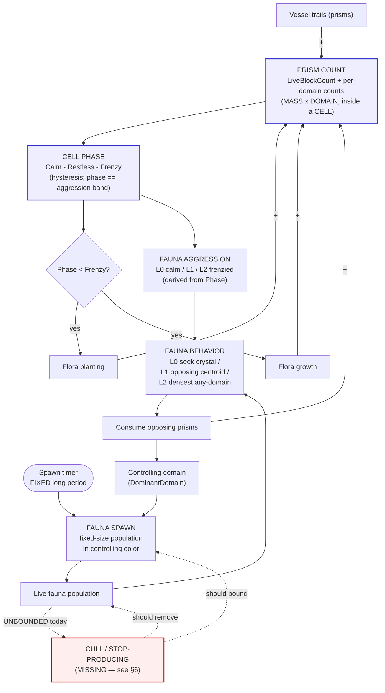
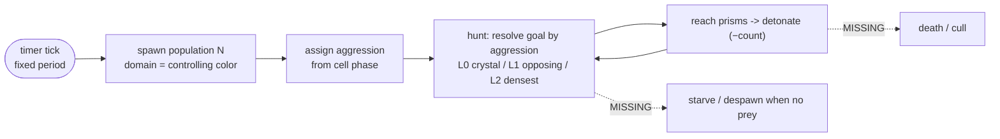

# Cell Ecosystem — Workings, Analysis & Redesign

**Status:** living design doc. Created to map the cell ecology end-to-end so we
can see which parts *produce* and which parts *block* the goal — a dynamic,
vibrant ecosystem players engage with — and redesign the blockers. Built to be
extended as flora and fauna split into sub-categories (e.g. predator /
herbivore).

> Diagrams are [Mermaid](https://mermaid.js.org/) — they render on GitHub. An
> ASCII fallback of the core loop is inline in §3 for quick reading.

---

## 0. Invariant — mass is conserved (no passive decay)

**Read this first; it constrains every solution below.** A prism — whether a
lifeform's health-prism or vessel-spawned — is **only ever removed by an active
force**:

1. **A vessel using an ability** (combat), or
2. **Fauna eating it** (consumption).

There is **no passive decay, aging, lifespan, timed culler, or growth/decay
oscillator** anywhere in the prism pipeline. Population homeostasis is the job of
the **food web**, not of artificial removal:

- A **large accumulation of prisms is a valid state**, not a defect to
  auto-correct. It persists until an active force consumes it.
- The only outcomes for a big accumulation are: **fauna consume it** (opposing-
  domain fauna graze it down), **or** the fauna that depend on that prey **starve
  and the population crashes** (because the mass is the wrong domain for them, or
  out of reach). Either is correct emergent behavior.

This is why **prism decay / mortality was considered and rejected** (it was the
original Phase 2 "step 1"). A timed culler is just the flora regrowth pulse
inverted — a hard-coded oscillator that manufactures the "breathing" we want to
*emerge* from the predator–prey loop. If a cell "freezes," the fix is to give an
active force a reason or ability to consume that mass (tune fauna diet/reach/
spawning, or vessel abilities) — **never** to add decay. See CLAUDE.md → "Mass"
fundamental and "Don't cheat emergence."

**Growth-side cheats — all retired.** Two artificial throttles used to fake the
homeostasis the food web is meant to produce, both now gone:

1. The flora **regrowth pulse** (a periodic growth window above the freeze
   threshold) — retired earlier.
2. The flora **phase-gated self-limit**: planting stopped at a low phase and
   growth stopped at a mid phase, so the canopy capped itself well before the
   cell was full. **Retired now** — flora plant *and* grow at a **steady rate
   until Frenzy** (the top phase), and the only down-force is the food web
   (opposing-domain fauna grazing the prisms) or a vessel ability. A cell with no
   active force on it climbs to Frenzy and stays there (a *valid* equilibrium,
   §0) until something eats its mass back below the Frenzy exit threshold, at
   which point the existing hysteresis resumes growth on its own. Retiring this
   staggered self-limit is what **collapsed the phase ladder from six rungs to
   three** (Calm → Restless → Frenzy) — the extra rungs only existed to stage the
   flora-vs-fauna events that no longer differ. See §1, §5.

---

## 1. The spine: everything keys off **prism count**

One state variable drives the whole system: the cell's live prism count
(`Cell.LiveBlockCount` = `trackedBlocks.Count`, plus per-domain counts via
`GetDomainBlockCount`). Prisms are the **mass** fundamental made concrete; the
cell is the **cell** fundamental; the color on each prism is the **domain**
fundamental. Everything else is a projection of, or a force on, prism count.

| Force on prism count | Sign | Source |
|---|---|---|
| Vessel trails | **+** | players/AI flying through the cell → `Cell.AddBlock` |
| Flora planting | **+** | new flora instantiated (`RandomLifeSpawner`) → health prisms → `AddBlock`. Steady rate until Frenzy. |
| Flora growth | **+** | existing flora grow new prisms (`Flora.Grow`) → `AddBlock`. Steady rate until Frenzy. |
| Fauna consumption | **−** | fauna seek & detonate opposing-domain prisms → `RemoveBlock` |
| Vessel abilities (combat) | **−** | vessel impacts / ability use → prism death → `RemoveBlock` |

> The **−** column is exhaustive: fauna consumption and vessel abilities are the
> *only* prism sinks. There is no decay/aging row — mass is conserved (§0). And
> the **+** column has no self-limit: flora plant + grow at a steady rate until
> Frenzy (no early planting cap, no mid-range growth cap — those staggered phase
> gates were a growth-side cheat, retired in §0).

Prism count → **Cell Phase** (`Calm → Restless → Frenzy`, computed with enter/exit
**hysteresis** so the cell doesn't chatter on the boundary). The three phases map
1:1 onto the three fauna aggression bands — the phase *is* the aggression band.
Phase is the single dial the rest of the ecology reads:

- **Calm** — low mass. Flora grow + plant freely; fauna idle toward the crystal (L0).
- **Restless** — mid mass. Fauna hunt the nearest opposing-color centroid (L1).
- **Frenzy** — frenzy ceiling. Flora **stop**; fauna seek any-domain density, drop
  friendly avoidance, ignore danger prisms (L2). The cell only leaves Frenzy when
  an active force eats its mass back below the Frenzy exit threshold.

---

## 2. Full ecosystem diagram



### The three feedback loops (this is where "vibrant" lives or dies)

1. **Flora freeze at Frenzy (hard ceiling, NOT a self-limit).** `count↑ → phase↑ →
   at Frenzy, planting + growth stop.` Flora plant + grow at a **steady rate** the
   whole way up — there is no early planting cap and no mid-range growth cap (those
   staggered self-limit gates were a growth-side cheat, retired §0). Frenzy is just
   the top of the hysteresis band, not a homeostatic throttle: a cell that reaches
   Frenzy stays full until the **food web** (loop #2) grazes its mass back down, so
   the down-force on flora is the predator–prey loop, not flora throttling itself. ✅
2. **Predator–prey (negative, the heartbeat).** `count↑ → aggression↑ → fauna hunt
   harder/closer → consume more → count↓ → aggression↓ → …` This is the
   oscillation that should make the cell feel alive. Per the latest decision this
   loop runs **through aggression (behavior)**, not through spawn rate. ✅ (once
   §6 lands)
3. **Population control (negative, MISSING).** Nothing removes fauna or throttles
   production. Fixed-period spawning with no death ⇒ fauna accumulate without
   bound. This is the loop we must add. ❌

### ASCII core loop (quick read)

```
        +-----------------------------------------------------+
        |                                                     |
        v                                                     |
   PRISM COUNT --> PHASE --> AGGRESSION --> fauna hunt --> CONSUME (−)
        ^   ^                                                  |
        |   |                                                  |
   flora +  +-- planting + growth freeze ONLY at Frenzy (ceiling, not a throttle)
   trail +                                                     |
                                                               |
   SPAWN (timer, fixed N, controlling color) --> POPULATION ---+
                                                     |
                                                     X  no cull / no cap  (MISSING)
```

---

## 3. Fauna lifecycle (today vs. target)



Dashed = not implemented. Fauna currently spawn, hunt forever, and never leave.

---

## 4. Part-by-part analysis

| # | Part | Driver | Current behavior | Desired | Gap / action |
|---|---|---|---|---|---|
| 1 | Prism count (state) | trail + flora − fauna/combat | tracked via Add/RemoveBlock, per-domain | same | ✅ the spine, leave alone |
| 2 | Cell phase | prism count + hysteresis | Calm→Frenzy (3 phases) | same | ✅ 2 thresholds tunable per biome |
| 3 | Flora **planting** | `Phase < Frenzy` | steady rate until Frenzy | prism-count driven | ✅ steady-until-frenzy (cheat removed) |
| 4 | Flora **growth** | `Phase < Frenzy` | steady rate until Frenzy | prism-count driven | ✅ `AssembledFlora`/`BranchingFlora`; same gate as planting |
| 5 | Fauna **aggression** | Phase → L0/L1/L2 | seek crystal→opposing→densest | prism-count driven | ✅ works; extension seam for a 4th tier / per-subtype |
| 6 | Fauna **spawn timing** | timer + phase gate + aggression-scaled interval | gated + variable period | **timer only, FIXED period** | 🔧 drop phase gate; drop aggression interval scaling |
| 7 | Fauna **spawn count** | 1 per tick | single fauna | **fixed-size population** | 🔧 spawn N per tick |
| 8 | Fauna **domain** | `PickRandomDomain(excluded = local)` + `FaunaExcludeLocalDomain=true` | never the controller's color | **controlling color** | 🔧 use `host.ControllingDomain` — **this is the "no Jade fauna" bug** |
| 9 | Spawn-cycle HUD ring | `CurrentFaunaSpawnPeriod` (aggression-scaled) | period varies | base fixed period | 🔧 ring reads base period (no aggression scaling) |
| 10 | Fauna **population bound** | none | unbounded (no death/cap) | bounded | ❌ **MISSING — §6 decision** |
| 11 | Fauna **consume → −prisms** | aggression behavior → impact | reduces opposing prisms | same | ✅ this is the prey side of loop #2 |

**Root causes of what you saw:**
- *Dead spawn-cycle ring* → `RandomLifeSpawner` never called `RecordFaunaSpawn` (fixed in the retrofit). **Correction:** NOT all scenes run `RandomLifeSpawner` — the WildlifeBlitz scenes (`MinigameWildlifeBlitz`, `MinigameWildlifeBlitzMultuplayerCoOp`) and `MinigameTournamentMultuplayer` select `IntensityWiseLifeSpawner` (`cellTypeChoiceOptions: 1`). Menu, Skim Race, and the rest use `Random` (0).
- *No fauna in menu* → fauna were gated on scored team volume (~0 in Menu_Main). Retrofit moved them to a phase gate; the redesign moves them to **timer only**.
- *No Jade fauna when Jade controls* → row 8: the controlling/local color is **excluded by construction**.

---

## 5. Redesign — locked decisions

From the latest direction ("keep period and swarm size fixed, rely on modifying
the aggression levels of all fauna" + "do what's best for basic functionality to
first approximations, build to extend"):

- **Aggression is the lever.** `prism count → phase → aggression level → fauna
  behavior`. Spawn **period and population size are FIXED** (config values, tuned
  "much longer" than today). Aggression does **not** feed spawn rate/size — only
  behavior. This makes loop #2 the heartbeat.
- **Fauna domain = controlling color** (`host.ControllingDomain`). Fixes the Jade
  bug; the dominant domain's fauna proliferate and hunt the minority. Trivial,
  certain change — folded into the spawn rewrite.
- **Spawn = timer-driven**, no phase gate, **population of fixed N** per tick.
- **HUD ring = base fixed period** (remove the aggression scaling the retrofit
  added to `ScaleFaunaInterval` / `CurrentFaunaSpawnPeriod`).
- **Keep 3 aggression tiers** — and they are now the **same thing as the phases**.
  The 3-phase collapse made `CellPhase` (Calm / Restless / Frenzy) map 1:1 onto
  `CellAggressionLevel` (L0 / L1 / L2). Frenzy = top tier; a 4th "berserk" tier or
  per-subtype aggression curves slot into the existing `CellAggressionLevel` switch
  when the predator/herbivore split deepens (§7).
- **The phase ladder is the aggression ladder.** Because flora are no longer
  staggered on their own rungs (steady until Frenzy, §0), a cell needs only **two
  thresholds** to author: `RestlessEnter` (fauna start hunting) and `FrenzyEnter`
  (flora freeze + max aggression). Down from five. The per-biome boundaries are
  unchanged in value by the collapse — only the redundant middle rungs were dropped —
  so existing fauna aggression behavior is identical; only flora now fills denser
  (it grows to Frenzy instead of stopping at the old mid-range growth cap).

### 5.1 Density & the steady-until-frenzy model (cells were sparse / froze solid)

- **Scaled-up capacity.** The menu's `Blob Cell Config` thresholds are now
  `RestlessEnter 3000 / FrenzyEnter 5400` (was the tiny "widened for visibility"
  values). Raising `FrenzyEnter` raises both the prism-count ceiling *and* the
  `DomainVolumeIndicator` volume scale (it ranges against `FrenzyEnter`). Other
  biomes use the high code `Default` (`FrenzyEnter 15000`); Skim Race is
  `RestlessEnter 600 / FrenzyEnter 2000`.
- **Flora grow steadily until Frenzy.** The old "stop planting at a low phase, stop
  growing at a mid phase" staggered self-limit (and, before it, the periodic
  **regrowth pulse**) are **both retired** — they were growth-side cheats faking the
  breathing the food web is meant to produce (§0). `Cell.FloraGrowingEnabled` /
  `FloraPlantingEnabled` are now simply `phase < Frenzy`: flora plant + grow at a
  steady rate the whole way up, then freeze at Frenzy.

> The honest model: a frozen-solid cell at Frenzy is a **valid state**, not a defect
> to auto-correct. It stays frozen until an active force — opposing-domain fauna
> grazing it, or a vessel ability — removes mass and the existing `phase < Frenzy`
> hysteresis resumes growth on its own. Mass is conserved; the down-force is the
> **food web**, never decay or a growth/decay oscillator. See §0 and §10.

---

## 6. Decision — fauna bounded by **prey-linked starvation** (option C)

This is loop #3, and it's the one thing that, missing, prevents the ecosystem
from breathing. Three ways to add the negative feedback, smallest→most emergent:

| Option | Mechanism | Pros | Cons |
|---|---|---|---|
| **A. Population cap (stop-producing)** | Track live fauna per cell (we already have `spawnedLifeForms` / `LifeFormsInCell`); timer skips spawning while count ≥ `MaxFaunaPerCell`, resumes when it drops | Dead simple, deterministic, prevents runaway today | Doesn't itself remove fauna — needs a removal source to recover |
| **B. Lifespan (natural cull)** | Each fauna despawns after `T` seconds | Self-bounding (pop ≈ rate × T), simple, predictable | Decoupled from prey — not yet "emergent", just a timer |
| **C. Prey-linked / starvation (emergent)** | Fauna persist only while prey (opposing prisms) is reachable; they **starve & despawn** when prism food is scarce, and production pauses when food is low | Ties population to prism count → genuine predator–prey oscillation; this is where the **predator/herbivore** split naturally lives (herbivores eat flora prisms, predators eat herbivores) | Most work; needs a hunger/last-fed state on fauna |

**Decision: C (prey-linked).** Implemented now rather than the A+B interim — it's
the emergent north star and the seam the predator/herbivore split plugs into.

**Implemented:**
- `Cell.OpposingBlockCount(domain)` = live prisms not of `domain` — the prey signal.
- **Production pauses** when `OpposingBlockCount(controllingColor) < FaunaFoodFloor`
  (`SpawnProfileSO`, default 5): the timer keeps ticking but no population spawns.
- **Starvation cull** on `Fauna`/`LightFauna`: a creature that hasn't consumed a
  prism in `starvationSeconds` (default 30, `Fauna` field) despawns; `NotifyFed()`
  resets the clock on every `Consume`.
- Net: population self-bounds to prey, no hard cap. Because fauna only *hunt*
  opposing prisms at higher aggression (L1+), and aggression rises with prism
  count, **survival tracks prism count** — low mass ⇒ fauna can't find food ⇒ they
  thin out; high mass ⇒ they feed and multiply. That coupling is the oscillation.

**Tuning knobs** (watch in Menu_Main, expect to adjust): `starvationSeconds` (too
low ⇒ fauna starve before reaching prey; raise it), `FaunaFoodFloor` (min prey
before a burst), `PopulationSize` (`FaunaConfigurationSO`, swarm size),
`BaseFaunaSpawnTime` (fixed period). No hard population cap was added; if a
prey-rich cell ever spikes fauna enough to hurt frame-rate, add a high safety cap
as a backstop (not the primary control).

---

## 7. Predator / herbivore split — IMPLEMENTED + wired (3 species)

The diet split is in code (`FaunaDiet` enum + `Fauna.diet` + `LightFauna`
consume branch + `Fauna.Predated`) **and wired into the Blob (menu) test cell**
with the team's three real species:

| Species | Prefab | Component | Diet | Role |
|---|---|---|---|---|
| **Tadpole** | `MassTadPoleFauna` | `Boid` (`forager: 1`) | Herbivore | flocking forager swarm |
| **Brittlestar** | `MassBrittlestarFauna` | `LightFauna` | Herbivore | grazer |
| **Shark** | `MassSharkFauna` | `LightFauna` | **Predator** (`diet: 1`) | apex; eats *both* herbivores |

All three are **spawnable** by the cell config (`SpawnProfileSO.SupportedFaunas`,
via `RandomLifeSpawner`). Two herbivore species + one predator. **Currently only
the two herbivores are wired into the test profiles** — the shark is built and
balanced (spawn-immunity exists) but left out of both scenes for now (see §7.2);
its config asset still exists, so re-adding it is one line in a profile.

> **The live spawn path is the cell config — NOT the scene-placed populations.**
> The `MassTadpolePopulation` / `MassBrittlestarPopulation` etc. objects in scenes
> are wired through a `Cell` field named `fauna2` that **no longer exists** on
> `Cell.cs` — a dead/stale prefab override Unity ignores. So those `BoidManager`/
> `LightFaunaManager` populations **never instantiate**. Every working fauna comes
> from a `FaunaConfigurationSO` in the cell's `SpawnProfileSO`. (This is why
> removing the tadpole config = no tadpoles, regardless of the placed population.)

- **Diet = "what counts as prey"** is a `FaunaDiet diet` field on the `Fauna`
  base (`Herbivore` / `Predator`), defaulting to **Herbivore**:
  - **Herbivore** — eats prism MASS, but the two herbivore species differ:
    - `LightFauna` (brittlestar) `Consume`s **opposing-domain** flora/trail prisms
      within `consumeRadius`.
    - `Boid` (tadpole forager) `Consume`s (implode → **suction shader**) any
      **unshielded** prism of **any domain** that is **not a fauna body** — so it
      grazes the *dominant* trail too (the bulk of the obstacle mass), while
      skipping the shielded race track and other creatures. Detect/eat radius =
      `cohesionRadius`/`trailBlockInteractionRadius` (currently 50/45). (Boid's
      Attach/mound effect is unused by tadpoles but stays — drone abilities use it.)
  - **Predator** — consumes **herbivore fauna of any species** via
    `GetComponentInParent<Fauna>()` on nearby colliders (matches the `Fauna` base,
    so a shark eats both `LightFauna` brittlestars and `Boid` tadpoles) →
    `prey.Predated()`. Predators **never** eat prism mass. Predation **ignores
    domain** (a diet relationship, not a team fight) so predators have prey even in
    a single-domain cell — the food web bounds them, not the domain split.
- **Population bounds (per species) — all starvation-linked:**
  - *Brittlestar* (`LightFauna`) — `Fauna.IsStarving → Die` + shark predation.
  - *Tadpole* (`Boid`, `forager: 1`) — feeds (`NotifyFed`) when it grazes any
    edible prism, and starves (`IsStarving → Die`) after `starvationSeconds` (90 on
    the prefab) without feeding. So the swarm **self-limits to available prey**: it
    grows where there's mass to eat and thins out (dropping its CPU cost) once the
    obstacles are cleared. The `forager` flag is OFF on the drone `Boid` path
    (BoidController/mound), which must not starve.
  - *Shark* (`LightFauna`) — `IsStarving → Die` when no herbivores are reachable.
  Net: a self-bounding food web — the spawner keeps adding `PopulationSize` per
  period while there's prey; starvation + predation remove them when there isn't.
- **Targeting (v1):** predators reuse the shared phase-based goal (density-grid
  centroids). Herbivores swarm opposing-flora density; predators seek the same
  centroids and so converge on the herbivores feeding there, eating them on
  contact. Explicit "seek nearest herbivore" steering is a future refinement (no
  central fauna registry exists yet).
- **Spawn gating (known approximation):** `RandomLifeSpawner` gates every fauna
  population on `OpposingBlockCount >= FaunaFoodFloor` (prism prey). For predators
  this is a *proxy* (dense prisms ⇒ herbivores present ⇒ predator food); the real
  bound is starvation. Refinement: gate predator spawn on herbivore count.
- **Aggression tiers** stay the behavior dial per diet (a 4th tier or per-diet
  curves slot into the existing `CellAggressionLevel` switch points:
  `Cell.AggressionLevel`, `Fauna.ResolveGoal` / `LightFauna.UpdateBehavior`).

### 7.1 Wiring recipe
- **Predator diet:** `MassSharkFauna`'s `LightFauna` has `diet: 1` (Predator);
  `MassTadPoleFauna`'s `Boid` has `forager: 1`. Herbivore brittlestar needs nothing.
- **One `FaunaConfigurationSO` per species**, pointing at the **creature** prefab's
  Fauna component (Boid for tadpole, LightFauna for brittlestar/shark) — *not* the
  Population/manager prefab — listed in the cell's `SpawnProfileSO.SupportedFaunas`.
  `PopulationSize` = boids spawned per period (tadpole bigger for the swarm,
  predator smaller for the apex tier).
- **Swarm size = tadpole `PopulationSize`** (Blob 25, Skim Race 12). The spawner
  adds that many per `BaseFaunaSpawnTime`; starvation caps the standing count to
  available prey, so a denser swarm needs a higher `PopulationSize` *and* enough
  prey to keep it fed.

> **Don't rely on the scene-placed `*Population` objects** — they're wired through
> the dead `Cell.fauna2` field (removed) and never spawn (see the §7 note). The
> `Boid` mound code stays in the class (drone abilities use it via BoidController);
> the tadpole prefab just never invokes it (Explode-only, `forager: 1`).

### 7.2 Trail-management test deployments (two scenes)

The food web is wired into two scenes to test the ecosystem's ability to manage
**trail** prisms (player/AI mass), not just flora:

**A. Menu_Main freestyle toy box** (`Blob Cell Config → Blob Cell Spawn Profile`).
Flora + two herbivores: tadpole forager (`PopulationSize` 25, the swarm) +
brittlestar. **No shark** (removed — see the predator note below). The
autopilot/player vessel lays trails; the tadpole grazes any unshielded non-fauna
mass (incl. the dominant trail + flora), the brittlestar grazes opposing mass.
Goal: a self-sustaining scene that stays visually interesting and playable
**indefinitely**. Levers: tadpole `PopulationSize` (swarm density), `Blob Cell
Spawn Profile` `BaseFaunaSpawnTime` / `FaunaFoodFloor`, `starvationSeconds` /
`consumeRadius`.

**B. Skim Race** (`MinigameHexRace`, dedicated `Skim Race Cell Config → Skim Race
Spawn Profile`, isolated from the 6 other scenes that share the Barren config).
**No flora**; only the herbivore forager swarm (tadpole `PopulationSize` 12 +
brittlestar), **Random** spawner (`cellTypeChoiceOptions = 0`) so spawning is
prey-linked. Hypothesis: at late laps / high player counts, AI orbiting crystals
leave an excess of **trail-prism obstacles**; the forager swarm grazes them →
fewer prisms → better perf; foragers self-limit (starve) once the obstacles are
cleared.

> **Sharks (predators) are currently REMOVED from both test scenes.** Why: all
> fauna spawn co-located at the cell centre, and once predator detection was
> generalized to the `Fauna` base (so sharks eat `Boid` tadpoles, not just
> `LightFauna`), the sharks ate **every** herbivore the instant it spawned —
> leaving "only sharks" and nothing to graze trails. Predators are also
> counterproductive to the perf goal (they remove foragers). **Spawn immunity is
> now built** (`Fauna.predationImmunitySeconds`, default 6s, stamped in `Awake`;
> `Predated` refuses during the window) so a balanced predator CAN be re-added
> safely — just add the `Blob Shark` config back to the menu profile (keep
> `PopulationSize` low). I left it out so it doesn't muddy the foraging test; say
> the word and I'll wire it in.

> **Other caveats to validate in-editor (I can't run Unity):**
> 2. **Sense coverage (addressed — tune `SenseRadiusOverride`).** Registration +
>    density targeting used to be capped at the ~1200 membrane while the track runs
>    ~4000 long, so foragers only sensed/cleaned the central bubble. Now
>    `Cell.SenseRadius` (a `CellConfig.SenseRadiusOverride`, **3000** on Skim Race)
>    decouples sensing from the visual membrane, so the cell registers + builds its
>    density grid across the whole track and the forager's `ResolveGoal` (=
>    `GetDensestRegionAnyDomain`) sends the swarm to the densest trail buildup
>    track-wide — emergent, not track-following. If foragers still don't reach a
>    far end, raise `SenseRadiusOverride`; if the grid feels too coarse, lower it.
> 3. **Domain.** Foragers eat *opposing*-domain mass, so the dominant domain's own
>    trail isn't grazed by its own fauna. At multi-domain player counts most trail
>    mass is still "opposing" to *some* school, but the single dominant trail is the
>    one accumulation the food web won't touch.
> 4. **Client-local fauna.** Fauna + trail prisms have **no `NetworkObject`** —
>    client-local (trails reconstructed from networked vessel movement; cell phase
>    synced via `CellNetworkSync`). Fine for a per-client **perf** test and the
>    menu; **diverges across clients**, so not yet fair for competitive play.
> 5. **Net perf.** Fauna cost CPU (per-tick `OverlapSphere` per creature). Test
>    whether trail savings beat fauna cost: start modest and profile before/after;
>    scale `PopulationSize` only if net-positive.

---

## 8. Build order

1. ✅ Map + agree the redesign and the §6 bound.
2. ✅ Spawn rewrite in `RandomLifeSpawner`: timer-only, fixed period, fixed
   population N, `ControllingDomain`; `CurrentFaunaSpawnPeriod` simplified to base
   period. (`IntensityWiseLifeSpawner` left as-is — it is STILL USED by the
   WildlifeBlitz + Tournament scenes via `cellTypeChoiceOptions: 1`; do NOT delete.)
3. ✅ §6 bound = option C: `OpposingBlockCount` prey signal + `FaunaFoodFloor`
   production gate + `starvationSeconds` despawn. Config on `SpawnProfileSO` /
   `FaunaConfigurationSO` / `Fauna`.
4. ⏳ Validate in Menu_Main: Jade fauna appear when Jade controls; populations
   appear, hunt, and thin out as prey runs low; ring sweeps at the fixed period.
   Tune the §6 knobs.
5. ✅/⏳ Predator/herbivore diet split — **code landed** (`FaunaDiet` + `Fauna.diet`
   + `LightFauna` consume branch + `Fauna.Predated`); two-tier starvation =
   Lotka–Volterra. Remaining: author a predator prefab/config and wire it into a
   `SpawnProfileSO`, then tune in-editor (§7.1).
6. ✅ Retire the regrowth pulse AND the flora phase-gated self-limit — **done**
   (`FloraGrowingEnabled = FloraPlantingEnabled = phase < Frenzy`; steady growth +
   planting until frenzy). This collapsed the phase ladder 6→3 (Calm/Restless/Frenzy).

---

## 9. Key files

| Concern | File |
|---|---|
| Prism count, phase, gates, aggression, controlling domain | `Assets/_Scripts/Controller/Environment/Cell.cs` |
| Phase thresholds + hysteresis | `Assets/_Scripts/.../CellPhaseRules.cs`, `CellPhase` enum, Blob Cell Config asset |
| Spawner all scenes run | `Assets/_Scripts/Controller/Environment/RandomLifeSpawner.cs` |
| Regulated spawner — USED by WildlifeBlitz + Tournament (`cellTypeChoiceOptions: 1`) | `Assets/_Scripts/Controller/Environment/IntensityWiseLifeSpawner.cs` |
| Spawn helpers (`SpawnFaunaWithDomain`, `PickRandomDomain`) | `Assets/_Scripts/Controller/Environment/CellLifeSpawnerBase.cs` |
| Fauna base: domain, goal, diet, starvation, `Predated` | `Assets/_Scripts/Controller/Environment/FloraAndFauna/Fauna.cs` |
| Creature behavior + diet-branched consume (herbivore prisms / predator fauna) | `Assets/_Scripts/Controller/Environment/FloraAndFauna/LightFauna.cs` |
| Diet enum (Herbivore / Predator) | `Assets/_Scripts/Data/Enums/FaunaDiet.cs` |
| Flora plant + growth gate (now just `phase < Frenzy`) | `AssembledFlora.cs`, `BranchingFlora.cs`, `Cell.FloraGrowingEnabled` / `FloraPlantingEnabled` |
| Spawn tuning (period, population, food floor) | `SpawnProfileSO.cs`, `FaunaConfigurationSO.cs` |
| Aggression enum + tier behaviors | `Assets/_Scripts/Data/Enums/CellAggressionLevel.cs` |
| Indicator (hex gauge + spawn ring, no numbers) | `Assets/_Scripts/UI/DomainVolumeIndicator.cs` |

---

## 10. Roadmap

### Phase 1 — stabilize & ship to bleeding-edge

Goal: everything on `keen-newton` is correct, safe across **all** scenes (every
scene runs `RandomLifeSpawner`, so these changes are global), and mergeable so the
work is saved and Phase 2 can be picked up.

1. **In-editor validation (the gate — needs a human; I can't run Unity).**
   - *Menu_Main:* dense flora, flora visibly resume growing in pulses, fauna spawn
     in the controlling color (Jade appears when Jade leads), hunt, and thin out as
     prey runs low; spawn ring sweeps; **no numeric readout**.
   - *One gameplay scene* (e.g. `MinigameFreestyle` / `MinigameHexRace`): confirm
     the prey-linked fauna + flora regrowth pulse don't break gameplay — fauna
     still appear, nothing runs away, framerate holds.
2. **Perf pass** at the new menu density (~4200 prisms steady). If it dips on a
   target device, lower `Blob Cell Config` `FrenzyEnter` (one asset).
3. **`IntensityWiseLifeSpawner` is LIVE, not dead** (earlier notes were wrong).
   The WildlifeBlitz + Tournament scenes select it (`cellTypeChoiceOptions: 1`);
   Menu/Skim Race/etc. use `Random`. **Do NOT delete it.** It has diverged from
   `RandomLifeSpawner` (no prey-linked `FaunaFoodFloor` gate, spawns 1/tick not a
   population), so if those scenes ever wire fauna into their `SupportedFaunas`
   they'll behave differently — reconcile the two spawners then, don't remove one.
4. **Confirm the global defaults are wanted in gameplay**, not just the menu:
   steady-until-frenzy flora growth (`phase < Frenzy`) and prey-linked fauna
   (controlling-color + starvation) now apply to every biome. The steady-growth
   change makes every cell fill **denser** (flora grow to `FrenzyEnter` instead of
   stopping at the old mid-range cap) — for WildlifeBlitz that's growth to 15000 vs
   the old ~10000. If a gameplay biome wants a lower ceiling, lower its
   `FrenzyEnter` (one asset). No per-biome "old hard-freeze" switch exists — the
   model is uniform now.
5. **Merge `keen-newton` → bleeding-edge.** Needs an explicit go-ahead (different
   branch); I can open the PR and write the summary on request.

### Phase 2 — toward the ultimate dynamic, emergent ecosystem

North star: a *small* set of fundamentals (Domain, Mass/prisms, Cells, Flora &
Fauna, Elementals, Vessels) whose interactions produce rich, self-balancing,
surprising behavior — and progressively **retire the scaffolding** (the regrowth
pulse, the fixed-period spawner) as real emergent forces replace them. Ordered
highest-impact / lowest-risk first; each step ships independently and composes
with the others.

1. **~~Prism mortality / decay~~ — REJECTED (see §0).** The original plan was
   that flora prisms age and die so the count falls on its own, retiring the
   regrowth-pulse cheat. **This is itself a cheat** and is not the path: mass is
   conserved, prisms are removed only by active forces (vessel abilities + fauna
   consumption). The real down-force on a dominant accumulation is the **food
   web** — opposing-domain fauna grazing it, or, failing that, fauna starving (a
   crash on the predator side, not a vanish on the prism side). So the work here
   is **not** to add a culler; it is to make the food web strong enough that
   accumulations get eaten — and to **retire the regrowth pulse outright**,
   accepting that a cell with no active force on it stays full (a valid state).
   That makes step 2 (predator/herbivore) the real first lever.

2. **Predator / herbivore split** — *the centerpiece, and the actual first step.*
   Sub-type on `FaunaConfigurationSO` (Herbivore / Predator). "Diet = what counts
   as prey" parameterizes the existing `Fauna.ResolveGoal`/consume + starvation
   hooks: herbivores eat flora prisms, predators eat herbivore fauna. Two-tier
   starvation → genuine Lotka–Volterra oscillation (flora→herbivores→predators→…).

3. **Fauna reproduction** — *retires the fixed-period-spawner cheat.*
   Well-fed fauna reproduce; the spawner becomes a one-time *seeder*, not the
   population driver. Population becomes a true function of the food web.

4. **Elemental integration** — *ties the ecology to gameplay.*
   Flora/fauna express their effects through **Elementals** (Charge/Mass/Space/
   Time) rather than bespoke buffs: a domain's flora buff its vessels, fauna debuff
   opposing mass. Vessels start to *feel* the ecosystem. Composes with Domain,
   Vessels, Elementals.

5. **Domain territory dynamics.**
   As fauna cull opposing prisms and flora regrow, a cell's controlling domain
   shifts over time, and flora/fauna domains follow — visible territorial ebb and
   flow instead of monoculture lock-in.

6. **Flora succession & variety.**
   Different flora favor different phases (pioneers at Calm, canopy at Restless),
   so a maturing cell visibly changes character.

7. **Cross-cell ecology (migration).**
   Fauna migrate to adjacent cells chasing prey; crowded/empty cells rebalance —
   isolated cells become one connected biome.

**Cheats currently in place, to retire as Phase 2 lands:** the **fixed-period fauna
spawner** is now the *only* remaining scaffolding cheat (→ step 3, reproduction).
The flora **regrowth pulse** and the flora **phase-gated self-limit** are both
**retired** (§0/§5 — flora grow + plant steadily until Frenzy). **Note:** retiring
those is *not* replaced by prism decay (that was the rejected step 1 — see §0). It
is replaced by *nothing* on the removal side — mass is conserved — so a cell only
comes back down when an active force (fauna grazing / vessel abilities) eats its
mass. The down-force we strengthen is the **food web** (step 2), not a culler.

---

## 11. Authoring a new ecosystem — config-completeness checklist

The platform goal (kickoff): **a new ecosystem = new config assets + a Cell in a
scene, with zero new C#.** This section is the audit of how close we are and the
exact recipe. As of the 3-phase collapse, standing up a biome is fully data-driven.

### What defines an ecosystem (the assets — no code)

| Layer | Asset | Authors |
|---|---|---|
| **Biome** | `CellConfigDataSO` | membrane/nucleus/cytoplasm prefabs, `CellModifiers`, the `SpawnProfile` ref, `SenseRadiusOverride` (grid coverage vs. visual membrane), and the **2 phase thresholds** `PhaseThresholds` (`RestlessEnter/Exit`, `FrenzyEnter/Exit`) |
| **Food web roster + cadence** | `SpawnProfileSO` | `SupportedFloras[]`, `SupportedFaunas[]`, `BaseFaunaSpawnTime` (fixed spawn period), `FaunaFoodFloor` (prey floor for production), initial delays/intervals, `FloraExcludeLocalDomain` |
| **Flora species** (1 per type) | `FloraConfigurationSO` | `FloraPrefab`, `SpawnProbability`, `InitialSpawnCount`, plant-period override |
| **Fauna species** (1 per type) | `FaunaConfigurationSO` | `FaunaPrefab`, `PopulationSize` (swarm size per burst), `InitialSpawnCount`, `SpawnProbability` |
| **Per-creature tuning** | the flora/fauna **prefabs** | diet (`FaunaDiet`), `starvationSeconds`, `predationImmunitySeconds`, `forager` (Boid), consume/detection radii (`LightFaunaDataSO`), aggression-curve multipliers, body `HealthPrism`s |

**Recipe for a brand-new biome (zero code):**
1. Author the creature/flora **prefabs** (or reuse Tadpole / Brittlestar / Shark /
   the gyroid floras), each carrying its own diet + starvation + radii.
2. Create one `FaunaConfigurationSO` per fauna species and one
   `FloraConfigurationSO` per flora species, pointing at the prefabs.
3. Create a `SpawnProfileSO` listing those configs + the cadence/floor knobs.
4. Create a `CellConfigDataSO`: visuals + `SpawnProfile` + `SenseRadiusOverride` +
   the two `PhaseThresholds` (`RestlessEnter` = where fauna start hunting,
   `FrenzyEnter` = flora freeze + max aggression).
5. Drop a `Cell` into the scene, add the `CellConfigDataSO` to its `CellConfigs`
   list, leave `cellTypeChoiceOptions = Random`. Done — no C#.

> **Proof-of-platform validation (needs the editor):** author a *third* biome from
> assets only (no code) and confirm it spawns, phases, and breathes. The two test
> biomes (Blob, Skim Race) and the WildlifeBlitz cells already exercise this path.

### Still hardcoded (flagged for future lift — NOT yet "author-only")

These don't block a new biome but are coded constants a future biome can't retune
from assets. Lift them onto a config SO when a biome actually needs to vary them:

- **Aggression curves** are **static arrays** shared by all fauna:
  `LightFauna.CadenceByAggression / ConsumeRadiusByAggression / SpeedByAggression`
  and the `IntensityWiseLifeSpawner.FaunaSpawnIntervalByAggression`. A biome can't
  make its fauna ramp differently. Lift to `FaunaConfigurationSO` (per species) or
  `SpawnProfileSO` (per biome) when needed.
- **`RandomLifeSpawner.FaunaSpawnJitter` (150)** — spawn spread around the mass
  concentration. Const; could be a `SpawnProfileSO` field.
- **`Boid.forager`** is a prefab bool, so the *same* prefab can't be a forager in
  one biome and a drone in another. Authorable per-prefab today; lift to
  `FaunaConfigurationSO` only if a biome needs the dual role.
- **Two spawners** (`RandomLifeSpawner` vs `IntensityWiseLifeSpawner`) selected by
  the Cell's `cellTypeChoiceOptions`. They have diverged (only Random is
  prey-linked). Unify behind config (roadmap / kickoff item 2) so behavior is
  data-selected, not spawner-class-selected.
- **Diet is a 2-value enum** (`Herbivore` / `Predator`). "What counts as prey" is
  not yet a composable selector (by domain relationship / prism provenance / target
  species), so arbitrary multi-tier food webs still need the enum's two branches.
  Generalize on `FaunaConfigurationSO` (kickoff item 3) to unlock "countless webs."

The domain set ({Jade, Ruby, Gold} + the Blue wildcard) is intentionally fixed —
Domain is a fundamental, not a per-biome knob.
