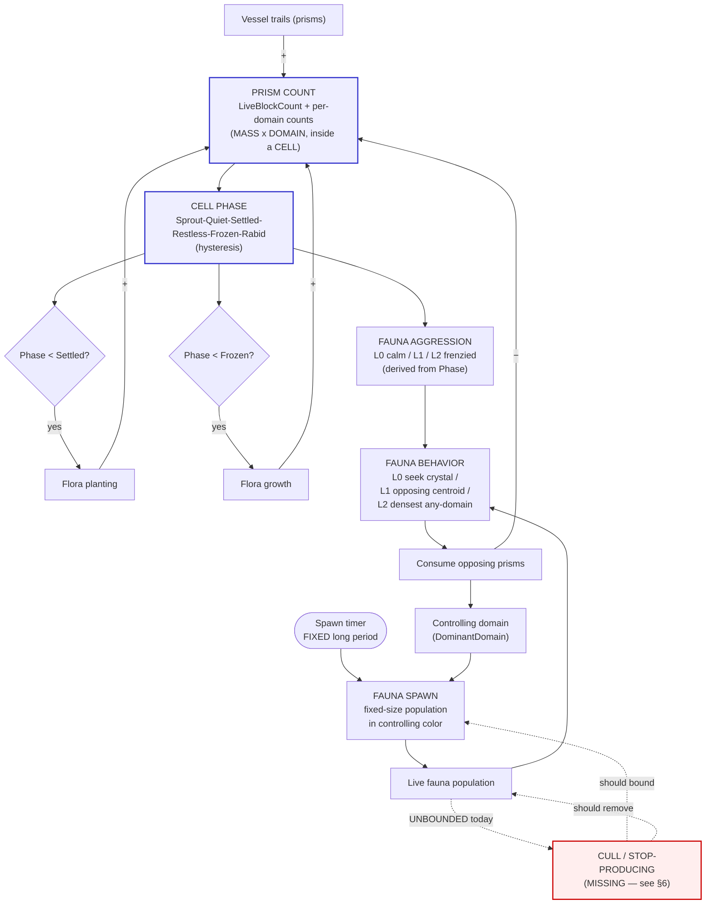

# Cell Ecosystem — Workings, Analysis & Redesign

**Status:** living design doc. Created to map the cell ecology end-to-end so we
can see which parts *produce* and which parts *block* the goal — a dynamic,
vibrant ecosystem players engage with — and redesign the blockers. Built to be
extended as flora and fauna split into sub-categories (e.g. predator /
herbivore).

> Diagrams are [Mermaid](https://mermaid.js.org/) — they render on GitHub. An
> ASCII fallback of the core loop is inline in §3 for quick reading.

---

## 1. The spine: everything keys off **prism count**

One state variable drives the whole system: the cell's live prism count
(`Cell.LiveBlockCount` = `trackedBlocks.Count`, plus per-domain counts via
`GetDomainBlockCount`). Prisms are the **mass** fundamental made concrete; the
cell is the **cell** fundamental; the color on each prism is the **domain**
fundamental. Everything else is a projection of, or a force on, prism count.

| Force on prism count | Sign | Source |
|---|---|---|
| Vessel trails | **+** | players/AI flying through the cell → `Cell.AddBlock` |
| Flora planting | **+** | new flora instantiated (`RandomLifeSpawner`) → health prisms → `AddBlock` |
| Flora growth | **+** | existing flora grow new prisms (`Flora.Grow`) → `AddBlock` |
| Fauna consumption | **−** | fauna seek & detonate opposing-domain prisms → `RemoveBlock` |
| Combat / decay | **−** | vessel impacts, prism death → `RemoveBlock` |

Prism count → **Cell Phase** (`Sprout→Quiet→Settled→Restless→Frozen→Rabid`,
computed with enter/exit **hysteresis** so the cell doesn't chatter on the
boundary). Phase is the single dial the rest of the ecology reads.

---

## 2. Full ecosystem diagram



### The three feedback loops (this is where "vibrant" lives or dies)

1. **Flora self-limit (negative, working).** `count↑ → phase↑ → planting stops at
   Settled, growth stops at Frozen → count stops rising from flora.` Keeps flora
   from filling the cell forever. ✅
2. **Predator–prey (negative, the heartbeat).** `count↑ → aggression↑ → fauna hunt
   harder/closer → consume more → count↓ → aggression↓ → …` This is the
   oscillation that should make the cell feel alive. Per the latest decision this
   loop runs **through aggression (behavior)**, not through spawn rate. ✅ (once
   §6 lands)
3. **Population control (negative, MISSING).** Nothing removes fauna or throttles
   production. Fixed-period spawning with no death ⇒ fauna accumulate without
   bound. This is the loop we must add. ❌

### ASCII core loop (quick read)

```
        +-----------------------------------------------------+
        |                                                     |
        v                                                     |
   PRISM COUNT --> PHASE --> AGGRESSION --> fauna hunt --> CONSUME (−)
        ^   ^                                                  |
        |   |                                                  |
   flora +  +-- planting/growth gates close as phase rises (−) |
   trail +                                                     |
                                                               |
   SPAWN (timer, fixed N, controlling color) --> POPULATION ---+
                                                     |
                                                     X  no cull / no cap  (MISSING)
```

---

## 3. Fauna lifecycle (today vs. target)


Dashed = not implemented. Fauna currently spawn, hunt forever, and never leave.

---

## 4. Part-by-part analysis

| # | Part | Driver | Current behavior | Desired | Gap / action |
|---|---|---|---|---|---|
| 1 | Prism count (state) | trail + flora − fauna/combat | tracked via Add/RemoveBlock, per-domain | same | ✅ the spine, leave alone |
| 2 | Cell phase | prism count + hysteresis | Sprout→Rabid | same | ✅ thresholds tunable per biome |
| 3 | Flora **planting** | `Phase < Settled` | plants while below Settled | prism-count driven | ✅ done (retrofit) |
| 4 | Flora **growth** | `Phase < Frozen` | grows while below Frozen | prism-count driven | ✅ already wired in `AssembledFlora`/`BranchingFlora` |
| 5 | Fauna **aggression** | Phase → L0/L1/L2 | seek crystal→opposing→densest | prism-count driven | ✅ works; extension seam for a 4th tier / per-subtype |
| 6 | Fauna **spawn timing** | timer + `Phase≥Quiet` gate + aggression-scaled interval | gated + variable period | **timer only, FIXED period** | 🔧 drop phase gate; drop aggression interval scaling |
| 7 | Fauna **spawn count** | 1 per tick | single fauna | **fixed-size population** | 🔧 spawn N per tick |
| 8 | Fauna **domain** | `PickRandomDomain(excluded = local)` + `FaunaExcludeLocalDomain=true` | never the controller's color | **controlling color** | 🔧 use `host.ControllingDomain` — **this is the "no Jade fauna" bug** |
| 9 | Spawn-cycle HUD ring | `CurrentFaunaSpawnPeriod` (aggression-scaled) | period varies | base fixed period | 🔧 ring reads base period (no aggression scaling) |
| 10 | Fauna **population bound** | none | unbounded (no death/cap) | bounded | ❌ **MISSING — §6 decision** |
| 11 | Fauna **consume → −prisms** | aggression behavior → impact | reduces opposing prisms | same | ✅ this is the prey side of loop #2 |

**Root causes of what you saw:**
- *Dead spawn-cycle ring* → `RandomLifeSpawner` never called `RecordFaunaSpawn` (fixed in the retrofit; all scenes run `RandomLifeSpawner`, not `IntensityWise`).
- *No fauna in menu* → fauna were gated on scored team volume (~0 in Menu_Main). Retrofit moved them to a phase gate; the redesign moves them to **timer only**.
- *No Jade fauna when Jade controls* → row 8: the controlling/local color is **excluded by construction**.

---

## 5. Redesign — locked decisions

From the latest direction ("keep period and swarm size fixed, rely on modifying
the aggression levels of all fauna" + "do what's best for basic functionality to
first approximations, build to extend"):

- **Aggression is the lever.** `prism count → phase → aggression level → fauna
  behavior`. Spawn **period and population size are FIXED** (config values, tuned
  "much longer" than today). Aggression does **not** feed spawn rate/size — only
  behavior. This makes loop #2 the heartbeat.
- **Fauna domain = controlling color** (`host.ControllingDomain`). Fixes the Jade
  bug; the dominant domain's fauna proliferate and hunt the minority. Trivial,
  certain change — folded into the spawn rewrite.
- **Spawn = timer-driven**, no phase gate, **population of fixed N** per tick.
- **HUD ring = base fixed period** (remove the aggression scaling the retrofit
  added to `ScaleFaunaInterval` / `CurrentFaunaSpawnPeriod`).
- **Keep 3 aggression tiers for now** (first approximation). Rabid = top tier
  today; a 4th "berserk" tier and per-subtype aggression are natural extensions
  when the predator/herbivore split lands (§7).

---

## 6. Decision — fauna bounded by **prey-linked starvation** (option C)

This is loop #3, and it's the one thing that, missing, prevents the ecosystem
from breathing. Three ways to add the negative feedback, smallest→most emergent:

| Option | Mechanism | Pros | Cons |
|---|---|---|---|
| **A. Population cap (stop-producing)** | Track live fauna per cell (we already have `spawnedLifeForms` / `LifeFormsInCell`); timer skips spawning while count ≥ `MaxFaunaPerCell`, resumes when it drops | Dead simple, deterministic, prevents runaway today | Doesn't itself remove fauna — needs a removal source to recover |
| **B. Lifespan (natural cull)** | Each fauna despawns after `T` seconds | Self-bounding (pop ≈ rate × T), simple, predictable | Decoupled from prey — not yet "emergent", just a timer |
| **C. Prey-linked / starvation (emergent)** | Fauna persist only while prey (opposing prisms) is reachable; they **starve & despawn** when prism food is scarce, and production pauses when food is low | Ties population to prism count → genuine predator–prey oscillation; this is where the **predator/herbivore** split naturally lives (herbivores eat flora prisms, predators eat herbivores) | Most work; needs a hunger/last-fed state on fauna |

**Decision: C (prey-linked).** Implemented now rather than the A+B interim — it's
the emergent north star and the seam the predator/herbivore split plugs into.

**Implemented:**
- `Cell.OpposingBlockCount(domain)` = live prisms not of `domain` — the prey signal.
- **Production pauses** when `OpposingBlockCount(controllingColor) < FaunaFoodFloor`
  (`SpawnProfileSO`, default 5): the timer keeps ticking but no population spawns.
- **Starvation cull** on `Fauna`/`LightFauna`: a creature that hasn't consumed a
  prism in `starvationSeconds` (default 30, `Fauna` field) despawns; `NotifyFed()`
  resets the clock on every `Consume`.
- Net: population self-bounds to prey, no hard cap. Because fauna only *hunt*
  opposing prisms at higher aggression (L1+), and aggression rises with prism
  count, **survival tracks prism count** — low mass ⇒ fauna can't find food ⇒ they
  thin out; high mass ⇒ they feed and multiply. That coupling is the oscillation.

**Tuning knobs** (watch in Menu_Main, expect to adjust): `starvationSeconds` (too
low ⇒ fauna starve before reaching prey; raise it), `FaunaFoodFloor` (min prey
before a burst), `PopulationSize` (`FaunaConfigurationSO`, swarm size),
`BaseFaunaSpawnTime` (fixed period). No hard population cap was added; if a
prey-rich cell ever spikes fauna enough to hurt frame-rate, add a high safety cap
as a backstop (not the primary control).

---

## 7. Extensibility — predator / herbivore split (where this is headed)

The redesign is shaped so the split drops in without rework:

- **Fauna sub-type** becomes a field on `FaunaConfigurationSO` (e.g. `Herbivore`
  / `Predator`). `SupportedFaunas` already lists multiple configs per biome.
- **Diet = "what counts as prey"** in `Fauna.ResolveGoal` / consume: herbivores
  target **flora** prisms (any flora-domain mass), predators target **herbivore**
  fauna. Today `ResolveGoal` already switches its target by aggression — diet is
  the same seam, parameterized by sub-type instead of hard-coded to "opposing
  prisms."
- **Option C (starvation)** is the shared population-control mechanism for both:
  herbivores starve when flora is gone; predators starve when herbivores are
  gone. That two-tier starvation is the classic Lotka–Volterra oscillation and is
  exactly the "vibrant ecosystem" target.
- **Aggression tiers** stay the behavior dial per sub-type (a 4th tier or
  per-sub-type curves slot into the existing `CellAggressionLevel` switch points:
  `Cell.AggressionLevel`, `Fauna.ResolveGoal`, `goalUpdateIntervalByAggression`).

---

## 8. Build order

1. ✅ Map + agree the redesign and the §6 bound.
2. ✅ Spawn rewrite in `RandomLifeSpawner`: timer-only, fixed period, fixed
   population N, `ControllingDomain`; `CurrentFaunaSpawnPeriod` simplified to base
   period. (`IntensityWiseLifeSpawner` left as-is — no scene runs it; reconcile or
   delete later.)
3. ✅ §6 bound = option C: `OpposingBlockCount` prey signal + `FaunaFoodFloor`
   production gate + `starvationSeconds` despawn. Config on `SpawnProfileSO` /
   `FaunaConfigurationSO` / `Fauna`.
4. ⏳ Validate in Menu_Main: Jade fauna appear when Jade controls; populations
   appear, hunt, and thin out as prey runs low; ring sweeps at the fixed period.
   Tune the §6 knobs.
5. ⏳ Iterate toward the predator/herbivore sub-type split (diet = "what counts as
   prey"; two-tier starvation = Lotka–Volterra).

---

## 9. Key files

| Concern | File |
|---|---|
| Prism count, phase, gates, aggression, controlling domain | `Assets/_Scripts/Controller/Environment/Cell.cs` |
| Phase thresholds + hysteresis | `Assets/_Scripts/.../CellPhaseRules.cs`, `CellPhase` enum, Blob Cell Config asset |
| Spawner all scenes run | `Assets/_Scripts/Controller/Environment/RandomLifeSpawner.cs` |
| Regulated spawner (parity ref, unused) | `Assets/_Scripts/Controller/Environment/IntensityWiseLifeSpawner.cs` |
| Spawn helpers (`SpawnFaunaWithDomain`, `PickRandomDomain`) | `Assets/_Scripts/Controller/Environment/CellLifeSpawnerBase.cs` |
| Fauna behavior / aggression goal logic | `Assets/_Scripts/Controller/Environment/FloraAndFauna/Fauna.cs` |
| Flora growth gate | `AssembledFlora.cs`, `BranchingFlora.cs` |
| Spawn tuning (period, population, exclude-local) | `SpawnProfileSO.cs`, `FaunaConfigurationSO.cs` |
| Aggression enum + tier behaviors | `Assets/_Scripts/Data/Enums/CellAggressionLevel.cs` |
