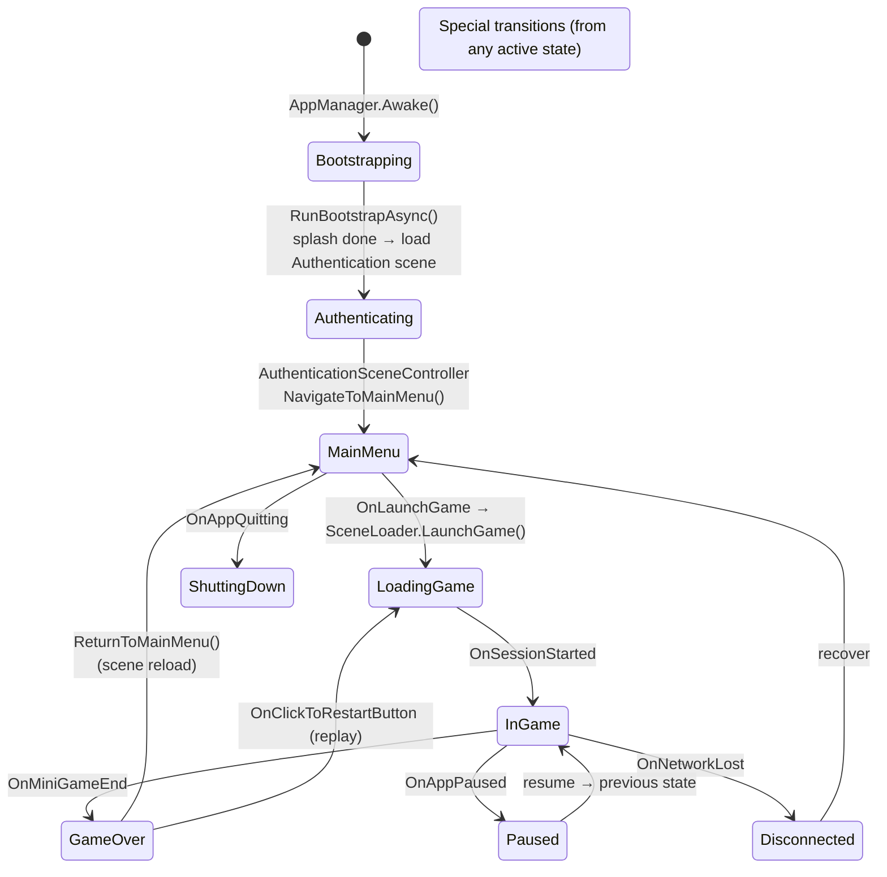
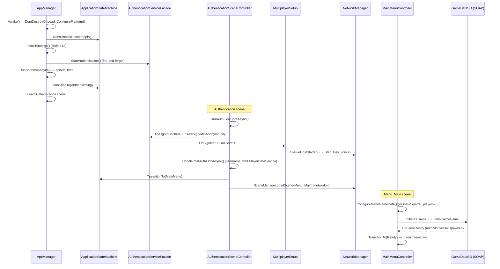
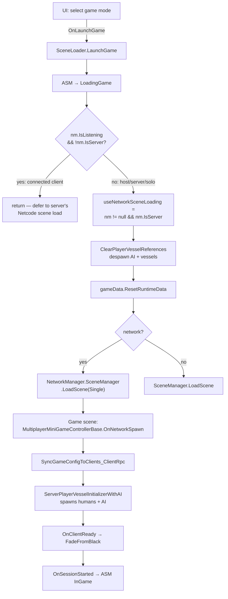
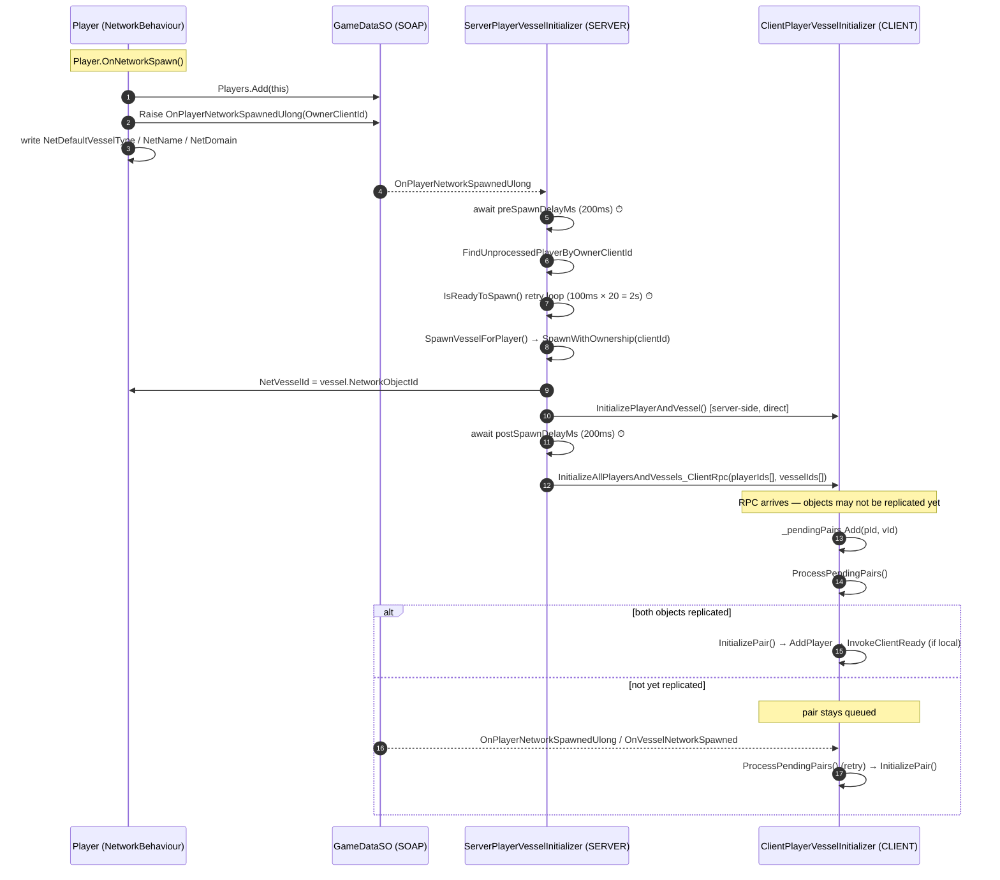
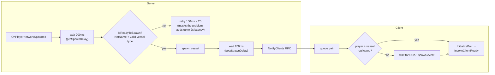

# Cosmic Shore — Game Flow & Multiplayer Sync

This document diagrams how the game currently runs: the scene/state lifecycle, the
script-to-script flow inside each phase, and the multiplayer player/vessel spawn
handshake. The final section focuses on the **multiplayer sync issue** — where the
current handshake is fragile and why.

All diagrams are Mermaid. View them in any Mermaid-aware Markdown renderer
(GitHub, VS Code with the Mermaid extension, etc.).

---

## 1. Top-Level Scene & Application-State Flow

`ApplicationStateMachine` (single writer to `ApplicationStateDataVariable`) tracks
the top-level phase. Scenes are driven by SOAP events, not direct calls.



| App State | Scene | Driven by |
|---|---|---|
| `Bootstrapping` | Bootstrap (build 0) | `AppManager.Awake/Start` |
| `Authenticating` | Authentication (build 1) | `RunBootstrapAsync()` |
| `MainMenu` | Menu_Main (build 2) | `AuthenticationSceneController.NavigateToMainMenu()` |
| `LoadingGame` | (transition) | `SceneLoader.LaunchGame()` on `OnLaunchGame` |
| `InGame` | Minigame scene | `GameDataSO.OnSessionStarted` |
| `GameOver` | Minigame scene | `GameDataSO.OnMiniGameEnd` |

---

## 2. Bootstrap → Auth → Menu (script-level sequence)



The **host NetworkManager starts in the Authentication scene** (`MultiplayerSetup`
on `OnSignedIn`), then Menu_Main is loaded as a *networked* scene. This is why the
host's `Player` object already exists before Menu_Main's spawner loads — a fact
the spawn handshake (§4) has to compensate for.

---

## 3. Game Launch & Return (SceneLoader)

`SceneLoader` (DontDestroyOnLoad, subscribes to SOAP events in code) is the single
place that loads gameplay scenes and auto-selects local vs. network loading.



> **MPPM / connected-client guard:** `LaunchGame`, `ReturnToMainMenu`, and
> `HandleActiveSessionEnd` all `return` early if `nm.IsListening && !nm.IsServer`
> *after* the visual transition but *before* `LoadSceneAsync()`. SOAP events fire on
> every virtual player on the shared `GameDataSO`; without this guard a client would
> race the server's Netcode scene load and destroy AI NetworkObjects before they
> replicate.

---

## 4. Multiplayer Player/Vessel Spawn Handshake (the sync-critical path)

This is the core of the multiplayer sync behavior. Server spawns the vessel and
notifies clients; clients queue pairs and resolve them when objects replicate.



**Key fact:** `OnClientReady` for the local user fires inside `InitializePair()`
(`ClientPlayerVesselInitializer.cs:281-285`), **not** in the `_signalClientReadyWhenDone`
block at lines 227-230 — that block only resets a flag and is effectively dead code
(see §5).

---

## 5. The Multiplayer Sync Issue

The spawn pipeline mixes two coordination strategies:

1. **Fixed time delays** (`preSpawnDelayMs = 200`, `postSpawnDelayMs = 200`) plus a
   `IsReadyToSpawn()` retry loop (100 ms × 20 ≈ 2 s) — *timing-based*.
2. **Event-driven pending-pair queue** on the client — *replication-based*, resolved
   by `OnPlayerNetworkSpawnedUlong` / `OnVesselNetworkSpawned` SOAP events.

Strategy 2 is robust. Strategy 1 is the fragile part, and the two interact awkwardly.

### 5.1 Where it races



| # | Window | Default | Risk | Notes |
|---|---|---|---|---|
| 1 | `preSpawnDelayMs` | 200 ms | Server reads `NetName` / `NetDefaultVesselType` before they replicate from a high-latency owner | Backed by the `IsReadyToSpawn()` retry loop, so usually masked — but adds up to ~2 s of spawn latency on bad connections |
| 2 | `IsReadyToSpawn()` retry | 100 ms × 20 | Host's `selectedVesselClass` isn't set yet (host `Player` spawns in **Auth scene** before `MainMenuController` configures game data) → up to 2 s of retries before the host vessel appears | Latency/UX bug, not a correctness bug |
| 3 | `postSpawnDelayMs` | 200 ms | RPC can arrive before the vessel `NetworkObject` replicates | **Correctly handled** by the client pending-pair queue + SOAP retry — this delay is essentially a (sometimes insufficient, sometimes wasteful) guess |
| 4 | AI `destroyWithScene=false` | — | Scene-load message batching could destroy just-spawned AI on the same tick | **Already mitigated** (see CLAUDE.md); requires explicit AI despawn before replay |

### 5.2 Root cause

The fixed delays are **guesses at replication latency**. They are simultaneously:

- **Too long** on a LAN / single-machine MPPM session — every spawn eats 400 ms +
  retries for no reason, which is visible as a sluggish menu/host vessel appearance.
- **Too short** on a real high-latency connection — `preSpawnDelayMs` expires before
  owner-written NetworkVariables arrive, forcing the retry loop to carry the load.

The client side already proves the correct pattern: **don't wait a fixed time, react
to the replication event.** The server side does not yet do this for reading
owner-written NetworkVariables.

### 5.3 Dead / misleading code (verified)

`ClientPlayerVesselInitializer.ProcessPendingPairs()` (lines 227-230):

```csharp
if (_pendingPairs.Count == 0 && _signalClientReadyWhenDone)
{
    _signalClientReadyWhenDone = false;   // resets flag, does nothing else
}
```

`_signalClientReadyWhenDone` is set `true` in `InitializeAllPlayersAndVessels_ClientRpc`
but is never used to actually raise `OnClientReady`. The real `InvokeClientReady()`
call lives in `InitializePair()` and fires per-local-user. The flag block is
vestigial and should be deleted to avoid implying a second readiness path exists.

> A prior automated analysis flagged this block as the "primary bug — `OnClientReady`
> never fires." That is **incorrect**: `InitializePair()` raises it. Verified against
> `ClientPlayerVesselInitializer.cs:258-286`.

### 5.4 Recommended direction (not yet implemented)

1. **Replace `preSpawnDelayMs` + retry loop with an event wait.** Subscribe to
   `Player.NetDefaultVesselType.OnValueChanged` / `NetName.OnValueChanged` (or a
   single "player ready" SOAP signal) and spawn the vessel the moment the required
   NetworkVariables are valid, instead of polling after a 200 ms guess.
2. **Set `gameData.selectedVesselClass` before the host `Player` spawns**, or have the
   host defer its vessel-type write until `MainMenuController.ConfigureMenuGameData()`
   has run — eliminating race #2 entirely rather than masking it with retries.
3. **Drop `postSpawnDelayMs`.** The client pending-pair queue already handles late
   replication correctly; the RPC can be sent immediately after spawn.
4. **Delete the dead `_signalClientReadyWhenDone` block** for clarity.

These are listed in priority order; #1 and #2 remove the only correctness-adjacent
races, #3 and #4 are cleanups.

---

## Key Files

| Role | File |
|---|---|
| DI root / bootstrap | `_Scripts/System/AppManager.cs` |
| App state machine | `_Scripts/System/ApplicationStateMachine.cs` |
| Auth scene flow | `_Scripts/System/AuthenticationSceneController.cs` |
| Menu controller | `_Scripts/System/MainMenuController.cs` |
| Scene loading | `_Scripts/System/SceneLoader.cs` |
| Host lifecycle | `_Scripts/Controller/Multiplayer/MultiplayerSetup.cs` |
| **Server spawner** | `_Scripts/Controller/Multiplayer/ServerPlayerVesselInitializer.cs` |
| **Client pair init** | `_Scripts/Controller/Multiplayer/ClientPlayerVesselInitializer.cs` |
| AI pre-spawner | `_Scripts/Controller/Multiplayer/ServerPlayerVesselInitializerWithAI.cs` |
| Player NetworkBehaviour | `_Scripts/Controller/Player/Player.cs` |
| MP game controller base | `_Scripts/Controller/Arcade/MultiplayerMiniGameControllerBase.cs` |
