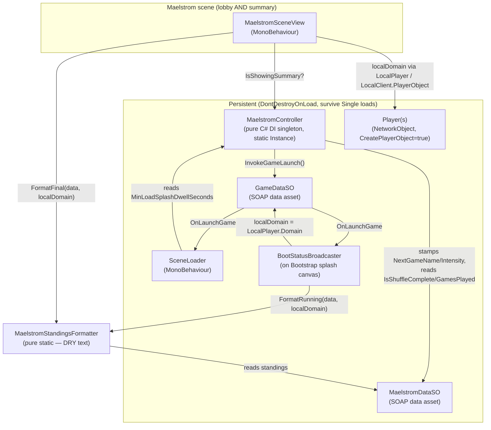
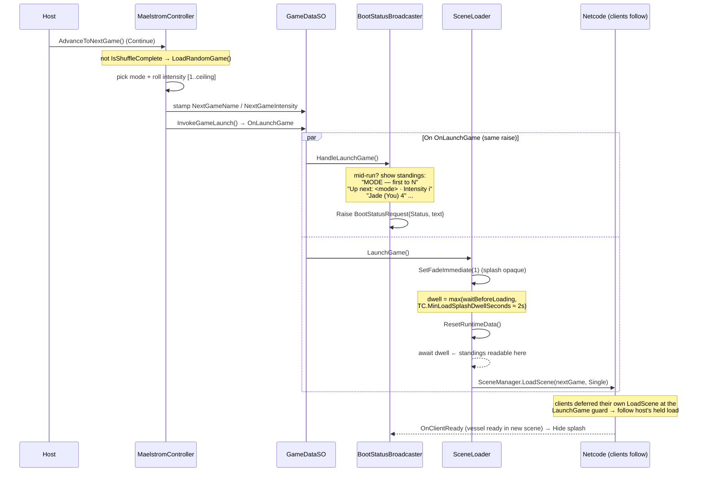
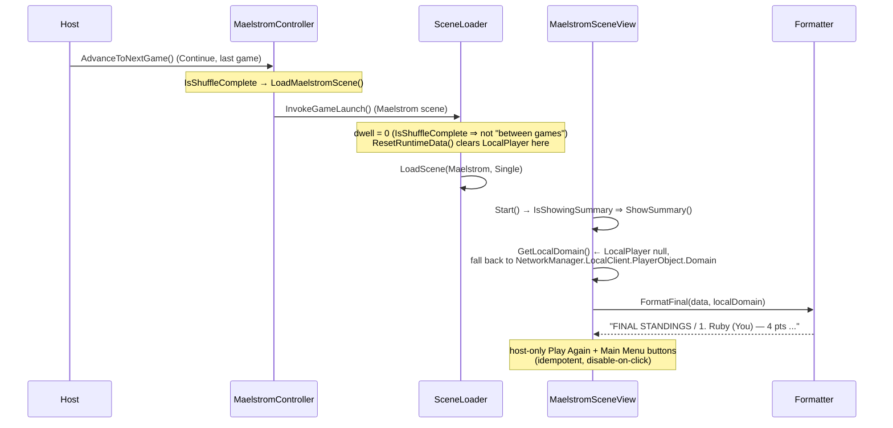
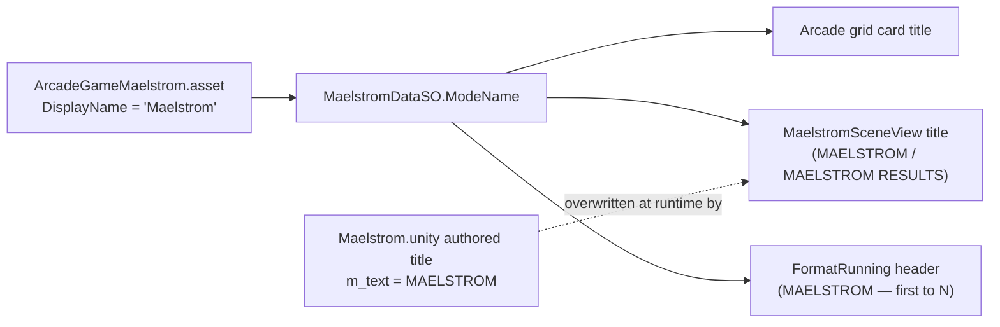

# Maelstrom Between-Game / Summary UX — Session Handoff

> **⚠️ Historical (point-in-time session log).** Some specifics below are superseded: the scene was later
> renamed `Maelstrom.unity` → `Maelstrom.unity`, and the end-game flow was reworked (hub-between-rounds +
> a NEXT→summary step, with summary-vs-hub keyed off the authoritative `IsShuffleComplete`). For the
> current state see this folder's `ARCHITECTURE.md` and `MAELSTROM_REWORK_SPEC.md`.

> **Scope of this document.** A self-contained handoff for the session that built the Maelstrom
> (Maelstrom meta-mode) **presentation/UX layer**: the between-game loading splash, the readable
> dwell, the player-facing rename, and the end-of-shuffle summary. It captures what changed, how the
> pieces fit, sequence/flow diagrams, the **inspector wiring the features depend on**, known risks,
> and recommended next tasks. Canonical mechanics live in `Docs/MaelstromSystem/ARCHITECTURE.md`
> (§4 between-game overlay, readable dwell, owner tag) — this doc summarizes and points there for depth.
>
> **Branch:** `claude/focused-thompson-jvbt3x` (built on top of in-flight scene edits
> `e982fdc3 Update Maelstrom.unity`, `7064d503 Update Bootstrap.unity`).
>
> **Reminder — naming:** *Maelstrom* is the **player-facing display name only**. Code, scene, data,
> enum, and this folder family stay **Maelstrom** (`GameModes.Maelstrom = 36`). Internal identifiers
> (`IsShuffleComplete`, `shuffle_placement`, `Docs/ShuffleSystem/`) intentionally keep the legacy name.

---

## 1. TL;DR — what shipped this session

| # | Commit | Title | One-liner |
|---|--------|-------|-----------|
| 1 | `5bdc2cd6` | disable end-game buttons on click + show splash ASAP | Summary buttons are now idempotent + disable-on-click; Main-Menu return covers the screen immediately. |
| 2 | `66dcbbfd` | show next game mode + intensity on the between-game splash | `Up next: <mode> · Intensity N` line on the inter-game standings splash (host draw, game 2+). |
| 3 | `c4a0d98f` | rename player-facing mode name Shuffle → Maelstrom | Display text only: card `DisplayName` + scene title; internals untouched. |
| 4 | `04bdcf6a` | hold the between-game summary splash ~2s before next load | Host holds the load behind the opaque splash so the standings are readable (config, default 2s). |
| 5 | `ce85bed7` | tag the owner's domain row with `(You)` in Maelstrom standings | Per-domain row of the local player's team marked ` <b>(You)</b>` on splash + summary. |
| 6 | `16333f94` | resolve local domain on summary scene for the `(You)` tag | Fix: `LocalPlayer` is null on the summary scene; read the persistent local Player NetworkObject instead. |

All six are pushed. No open working-tree changes from this session beyond this document.

---

## 2. The systems involved (component map)

**Key roles**

- **`MaelstromController`** (`_Scripts/Controller/Arcade/Maelstrom/`) — the persistent brain. Draws the
  next random game, stamps "up next" info, decides between-game vs summary, and now exposes the
  splash-dwell decision. Reached by scene MonoBehaviours via the static `Instance`.
- **`SceneLoader`** (`_Scripts/System/`) — owns the actual scene load + the loading-splash fade. Now
  holds the load for a configurable dwell on between-game tournament transitions.
- **`BootStatusBroadcaster`** (`_Scripts/UI/Screens/`) — owns "what the loading splash shows". Renders
  the running standings (with `(You)` + "up next") during inter-game loads.
- **`MaelstromSceneView`** (`_Scripts/Controller/Arcade/Maelstrom/`) — the Maelstrom scene's view; in
  **Summary** phase renders the final standings (with `(You)`) and drives the host-only buttons.
- **`MaelstromStandingsFormatter`** (`_Scripts/Utility/DataContainers/Maelstrom/`) — single, pure
  source for both the running and final standings strings (DRY, unit-tested).
- **`MaelstromDataSO`** (`_Scripts/Utility/DataContainers/Maelstrom/`) — config + runtime state
  (standings, `NextGame*`, and the new `BetweenGameSummaryDwellSeconds`).

---

## 3. Flow diagrams

### 3.1 Between-game advance (the splash you read)

**Why host-only is sufficient:** clients hit the `if (nm.IsListening && !nm.IsServer) return;` guard in
`LaunchGame` *before* `LoadSceneAsync`, so they never run the dwell locally — they wait on the host's
Netcode scene load. Holding the host's `LoadScene` holds the whole party's splash.

### 3.2 Final summary (last game → results)

### 3.3 Rename — single source of the player-facing name

To rename again for players, change **only** `ArcadeGameMaelstrom.asset.DisplayName`. The authored
scene `m_text` is a static placeholder that runtime `ModeName` overwrites; it was updated for hygiene.

---

## 4. Task log (what & why, per commit)

### 1 — `5bdc2cd6` Disable end-game buttons on click + show splash ASAP
- **Why:** host could double/spam-tap Play Again / Main Menu in the window before the scene unloaded;
  and the Main-Menu return left the summary on-screen during the async menu load.
- **`MaelstromSceneView`** — added `_summaryActionTaken` guard; `OnPlayAgainPressed` / `OnMainMenuPressed`
  are idempotent and call `DisableSummaryButtons()` *before* acting. Error paths bail without disabling.
- **`SceneLoader.ReturnToMainMenu`** — `SetFadeImmediate(1f)` + idempotent `ArmSplashFadeOnNextClientReady()`
  immediately, before the client-defer guard (so clients fade too). Mirrors `LaunchGame`.

### 2 — `66dcbbfd` "Up next" on the between-game splash
- **`MaelstromController.LoadRandomGame`** — stamps `MaelstromDataSO.NextGameName` / `NextGameIntensity`
  right before `InvokeGameLaunch`.
- **`MaelstromDataSO`** — added the two `[NonSerialized]` runtime fields.
- **`MaelstromStandingsFormatter.FormatRunning`** — emits `Up next: <name> · Intensity N` when set.
- Host-only (clients never draw); omitted when unset → shows from game 2 onward.

### 3 — `c4a0d98f` Rename Shuffle → Maelstrom (display only)
- **`ArcadeGameMaelstrom.asset`** `DisplayName: Maelstrom`; **`Maelstrom.unity`** title `m_text: MAELSTROM`.
- Refreshed comments/tooltips + docs (`CLAUDE.md`, `Docs/ShuffleSystem`, `Docs/MaelstromSystem`).
- Untouched (internal): `IsShuffleComplete`, `"shuffle_placement"`, test names, `Docs/ShuffleSystem/` folder.

### 4 — `04bdcf6a` Readable dwell (~2s) before next load
- **`MaelstromDataSO.BetweenGameSummaryDwellSeconds`** — config, default **2s** (persisted in
  `MaelstromData.asset`).
- **`MaelstromController.IsBetweenGamesStandingsShown`** (mirrors the splash condition `IsActive &&
  !IsShuffleComplete && GamesPlayed > 0`) + **`MinLoadSplashDwellSeconds`** (that value when between games,
  else 0).
- **`SceneLoader.LaunchGame`** reads `MaelstromController.Instance.MinLoadSplashDwellSeconds` and passes it
  to `LoadSceneAsync(sceneName, minSplashDwell)`, which uses `Mathf.Max(waitBeforeLoading, minSplashDwell)`.
- Scoped precisely: first game, the final-summary load, menu returns, and all non-tournament launches stay
  at the normal short wait. Routed via `MaelstromController.Instance` (always alive — `AppManager` injects
  it) rather than a hard `[Inject] MaelstromDataSO` so an un-wired asset still degrades gracefully.

### 5 — `ce85bed7` `(You)` owner tag
- **`MaelstromStandingsFormatter`** — `FormatFinal` / `FormatRunning` gained `Domains localDomain =
  Domains.Blue`; a `YouTag` helper appends ` <b>(You)</b>` to the matching domain row (FINAL STANDINGS /
  running rows only, not per-game blocks → exactly one tag). Stayed pure (enum param) ⇒ unit-testable.
- **`MaelstromSceneView`** (summary) + **`BootStatusBroadcaster`** (splash) pass the local player's domain.
- **`MaelstromStandingsFormatterTests`** — verifies single-tag behavior + the `Domains.Blue` no-op.

### 6 — `16333f94` Fix: local domain on the summary scene
- **Bug:** `gameData.LocalPlayer` is **null** on the Maelstrom summary scene — `SceneLoader.LoadSceneAsync`
  calls `ResetRuntimeData()` (clears `LocalPlayer`) before the load, and the summary scene spawns no vessel
  to re-set it (game scenes re-register persistent players via
  `ServerPlayerVesselInitializer.PrepareForNewScene`; the summary scene has no spawner). So the **summary**
  `(You)` tag never rendered. The **splash** tag was fine (renders at `OnLaunchGame`, before the reset).
- **Fix:** `MaelstromSceneView.GetLocalDomain()` prefers `gameData.LocalPlayer`, then falls back to
  `NetworkManager.LocalClient.PlayerObject` (persistent local Player, `CreatePlayerObject=true`) and reads
  its live `Player.Domain`. Same idiom as `ArcadeGameConfigureModal.ResolveLocalOwnedPlayer`.

---

## 5. ⚠️ Inspector wiring the features depend on (verify in a new session)

These are **scene/asset references**, not code. The code degrades gracefully if unset, so a missing wire
shows up as a *silently absent* feature, not an error.

| Feature | Wire | Where | If unset |
|---|---|---|---|
| Between-game standings text, "Up next", splash `(You)` | `BootStatusBroadcaster.tournamentData` ← `MaelstromData.asset` | Bootstrap splash canvas | Clean splash (no standings) — **dwell still happens** (it reads the controller, not the wire), so you'd get a ~2s blank-ish hold. |
| Readable dwell (~2s) | *(none — reads `MaelstromController.Instance`)* | — | Always active. |
| Summary `(You)` tag + final standings | `MaelstromSceneView.gameData`, `.tournamentData`, `.resultsText` | Maelstrom scene | No results text / no tag. |
| Summary buttons | `MaelstromSceneView.playAgainButton`, `.mainMenuButton`, `.onClickToMainMenu` | Maelstrom scene | Host can't advance/exit from summary. |
| Placement wallet credit + card badge (pre-existing, P3) | `Scoreboard.tournamentData` ← `MaelstromData.asset` | each domain-game `Scoreboard` (`GameCanvas-SkimRace.prefab` + Joust/Crystal Capture) | Flat winner reward, no badge. |

> The user was editing scenes this session (`Maelstrom.unity`, `Bootstrap.unity`). **First action next
> session: confirm `BootStatusBroadcaster.tournamentData` and the `MaelstromSceneView.*` references are
> wired**, then run the §7 checklist.

---

## 6. Design invariants honored (don't relitigate)

- **Display-only rename.** Maelstrom is presentation; Maelstrom is identity. One source: the card's
  `DisplayName` → `MaelstromDataSO.ModeName`.
- **Per-domain scoring.** Standings are one row per team (Jade/Ruby/Gold), so `(You)` marks the **local
  player's domain**, and at most one row is ever tagged. Teammates share the tagged row by design.
- **Host drives, clients follow.** No new RPC/NetworkVariable was added — the dwell and "up next" are
  host-side; clients inherit them through the existing held Netcode `Single` load. Standings are reduced
  locally on every peer (network-free), so they match without syncing.
- **Pure formatter.** `MaelstromStandingsFormatter` takes a `Domains` enum, never touches Unity objects,
  stays unit-testable. Callers resolve the local domain and pass it in.
- **Graceful degradation over fail-loud for optional UX wires.** `tournamentData` on the splash/scoreboard
  is explicitly optional (clean splash / flat reward when null) — distinct from the SOAP **event** fail-loud
  policy.

---

## 7. Verification checklist (manual, in-editor)

Maelstrom runs through Netcode even solo (AI backfill). Suggested matrix:

1. **Solo + bots, full run.** Each Continue → splash shows: header, `Up next: <mode> · Intensity N`,
   per-domain rows, and `(You)` on your domain. Splash is **readable (~2s)** before the next game loads.
2. **Final game.** Continue → **MAELSTROM RESULTS** with `FINAL STANDINGS`, `(You)` on your domain row,
   per-game blocks. Play Again / Main Menu present, host-only, **disable on first tap** (no double-fire).
3. **Main Menu from summary.** Screen is covered **immediately** (no lingering summary during the load).
4. **2–4 players (MPPM).** Each client sees `(You)` on **its own** team row (host and client differ).
   Clients show no summary buttons. Standings identical across peers. Dwell holds everyone's splash.
5. **First game / non-tournament.** No "up next" before game 1; no dwell; normal arcade launches unaffected.
6. **Edit-mode tests.** `MaelstromStandingsFormatterTests` + `MaelstromDataSOTests` green.

---

## 8. Recommendations / candidate next tasks

**Likely-needed polish**
- **Confirm the §5 wires** (esp. `BootStatusBroadcaster.tournamentData`) — the most probable reason a
  feature "doesn't show". The dwell-without-text edge (wire missing) would hold a blank-ish splash ~2s;
  if that looks bad before wiring, consider gating the dwell on "standings actually shown".
- **Color the domain rows by team.** Standings are plain text today; tinting each row with its domain
  color (Jade/Ruby/Gold) + keeping `(You)` would read far faster than a text tag alone. The formatter is
  the single place to add `<color=#…>` (it already emits rich text), driven by a domain→hex map.
- **Confirm panel for summary buttons.** The `_summaryActionTaken` guard is an interim anti-spam; a real
  "Play again? / Exit to menu?" confirm would replace it (the guard comment flags this).

**Nice-to-have**
- **Host "skip" on the dwell.** Let the host tap to fast-forward the 2s hold (keep the floor for clients).
- **Tag in per-game blocks too** (currently only the standings rows) if testers want their domain
  highlighted throughout the summary.
- **Unit-test the dwell decision.** `MaelstromController.MinLoadSplashDwellSeconds` /
  `IsBetweenGamesStandingsShown` are pure given a populated `MaelstromDataSO` — add a small fixture
  (active + GamesPlayed>0 ⇒ value; first game / complete ⇒ 0).

**Deferred / pre-existing (not this session)** — see `Docs/MaelstromSystem/ARCHITECTURE.md §9` and
`Docs/ShuffleSystem/ARCHITECTURE.md`: placement-crystal wallet credit, post-tournament share screen,
funnel instrumentation, host migration, full QA matrix.

---

## 9. File & symbol index (touched this session)

| File | Key symbols added/changed |
|---|---|
| `_Scripts/Controller/Arcade/Maelstrom/MaelstromController.cs` | `IsBetweenGamesStandingsShown`, `MinLoadSplashDwellSeconds`; `LoadRandomGame` stamps `NextGame*` |
| `_Scripts/Controller/Arcade/Maelstrom/MaelstromSceneView.cs` | `_summaryActionTaken`, `DisableSummaryButtons`, idempotent button handlers, `RenderSummary`, `GetLocalDomain()` |
| `_Scripts/System/SceneLoader.cs` | `LaunchGame` computes `minSplashDwell`; `LoadSceneAsync(string, float minSplashDwell)`; `ReturnToMainMenu` splash-ASAP |
| `_Scripts/UI/Screens/BootStatusBroadcaster.cs` | `HandleLaunchGame` passes local domain to `FormatRunning` |
| `_Scripts/Utility/DataContainers/Maelstrom/MaelstromDataSO.cs` | `NextGameName`, `NextGameIntensity`, `BetweenGameSummaryDwellSeconds` |
| `_Scripts/Utility/DataContainers/Maelstrom/MaelstromStandingsFormatter.cs` | `FormatRunning/FormatFinal(data, localDomain)`, `YouTag` |
| `_Scripts/Tests/Editor/MaelstromStandingsFormatterTests.cs` | new test fixture (`(You)` single-tag + Blue no-op) |
| `_SO_Assets/Games/ArcadeGameMaelstrom.asset` | `DisplayName: Maelstrom` |
| `_SO_Assets/Maelstrom/MaelstromData.asset` | `BetweenGameSummaryDwellSeconds: 2` |
| `_Scenes/Multiplayer Scenes/Maelstrom.unity` | authored title `m_text: MAELSTROM` |
| `Docs/MaelstromSystem/ARCHITECTURE.md` | §4 owner tag + readable dwell notes |
| `Docs/ShuffleSystem/ARCHITECTURE.md`, `CLAUDE.md` | rename references → Maelstrom |

**Canonical references:** `Docs/MaelstromSystem/ARCHITECTURE.md` (mechanics, §4/§7/§9),
`Docs/ShuffleSystem/ARCHITECTURE.md` (Maelstrom = Maelstrom pointer + deferred deltas).
