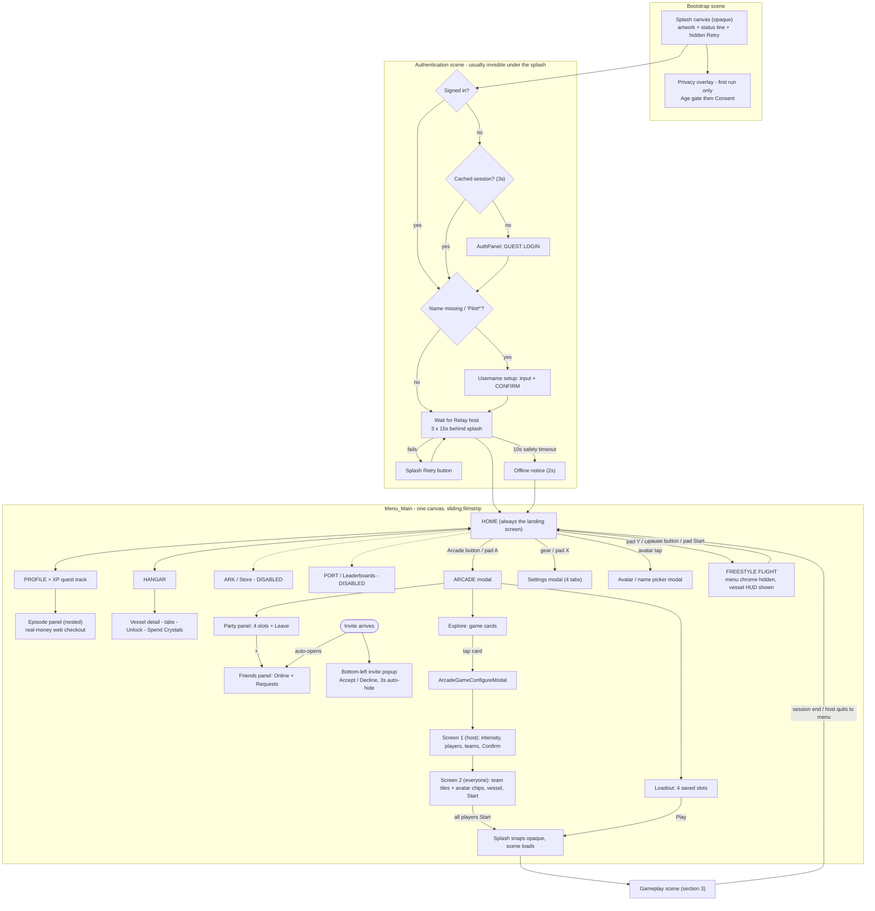

# Cosmic Shore — UI Architecture Audit

**Date:** 2026-08-22 · **Branch:** `claude/cosmic-shore-ui-audit-r878o2` · **Scope:** every player-facing UI surface in the project — app shell and in-game HUDs.

> **⚠ Triage added 2026-09-07 — read [§0](#0-tldr--triage-and-fix-prompts) first.** Eight findings below are now stale (the Arcade's dead-card problem among them) and two were half-fixed. §0 re-checks every defect-shaped finding against the current code and says which still need doing.

**Who this is for:** a designer preparing a complete UI/HUD redesign who **cannot see the codebase**. Everything is described in plain language first, with file paths attached so engineers can find the owner of any element. This is an **audit only** — no redesign proposals are made.

**How the audit was produced:** by reading C# source, the serialized YAML of scenes and prefabs (Unity scenes and prefabs are text files), and the project's own engineering docs (`Docs/GAMECANVAS.md`, `Docs/PartySystem/UI.md`, `Docs/MENU_PROGRESSION_AND_IAP.md`, `CLAUDE.md`). **Nothing was observed running in the Unity editor.** Where a behavior could not be confirmed from code — for example, which of two overlapping modals a button actually opens — it is flagged as ⚠ **UNVERIFIED** rather than guessed. A consolidated list of uncertainties appears at the end of each major section.

**Reading conventions:**
- Paths are relative to the repo root (e.g. `Assets/_Scripts/UI/ScreenSwitcher.cs`).
- "Domain" = team. The three playable teams are **Jade, Ruby, Gold**; **Blue** is the "no team / neutral" sentinel and is never a playable side.
- "SOAP" = the project's ScriptableObject-based event/variable system (Obvious.Soap). UI elements frequently subscribe to SOAP events wired in the inspector — relevant because rebuilding a prefab means rewiring those references (see §5).
- "SO" = ScriptableObject, a Unity data asset.

---

## Table of contents

1. [Tech foundation](#1-tech-foundation)
2. [App-shell screen inventory](#2-app-shell-screen-inventory)
3. [In-game HUD inventory — per game mode](#3-in-game-hud-inventory--per-game-mode)
4. [State and edge cases](#4-state-and-edge-cases)
5. [Constraints and technical debt](#5-constraints-and-technical-debt)
6. [Screenshot checklist](#6-screenshot-checklist)

**Start here:** [0. TL;DR — triage and fix prompts](#0-tldr--triage-and-fix-prompts)

---

# 0. TL;DR — triage and fix prompts

**Added 2026-09-07.** The audit above is an INVENTORY, not a bug list — it describes what exists
and flags what could not be confirmed from code. This section does the missing half: every
finding that reads like a defect, **re-checked against the code as it stands today**, with a
verdict, an urgency, and a paste-ready prompt.

**Read the verdicts before the prompts.** The audit is dated **2026-08-22** and a fortnight of
work has landed since. Eight of its findings are now stale — including the loudest one about the
Arcade — and two more were already half-fixed. Working from the audit's text alone would spend
real time on problems that no longer exist.

## 0.1 What is already fixed — do NOT spend time here

| # | Audit said | Verified today |
|---|---|---|
| S1 | §2.11 / §5.6 **"The Arcade shows unlaunchable games"** — retired modes still render as cards | **STALE.** The live roster is `OrganicRematchGames.asset` (wired on `AppManager.prefab`, the asset `AppManager` registers for `[Inject] SO_GameList`): **16 cards, 16 real scenes, 0 dead.** The dead cards lived in `LaunchPartyAllGames` (8), `AllGames` (9), `PreviousAllGames` (15), `ArcadeGames` (4) and `LeaderboardGames` (3), none of which the Arcade draws — **all pruned by F5 on 2026-09-08**, and `Tools/Build/check_gamelist_scenes.py` now fails the build if one comes back. |
| S2 | §2.11 the grid **"can never show more games than authored card slots"** | **FIXED.** `ArcadeExploreView.EnsureGridCapacity` clones rows to fit the roster, `PinVerticalAnchorsToTop` + a bounds measure size the scroll content, and `ReportUnreachableCards` / `ReportCardPressability` name any card that still cannot be reached or pressed. |
| S3 | §3.6 **Scarab's HUD prefab "is structurally a copy of the Sparrow variant"** | **STALE.** `Scarab.prefab` does reference `ScarabHUDVariant` (guid `4f3ce7d7…`); the audit read a prefab-instance **name override** (`m_Name: SparrowHUDVariant`) as a prefab reference. Corrected in CLAUDE.md 2026-08-25. |
| S4 | §3.1 / §4.1 the connecting panel **"confirmed wired only in SkimRace"** | **SUPERSEDED.** The whole load screen was rebuilt — monotonic progress bar, live arena preview, pilot roster, per-machine ready reports. See `Docs/CONNECTING_PANEL.md`. |
| S5 | §2.10 / §5.6 **Daily Challenge modal + its two views** | **DELETED** (branch `claude/home-screen-game-modes-0951x6`). Its only opener sat under `PortScreen`, which is in `disabledScreens`. `ModalWindows.DAILY_CHALLENGE (2)` is retired; do not reuse the value. |
| S6 | §5.6 **`ModePreviewHUD`** (the beside-the-window preview HUD) | **DELETED** on the same branch — `ModePreviewSession` held it only to call `Hide()` on it three times. |
| S7 | §1.3 **"Safe area / notch handling: NONE"** | **HALF-FIXED** — `Assets/_Scripts/UI/SafeAreaFitter.cs` now exists. It is attached to **nothing but its own test scene**, so on a device the behaviour is still "none". → 0.2 **B1**. |
| S8 | §2.10.4 `PurchaseConfirmationModal` **"a bare `int.Parse` would throw"** | **HALF-FIXED** — lines 99–100 are `int.TryParse` with a comment naming the hazard; **line 120 is still a bare `int.Parse`** on the ticket label. → 0.3 **F3**. |

## 0.2 Blockers — fix these before the Arcade / Mission screen work

Four items, all in the menu shell you are about to build in. Each is small.

> **STATUS — 2026-09-08. All four are DONE, and NONE of them is on `bleeding-edge` yet.**
>
> **All four now sit on ONE branch: `claude/navlink-availability-states-sj1cxp`**, which also carries
> `bleeding-edge` (so F1 is in it) and is based on `claude/home-screen-game-modes-0951x6`.
>
> | | Landed | Note |
> |---|---|---|
> | **B1** safe area | ✔ | Written on `claude/safeareafitter-canvas-audit-sj1cxp`, merged in 2026-09-08; its GameCanvas half **re-applied to the unified canvas** after F1 deleted the fork |
> | **B2** profile modal | ✔ | |
> | **B3** disabled nav links | ✔ | |
> | **B4** inventory flag | ✔ | |
>
> None of it is on `bleeding-edge` yet, and the hub branch under it is also unmerged.
> **The gate is CLEARED as work, not as shipped state** — the Missions / Toy Box screens can be
> built now; merge order in §0.5.

### B1 · Safe area is written but wired to nothing · **DONE (unmerged)**

> **Done**, and merged into `claude/navlink-availability-states-sj1cxp` on 2026-09-08. Every
> player-facing canvas is split into a full-bleed layer and a fitted content layer; the per-layer
> decision table is §1.3.
>
> **The GameCanvas half was re-applied against the unified canvas.** It was originally written
> against BOTH forks, and F1 has since deleted `GameCanvas-SkimRace.prefab` and rebuilt
> `CORE/GameCanvas.prefab` from a donor scene. The re-apply was cheap for a reason worth recording:
> **the unifier's absorb kept fileIDs** (it script-swaps base→derived in place), so every object
> this work targets — `Pause Screen` `5497835174820813624`, `MiniGameHUD` `5497835174634480090` and
> the three invite widgets — resolved unchanged, and the edits landed on the one surviving canvas
> instead of two. `Tools/Build/author_safe_area_layers.py` is re-pointed at the single canvas and
> reports `already authored` for all five targets.


`SafeAreaFitter.cs` exists and is correct; `grep` finds it on **one** object, in
`Assets/_Scenes/Game_TestDesign/SafeAreaFitterTestScene.unity`. Every real canvas — menu, game
HUD, modals — is unprotected. This is a mobile-first title, and the Home hub you are adding sits
in exactly the top and bottom bands a notch or a gesture bar eats. Wire it while you are
authoring the new screens; retrofitting it after the Mission screen exists means touching it
twice.

> **Prompt:** `SafeAreaFitter` (`Assets/_Scripts/UI/SafeAreaFitter.cs`) is attached to nothing but
> `SafeAreaFitterTestScene`. Read its own doc comment for the contract (it goes on the CONTENT
> layer, never the canvas root, and background art is meant to stay full-bleed because
> `androidRenderOutsideSafeArea` is on). Find every canvas that carries player-facing UI —
> Menu_Main's menu canvas, both `GameCanvas` forks, the modal windows root, and the runtime-built
> canvases (`SceneTransitionManager`'s fade overlay, `EnvironmentLoadVeil`, `ConnectingPanel`,
> `PrivacyConsentOverlay`) — and decide for each whether it needs a content layer under the
> fitter or is deliberately full-bleed. Write it up as a short table in
> `Docs/UI_ARCHITECTURE_AUDIT.md` §1.3 first, then apply it. Do not put the fitter on a canvas
> root, and do not add it to a background image. Verify with `validate_project.py` and by dumping
> the YAML of one changed canvas.

### B2 · The Profile modal's open buttons target `{fileID: 0}` · **RESOLVED**

The audit flagged (§2.10.3) that it could not tell which of the two profile modals the avatar
buttons open. The answer was **neither**: both openers — `ShowPopupButton` on ProfileScreen and
`OnlineIndicator` on HomeScreen — carried a persistent `ModalWindowIn` at fileID 0. A **live screen
with a dead button**, the same failure shape as the domain-picker bug CLAUDE.md records: a nulled
reference reads as "the feature quietly does nothing", never as an error.

**Fixed.** `PlayerDataSelectModal` is the survivor and now holds `ModalWindows.PROFILE`;
`ProfileModal` is retired (inactive, unregistered, unwired); both openers route through
`ScreenSwitcher.OnClickProfileModal()` → `OpenModal(ModalWindows.PROFILE)`. Full decision and the
change table: §2.10.3. Applied by `Tools/Build/retire_profile_modal.py` (`--check`).

**Acceptance re-run:** `audit_persistent_listener_injection.py` dead-wiring list is **13 → 11**;
both `ProfileModal.ModalWindowOut` rows (`Menu_Main.unity` and `Profile.prefab`) are gone.

**One correction to this item's own wording.** It said the `ProfileModal.ModalWindowOut` entries
"have `m_Target: {fileID: 0}`". They did not — those two rows targeted a real `ProfileModal`
component and worked at runtime. The auditor lists them because it greps the *resolved script file*
for the method, and `ModalWindowOut` is **inherited** from `ModalWindowManager` rather than declared
in `ProfileModal.cs`. Two different defects were being read as one: the nulled targets were on the
`ModalWindowIn` **openers**, and the flagged `ModalWindowOut` rows were an inheritance blind spot in
the auditor. Both are gone here — the openers because they were repaired, the rows because a retired
modal keeps no wiring — but the blind spot remains for any other subclass of a base whose method a
button names. Worth knowing before trusting that list.

### B3 · Disabled nav links are still tappable and look enabled · **RESOLVED**

`ScreenSwitcher.disabledScreens` is `{ARK, PORT}` (`Menu_Main.unity`:
`disabledScreens: 0100000003000000` = 1, 3). Their nav links raycast, highlight, and did nothing
on press.

**Fixed** by extending the hub's own state model rather than inventing a second one, exactly as
this item asked. `MenuHubButton.HubAvailability` was lifted out to a shared `MenuAvailability`
(same 0/1/2 values, so nothing authored re-states itself) and its presentation to a shared
`MenuAvailabilityView` — the one place a state becomes pixels, a `Selectable.interactable`, a
Denied sting and a reason. `MenuHubButton`, `NavLink` and the nav bar all read it.
`ScreenSwitcher.MarkDisabledNavLinks` stamps `Locked` onto each disabled screen's link at `Start`
and `NavigateTo` refuses out loud instead of returning in silence, so `disabledScreens` stays the
single source of truth. Record: `Docs/HomeHub/ARCHITECTURE.md` §2.1-§2.3.

**Two corrections to this item's own diagnosis, both load-bearing:**

- **`NavLink` is not the component on those buttons.** This item (and its prompt) named it; it
  actually drives the *in-screen tab rows* — Hangar's Vessels / Overview / Training, Profile's
  Squad / Faction / Captains, the ability buttons — 11 instances in `Menu_Main`, none on the nav
  bar and none targeting a `MenuScreens` value. Each nav-bar link is a `RectTransform` +
  `CanvasRenderer` + a bare `EventTrigger` calling a `ScreenSwitcher.OnClick*Nav` handler, with
  `UpdateNavBar` toggling its two icon children. Extending `NavLink` alone would have shipped a
  locked state onto tabs nothing disables and left ARK and PORT exactly as broken. It adopts the
  shared model anyway — a tab can be locked too — but the fix had to land on the nav bar.
- **`ArkLink` called `OnClickHangarNav`.** So the symptom was not "silently does nothing" for ARK:
  it *navigated to the Hangar screen*. `OnClickArkNav` was referenced by nothing in any scene.
  Because `NavigateTo` was never asked about ARK, ARK could not take the locked state at all —
  the lock and this fix had to ship together. `Tools/Build/fix_ark_nav_wiring.py` (`--check`).

**Also worth knowing:** `MenuHubButton`'s guid appears in **zero** scenes and prefabs — the hub
component is shipped but attached to nothing yet, so its half of the shared model is currently
exercised only by the nav bar. That is a wiring gap in the hub work, not in this item.

### B4 · `RespectInventoryForGameSelection` is off, against its own comment · **RESOLVED (b)**

`ArcadeExploreView` serialized it `false` under an in-code comment reading *"MUST BE TRUE ON FOR
PRODUCTION BUILDS"*, with `Menu_Main.unity` confirming `RespectInventoryForGameSelection: 0`.

**Resolved by (b): the flag and its branch are deleted.** Option (a) was not available —
turning it on renders an **empty arcade**. The gate read `CatalogManager.Inventory`, and
**`CatalogManager.prefab` is referenced by zero scenes and zero prefabs**, so the manager never
exists, `Inventory` is never populated, and `ContainsGame` is false for all sixteen live modes.

That also corrects this item's own reasoning: it said the flag "is harmless today only because the
live roster happens to be fully owned". Nothing is owned — the inventory is empty and always has
been. The flag was harmless because it was **off**, and would have been catastrophic on.

Deleted with it: the two `CatalogManager.OnLoadInventory` subscriptions in `OnEnable`/`OnDisable`
(an event nothing raises), and the stale serialized key in `Menu_Main.unity` and
`MIgration_Prefabs (DELETE LATER)/ArcadeScreen.prefab`. Card gating continues to be the live
`GameModeProgressionService` quest-chain lock, untouched. Full write-up: §2.11.

⚠ The concern behind this item survives and is now **F5's**: *"the moment the Arena roster or a
paid mode lands"*. Nothing here re-introduces an ownership filter, so when a paid mode arrives it
needs a gate built on whatever economy is live then — and F5's roster validator should land first,
because `rosterOverride` makes a second roster trivial to point at.

## 0.3 Real, verified — but NOT blockers for this work

Fix these on their own track. None of them touches the Arcade or the Mission screen.

| # | Finding | Verified | Urgency | Prompt |
|---|---|---|---|---|
| **F1** | §5.1 **GameCanvas fork + override debt** | **DONE on `bleeding-edge`, 2026-09-08** (21 commits). `GameCanvas-SkimRace.prefab` is **deleted**; `CORE/GameCanvas.prefab` was absorbed from a DONOR SCENE — because every fork scene also carried STRUCTURAL edits (HUD/Scoreboard removed and re-added as scene components, end-game subtree replaced, `ConnectingPanel` added), so *the prefab asset was never what ran* and consolidating override VALUES would have produced a prefab nobody uses. All 15 scenes re-pointed; the one real per-mode value (`statsToTrack`) moved to `Resources/GameModeStatsProfile`. Tool: **FrogletTools ▸ Game Modes ▸ GameCanvas Unifier**; gate: `Tools/Build/gamecanvas_unification_report.py --check`. Record: `Docs/GAMECANVAS.md §9` | — | *Closed.* |
| **F2** | §3.4 **Joust's toast feed has drifted off-screen** | **CONFIRMED** — `MinigameJoust_Gameplay.unity` carries a unique `m_AnchoredPosition.x: -1416.3756`; every other domain scene sits at 2272–2304 | MEDIUM — one mode's toasts are invisible | *"`MinigameJoust_Gameplay.unity` overrides its in-game toast feed's `m_AnchoredPosition.x` to -1416.3756; the other 15 domain scenes are at 2272–2304. Delete the drifted override so the prefab's value applies (do NOT re-author the same number into the scene — that is how the override got there). Confirm against `Docs/GAMECANVAS.md`'s rule that a scene override always beats the prefab, and re-check the y value too."* |
| **F3** | §2.10.4 **bare `int.Parse` in `PurchaseConfirmationModal`** | **CONFIRMED** — line 120, on the ticket label; lines 99–100 were already hardened to `TryParse` with a comment naming this exact hazard | MEDIUM — real-money surface; a `FormatException` aborts the coroutine mid-purchase | *"`PurchaseConfirmationModal.cs:120` reads `int.Parse(TicketBalanceText.text)`. Lines 99–100 in the same method were already changed to `int.TryParse` with a comment explaining that a FormatException aborts the coroutine. Apply the same treatment to line 120. Check the whole file for any other bare `Parse` on a UI label."* |
| **F4** | §3.4 / §5.6 **`RaceRankToastDriver` is placed in no scene or prefab** — SkimRace's "overtook" and "race leader" toasts can never fire | **CONFIRMED** — its guid appears in zero scenes and zero prefabs | LOW–MEDIUM — two authored toast lines are dead copy | *"`RaceRankToastDriver` (the producer of SkimRace's `{a} overtook {b}` and `{a} is the race leader` toasts) is referenced by no scene and no prefab, so those two lines in `GameToastConfig_SkimRace` never fire. Either place the driver in `MinigameSkimRace.unity` and verify both toasts fire in a play-test, or delete the driver AND the two orphaned lines from the config. Do not leave authored copy with no producer."* |
| **F5** | §5.6 **rosters full of dead cards** | **DONE, 2026-09-08.** Gate: `Tools/Build/check_gamelist_scenes.py` (+ `--self-test`), run by `bleeding-edge-guard.yml`. **39 unlaunchable rows removed across FIVE rosters, not three** — the audit's own count was low, see below | — | *Closed.* |
| **F6** | §5.2 **two game-over panels**, "which is live was not traced ⚠" | **RESOLVED** — `GameOverPanel.prefab` is referenced by both canvas forks; `R_GameOverPanel.prefab` is referenced by **0** assets | LOW — dead asset | *"`R_GameOverPanel.prefab` is referenced by zero scenes and zero prefabs; `GameOverPanel.prefab` is the live one (both GameCanvas forks reference it). Delete `R_GameOverPanel.prefab` and its `.meta`, and update `Docs/UI_ARCHITECTURE_AUDIT.md` §5.2 to record the resolution rather than the question."* |
| **F7** | §2.13 **call-to-action badges never light up** — the server fetch is a TODO and the test data is commented out | **CONFIRMED** — `CallToActionSystem.cs:87–91` | LOW — a **feature gap, not a bug**. Needs a product decision, not a fix | *"The call-to-action badge system (`Assets/_Scripts/System/CallToAction/`) is wired into game cards, hangar cards and Arcade tabs but nothing ever creates a call to action — the server fetch is a TODO and the seed data is commented out at `CallToActionSystem.cs:87–88`. Decide with the product owner: seed it locally (new mode unlocked, unclaimed reward, unseen weekly challenge) or retire the whole surface. Do not leave badge slots on every card that can never light."* |
| **F8** | §4.2 **no dedicated disconnect UI** | **CONFIRMED** — only `BootStatusBroadcaster`'s "Connection lost. Tap retry." string and a `PlayerDisconnected` game toast | MEDIUM — out of scope here, real for shipping | *"There is no disconnect UI: losing the connection mid-match surfaces only as a game toast, and the boot-time 'Connection lost. Tap retry.' label. Design and build one, reusing `OfflineUIGate` / `ReconnectService` / `ReconnectButton` from `Docs/OFFLINE_MODE.md` §7 rather than a parallel path — the reconnect flow already exists and re-runs the boot chain without an app restart."* |

## 0.4 Structural findings that are NOT bugs

Do not write tickets for these — they are properties of the codebase a redesign must plan around,
and they are already documented where the work would happen.

- **§5.3 logic coupled into UI scripts** (`Scoreboard.cs` is the single writer of the crystal
  wallet; `MiniGameHUD`, `ScreenSwitcher`, `ArcadeGameConfigureModal` all own game logic).
  Re-skinning is safe; **restructuring** moves live logic. Read before splitting or merging any
  panel.
- **§5.4 165 hardcoded colour literals, ~50 hardcoded rects, no string table, no localisation.**
  Real, and a genuine cost the day copy is touched — but a localisation layer is a project, not a
  fix. `Docs/UI_COLOUR_LITERAL_AUDIT.md` and `Docs/UI_REDESIGN_TASKS.md` already track the colour
  half.
- **§5.5 / §5.7 the prefab-rebuild tax** — fail-loud SOAP references, the vessel-HUD reparenting
  pipeline, seven places that build UI at runtime, CanvasGroup-alpha visibility that is
  load-bearing for event subscriptions. These are the reasons a rebuild is expensive, not defects
  to close.
- **§3.6 vessel HUD coverage is uneven** (3 of 8 authored HUDs have empty ability rows, 5 vessels
  have no HUD). This is **design work not yet done**, not wiring left broken — CLAUDE.md is
  explicit that Manta / Rhino / Serpent are blocked on their `ElementalAbilityMapSO` entries,
  which are still `(open design slot)`. The ability lockup already draws those slots as LOCKED
  cards rather than leaving those vessels on the old UI.

## 0.5 What I suggest

> **MERGE ORDER — 2026-09-08.** Two branches are in flight; F1 has landed under both and is merged
> into the lower one. Nothing here is blocked.
>
> ```
> bleeding-edge  ──  F1 (GameCanvas unification) LANDED
>   └── claude/home-screen-game-modes-0951x6      the hub itself (unmerged)
>         └── claude/navlink-availability-states-sj1cxp
>               B1 + B2 + B3 + B4, merged with bleeding-edge, all gates green
> ```
>
> 1. **Merge `claude/navlink-availability-states-sj1cxp` into the hub branch** — it carries all four
>    blockers and F1, and its GameCanvas edits are already against the unified canvas.
> 2. **Land the hub branch** — it is what makes `MenuHubButton` real (that component is still
>    attached to **nothing**).
>
> `claude/safeareafitter-canvas-audit-sj1cxp` is now **redundant** — its content is in (1). Do not
> merge it separately: it still modifies the deleted `GameCanvas-SkimRace.prefab` and would
> resurrect it.
>
> **The Missions and Toy Box screens do not have to wait for any of this.** They live in the menu
> shell, which F1 did not touch, and the four blockers are all written. Build them on the hub branch
> (or on a branch off it) so `MenuHubButton` and `MenuAvailabilityView` are present.


**Do not gate the Arcade and Mission work on the whole audit.** Most of what is above is either
already fixed (0.1), or is in-game HUD debt and structural cost that has nothing to do with the
two screens you are about to build (0.3, 0.4). Holding the feature until all of it is closed buys
very little and delays the thing that is actually being asked for.

The honest gate is **0.2 — four items, roughly a day**, and every one of them is in the menu shell
the new screens live in:

1. **B1 safe area** — do it first, while the new screens are being authored rather than after.
2. **B3 disabled nav links** — same availability model the hub already ships; doing them together
   is cheaper than doing them twice.
3. **B2 profile modal** — a live screen with a dead button, one folder away from the work.
4. **B4 the inventory flag** — 15 minutes, and it is a landmine specifically for the Arena roster.

Then build the Arcade and Mission screens.

Afterwards, in this order: ~~**F5** (roster validator — do it before the Arena's roster is
authored, not after)~~ — **DONE 2026-09-08, §5.6.1**; then **F3** and **F2** and **F6** (small,
independent), and **F7** and **F8** (need a product decision first).

> **F5 is DONE.** `Tools/Build/check_gamelist_scenes.py` is in `bleeding-edge-guard.yml`, and the
> five dirty rosters are pruned — so the Arena's roster can now be authored against a gate rather
> than against a convention. It found **five** dirty rosters where this document named three; the
> two it missed were the two nothing references, which is the blind spot §5.6.1 records.

> **F1 is DONE** — landed on `bleeding-edge` 2026-09-08, on its own branch and after the menu work,
> exactly as this ordering advised. **F2 may have gone with it**: Joust's drifted toast feed was one
> of the 20 differing overrides the unifier dropped, so re-measure before spending time on it.

One caveat on this whole section: it was verified by reading code, YAML and asset references, with
**no Unity editor in this environment**. Every "CONFIRMED" above is a static-analysis result. The
three that most want a play-test before you trust them are B3 (whether the disabled links look
different on screen), F2 (whether Joust's toast feed is genuinely off-screen at the shipped
resolution) and B1 (which canvases actually need the fitter).

---

# 1. Tech foundation

## 1.1 Which UI systems are in use

**The entire runtime UI is Unity uGUI** — `Canvas` + `RectTransform` + `Image`/`Button` + **TextMeshPro** for all text. There is **no UI Toolkit anywhere in the project**: zero `.uxml` files, zero `.uss` files, zero runtime or editor scripts using `UnityEngine.UIElements`. (Even the project's ~26 custom editor windows are old-style IMGUI.) This is unusually uniform — a redesign does not need to plan around a mixed UI stack.

- **TextMeshPro is the universal text solution.** 118 scripts reference TMPro; zero runtime scripts use the legacy `UnityEngine.UI.Text`. The only legacy Text component in any asset is in an internal tool scene (`Assets/_Scenes/Tools/PhotoBooth.unity`), which does not ship.
- **IMGUI (`OnGUI`)** appears in exactly three runtime scripts, all developer diagnostic overlays that players never see: `EcosystemPerfProbe`, `BenchmarkHUDOverlay`, `AOEBenchmarkOverlay`.

## 1.2 Canvas structure

There are **22 first-party Canvas components** across all scenes and prefabs (48 counting third-party demo content that doesn't ship). The important structural facts:

### One canvas per context, not many stacked canvases

- **`Menu_Main` (the entire main menu) is ONE canvas**, a GameObject named `UI_Refactored` — Screen Space Overlay, sort order 0. Every menu screen, modal, toast container, and the freestyle "Game UI" HUD area are children of this single canvas. There is no per-screen canvas splitting.
- **Game scenes contain no scene-authored canvas.** Every gameplay scene gets its UI from an instance of **one** shared prefab, `Assets/_Prefabs/CORE/GameCanvas.prefab` (Screen Space Overlay, sort order 1). *Was two:* `GameCanvas-SkimRace.prefab` was a hard copy and is **deleted as of 2026-09-08** — F1, `Docs/GAMECANVAS.md §9`. §5.1's debt analysis is now history rather than a live risk.
- **Each vessel prefab carries its own overlay canvas** (`ShipHUDContainer`, sort order 0) holding that vessel's HUD. At runtime the HUD's children are **reparented out of the vessel prefab and into the game canvas** (§3 and §5.7) — the vessel canvas is effectively a delivery container.

### Canvas inventory table

| Canvas | Where | Render mode | Sort order | Scaler | Reference resolution | Match |
|---|---|---|---|---|---|---|
| `UI_Refactored` (whole main menu) | `Assets/_Scenes/Menu_Main.unity` | Overlay | 0 | Scale w/ Screen Size | **1920×1080** (ref PPU 240) | 1.0 (height) |
| `Canvas - Splash Screen` | `Assets/_Scenes/Bootstrap.unity` | Overlay | 10 (→ 32767 at runtime) | Scale w/ Screen Size | 1920×1080 | 0.5 |
| `Canvas` (auth scene) | `Assets/_Scenes/Authentication.unity` | Overlay | 0 | Scale w/ Screen Size | 1920×1080 | 0.5 |
| `GameCanvas` (the ONE in-game canvas) | `Assets/_Prefabs/CORE/GameCanvas.prefab` | Overlay | 1 | Scale w/ Screen Size | **1920×1080 / PPU 240** since F1 — the unifier enforces the canvas contract, and a re-point onto a CORE not at that contract is refused | per the contract |
| `ShipHUDContainer` | each vessel prefab under `Assets/_Prefabs/Spacevessels/` (Manta, Dolphin, Rhino, Scarab, Serpent, Sparrow, Squirrel) + `Assets/_Prefabs/UI Elements/In Game/VesselHUDContainer.prefab` | Overlay | 0 | Scale w/ Screen Size | 1920×1080 | 1.0 |
| `HUDContainer` | `Assets/_Prefabs/CORE/HUDContainer.prefab` | Overlay | 0 | **no CanvasScaler at all** | — | — |
| `FTUE_Canvas` (tutorial, dormant) | `Assets/_Graphics/FTUE_Canvas.prefab` | Overlay | 1 | Scale w/ Screen Size | 1920×1080 | 1.0 |
| `Duel Cell Stats Canvas` | `Assets/_Prefabs/UI Elements/Panels/Duel Cell Stats Panel/Duel Cell Stats Canvas.prefab` | Overlay | 10 | Scale w/ Screen Size | 1920×1080 | 1.0 |
| `Loadout Container` | `Assets/_Prefabs/UI Elements/Loadout Container.prefab` | Overlay | 0 | **Constant Pixel Size** | 800×600 | — |
| 3× ShapeSign (Star/Heart/Lightning) | `Assets/_Prefabs/UI Elements/Panels/*ShapeSign.prefab` | **World Space** | 0 | Constant Pixel Size | 800×600 | — |
| `SplashScreen.unity` canvas | `Assets/_Scenes/Singleplayer Scenes/SplashScreen.unity` | Overlay | 0 | Scale w/ Screen Size | **800×450** | 0.5 |

### Runtime-created canvases (not in any prefab or scene)

Three canvases are built entirely in code and exist only at runtime:

| Canvas | Sort order | Built by | Purpose |
|---|---|---|---|
| `[SceneTransition_Overlay]` | **32767** (max) | `Assets/_Scripts/System/Bootstrap/SceneTransitionManager.cs` | Fallback black fade overlay (in practice the Bootstrap splash canvas is *adopted* instead and bumped to 32767 — see §4.1) |
| Environment load veil | **30000** | `Assets/_Scripts/Controller/Environment/Spawning/EnvironmentLoadVeil.cs` | "GROWING \<WORLD\>…" hold screen while heavy cell environments build |
| Privacy consent overlay | **32766** | `Assets/_Scripts/UI/Privacy/PrivacyConsentOverlay.cs` | First-run age gate + analytics consent |

So the effective sort-order stack, top to bottom: scene-transition fade (32767) → privacy overlay (32766) → environment veil (30000) → Duel stats / splash (10) → game canvas / FTUE (1) → menu, auth, vessel HUD (0).

### World-space UI

Only the three `*ShapeSign.prefab` canvases are world-space, and **no scene or asset references them** — they appear to be orphans from the retired shape-drawing feature (⚠ UNVERIFIED — a name-based runtime load would not show in a reference search, but none was found). **No world-space canvas is used for live gameplay UI**: there are no floating nameplates, no world-space damage numbers, no 3D menu panels. Anything "in the world" that reads as UI (toy switch rings, the Dolphin's Echo Sight halo) is game geometry/shader work, not canvas UI (see §3.7).

## 1.3 Scaling strategy, target resolutions, and aspect handling

### The migration in progress: 800×450 → 1920×1080

The project is **mid-way through a canvas-resolution migration** from a mobile-era 800×450 / 100-PPU baseline to a PC-ready 1920×1080 / 240-PPU baseline. A purpose-built editor tool (`Assets/_Scripts/Editor/CanvasUpgrader/` — `CanvasUpgraderWindow`, `CanvasUpgradeProcessor`) multiplies every canvas-space value by 2.4, optionally attaches the `AdaptiveCanvasScaler`, re-anchors center-anchored elements, and tracks upgraded prefabs in `ProjectSettings/CanvasUpgraderUpgradedPrefabs.txt` to prevent a double-pass (which would compound to ×5.76).

**The migration is unfinished.** Evidence:

- ~~`GameCanvas.prefab` and `GameCanvas-SkimRace.prefab` assets are still authored at 800×450 / PPU 100~~ — **fixed by F1 (2026-09-08).** The fork is deleted and `CORE/GameCanvas.prefab` is held at 1920×1080 / PPU 240 by the unifier's canvas contract, so the prefab and its instances finally agree. This was also the trap that made the first re-point hand Skim Race an 800×450 canvas: *both* assets were authored small and only scene overrides ever said otherwise.
- `Assets/_Scenes/Singleplayer Scenes/SplashScreen.unity` is still 800×450.
- `Loadout Container.prefab` and the three ShapeSign prefabs are still Constant Pixel Size at 800×600.
- Reference resolutions across the project currently span **800×450, 800×600, and 1920×1080**; reference PPU spans **100 and 240**.

### Aspect-ratio handling

Two adapters exist; coverage is partial:

1. **`AdaptiveCanvasScaler`** (`Assets/_Scripts/UI/AdaptiveCanvasScaler.cs`) — drives `CanvasScaler.matchWidthOrHeight` from the live aspect ratio: match-height (1.0) at 16:9 and wider, blending to match-width (0.0) as the screen narrows below 16:9 (blend range 0.15). It is attached in only **5 of ~20 scenes**: `Menu_Main`, `MinigameSkimRace`, `MinigameJoust_Gameplay`, `Maelstrom`, `MinigameScurryMultiplayer_Gameplay`. Every other game scene is pinned at a static match-width override. The component has an optional `safeZone` field that pins a child rect to a centered maximum-aspect region on ultrawide — **it is unassigned in every instance found**, so the ultrawide containment feature is effectively off.
2. **`WidescreenLayoutAdapter`** (`Assets/_Scripts/UI/WidescreenLayoutAdapter.cs`) — would pillarbox a full-screen rect to a max aspect (default 2.17 ≈ 19.5:9). **Its GUID appears in zero scenes and zero prefabs — the component is written but attached to nothing.**

### Safe area / notch handling — the per-layer decision

**Was:** none. `Screen.safeArea` appeared **zero times** in the codebase, there was no safe-area
component first- or third-party, and `AspectRatioFitter` appeared in zero scenes and zero prefabs —
while the Android player setting `androidRenderOutsideSafeArea` is (and stays) **enabled**, so the
game deliberately draws under camera cutouts and gesture bars. Anything anchored to a screen edge
sat under the notch and the gesture pill with nothing compensating.

**Now:** `Assets/_Scripts/UI/SafeAreaFitter.cs` (task T1) drives a RectTransform's
`anchorMin`/`anchorMax` from `Screen.safeArea`, writing **anchors only** so authored padding
survives, and no-ops on any display whose safe area is the full screen. This section records where
it goes.

#### The rule

> **A canvas is split into a full-bleed layer and a content layer.** The full-bleed layer's job is
> to *cover the screen* — a fade, a scrim, a dimmer, a transition wipe, branded splash art. Content
> is everything readable or tappable. The fitter goes on the content layer, **never on the canvas
> root and never on background art.**

Three constraints decide where the fitter can physically live, and they are why some layers get the
component and others get a new parent instead:

1. **The host must be a direct child of the canvas root** (or of a rect that exactly matches it).
   `ComputeAnchors` normalises against the *screen*, so anchors on a rect whose parent is smaller
   than the canvas resolve against the wrong rect.
2. **The host must be stretch-anchored on both axes.** The fitter replaces both anchors, so a
   top-strip rect (`NavBar`) or a point-anchored corner widget cannot host it — those need a fitted
   *parent* instead.
3. **Nothing else may write the host's anchors.** `AbilityLockupView.NormaliseHudRoot` stamps
   `anchorMin 0` / `anchorMax 1` onto every vessel HUD root once at `Initialize`; the fitter's cache
   would not notice and would never re-apply. So the vessel HUDs get a fitted parent, not a
   component on the root.

#### Per-canvas / per-layer decisions

| Canvas | Layer | Decision | How |
|---|---|---|---|
| `UI_Refactored` (Menu_Main) | — | **Content**, all of it. The menu canvas has **no background art at all** — the backdrop is the 3D lava-lamp scene behind an overlay canvas — so there is nothing to keep full-bleed | New `Safe Area` layer under the canvas root; all 7 children (`Screens`, `NavBar`, `ModalWindows`, `ToastNotificationContainer`, `ToggleGameMenuButton`, `Game UI`, `ModePreviewHUD`) reparented into it, relative order preserved |
| ″ | `ModalWindows` | Content — travels with the layer above. Its own modals are full-stretch with corner-anchored close buttons | (covered by the `Safe Area` layer) |
| ″ | `NavBar` | Content. `LeftArrrow`/`RightArrow` sit at ~3% / ~95% of width — squarely under a landscape side cutout. Cannot host the fitter itself (X-stretch, Y-point) | (covered by the `Safe Area` layer) |
| ″ | `ToggleGameMenuButton` | Content. 120×120 point-anchored at `(0,0)` — the worst case, dead in the gesture-bar corner | (covered by the `Safe Area` layer) |
| `GameCanvas` (was both forks; one canvas since F1) | `MiniGameHUD` | **Content.** Full-stretch, zero-offset, no art on the root — the textbook host. Carries every edge-pinned HUD element: `GoalStack` + `RoundTime` + `LifeFormCounter` (top-left), `Volume / Pause Button` (top-right), `NotificationUI` (right edge), `ThumbCursors` (touch zones) | `SafeAreaFitter` **on the layer itself** — no reparenting, so no draw-order change |
| ″ | `Pause Screen` | **Content.** `Buttons` (Resume / Home) sit at `y = 47` with height 42 — inside the ~60-unit bottom inset, i.e. under the home indicator | `SafeAreaFitter` on the layer itself. ⚠ Trade-off below |
| ″ | 3× `MultiplayerInvite*` | **Content.** Point-anchored at `(0,0)` + `(141, 31)`, height 43 → spans 9.5–52.5 canvas units, entirely inside the bottom inset. Point-anchored, so cannot host the fitter | New `Safe Area (Invites)` layer at the **top** sibling index, holding all three — preserves their draw order above the end-game panels |
| ″ | `SceneTransitionModal` | **Full-bleed.** A scene-transition wipe that stopped at the safe area would show live gameplay in the strips | no change |
| ″ | `EndGameStatsPanel` | **Full-bleed.** Root is a full-screen `Image` (scrim); every descendant is centred (`ScoreRevealPanel`, `UpperBG`/`LowerBG`) and clear of any inset | no change |
| ″ | `ScoreboardController` → `GameOverPanel` | **Full-bleed.** Same shape — full-screen scrim, `Scoreboard` top-centred, `Buttons` bottom-centred at `y = 90` (spans 69–111), clear of the ~60-unit inset | no change |
| Vessel `ShipHUDContainer` (×7) | `*HUDVariant` | **Content**, and the most exposed surface in the game: the ability lockup row anchors to `(1, 0)` of the HUD root — the bottom-right corner. Cannot host the fitter (constraint 3 above) | **Structural in code**: `VesselHUDController.Initialize` ensures a fitted `Safe Area` layer between the canvas root and the HUD root, the same "un-authorable to skip" shape as `EnsureAbilityLockup` — so all 7 vessels and every future vessel are covered with no prefab edits |
| `ConnectingPanel.prefab` | root | **Full-bleed.** The root carries the panel's own full-screen `Image` | no change to the root |
| ″ | content children | **Content.** `PlayerIcons` is anchored bottom-right at `(-224, 97)`; `Slider`, `GameModeText`, `Status Text` are 1000-wide, i.e. nearly full width | New `Safe Area` layer holding `Status Text`, `MaelstromRankText`, `GameModeText`, `Level Preview`, `Slider`, `PlayerIcons`. `Camera` (a non-UI child) stays put |
| `[SceneTransition_Overlay]` (runtime) | `FadeImage` | **Full-bleed.** A fade-to-black that stopped at the safe area would leave lit strips under the notch — the one case where insetting is unambiguously wrong | no change |
| `Canvas - Splash Screen` (Bootstrap) | `LoadingPanel` | **Full-bleed** — it is both the branded splash art *and* the surface `SceneTransitionManager` adopts as the app-wide fade (bumped to sort order 32767) | root unchanged |
| ″ | splash content | **Content.** `Status Text` sits at `y = -460` with height 92 → bottom edge at −506, i.e. 34 units off the screen bottom and inside the inset | New `Safe Area` layer inside `LoadingPanel` holding `Status Text`, `Loader`, `Button` |
| `Canvas` (Authentication) | `Background` | **Full-bleed.** Full-stretch `Image` | no change |
| ″ | `AuthPanel`, `UsernameSetupPanel`, `Status Text`, `Loader` | **Content.** `LoginStatusText` is anchored `(0.1, 0) → (0.9, 0.2)` — its lower edge *is* the screen bottom | New `Safe Area` layer holding all four |
| Environment load veil (runtime) | `Backdrop` | **Full-bleed.** An occluding veil; strips of a half-built world showing under the notch is exactly what it exists to prevent | no change |
| ″ | `Title`, `Progress` | **Content.** Both are full-stretch with centred text, so a long world name reaches the cutout | New `Safe Area` layer built in `EnvironmentLoadVeil.Awake` |
| Privacy consent overlay (runtime) | `Scrim` | **Full-bleed.** Dims the game behind and swallows clicks | no change |
| ″ | `AgeGate`, `Consent` panels | **Content.** Centred and fixed-size (720×460 / 860×660) so they are not clipped today — fitted anyway so they stay centred in the *usable* area under a one-sided Android cutout | New `Safe Area` layer as a sibling above the scrim; both panels reparented |
| `HUDContainer.prefab` · `FTUE_Canvas` · `Loadout Container` · `Duel Cell Stats Canvas` · 3× `ShapeSign` · `SplashScreen.unity` | — | **Out of scope — dormant.** `HUDContainer` is referenced only by `Termite.prefab` (a planned, unplayable vessel) and holds the `ShipHUD` reparent path that is dead everywhere else; the other five have **zero references** in any scene, prefab or asset | no change |

#### What the application changed beyond attaching a component

- **`ScreenSwitcher.GetViewportWidthInCanvasUnits` now reads the switcher's own rect, not the canvas
  rect.** `LayoutScreensToViewport` sizes every menu screen panel to that width and offsets panel *i*
  by `i × width`; reading the canvas rect would have left the filmstrip full canvas width inside a
  horizontally-inset `Screens`, so the *vertical* half of the safe area would have been respected
  and the horizontal half silently not. On desktop the fitter is a no-op and `Screens.rect ==
  canvas.rect`, so the value is unchanged — this cannot regress a non-notched display.

#### Known limitations (deliberate, recorded rather than solved)

- **`Pause Screen` insets a nested scrim.** `Options_Menu_Panel`'s root carries a full-screen `Image`
  two levels below the fitted layer, so it is inset with everything else and leaves a ~5%-wide
  undimmed border under the cutout. Taken deliberately: an unreachable Resume/Home button is worse
  than a cosmetic strip. The clean fix is to hoist that scrim to the canvas root — a nested-panel
  split not attempted here.
- **The split is made one level below each canvas root.** Panels that bundle their own dimmer with
  their own content are inset as a unit. Only the four full-screen scrims listed above were checked
  descendant-by-descendant.
- **The menu filmstrip is laid out once, at `Start()`.** `LayoutScreensToViewport` has no
  re-layout hook on resolution change (already recorded above), and the safe area now shares that
  limitation: a landscape-left ↔ landscape-right flip moves the cutout to the other end and resizes
  `Screens`, but the panels keep the width they were given at `Start`. Pre-existing, not introduced
  here — the fix is a re-layout on `OnRectTransformDimensionsChange`, which belongs with T2.
- **Nothing enforces §8's 24-unit minimum edge inset** on a future content layer — it is authored
  padding, which is what lets it survive the desktop no-op (see `Docs/UI_REDESIGN_TASKS.md` T1,
  queue item #3).
- **Style Foundation §8 says mobile is deferred and `SafeAreaFitter` "ships dormant".** This
  application supersedes that on explicit request; the component is now live on the surfaces above.
  §8 should be re-worded when T1 closes.
- **Unverified in-editor.** No Unity compile or Device Simulator pass has run against these changes;
  see `Docs/UNITY_VERIFICATION_CHECKLIST.md`.

### Target platforms, resolution, and orientation (from `ProjectSettings/ProjectSettings.asset`)

| Setting | Value | Notes |
|---|---|---|
| Orientation | **Landscape only** (auto-rotate between landscape L/R; portrait disabled) | Mobile |
| Android max aspect | **2.1 (~18.9:9)** | Below modern 20:9 / 21:9 phones — devices wider than this letterbox or crop per OEM behavior |
| Android min SDK | 28 (Android 9) | |
| iOS target | 15.0, Universal (iPhone + iPad) | Bundle id is still the legacy `com.FrogletGames.Tail-Glider` |
| Desktop default window | **1024×768 (4:3)**, not resizable, borderless fullscreen default | The 4:3 default matches no canvas reference resolution — likely stale rather than intentional |
| Color space | Linear | Matters for authoring UI colors (see `Docs/PALETTE.md`) |
| Target frame rate | 60 (from `BootstrapConfigSO`), VSync 0 | |
| Build profiles | Only one exists: `CS Linux build profile.asset` | Android/iOS/Windows configured via ProjectSettings directly |

The in-game Settings modal additionally exposes a resolution dropdown (built from `Screen.resolutions` with "Native" default), display-mode dropdown, frame cap, VSync, and a **60–90 FOV slider** on desktop (§2.10).

### How the menu lays out across aspect ratios

`ScreenSwitcher` (`Assets/_Scripts/UI/ScreenSwitcher.cs`, 1,047 lines) arranges the menu screens as a **horizontal filmstrip**: on `Start()` each screen panel is anchored to the left edge, stretched vertically, sized to exactly one viewport width (read live from the canvas rect, so it tracks the actual aspect), and offset by its index. Navigation slides the whole strip with a hand-rolled smoothstep coroutine (not DOTween). ⚠ The layout runs once at `Start()` — no re-layout hook on resolution change was found, so a mid-session desktop window resize would leave the strip sized to the old viewport (UNVERIFIED at runtime, but no code path was found).

The menu root also carries a `PhoneFlipDetector` and per-screen `FlipUI` components responding to device flip.

## 1.4 Frameworks, tweening, and theming

### Animation: three coexisting mechanisms

| Mechanism | Where it's used |
|---|---|
| **DOTween** (Demigiant; the only tween library installed) | Toasts, card entrance animations, score punch/roll animations, quest track choreography, hangar grid cards, all vessel HUD views, elemental petal bars, the in-game HUD show/hide fades, countdown timer, dialogue UI, end-game sequencer. ~30 files total. |
| **Unity Animator state machines** | All modals (`ModalWindowManager` crossfades `"Window In"`/`"Window Out"` states), the Home screen panel, pause menu panel, settings modal, profile modal, the `SceneTransitionModal` sliding-door wipe. |
| **Hand-rolled coroutine lerps** | `ScreenSwitcher` screen slide, `SceneTransitionManager` fade, `EnvironmentLoadVeil` fades, `ConnectingPanelController` dots. |

No LeanTween/PrimeTween/iTween; no Timeline used for UI.

### Theming: what is centralized and what is not

**There is NO centralized style system for the menus** — no button-color asset, no panel style, no typography scale, no spacing tokens. What does exist is centralized around *gameplay identity* and a few specific widgets:

| Layer | Centralized? | Where |
|---|---|---|
| **Domain (team) colors** — the single most disciplined color system | ✅ | `SO_ColorSet` → live asset `Assets/_SO_Assets/Color Palettes/OriginalColorSetSO.asset`, wired through `ThemeManagerDataContainer.asset`. Two unused alternates exist (`CosmicWaveColorSetSO`, `PastelColorSetSO`). |
| Prism / crystal / trail / ship material colors | ✅ | Same asset, applied by `ThemeManager` (materials only — it never touches a Button/Image/TMP style) |
| Elemental petal-bar colors + juice timings | ✅ | `ElementalBarsConfigSO` → `Assets/Resources/ElementalBarsConfig.asset` |
| In-game HUD motion (card entrances, score punches, fades) + score gain/loss colors | ✅ | `HUDAnimationSettingsSO` (`Assets/_Scripts/UI/HUDAnimationSettingsSO.cs`) — with hardcoded fallbacks when unassigned |
| Toast look & motion | Partial | `ToastNotificationSettingsSO` + hardcoded values in the item views |
| **Menu button colors, panel styling, typography, spacing** | ❌ **per-prefab and per-script** | Sprite swaps on `Image` components (see the `_pressed`/`_selected`/`_inactive` PNG naming in `Assets/_Graphics/CardImages` and `Assets/_Graphics/Buttons`) plus **165 hardcoded color literals across `Assets/_Scripts/UI/`** |

Domain-color accessors a designer should know exist (all on `SO_ColorSet`):

- `GetDomainUIColor(domain)` — the flat representative team color for UI surfaces (scoreboard banners, score cards). Returns gray for unknown.
- `GetDomainSignalColor(domain)` — the team color driven to full brightness, for unmistakable HUD signals. Returns white for unknown (deliberately: "a color accessor that can return black can make a UI element vanish").
- `GetDomainUIAccentColor(domain)` — a translucent accent tint used on Maelstrom/tournament cards and the connecting panel's rank list.

**Naming trap:** the color set's `BrightCTA`/`DarkCTA` fields are **not** UI call-to-action colors — they are the lime color of free-pickup crystals in the 3D world. `DullCrystalColor` is authored **black** on all three teams (correct on a faceted 3D crystal, unusable in UI). `Docs/PALETTE.md` is the authoritative palette reference and must be read before changing any of these fields.

## 1.5 Fonts, colors, sprites — where the assets live

### Fonts: six live families, dominated by one

25 TMP font assets exist. Ranked by references across scenes/prefabs (relative magnitude):

| ~Refs | Font | Location |
|---:|---|---|
| **1670** | **Aldrich Regular** — the de-facto brand font, ~9× the runner-up | `Assets/Unity Assests/TextMesh Pro/Resources/Fonts & Materials/ALDRICH-REGULAR SDF.asset` |
| 180 | Chakra Petch Regular | same folder |
| 174 | **Liberation Sans** — TMP's stock default; many of these are likely *unintentional* (a TMP text left on the default font) ⚠ | same folder |
| 58 | White Rabbit (`whitrabt`) | same folder |
| 50 | Black Acute | same folder |
| 40 | Abel Regular | same folder |
| 8 | Rajdhani Regular | `Assets/_Graphics/Fonts/` |
| ≤4 each | League, Arial, Liberation Sans Glowing, Rajdhani Light | mixed |
| 0 | Rajdhani Bold/Medium/SemiBold, LexendDeca SemiBold, VCR OSD Mono + 6 TMP demo fonts | unused |

Two hygiene facts that matter for a visual overhaul:

1. **Six distinct type families are in live use** — significant typographic inconsistency for a game UI.
2. **The primary fonts live inside the vendored TextMesh Pro folder** (`Assets/Unity Assests/TextMesh Pro/Resources/Fonts & Materials/` — note the "Assests" typo in the folder name), not in the project's own `Assets/_Graphics/Fonts/`. A TMP package re-import risks them; only LexendDeca has its source `.ttf` in project space.

### Sprite / icon assets (all under `Assets/_Graphics/` unless noted)

| Folder | Count | Contents |
|---|---:|---|
| `Port/` | 104 | Leaderboards screen art (largest UI art folder — feeding a *disabled* screen, see §2) |
| `Hangar/` | 68 | Hangar screen art |
| `CardImages/` | 61 | Vessel card art in state variants: `<Name>.png`, `_Inactive`, `_Square`, `_Square_pressed`, `_Square_selected`, `_Square_silhouette`, `_large`, `_pressed`; element card backgrounds |
| `ARCADE/` | 51 | Arcade screen art |
| `ElementIcons/` | 50 | Ability/element icons: `icon_<element>Upgrade_<n>_active/_inactive.png` (4 elements × 4 levels × 2 states) + omni crystal icons |
| `Icons/` | 36 | General icons + app icons |
| `Pilots/` | 32 | Captain portraits |
| `Profile/` | 27 | Avatar icons (`ProfileIcon02`–`18`) + selected border |
| `Buttons/` | 22 | Button sprites |
| `Settings/` | 18 | Settings art |
| `Nav Bar/` | 16 | Bottom nav bar |
| `Silhouettes/` | 13 | Vessel silhouettes |
| `VesselButtons/` | 12 | Vessel select buttons |
| `Store/` | 6 | Store art |
| `ElementShapes/` | 5 | Element glyphs |
| `XP/`, `GameUI/` | 0 | **Empty folders** |
| also | | `{LEGACY}/`, `{PLACEHOLDERS}/`, `Design Assests/` *(sic)*, `Screenshots/` |

Runtime-loaded by path: `Assets/Resources/ElementPetals/` (4 petal sprites for the elemental bars).

Avatar list: `SO_ProfileIconList` → `Assets/_SO_Assets/SO_DefaultProfileIcons.asset` (consumed by 7 UI scripts).

Ability icons per vessel: `SO_VesselAbility` assets carry `IconActive`/`IconInactive` sprites; per-vessel ability maps live in `Assets/Resources/ElementalAbilityMaps/` (8 assets: Dolphin, Manta, Rhino, Scarab, Serpent, Sparrow, Squirrel, Urchin).

**Controller glyphs are NOT centralized:** `InputDeviceIconSetSwitcher` (`Assets/_Scripts/UI/Elements/InputDeviceIconSetSwitcher.cs`) serializes its Xbox/PlayStation/keyboard hint sprites **inline on each component instance** (per vessel HUD prefab). Changing the Xbox glyph art means editing every vessel HUD prefab that carries the component.

### Where colors are defined — summary

| Source | Path | Scope |
|---|---|---|
| `SO_ColorSet` live asset | `Assets/_SO_Assets/Color Palettes/OriginalColorSetSO.asset` | Domain identity, prism tiers, crystals, trails, `UIAccentColor` |
| `EnvironmentColorSet` (nested in the same asset) | same | Sky/light/dark, crystal CTA lime, danger rim |
| `ElementalBarsConfigSO` | `Assets/Resources/ElementalBarsConfig.asset` | Petal tick colors (fire/grey/white/blue/lime), debuff/joust/drift tints |
| `HUDAnimationSettingsSO` | script default + optional asset | Score gain/loss green/red, countdown-urgent red |
| **Hardcoded literals** | 165 occurrences across `Assets/_Scripts/UI/` | Everything else (worst offenders listed in §5.4) |

---

# 2. App-shell screen inventory

## 2.0 The single most important structural finding

The main menu is built as a **five-panel horizontal filmstrip** (screens slide left/right), but **only three of the five panels are reachable in the shipped scene**, and the Arcade — the main way into a match — is a **modal overlay**, not a screen.

`Menu_Main.unity` → `UI_Refactored/Screens` carries `ScreenSwitcher` with this authored data:

| Filmstrip position (left→right) | Enum id | Scene GameObject | Owning script | Reachable? |
|---|---|---|---|---|
| 0 | `HANGAR` (4) | `Hangar Screen` | `HangarScreen` | ✅ |
| 1 | `ARK` (1) | `ArkScreen` | `StoreScreen` | ❌ **disabled** |
| 2 | `HOME` (2) | `HomeScreen` | `HomeScreen` | ✅ (default landing) |
| 3 | `PORT` (3) | `PortScreen` | `LeaderboardsMenu` | ❌ **disabled** |
| 4 | `PROFILE` (5) | `ProfileScreen` | `ProfileScreen` + `QuestTrackView` | ✅ |

- `ScreenSwitcher.disabledScreens` = `{ARK, PORT}`. Navigating to a disabled screen silently does nothing; left/right paging skips over them.
- The `STORE` enum value (0) is **not in the screens list at all** — the store content lives on the GameObject named `ArkScreen`. "ARK" and "Store" are the same (disabled) screen.
- **Net player experience: Hangar ← Home → Profile**, with Arcade and Settings as modals on top.

The scene root layout:

```
UI_Refactored  (the one menu canvas; PhoneFlipDetector, AdaptiveCanvasScaler)
 ├ Screens        (ScreenSwitcher — the sliding filmstrip)
 ├ NavBar         (persistent bottom navigation)
 ├ ModalWindows   (12 modal roots)
 ├ ToastNotificationContainer
 ├ ToggleGameMenuButton   (⚠ wiring unresolved from YAML)
 └ Game UI        (freestyle HUD + vessel selection panel — covered in §3.5)
```

## 2.1 Boot flow — Bootstrap scene (splash)

**Files:** `Assets/_Scenes/Bootstrap.unity`; orchestrator `Assets/_Scripts/System/AppManager.cs`; status view `Assets/_Scripts/UI/Screens/BootStatusPanel.cs` + `BootStatusBroadcaster.cs`; overlay service `Assets/_Scripts/System/Bootstrap/SceneTransitionManager.cs`.

**What the user sees:** a single full-screen branded canvas (`Canvas - Splash Screen`): splash artwork, one TMP **status line**, and a **Retry button that stays hidden** unless connection retry is needed. Status copy is inspector-authored on `BootStatusBroadcaster`: "Connecting…", "Joining lobby…", "Creating session…", "Host ready…", "Connection lost. Tap retry."

**The splash canvas is never destroyed.** `SceneTransitionManager` *adopts* it (marks it DontDestroyOnLoad, raises its sort order to 32767) and from then on **the branded splash IS the game's universal loading veil** — the same artwork covers auth→menu, menu→game, and game→menu transitions for the life of the app. There is no separate loading-screen asset.

**Timing:** the splash is held for at least `BootstrapConfigSO.MinimumSplashDuration` (code default 1.0s; ⚠ the authored asset value was not read) while services init and shaders warm up, then the Authentication scene loads **with no fade — the splash simply stays opaque through it**.

**First-run privacy overlay** (`Assets/_Scripts/UI/Privacy/PrivacyConsentOverlay.cs`): built entirely in code (sort order 32766) right after bootstrap, only when an answer is still owed. Two sequential panels over a dark scrim: (1) **age gate** — title, body copy, 4-digit birth-year input ("YYYY" placeholder), inline red error line, Continue; (2) **consent** — body copy, underlined privacy-policy link, "No thanks" / "I agree". Copy/URL come from a `PrivacyConsentConfigSO` in Resources. Declining does not block play; under-13 skips the consent panel. Shown once per install.

## 2.2 Authentication scene

**Files:** `Assets/_Scenes/Authentication.unity`, `Assets/_Scripts/System/AuthenticationSceneController.cs`.

A tiny scene, usually **entirely invisible** (the opaque splash covers it). On-screen strings authored in the scene: **"GUEST LOGIN"**, **"CONFIRM"**, **"Enter username..."**, **"Loading"**.

Flow (status text goes to the splash's status line):

1. "Signing in…" (or "No connection. Starting offline…"). Already signed in → skip through.
2. Cached-session sign-in attempt, 3s timeout.
3. On failure, the **AuthPanel becomes visible** — a single GUEST LOGIN button + status line. This is the only state where the scene is genuinely seen. Failure copy: "No internet connection. Check your network and try again." / "Sign-in failed. Please try again."
4. "Loading profile…" while waiting (≤5s) for the cloud profile.
5. **Username setup panel** appears only if the profile has no name or a default "Pilot…" name: input field with placeholder, CONFIRM button, inline validation messages (length/characters/profanity locally, then a global duplicate check).
6. A **10s safety timeout** races the whole flow; if it wins, an offline notice shows for 2s ("…Starting in offline mode — online play and progress sync are unavailable.") and the menu loads anyway.
7. **A hidden long wait most people won't expect:** entering the menu requires a live Relay session (the game always hosts a personal party session). This retries **up to 3 × ≥15s behind the opaque splash**. On total failure the splash's **Retry** button appears ("Could not connect. Tap retry."). On success: "Connected…" → `Menu_Main` loads, splash stays opaque until the menu's autopilot vessel finishes spawning.

## 2.3 Persistent NavBar

`UI_Refactored/NavBar`: a gradient strip, an indicator line (`NavBarLine` — its sprite swaps per active tab from a 5-entry list), five tab buttons (`HangarLink`, `ArkLink`, `HomeLink`, `PortLink`, `ProfileLink` — each an Inactive/Active icon pair), gamepad **L1/R1 hint indicators** (the shoulder/trigger paging affordance), and left/right arrows.

- Exactly one Active icon is on at a time (`ScreenSwitcher.UpdateNavBar`).
- ⚠ **ArkLink and PortLink are still present and tappable even though their screens are disabled** — the tap silently does nothing. No greying-out logic was found; whether they look distinct is UNVERIFIED (the icon-swap treats all five identically).
- The whole NavBar hides (CanvasGroup alpha 0) during freestyle flight.

Gamepad, on HOME only: **A** opens Arcade, **X** opens Settings, **Y** toggles freestyle flight (3s cooldown). **L1/R1** (triggers) page the filmstrip anywhere.

## 2.4 HOME screen

**Script:** `Assets/_Scripts/UI/Screens/HomeScreen.cs` (thin); panel prefab `Assets/_Prefabs/UI Elements/Panels/Main_Menu_Panel.prefab`.

| Element | What it shows / does | Data source |
|---|---|---|
| `UsernameText` | Player display name | `PlayerDataService.OnProfileChanged` |
| `AvatarIcon` + `ShowPopupButton` | Player avatar; tap opens the avatar/name picker modal | `PlayerDataService` avatar id → `SO_ProfileIconList` |
| `ArcadeButton` | **The main play CTA** — opens the Arcade modal | — |
| `SettingsButton` | Gear — opens the Settings modal | — |
| `SquadView` (3 captain cards + Mission button) | **Dead feature.** `PortSquadView.Start()` literally says the squad system is inactive; the cards get no data | — |

Notably **absent from Home**: any daily-challenge widget (that card is inside the Arcade modal and reads "COMING SOON"), any XP display (progression lives on the Profile screen), any lit call-to-action badge (the badge system exists but is never fed — §2.13). A "first app launch" onboarding branch exists in code but is commented out and hard-returns false.

## 2.5 HANGAR screen

**Files:** `Assets/_Scripts/UI/Screens/HangarScreen.cs`, detail view `Assets/_Scripts/UI/Views/HangarVesselDetailView.cs`; prefabs under `Assets/_Prefabs/UI Elements/HangarScreen/`.

Two panels, shown one at a time:

**Grid panel** — header, an **eye button** (toggles vessel name labels on all cards), and a vessel grid:
- One `HangarVesselGridCard` per vessel from `SO_VesselList`, **sorted unlocked-first**; locked cards carry a lock overlay.
- Cards **fade in staggered** (0.08s apart, 0.25s each).
- Re-populates live on `VesselUnlockSystem.OnUnlockStateChanged` (a purchase immediately re-sorts and unlocks the card).

**Detail panel** — vessel 3D/preview area, name, description, and a **tab strip**: "General" (overview + unlock button) plus one tab per ability (up to 4; tabs hide if the vessel has fewer). A "Vibe" tab and a vessel preview image are authored but **force-hidden in code**.

**Unlock flow:** vessels are bought with **crystals** (soft currency). Button reads `UNLOCK - {cost}` / `UNLOCKED`. Press → gate check (`GameModeProgressionService.IsVesselHangarUnlocked()` — if the Hangar feature itself is still quest-locked, a toast reads **"Vessel Hangars LOCKED!"**) → a **Spend Crystals panel**: "**{cost}** to unlock **{name}**", live crystal balance, Confirm (hidden entirely — not disabled — when unaffordable), Cancel. Confirm goes through `VesselUnlockSystem.TryPurchaseVessel`.

A legacy hangar path (scroll-based ship selection, training modal, overview/abilities sub-views) is still on the component but dormant while the grid references are wired.

## 2.6 PROFILE screen — where progression lives

**Files:** `Assets/_Scripts/UI/Views/ProfileScreen.cs` + `Assets/_Scripts/UI/Views/QuestTrackView.cs`; quest prefabs under `Assets/_Prefabs/UI Elements/Main Menu Screens/`.

Contents: background, **name panel**, **avatar display** (tap to change), the **quest/XP track** (a horizontal scroll of quest cards), an `UnlockVesselButton` (⚠ its wiring is a scene UnityEvent that could not be resolved), and the nested **Episode panel** (§2.7).

**`QuestTrackView`** is the richest widget in the app shell — the game-mode unlock chain rendered as a claimable track:

- One `QuestItemCard` per entry in `SO_GameModeQuestList` (`Assets/_SO_Assets/GameModeQuest/GameModeQuestList.asset`). The live chain: Crystal Capture (free) → Hex Race → Joust → Wildlife Blitz → Party Game → Vessel Hangar. Placeholder quests read "Coming Soon".
- Card states: Locked / Unlocked / **ReadyToClaim** / Claimed, from `GameModeProgressionService`. The first unclaimed card **pulses**.
- **Two stacked progress sliders** — the real progress plus a "ghost" slider one step ahead previewing the next quest.
- **Parallax + snap scrolling**: cards scale to 0.85 and fade to 0.7 alpha away from center; momentum snaps to the nearest card.
- **A fully choreographed claim sequence**: scale-bounce → description fade-out → sliders animate → pan to next card → card flips to Claimed at 35% → next card unlocks and the pulse moves at 90% → new description fades in.

Game modes unlock by **completing and claiming quests here**; intensities 3–4 unlock by play; vessels unlock with crystals in the Hangar (full spec: `Docs/MENU_PROGRESSION_AND_IAP.md`).

## 2.7 EPISODE panel (nested in Profile) — the real-money surface

**File:** `Assets/_Scripts/UI/Screens/EpisodeScreen.cs`; card prefab `EpisodePrefab.prefab`.

A card grid from `SO_EpisodeList` + a **"Support Us"** button. Each card: episode name, detail text, a value/CTA button, background art. Two card behaviors keyed on the episode's `priceUsd`:

- `priceUsd > 0` → a **real-money buy button** showing a formatted price. Tapping opens a **hosted web checkout in the system browser** (`IAPManager.InitiateEpisodePurchase` → `Application.OpenURL`). There is no in-app store SDK; entitlement granting on return is not yet wired to a backend (see `Docs/MENU_PROGRESSION_AND_IAP.md` §5 — the flow opens the page; delivery is a follow-up).
- `priceUsd == 0` → play semantics: "Completed" or the episode's availability text; interactable only if available/unlocked (cloud progress from `UGSDataService.Episodes`).

⚠ What opens/closes the panel (the `TogglePanel` caller) is a scene UnityEvent that could not be resolved from YAML. Card fields are found **by child name** (`EpisodeName`, `EpisodeDetail`, `Button/ValueText`, `BG`) — renaming a child silently breaks population.

## 2.8 STORE / ARK screen — **disabled**

**File:** `Assets/_Scripts/UI/Screens/StoreScreen.cs` (extends `View`).

Fully implemented but unreachable (`ARK` ∈ `disabledScreens`). Would show: an animated **crystal balance** (counts up/down over 1s), a **ticket balance**, a captain-purchase card grid (max 3×2, from PlayFab's `CatalogManager`, filtered to unowned + encountered captains), a game-purchase grid behind a default-off flag, and a daily-challenge ticket card. All purchases route to the shared `PurchaseConfirmationModal` (§2.12). This is the **soft-currency** store (PlayFab catalog) — distinct from the Episode panel's real-money web checkout.

## 2.9 PORT / Leaderboards screen — **disabled**

**File:** `Assets/_Scripts/UI/Screens/LeaderboardsMenu.cs`.

Fully implemented but unreachable (`PORT` ∈ `disabledScreens`). Would show: a horizontal strip of **game-mode icon buttons** (from `SO_GameList`), a **vessel-class dropdown** rebuilt per mode (with "Any" when a mode has multiple vessels), and **ten fixed high-score rows** (rank / name / score). Empty names render "[NAMELESS PILOT]"; the local player's row is tinted teal (hardcoded `0.1, 0.7, 0.7`); golf-scored modes display score × −1; data is fetched **hardcoded to intensity 1**. Known fragility: result rows index scene children with no bounds check, and a PlayFab account id is read without a null guard.

Note: `Assets/_Graphics/Port/` is the project's **largest UI art folder (104 sprites) feeding this disabled screen**.

## 2.10 Modals

All modals live under `UI_Refactored/ModalWindows` (12 roots) and share `ModalWindowManager` (`Assets/_Scripts/UI/Modals/ModalWindowManager.cs`):

- **Show/hide is CanvasGroup-based, not SetActive** — parents stay active so event subscriptions survive (load-bearing; see §5.8).
- Open/close play Animator states `"Window In"`/`"Window Out"` + menu SFX.
- Each modal **auto-generates a transparent 8000×8000 backdrop** as its first child so clicks can't fall through.
- A modal **stack** on `ScreenSwitcher` (`PushModal`/`PopModal`): only the top modal is interactable; screens behind go non-interactable but visible; gamepad **B** closes the top modal; the stack self-heals if a modal object dies (otherwise every button in the menu would go dead).
- Modals cannot open during freestyle flight.

### 2.10.1 ArcadeGameConfigureModal — the pre-game flow (the most important modal)

**Files:** `Assets/_Scripts/UI/Modals/ArcadeGameConfigureModal.cs` (~1,400 lines), prefab `Assets/_Prefabs/ArcadeGameConfigureModal.prefab`.

**Left panel (always visible):** game name, description, a **favorite star**, and a **looping video preview** (from the game's `PreviewClip`).

**Screen 1 — host-only private configuration.** Four rows, each gamepad-focusable (D-pad up/down moves a highlight tint; left/right adjusts; A confirms on the last row):

1. **Intensity** — four buttons; out-of-range intensities deactivated; intensities 3–4 additionally **quest-locked** — tapping a locked one raises a toast with the quest goal text instead of selecting.
2. **Player count** — an `IntStepper` (−/+ buttons around a count, auto-disabling at bounds). Min = max(game minimum, current party human count); max = min(game max, 12). An "AI Label" presents the human/AI split (empty seats are AI-backfilled).
3. **Domain count** (number of teams) — a second stepper, bounded per game and clamped ≤ player count; duel modes floor it at 2.
4. **Confirm Configuration** — commits once per modal session (guarded; button disables on first press).

A prev/next vessel picker pair hides entirely when the mode locks the vessel (most party modes are single-vessel).

**Screen 2 — everyone picks, after the host confirms** (an RPC opens this screen on every client; there is no back):

- **Team tiles** for Jade/Ruby/Gold (Blue always hidden). Tiles beyond the chosen team count are dimmed/non-interactable.
- **Avatar chips** — one per human, spawned on Jade and **reparented live** to whichever team tile that player picks (networked). Your own chip is visually marked. A pick the server hasn't accepted **never highlights** (the UI refuses to show an unconfirmed selection).
- **Vessel summary** (icon + name, "SELECT SHIP" when none) with sensible default resolution; a scrolling vessel-selection sub-view.
- **Start / ready-up:** each player's Start press hides their button and shows **"Waiting for others…"**. When all humans confirm, the host launches; clients raise the launch locally only to get the loading splash and are pulled into the scene by Netcode.
- **Client read-only rule:** clients see the host's intensity/count choices (visible but non-interactable); team, vessel, and Start stay live for everyone.

Legacy: the old 4-button player-count list survives as `PlayerCountButton.prefab`, used now only by the Arcade **Loadout** view (§2.11).

### 2.10.2 Settings modal — four tabs

**Files:** prefab `Assets/_Prefabs/UI Elements/Panels/SettingsModal.prefab`; live logic `Assets/_Scripts/UI/Modals/GameSettingsPanelController.cs` + `SettingsTabBar.cs` (a thin legacy `SettingsModal.cs` shim also exists); content prefab `OptionsMenuContent.prefab`.

| Tab | Contents |
|---|---|
| **GENERAL** | Colorblind mode dropdown (Off/Protanopia/Deuteranopia/Tritanopia), Subtitles on/off, Subtitle scale (S/M/L), Analytics consent on/off, browser-opening buttons (**Bug Report**, **Privacy Policy**, **Delete My Data**), **Quit Game** (desktop only, auto-hidden on mobile), version text |
| **DISPLAY** | Display mode (Fullscreen/Borderless/Windowed), Resolution (runtime-built from `Screen.resolutions`, "Native" first), Frame cap (30/60/120/144/Uncapped), V-Sync on/off, **FOV slider 60–90** |
| **PERFORMANCE** | Quality preset (Very Low→Ultra), Anti-aliasing (Off→TAA), Texture quality, Upscaling (Auto/Linear/FSR/STP), Adaptive performance, Physics detail, **Auto-Detect** and **Benchmark** buttons |
| **OTHER** | Invert Y, Invert Throttle, Music on/off + volume slider, SFX on/off + volume slider, Haptics on/off + intensity slider |

Interaction patterns to know: **on/off rows are two separate buttons** (selected = white, 1.1× scale, underline; unselected = grey, 0.95×), not toggle switches. **Context lock:** opened from inside a game, the whole Performance tab and General's four exit actions go non-interactable with a "menu only" hint; audio/controls/FOV/VSync/frame cap stay editable. A "restart required" notice appears for quality/AA/texture/upscaling changes. All dropdown option lists are populated from code, not authored.

### 2.10.3 Profile modals — resolved: one survivor

There were two overlapping implementations, and **neither was reachable**: both screen-level
avatar buttons carried a persistent `ModalWindowIn` whose `m_Target` was `{fileID: 0}`.

- **`PlayerDataSelectModal`** (`ProfileIconSelectView.cs`) — **the survivor.** Two tabs: **Avatar**
  (grid of `ProfileIconSelectButton`s from `SO_ProfileIconList`; selecting saves to cloud
  immediately) and **Display Name** (input + Save/Cancel; validation failures keep the modal open).
  Self-contained — it subclasses `ModalWindowManager` and owns its own `ProfileModalTab` enum — with
  no dead code and intact wiring. It now holds **`ModalWindows.PROFILE`**.
- **`ProfileModal`** (`ProfileModal.cs`) — **retired.** Older and larger: avatar + name, a
  random-name generator that typewrites with keystroke sounds, and **dead email login/registration**
  (handlers commented out). Its GameObject was already `m_IsActive: 0` in the scene.

**How it was decided, since neither opened.** `ProfileModal` held `PROFILE` and was the intended
target of both dead openers; `PlayerDataSelectModal` held `PROFILE_ICON_SELECT` and was opened only
from a `ProfileIconButton` *inside* `ProfileModal` — i.e. it was authored as the icon sub-picker of
a modal nothing could open. But it had since grown a Display Name tab, which makes it a complete
profile editor and a replacement rather than a sub-modal, and it is the one with no dead code. So
the newer one survives and inherits the older one's `ModalWindows` value.

**What was changed:**

| | |
|---|---|
| `PlayerDataSelectModal.ModalType` | `PROFILE_ICON_SELECT (4)` → **`PROFILE (3)`** |
| `ScreenSwitcher.Modals` | `ProfileModal` **unregistered**, so `OpenModal` can never find it again |
| `ShowPopupButton` (ProfileScreen / AvatarDisplay) | dead `ModalWindowIn` → **`ScreenSwitcher.OnClickProfileModal`** |
| `OnlineIndicator` (HomeScreen / Main_Menu_Panel / AvatarIcon) | same |
| `ProfileModal`'s own `CloseButton` | its `ModalWindowOut` call removed — a retired modal keeps no wiring |
| `Profile.prefab` | the same `ModalWindowOut`, plus its dead `ModalWindowIn`, removed |
| `ScreenSwitcher.ModalWindows` | `PROFILE_ICON_SELECT = 4` kept but marked **retired, reserved-not-reused** — the file's own rule for a stale `ReturnToModal` pref |

The openers route through **`ScreenSwitcher.OnClickProfileModal()`** — a parameterless wrapper on
`OpenModal(ModalWindows.PROFILE)` — rather than a direct `ModalWindowIn`, per
`Docs/HomeHub/ARCHITECTURE.md` §1: the switcher owns the modal stack, the return-to-modal pref and
the close sweeps, so a button reaching past it would be a second authority. It is a wrapper because
**a UnityEvent persistent call cannot pass an enum** — the same shape as the hub's
`OnClickToyboxNav`. Applied by `Tools/Build/retire_profile_modal.py` (`--check`).

**Retired, not deleted.** `ProfileModal`'s GameObject and script stay in the scene switched off:
the art includes a name generator the survivor has no equivalent for, and every live path to it is
now gone (inactive + unregistered + unwired), which is what "retired" has to mean. It is listed in
§5.6.

⚠ **A caveat this change carries:** a player whose `ReturnToModal` pref still holds `4` from a
previous session now finds no modal for it. `OpenModal` warns and does nothing, and the key is
deleted after it is read, so it self-heals on the next launch.

**Correction to this section's earlier claim.** It said which modal the avatar buttons open "could
not be determined from code". It can: the answer was **neither**, and it is legible from the
persistent-call targets alone. See B2.

### 2.10.4 Other modals

| Modal | State | Contents |
|---|---|---|
| ~~`DailyChallengeModal`~~ | **DELETED** | The PlayFab-era modal, superseded by the weekly challenge (`Docs/WEEKLY_CHALLENGE.md`). Its only opener sat under `PortScreen`, which is in `ScreenSwitcher.disabledScreens`, so no input could reach it; the modal, its two views and `ModalWindows.DAILY_CHALLENGE (2)` are removed. Do not reuse enum value 2 — a stale `ReturnToModal` pref can still carry it. |
| `PurchaseConfirmationModal` | Live (fed by disabled Store + hangar-adjacent flows) | Price, "to unlock/upgrade {item}", crystal + ticket balances, Confirm; on confirm an icon-spray celebration, the crystal balance counts down over 1s, ticket balance pulses. ⚠ a bare `int.Parse` on the ticket label would throw on non-numeric text |
| `HangarTrainingModal` | ⚠ probably dormant (legacy hangar path only) | Two training-game buttons, description + video, four intensity buttons (progress-gated; green tint = unclaimed reward), reward button with 3 states |
| `AppInitializationModal` ("InitializingScreen") | Live, usually instant | Loading spinner + "Initializing" with animated dots + progress bar; polls auth ≤8s then shows "Offline Mode" and closes; skips entirely on subsequent menu loads |
| `SceneTransitionModal` | Live | A two-door sliding wipe (left/right doors, animator-driven) |
| `ProtectMissionModal` (faction missions), `SquadMemberConfigureModal` | Dormant (their feeding systems are inactive) | — |

## 2.11 ARCADE — a modal, not a screen

**Files:** `Assets/_Scripts/UI/Screens/ArcadeScreen.cs` (a Loadout ↔ Explore toggle), views `Assets/_Scripts/UI/Views/ArcadeExploreView.cs` and `ArcadeLoadoutView.cs`. Opened by Home's Arcade button (or gamepad A on Home). The **party panel and friends panel live inside this modal** (§2.12).

**View tabs:** Explore / Loadouts / DailyChallenge toggles (Loadout is the default on open; the DailyChallenge card is "COMING SOON").

**Explore view — the game-mode browser:**
- Game cards are **pre-placed GameObjects in the scene grid, not instantiated** — the view re-skins one card per game from `SO_GameList`. Consequence: the Arcade can never show more games than a designer authored card slots. (The related "nothing checks whether a game's scene exists" finding is **stale** — see S1: the live roster is `OrganicRematchGames.asset`, 16 cards against 16 real scenes, 0 dead.)
- **Inventory gating is RETIRED — there is no ownership filter, and there is no flag.** `ArcadeExploreView` used to carry `RespectInventoryForGameSelection`, serialized **false** under an in-code comment reading *"MUST BE TRUE ON FOR PRODUCTION BUILDS"*. It was **deleted**, not switched on, and the reason is not a preference:

  > Turning it on would have shipped an **empty arcade**. The gate read `CatalogManager.Inventory.ContainsGame(DisplayName)`. `CatalogManager` is PlayFab-era, and **`CatalogManager.prefab` is referenced by zero scenes and zero prefabs** — the manager is never instantiated, so `Start()` never runs, `Inventory` stays the empty instance `ResetStatics` assigns, and `ContainsGame` returns false for **all sixteen** live modes. The flag was not off by accident; it was **unusable**.

  So the third state the code was in — the flag exists, it is off, and its comment says it must be on — is gone in the only direction that was actually available. Two dead subscriptions went with it (`CatalogManager.OnLoadInventory` in `OnEnable`/`OnDisable`, an event nothing raises, whose only job was to repopulate the grid when an inventory arrived), and the stale `RespectInventoryForGameSelection: 0` key was removed from `Menu_Main.unity` and from `MIgration_Prefabs (DELETE LATER)/ArcadeScreen.prefab`.

  **What this does NOT change:** the arcade already gates cards, through `GameModeProgressionService` — the quest-chain lock with its overlay, grey tint and non-interactable card. That is the live gating model and it is untouched. If *ownership* gating returns, it belongs on whatever economy is live then, not on a revived PlayFab read.

  ⚠ **Left in place, out of scope:** `PurchaseGameCard.ShouldShow` (`Assets/_Scripts/UI/Elements/Buttons/PurchaseGameCard.cs`) still calls `CatalogManager.Inventory.ContainsGame` and is equally inert. It belongs to the **Store screen**, which is a dormant surface (§2.8, §5.6), so it fails the same way for the same reason and would be revived — or removed — with that screen rather than here.
- Sort: favorited first, then alphabetical.
- Card states: favorite star, **locked** (from the quest chain — lock overlay, grey tint, non-interactable), call-to-action badge slot (never lit — §2.13).
- Tap an unlocked card → `ArcadeGameConfigureModal` (§2.10.1). This is the primary path into a match.
- A D-pad navigation grid (`ArcadeDPadNav`) covers the cards for gamepad.

**Loadout view — quick play with saved configs:**
- **Four saved loadout slots** (persisted by `LoadoutSystem`); selecting one loads its four values.
- Four editable dimensions: game mode (prev/next arrows + card art), vessel (prev/next, filtered to unlocked+valid), intensity (4 buttons), player count (4 legacy buttons). Selection is expressed purely by tint color.
- **Play here bypasses the configure modal entirely** — it syncs `GameDataSO` and launches immediately.

## 2.12 Social: party + friends UI

Reference doc: `Docs/PartySystem/UI.md`. Prefabs: `Assets/_Prefabs/UI Elements/Panels/Party/New Prefabs/`. **Both panels are children of the Arcade modal** — the friends list is only reachable through Arcade (or when an invite force-opens it).

**`ArcadeLobbyList` — the party panel** (`Assets/_Scripts/UI/Elements/ArcadeLobbyList.cs`): header + description, an **"N Players Online"** counter (counts the whole presence lobby including you; "1 Player Online" grammar special-cased), **exactly four member slots**, and a **Leave** button (non-interactable when alone).
- Slot 0 is always the local player (avatar + name, or "You"). Slots 1–3 are remote members in join order.
- Each slot (`FriendInfoSlot`) has three states: local player / occupied (avatar + name + **host-only kick ✕**) / **empty ("+" button that opens the friends panel)**. Unresolved names show "Pilot".
- Auto-opens the friends panel if an invite arrives while Arcade is open.

**`FriendsListPanel` — the combined social panel** (`Assets/_Scripts/UI/Elements/FriendsListPanel.cs`): **no tabs — an Online section and a Requests section render simultaneously**, each with a header + refresh icon + scroll view, plus a close button.

*Online rows* (`OnlineInfoEntry`): avatar, name, status label, Invite button, contextual ✕ (cancel-invite or kick). Status states:

| State | Label | Color |
|---|---|---|
| Online | `ONLINE` | white |
| In another party | `IN PARTY {n}/{max}` | light blue |
| That party full | `PARTY FULL` | grey |
| In a match | `IN A MATCH` (+ mode name) | red |
| In **your** party | `IN YOUR PARTY {n}/{max}` | light green |
| Invite pending | `PENDING REQUEST` | amber |

Behaviors: Invite button only appears when the target is actually invitable (otherwise the row greys); when your party is full every row renders non-invitable; sending punches the row 1.08× then pulses amber while pending; invite/cancel/kick share a 0.4s anti-spam cooldown; rows fade in 0.25s; pending state survives closing/reopening the panel.

*Requests rows* (`RequestInfoEntry`): party invites first, then friend requests; Accept/Decline pair; **party-invite rows expire after 10s**, friend requests after 10 minutes; accept/decline remove the row optimistically.

**No way to SEND a friend request exists anywhere in the UI** (the add-by-name panel was retired; the service API remains). Incoming requests can still be accepted.

**`PartyInviteNotificationPanel` — the global invite popup** (`Assets/_Scripts/UI/Screens/PartyInviteNotificationPanel.cs`): a bottom-left card (inviter avatar + name, Accept/Decline) that appears anywhere in the menu with a sound. **Auto-hides after 3s (hiding ≠ declining** — the invite stays in Requests); latest invite wins; dismisses itself if answered elsewhere; re-parents to top so nothing covers it.

Toast copy raised by this area: "Connection service not ready. Try again shortly.", "Friends service not ready.", "Friend request accepted!", "Failed to accept: {reason}", "Party controller not available.", "Failed to accept party invite.", plus "Couldn't join - returned to your menu." / "Connection lost" from the party controller (§4.2).

## 2.13 Toasts, badges, and dormant app-shell systems

**Three toast systems exist; ONE is live:**

| System | Files | Status |
|---|---|---|
| **`ToastNotification`** — the live menu toast | `Assets/_Scripts/UI/ToastNotification/` (+ container `ToastNotificationContainer` in Menu_Main, item prefab `ToastNotificationItem.prefab`) | ✅ Live. Vertical stack; newest at bottom pushing older up; max-visible cap + queue. Fallback style if unwired: dark rounded panel (0.1,0.1,0.15 @ 90%), 24pt white text. Callers: locked-intensity taps (quest goal text), "Vessel Hangars LOCKED!", six friends/party messages |
| `ToastSystem` (chat-style, with countdown postfix support) | `Assets/_Scripts/UI/ToastSystem/` | ❌ Its only host prefab (`ToastHolder.prefab`) is in no scene |
| `Notification System` | `Assets/_Scripts/UI/Notification System/` | ❌ Host prefab in no scene |

(A fourth surface, the in-game `GameToastSystem`, is live in gameplay — covered in §3.)

**Call-to-action badges** (`Assets/_Scripts/System/CallToAction/` + `CallToActionIndicator.prefab`): "something new here" indicator dots wired throughout the menu (game cards, hangar cards, Arcade tabs) with dependency-chain support — **but no calls-to-action are ever created** (the server fetch is a TODO; the test data is commented out). The badges never light up.

**FTUE / tutorial** (`Assets/FTUE/`): a typewriter tutorial view + skip/next buttons and an in-game flow view are fully written, with authored step data — **no scene or prefab instantiates either**. There is currently no first-time-user experience in the shipped flow.

**Dialogue system** (`Assets/_Scripts/System/Runtime/View/`): complete visual-novel presentation (monologue + two-speaker modes, typewriter text, pop animations) and an authoring toolchain — **no view is instantiated anywhere**. Renders nothing today.

## 2.14 Navigation map



**Return-from-game always lands on HOME.** A `ReturnToScreen`/`ReturnToModal` PlayerPrefs persistence system is fully implemented in `ScreenSwitcher`, but every producer call is commented out and both `SceneLoader.LaunchGame()` and `ReturnToMainMenu()` explicitly delete the keys — so the player always comes back to Home.

**Freestyle toggle** (`MenuCrystalClickHandler`): entering freestyle disables autopilot, fades all menu chrome out over ~0.5s while the camera blends, and holds input paused until the camera settles. Exiting restores each menu panel to its *saved* pre-freestyle alpha. During freestyle, `ScreenSwitcher` disables the EventSystem's move/submit/cancel actions (self-healing every frame) so the gamepad flies the ship instead of driving menu selection.

## 2.15 App-shell uncertainties and dormant-feature summary

**Disabled / dormant (implemented but not reachable or not fed):** Store/ARK screen; Port/Leaderboards screen; Daily Challenge (modal + card); squad/captain system (Home cards get no data); first-launch onboarding; FTUE tutorial; dialogue views; `ToastSystem` + `Notification System`; call-to-action badges (never lit); `HangarTrainingModal` + faction-mission modal (legacy paths); email login in `ProfileModal`; return-to-screen persistence; friend-request sending.

**⚠ Needs an in-editor check:** which profile modal the avatar buttons open; what `ToggleGameMenuButton` does; what opens the Episode panel; what Profile's `UnlockVesselButton` does; whether the disabled ArkLink/PortLink nav buttons are visually distinguishable; whether the party slot rows were unpacked from their prefab (prefab GUID absent from the scene); the authored splash minimum duration; two unnamed GameObjects (one under HomeScreen, one under the splash canvas).

---

# 3. In-game HUD inventory — per game mode

## 3.0 The structural fact that shapes everything

There is no per-scene HUD authoring: every gameplay scene instantiates **one shared canvas prefab**,
`CORE/GameCanvas.prefab`.

> ⚠ **Terminology note (2026-09-08).** Everything below still says "SkimRace fork" and "CORE fork".
> Since F1 there is **one** canvas — the fork is deleted and all 15 scenes run CORE. Read those
> phrases as naming **which set of scenes historically had which HUD content**, which is still the
> useful distinction (domain score panels and a toast feed vs. the legacy per-player layout); they no
> longer name two assets. The per-mode descriptions in this section were written against the forked
> state and have **not** been re-verified against the unified canvas — do that before trusting a
> coordinate or a "this mode has no toast feed" claim. The table below is kept as the historical
> mapping.

| Fork | HUD stack | Modes using it |
|---|---|---|
| `Assets/_Prefabs/GameCanvas-SkimRace.prefab` | `MultiplayerHUD` + `MultiplayerHUDView` (domain score panels), **nested toast feed** (`NotificationUI.prefab`), `EventDrivenStatsProvider` | SkimRace, **Joust**, **Crystal Capture**, AstroLeague, BroodRush, Rampage |
| `Assets/_Prefabs/CORE/GameCanvas.prefab` | `MiniGameHUD` + `MiniGameHUDView` (legacy per-player layout), **no toast feed** | **MultiplayerFreestyle**, Maelstrom, Cellular Duel (both), 2v2 CoOp, WildlifeBlitz (both), plus the remaining party modes' scenes and tool scenes |

**Positions quoted below are prefab-authored values; the six SkimRace-fork scenes each carry ~1,770 unapplied scene overrides, so actual on-screen positions may differ per scene** (verified drift examples in §5.1). Treat coordinates as approximate until screenshotted.

Also important: **three mode docs are stale about UI.** `SKIMRACE.md`, `JOUST.md`, and `SCURRY.md` all name per-mode HUD/scoreboard classes (`SkimRaceHUD`, `SkimRaceScoreboard`, `SkimRaceEndGameController`, `JoustHUD`, `ScurryHUD`, etc.) that **do not exist in the codebase** — they were deleted in a consolidation. All three modes run the same shared `MultiplayerHUD` + base `Scoreboard`. (This also means parts of `CLAUDE.md`'s SkimRace file table are stale.)

## 3.1 The shared in-game HUD — element by element

**Files:** `Assets/_Scripts/UI/MiniGameHUD.cs` (775 lines), `Assets/_Scripts/UI/View/MinigameHUDView.cs` (class `MiniGameHUDView`), `Assets/_Scripts/UI/MultiplayerHUD.cs` + `View/MultiplayerHUDView.cs` (the domain-panel subclass).

Prefab hierarchy under `GameCanvas → MiniGameHUD` (a full-screen CanvasGroup that fades in/out as one):

```
MiniGameHUD
├── ReadyButton                   center, slightly below middle (150×63)
├── CountDownDisplay              dead center (150×150) — the 3-2-1-GO sprites
├── LeftDisplay                   top-left badge cluster (drone counters; usually hidden)
├── Volume / Pause Button         top-right corner (65×65) — see "domain-volume hex gauge"
├── Scoreboard                    top-center-left — the LIVE personal score readout
├── RoundTime                     top-left (90×90) — 5 decorative spinning rings + a number
├── LifeFormCounter               next to RoundTime (90×90) — same rings, WildlifeBlitz-only content
├── ThumbCursors + thumb perimeters   (touch visualization; currently self-disabled)
├── Pip                           picture-in-picture surface (dormant)
├── NotificationUI                the in-game toast feed (real only in the SkimRace fork)
├── MultiplayerPlayerScoreCard    right of center — OPPOSING domain panel container
└── AllyDomainContainer           left of center — YOUR domain panel
```

Siblings on the same canvas: pause panel (`R_Pause_Menu_Panel`), end-game panels (`GameOverPanel` scoreboard + `EndGameStatsPanel`), `CountdownTimer`, `SceneTransitionModal` (door wipe), `ScoreboardController`, and three legacy multiplayer-invite strips.

### Ready button

Appears only after the connecting panel *and* pre-game cinematic finish. **Auto-wired in code** to the scene's game controller (`MiniGameHUD.EnsureReadyButtonWiring` — no per-scene inspector wiring). Clicking hides it and sends a ready RPC; the countdown starts only when **every human client** has clicked. While waiting, the only feedback is a per-player "**{name} Ready**" toast — **there is no "waiting for 2/4 players" readout**. On later rounds the button re-appears immediately.

### Pre-game countdown (3‑2‑1‑GO)

`Assets/_Scripts/Controller/Arcade/CountdownTimer.cs` on the nested `CountdownTimer.prefab`. Four authored **sprites** (3, 2, 1, GO) played as a DOTween sequence — fade in, scale ×1.5, beep each — the last two tinted the "urgent" warm red. It is sprite art, not text (the look is baked into images). Runs on unscaled time.

### "RoundTime" widget — NOT a clock in the flagship modes

Five images (`Center`, `Image (1..3)`, `Big Circle`) each carry `JustRotate` — a constant decorative spin with **no data binding**. The TMP number inside displays **whatever string the scene's `TurnMonitor` raises** on a SOAP channel:

| Mode | What the number means |
|---|---|
| Joust | **Jousts your TEAM still needs** (counts down as any teammate scores) |
| SkimRace / Crystal Capture | **Crystals your TEAM still needs** |
| Time-based modes (not the five audited) | Seconds remaining |
| MultiplayerFreestyle | **Blank** — no turn monitor in the scene |

The race target itself (the "N" in race-to-N) is **never labelled on screen** — the player only ever sees the remaining count. Targets are authored via FrogletTools ▸ Game Modes ▸ End Game Conditions (`Resources/EndConditionOverrides.asset`), never in scene inspectors.

### Live score readout

The small `Scoreboard` element top-center: the **local player's personal score**, from `IRoundStats.OnScoreChanged` (the SOAP-side stats on the networked Player object). Reset to "0" on client-ready and replay. Frozen at 0 in Freestyle (nothing writes it).

### LifeFormCounter

Identical spinning-rings chrome next to RoundTime. **Only WildlifeBlitz ever writes its number** (`WildlifeBlitzHUD`); in Joust/SkimRace/Crystal Capture/Freestyle it is explicitly cleared — the player sees an **empty spinning ring cluster**. (A finding worth a design decision, flagged, not proposed on.)

### Domain score panels (the team scoreboard) — SkimRace-fork modes only

`MultiplayerHUDView` decides at runtime between two layouts:

- **Domain layout (current for Joust/SkimRace/Crystal Capture):** your own team's panel **left of center**, 1–2 opposing team panels **right of center**. Each panel (`DomainScorePanel.prefab`) = an accent strip + a big animated **team total** + a row of teammate avatars (only *your* name is printed; teammates are avatar-only). Colors come from the domain color set: background = `ShipColor1` @ 15% alpha, accent = `ShipColor2` @ 85%, number = `BrightCrystalColor`. The total is the **server-synced team sum** (`gameData.GetDomainMetricSum`) — never a client-side re-sum. Panels rebuild automatically when the roster or anyone's team changes (covers mid-match joiners).
- **Legacy per-player layout (fallback):** one `PlayerScoreEntry` card (avatar + name + score) per player — used by the base `MiniGameHUD` (CORE-fork modes) and whenever the domain wiring is absent.

### Volume / Pause button — the domain-volume hex gauge (the one truly universal element)

Top-right, 65×65. In code, `MiniGameHUD` attaches a `DomainVolumeIndicator` (`Assets/_Scripts/UI/DomainVolumeIndicator.cs`) that **replaces the button's authored face with a procedural hexagon**: a pointy-top hex split into three fixed wedges — Jade top, Ruby lower-left, Gold lower-right — each wedge filling radially as that team's prism mass approaches the cell's Frenzy threshold, with concentric rings marking cell-phase boundaries. Sampled every 0.25s from the cell under the local vessel. Tapping it opens the pause menu. **The same gauge appears on the Menu_Main freestyle button** — it is the single UI element shared between the app shell and gameplay.

### Connecting panel

`Assets/_Scripts/UI/ConnectingPanelController.cs` — a sibling panel with **its own embedded Camera** (the game HUD fades out while it's up). Shows "**CONNECTING TO SHORE**" with animated dots, the mode + intensity ("HEX RACE - INTENSITY 4"), a color-coded **DOMAIN RANK** list in tournament runs only, and — while the arena is still building — a live progress line appended into the same text: "BUILDING ARENA 43% (8,120 / 18,700) · 12s" then "GROWING ARENA (2,140 settling) · 19s". Minimum hold `dwellSeconds` = 2s, then it **keeps holding until the arena is fully built** so the player never sees the world lay in.

⚠ **Wiring gap:** the `connectingPanel` reference is null in both canvas prefabs and overridden only in the SkimRace scene. Joust and Crystal Capture contain the panel component but no override was found — if that reading is right, those two modes take the "no panel wired" branch: **the HUD hides and the player waits on a bare gameplay view** until the arena is ready. UNVERIFIED at runtime; needs a play-test. (A second, dead connecting-panel implementation with a "hacker text" typewriter exists in `MiniGameHUDView` — zero callers; see §5.6.)

### Pre-game cinematic + SKIP

`Assets/_Scripts/UI/PreGameCinematic/PreGameCinematicController.cs`. After connecting, the camera flies an auto-generated ~6s orbit of the arena then eases in behind the player's vessel. `MiniGameHUD` **creates the controller and a skip button at runtime** (neither is authored in the prefabs): a 120×45 half-transparent black button, bottom-right, reading "**SKIP >**" in 18pt white.

### Touch cursors (ThumbCursors / ThumbPerimeter)

Screen-space touch visualization — two images following the thumbs, swapping active/inactive sprites, with deflection rings. Gated by the "joystick visuals" setting, **but currently self-disabled in code** (`ThumbCursor.InitializeCoroutine` ends with `enabled = false` under a "TEMP for SUSPEND" comment).

### Minor / dormant elements on the shared HUD

- `LeftDisplay` drone counters — driven only by `BoidController` drone spawns; hidden at count 0 in all audited modes.
- `Pip` — a picture-in-picture surface (border + view, small/large toggle); no gameplay code raises it in the audited modes.
- `Silhouette`, `TrailDisplay`, `MiniGameHUDView.countdownDisplay`, the serialized `onSilhouetteInitialized` key — vestigial, unread by current code.

## 3.2 Turn/round structure

`MiniGameControllerBase` runs Ready → countdown → turn → end-turn → end-round → end-game. For Joust, SkimRace, and Crystal Capture the config is **1 round × 1 turn — there is exactly one turn and no between-turn UI at all**. The only inter-round ceremony that exists in code (for modes that use rounds) is the Ready button re-appearing and the countdown replaying.

## 3.3 Victory / defeat presentation (shared by every mode)

There is **one shared end-game sequence** — no per-mode victory screens:

**Step 1 — the reveal** (`EndGameSequencer`, `Assets/_Scripts/Utility/DataContainers/EndGameSequencer.cs`, on `EndGameStatsPanel.prefab`): on winner calculation, every *other* vessel freezes while the **local vessel keeps flying a random AI flourish** (loop/drift/spiral) behind the UI. A game-end sting plays and the **`ScoreRevealToast`** punches in with one randomized slang line from `EndGameMessageSetSO`:
- Win pool: "ABSOLUTELY CRACKED", "CERTIFIED W", "SHEEESH!", "BAG SECURED", "TOOK THE DUB"…
- Loss pool: "TOOK THE L", "SKILL ISSUE", "WOMP WOMP", "FUMBLED THE BAG", "GG GO NEXT"…
- Falls back to "VICTORY"/"DEFEAT" if no message set is wired. Win/loss is **team-based** (`WinnerDomain == your domain`), never personal.
Holds 3s, fades, then raises the scoreboard. Progression toasts ("Quest Complete!…", "{mode} Intensity {n} Unlocked!") ride the same moment.

**Step 2 — the scoreboard** (`Assets/_Scripts/UI/Scoreboard.cs`, 744 lines; panel art `GameOverPanel.prefab`):
- A "**{DOMAIN} VICTORY**" banner tinted the winning team's color ("GAME OVER" fallback).
- One **`PlayerScoreCard`** per player, stagger-animated in: avatar, name, primary score (animated counter roll + punch), an optional secondary stat line, an optional "**+N**" crystal-reward badge, background tinted the player's team color @ 35% alpha. Ordering and all text come from `gameData.Results`, produced once by the mode's `ScoringRuleSO` — the reveal and the board cannot disagree.
- A **stat-rows column** from `EventDrivenStatsProvider` (per-scene `statsToTrack`): SkimRace shows 5 rows (Clean Crystals, Jousts Won, Longest Drift, MaxBoost, Prisms Damaged); Joust 3 (Jousts Won, MaxBoost, Prisms Damaged); Crystal Capture 3 (Longest Drift, MaxBoost, Prisms Damaged).
- **Crystal rewards are placement-based in every mode** (default table {200, 50, 0}; last place always 0) and this Scoreboard is the single writer of the player's crystal wallet.
- **Buttons:** normal game → host sees **Main Menu + Play Again**; non-host clients see **Leave Lobby** only. Maelstrom game → host sees **Continue** only; clients see nothing. Committed navigation hides the buttons against spam.
- The board's entrance slide is deliberately disabled (it drifted the panel in re-showing modes); it appears immediately.
- Dead UI still in the prefab: a `SinglePlayerView` subtree (code now always uses the multiplayer view — solo renders as a single card), legacy `PlayerOne…PlayerFour` rows, two `RematchRequestButton`s, and **three `TeamScorecard` objects whose populate method is never called** (they render static authored content).

Per-mode card text:

| Mode | Winner's primary score | Loser's primary score | Secondary line |
|---|---|---|---|
| SkimRace | Race time `MM:SS:CS` | "N Crystals Left" | "{n} Crystals" |
| Joust | Finish time `MM:SS:CS` | "N Joust(s) Left" | "{n} Jousts" |
| Crystal Capture | Finish time `MM:SS:CS` | "N Crystals Left" | "{n} Crystals" |

## 3.4 The in-game toast feed (GameToastSystem)

**Files:** `Assets/_Scripts/UI/GameToastSystem/` (+ `GAME_TOASTS.md`); panel prefab `Assets/_Prefabs/UI Elements/In Game/NotificationUI.prefab`; copy authored in `Assets/_SO_Assets/Game Toasts/`.

A scroll feed (mid-left of screen per the prefab; **Joust's instance has drifted to roughly (-1416, -463) — probably off-screen** ⚠): new lines slide in at the bottom (0.25s from +120px), older lines push up; retention cap 5. Shipped settings fade each line to **fully transparent 3s after it appears** (the system doc's "entries never disappear" is stale).

Copy per mode:

| Config asset | Mode | Lines |
|---|---|---|
| `GameToastConfig_Shared` | all fork modes | "**{name}** joined" · "**{name}** Ready" · "**{name}** disconnected" |
| `GameToastConfig_Joust` | Joust | "{scorer}({pts}) jousted {target}({pts})" with team-colored names · an idle hint after 60s without a joust: *"Fly close to an opponent at high speed to joust them"* |
| `GameToastConfig_SkimRace` | SkimRace | "{a} overtook {b}" · "**{a}** is the race leader" · "Comeback system is on" — ⚠ **the first two likely never fire**: their producer (`RaceRankToastDriver`) is placed in no scene or prefab |
| `GameToastConfig_Scurry` | Crystal Capture | **Empty by design** — only the shared join/ready/disconnect lines |
| others | BroodRush ("{domain} brood hatched — n/target"), ScarabScramble ("BANK x{n}! …" + 2 idle hints) | |

**CORE-fork modes (MultiplayerFreestyle, Maelstrom, Cellular Duel, CoOp, WildlifeBlitz) have no toast feed at all** — their `NotificationUI` object carries no toast components.

## 3.5 Per-mode summaries

### Joust
Shared `MultiplayerHUD`. The player sees: team jousts-remaining in the RoundTime rings, team panels left/right, a joust toast per score, and on the hit itself an **explosion VFX + distinct scored/received SFX — no on-screen "+1", no hit marker, no damage numbers**. Off-screen **objective arrow** points at the nearest opposing vessel. End: `{DOMAIN} VICTORY` banner + time/deficit cards as above. Scene detail: Joust removes the canvas prefab's internal scoreboard and wires its own scene-level one.

### SkimRace
Shared `MultiplayerHUD`. Team crystals-remaining in the RoundTime rings; team crystal totals in the panels; an **off-screen objective arrow pointing at the next crystal in your team's color**; the one mode confirmed to have the **connecting panel** wired; comeback-system toast (its driver *is* in the scene). **Elapsed race time is not shown during the race** — only on the end cards. The only SkimRace-specific UI class left is `SkimRaceHUDView`, an empty extension-point subclass that the scene doesn't even reference.

### Crystal Capture
Shared `MultiplayerHUD`. Team crystals-remaining + team panels; **deliberately no mode toasts**; **no objective arrow** (no provider case exists for the mode — the runtime-created indicator stays hidden). Same end-game shape. Scene detail: like Joust it replaces the prefab scoreboard with a scene-level one (with a documented footgun: the Play Again button must be re-targeted or it silently no-ops).

### Freestyle in Menu_Main (the "lava lamp")
`Assets/_Scripts/UI/MenuMiniGameHUD.cs`; hierarchy `Menu_Main → UI_Refactored → Game UI`. The entire freestyle HUD is:
- **One button** — the same domain-volume hex gauge, top-right; tapping it (or gamepad **Start**) exits freestyle back to the menu.
- The **vessel HUD** (per-vessel gauges + element flowers + ability row, §3.6) — reparented in and shown/hidden with the freestyle transitions, re-shown after a mid-freestyle vessel swap.
- The **Vessel Selection Panel**: seven scene-placed vessel cards (Rhino, Dolphin, Manta, Squirrel, Serpent, Sparrow, **Urchin — which has no vessel HUD**), Resume/Pause buttons. Opening it re-engages autopilot; Resume performs a networked vessel swap and restores control after ~600ms.
- The **pause menu**, instantiated at runtime and pre-warmed.
- No score, no timer, no toasts, no ready button, no countdown, no end condition — by design (freestyle is a toybox).

### MultiplayerFreestyle (arcade mode 28)
The 49-line controller adds **zero HUD code**. Using the CORE fork, the player gets: Ready button + countdown (there is a ready gate), a score display frozen at 0, blank RoundTime and LifeFormCounter rings, the hex-gauge pause button, **no toasts, no domain panels, no connecting panel, no end screen** (the mode never ends). ⚠ Whether legacy per-player score cards appear is unverified (the card prefab reference looks unwired in the CORE prefab).

### The party context (Menu_Main with a party)
Partying adds no in-flight HUD: the party panel and friends panel live inside the Arcade modal (§2.12), and the bottom-left invite popup lives at menu level. ⚠ **Whether an invite popup renders over freestyle flight is unverified** — it sits outside the faded menu groups per the docs, which suggests it does, but the CanvasGroup membership could not be confirmed from YAML.

### Maelstrom / Maelstrom (shared-infrastructure notes)
The scoreboard swaps its buttons to host-only **Continue**; the connecting panel gains the **DOMAIN RANK** block; running standings are shown **on the loading splash between games** (via the boot status panel) and in a separate Maelstrom hub/summary scene (`MaelstromSceneView`) — not on the in-game HUD.

## 3.6 Vessel HUDs (per-vessel gauges on a shared skeleton)

### The reparenting pipeline (important for any redesign)

Each vessel prefab carries its own overlay canvas with the vessel HUD inside. On spawn, `ShipHUD` (`Assets/_Scripts/Controller/Vessel/VesselHUD.cs` — marked "TODO: remove this class") raises a SOAP event, and the game HUD **rips the vessel HUD's children out of the vessel prefab and reparents them under the game canvas** at sibling index 0 (so they draw under modals). **Three near-identical copies of this reparent loop exist** (`MiniGameHUD`, `MenuMiniGameHUD`, `GameCanvas`). Consequence: the runtime hierarchy matches no authored prefab — laying out in-game UI in the editor shows a false picture (see §5.7).

### Coverage

HUD prefab variants exist at `Assets/_Prefabs/UI Elements/VesselHUD/` for **Dolphin, Manta, Rhino, Scarab, Serpent, Sparrow, Squirrel** (+ a base). **Urchin, Grizzly, Termite, Falcon, and Shrike have no HUD canvas at all** — notable because Urchin is selectable in menu freestyle and its HUD controller/view code is fully written with nothing to host it.

### Per-vessel gauges (from the view scripts + prefab hierarchies)

| Vessel | HUD contents |
|---|---|
| **Squirrel** (fullest) | Boost radial fill (team-tinted, whitens at full); **Drift** icon (3 sprite states + a 45° lean tween); an **Impact** icon flashing red on a joust / cyan on a crystal; **Tube cooldown** icon (grey→red "armed" with a breathing pulse and a slam-home on load); **Overheat** icon + heat glow ramping to orange with an overheat counter; explicitly authored element flowers |
| **Dolphin** | Four slots = four axes of its one weapon: a **procedurally drawn blast-profile capsule** (color-shifts while the Echo Sight is held) + a two-line living tally (pilots debuffed / creatures killed); a **crystal-seeding recharge icon** (lime = free-for-all seed, team color = team-locked seed at Mass 5); **animated jaws** that open with banked energy, mirroring the hull's real jaws, + a blast tally; the boost/charge ring |
| **Sparrow** | Missile ammo ladder (multi-sprite); a binary **strafing-roll charge ring** (blue-white armed / dim spent, punch on spend); weapon-mode icon; blocked-input red pulses; 4-icon action row + Xbox/PS glyph roots |
| **Serpent** | Seed-wall **shield icon** (5-sprite ladder, 0–4 shields); **four boost pips** (white → green while consuming → faint when empty) |
| **Rhino** | A **skimmer-size icon that physically resizes** (50→100px) with skimmer growth; crystal-slow icon (green flash + count); slow-line icon (red flash); debuff icon (cyan flash + countdown) |
| **Manta** | Overcharge radial + prism count (yellow at max). ⚠ **The prefab appears to contain nothing but a `TrailContainer`** — either the Manta HUD renders almost nothing or its elements live elsewhere; needs editor verification |
| **Scarab** | Ball-energy ring (blue → hard flip to amber "READY" + punch), switch-charge tint ramp (0–3), cavitation-blast ready/spent tint. ⚠ **The prefab is structurally a copy of the Sparrow variant** — the Scarab-specific gauges don't appear as named objects; probable un-migrated art |
| **Urchin** | Code only (ammo fill + "riding" indicator) — no prefab |

### The shared skeleton every vessel HUD sits on

- **Four-icon ability row** (lower right): icons ordered **charge → mass → space → time**, matching the element flowers above them (`VesselHUDView.AbilityDisplayOrder` is the single source; an editor validator + a FrogletTools audit enforce it). Upgrade signaling is three-layered: optional authored sprite swap, an **element-petal badge** (level-5 white, top-right of the icon, blooms in), optional tint + persistent 1.15× scale bump. Fleet status: Squirrel/Sparrow/Dolphin/Scarab have complete 4-icon rows; **Manta/Rhino/Serpent have zero icons** (their ability maps are un-designed); Urchin has no HUD. All four complete rows have unauthored "upgraded" sprite slots.
- **Control hints** (LT/RT-style glyphs): `InputDeviceIconSetSwitcher` swaps between authored **Xbox / PlayStation / keyboard-text** roots by *last actuated device* (an idle pad never steals hints from the keyboard); **touch hides hints entirely** (the on-screen buttons are the controls). Hints attach themselves at runtime to whichever ability icon their input drives — rearranging the row carries the labels along. Glyph art is serialized per-component per-prefab (not centralized — §1.5).
- **Elemental petal flowers**: four flowers, each 5 copies of one white petal sprite rotated 72° apart (charge = pentagon, mass = triangle, space = kite, time = rhombus). Element level −5…+15 spreads round-robin across the petals; per-petal colors run **fire / grey / white / blue / lime** (all-white = level 5, the upgrade threshold; all-lime = 15). Petals recolor with an outward pop; debuffs flash+shake. Zero-wiring: an unauthored view self-builds the standard four flowers and loads petals from Resources. Config: `ElementalBarsConfigSO`.

### What drives vessel HUDs

`ResourceSystem` element levels (flowers, ability unlock state) · `R_VesselActionHandler` input events (button highlights, hint lighting) · per-vessel executor/telemetry state pushed through each `*HUDController` (boost, heat, drift, ammo, cooldowns, jaw angle, tallies) · `VesselStatus` for identity and show/hide. Element levels are **local-sim state, not network-synced** — vessel HUDs describe the local pilot only.

## 3.7 Screen-space vs world-space

**Every HUD element is screen-space overlay.** Explicit negative findings a designer should know:

- **No floating nameplates** over vessels — player names appear only in HUD panels and end-game cards.
- **No damage numbers / floating combat text** anywhere. Joust hits communicate via explosion VFX + SFX + a toast line.
- **No minimap or radar in any shipping mode.** A `Minimap.cs` (orbiting camera → render texture) exists but is referenced by nothing.
- **The only spatial-awareness aid is the off-screen objective arrow** (`ObjectiveIndicator` + `ObjectiveArrowGraphic`): a runtime-created, procedurally drawn screen-space arrow that clamps to the screen edge (55px inset), rotates toward the target, hides while the target is on-screen, and can show a distance label ("123m"). Providers exist for SkimRace (next own-team crystal), Joust (nearest opposing vessel), AstroLeague, DogFight, Rampage, ScarabScramble; **Crystal Capture and Freestyle have none**.
- Things in the world that read as UI but are **not canvas UI**: toy switch rings, crystal color language (collectability), the Dolphin Echo Sight halo (a shader billboard), prism highlighting. These are shader/geometry systems governed by their own locked platform laws and are out of scope for a canvas redesign.

## 3.8 Respawn / death / mid-match join

- **There is no death, no respawn, and no death UI in any audited mode.** Vessels are never removed by combat; being jousted plays VFX/SFX/toast and the victim keeps flying. No kill/death readouts exist.
- "Reset" between sessions is a **full network scene reload** on Play Again (fade to black → reload → fade in) for SkimRace/Joust/Crystal Capture and 9 other modes.
- **Mid-match join:** the netcode admits late clients; the domain panels explicitly rebuild for late arrivals, and a "{name} joined" toast fires. A late joiner sees the standard entry flow (connecting panel where wired → cinematic → Ready button). ⚠ **No code was found preventing a late joiner from being shown the full Ready gate mid-match** — the exact experience is unverified.

## 3.9 Shared vs mode-specific — summary table

| Element | Shared? | Notes |
|---|---|---|
| HUD root + CanvasGroup fade | All modes | |
| Ready button + 3‑2‑1 sprite countdown | All arcade modes | Absent in menu freestyle |
| RoundTime rings + number | Shared chrome, per-mode content | Blank without a turn monitor |
| Personal score readout | Shared | Frozen at 0 in Freestyle |
| LifeFormCounter | Shared chrome | Content WildlifeBlitz-only; empty rings elsewhere |
| Domain score panels | SkimRace-fork modes | CORE fork falls back to per-player cards |
| Volume/Pause button + domain hex gauge | **Universal (gameplay + menu)** | The one cross-context element |
| Connecting panel | Shared class | Confirmed wired only in SkimRace ⚠ |
| Pre-game cinematic + SKIP | Shared, runtime-created | |
| Toast feed | SkimRace-fork modes only | Per-mode copy SOs; Crystal Capture deliberately silent |
| Objective arrow | Shared class, per-mode provider | None for Crystal Capture / Freestyle |
| End reveal (slang toast) + Scoreboard + crystal rewards | All modes, one implementation | Per-mode text via `ScoringRuleSO` |
| Pause menu | Shared (gameplay + menu) | Two forked prefabs — §4.3 |
| Vessel HUD reparent pipeline | Shared | Three duplicate implementations |
| Four-icon ability row, petal flowers, control hints | Fleet-wide contract | 3 vessels have empty rows; 5 vessels have no HUD |
| Per-vessel gauges | Per-vessel | |
| Minimap, nameplates, damage numbers, death UI | **Do not exist** | |

## 3.10 In-game HUD uncertainties

⚠ Needs editor/play-test verification: the connecting panel actually appearing (or not) in Joust and Crystal Capture; the Joust toast feed's drifted position (likely off-screen); whether Manta's HUD renders anything; whether Scarab's HUD shows Sparrow art; whether legacy score cards appear in MultiplayerFreestyle; the mid-match-join experience; whether the invite popup renders over freestyle; all prefab-quoted positions in the six override-heavy scenes.

---

# 4. State and edge cases

## 4.1 Loading and scene transitions

### The app-wide fade — the branded splash IS the loading screen

`Assets/_Scripts/System/Bootstrap/SceneTransitionManager.cs` has two overlay modes: adopt a wired CanvasGroup, or build a black full-screen overlay in code. **In the shipping game the Bootstrap splash canvas is adopted** (made persistent, sort order raised to 32767), so the branded splash artwork covers every transition for the life of the app; the programmatic black rectangle is only a fallback. Tunables: fade 0.4s, black, driven by unscaled time (works while paused); the overlay blocks clicks while visible (its Retry button stays tappable).

When it runs:
- **Game launch:** the screen **snaps** to opaque (no animated fade-out), the scene loads behind it, and the fade-in is gated on `OnClientReady` — i.e. on the *local vessel finishing initialization*, not on scene-load completion. A garbage-collection pass is deliberately taken while covered.
- **Return to menu:** snaps opaque on every peer (the host RPCs clients to cover their screens before teardown starts); on menu re-entry the veil is held an extra settle period so leftover despawns happen out of sight.
- **Replay (Play Again):** 12 modes use full scene reload. Every peer snaps to black (again no fade-out animation — a hard cut), a **hard-coded 500ms delay** waits "for the fade", AI despawns, the scene reloads, then a 0.4s fade-in on client-ready.
- **Party invite accept:** covered for the whole host-shutdown → session-join → reconnect sequence.

### The environment veil ("GROWING …")

`EnvironmentLoadVeil` (`Assets/_Scripts/Controller/Environment/Spawning/EnvironmentLoadVeil.cs`) — an entirely code-built canvas (sort order 30000): near-black backdrop (0.02, 0.03, 0.06), two centered pale-blue text lines — a 44pt title "**GROWING \<WORLD\>…**" with animated dots and a 26pt progress line ("BUILDING ARENA 47% (4,912 / 10,496) · 12s" → "GROWING ARENA (N settling) · 12s"). Fade in 0.2s / out 0.45s. Appears whenever a cell builds a heavy environment: the menu **Cell Selector** world swap and the **Wanderway** toy ("GROWING WANDERWAY…"). It suppresses itself when a minigame's connecting screen already holds the load gate, so the two never stack. Self-releases on a 180s stall.

### The in-match connecting screen

Covered in §3.1 — "CONNECTING TO SHORE" + mode/intensity + build progress, minimum 2s and until the arena is fully built. Confirmed wired only in SkimRace ⚠.

### The between-scenes status text

The splash's status line (`BootStatusPanel`/`BootStatusBroadcaster`) doubles as the matchmaking/connection feed: "Connecting…", "Joining lobby…", "Creating session…", "Host ready…". Maelstrom runs deliberately extend the splash hold between games so the standings rendered onto it are readable.

## 4.2 Errors, disconnects, and matchmaking

### Losing your connection: **there is no dedicated disconnect UI**

Stated plainly, because a redesign needs to know: **no popup, no banner, no modal exists for connection loss.** The chain: `NetworkMonitor` polls reachability every 5s and raises `OnNetworkLost`; every listener is non-visual (app state machine, offline caching, analytics buffering). The `Disconnected` app state is raised and **no UI script anywhere subscribes to app-state changes**. The only "connection lost" string authored in any scene is the Bootstrap splash's "Connection lost. Tap retry." — and that is deliberately suppressed during expected transitions.

What the player actually experiences on a mid-game connection/host loss: transport failure → full teardown → fade to black → Menu_Main reloads → their own solo session is recreated → **at most a small text toast ("Connection lost")** on the rebuilt menu. No dialog, no reconnect affordance. And because the menu toast service is scene-bound, **a failure surfaced while still in a game scene has no toast surface at all**.

Contrast: a **remote** player dropping *is* surfaced in-game ("**{name}** disconnected" toast, SkimRace-fork modes only). Your own drop is not.

### Party/join failures

`PartyInviteController` bounces failures to the solo menu with best-effort toasts ("Couldn't join - returned to your menu.", "Connection lost") — hardcoded strings, shown only after the menu rebuilds, and explicitly allowed to be suppressed by the reload. Invite receipt has real UI (the popup + requests list, §2.12).

### Matchmaking

**There is no lobby or matchmaking wait screen.** Launch = the splash snaps opaque and any session query/create/join happens behind it, with only the splash status line as feedback (3-retry backoff on rate limits). A joining client sees: opaque splash → status text → the host's scene push → fade-in when its own vessel spawns. Join timeout → bounce to solo menu with a toast.

### Auth failures

The `OnSignInFailed` SOAP event is raised by the auth facade but **has no subscriber and no scene listener**. User-facing recovery is indirect: retry exhaustion routes to the splash's status line + Retry button (§2.2). (The auth data asset also carries a second, unwired `OnSignInFailed` entry — worth a look.)

### NetDiag

The "network diagnostics overlay" in `Docs/NetworkDiagnostics/` is **not an overlay and not player-facing** — it is one-line structured logging in catch blocks, compiled out of release builds entirely.

## 4.3 Pause menu

**Two forked pause prefabs exist, with different contents and different wiring** (same `R_` fork naming as the game-over panel):

| | `Pause_Menu_Panel.prefab` | `R_Pause_Menu_Panel.prefab` |
|---|---|---|
| Used by | Menu_Main freestyle (runtime-instantiated by `MenuMiniGameHUD`) | Both GameCanvas forks (in-game) |
| Contents | A root + nested options panel only | Resume + Main Menu buttons, labels, controller hints |
| Notable unwired fields | most | `replayButton` and `gameController` both null — the Replay code path exists but no replay button is authored, and if one were added it would no-op |

Behavior (`Assets/_Scripts/UI/PauseMenu.cs`):

- Contents: **Resume**, **Main Menu**, and the **Settings modal** opens as part of showing the pause menu. Volume/invert toggles live in the nested options/settings panel.
- **Single-player: pausing really pauses** — `Time.timeScale = 0` via `PauseSystem` + local input paused.
- **Multiplayer: pausing does NOT pause the game.** A separate pair of handlers only pauses the local player's input and shows the panel — the world keeps simulating (freezing `timeScale` would freeze the rendering of everyone else's vessels). The guard is "more than one connected client". ⚠ **Which path runs is decided by which handler the prefab's button was wired to, not by code** — a real rewiring hazard for any prefab rebuild.
- **Host-only gating:** Replay and Main Menu are hidden for non-host clients (the host's return takes the whole party back); Main Menu re-checks server-ness at the call site.
- Wraps a `ModalWindowManager`, so **gamepad B dismisses it** — and the dismiss routes through the same resume path as the Resume button (otherwise the vessel would stay frozen).
- `Prewarm()` activates the panel invisibly for two frames at scene start to pay layout/TMP costs. Its long doc comment records that a mis-typed serialized reference on this prefab **took the Windows IL2CPP build down twice** — the `pauseMenuPanel` field must stay a GameObject reference, not a CanvasGroup. Handle with care in any rebuild.

Also relevant: **navigating to any menu screen other than HOME silently pauses the game state** (`ScreenSwitcher` calls `PauseSystem.TogglePauseGame(true)` off-HOME, unpausing on return to HOME) — an invisible side effect of menu navigation.

---

# 5. Constraints and technical debt

This section is what makes a visual overhaul risky or expensive, in priority order.

## 5.1 The GameCanvas fork + override problem — **RETIRED 2026-09-08 (F1)**

> **This section is now HISTORY, not a live risk.** `GameCanvas-SkimRace.prefab` is deleted, all 15
> scenes run `CORE/GameCanvas.prefab`, and `Tools/Build/gamecanvas_unification_report.py --check` is
> the standing gate. The one finding worth carrying forward is the one that changed the plan:
> **a scene's structural edits are part of its state and an override COUNT does not show them** —
> every fork scene had removed the prefab's own HUD and Scoreboard components and re-added them as
> scene components, so "consolidate the uniform overrides into the prefab" would have produced a
> prefab nobody runs. The shipped canvas had to be taken from a DONOR SCENE. Read
> `m_RemovedGameObjects` / `m_RemovedComponents` / `m_AddedComponents` before deciding what a shared
> prefab should become. Live record: `Docs/GAMECANVAS.md §9` and CLAUDE.md's shared-prefab rules.
>
> The analysis below is kept because it is the measurement the retirement was argued from.

Authoritative doc: `Docs/GAMECANVAS.md`. Summary:

**Two in-game canvas prefabs exist and the second is a hard copy, not a variant** — nothing propagates between them. `GameCanvas-SkimRace.prefab` is a near-superset of `CORE/GameCanvas.prefab` (+40 objects: domain containers, team scorecards, XP/crystal displays, a nested toast feed; −4 others).

**The prefab is not the source of truth for six scenes.** Each of the six SkimRace-fork scenes carries ~1,770 unapplied overrides on its canvas instance; comparing them key-by-key:

- **1,734 are byte-identical in every scene** — they belong in the prefab. Because overrides always beat the prefab, **editing the prefab changes nothing in those scenes**. This is the mechanism behind "I have to edit all six scenes to change one shared thing."
- 36 are present-in-some, same value.
- **20 genuinely differ** — and of those, exactly **one row is real per-mode configuration** (the end-game `statsToTrack` list); the rest are already fixed in code (ready-button wiring) or accidental drift to normalize (the toast feed rect — Joust's at (-1416, -463), likely off-screen; end-button positions where 5 of 6 scenes agree).

**Cross-asset dangling references:** the SkimRace fork holds 8 overrides whose object references point *into the other prefab asset* (game-over panel fields, a button target) — "the end-game panel is driving UI nobody can see." A 9th was found during this audit: both forks reference a `CountdownDisplay` inside `Assets/_Prefabs/UI Elements/Panels/MiniGameHUD.prefab`, an asset **never instantiated anywhere**.

**Code already de-risks part of it:** the Ready button and the Scoreboard resolve the scene's game controller themselves — a new mode scene can drop the canvas in with zero inspector wiring.

**The documented unification path** (FrogletTools ▸ Game Modes ▸ Game Mode Prefab Kit → Validate/Consolidate; then retire the fork by hand, scene by scene) exists but the expensive step — deleting and re-placing the instance in ~10 scenes and re-doing the ~20 real values — has not been done. **Any redesign that rebuilds the in-game canvas will pay this cost anyway; the override debt means "just restyle the prefab" is not currently possible for six modes.**

Rules already in force going forward (from the doc): one canvas asset; variants never copies; never leave scene overrides; never hand-wire what the canvas can find itself; never bind a UnityEvent to a concrete controller subclass; run the kit Validate before committing scenes.

## 5.2 Duplicated / forked / parallel UI paths

| Duplication | Detail |
|---|---|
| **Three toast systems + a fourth surface** | Live menu toasts (`ToastNotification`), dead chat-style toasts (`ToastSystem` — only two would-be callers), dead `Notification System`, plus the in-game `GameToastSystem`. Four different notification looks to unify |
| **Two pause menu prefabs** | §4.3 |
| **Two game-over panels** | `GameOverPanel.prefab` and `R_GameOverPanel.prefab` — which is live was not traced ⚠ |
| **Two profile modals** | `ProfileModal` vs `PlayerDataSelectModal`, overlapping responsibilities (§2.10.3) |
| **MiniGameHUD vs MenuMiniGameHUD** | Byte-identical vessel-HUD reparent loops; both prewarm the pause menu; both attach the volume indicator. A third copy of the reparent lives in `GameCanvas.cs` |
| **Settings scripts** | Legacy `SettingsModal.cs` shim + live `GameSettingsPanelController` on the same prefab; four generations of options-panel prefabs exist |
| **Legacy player-count buttons vs `IntStepper`** | Both alive (loadout view vs configure modal) |
| **Two sibling folders `UI/View/` and `UI/Views/`** | `Views/` also contains `PlayerDataService` — a data service filed under views |
| **Dead-but-present** | `VesselSelectionPanelController` (legacy, GUID referenced nowhere), `KeyboardMouseInputStrategy`, retired `AddFriendPanel`/`FriendInfoEntry`, `MIgration_Prefabs (DELETE LATER)/` folder with a duplicate `ModalWindows.prefab` |

## 5.3 Logic coupled into UI scripts

There is **no view/presenter boundary** a redesign can hide behind — several UI scripts own real game logic:

- **`Scoreboard.cs` (744 lines) is the worst case:** it is the **single writer of the player's crystal wallet** (placement rewards), fires analytics, performs host-authority checks in six places, drives the tournament advance flow, and orchestrates replay.
- **`MiniGameHUD.cs` (775 lines):** builds the pre-game cinematic + skip button in code, instantiates and DI-injects per-mode objective providers (a 6-case switch on game mode), holds the arena-ready load gate, wires the Ready button.
- **`ScreenSwitcher.cs` (1,047 lines):** owns EventSystem input routing, PlayerPrefs persistence, pause toggling, and layout math.
- **`ArcadeGameConfigureModal.cs` (~1,400 lines):** 8 Netcode references; owns player/domain-count policy.
- Smaller examples: `QuickPlayButton` (a button script that calls a server RPC and configures game data), `FriendsListPanel` (calls services directly and surfaces raw exception text), `ArcadeScreen` (completes quest actions from a view toggle), `NetworkVolumeUIController` (14 Netcode references).

**Consequence for a redesign:** re-skinning is safe, but *restructuring* screens (splitting/merging panels, changing which object owns a button) moves live game logic around with the visuals.

## 5.4 Hardcoded values in UI code (patterns)

- **165 hardcoded color literals** across `Assets/_Scripts/UI/` (worst: the code-built `PrivacyConsentOverlay` with 14; `SquirrelVesselHUDView` with 7–8; leaderboard row teal; per-view flash colors).
- **~50 hardcoded `sizeDelta`/`anchoredPosition` writes** — e.g. the runtime skip button at (-30, 30) 120×45; the objective icon 60×60; the same literal `(256, 144)` duplicated in two views.
- **Hardcoded durations** outside any settings asset: veil fades, connecting-dots interval, the replay 500ms, toast durations, invite auto-hide 3s.
- **Hardcoded user-facing strings throughout C#** — "Connection lost", "CONNECTING TO SHORE", "Vessel Hangars LOCKED!", "SKIP >", every toast line not in a GameToast SO. **There is no string table and no localization layer.** A redesign that touches copy touches code.
- Counter-example worth preserving as the pattern: `HUDAnimationSettingsSO` centralizes HUD motion with graceful fallbacks; `ElementalBarsConfigSO` does the same for the petal bars.

## 5.5 Inspector-wired SOAP dependencies — the prefab-rebuild tax

Project policy is **fail-loud**: no null guards on serialized SOAP event fields — a rebuilt prefab that loses a reference **throws**, by design. The volume to re-wire if prefabs are rebuilt:

- Scene-level SOAP `EventListener` responses: 24 each in the two WildlifeBlitz-style scenes, 10 each in ten multiplayer scenes, plus 3–5 per shared prefab.
- `MiniGameHUD`/`MenuMiniGameHUD` subscribe to ~10 SOAP channels via serialized SO references each.
- Precedent: a single broken script GUID once silently orphaned the splash retry button; a mistyped serialized reference on the pause prefab **broke the Windows build twice**. Prefab rebuilds here are not cosmetic operations.

## 5.6 Dead / orphaned / stale UI (inventory)

- **The Arcade shows unlaunchable games:** ~~the explore grid does not check whether a mode's scene exists~~ — **STALE for the live roster** (S1: `OrganicRematchGames`, 16 cards / 16 real scenes / 0 dead), and **RESOLVED for every other roster** by F5 (§5.6.1). The card count is still capped by how many card GameObjects were authored in the scene. The "must be true in production" inventory filter is **deleted** — it could never be turned on (§2.11, B4).
- Dead classes/paths: the second connecting-panel implementation (typewriter "hacker text", zero callers); `RaceRankToastDriver` placed nowhere (SkimRace's overtake/leader toasts never fire); `TeamScorecard.Populate` never called (static end-game team cards); three per-mode stats providers placed nowhere; `Minimap.cs` orphaned; `SkimRaceHUDView` an empty unreferenced subclass; `IMiniGameHUDView` an empty interface; `MinigameHUDContainer` an empty stub; `MinigameHUDInspector` wrapped in `#if false`; Urchin HUD controller/view with no prefab.
- Dead prefab content: `Scoreboard/SinglePlayerView` subtree, `PlayerOne…Four` rows, `RematchRequestButton`s, three `TeamScorecard`s, `Silhouette`/`TrailDisplay` displays, stale serialized keys (`minConnectingSeconds`, `onSilhouetteInitialized`) surviving in prefab YAML, `MiniGameHUD.prefab` (never instantiated, still referenced by a dangling override), three world-space ShapeSign prefabs, `ToastHolder.prefab` + `NotificationPresenter.prefab` (hosts of the two dead toast systems).
- **`ProfileModal` — retired, kept switched off** (§2.10.3). Its GameObject in `Menu_Main` is
  `m_IsActive: 0`, it is no longer in `ScreenSwitcher.Modals`, and every persistent call naming it
  is gone, so nothing can open it. `ProfileModal.cs` and `Profile.prefab` are kept rather than
  deleted because the art carries a name generator the survivor has no equivalent for; the prefab
  is instanced only by `MIgration_Prefabs (DELETE LATER)/ModalWindows.prefab`, so both go when that
  does. Retirement is reversible; re-opening it would need a `ModalType`, a `Modals` entry and an
  opener, all deliberately removed.
- Whole dormant feature surfaces (fully built, not reachable): Store screen, Leaderboards screen, Daily Challenge, squad/captains, FTUE, dialogue views, CTA badges, email login, friend-request sending, return-to-screen persistence (§2.15).
- Stale docs: `SKIMRACE.md`/`JOUST.md`/`SCURRY.md` UI sections; the GameToast doc's "never disappear" claim; parts of CLAUDE.md's SkimRace file table.


### 5.6.1 Roster scene validity — F5, resolved 2026-09-08

Gate: **`Tools/Build/check_gamelist_scenes.py`** (0.3 s, no Unity), run by
`bleeding-edge-guard.yml` alongside its own `--self-test`. It walks every `SO_GameList`
asset and fails on any card that a player could press and not get a game from:
`null-entry`, `missing-asset`, `not-a-card`, `empty-scene`, `missing-scene`,
`ambiguous-scene` (two `.unity` files of one name — loading by bare name is then a coin
toss), `not-in-build`, `duplicate-card`.

**The audit's own count was low, and the shape of the miss is worth keeping.** F5 named
three rosters (8 + 4 + 7 = 19 dead cards). The gate found **39 unlaunchable rows across
five**:

| roster | dead | referenced by |
|---|---|---|
| `PreviousAllGames` | 15 of 17 | *nothing* |
| `AllGames` | 9 of 13 (8 missing scenes + one card listed twice) | `ArcadeGameConfigureModal`'s `gameList` override in `Menu_Main` |
| `LaunchPartyAllGames` | 8 of 13 | 4 `LoadoutCard`s in `Menu_Main` + 4 screen prefabs |
| `ArcadeGames` | 4 of 10 | *nothing* |
| `LeaderboardGames` | 3 of 5 | *nothing* |
| `OrganicRematchGames` | **0 of 16** | `AppManager` — the live arcade roster |

Two of the five were missed because the audit sampled the rosters the Arcade path
reaches, and `PreviousAllGames` / `LeaderboardGames` are reached by nothing at all — the
same property that makes them *the* candidates for `ArcadeExploreView.rosterOverride`,
which is the risk F5 exists to close. **An inventory taken by following references
cannot see the assets nothing references, and for a landmine that is precisely the wrong
blind spot.** The gate enumerates by TYPE instead, so a roster that no one points at is
still checked.

Three things it deliberately does not do:

- **No `--fix`.** `not-in-build` has two possible repairs — add the scene to the build
  settings, or delete the card — and only the diff says which. A pruner would answer a
  new mode's unregistered scene by deleting its card.
- **No exemption list.** An exempted roster is exactly the one someone points
  `rosterOverride` at. `PreviousAllGames` was therefore pruned to its 2 live cards rather
  than skipped, even though the result is an archive that no longer archives anything.
- **The card assets are kept.** Pruning the rosters orphans ~15 `SO_ArcadeGame` assets
  for retired modes (`ArcadeGameBlockBandit`, `ArcadeGameElimination`, …). Deleting them
  is a separate call; they cost nothing where they are and the gate does not read them.

**Open, and each one a decision rather than a defect:**

1. `ArcadeGames`, `LeaderboardGames` and `PreviousAllGames` are referenced by nothing and
   now hold 6 / 2 / 2 cards. They are candidates for deletion; keeping them means keeping
   three plausible-sounding wrong answers to "which roster does the Arena use?".
2. `ArcadeGameConfigureModal.gameList` is overridden in `Menu_Main` to `AllGames`, whose
   job is to supply the Maelstrom card when `tournamentData` is unwired — and `AllGames`
   has never contained a Maelstrom card. The fallback was inert before this pass and is
   inert after it; `tournamentData` is the live path.
3. `LoadoutCard.UpdateCardView` dereferences its roster lookup with no null guard, so a
   *saved* loadout naming a pruned mode would now throw where it previously drew a card
   for a game that could not launch. Not live: the cards' `Loadout` ancestor in
   `Menu_Main` is `m_IsActive: 0`, so `Start()` never runs. Re-activating that screen
   needs the guard first.

## 5.7 Structural risks for a visual overhaul

1. **The vessel-HUD reparenting pipeline** (§3.6): the runtime hierarchy matches no authored prefab; draw order is decided in code; three copies of the loop. Anyone laying out in-game UI in the editor is looking at a false picture.
2. **Runtime-created UI in at least seven places** — scene-transition overlay, environment veil, privacy overlay (an entire two-panel flow), the cinematic skip button, the objective indicator (+its procedural arrow graphic), the domain-volume hex graphic, elemental-bar containers, modal backdrops, the runtime pause menu. **None of it is editable by a designer without touching C#.**
3. **Gamepad/EventSystem coordination is fragile by admission:** freestyle disables the EventSystem's move/submit/cancel action references directly ("sendNavigationEvents is not reliably honored"), with compensating logic in three files keyed off one flag. Adding/reparenting selectables can break pad navigation in ways touch never shows.
4. **CanvasGroup-alpha visibility is load-bearing:** many components stay active at alpha 0 specifically so their event subscriptions survive (`PartyInviteNotificationPanel`, `BootStatusPanel`, modals). A redesign that switches to `SetActive` toggling will silently kill subscriptions.
5. **PlayerPrefs-persisted UI state** (return-to-screen/modal keys that two systems must actively delete; settings toggles; first-launch flags) — invisible state that survives scene loads and once caused stale modals to reopen.
6. **Runtime `AddComponent` never receives dependency injection** — several hand-off patterns exist (`GameObjectInjector.InjectRecursive`, explicit setters); changing *when* a component is created changes whether it gets its dependencies. Similarly, `[Inject]` fields populate after `OnEnable`, so UI components subscribe in both `OnEnable` and `Start` — a known trap for new components.
7. **The canvas-resolution migration is half-done** (§1.3): mixed reference resolutions/PPUs, the upgrader tool's ×2.4 bookkeeping, prefab assets not matching their instances.
8. **No safe-area handling exists** (§1.3) — any move of HUD elements toward screen edges must add it.
9. **Vessel HUD coverage is uneven** (§3.6): 3 of 8 authored HUDs have empty ability rows, 5 vessels have no HUD, one prefab is near-empty and one is a copy of another vessel's.
10. **Scale:** 231 C# files under `Assets/_Scripts/UI`; the four biggest UI classes total ~4,000 lines with game logic embedded (§5.3).

## 5.8 Where the raw materials live (for the design team)

- **Fonts:** §1.5 — Aldrich (primary), Chakra Petch, Liberation Sans (default-leak), White Rabbit, Black Acute, Abel; mostly inside the vendored TMP folder.
- **Colors:** §1.4/§1.5 — domain identity in `OriginalColorSetSO.asset` (read `Docs/PALETTE.md` before editing); petal ladder in `ElementalBarsConfig.asset`; everything else scattered as literals.
- **Sprites/icons:** §1.5 directory map (`Assets/_Graphics/…`).
- **UI prefabs:** the path index at the end of §2, plus `Assets/_Prefabs/UI Elements/VesselHUD/` and the two GameCanvas forks.
- **Motion:** DOTween + `HUDAnimationSettingsSO` + `ElementalBarsConfigSO` + modal Animator states (§1.4).

---

# 6. Screenshot checklist

Every distinct screen/state to capture for full visual coverage. Recommended: capture at 16:9 desktop **and** at least one narrow phone aspect (and, if hardware allows, a notched phone — there is no safe-area handling, so notch overlap is itself a finding to photograph). For the six override-heavy scenes, screenshot **each mode separately** — positions genuinely differ per scene.

## A. Boot, auth, and first run

- [ ] Bootstrap splash — normal boot (artwork + status line)
- [ ] Splash status variants: "Connecting…", "Joining lobby…", "Creating session…" (slow network helps), and the **Retry state** ("Could not connect. Tap retry." — airplane mode)
- [ ] Offline-mode notice (kill the network before boot; 2s dwell)
- [ ] **First-run privacy overlay** — age-gate panel (incl. the inline error for a bad year), consent panel (fresh install / cleared PlayerPrefs)
- [ ] Auth scene actually visible: **GUEST LOGIN panel** (fail cached auth, e.g. first run offline→online) and its two failure strings
- [ ] **Username setup panel** — empty, typing, and a validation error (too short / profanity / duplicate)
- [ ] `AppInitializationModal` "Initializing…" (visible briefly on first menu load) and its "Offline Mode" fallback

## B. Main menu — screens

- [ ] HOME — default landing (username, avatar, Arcade button, settings gear, the dead squad cards as they actually render)
- [ ] HANGAR — grid panel (mixed locked/unlocked cards; the stagger-in if capturable), name labels toggled ON via the eye button
- [ ] HANGAR — detail panel: General tab, one ability tab, locked vessel (UNLOCK - cost), unlocked vessel (UNLOCKED)
- [ ] HANGAR — Spend Crystals confirm panel: **affordable** (Confirm visible) and **unaffordable** (Confirm hidden)
- [ ] "Vessel Hangars LOCKED!" toast (tap unlock before the quest gate)
- [ ] PROFILE — quest track: a Locked card, the pulsing ReadyToClaim card, a Claimed card, the ghost slider — and the **claim sequence mid-animation** if possible
- [ ] PROFILE — Episode panel: a paid episode (price button), a free episode, a "Completed" episode; the Support Us button
- [ ] NavBar in every tab state (Hangar/Home/Profile active) + **what tapping the disabled ARK and PORT tabs looks like** (nothing should happen — document it)
- [ ] Gamepad connected: L1/R1 indicators + controller hints visible
- [ ] For reference (enable `disabledScreens` in editor or screenshot in-editor): the **Store/ARK screen** and **PORT/Leaderboards screen** — both fully built and part of any redesign inventory
- [ ] Menu toast (`ToastNotification`) — single line and stacked multi-line

## C. Main menu — modals

- [ ] Settings — all four tabs (General / Display / Performance / Other), desktop
- [ ] Settings on mobile (Quit hidden) and **opened from inside a game** (Performance tab + exit actions locked, "menu only" hint)
- [ ] Settings — "restart required" notice visible
- [ ] Avatar picker modal — grid with current selection; Display Name tab with a validation failure
- [ ] The OTHER profile modal (`ProfileModal`) if reachable — incl. the random-name typewriter mid-animation ⚠ (first determine which modal the avatar button opens)
- [ ] Arcade modal — **Explore view**: favorited card, locked card (lock overlay + grey), normal card; D-pad focus highlight with a gamepad
- [ ] Arcade modal — **Loadout view**: a selected slot, the four option rows, a disabled player-count option
- [ ] Daily Challenge tab card ("COMING SOON")
- [ ] ArcadeGameConfigureModal — **Screen 1** (host): defaults; a quest-locked intensity tapped (toast with quest goal); stepper at min and at max (± buttons auto-disabled); gamepad row-focus highlight
- [ ] ArcadeGameConfigureModal — **Screen 2**: solo; and in a party — avatar chips on team tiles, a dimmed unavailable team tile, "SELECT SHIP" state, vessel picked state, **"Waiting for others…"** after pressing Start
- [ ] ArcadeGameConfigureModal — as a **non-host client** (read-only intensity/steppers)
- [ ] Purchase confirmation modal — before confirm, and mid-celebration (icon spray + balance count-down)
- [ ] A stacked-modal state (modal over modal) showing the backdrop dimming/interactability

## D. Party & friends

- [ ] Party panel — solo (3 empty "+" slots, Leave disabled, "N Players Online")
- [ ] Party panel — 2+ members (host view with kick ✕; non-host view without)
- [ ] Friends panel — **both sections empty** (no one online, no requests)
- [ ] Friends panel — online rows in each status: ONLINE, IN PARTY n/m, PARTY FULL, IN A MATCH, IN YOUR PARTY n/m, PENDING REQUEST (amber pulse)
- [ ] Friends panel — a full party (all rows non-invitable/grey)
- [ ] Requests section — a party invite row (and its 10s expiry) and a friend-request row
- [ ] **Bottom-left invite popup** — normal, and replaced by a newer invite; let one auto-hide (3s) and show the invite still sitting in Requests
- [ ] "Couldn't join - returned to your menu." toast after a failed join
- [ ] ⚠ An invite arriving **during freestyle flight** (documents whether the popup renders over gameplay)

## E. Menu freestyle (lava lamp)

- [ ] Menu → freestyle transition mid-fade (chrome fading, camera blending)
- [ ] Freestyle flight — the minimal HUD: hex-gauge button + vessel HUD, per vessel (see H)
- [ ] Vessel Selection Panel open (7 cards incl. **Urchin**, selected marker, Resume/Pause)
- [ ] Freestyle pause menu (runtime-instantiated variant — note it differs from the in-game one)
- [ ] The domain-volume hex gauge in distinct fill states (early cell vs a full/frenzied cell)
- [ ] A toy interaction moment (switch ring + matrix bloom — world geometry, for visual-language context)

## F. Game entry & loading

- [ ] Launch: the opaque splash covering a game load (and the status line during a multiplayer session create/join)
- [ ] SkimRace **connecting panel**: "CONNECTING TO SHORE…" + mode/intensity; with the **BUILDING ARENA %** line while the arena builds
- [ ] ⚠ Joust and Crystal Capture during the same window — expected: **no connecting panel, bare world until arena-ready** (verify the wiring-gap finding)
- [ ] Pre-game cinematic orbit + the runtime **"SKIP >"** button
- [ ] Ready button; after clicking Ready with others pending (the only feedback is "{name} Ready" toasts — capture that gap)
- [ ] The 3‑2‑1‑GO sprite countdown (each numeral if possible; the urgent tint on 1/GO)
- [ ] Environment veil "GROWING \<WORLD\>…" (menu Cell Selector swap; Wanderway)
- [ ] Maelstrom/tournament: connecting panel **with DOMAIN RANK block**; the between-game splash with standings; the hub and summary layouts

## G. In-game HUD — per mode (each of these per mode: Joust, SkimRace, Crystal Capture, MultiplayerFreestyle, + one SkimRace-fork party mode for contrast)

- [ ] Clean mid-match HUD, nothing transient on screen (baseline)
- [ ] The RoundTime rings with the mode's remaining-count (Joust: jousts left; SkimRace/CC: crystals left; MultiplayerFreestyle: **blank rings**)
- [ ] The **empty LifeFormCounter rings** (Joust/SkimRace/CC — a finding to photograph) and WildlifeBlitz with it populated, for contrast
- [ ] Domain panels: your ally panel (with teammates' avatars) + 1 and 2 opposing panels (3-team match)
- [ ] The panels rebuilding on a **mid-match join** (+ "{name} joined" toast)
- [ ] Toast feed: Joust's joust line (team-colored names), the 60s idle hint, "{name} disconnected"; **Joust's feed position specifically** (drift may put it off-screen)
- [ ] Objective arrow: on-screen-target hidden state, edge-clamped arrow, with distance label (SkimRace crystal; Joust nearest-opponent) — and Crystal Capture showing **no arrow**
- [ ] A joust hit moment (explosion VFX — documents the absence of hit markers/damage numbers)
- [ ] Touch device: the on-screen state as shipped (thumb cursors are self-disabled — capture what IS there)
- [ ] Gamepad vs keyboard vs touch: control-hint glyph sets on the vessel HUD (Xbox, PS, keyboard text, touch = hidden)

## H. Vessel HUDs (in freestyle or any match; each vessel in idle + active-ability states)

- [ ] Squirrel — idle; boosting (radial filling); drifting (icon states + lean); tube armed vs recharging; overheat glow + counter
- [ ] Dolphin — jaws closed vs open (energy banked); blast-profile capsule while holding Echo Sight; seed icon lime vs team-colored (Mass 5); the pilot/fauna tally lines after a blast
- [ ] Sparrow — full vs depleted ammo ladder; strafe ring armed vs spent; a blocked-input red pulse
- [ ] Serpent — shield ladder at 0 and 4; boost pips in all three states
- [ ] Rhino — skimmer icon small vs grown; each flash state (crystal-slow, slow-line, debuff + countdown)
- [ ] Scarab — ball-energy ring below vs at READY; switch-charge tints; ⚠ capture whatever actually renders (prefab may show Sparrow art)
- [ ] Manta — ⚠ capture whatever actually renders (prefab may be nearly empty)
- [ ] Urchin — in-flight with **no HUD** (a finding to photograph)
- [ ] Element flowers: all-grey (0), all-white (5), mixed blue/white, all-lime (15), fire (negative) — plus a debuff flash and an upgrade petal-badge bloom on the ability row
- [ ] The four-icon ability row: pre-upgrade vs upgraded (badge + scale bump); Manta/Rhino/Serpent's **empty rows**

## I. End of match

- [ ] The end-game reveal: a WIN slang line and a LOSS slang line (different players, same match if possible)
- [ ] Scoreboard — **victory** ({DOMAIN} VICTORY banner, winner time cards) and **defeat** (deficit cards) — per mode, since card text differs
- [ ] A solo-vs-AI end screen (single card) vs a full 4-player board
- [ ] The "+N" crystal reward badge (1st and 2nd place) and last place with none
- [ ] Stat rows per mode (5 rows SkimRace, 3 Joust, 3 Crystal Capture) — incl. the static `TeamScorecard` trio if visible
- [ ] Buttons: host view (Main Menu + Play Again), client view (Leave Lobby), tournament host view (Continue only), tournament client view (nothing)
- [ ] Play Again: the hard cut to black + reload + fade-in
- [ ] Quest-complete and intensity-unlocked toasts riding the end screen

## J. Pause, interruptions, and failure states

- [ ] In-game pause — single-player (world frozen) vs multiplayer (world visibly running behind the panel)
- [ ] Pause as non-host client (Main Menu/Replay hidden)
- [ ] Settings opened from pause (locked Performance tab)
- [ ] Gamepad-B dismiss of the pause menu
- [ ] **Own connection loss mid-match** (kill the network): the teardown → black → menu → "Connection lost" toast sequence — photograph the absence of any dedicated disconnect UI
- [ ] A remote player disconnecting mid-match (toast, and their domain panel afterward)
- [ ] Host leaving a party mid-menu (client bounce + toast)
- [ ] Return to menu after any match (always lands on HOME — verify and capture)

## K. Cross-cutting sweeps

- [ ] Every screen above at a narrow aspect (16:10 / 4:3) and at 20:9 phone — the aspect handling differs per scene (5 scenes adaptive, rest static)
- [ ] A notched device in landscape — edge-anchored HUD under the notch/gesture bar (no safe-area handling exists)
- [ ] Light ambient vs dark ambient world behind the HUD (HUD has no backdrop panels in places — legibility varies with the arena behind it)
- [ ] One pass with a screen reader of font usage in mind: examples of each font family in situ (Aldrich, Chakra Petch, Liberation Sans leaks, White Rabbit, Black Acute, Abel)

---

*End of audit. Sections flagged ⚠ carry uncertainties listed at the end of §2 (app shell), §3.10 (HUD), and inline above — they are the first things to verify in-editor before design work begins.*
