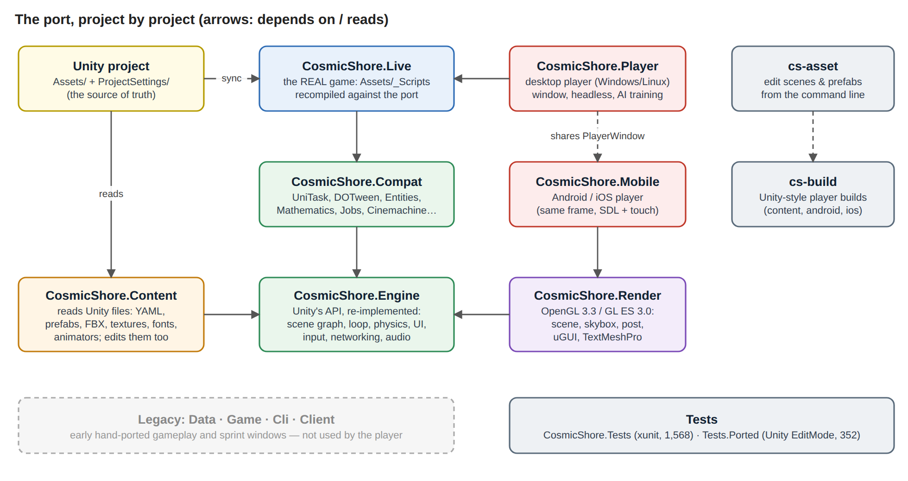
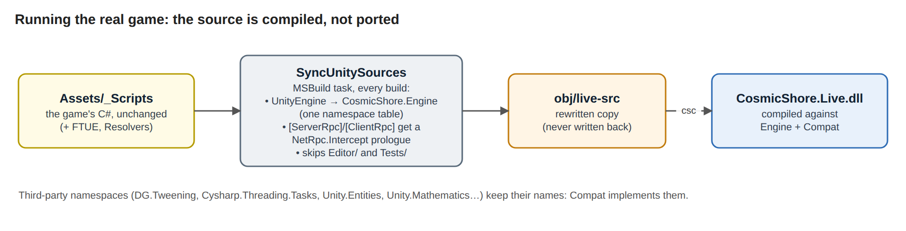
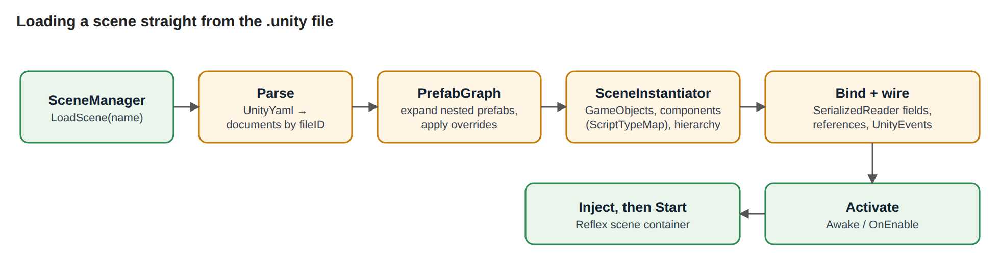
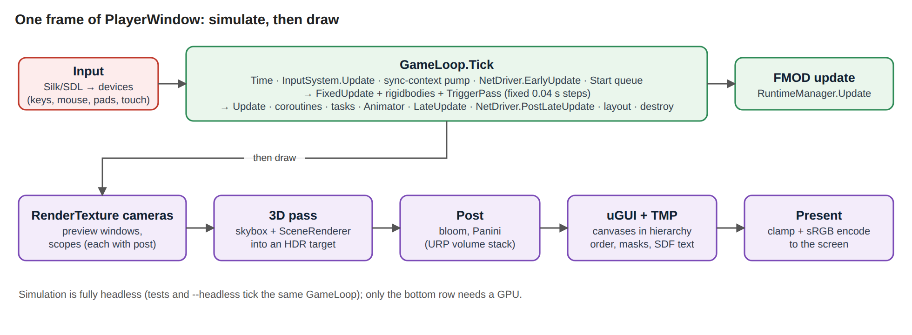
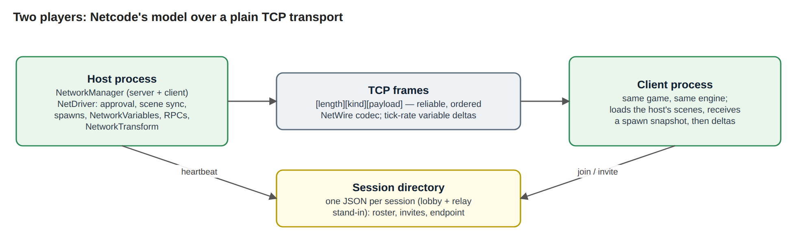
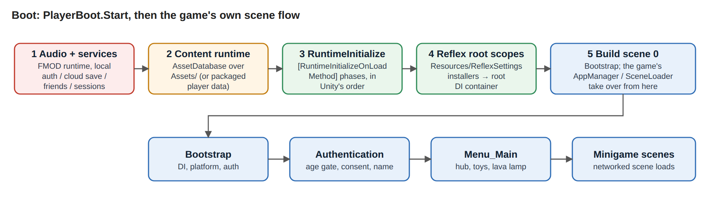
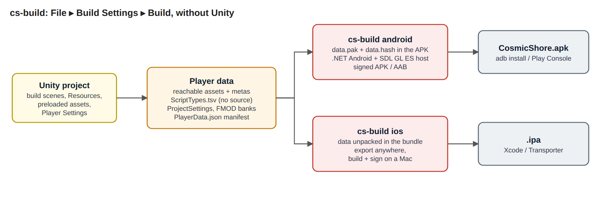
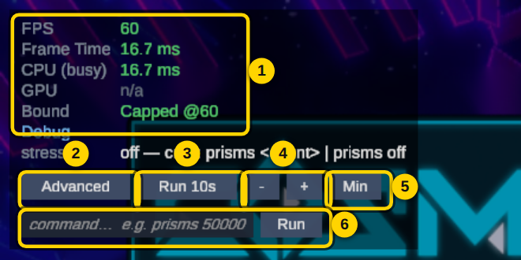
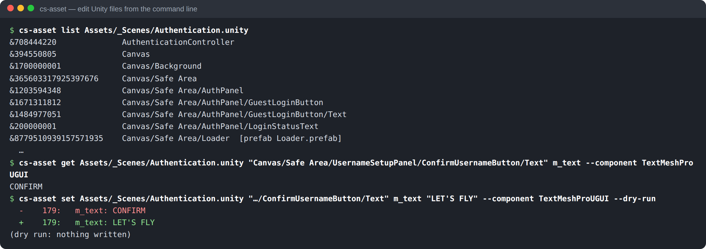
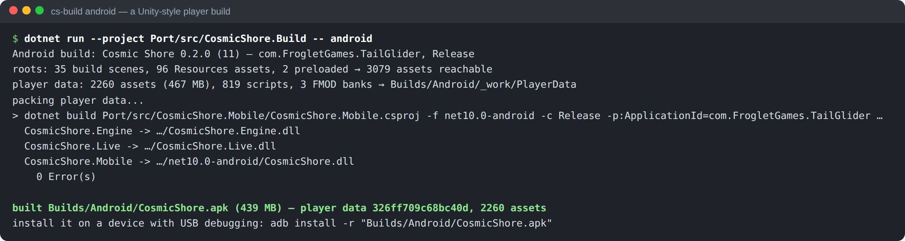

# Prisma v0.1 — Architecture Overview

*The Unity-free engine (the "port") that runs Cosmic Shore: how it is put together, how one frame works, and how to drive it.*

This is the map. Each section ends with where to read more. The deeper documents are
`PORT_PLAN.md` (roadmap and status), `docs/ENGINE_CORE.md`, `docs/AUTHORING.md` (`cs-asset`),
`docs/MOBILE_BUILDS.md` (`cs-build`), `docs/AI_TRAINING.md` and the dated `PROGRESS_*.md` logs.

---

## 1. The idea in one paragraph

The port runs **the real game**, not a rewrite of it. Every C# file under `Assets/_Scripts` is
compiled as-is into one assembly, `CosmicShore.Live`. That assembly is built against a first-party
engine that answers Unity's API: `GameObject`, `MonoBehaviour`, `Transform`, the Input System,
uGUI, TextMeshPro, Netcode and the Unity Gaming Services SDKs. The game's content (scenes,
prefabs, materials, models, textures, fonts, animators and audio banks) is read **straight from
the Unity project's files**. Nothing is exported or converted first. So the Unity project stays
the single source of truth: change a script or a prefab in Unity, and the port runs the change.

**Figure 1.** The projects and how they depend on each other. The graph is simplified: the
players also reference Content, Render and Engine directly.

---

## 2. Projects

| Project | What it is | Depends on |
|---|---|---|
| **CosmicShore.Engine** | Unity's runtime API re-implemented: scene graph, frame loop, physics, uGUI, TextMeshPro layout, Input System, Reflex DI, SOAP, Netcode, UGS stand-ins, FMOD surface | — |
| **CosmicShore.Compat** | Third-party packages in their **original namespaces**: UniTask, DOTween, Entities (+ Entities Graphics), Mathematics, Burst, Jobs, Collections, Cinemachine, Rigging, Timeline, VFX | Engine |
| **CosmicShore.Live** | The game. `Assets/_Scripts` is synced and compiled at build time; no file is hand-ported | Engine, Compat |
| **CosmicShore.Content** | Reads Unity's file formats: YAML scenes and prefabs, metas, FBX, textures, TMP fonts, materials, animators, mixers. Its `Editing/` folder writes them back for `cs-asset` | Engine |
| **CosmicShore.Render** | The OpenGL renderer: scene (uber-shader with the project's material families), skybox, post-processing, uGUI, TMP text. GL 3.3 core, or GL ES 3.0 on phones | Engine |
| **CosmicShore.Player** | The desktop player (`CosmicShore.exe`): window, headless mode, AI training host | Engine, Compat, Live, Content, Render |
| **CosmicShore.Mobile** | The Android/iOS player: the same `PlayerWindow` on an SDL GL ES view, with touch | same as Player |
| **CosmicShore.AssetTool** | `cs-asset`: edit scenes, prefabs and assets from the command line | Content, Live, Compat |
| **CosmicShore.Build** | `cs-build`: Unity-style player builds (player data, Android APK/AAB, iOS) | none (reads files only) |
| **CosmicShore.Launcher** | `Prisma.exe`: pick a branch, fetch, build and play it; Android/iOS builds. Dear ImGui on Silk.NET | none (drives git, `dotnet`, `cs-build`) |
| *Data, Game, Cli, Client* | **Legacy.** Early hand-ported gameplay, headless round drivers and "sprint" windows. The player does not use them; the tests still do | Engine |
| Tests | `CosmicShore.Tests` (xunit, 1,568 tests); `CosmicShore.Tests.Ported` (the project's Unity EditMode tests, 352) | — |

Everything targets .NET 10 (`Directory.Build.props`). The solution is `Port/CosmicShore.slnx`.

---

## 3. Running the real game: the source sync

**Figure 2.** `CosmicShore.Live` compiles the game's own source.

`src/CosmicShore.Live/SyncUnitySources.targets` is an MSBuild task that runs before every build of
`CosmicShore.Live`.

1. **Gathers** `Assets/_Scripts`, `Assets/FTUE`, `ArcadeDPadNav.cs` and `Resources`. It skips
   any path containing an `Editor/` or `Tests/` folder, as a Unity player build does.
2. **Rewrites namespaces** from one table, longest match first. For example:
   - `UnityEngine` → `CosmicShore.Engine`
   - `UnityEngine.UI` and `TMPro` → `CosmicShore.Engine.UI`
   - `Unity.Netcode` → `CosmicShore.Engine.Networking`
   - `Obvious.Soap` → `CosmicShore.Engine.Soap`
   - `FMODUnity` → `CosmicShore.Engine.Audio.Fmod`
   - the UGS SDKs → `CosmicShore.Engine.Services.*`

   Fully-qualified names are rewritten as well as `using` lines.
3. **Stands in for Netcode's IL weaver.** Every `[ServerRpc]` / `[ClientRpc]` method gets a
   first line, `if (NetRpc.Intercept(this, "Name", args)) return;`. That one line routes the call
   over the network, or lets it run locally. An RPC it cannot intercept (a generic method, an
   attribute split over lines, Netcode 2's `[Rpc(SendTo...)]`) is reported as warning
   **`PRISMA001`** at its file and line, never skipped silently: it would run locally instead of
   over the network.
4. **Maps back to the original file.** Each output starts with `#line 1 "<path under Assets/>"`
   and the rewrite keeps line numbers, so compiler errors, stack traces, debugger steps and
   `[CallerFilePath]` name the real `Assets/_Scripts` file and line.
5. **Writes** the result to `obj/live-src`, incrementally. A manifest (`obj/live-src.manifest`)
   records each source's size and timestamp, stamped with the rules file and the source path; an
   unchanged source is neither read nor transformed (~70 ms per sync instead of ~1 s), and an
   output is written only when its text changes. The task never writes back into `Assets/`.

Packages that keep their own namespace (`DG.Tweening`, `Cysharp.Threading.Tasks`,
`Unity.Entities`, `Unity.Mathematics`…) are not rewritten. Compat implements them under those
same names. **One consequence:** the port compiles whatever `Assets/` is checked out. A branch
whose scripts use an API the engine has not implemented yet fails here, at compile time.

*More:* `src/CosmicShore.Compat/README.md`; `PORT_PLAN.md`.

---

## 4. The engine core (`CosmicShore.Engine`)

The engine keeps Unity's type and member names, so the game binds to it without changes. What
sits behind those names is first-party code.

| Area | What it does | Key files |
|---|---|---|
| Object model | `Object` (a destroyed object compares equal to `null`), `GameObject`, `Component`, `Transform` (local TRS is authoritative; world pose is cached), `RectTransform`, scenes | `Object.cs`, `SceneGraph/` |
| Lifecycle | Unity messages (`Awake` … `OnDestroy`, `OnTrigger*`) are found by reflection once per type and bound as open-instance delegates (no `Expression.Compile`, which is slow on iOS's interpreter). They run in Script Execution Order: the `.meta` `executionOrder` (read by Content at boot) overrides `[DefaultExecutionOrder]`, and it orders Awake/OnEnable at a scene load, Start, and every per-frame phase | `SceneGraph/MonoBehaviour.cs`, `LifecycleMethodCache.cs`, `ScriptExecutionOrder.cs` |
| Frame loop | `GameLoop.Tick` (Figure 4). Headless by design: tests tick it directly | `SceneGraph/GameLoop.cs` |
| Time | Frame clock, fixed-step accumulator (the project's 0.04 s), unscaled clock | `Time.cs` |
| Physics | Custom trigger physics. Overlap pairs with a Rigidbody on at least one side whose layers meet in the Layer Collision Matrix (Unity's rules) fire `OnTriggerEnter/Stay/Exit` on the collider's GameObject and its Rigidbody's, sweep-sorted, deterministic. Raycast, SphereCast, OverlapSphere/Capsule/Box and `Collider.ClosestPoint` are supported, and Rigidbodies integrate ballistically. Spheres, oriented boxes and capsules are exact; a mesh is the oriented box of its bounds. A contact pass resolves a dynamic Rigidbody's solid SPHERE against solid colliders and fires `OnCollision*` (the census in §13.1); there is no general solver | `Physics/ShapeMath.cs`, `Physics/ContactPass.cs`, `SceneGraph/TriggerPass*.cs`, `Compat/EngineCompat.cs` |
| Animation | A Mecanim driver: layers, nested state machines, transitions, triggers, 1D/2D/direct blend trees, FBX and `.anim` clips | `Animation/` |
| Input | The Input System (actions, maps, bindings, composites, devices). `TouchFeed` gives EnhancedTouch semantics on phones | `InputSystem/` |
| UI | uGUI: anchors, layout groups, masks, `EventSystem` raycasting and navigation, `Selectable` / `Button` / `ScrollRect` / `InputField`. TMP layout builds SDF glyph quads | `UI/` |
| DI and events | Reflex (`[Inject]`, installers, containers) and Obvious SOAP (variables, events, lists) | `Injection/`, `Soap/` |
| Async | A frame-driven task scheduler; awaits resume on the game-loop thread | `Tasks/` |
| Rendering data | `Mesh`, `Material`, `Camera`, `RenderTexture`, volumes, change tracking. **Data only:** the Render project draws | `Rendering/` |
| Audio | The FMOD Studio surface (`EventReference`, `EventInstance`, buses, VCAs). It runs silent on local state, or drives the real FMOD C API when a native backend is installed (which then also answers event descriptions: one-shot, snapshot, length). `RuntimeManager.EventRecorded` is the parity harness's FMOD channel (starts, restarts, stops, FMOD and Unity mixer snapshots); `FmodGuids` names GUID-only references from the build's `GUIDs.txt` | `Audio/` |
| Networking | Netcode for GameObjects' model over a TCP transport (section 8) | `Networking/` |
| Services | Authentication, Cloud Save, Friends, Leaderboards and Analytics, kept on local disk | `Services/` |

*More:* `docs/ENGINE_CORE.md`.

---

## 5. Content: reading Unity's files (`CosmicShore.Content`)

**`AssetDatabase`**
- Scans every `.meta` under `Assets/` and `Packages/` to map guids to paths.
- Parses files lazily, using a hand-written parser for the YAML subset Unity writes.
- Also accepts **packaged player data** (section 10), which ships no source.

**`ContentRuntime`** is the runtime backend.
- Installs itself as the backend for `SceneManager` and `Resources.Load`.
- Reads `ProjectSettings/`: build scenes, time step, gravity, render pipeline.
- Boots the Reflex root scopes from `Resources/ReflexSettings`.

**Figure 3.** A scene load builds the hierarchy inactive, wires every field, then activates it.
That way `Awake` sees a complete tree, as in Unity.

| Piece | Job |
|---|---|
| `PrefabGraph` | Expands nested prefab instances into one id space. Applies overrides, removed objects and added objects, honouring stripped stand-ins |
| `ScriptTypeMap` | Maps a script's guid to its C# type: the `.cs` path gives the class, the source gives the namespace. Package scripts come from a fixed table |
| `SerializedReader` | Binds YAML onto fields by reflection, nested `[Serializable]` types and references by fileID/guid. Script types follow Unity's serializer exactly (`UnitySerializationRules`): public or `[SerializeField]` fields of a serializable type, `[field: SerializeField]` backing fields, `[FormerlySerializedAs]`, then `OnAfterDeserialize`; properties and private unmarked fields never load. Engine built-ins keep `m_Foo` → `foo` aliases. `cs-asset serialization-audit` measures the difference against Unity (0 dropped, 0 extra) |
| `AssetLoader` | Loads referenced assets: YAML assets, materials, prefabs, animators, and meshes and clips inside FBX files |
| Importers | **FBX** (binary/ASCII, following Unity's axis, scale and winding rules), **textures** (PNG/JPG/TGA/PSD; sprites and 9-slice), **TMP fonts** (Unity's baked SDF atlases), **shaders** (declared properties, so `Material.HasProperty` answers as in Unity), **animators**, **mixers** |

`Editing/` is the writing side, used by `cs-asset`. It edits a file in place and keeps every byte
it did not change; that holds on all 2,030 YAML files in the project.

---

## 6. One frame

**Figure 4.** `PlayerWindow`: the window backend feeds input, the engine ticks, then the renderer
draws.

- **Simulate** (`GameLoop.Tick`), in this order:
  1. Time, the Input System, the synchronization-context pump, and network receive.
  2. Pending `Start`s.
  3. The **fixed steps**: `FixedUpdate`, rigidbodies, then the trigger pass.
  4. `Update`, coroutines and tasks.
  5. The Animator, then `LateUpdate`.
  6. Network send, layout rebuild, destroy queue.
  7. FMOD's update.
- **Draw** (`CosmicShore.Render`), in this order:
  1. Cameras that target a `RenderTexture`, such as preview windows.
  2. The main camera: skybox and scene into an HDR target.
  3. Post-processing: bloom and Panini from the URP volume stack.
  4. uGUI canvases with TMP text.
  5. Present: clamp and sRGB-encode to the screen.

Because the simulation never touches the GPU, `--headless`, AI training and the test suite run the
exact same `GameLoop`.

---

## 7. Rendering (`CosmicShore.Render`)

**`SceneRenderer`** draws every visible `MeshRenderer`, `SkinnedMeshRenderer`, trail and line
renderer, plus Entities Graphics entities. The game's `PrismRenderService` drives prism mass
through those entities.

**Shaders.** It does not run Unity's shaders. One uber-shader reproduces the project's material
families: unlit, lit, the prism fresnel pair, snow, cage, Voronoi, crystal, additive and slice.
The project's own HLSL is translated into GLSL inside it:
- the prism clock animation and sway;
- the occlusion corridor;
- the destruction sight;
- the vessel vision band;
- the cradle and the slice.

**Batching.** Opaque geometry is instanced per (mesh, submesh, material). Transparent geometry
is sorted back to front. A per-instance "clock block" (15 vec4) rides in a texture buffer.

**Culling.** Frustum culling uses cached bounding spheres. Vertex-animated debris is never culled.

**Other passes:**
- `SkyboxPass`: the HyperSea skybox, translated.
- `PostPass`: bloom mip chain and Panini projection. The project authors no tonemapper.
- `UguiRenderer` and `TmpTextRenderer`: canvases in hierarchy order, CanvasGroup alpha,
  RectMask2D, stencil masks, SDF text.
- `PresentPass`.

**GL ES (phones).** `GlCaps` translates every shader at the one compile point
(`#version 300 es` plus precision). It swaps three desktop features for ES 3.0 equivalents:
- texture buffers → a 2D float texture;
- float render targets → half-float or RGBA8;
- base-vertex draws → plain instanced draws.

`COSMIC_SHORE_GLES=1` runs the desktop player on an ES context to check that path.

---

## 8. Networking and online services

**Figure 5.** Two instances party up and play together, on one machine or over a LAN.

**`NetDriver`** carries Netcode for GameObjects' model over TCP. Each frame is
`[length][kind][payload]`, encoded by `NetWire`. It covers:
- connection approval;
- scene synchronization: the joining client loads the host's scenes, then receives a snapshot of
  every spawned object with its NetworkVariables applied before `OnNetworkSpawn`;
- spawns and despawns;
- tick-rate NetworkVariable/NetworkList replication with read/write permissions;
- ownership and parenting;
- `NetworkTransform` interpolation;
- networked scene loads and named messages;
- RPCs, routed by the prologue from section 3.

**The transport seam.** `NetDriver` never touches a socket. It opens an `INetTransport`
(`Networking/Wire/INetTransport.cs`) through `NetDriver.TransportFactory`, and reads its events
in `EarlyUpdate`. The contract is reliable, ordered, whole frames; events come only through `Poll`
on the main thread; peer 0 is the server; a failed connect reports `Disconnected`; a listen on a
taken port throws. TCP (`NetSocket`, `TcpTransportFactory`) was the first implementation, and stays
the engine's in-process default for tests; Froglet's UDP transport (`UdpTransport`: reliable-ordered
fragments with selective acks and RTT-timed resends, plus an unreliable channel) is what every
networked player uses unless `COSMIC_SHORE_NET_TRANSPORT=tcp` (`MULTIPLAYER.md` §6.6). Below it,
an `IDatagramLink` decides where its datagrams go: straight to the peer (`DirectLink`), or through a
relay speaking Unity Relay's protocol (`RelayLink`), which is how players behind home routers reach
each other. Froglet's own relay server (`FrogletRelayServer`, `CosmicShore --relay-server`) speaks
the same protocol and REST shape as UGS Relay (`MULTIPLAYER.md` §6.7). `NetTransportContractTests`
runs the same checks against every implementation (TCP, UDP, UDP through the relay, the in-memory
loopback the tests use, and each behind the network simulator), and `NetDriverTransportTests`
drives the driver's handshake.

**`DirectoryMultiplayerService`** stands in for the UGS Lobby. It keeps one JSON file per
session in a shared folder: roster, per-player properties (the game's invite channel), heartbeat,
and the host's endpoint, or its relay join code when `COSMIC_SHORE_RELAY` names a relay (the host
allocates before it starts listening; a joiner joins by code).

**Services** are local stand-ins:
- Authentication: an anonymous id persisted per install. Separately, with `COSMIC_SHORE_RELAY=ugs`
  the relay signs in to UGS itself (`UgsAuthentication`, REST, one UGS player per save profile) to
  get the bearer token UGS Relay needs (`MULTIPLAYER.md` §6.8).
- Cloud Save: a JSON file.
- Friends: an empty friend book.
- Leaderboards and Analytics: in memory.

**Turning it off:** `COSMIC_SHORE_NET=off` keeps everything in one process. A second player on one
machine runs with `COSMIC_SHORE_PROFILE=b`. A headless player in a multiplayer run needs
`--realtime`, which keeps its game clock on the wall clock (`RealtimePacer`).

**The plan, the backends and the test tools** (simulator, stats, faults, the Launcher's
MULTIPLAYER panel, the UDP transport) are in `MULTIPLAYER.md`.

---

## 9. Boot

**Figure 6.** `PlayerBoot.Start`, then the game's own flow.

1. **Audio and services.** The player brings up FMOD and the local service backends.
2. **Content.** It creates the content runtime over the project (or packaged data).
3. **Initialization.** It runs the `[RuntimeInitializeOnLoadMethod]` phases in Unity's order.
4. **DI.** It builds the Reflex root container.
5. **First scene.** It loads build scene 0.

From there the game's own `AppManager` and `SceneLoader` drive the flow: Bootstrap →
Authentication → Menu_Main → minigames. Those scenes are the ones in `ProjectSettings/EditorBuildSettings`.

---

## 10. Builds: desktop and phones

**Figure 7.** `cs-build` applies Unity's own inclusion rules, then hands off to the platform
toolchain.

- **Desktop.** `CosmicShore.Player` runs against the project folder. The Windows zip in `dist/`
  must sit inside a clone, because it reads `Assets/`.
- **Phones.** `cs-build` writes the **player data**:
  - enabled build scenes, `Resources/` and preloaded assets, followed through every reference;
  - no `Editor/` folders and no source;
  - each script's identity in `ScriptTypes.tsv`;
  - `ProjectSettings/` and the FMOD banks.

  Today that is 2,260 files, 467 MB. Then:
  - **Android:** an APK/AAB with the data packed inside, unpacked on first launch. Signed with the
    debug key unless you pass a keystore.
  - **iOS:** exported anywhere, built and signed on a Mac.

*More:* `docs/MOBILE_BUILDS.md`.

---

## 11. Using the engine: screens and controls

The port has **no editor window**. Unity stays the editor; the port is the **launcher**, the
**player** and two command-line tools. The screenshots below are the engine's own surfaces.
Numbered badges mark what to click.

### 11.1 The launcher (start here)

`Prisma.exe` (`Port/dist/Prisma-Windows.zip`) is the one file to give a tester.
Full guide: `docs/LAUNCHER.md`.

**Figure 8.** PLAY: the branch, **START** (fetch, compile that branch, launch), four quick
toggles, and small buttons to update without playing or open the workspace. The left rail holds
the pages; the two dots under it are git and .NET; the bottom bar shows the current step,
progress and CANCEL.

**Figure 9.** BUILD: one card per phone. Android builds an APK or AAB. iOS builds an unsigned
`.ipa` on GitHub's free Mac (no Mac needed; install with Sideloadly), exports an Xcode project,
or on a Mac builds a signed `.ipa`. Everything else is folded under *Options*.

**Figure 10.** PROJECT: the engine's own Project Settings (`Port/ProjectSettings/PrismaProject.json`),
so Unity's `ProjectSettings/` is never edited. PLAYER (names, version, bundle ids, build numbers),
SCENES (Scenes In Build, shown), QUALITY (MSAA, render scale, filtering, vsync). Empty fields
inherit Unity's values.

**Figure 11.** CLAUDE: Claude Code inside the launcher, working in the branch's workspace.
ASK reads only, EDIT may change files, AUTO may also run commands.

### 11.1b Other ways to start it

| How | Command |
|---|---|
| From source | `cd Port && dotnet run --project src/CosmicShore.Player` |
| Open one scene directly | `CosmicShore --scene Menu_Main` |
| No window (fast checks) | `CosmicShore --headless --frames 600` |
| Phone render path on desktop | `COSMIC_SHORE_GLES=1 CosmicShore` |

### 11.2 Flying (keyboard)

| Key | Action |
|---|---|
| **W A S D** | Left stick |
| **P ; L '** | Right stick |
| **Left Shift / Right Shift** | Left / right trigger |
| **Space · R · Q** | Ability buttons 1 · 2 · 3 |
| **E** | Flip / throttle |
| Mouse | The stick, on one-thumb vessels (Sparrow, Serpent, Scarab…) |
| **C** | Look back (rear view) |
| **Escape** | Overview / leave flight |
| **0** | Screenshot (UI-free) |
| **F11** | Fullscreen |

Gamepads work as in the Unity build. On phones, touch replaces all of these and the game uses its
own touch controls.

### 11.3 The diagnostics panel (top-left)

**Figure 12.** The game's `DiagnosticsHUD`.

| # | Control | What it does |
|---|---|---|
| 1 | Readout | FPS, frame time, CPU time, what bounds the frame |
| 2 | **Advanced** (F6) | Adds the CPU thread breakdown |
| 3 | **Run 10s** (F5) | Runs a timed diagnostic and reports it |
| 4 | **− / +** | Shorten or lengthen that run by 5 s |
| 5 | **Min** | Shrink the panel; click it again to restore |
| 6 | Command box + **Run** | Type a registered command, e.g. `prisms 50000` (a stress test) or `prisms off` |
| — | **F7** | Show or hide the panel |

### 11.4 Player command-line options (testing)

| Option | Use |
|---|---|
| `--scene NAME` | Boot straight into a scene |
| `--size WxH` | Window size |
| `--frames N` | Quit after N frames |
| `--screenshot out.png` / `--shot F:path` | Capture frame F |
| `--do "F:click X,Y"` · `type TEXT` · `key NAME` · `hold NAME N` · `pad BUTTON` | Scripted input (how these screenshots were made) |
| `--do "F:inspect OBJECT Component"` · `eval Type.Member` | Print live state at frame F |
| `--record DIR:FROM-TO` | Record frames (`tools/record_session.sh` makes a video) |
| `--headless` · `--verbose` · `--seed S` | No window · every log channel · reproducible runs |
| `--train train\|replay\|eval` | The game's AI genetic training (`docs/AI_TRAINING.md`) |

Environment variables:
- `COSMIC_SHORE_AUDIO=off|wav:PATH|nrt` (`nrt`: the FMOD runtime and banks, no output, mixed only on the engine's tick; what `engine_parity` runs)
- `COSMIC_SHORE_NET=off`
- `COSMIC_SHORE_PROFILE=b` (second install)
- `COSMIC_SHORE_PROJECT=DIR` (use another project or packaged data)
- `COSMIC_SHORE_GLES=1`

### 11.5 The command-line tools

**Figure 13.** `cs-asset`: list a scene's objects, read a field, change it. `--dry-run` shows the
change without writing it. Close the scene in Unity before writing to it.

**Figure 14.** `cs-build android`: player data, then a signed APK. On Windows, double-click
`Port\build-android.bat`.

### 11.6 Agents: the control port and the MCP server

`--control-port N` opens a local HTTP endpoint (127.0.0.1 only) on a running player. Each
request is one command - `state`, `do click X,Y`, `wait N`, `screenshot`, `find`, `hierarchy`,
`get`/`set` a live component member, `ui_at X,Y`, `dump_ui`, `logs`, `scene`, `quit` - run on the
main thread between frames, where a `--do` step runs (`src/CosmicShore.Player/ControlServer.cs`).

`cs-mcp` (`src/CosmicShore.Mcp`) wraps it, plus build, test and the Unity isolation check, as an
MCP server, so Claude Code drives the engine with tools: `engine_build`, `engine_test`,
`engine_smoke` (a headless boot that answers PASS/FAIL with every logged problem),
`unity_isolation_check`, `game_start` / `game_stop`, `game_screenshot` (returned as an image),
`game_input`, `game_wait`, `game_find`, `game_hierarchy`, `game_get` / `game_set`, `game_ui_at`,
`game_dump_ui`, `game_logs`, `game_load_scene`. On a server without a display it runs the game
under `xvfb-run`. Connect it with `claude mcp add prisma -- dotnet run --project
Port/src/CosmicShore.Mcp --` or `claude --mcp-config Port/.mcp.json`; the launcher's CLAUDE page
connects it on its own. `Port/CLAUDE.md` is the agent's guide.

`--session-report PATH` makes the player write a JSON report when it closes or crashes (scenes,
frame-time percentiles, distinct errors/warnings/exceptions, crash, branch and commit); the
launcher passes one for every play session. Prisma folds them into **tracks** (`src/Shared/PrismaTracks.cs`:
runs, per-scene performance, features, audio, problems grouped across runs) and keeps a task and
bug **board** (`src/Shared/PrismaBoard.cs`) that it and its agents suggest items to. Two agent
scopes run in the app: the Prisma Agent (the game; `Port/` is denied) and milestone sessions
(the engine; the Unity project is denied). The MCP server exposes `prisma_tracks`, `prisma_board`
and `prisma_board_suggest`. Where the engine is going: `docs/ROADMAP.md` and `docs/milestones.json`.

---

## 12. Testing and verification

| Layer | How |
|---|---|
| Engine, content, networking, services, gameplay | `dotnet test tests/CosmicShore.Tests`: ~1,590 tests in about 70 s, no GPU. Includes execution order, Unity's serialization rules, the tracks/board criteria, and `RenderBoundaryTests` (GL only inside `CosmicShore.Render`) |
| The project's own Unity tests | `dotnet test tests/CosmicShore.Tests.Ported`: 352 tests, verbatim |
| File round-trip | `cs-asset roundtrip`: every YAML file parses and writes back byte-identical |
| Loader vs Unity's serializer | `cs-asset serialization-audit`: every YAML key Unity reads, Prisma reads too, and nothing more (exit 1 otherwise) |
| RPC coverage | The source sync warns `PRISMA001` for any RPC it cannot intercept (0 today) |
| Run data | Every launcher play writes a session report (frame, CPU-per-phase, allocation, GC, audio, problems); Prisma's tracks compare it with earlier runs |
| Rendering | Scripted windowed runs with screenshots, under xvfb on Linux |
| Shaders on phones | Every shader is translated and compiled by the Khronos GLSL ES reference compiler (`GlslEsTranslationTests`) |
| Fidelity | `--train replay` re-scores a generation Unity already scored and reports the difference |

---

## 13. Known gaps and deliberate differences

| Area | Status |
|---|---|
| Physics | Contacts for dynamic spheres only (the census below); a dynamic body with any other solid shape gets no contacts and a one-time warning. Meshes are the oriented box of their bounds. Since 2026-10-08 a trigger pair needs a Rigidbody on one side, as in Unity (two static triggers stay silent), and the layer collision matrix (with each collider's include/exclude layers) filters trigger pairs as it does contacts. Gravity is not simulated (no live user) |
| Shaders | Material families are reproduced, not Unity's compiled shaders. A new Shader Graph needs a translation in `SceneRenderer` |
| Online services | Local stand-ins: no real UGS accounts, cloud or leaderboards |
| Provenance | No Unity binary is used. Two spots still follow Unity source too closely (TMP SDF text-shader terms, a Voronoi hash from Unity's docs) and are queued for clean rewrites: `docs/LEGAL_REVIEW.md`. Third-party notices: `THIRD_PARTY_NOTICES.md` |
| Animation Rigging, Timeline, VFX Graph | Data only; they do not animate or emit |
| GPU-buffer drawing | `GraphicsBuffer`/`ComputeBuffer` hold their data on the CPU, and `Graphics.RenderMeshPrimitives` (procedural instancing) draws nothing. The renderer is GL 3.3 / GL ES 3.0, so `SystemInfo.maxComputeBufferInputsVertex` is 0, as Unity reports on such a device. The swarm and substrate fauna check that and skip their member "hearts"; their bodies are prism entities, which Prisma draws. The swarm cell itself (entered through the Cell Selector in Menu_Main) has not been flown in Prisma yet |
| Phones | Android APK builds, but has not been run on a device yet. iOS needs a Mac. Android audio needs `git lfs pull` |
| Branches | `CosmicShore.Live` compiles whatever `Assets/` is checked out. Run the port on the branch it was built for |
| Legacy projects | Data, Game, Cli and Client are kept for their tests; new work goes into Engine, Content, Render or the players |

### 13.1 Physics census (C3, 2026-10-08)

Every runtime use of `Rigidbody` and `OnCollision*` in `Assets/_Scripts`, and the contact behaviour it needs. Only the Astro League ball needs a contact; it is a sphere with bounciness 1 (Maximum) and zero friction (Minimum) hitting spheres, boxes and one capsule, so the contact pass covers it and **no physics library is bound** (ARCHITECTURE_REVIEW E13: BepuPhysics v2 only if mesh contacts or PhysX-like friction are ever needed).

| Script | Use | Contact it needs |
|---|---|---|
| `AstroLeagueBall` | Dynamic body on the server; `OnCollisionEnter/Stay` (contact point, normal, collider); runtime PhysicsMaterial; `excludeLayers` TrailBlocks; `AddTorque` | Sphere vs solid hulls (sphere, rotated box, Rhino's capsule; all kinematic) and vs other balls; restitution, no friction; callbacks after the solve. Court walls are analytic (`AstroLeagueBoundary`), goals poll positions |
| `MantaBomb` | `OnTriggerEnter` on the carrier root | Trigger messages routed to the attached Rigidbody's GameObject |
| `ShapeCollisionTrigger`, `SpawnableShapeBase` | Kinematic carrier + trigger sphere | Trigger only |
| `FullAutoBlockShootActionExecutor`, projectile prefabs | `isKinematic` toggles on trigger carriers moved by script | Trigger only |
| `VesselImpactor`, `ScarabCavitationBlast` | Collider partition by owning Rigidbody | None |
| `PrismOctahedronShield`, `PrismStellatedOctahedronShield`, `PrismStateManager` | `mass` written | None (never read) |
| `ProjectileDetonatorSO` | Zeroes velocities | None |
| `ShipAudioController` | `(Rigidbody)null` to FMOD | None |
| `SkimmerForcefieldCracklePrismEffectSO` | `Collider.ClosestPoint` | Closest point on a rotated box |

Firework and AxeBubble carry solid gravity bodies but nothing references them.
