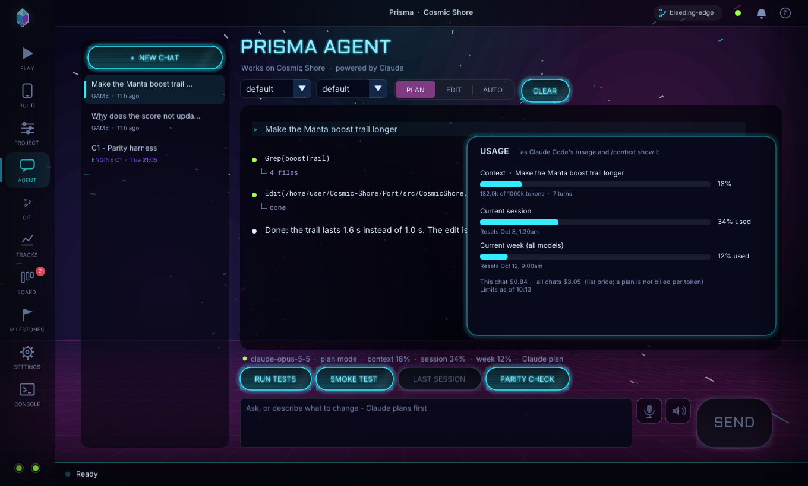
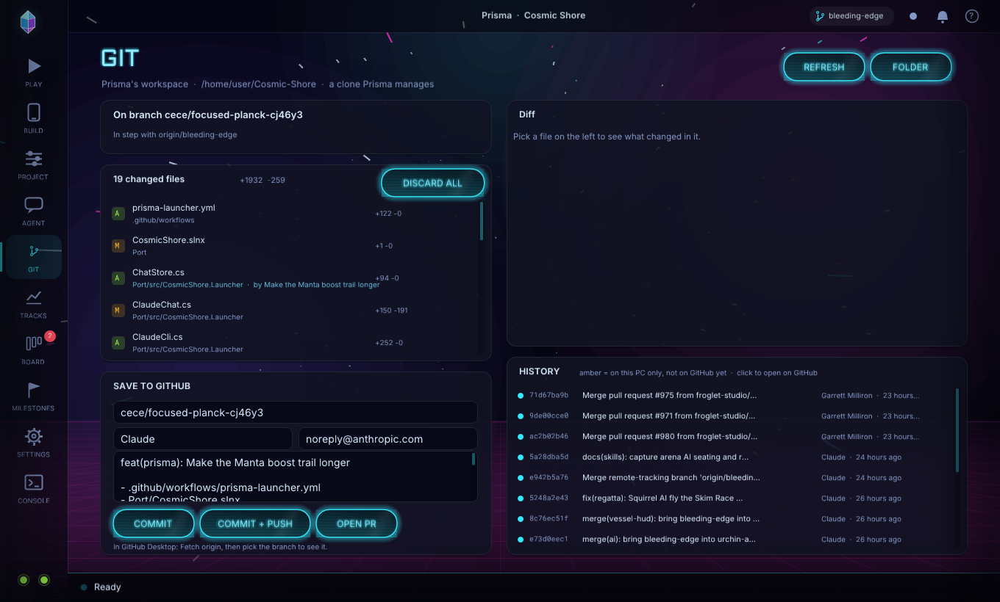
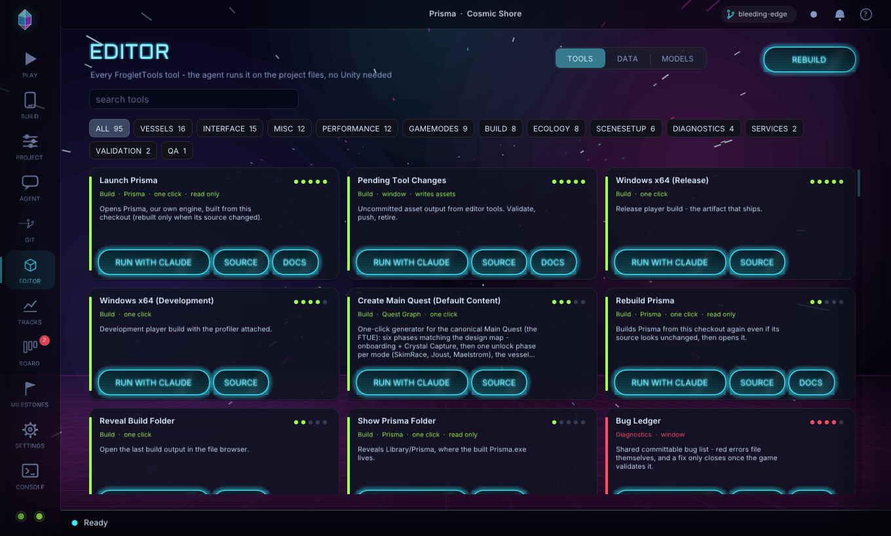
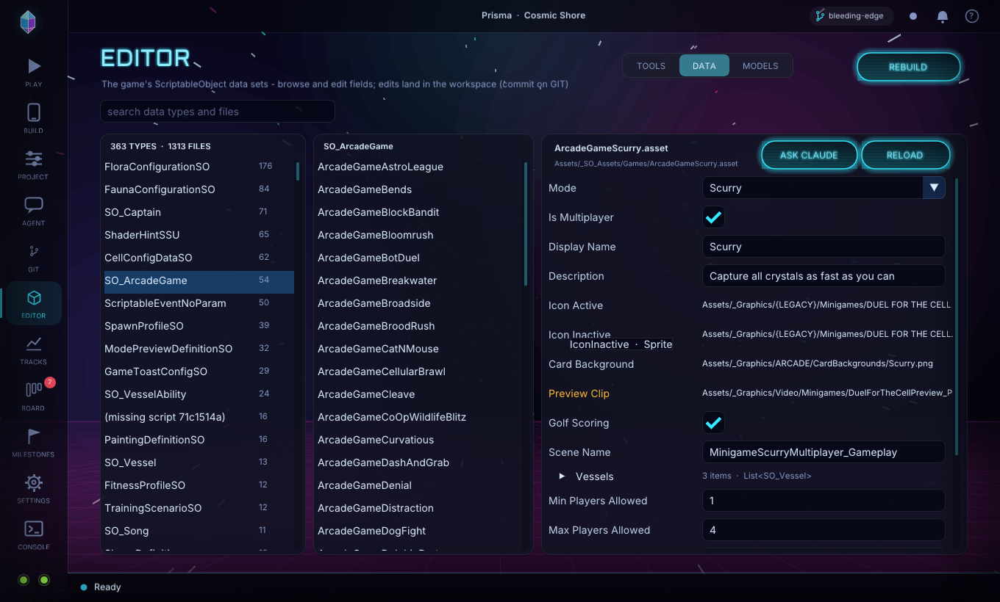
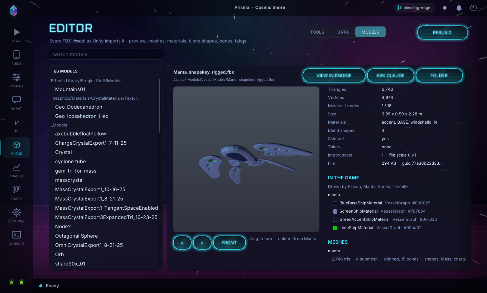

# Prisma (the app)

Prisma is Froglet's own engine for Cosmic Shore, and this is its app: one `.exe` for anyone who
works on or tests the game. Pick a branch, press **START**: Prisma fetches that branch, builds it
from its own source and runs it - and records the run. It also builds phone apps, keeps the
engine's Project Settings, tracks every play run, keeps a task and bug board, and has the **Prisma Agent, powered by Claude**, built in.

Source: `Port/src/CosmicShore.Launcher` (C#, Dear ImGui on our own Silk.NET window).

## Getting the .exe

- **From Unity (the everyday way): FrogletTools > Prisma > Launch Prisma.** It builds
  `Prisma.exe` from the checkout the editor has open into `Library/Prisma` and opens it. After a
  pull it rebuilds by itself (it compares the launcher's source files with the last build); a first
  build takes a minute or two, later launches open at once. *Rebuild Prisma* forces a build, *Show
  Prisma Folder* reveals the .exe. With no .NET 10 SDK yet it opens the copy in
  `Port/dist/Prisma-Windows.zip` instead; press START in Prisma once (it installs its own SDK) and
  later launches build from source. Source: `Assets/_Scripts/Editor/LaunchPrisma.cs`.
- Without Unity: `Port/dist/Prisma-Windows.zip` (one file), or double-click `Port\build-launcher.bat`.

| Needed | Why | If missing |
|---|---|---|
| git (GitHub Desktop is enough) | fetches the branch | install GitHub Desktop |
| .NET 10 SDK | compiles the branch | installed automatically on the first START |
| ~3 GB of disk | project files + build output | - |

## Pages (left rail)

| Page | What it is for |
|---|---|
| **PLAY** | Branch, **START**, and four quick toggles (fullscreen, audio, online, pull first). The small buttons beside them update without playing and open the workspace folder. |
| **BUILD** | One card per phone platform. Each card has one choice and one button; everything else is under *Options*. |
| **PROJECT** | The engine's own Project Settings (below). |
| **AGENT** | The Prisma Agent, powered by Claude: as many chats as you like, side by side (below). |
| **GIT** | What the agent (or you) changed in the workspace, and getting it to GitHub (below). |
| **EDITOR** | TOOLS (every FrogletTools tool, run by the agent), DATA (the data sets, editable) and MODELS (every model in the game's colours; VIEW IN ENGINE) (below). |
| **TIME** | Benchmarks (timed runs of scenes and replays that close themselves, with a results table against the last run) and local multiplayer (2-4 game windows that join each other) (below). |
| **TRACKS** | Every play run: performance per scene, features used, audio, every problem over time (below). |
| **BOARD** | Bugs and tasks, with Prisma's suggestions (below). |
| **SETTINGS** | Folded sections: Game, Source, Look, Claude, Advanced, Toolchain, About (versions). |
| **CONSOLE** | Every command the launcher ran and its output. COPY for a bug report. |


**Prisma and Unity can be on different branches.** Prisma plays its *own* copy of the repository
(the workspace), never your Unity checkout. Opened from Unity (**FrogletTools > Prisma > Launch
Prisma**), it is told where that checkout is and follows the branch Unity / GitHub Desktop has open:
PLAY shows *Same branch as Unity / GitHub Desktop*, and switches with you (checked every few
seconds). Pick any other branch and Prisma plays that one instead, with your Unity checkout
untouched; **FOLLOW UNITY** goes back. A branch that exists only on your machine has to be pushed
from GitHub Desktop before Prisma can fetch it.

The two dots at the bottom of the rail are git and .NET (hover for versions). The bar at the
bottom shows what is happening, a progress bar and CANCEL. The title bar shows the branch, the
agent's state (green: ready on your Claude plan), the notification bell and **?** (the tour).
The first start shows a one-minute tour of every page; **?** replays it.

## TIME - benchmarks and local multiplayer

**BENCHMARK** times the game on this machine. Tick scenes and replays (REPLAY rows are the parity
harness's recorded inputs, `Port/parity/manifest.json`: they fly a real match, so they measure
gameplay rather than an idle scene), pick the length (10 s to 2 min at 60 fps), how many runs of
each (the median is kept), WINDOW (rendered, so GPU time counts) or HEADLESS (simulation only), the
window size, VSync and the .NET garbage collector's mode (default, low latency, or **A/B**: every item
in both, the LOW GC row compared with its default row). **RUN** builds the Release player if the workspace changed since the last
build, then starts one game per scene and run; each closes itself when its frames are done, writes
its session report, and the next one starts. Replays play in PLAY's save slot, so log in once from
PLAY first (a fresh slot stops at the birth-year prompt).

RESULTS shows one row per scene: frame time at the 50th and 95th percentile and the worst frame,
frames over 33 ms, the simulation's 95th percentile, GPU time (timer queries), load time (the scene's switch
to its first frame; hover for boot to first frame), GC pause per frame and
the frame count, each with its change against the previous benchmark on the same machine (green
faster, red slower). Every benchmark is kept in `%LOCALAPPDATA%\Prisma\bench` and can be picked
from the history list. `Prisma --auto bench:Menu_Main,MinigameSkimRace:600` runs a headless
benchmark unattended and closes Prisma when it is saved.

**MULTIPLAYER** opens 2, 3 or 4 game windows on this PC, each in its own save slot (`player1`,
`player2` ...) with networking on and sound only in the first. They share one session folder, so
a party or match hosted in one window shows up in the others: host in one, join from the rest.
Start them at Bootstrap (log in, menu) or straight into a scene. **CLOSE** closes them all.

## TRACKS - Prisma's memory of every run


Every game started from PLAY writes a session report when it closes or crashes. Prisma folds it
into **tracks** (`%LOCALAPPDATA%\Prisma\tracks`): OVERVIEW (runs, crash-free rate, median
frame time, open problems), PERFORMANCE (a *Frame budget* card with simulation and render CPU,
allocations per frame and GC pause per frame, then each scene's 95th-percentile frame time per run
against the 60 fps line), AUDIO (sound events per run, events missing from the banks, unwired one-shots),
FEATURES (modes, vessels and scenes used) and RUNS. A problem is grouped across runs (numbers and
ids stripped), with its first and last sighting; one that stays away for three runs through its
scene goes *quiet*. A run whose steady GC pause tops 1 ms per frame is a performance problem too.
**FIX** hands a problem to the agent; **TRACK** puts it on the board.

## Notifications and clean-ups

After every run a banner (top right) says what the run found - a crash, new problems, a slower
scene, or a clean run - with one-click actions. Prisma also watches for things it can clean up:
a stale git lock blocking updates, a failed build with stale outputs, low disk space. **It always
asks first**: every clean-up is a button on a notification, never automatic. The bell keeps the
history.

## BOARD - tasks and bugs


TO DO / DOING / DONE columns of bugs and tasks; click a card for its detail and to move it, or
hand it to the agent. Prisma *suggests* items - problems from the tracks - and so can the agent (`prisma_board_suggest`); a suggestion joins
the board only when you ACCEPT it.

Every card has a **done when** line: the check that proves it. Type one next to a new item's
title; the agent must give one with every suggestion. A bug that came from the tracks is checked by Prisma itself after every run: when
the problem has stayed away for three runs through its scene, the card gets a green **MET** pill
and a notification offers MARK DONE (moving it stays your call). If the problem comes back, the
card loses MET, and a DONE card reopens to TO DO. A card in DOING tells the agent's brief that a
fix is in progress.

## BUILD


**Android** - APK (install directly) or AAB (Play Store). Options: CPU, keystore, debug.

**iOS** - three ways, picked with the switch on the card:

| Mode | Needs | Produces |
|---|---|---|
| **GITHUB** (default without a Mac) | a GitHub sign-in (GitHub Desktop is enough) | an unsigned `.ipa`, built on GitHub's free Mac and downloaded to `Builds/iOS` |
| **XCODE** | nothing | `Builds/iOS/CosmicShore.xcodeproj` + player data, like Unity's iOS export |
| **THIS MAC** | a Mac with Xcode | a signed `.ipa` |

GITHUB mode runs `.github/workflows/prisma-ios.yml` for the selected branch, shows each
step of the Mac build in the status bar (15-25 minutes), then downloads the `.ipa`. Install it with
**Sideloadly** and a free Apple ID - the same Windows steps as the Unity build
(`Docs/IOS_BUILD.md` section 2, Path A, step 4). OPEN RUN shows the run on GitHub.

Token: GitHub Desktop's sign-in works as-is. With a typed token (SETTINGS > Source) it needs
**Actions: read & write** (fine-grained) or the `workflow` scope. Until the workflow is on the
default branch, the launcher starts it by committing `Port/ios-build-request.txt` to your feature
branch, which needs **Contents: read & write**. A `claude/**` branch never starts it by push
(agent branches are excluded from CI); use Run workflow there.

## PROJECT - the engine's Project Settings


Unity keeps Player Settings and Build Settings in `ProjectSettings/`. The engine keeps its own in
**`Port/ProjectSettings/PrismaProject.json`**, so it never edits Unity's files. Every field is an
override: leave it empty and Unity's value applies (shown greyed in the field).

| Tab | Holds | Read by |
|---|---|---|
| **PLAYER** | company, product name, version, Android package + version code, iOS bundle id + build number | `cs-build` (APK/AAB/IPA/Xcode) |
| **SCENES** | Scenes In Build: enable, reorder (scene 0 boots). USE UNITY'S drops the override | `cs-build`, the game's scene list, the launcher's *Start in* |
| **QUALITY** | anti-aliasing (MSAA), render scale, texture filtering, vsync, frame cap | the player at startup |

Edits save as you make them. Commit the file to share them with the branch.

## Updating the launcher (and keeping old versions)

The launcher never updates itself without asking. When the selected branch has a newer launcher,
an **UPDATE** badge pulses on the rail (Prisma checks at start and every 30 minutes); click it to
see what changed, then **UPDATE NOW** or **NOT NOW**. The new version is built from that branch's
own source in the workspace (no zip to download), the screen shows the build, and the launcher
restarts into it. If a check cannot answer (offline, or the selected branch was merged and
deleted), SETTINGS > ABOUT says why under CHECK. Launching from Unity (above) needs none of this:
it always builds what the checkout has.

SETTINGS > ABOUT shows this launcher's version and lets you **INSTALL** any branch, tag or
commit. Every version you install (and the
one you had before) is kept, and **USE** switches between them, so testers can each run a
different launcher.

## LOOK

SETTINGS > LOOK: eight backgrounds (synthwave, warp, starfield, nebula, aurora, the HyperSea
lattice, plain, or your own picture), six accent themes (Cosmic, and the Jade, Ruby, Gold, Ice
and Mono domain colours), motion speed (down to still), dim, and the intro and page animations.

## Play-session reports

Every game started from PLAY writes a report when it closes or crashes: scenes and time in each,
frame-time percentiles (overall and per scene), simulation and render CPU, the average cost and
allocations of each loop phase, GC collections and pauses, audio use, every distinct error,
warning and exception with its count, and the crash, branch and commit. They are kept in `%LOCALAPPDATA%\Prisma\sessions` (the last
40). The CLAUDE page's LAST SESSION hands the newest one to Claude to analyse.

## AGENT - the Prisma Agent, powered by Claude


The **Prisma Agent** works on the game (Cosmic Shore's code and content in `Assets/`) as it runs
in Prisma, and it is refused any edit to Prisma itself (`Port/`) in every mode - engine work (the
roadmap's milestones) is done in Claude Code at the repository root, not in Prisma. It does what you ask and nothing more: it reads TRACKS (every
run Prisma recorded) only when your question is about a bug, a crash, performance or a run, and
it does not go looking for engine problems on its own.

**Chats.** The list on the left holds every conversation, the way Claude Code keeps sessions:
**+ NEW CHAT** opens another, a click switches, the x deletes. Each chat has its own transcript,
its own Claude Code session (resumed on the next message, also after Prisma restarts) and its own
context, and several can work at once - a pulsing dot marks the ones that are. FIX, AGENT and ANALYSE buttons elsewhere open a fresh chat for the
job. Chats are kept in `%LOCALAPPDATA%\Prisma\chats`.

The layout follows Claude Code: a bullet per message and tool call, each tool's result folded
under it, to-do lists as checklists, the game's screenshots inline.

**Usage**, as Claude Code shows it. The status line under the transcript reads model, mode,
**context** (how full this chat's context window is), and on a Claude plan the **session** (5-hour)
and **week** limits. Click it (or type `/usage`) for the card: a bar for the context (tokens of the
model's window), one per plan limit with when it resets, and what the chats cost (on an API key
that is your bill; on a plan it is list price for reference). Claude reports the limits with
every reply, so they appear after the first one and are remembered.



- **Model** and **effort** on the bar (default / fable / opus / sonnet / haiku; low to max).
- **PLAN**: Claude investigates (it may build, test and run the game) and answers with a plan
  card. **APPROVE + EDIT** or **APPROVE + AUTO** lets it build the plan; typing keeps planning.
  **EDIT** edits files directly; **AUTO** may also run any command. **CLEAR** starts this chat over.
- **Chips**: RUN TESTS, SMOKE TEST (boots the game headless and reports every error), LAST
  SESSION, PARITY CHECK (compares one system with the Unity game, in plan mode).
- **Commands**: `/new /clear /rename TITLE /usage /plan /edit /auto /model NAME /effort LEVEL /test /smoke /session`.
  Up arrow recalls earlier messages.
- **Voice** (Windows): the microphone dictates into the box; the speaker reads replies aloud.

Runs the official **Claude Code** CLI in the workspace, so it reads (and, if allowed, edits) the
branch you are building. If it is not installed, the page offers INSTALL: it downloads Claude Code
(~250 MB, with progress), checks it against Anthropic's published checksum and sets it up. No Node
needed.

**Which account pays.** With a Claude Pro or Max plan, leave the API key empty and press
**SIGN IN** (SETTINGS > Claude, or on the AGENT page): a window opens for the browser sign-in,
and chat then runs on your plan. An **API key** is only for pay-as-you-go billing from
console.anthropic.com; when one is set it is used *instead of* the plan. Keys and tokens are shown
as dots; SHOW reveals them to check a paste. A key is stored only on this PC and passed only to
the `claude` process.

It is connected to the engine itself (the `prisma` tools, `Port/CLAUDE.md`): Claude can
build the engine, start the game, take screenshots, click and type, and read or change live
objects - so "start the game and check the score panel updates" is a request it can carry out
and show you. Those tools never edit files, so PLAN may use them too.

## GIT - from the agent's edits to GitHub



The agent edits files in **Prisma's workspace**, which is not your own clone (it is a clone Prisma
manages, or a worktree beside your clone - SETTINGS > SOURCE). Its edits stay there, uncommitted,
until you decide; the agent does not commit or push unless you ask it to. A notification says when
a chat changed files.

- **Left:** where the workspace is (START leaves it *detached* at the branch you play), then every
  changed file with its +/- lines and **which chat changed it**. Click a file for its diff;
  **REVERT** (hover, click twice) puts one file back; **DISCARD ALL** (click twice) throws every
  change away.
- **SAVE TO GITHUB:** a branch name (suggested from the chat, e.g. `prisma/fix-score`), the author
  (read from your git config, which GitHub Desktop sets) and a message (suggested from the chats
  and files). **COMMIT** commits every change to that branch on this PC; **COMMIT + PUSH** also
  sends it to GitHub; **OPEN PR** opens GitHub's pull-request page for it into your branch.
- **Right:** the selected diff, and the history (amber commits are on this PC only).

**In GitHub Desktop:** with *Beside my clone* the workspace shares your clone, so a commit here
is a local branch in GitHub Desktop at once (you can push from there). With the managed clone,
push here, then **Fetch origin** in GitHub Desktop and pick the branch. Pushing from Prisma uses
git's own sign-in, or the GitHub token in SETTINGS > SOURCE (Contents: read & write).

**START never throws edits away.** With unsaved changes in the workspace, START plays them as
they are and skips pulling the branch (the CONSOLE says so); UPDATE refuses until they are
committed or discarded.

## EDITOR - tools, data sets, models

Prisma's editor starts with what daily content work needs, for a game whose content already
exists (`ROADMAP.md` § M2). There is no hierarchy or scene inspector: scene and prefab edits are
the agent's job, through `cs-asset`. Everything on this page is read through the workspace's own
`cs-asset`, built once per session (a minute or two the first time; **REBUILD** after a pull or a
script edit), and every edit lands in the workspace, where GIT commits it.



**TOOLS** - every FrogletTools menu item in the project (95 on 2026-10-08), read from source: its
category, importance (the dots), description, whether it is a window or one click, and whether it
writes assets. Filter by category or search. **RUN WITH CLAUDE** opens a new agent chat that reads
the tool's source and does its job on the project files without Unity - an audit gives you its
report, a writer plans first (PLAN mode) - or says plainly when the job needs the running Unity
editor. **SOURCE** opens the script, **DOCS** its documentation.



**DATA** - every ScriptableObject data file (1,313 in 363 script types), by type. Pick a file to
see its fields as Unity's inspector labels them, with the script's headers, tooltips (hover) and
ranges. Toggles, numbers (sliders where the script has a `[Range]`), text, enums, vectors and
colours are edited in place: each change is one `cs-asset set` that rewrites only that line. A
reference shows the file it points at; click a data file or model to open it. Keys the script no
longer has are amber (Unity ignores them). **ASK CLAUDE** starts a chat about the file.



**MODELS** - every model by folder: the 66 FBX files, and Blender (`.blend`) and Maya (`.ma`/`.mb`)
files, tagged BLENDER / MAYA. Unity cannot read those two either: its importer runs the installed
Blender or Maya in the background to export an FBX. Prisma does the same (Unity's own export
settings), keeps the FBX until the file changes, and says so plainly when the application is not
installed. SETTINGS > TOOLCHAIN shows whether Blender and Maya were found, their version and path,
with **BROWSE** to point at one Prisma did not find (passed on as `PRISMA_BLENDER` / `PRISMA_MAYAPY`).

Pick a model for a preview **in the colours the game draws it with**: the materials come from the
prefabs that draw its meshes (Manta's model from `Manta.prefab`, VesselGraph's `_Color1`), not from
the model file, whose own materials are usually placeholders. **Drag across the picture to turn it**
(24 views rendered once, about a second), **<** **>** step, **FRONT** faces it. Beside it: what
Unity's importer makes of it (triangles, vertices, meshes and nodes, size, materials, blend shapes,
skinning and bones, animation takes, the `.meta` import scale, warnings) and **IN THE GAME** - the
prefabs that draw it and each mesh's materials with shader and colour swatch. A model with blend
shapes (the vessels' Mass / Charge / Space / Time hull morphs, the crystals' spins) gets a **BLEND
SHAPES** slider each: let go and the turntable is drawn again with those weights; **ZERO** resets them.

**VIEW IN ENGINE** opens the model in Prisma's own renderer - the real shaders, not the CPU
picture - on a turntable: drag to turn, wheel to zoom, right-drag to pan, **F** frame, **R** reset,
**Space** stop/start the spin, **Tab** the next prefab's materials (and the model's own). On screen:
the model, whose colours are shown and its size (top left), the controls (bottom left, **H** hides
them), a live slider per blend shape (top right, drag; **B** zeroes them) and its animation takes
(bottom right: **T** plays the next take, **P** pauses, drag the bar to scrub; a take that moves the
hull morphs moves their sliders too). No game scene loads, and the player is only rebuilt when the
workspace changed since the last build, so it opens in seconds (`CosmicShore --view-model FILE`).
**ASK CLAUDE** starts a chat about the model.

The agent has the same data through MCP: `asset_froglet_tools`, `asset_datasets`,
`asset_dataset`, `asset_model`, `asset_model_preview`.

## How START works

```
git fetch <branch>  ->  FMOD library from Git LFS  ->  dotnet build Port/src/CosmicShore.Player
                    ->  CosmicShore.exe --size ... [--fullscreen] [--scene ...]
```

Settings live in `%LOCALAPPDATA%\Prisma\launcher.json`. The launcher never writes to your
own clone: *Beside my clone* uses a git worktree next to it.

## Testing the launcher itself

`Prisma --page build --screenshot out.png --frames 40` renders a page and exits
(`--page project:1` opens a Project tab, `--page options:look` one settings section, `--page chat:usage` the usage card,
`--page editor:1:Assets/x.asset` an EDITOR tab with a data file or model open).
`PRISMA_DATA_DIR` points all of Prisma's data (settings, chats, tracks, versions) at another
folder - a second, separate Prisma, or the tests. `Port/tests/CosmicShore.Launcher.Tests` covers
chats and their persistence, plan usage and the GIT page's git steps.
`--auto launcher-update:REV` / `launcher-use:SHORT` exercise the version flow. `--auto play|update|android|ios` presses the button on
its own and echoes the log; `--auto "chat:<message>"` sends one chat message; `--auto bench:A,B[:frames[:low|ab]]` runs a headless benchmark (optionally low-latency GC, or both) and exits;
