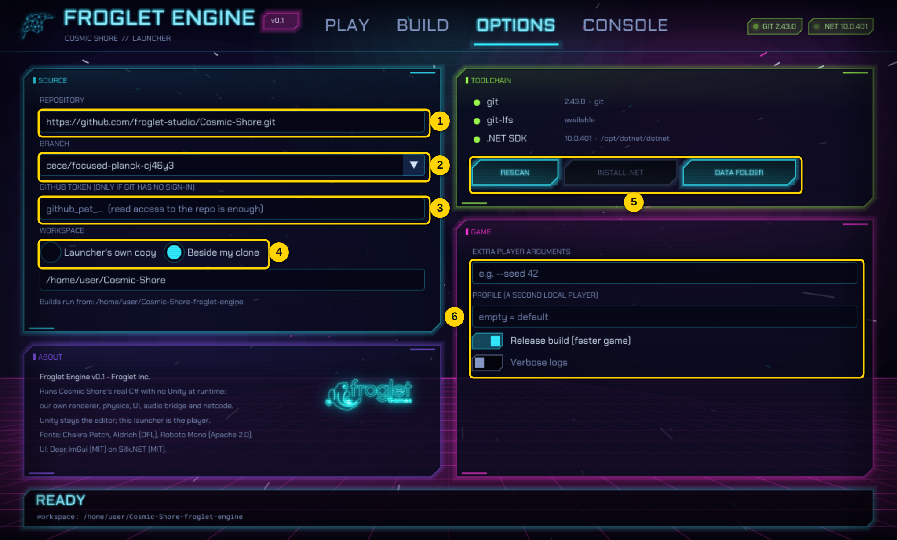
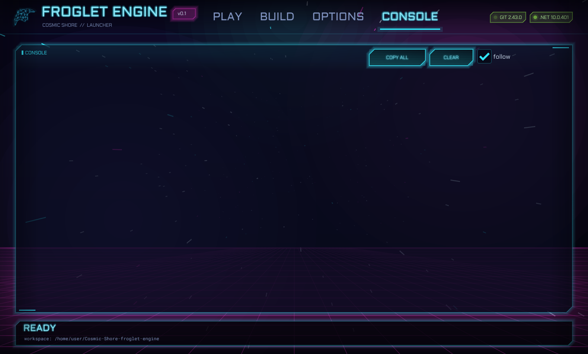

# Froglet Engine Launcher

One `.exe` to hand to anyone who should test the engine. They pick a branch, press
**START GAME**, and the launcher fetches that branch, builds the game from that branch's own
source and starts it. No PowerShell, no Unity, no manual setup.

Source: `Port/src/CosmicShore.Launcher` (C#, Dear ImGui drawn on our own Silk.NET window).

## Getting the .exe

- Ready-made: `Port/dist/FrogletLauncher-Windows.zip` (one 40 MB file, nothing to install).
- Rebuild it: double-click `Port\build-launcher.bat`, or
  `dotnet publish Port/src/CosmicShore.Launcher -c Release -r win-x64 --self-contained -p:PublishSingleFile=true -p:IncludeNativeLibrariesForSelfExtract=true -p:EnableCompressionInSingleFile=true -o Port/dist/launcher`

## What a tester needs

| Needed | Why | If missing |
|---|---|---|
| git (GitHub Desktop is enough) | fetches the branch | the launcher says so; install GitHub Desktop |
| Read access to the repository | the repo is private | sign in to GitHub in git, or paste a token in OPTIONS > SOURCE |
| .NET 10 SDK | compiles the branch | **installed automatically** into the launcher's own folder on the first START |
| ~3 GB of disk | the project's files + build output | — |

## Pages

### PLAY


| # | Control | What it does |
|---|---|---|
| 1 | **Source branch** | Which branch to run. Type to filter; you can also type a branch that is not listed |
| 2 | **REFRESH** | Reload the branch list from GitHub |
| 3 | **START GAME** | Sync the branch, fetch the FMOD audio library, compile, launch. While the game runs it becomes **GAME RUNNING** / **STOP** |
| 4 | **UPDATE** | Only fetch the branch's newest commit |
| 5 | **BUILD PHONE** | Go to the BUILD page |
| 6 | **WORKSPACE** | Open the folder the game is built in |
| 7 | **Launch profile** | Resolution, start scene (from the project's Build Settings), fullscreen, audio, online services, phone render path (OpenGL ES 3.0, exactly as a phone renders), pull-before-play |
| 8 | **In the game** | The keys you fly with |
| 9 | **Pipeline** | Lights up SYNC > AUDIO > BUILD > LAUNCH as START runs |
| 10 | **Pages** | PLAY, BUILD, OPTIONS, CONSOLE |
| 11 | **Tool status** | git and .NET found (green), missing (amber/red) |
| 12 | **Status bar** | What is happening now, the last log line, a progress bar and CANCEL |

### BUILD


| # | Control | What it does |
|---|---|---|
| 1 | **CPU** | arm64 covers every modern phone; add x64 for emulators |
| 2 | **Package** | APK (install directly on a phone) or AAB (upload to the Play Store) |
| 3 | **Signing** | Your keystore and alias; empty = the debug key (fine for testing) |
| 4 | **BUILD APK / AAB** | Produces `Builds/Android/<product>.apk` in the workspace. The first build installs the Android SDK |
| 5 | **EXPORT FOR XCODE / BUILD IPA** | Apple only builds iPhone apps on a Mac: on Windows this exports the complete iOS project (like Unity's Xcode export); on a Mac it builds and signs the **.ipa** |
| 6 | **OUTPUT** | The file that was built, and OPEN FOLDER |

### OPTIONS


| # | Control | What it does |
|---|---|---|
| 1 | **Repository** | The GitHub repository to pull from |
| 2 | **Branch** | Same as the PLAY page's selector |
| 3 | **GitHub token** | Only if git has no GitHub sign-in (private repo). Read-only "Contents" access is enough; stored only on this PC |
| 4 | **Workspace** | *Launcher's own copy*: a shallow clone in `%LOCALAPPDATA%\FrogletEngine\workspace`. *Beside my clone*: a git worktree next to your existing Cosmic-Shore clone, so no second download and your own checkout is never touched (picked automatically when the launcher finds a clone) |
| 5 | **Toolchain buttons** | RESCAN for git/.NET, INSTALL .NET, open the launcher's data folder |
| 6 | **Game** | Extra player arguments, a second local profile, Release/Debug build, verbose logs |

### CONSOLE


Every command the launcher runs and its output, colour-coded. **COPY ALL** puts it on the
clipboard for a bug report.

## How it works

```
START ─► git fetch <branch> (into the workspace, LFS smudge off)
      ─► FMOD library from Git LFS → Port/.native/<platform>   (else the game runs silent)
      ─► dotnet build Port/src/CosmicShore.Player -c Release    (compiles Assets/_Scripts too)
      ─► CosmicShore.exe --size … [--fullscreen] [--scene …]
           with COSMIC_SHORE_PROJECT=<workspace>, COSMIC_SHORE_AUDIO/NET/GLES as chosen
```

Settings live in `%LOCALAPPDATA%\FrogletEngine\launcher.json` (Linux: `~/.local/share`, macOS:
`~/Library/Application Support`). The launcher never writes to a tester's own clone.

## Testing the launcher itself

`FrogletLauncher --page build --screenshot out.png --frames 60` renders a page and exits (this
is how the screenshots here were made). `--auto play` presses START on its own and echoes the
log to stdout — used to verify the full fetch → build → launch run end to end.
