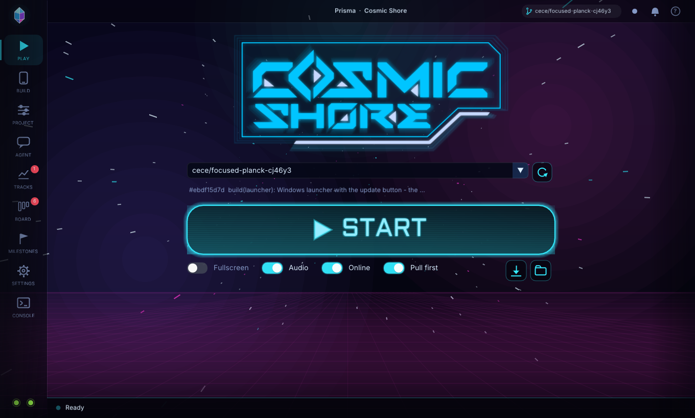
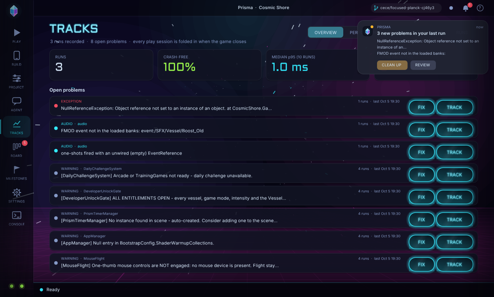
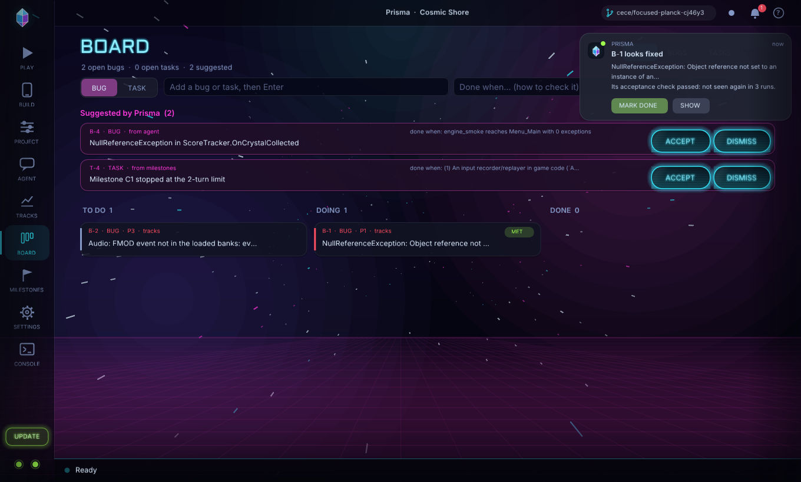
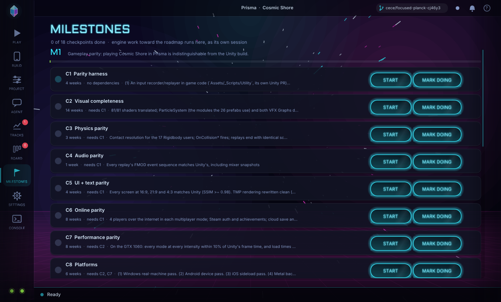
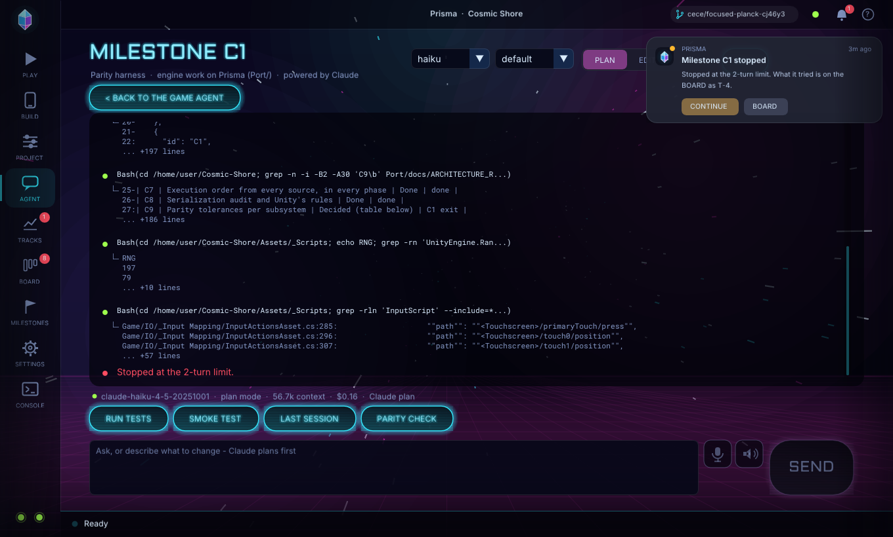
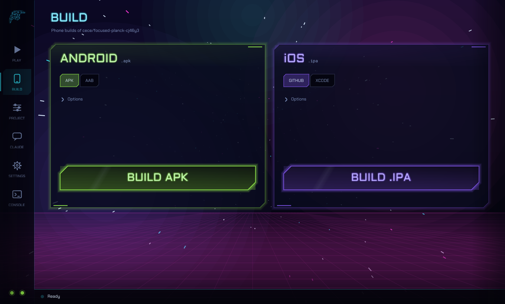
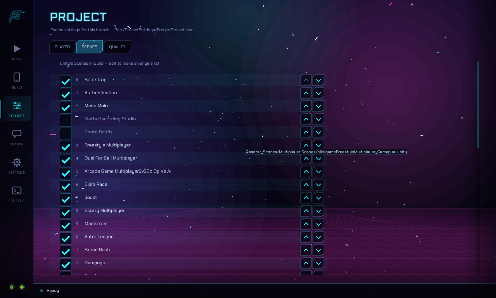
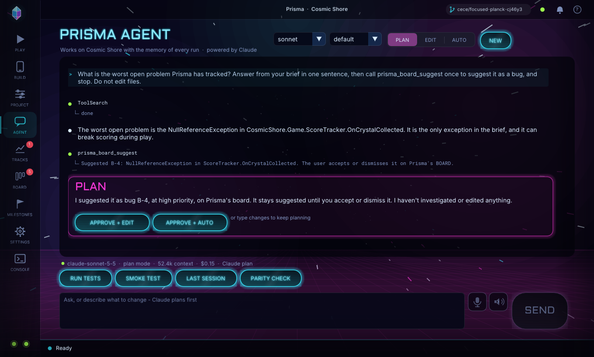

# Prisma (the app)

Prisma is Froglet's own engine for Cosmic Shore, and this is its app: one `.exe` for anyone who
works on or tests the game. Pick a branch, press **START**: Prisma fetches that branch, builds it
from its own source and runs it - and records the run. It also builds phone apps, keeps the
engine's Project Settings, tracks every play run, keeps a task and bug board, runs the roadmap's
milestones, and has the **Prisma Agent, powered by Claude**, built in.

Source: `Port/src/CosmicShore.Launcher` (C#, Dear ImGui on our own Silk.NET window).

## Getting the .exe

- Ready-made: `Port/dist/Prisma-Windows.zip` (one file, nothing to install).
- Rebuild it: double-click `Port\build-launcher.bat`.

| Needed | Why | If missing |
|---|---|---|
| git (GitHub Desktop is enough) | fetches the branch | install GitHub Desktop |
| .NET 10 SDK | compiles the branch | installed automatically on the first START |
| ~3 GB of disk | project files + build output | - |

## Pages (left rail)

| Page | What it is for |
|---|---|
| **PLAY** | Branch, **START**, and four quick toggles (fullscreen, audio, online, pull first). The small buttons beside them update without playing and open the workspace folder. |
| **BUILD** | One card per phone platform. Each card has one choice and one button; everything else is under *Options*. |
| **PROJECT** | The engine's own Project Settings (below). |
| **AGENT** | The Prisma Agent, powered by Claude (below). |
| **TRACKS** | Every play run: performance per scene, features used, audio, every problem over time (below). |
| **BOARD** | Bugs and tasks, with Prisma's suggestions (below). |
| **MILESTONES** | The roadmap's checkpoints; START opens an engine session for one (below). |
| **SETTINGS** | Folded sections: Game, Source, Look, Claude, Advanced, Toolchain, About (versions). |
| **CONSOLE** | Every command the launcher ran and its output. COPY for a bug report. |



The two dots at the bottom of the rail are git and .NET (hover for versions). The bar at the
bottom shows what is happening, a progress bar and CANCEL. The title bar shows the branch, the
agent's state (green: ready on your Claude plan), the notification bell and **?** (the tour).
The first start shows a one-minute tour of every page; **?** replays it.

## TRACKS - Prisma's memory of every run



Every game started from PLAY writes a session report when it closes or crashes. Prisma folds it
into **tracks** (`%LOCALAPPDATA%\Prisma\tracks`): OVERVIEW (runs, crash-free rate, median
frame time, open problems), PERFORMANCE (a *Frame budget* card with simulation and render CPU,
allocations per frame and GC pause per frame, then each scene's 95th-percentile frame time per run
against the 60 fps line), AUDIO (sound events per run, events missing from the banks, unwired one-shots),
FEATURES (modes, vessels and scenes used) and RUNS. A problem is grouped across runs (numbers and
ids stripped), with its first and last sighting; one that stays away for three runs through its
scene goes *quiet*. A run whose steady GC pause tops 1 ms per frame is a performance problem too.
**FIX** hands a problem to the agent; **TRACK** puts it on the board.

## Notifications and clean-ups

After every run a banner (top right) says what the run found - a crash, new problems, a slower
scene, or a clean run - with one-click actions. Prisma also watches for things it can clean up:
a stale git lock blocking updates, a failed build with stale outputs, low disk space. **It always
asks first**: every clean-up is a button on a notification, never automatic. The bell keeps the
history.

## BOARD - tasks and bugs



TO DO / DOING / DONE columns of bugs and tasks; click a card for its detail and to move it, or
hand it to the agent. Prisma *suggests* items - problems from the tracks, the next milestones
whose dependencies are done - and so can the agent (`prisma_board_suggest`); a suggestion joins
the board only when you ACCEPT it.

Every card has a **done when** line: the check that proves it. Type one next to a new item's
title; the agent must give one with every suggestion; a milestone task carries its checkpoint's
exit criterion. A bug that came from the tracks is checked by Prisma itself after every run: when
the problem has stayed away for three runs through its scene, the card gets a green **MET** pill
and a notification offers MARK DONE (moving it stays your call). If the problem comes back, the
card loses MET, and a DONE card reopens to TO DO. A card in DOING tells the agent's brief that a
fix is in progress.

## MILESTONES - engine work, inside Prisma



The roadmap (`docs/ROADMAP.md`) as checkpoints with their exit criteria, weeks and dependencies,
read from `docs/milestones.json` in the branch (commit it to share progress). **START** opens an
engine session for that checkpoint in plan mode with its prompt; that session works on `Port/`
and may not touch the Unity project, and it records progress back into `milestones.json`. It
marks a checkpoint done only after running its exit criterion.

Each milestone run has a **budget**: agentic turns (default 80), wall-clock minutes (default 60)
and optionally dollars, set in SETTINGS > CLAUDE > Milestone budget. A run that reaches a limit,
or fails, stops and leaves a record instead of half-done work: a suggested board task listing every
tool call it made and its last message, a dated note on the checkpoint, and a notification with
**CONTINUE** (the same conversation, a fresh budget) and **BOARD**. Your own STOP leaves none.



## BUILD



**Android** - APK (install directly) or AAB (Play Store). Options: CPU, keystore, debug.

**iOS** - three ways, picked with the switch on the card:

| Mode | Needs | Produces |
|---|---|---|
| **GITHUB** (default without a Mac) | a GitHub sign-in (GitHub Desktop is enough) | an unsigned `.ipa`, built on GitHub's free Mac and downloaded to `Builds/iOS` |
| **XCODE** | nothing | `Builds/iOS/CosmicShore.xcodeproj` + player data, like Unity's iOS export |
| **THIS MAC** | a Mac with Xcode | a signed `.ipa` |

GITHUB mode runs `.github/workflows/prisma-ios.yml` for the selected branch, shows each
step of the Mac build in the status bar (15-25 minutes), then downloads the `.ipa`. Install it with
**Sideloadly** and a free Apple ID - the same Windows steps as the Unity build
(`Docs/IOS_BUILD.md` section 2, Path A, step 4). OPEN RUN shows the run on GitHub.

Token: GitHub Desktop's sign-in works as-is. With a typed token (SETTINGS > Source) it needs
**Actions: read & write** (fine-grained) or the `workflow` scope. Until the workflow is on the
default branch, the launcher starts it by committing `Port/ios-build-request.txt` to your feature
branch, which needs **Contents: read & write**.

## PROJECT - the engine's Project Settings



Unity keeps Player Settings and Build Settings in `ProjectSettings/`. The engine keeps its own in
**`Port/ProjectSettings/PrismaProject.json`**, so it never edits Unity's files. Every field is an
override: leave it empty and Unity's value applies (shown greyed in the field).

| Tab | Holds | Read by |
|---|---|---|
| **PLAYER** | company, product name, version, Android package + version code, iOS bundle id + build number | `cs-build` (APK/AAB/IPA/Xcode) |
| **SCENES** | Scenes In Build: enable, reorder (scene 0 boots). USE UNITY'S drops the override | `cs-build`, the game's scene list, the launcher's *Start in* |
| **QUALITY** | anti-aliasing (MSAA), render scale, texture filtering, vsync, frame cap | the player at startup |

Edits save as you make them. Commit the file to share them with the branch.

## Updating the launcher (and keeping old versions)

The launcher never updates itself. When the selected branch has a newer launcher, an **UPDATE**
badge pulses on the rail; click it to see what changed, then **UPDATE NOW** or **NOT NOW**. The
new version is built from that branch's own source (no zip to download), the screen shows the
build, and the launcher restarts into it.

SETTINGS > ABOUT shows this launcher's version and lets you **INSTALL** any branch, tag or
commit. Every version you install (and the one you had before) is kept, and **USE** switches
between them, so testers can each run a different launcher. The zip in `dist/` is only for the
first install.

## LOOK

SETTINGS > LOOK: eight backgrounds (synthwave, warp, starfield, nebula, aurora, the HyperSea
lattice, plain, or your own picture), six accent themes (Cosmic, and the Jade, Ruby, Gold, Ice
and Mono domain colours), motion speed (down to still), dim, and the intro and page animations.

## Play-session reports

Every game started from PLAY writes a report when it closes or crashes: scenes and time in each,
frame-time percentiles (overall and per scene), simulation and render CPU, the average cost and
allocations of each loop phase, GC collections and pauses, audio use, every distinct error,
warning and exception with its count, and the crash, branch and commit. They are kept in `%LOCALAPPDATA%\Prisma\sessions` (the last
40). The CLAUDE page's LAST SESSION hands the newest one to Claude to analyse.

## AGENT - the Prisma Agent, powered by Claude



The **Prisma Agent** works on the game (Cosmic Shore's code and content in `Assets/`) as it runs
in Prisma, and it is refused any edit to Prisma itself (`Port/`) in every mode - engine work is
what MILESTONES sessions are for. Every prompt starts with the tracks brief (the last runs, open
problems, performance by scene), so "fix the crash from my last run" needs no explanation.
The layout follows Claude Code: a bullet per message and tool call, each tool's result folded
under it, to-do lists as checklists, the game's screenshots inline, and a status line (model,
mode, context size, cost, and whether it runs on your plan or an API key).

- **Model** and **effort** on the bar (default / fable / opus / sonnet / haiku; low to max).
- **PLAN**: Claude investigates (it may build, test and run the game) and answers with a plan
  card. **APPROVE + EDIT** or **APPROVE + AUTO** lets it build the plan; typing keeps planning.
  **EDIT** edits engine files directly; **AUTO** may also run any command.
- **Chips**: RUN TESTS, SMOKE TEST (boots the game headless and reports every error), LAST
  SESSION, PARITY CHECK (compares one system with the Unity game, in plan mode).
- **Commands**: `/clear /plan /edit /auto /model NAME /effort LEVEL /test /smoke /session`. Up
  arrow recalls earlier messages.
- **Voice** (Windows): the microphone dictates into the box; the speaker reads replies aloud.

Runs the official **Claude Code** CLI in the workspace, so it reads (and, if allowed, edits) the
branch you are building. If it is not installed, the page offers INSTALL: it downloads Claude Code
(~250 MB, with progress), checks it against Anthropic's published checksum and sets it up. No Node
needed.

**Which account pays.** With a Claude Pro or Max plan, leave the API key empty and press
**SIGN IN** (SETTINGS > Claude, or on the CLAUDE page): a window opens for the browser sign-in,
and chat then runs on your plan. An **API key** is only for pay-as-you-go billing from
console.anthropic.com; when one is set it is used *instead of* the plan. Keys and tokens are shown
as dots; SHOW reveals them to check a paste.

- **ASK** - reads and plans, changes nothing.
- **EDIT** - may edit files in the workspace.
- **AUTO** - may also run commands.

It is connected to the engine itself (the `prisma` tools, `Port/CLAUDE.md`): Claude can
build the engine, start the game, take screenshots, click and type, and read or change live
objects - so "start the game and check the score panel updates" is a request it can carry out
and show you. Those tools never edit files, so ASK may use them too.

NEW starts a fresh conversation; otherwise each message continues the same session. A key is
stored only on this PC and passed only to the `claude` process. Rebuild with START to try what it changed.

## How START works

```
git fetch <branch>  ->  FMOD library from Git LFS  ->  dotnet build Port/src/CosmicShore.Player
                    ->  CosmicShore.exe --size ... [--fullscreen] [--scene ...]
```

Settings live in `%LOCALAPPDATA%\Prisma\launcher.json`. The launcher never writes to your
own clone: *Beside my clone* uses a git worktree next to it.

## Testing the launcher itself

`Prisma --page build --screenshot out.png --frames 40` renders a page and exits
(`--page project:1` opens a Project tab, `--page options:look` one settings section).
`--auto launcher-update:REV` / `launcher-use:SHORT` exercise the version flow. `--auto play|update|android|ios` presses the button on
its own and echoes the log; `--auto "chat:<message>"` sends one chat message;
`--auto milestone:C1` presses a checkpoint's START.
