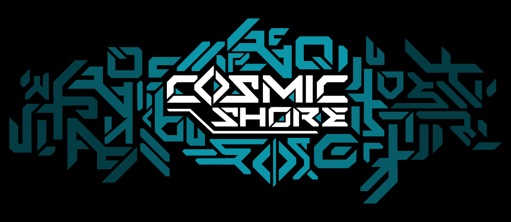
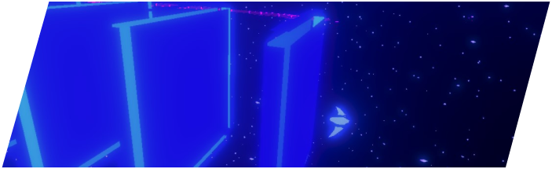
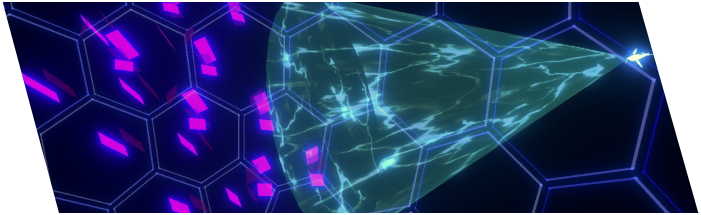
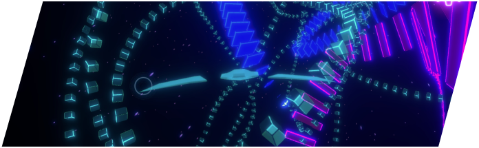
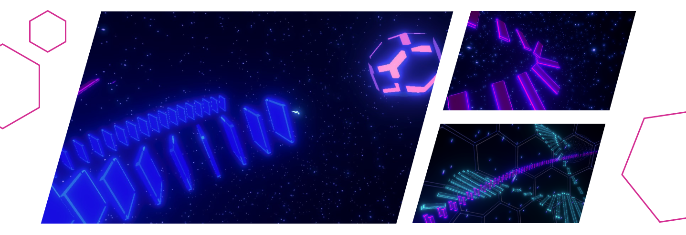
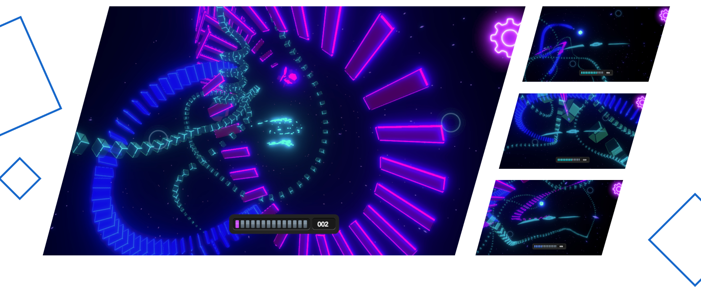

# Cosmic Shore

This is a Live Service Mobile Game source code repository for [Cosmic Shore](https://www.froglet.games/)\
It’s your game and you can play it your way, with genre-crossing Classes and every level of engagement: from casual, hotseat minigames and rewarded dailies to team missions and a structured esport.

*Please don't forget to play and give feedback!*

 

*Also don't forget to join our community!*

 

---

## Gameplay

### Create

Every HyperSea-worthy vessel is capable of enhancing its colored mass output. Pacifying or controlling biomes is only possible if your color is the majority of mass in the biome. Producing mass is the fundamental way to win a majority and refuel along your journey.

### Disrupt

Every vessel is also equipped with the ability to destroy, steal, shrink or otherwise disrupt other colors of mass. Filling populated biomes with additional mass can make them more hostile. Sometimes reducing hostile mass is your only option.

### Maneuver

Maneuvering through the HyperSea is usually a thrilling delight. Knowing where and when to create your own or disrupt enemy mass is pivotal to victory. Each vessel has its own unique abilities to get where they need to be or otherwise extend their reach.

GET THE CRYSTAL (2-4 PLAYERS)
Inspired by games like Ultimate Chicken Horse and Jenga, players progressively increase the challenge until a winner remains.
DOLPHIN DARTS (1-2 PLAYERS)
Accurately drift into crystals to blow up more of the dartboards than your opponent.
RANSACK RALLY (1-4 PLAYERS)
Skim past trails on your way to a biome. Whoever steals more along the way wins.
FREESTYLE TOYBOX (1 PLAYER)
No rules, time, or score. Do what you want for as long as you like. This is not a game; enjoy the toys.

## Missions

Couriers, refugees, colonists, and more all need safe passage across the galaxy. Navigating the HyperSea is the only practical way to turn 100 light years into a five minute journey. Join the Cosmic Shore’s roster of elite guides, leading and protecting the galaxy's travelers as they brave the hazards of the HyperSea.

## Sport

A stepping stone to our future dreams of a multi-biome esport, Duel for the Cell provides replayability with different teammates, opponents, and difficulties in every match, all of which can be enjoyed in a variety of environments with their own unique flora, fauna, and effects. Duel for the Cell is a 1v1 match with every player creating mass in the form of trail blocks, and disrupting mass by shielding, stealing or otherwise affecting them. The main objective is to have the greatest mass volume by the end of the match. This adds a third dimension to the classic strategy game focus on area control.

## New Features

- [x] Feature complete ships: Manta, Dolphin, Rhino.
- [x] Player controllable Urchin and Grizzly.
- [x] Boid prototypes that simulating the behavior of real marine lives.
- [x] Mini-games that allow players to experiment with our unique ship abilities.
- [x] Leaderboards for displaying scores of mini-games.
- [x] Updated new UI elements.

## Upcoming Updates

- [ ] AI for Urchin, Grizzly.
- [ ] In-game store and trading.
- [ ] Daily rewards.
- [ ] Player grouping.
- [ ] Re-desgined UI for upcoming new features.
- [ ] Analytics.
  
## Copyright and License

Copyright 2022 - 2023 © Froglet Games, Inc. Code released under the [MIT](./LICENSE) license.

