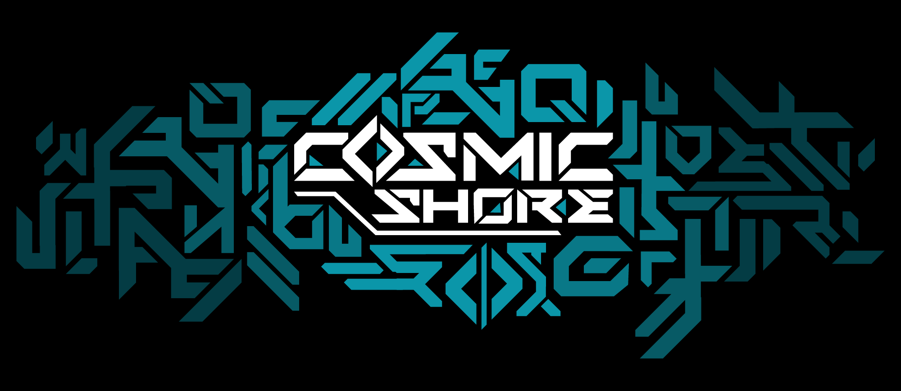
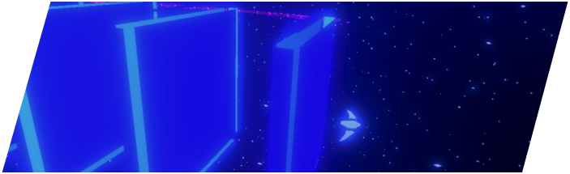
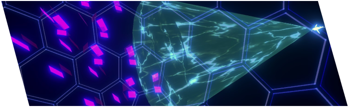
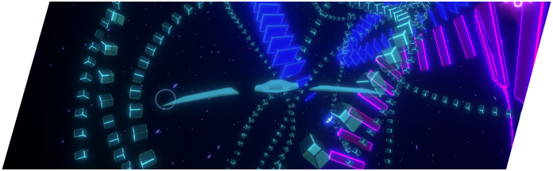
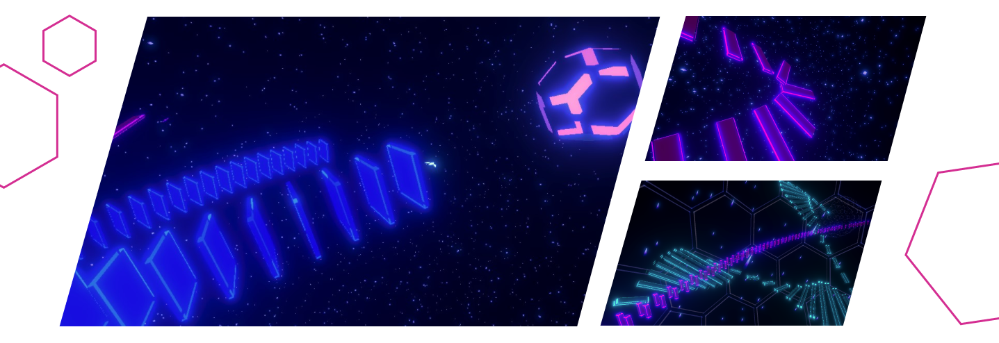
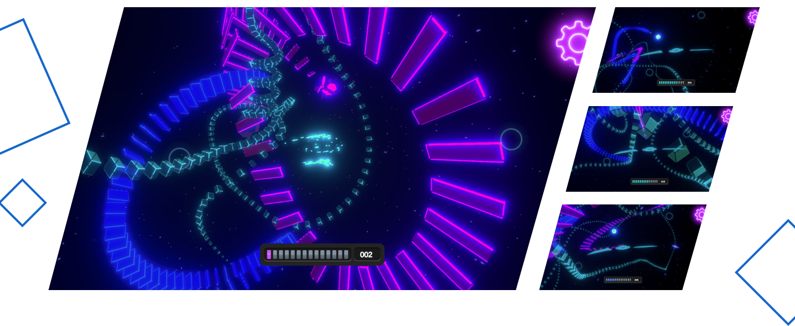

# Cosmic Shore



This is the source code repository for [Cosmic Shore](https://www.froglet.games/), a multigenre space game — "the party game for pilots" — developed by [Froglet Inc.](https://www.froglet.games/), a Delaware C-corp based in Grand Rapids, MI.

Different vessel classes embody gameplay from different genres to connect players across demographics: from casual, hotseat minigames and rewarded dailies to team missions and a structured esport. It's your game and you can play it your way.

*Please don't forget to play and give feedback!*

[](https://frogletgames.itch.io/cosmic-shore) [](https://testflight.apple.com/join/9ReKxeGf)

*Also don't forget to join our community!*

[](https://discord.com/invite/84TCx5ERjY) [](https://www.reddit.com/r/CosmicShore/)

---

## Vessel Classes

Each vessel embodies a different genre of gameplay:

| Vessel | Genre | Description |
|---|---|---|
| **Squirrel** | Racing / Drift | Vaporwave arcade racer — tube-riding along player-generated trails (F-Zero / Redout feel) |
| **Sparrow** | Shooter | Arcade space combat with guns and missiles |
| **Manta** | — | Feature-complete playable vessel |
| **Dolphin** | — | Feature-complete playable vessel |
| **Rhino** | — | Feature-complete playable vessel |
| **Serpent** | — | Playable vessel |
| **Urchin** | — | Playable vessel (AI in development) |
| **Grizzly** | — | Playable vessel (AI in development) |
| **Termite** | — | In development |
| **Falcon** | — | In development |
| **Shrike** | — | In development |

---

## Gameplay

### Create



Every HyperSea-worthy vessel is capable of enhancing its colored mass output. Pacifying or controlling biomes is only possible if your color is the majority of mass in the biome. Producing mass is the fundamental way to win a majority and refuel along your journey.

### Disrupt



Every vessel is also equipped with the ability to destroy, steal, shrink or otherwise disrupt other colors of mass. Filling populated biomes with additional mass can make them more hostile. Sometimes reducing hostile mass is your only option.

### Maneuver



Maneuvering through the HyperSea is usually a thrilling delight. Knowing where and when to create your own or disrupt enemy mass is pivotal to victory. Each vessel has its own unique abilities to get where they need to be or otherwise extend their reach.

---

## Game Modes

- **Get the Crystal** (2-4 players) — Inspired by games like Ultimate Chicken Horse and Jenga, players progressively increase the challenge until a winner remains.
- **Dolphin Darts** (1-2 players) — Accurately drift into crystals to blow up more of the dartboards than your opponent.
- **Ransack Rally** (1-4 players) — Skim past trails on your way to a biome. Whoever steals more along the way wins.
- **Freestyle Toybox** (1 player) — No rules, time, or score. Do what you want for as long as you like.
- **Duel for the Cell** (1v1) — Create mass as trail blocks and disrupt your opponent's. Greatest mass volume wins.
- **HexRace** (multiplayer) — Competitive multiplayer racing mode.
- **Wildlife Blitz** (1-4 players) — Co-op and competitive variants.
- **Joust** (multiplayer) — Head-to-head combat mode.

## Missions



Couriers, refugees, colonists, and more all need safe passage across the galaxy. Navigating the HyperSea is the only practical way to turn 100 light years into a five minute journey. Join the Cosmic Shore's roster of elite guides, leading and protecting the galaxy's travelers as they brave the hazards of the HyperSea.

## Sport



A stepping stone to our future dreams of a multi-biome esport, Duel for the Cell provides replayability with different teammates, opponents, and difficulties in every match, all of which can be enjoyed in a variety of environments with their own unique flora, fauna, and effects. Duel for the Cell is a 1v1 match with every player creating mass in the form of trail blocks, and disrupting mass by shielding, stealing or otherwise affecting them. The main objective is to have the greatest mass volume by the end of the match. This adds a third dimension to the classic strategy game focus on area control.

---

## Tech Stack

- **Engine**: Unity 6+ with URP (Universal Render Pipeline)
- **Language**: C#
- **Architecture**: ScriptableObject-driven configuration + SOAP (Scriptable Object Architecture Pattern) for event-driven, decoupled communication
- **Async**: UniTask
- **Networking**: Unity Netcode for GameObjects (multiplayer with AI backfill)
- **Camera**: Cinemachine 3.1.2 with per-vessel settings
- **VFX**: VFX Graph, custom HLSL shaders, Shader Graph, procedural skybox
- **Input**: Unity Input System with platform-specific strategy pattern (keyboard/mouse, gamepad, touch)
- **Audio**: Wwise integration
- **Haptics**: NiceVibrations (mobile)
- **Animation**: Timeline, DOTween
- **DI**: Reflex dependency injection
- **Performance**: Unity Jobs + Burst Compiler, Adaptive Performance, DOTS Entities (incremental adoption)
- **Backend**: PlayFab, Firebase, Unity Gaming Services (Analytics, CloudSave, Leaderboards, Multiplayer, IAP, Ads)
- **Testing**: Unity Test Framework (NUnit)
- **Tutorial**: Custom FTUE system with adapter pattern
- **Dialogue**: Custom dialogue system with editor tools
- **Target platforms**: Mobile-first (iOS/Android) with PC/console expansion

---

## Development

See [`CLAUDE.md`](./CLAUDE.md) for architecture patterns, coding standards, and detailed project structure.

See [`GIT_RULES.md`](./GIT_RULES.md) for branching model, commit conventions, and PR standards.

### Project Structure

```
Assets/
├── _Scripts/       # All first-party C# code (~1,100 files)
│   ├── App/        # Application systems (Auth, Audio, IAP, Ads, Quests, etc.)
│   ├── Game/       # Gameplay systems (~600 files)
│   ├── Systems/    # Bootstrap, scene flow, core systems
│   ├── Models/     # Enums, data models
│   ├── Utility/    # SOAP types, effects, pooling, data persistence
│   └── DialogueSystem/
├── _SO_Assets/     # ScriptableObject asset instances
├── _Prefabs/       # Prefabs organized by category
├── _Scenes/        # Game scenes (singleplayer, multiplayer, test)
├── FTUE/           # Tutorial / first-time user experience
└── Plugins/        # Third-party (SOAP, DOTween, etc.)
```

---

## Copyright and License

Copyright 2022 - 2026 Froglet Inc. Code released under the [MIT](./LICENSE) license.


